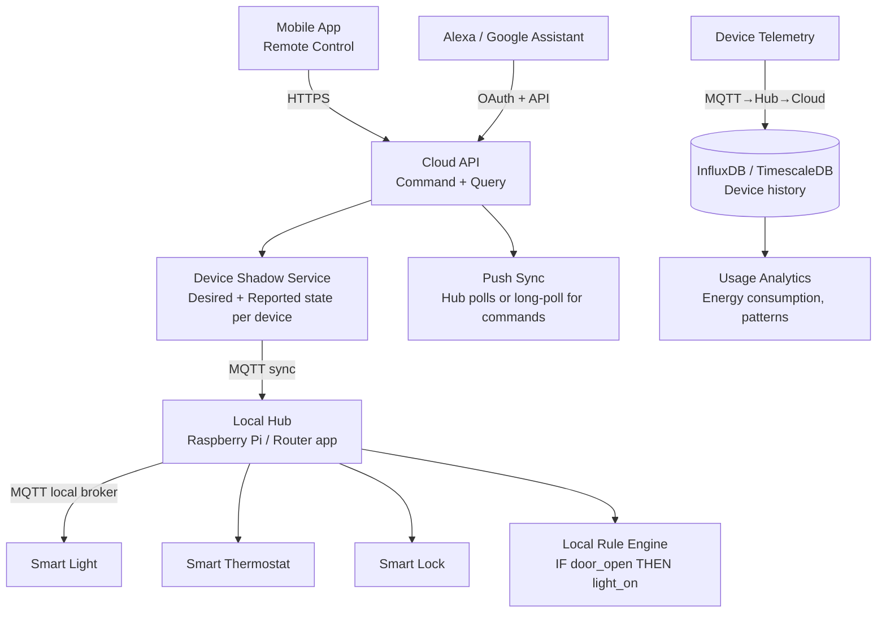

# Design a Smart Home IoT System

**Difficulty**: 🔴 Advanced | **Codemania #60**
**Reading Time**: ~14 min
**Interview Frequency**: Medium

---

## The Core Problem

Connecting 100 IoT devices per home (lights, thermostats, locks, cameras) with less than 100ms response latency for local commands, remote access from anywhere, voice control (Alexa/Google), and rule-based automation ("if front door opens → turn on hallway light"). The critical constraint: local control must work even when the internet is down.

---

## Functional Requirements

- Control smart devices (on/off, dim, lock, set temperature)
- Local control: < 100ms latency for commands within home network
- Remote control: < 1 second latency for commands from outside home
- Automation rules: "if door opens → turn on light", "if temp > 25°C → turn on AC"
- Voice control via Alexa/Google Assistant
- Device status: show current state of all devices
- Multi-user: family members with different permission levels

## Non-Functional Requirements

| Requirement | Target |
|-------------|--------|
| Devices per home | 100 devices |
| Local command latency | < 100ms (local network) |
| Remote command latency | < 1 second (via cloud) |
| Offline capability | Local control works without internet |
| Scale | 10M homes = 1B devices globally |
| Availability | 99.9% for local control (independent of cloud uptime) |

---

## Back-of-Envelope Estimates

- **Device telemetry**: 100 devices/home × 1 message/10s = 10 messages/sec/home
- **Global telemetry**: 10M homes × 10 messages/sec = 100M messages/sec globally (massive — needs regional processing)
- **Local hub load**: 10 messages/sec on a Raspberry Pi — trivial
- **Command latency budget (local)**: App → Hub (LAN) 5ms + Hub → Device (Zigbee/WiFi) 20ms = 25ms total (well under 100ms)
- **Command latency budget (remote)**: App → Cloud 50ms + Cloud → Hub 80ms + Hub → Device 20ms = 150ms (under 1s)

---

## High-Level Architecture



---

## Key Design Decisions

### 1. Local Hub vs Hub-Less Architecture

| Approach | Local Hub (Hub-based) | Hub-less (Cloud-only) |
|----------|----------------------|----------------------|
| Local latency | < 100ms (LAN communication) | 300–1000ms (via cloud) |
| Offline capability | Full functionality without internet | Nothing works offline |
| Privacy | Data stays in home network | All data goes to cloud |
| Cost | Hub hardware cost (~$50) | No hub needed |
| Protocol support | Hub bridges multiple protocols (Zigbee, Z-Wave, WiFi) | Only WiFi devices |

**Decision**: Hub-based architecture with local-first design. The hub runs an MQTT broker that coordinates all local devices. Cloud sync is secondary — used for remote access and backup. This ensures the home still works during internet outages.

### 2. MQTT vs WebSocket vs CoAP

| Protocol | MQTT | WebSocket | CoAP |
|----------|------|-----------|------|
| Transport | TCP | TCP | UDP |
| Overhead | 2-byte header | ~10-byte header | 4-byte header |
| QoS | Built-in (0/1/2) | No | Confirmable/Non-confirmable |
| Battery | Efficient (persistent connection) | Moderate | Very efficient (no persistent connection) |
| Best for | Connected devices (cameras, lights) | Web apps | Constrained battery devices (sensors) |

**Decision**: MQTT for device-to-hub communication (low overhead, QoS levels, pub/sub fits many devices). CoAP for ultra-low-power battery sensors (door sensors, motion detectors) where MQTT's persistent TCP connection drains batteries.

### 3. Device Shadow Pattern

The "device shadow" (AWS IoT concept) stores two states:
- **Desired state**: What the user/app wants ("light: ON, brightness: 80%")
- **Reported state**: What the device actually is ("light: ON, brightness: 75%")

This decouples command issuance from command execution:
```json
{
  "device_id": "light_001",
  "desired": {"power": "on", "brightness": 80},
  "reported": {"power": "on", "brightness": 75},
  "delta": {"brightness": 80}  // delta = desired - reported (pending)
}
```

When the device comes back online after being offline, it reads the `delta` and applies the pending changes. Commands don't get lost if the device is temporarily offline.

### 4. Local Rule Engine

Rules execute locally on the hub (no internet required):
```
RULE: "Arrival Mode"
  TRIGGER: device_event WHERE device_id = "front_door_sensor" AND event = "open"
  CONDITION: time > 18:00 AND user.home_status = "arriving"
  ACTIONS:
    - SET light_hallway power=on brightness=100
    - SET thermostat target_temp=22
    - NOTIFY user "Welcome home!"
```

Rule engine runs as a process on the hub. Rules stored locally as JSON/YAML. Cloud syncs rule updates to hub periodically.

For complex rules (ML-based: "unusual activity at 3 AM"), evaluate in the cloud where compute is available.

### 5. Multi-Protocol Bridge on Hub

Smart home devices use many different wireless protocols:
- **Zigbee**: Low-power mesh network (lights, outlets, sensors) — range 10–100m per hop
- **Z-Wave**: Sub-GHz frequency, better wall penetration (locks, thermostats)
- **WiFi**: High bandwidth (cameras, speakers) but power-hungry
- **Bluetooth LE**: Short range (wearables, proximity sensors)

The hub acts as a bridge: translate all protocols to MQTT internally. This abstracts protocol differences from the application layer.

---

## Remote Access Architecture

User away from home wants to control devices:
1. App sends command to Cloud API: `PUT /devices/light_001/state {desired: {power: "off"}}`
2. Cloud updates device shadow's desired state
3. Hub polls for shadow updates every 30 seconds (or via MQTT persistent connection to cloud)
4. Hub receives delta → sends MQTT command to device
5. Device executes and reports back → shadow updated → app shows confirmed state

For lower latency (< 200ms): Hub maintains persistent MQTT connection to cloud broker. No polling needed — cloud pushes updates immediately.

---

## Top Interview Questions for This Problem

| Question | Tests |
|----------|-------|
| What happens if the internet goes down — can users still control lights? | Local-first design, hub runs local MQTT broker, offline-capable |
| How does voice control work with Alexa? | OAuth 2.0 integration, Alexa Smart Home Skill, cloud API → hub → device |
| How do you handle firmware updates to 100 devices without bricking them? | Staged rollout, A/B update groups, rollback on boot failure |
| How would you scale to 1B devices globally? | Regional cloud infrastructure, per-region MQTT clusters, local hub handles home-level load |

---

## Common Mistakes

1. **Cloud-only architecture**: If cloud is down, users can't turn off their own lights. Local-first is essential for smart home reliability.
2. **Polling from devices to cloud**: 100 devices × 10M homes × 1 poll/sec = 1T requests/day. Always use event-driven (MQTT pub/sub) not polling.
3. **No device shadow / state reconciliation**: Commands sent while device offline are lost. Device shadow pattern ensures eventual consistency even with intermittent connectivity.

---

## Related Concepts

- [Message Queue Basics](../../04-messaging/concepts/message-queue-basics) — MQTT pub/sub pattern
- [Caching Fundamentals](../../02-caching/concepts/caching-fundamentals) — Device shadow state caching

---

## 📚 Resources & References

| Resource | Type | What You'll Learn |
|----------|------|------------------|
| [AWS IoT Device Shadow](https://docs.aws.amazon.com/iot/latest/developerguide/iot-device-shadows.html) | 📚 Book | Device shadow pattern, desired vs reported state, delta sync |
| [MQTT Essentials — HiveMQ](https://www.hivemq.com/mqtt-essentials/) | 📚 Book | MQTT protocol deep-dive, QoS levels, pub/sub patterns |
| [ByteByteGo — IoT System Design](https://www.youtube.com/@ByteByteGo) | 📺 YouTube | IoT architecture, hub patterns, device management at scale |
| [Hussein Nasser — MQTT vs WebSocket](https://www.youtube.com/@hnasr) | 📺 YouTube | Protocol comparison, use cases, implementation patterns |
| [Google Home Local Fulfillment](https://developers.home.google.com/local-home/overview) | 📖 Blog | Local execution architecture for Google Home integration |
