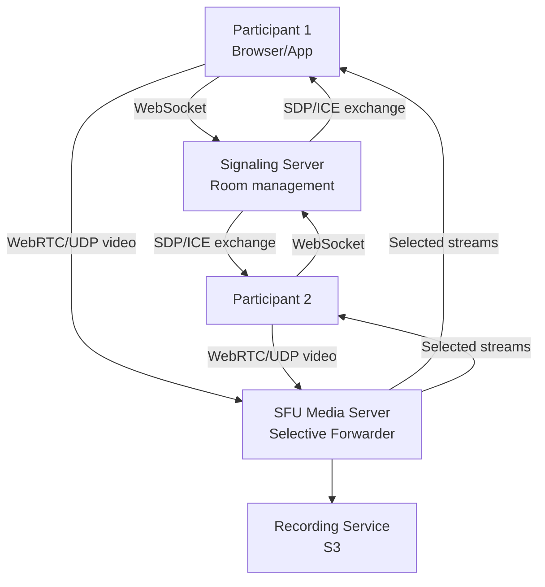
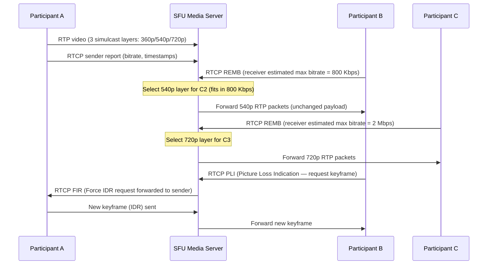
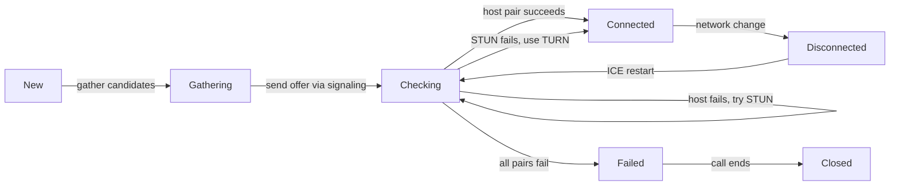
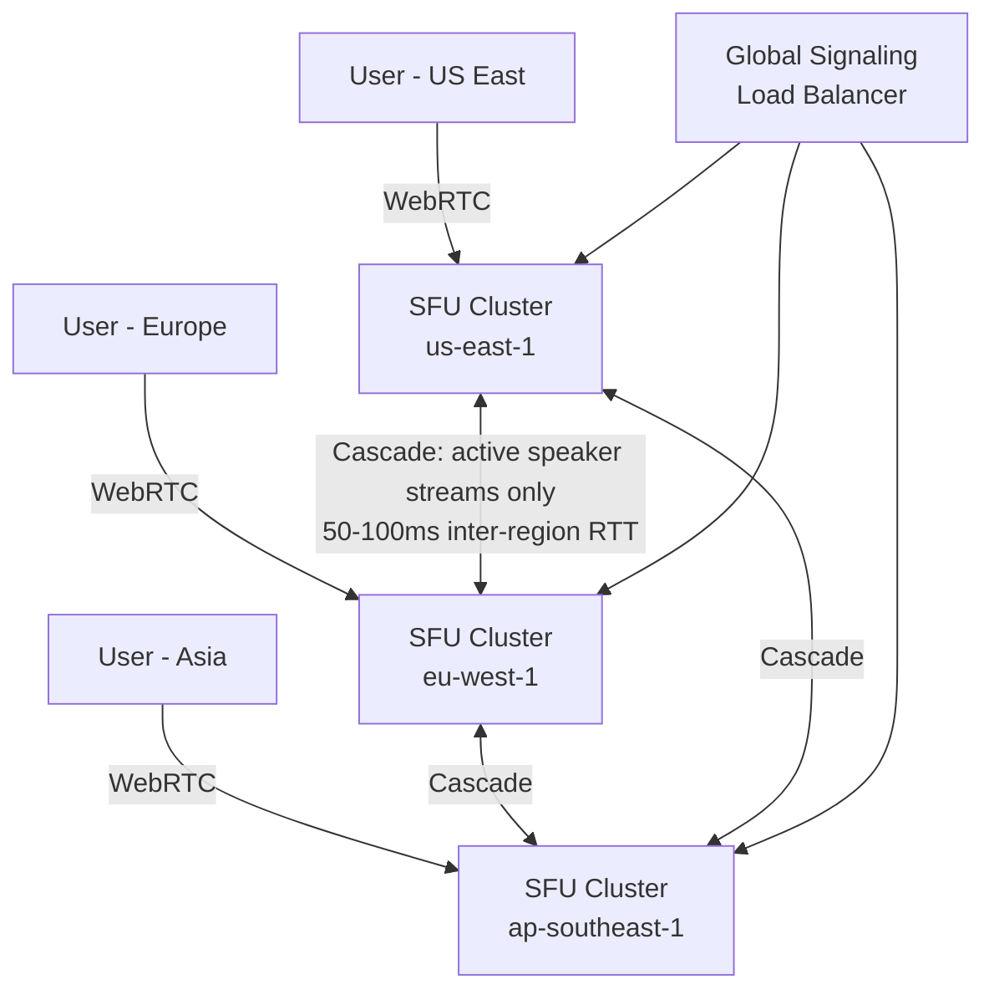

# Design a Video Conferencing System (Zoom)

**Difficulty**: 🔴 Advanced
**Reading Time**: Coming Soon
**Interview Frequency**: High

---

## The Core Problem

Supporting 100,000 concurrent video calls with under 150ms glass-to-glass latency means you can't use HTTP — every second of congestion shows up as frozen video. The core trade-off is P2P (no server cost but N²-N connections) vs SFU (one upload per participant, server forwards) vs MCU (server mixes video, less bandwidth but high CPU cost).

## Functional Requirements

- 1-on-1 and group video calls (up to 1,000 participants in webinar mode)
- Screen sharing and virtual background
- Recording to cloud storage
- Chat alongside the video call
- Adaptive video quality based on network conditions

## Non-Functional Requirements

| Requirement | Target |
|-------------|--------|
| Latency | < 150ms glass-to-glass |
| Video quality | 720p for 1-on-1, 360p for large group |
| Availability | 99.99% (52 min/year) |
| Scale | 300M daily meeting participants (Zoom peak 2020) |

## Back-of-Envelope Estimates

- **Bandwidth per participant**: 720p send = 2.5 Mbps up; 4 others' 360p = 4 × 1 Mbps down = 4 Mbps → 6.5 Mbps per user in a 5-person call
- **SFU bandwidth for 50-person call**: 50 participants × 1 Mbps upload = 50 Mbps inbound; SFU sends each participant 5 "active speaker" streams = 250 Mbps outbound
- **100K concurrent calls**: 100K calls × 6 participants avg × 3 Mbps avg = 1.8 Tbps of media traffic

## Key Design Decisions

1. **SFU (Selective Forwarding Unit) over MCU** — each participant uploads one stream to SFU; SFU selectively forwards relevant streams to each participant; no expensive server-side transcoding (unlike MCU); Zoom uses SFU-based architecture with each media server handling ~100 concurrent sessions.
2. **Signaling Plane Separation** — signaling (who's in the call, ICE candidates, SDP negotiation) is separated from media plane (actual audio/video); signaling uses WebSocket over TCP; media uses WebRTC over UDP for low latency.
3. **Adaptive Bitrate with Congestion Control** — when packet loss > 2%, reduce video resolution; use REMB/Transport-CC feedback to probe available bandwidth; prioritize audio (30 Kbps) over video when bandwidth is scarce.

## High-Level Architecture



## Top Interview Questions for This Problem

| Question | Tests |
|----------|-------|
| What's the difference between P2P, SFU, and MCU? When would you choose each? | Media server topology trade-offs |
| How do you handle a participant with poor internet (high packet loss)? | Adaptive bitrate, FEC, packet loss recovery |
| How would you implement the "spotlight" feature where one presenter is seen by 1000 viewers? | SFU selective forwarding, bandwidth management |

## Related Concepts

- [Live video streaming (Twitch) for comparison](../01-data-processing/live-video-streaming)
- [WebSocket connection management at scale](./facebook-messenger)

---

## Component Deep Dive 1: SFU (Selective Forwarding Unit)

The SFU is the single most critical architectural component in a video conferencing system. Every naive first approach — either full P2P mesh or a CPU-intensive MCU — fails at scale for different but equally fatal reasons.

### Why P2P Mesh Fails at Scale

In a P2P mesh, every participant establishes a direct connection to every other participant. For N participants, each client maintains N-1 upload streams and N-1 download streams. A 10-person call requires each participant to upload 9 separate video streams — that's 9× the bandwidth cost compared to an SFU. Most home connections have asymmetric bandwidth (e.g., 100 Mbps down, 10 Mbps up), so a 10-person call at 1 Mbps per stream already saturates the uplink. Beyond 4-5 participants, P2P is effectively unusable.

### Why MCU Fails at Scale

An MCU (Multipoint Control Unit) receives all streams, decodes them, composites them into a grid layout, re-encodes, and sends one stream per participant. The CPU cost is enormous: decoding + re-encoding 50 H.264 1080p streams in real time requires dedicated GPU-accelerated transcoding hardware. AWS MediaLive charges approximately $0.05–$0.20 per minute per channel for transcoding. For 100K concurrent calls, MCU costs would be prohibitive. MCU also introduces 2-4 additional frames of latency from the decode/re-encode pipeline.

### How SFU Works Internally

An SFU receives one RTP stream per participant and selectively forwards relevant streams without decoding. The SFU inspects RTP headers (SSRC, sequence number, timestamp) to route packets, but never touches the payload. This means:

- **No transcoding**: CPU cost is O(1) per forwarded packet, not O(resolution × bitrate)
- **Simulcast support**: Each sender uploads 3 resolution tiers (e.g., 360p/540p/720p); the SFU picks the appropriate tier per receiver based on their measured bandwidth
- **Selective forwarding**: In a 50-person call, a recipient only receives the 5 "active speaker" streams, not all 49

The active speaker detection uses the audio level extension in RTP (RFC 6464). Participants with the highest audio energy in the last 300ms are selected as "active speakers" and their video streams are forwarded preferentially.

### SFU Internal Architecture



### SFU Implementation Options

| Approach | Latency | Throughput per Server | Trade-off |
|----------|---------|----------------------|-----------|
| Single-threaded SFU (Janus) | 20–40ms | ~500 concurrent participants | Simple but CPU-bound; a slow packet loop blocks all streams |
| Multi-threaded SFU (Mediasoup) | 15–30ms | ~2,000 concurrent participants | Per-CPU-core worker model; scales with core count but requires careful load balancing |
| Kernel-bypass SFU (DPDK-based) | 5–15ms | ~10,000+ concurrent participants | Bypasses Linux network stack; requires dedicated NICs; used by Zoom for high-density nodes |

Zoom's media servers are reported to handle approximately 100 concurrent call sessions per server, with each session averaging 5-10 participants — roughly 500–1,000 active streams per physical server node.

---

## Component Deep Dive 2: Signaling Server and ICE/NAT Traversal

The signaling server is the coordination layer that orchestrates call setup. It is deceptively simple from a protocol standpoint but extremely tricky to operate reliably at scale.

### What Signaling Handles

Signaling covers three distinct phases:

1. **Room management**: Creating/joining/leaving rooms, tracking participant list, distributing participant metadata (name, camera state, mute state)
2. **SDP negotiation**: Exchanging Session Description Protocol (SDP) offers and answers that describe codec capabilities (VP8/VP9/AV1/H.264), SRTP keying material, and RTP extension support
3. **ICE candidate exchange**: Gathering and exchanging network candidates (host, server-reflexive via STUN, relay via TURN) so WebRTC can punch through NAT

### NAT Traversal: The Hidden Bottleneck

In production, approximately 15–20% of WebRTC connections require TURN relay servers because NAT traversal fails (symmetric NAT, corporate firewalls, strict carrier-grade NAT). TURN relay is expensive: each relayed byte passes through the TURN server twice (once in, once out), doubling bandwidth cost. A single TURN server can handle approximately 500 Mbps of relayed traffic before CPU becomes the bottleneck.

At 100K concurrent calls with 15% requiring TURN and each call using 3 Mbps bidirectional: 100,000 × 0.15 × 3 Mbps × 2 (relay factor) = 90 Gbps of TURN bandwidth. This requires roughly 180 TURN servers at 500 Mbps each — a non-trivial infrastructure cost.

### Signaling at 10x Load

At 10x baseline (1M concurrent calls), the signaling bottleneck shifts from the WebSocket connection itself to the room state fanout. When any participant changes state (mutes, turns camera off, joins, leaves), the signaling server must broadcast that event to all other participants in the room. For a 50-person call, one state change triggers 49 outbound notifications. At 10× scale, this O(N) fanout per event becomes a thundering herd problem on the signaling server's message queue.

The mitigation is to use a pub/sub backbone (e.g., Redis pub/sub or Kafka) where each room is a topic, and signaling servers subscribe only to rooms their connected clients are in. This decouples fanout from any single signaling server.

### ICE Connection State Diagram



---

## Component Deep Dive 3: Recording and Storage Layer

Cloud recording introduces a fundamentally different data flow: the SFU must write a continuous byte stream to durable storage with no gaps, while simultaneously forwarding real-time packets. These two operations have conflicting requirements — the real-time path demands UDP with acceptable loss, while recording demands lossless, ordered writes.

### Recording Architecture

The SFU does not write to S3 directly. Direct S3 writes from a media-hot path introduce unacceptable tail latency (S3 PUT p99 is 50–200ms). Instead, a separate recording sidecar process consumes RTP streams via a local Unix socket from the SFU, reassembles them into a container format (WebM or MP4), buffers to local NVMe SSD, and flushes to S3 in 5-minute chunks using multipart upload.

The key technical decisions:

- **Container format**: WebM (VP8/VP9) for open-source compatibility; MP4 with fragmented MP4 (fMP4) for seekable playback before the recording ends
- **Packet reordering buffer**: RTP packets arrive out of order; the recorder maintains a jitter buffer of 200ms to allow reordering before writing to disk
- **Lost packet handling**: Unlike real-time playback (which skips lost packets), recording requests retransmission via RTCP NACK for up to 500ms before inserting a concealment frame
- **Storage tiering**: Raw RTP → WebM/MP4 within 2 hours → transcoded to multiple resolutions (1080p, 720p, 360p) within 24 hours → archived to S3 Glacier after 30 days

### Recording Capacity Numbers

A 1-hour 720p recording at 2.5 Mbps produces approximately 1.1 GB of raw data. Post-transcoding to adaptive bitrate produces roughly 2× the original size (including all quality tiers). At 300M daily meeting participants averaging 45 minutes each with 30% recording rate: 300M × 0.3 × 45 min × (2.5/8 MB/s) ≈ 1.5 PB/day of raw recording storage before compression.

---

## Data Model

### Room and Participant State (relational — PostgreSQL)

```sql
-- Rooms / sessions
CREATE TABLE rooms (
    room_id         UUID PRIMARY KEY DEFAULT gen_random_uuid(),
    host_user_id    BIGINT NOT NULL REFERENCES users(user_id),
    room_code       VARCHAR(12) NOT NULL UNIQUE,  -- e.g. "abc-defg-hij"
    title           VARCHAR(255),
    start_time      TIMESTAMPTZ NOT NULL DEFAULT now(),
    end_time        TIMESTAMPTZ,
    max_participants INT NOT NULL DEFAULT 100,
    recording_enabled BOOLEAN NOT NULL DEFAULT false,
    status          VARCHAR(16) NOT NULL DEFAULT 'active',  -- active | ended | scheduled
    created_at      TIMESTAMPTZ NOT NULL DEFAULT now()
);
CREATE INDEX idx_rooms_code ON rooms(room_code);
CREATE INDEX idx_rooms_host ON rooms(host_user_id, status);

-- Live participant presence (also kept in Redis for fast read)
CREATE TABLE room_participants (
    participant_id  BIGSERIAL PRIMARY KEY,
    room_id         UUID NOT NULL REFERENCES rooms(room_id),
    user_id         BIGINT REFERENCES users(user_id),  -- NULL for anonymous
    display_name    VARCHAR(128) NOT NULL,
    join_time       TIMESTAMPTZ NOT NULL DEFAULT now(),
    leave_time      TIMESTAMPTZ,
    is_muted        BOOLEAN NOT NULL DEFAULT false,
    is_camera_on    BOOLEAN NOT NULL DEFAULT true,
    is_screen_sharing BOOLEAN NOT NULL DEFAULT false,
    role            VARCHAR(16) NOT NULL DEFAULT 'attendee',  -- host | co-host | attendee
    sfu_node_id     VARCHAR(64),  -- which SFU server this participant's stream is on
    ice_connection_type VARCHAR(16)  -- host | srflx | relay
);
CREATE INDEX idx_participants_room ON room_participants(room_id, leave_time);
CREATE INDEX idx_participants_user ON room_participants(user_id, join_time);
```

### SFU Stream State (Redis — ephemeral, TTL-based)

```json
// Key: sfu:stream:{room_id}:{participant_id}
// TTL: 30 seconds (refreshed every 10s by heartbeat)
{
  "ssrc_video": 1234567890,
  "ssrc_audio": 9876543210,
  "simulcast_layers": ["360p", "540p", "720p"],
  "active_layer": "540p",
  "audio_level_db": -42,
  "bitrate_kbps": 800,
  "packet_loss_pct": 0.5,
  "rtt_ms": 45,
  "last_keyframe_ts": 1748723001234
}

// Key: sfu:room_active_speakers:{room_id}
// Sorted set: participant_id -> audio_energy_score (updated every 300ms)
```

### Chat Messages (document store — DynamoDB)

```json
// Table: meeting_chat_messages
// Partition key: room_id  |  Sort key: message_ts#message_id
{
  "room_id": "550e8400-e29b-41d4-a716-446655440000",
  "message_ts": "2025-04-15T14:23:01.456Z",
  "message_id": "msg_01H5VBKQ2G...",
  "sender_participant_id": 9001,
  "sender_display_name": "Alice",
  "content_type": "text",            // text | file | reaction
  "text": "Can everyone see my screen?",
  "reactions": { "👍": 3, "✅": 2 },
  "is_pinned": false,
  "ttl": 1779580981                  // auto-deleted after 30 days
}
```

---

## Scale Bottlenecks

| Traffic Level | Component That Breaks | Symptoms | Mitigation |
|---------------|----------------------|----------|------------|
| 10x baseline (1M concurrent calls) | Signaling server room-state fanout | High CPU on signaling nodes; delayed mute/unmute propagation (>500ms lag) | Redis pub/sub per room; signaling server subscribes only to relevant rooms |
| 10x baseline | TURN relay bandwidth | TURN servers at 100% NIC utilization; relay connections timing out | Pre-provision 2× TURN capacity in each region; use COTURN with kernel bypass |
| 100x baseline (10M concurrent calls) | SFU node assignment (routing registry) | Participants assigned to SFU nodes across regions; 200ms+ cross-region media hops | Geo-aware SFU assignment; anycast DNS to nearest cluster; regional SFU pools |
| 100x baseline | PostgreSQL room_participants writes | Write contention on join/leave events; DB CPU spikes on mass-join (webinars) | Write participant events to Kafka; async write to Postgres; Redis as write-through cache for live state |
| 1000x baseline (100M concurrent calls) | Global bandwidth egress | Egress costs exceed $1M/day at $0.08/GB; CDN saturated | On-net peering with major ISPs; edge PoPs in 50+ cities; client-side bitrate capping policies |
| 1000x baseline | ICE/STUN infrastructure | STUN servers receiving 10M+ binding requests/sec; UDP amplification risk | Anycast STUN with stateless response; rate-limit per IP; Cloudflare Magic Transit for DDoS protection |

---

## How Zoom Built This

Zoom's engineering blog post "Zoom on Zoom" (2020) and their subsequent infrastructure writeups describe a non-obvious architecture decision that separates their approach from standard WebRTC deployments: Zoom built their own proprietary UDP transport protocol, not vanilla WebRTC.

### Why Zoom Abandoned Standard WebRTC

Standard WebRTC uses DTLS-SRTP with ICE, which adds approximately 2–4 round trips of setup latency before media can flow. Zoom instead uses a custom UDP protocol that:

- Establishes a session in a single round trip using a pre-shared key derived from the signaling exchange
- Uses their own congestion control algorithm (a variant of GCC — Google Congestion Control) tuned for their specific traffic patterns
- Implements forward error correction (FEC) at the transport layer rather than relying on codec-level concealment

### Specific Technology Choices

- **Media servers**: Zoom runs their own SFU software called "MMR" (Multi-Media Router) on bare-metal servers in co-location facilities and AWS. As of 2020, they reported handling 300M daily meeting participants with 17 data centers.
- **Codec**: Zoom uses H.264 Baseline Profile for broad device compatibility, VP8 for bandwidth-constrained scenarios, and has been rolling out AV1 for screen sharing (AV1 reduces screen-share bitrate by ~50% vs. H.264 at the same quality, from ~500 Kbps to ~250 Kbps).
- **Scale numbers**: At the April 2020 peak (COVID-19), Zoom reported 300M daily meeting participants. Their infrastructure team scaled from 10 co-lo data centers to 17 in 30 days by provisioning new MMR capacity in AWS regions as overflow.
- **Non-obvious architectural decision**: Zoom routes media through their own servers by default (not true P2P), even for 1-on-1 calls. This means they pay bandwidth costs for every call, but it allows them to implement consistent end-to-end encryption, reliable recording, and predictable NAT traversal without relying on TURN fallbacks. The tradeoff (always paying for relay) buys them simplicity and uniform quality.

### Latency Budget Breakdown (Zoom, documented)

Zoom targets glass-to-glass latency under 150ms. Their documented breakdown:
- Capture and encoding: 15–20ms
- Network transmission (sender to SFU): 20–50ms (varies by geography)
- SFU forwarding: <5ms
- Network transmission (SFU to receiver): 20–50ms
- Jitter buffer de-jitter: 30–60ms
- Decoding and render: 15–20ms

Total: 100–155ms at median network conditions.

Source: [Zoom on Zoom — Medium Engineering Blog](https://medium.com/zoom-developer-blog/zoom-on-zoom-52d73b32dd28)

---

## Interview Angle

**What the interviewer is testing:** Whether you understand the media plane vs. signaling plane split, and whether you can reason about the bandwidth and CPU cost implications of SFU vs. MCU vs. P2P at different call sizes.

**Common mistakes candidates make:**

1. **Proposing HTTP or long-polling for media transport.** Candidates who default to REST APIs for everything miss that HTTP's TCP-based head-of-line blocking is catastrophically bad for real-time media. A single dropped TCP segment holds back all subsequent packets until retransmission, causing visible freezes. UDP with application-level FEC is the correct answer because controlled loss is always better than ordered-but-delayed delivery for live media.

2. **Treating the SFU as stateless and horizontally scalable like a web server.** An SFU is inherently stateful — it maintains RTP stream state (SSRC mappings, simulcast layer selections, congestion control state) for every connected participant. You cannot route a participant's RTCP feedback to a random SFU node. All participants in a call must be connected to the same SFU cluster, which requires consistent hashing or sticky routing. Failing to mention this makes your design appear to allow arbitrary horizontal scaling when it cannot.

3. **Ignoring the TURN server as an infrastructure cost.** Candidates frequently say "use STUN for NAT traversal" without acknowledging that STUN fails for ~15–20% of users behind symmetric NAT or corporate firewalls. TURN relay is the fallback, and it doubles your bandwidth cost for every relayed participant. A production design must account for TURN server fleet sizing and the egress cost implications.

**The insight that separates good from great answers:** Great candidates know that in a large webinar (500+ viewers, 1 presenter), the optimal topology shifts from SFU to CDN-like distribution. The presenter's stream gets ingested once into the SFU, but is then distributed via a CDN edge network (similar to HLS/DASH streaming), accepting 3–8 seconds of latency in exchange for nearly infinite horizontal scale. This "hybrid SFU + CDN" model is exactly what Zoom Webinars, YouTube Live, and Twitch use for their large-audience products — the real-time interactive SFU handles the speaker, while the audience receives a low-latency CDN stream.

---

## Key Numbers to Remember

| Metric | Value | Context |
|--------|-------|---------|
| 720p video bitrate | 2.5 Mbps | Per participant upload to SFU |
| 360p video bitrate | 1 Mbps | Typical "active speaker" stream in group call |
| Audio bitrate | 30–64 Kbps (Opus) | Priority-forwarded even at extreme packet loss |
| SFU participants per server | ~500–1,000 streams | Mediasoup multi-threaded; ~100 sessions at 5 participants each |
| TURN relay users | ~15–20% of connections | Users behind symmetric NAT or corporate firewalls |
| ICE setup latency | 100–500ms | Before first media byte; TURN fallback can add 300ms |
| Zoom peak (2020) | 300M daily meeting participants | From 10M in December 2019 — 30× growth in 4 months |
| Glass-to-glass target | <150ms | Industry standard for "natural conversation" feel |
| P2P max practical size | 4–5 participants | Beyond this, uplink saturation kills quality |
| MCU CPU cost | 1 server per 10 HD streams | Re-encode cost; SFU handles 100× more streams per server |
| Recording storage | ~1.1 GB/hour at 720p | Before transcoding; multiply by ~2 for all quality tiers |
| Active speaker update interval | 300ms | Audio energy sampled every 300ms to switch dominant speaker |

---

## Codec Selection Deep Dive

Codec choice is a second-order decision that dramatically affects bandwidth cost, CPU cost, and device compatibility. Getting it wrong means either burning extra bandwidth or excluding older devices.

### Video Codec Comparison

| Codec | Compression vs H.264 | Encode CPU | Decode CPU | Hardware Support | Best For |
|-------|---------------------|------------|------------|-----------------|----------|
| H.264 (AVC) Baseline | baseline | Low | Very low | Universal (all devices since 2010) | Maximum compatibility; 1-on-1 calls |
| VP8 | ~10% better | Medium | Low | Most browsers natively | Bandwidth-constrained group calls |
| VP9 | ~30–40% better than H.264 | High | Medium | Chrome, Firefox; limited on iOS | Screen sharing, high-quality calls |
| AV1 | ~50% better than H.264 | Very high (software) | High | Chrome 90+, newer phones | Screen sharing; future default |
| H.265 (HEVC) | ~40% better than H.264 | High | Low (HW) | Apple devices; not in browsers | Mobile native apps |

Zoom's actual codec strategy as of 2023:
- **Video calls**: H.264 Baseline by default for compatibility; VP9 when both sides support it and bandwidth allows
- **Screen sharing**: AV1 where supported (reduces screen-share bitrate from ~500 Kbps to ~250 Kbps at equivalent quality)
- **Audio**: Opus codec at 20–64 Kbps with built-in FEC and packet loss concealment at loss rates up to 40%

### Audio Codec: Why Opus Dominates

Opus (RFC 6716) is the universal choice for real-time audio. Its key properties that matter for conferencing:

- **Variable bitrate**: 6 Kbps (narrowband speech) to 510 Kbps (high-fidelity stereo music)
- **Built-in FEC**: At 10% packet loss, Opus can reconstruct audio from the redundant data embedded in subsequent packets — no retransmission needed
- **Low algorithmic delay**: 2.5–20ms frame sizes vs. AAC's 21ms minimum
- **Bandwidth probing**: Combined with RTCP feedback, Opus can seamlessly switch bitrate within 100ms of detecting congestion

At 30 Kbps with Opus, audio quality is indistinguishable from 128 Kbps AAC for speech. Video conferencing systems always prioritize audio over video in congestion because humans tolerate pixelated video far better than choppy audio.

---

## Adaptive Bitrate and Congestion Control

The most complex real-time engineering in a video conferencing system is not the SFU or the signaling — it is the congestion control loop that dynamically adjusts video quality to match available network capacity without causing the frozen video that kills call quality.

### The GCC (Google Congestion Control) Algorithm

WebRTC's default congestion control is GCC, which uses two signals in parallel:

1. **Loss-based signal**: If packet loss rises above 2%, reduce bitrate by 15%. If loss is 0% for 300ms, probe for more bandwidth by increasing bitrate by 8%.
2. **Delay-based signal**: Measure one-way delay gradient between consecutive packets. If packets are arriving progressively later (queue building up), reduce bitrate preemptively — before packet loss occurs.

The delay-based signal is the critical innovation. By detecting queue buildup (increasing inter-packet delay) before packets start dropping, GCC can reduce bitrate 200–400ms earlier than a purely loss-based algorithm. This is the difference between a smooth resolution reduction and a visible freeze.

### Simulcast: The Practical Implementation

Rather than dynamically changing the encoder bitrate (which requires an IDR/keyframe to take effect, adding 100–300ms of visual quality degradation), modern SFUs use simulcast: each sender simultaneously encodes 3 resolution tiers and uploads all three continuously.

```
Sender uploads 3 parallel streams:
  - Layer 0: 180p @ 150 Kbps  (degraded fallback)
  - Layer 1: 360p @ 500 Kbps  (normal quality)
  - Layer 2: 720p @ 2.5 Mbps  (high quality)

SFU switches which layer to forward per receiver:
  - Receiver bandwidth > 2 Mbps  → forward Layer 2
  - Receiver bandwidth 400–2000 Kbps → forward Layer 1
  - Receiver bandwidth < 400 Kbps → forward Layer 0

Layer switch is instantaneous (next keyframe boundary, ~100ms)
vs. encoder bitrate change (300–500ms + keyframe wait)
```

The downside: simulcast triples the sender's upload bandwidth. A 720p sender uploads 150 + 500 + 2500 = 3,150 Kbps instead of 2,500 Kbps — a 26% overhead cost that is considered worthwhile for the seamless quality-switching benefit.

### SVC (Scalable Video Coding) as the Alternative

SVC (used by Google Meet via VP9-SVC) encodes a single stream with temporal and spatial layers embedded. The SFU can forward partial layers without the sender uploading 3 separate streams. SVC reduces sender upload overhead but requires more complex SFU processing to extract layers and rewrite RTP timestamps. VP9-SVC adoption is growing but H.264 simulcast remains the most deployed approach due to universal device support.

---

## Failure Modes and Recovery

### Network Partition: SFU Node Failure

When an SFU node fails mid-call, all participants connected to that node lose their media streams simultaneously. Recovery options:

1. **Fast rejoin (default)**: Clients detect ICE failure within 5s (ICE keepalive timeout), reconnect to a new SFU node assigned by signaling server. All call state is re-established from scratch. Latency: 5–15 seconds of call disruption.
2. **Graceful migration (advanced)**: SFU nodes replicate lightweight state (SSRC mappings, active layer selections) to a standby node every 500ms. On failure, standby takes over within 1–2 seconds. Requires ~2× SFU resources per call.

Zoom's approach (documented in their 2020 scaling post): they accept the 5–15 second reconnect disruption in exchange for simpler infrastructure. Their client shows a "reconnecting..." spinner. With 99.99% SFU uptime, the expected reconnect frequency per hour-long call is: 1 − 0.9999^(60 min × calls_per_server) — negligible for most users.

### Cascading Audio Echo

Echo cancellation (AEC) is a client-side DSP function. When it fails, every participant hears their own voice played back ~150ms later, which is cognitively intolerable. AEC failure modes:

- **Virtual backgrounds with GPU acceleration disabled**: GPU-accelerated virtual background rendering can introduce 30–50ms of additional audio pipeline delay, pushing the echo outside the AEC cancellation window (typically ±128ms)
- **Bluetooth headsets with A2DP profile**: Some Bluetooth stacks switch to HFP (Hands-Free Profile) for mic input but keep A2DP for speaker output, mismatching audio pipelines and breaking AEC's reference signal alignment

Fix: always test AEC with a loopback measurement at call start; warn users if measured echo return loss enhancement (ERLE) < 20 dB.

---

## End-to-End Encryption (E2EE) Considerations

Standard video conferencing encrypts media with SRTP (Secure Real-time Transport Protocol), but the SFU must decrypt packets to inspect RTP headers for routing decisions. This means the provider can technically access the media stream. True E2EE — where the SFU cannot decrypt — requires a different approach.

### Standard SRTP vs. E2EE

| Property | SRTP (standard) | E2EE (Insertable Streams) |
|----------|----------------|--------------------------|
| Who holds keys | Server + client | Client only |
| SFU can read media | Yes (for routing) | No (encrypted payload) |
| Simulcast support | Full | Limited — server can't inspect layers |
| Active speaker detection | Server-side (audio level RTP extension) | Client-side only |
| Recording support | Server can record | Only client-initiated recording |
| Regulatory compliance | Easier (CALEA) | Harder — no server-side intercept |

Zoom added E2EE support in late 2020 (after the "Zoom-bombing" controversy). Their implementation uses WebCrypto API in browsers and a key exchange via a separate key server. When E2EE is enabled, simulcast is disabled (the server cannot switch layers it cannot inspect), reducing call quality for participants on poor connections. This is the concrete engineering trade-off that makes E2EE non-trivial to add to an existing SFU architecture.

### Key Distribution for E2EE

In a 10-person E2EE call, key distribution works as follows:

1. Each participant generates an ephemeral symmetric key (AES-GCM 128-bit)
2. Keys are distributed via the signaling server using asymmetric encryption (each participant's public key is registered at join time)
3. The SFU receives ciphertext RTP packets, forwards them without decryption
4. Each receiver decrypts using the sender's symmetric key after receipt

The practical limitation: key rotation on participant join/leave requires re-keying all existing participants. In a 100-person webinar with frequent join/leave events, re-keying can occur every few seconds, introducing 100–300ms latency spikes as the key exchange completes before new media can be decrypted.

---

## Geographic Distribution and CDN Edge

For a global service, placing all SFU nodes in one region adds 100–200ms of unnecessary round-trip latency for users on other continents. The solution is a multi-region SFU topology with intelligent call routing.

### Multi-Region SFU Topology



### SFU Cascade (the key mechanism)

When participants are in different regions, SFUs form a cascade: each regional SFU receives the locally-connected participants' streams, selects the 3–5 "active speaker" streams to forward cross-region (not all streams — just the ones recipients are likely watching), and forwards those over a private backbone connection between data centers.

This keeps cross-region bandwidth proportional to active speakers (typically 3–5 streams regardless of total participant count) rather than proportional to all participants. A 50-person call with participants in 3 regions requires 3–5 streams × 1 Mbps × 2 cross-region links = 6–10 Mbps of inter-DC bandwidth, not 50 Mbps.

The cascade SFU selection rule: the signaling server assigns each participant to the nearest SFU cluster based on geographic IP lookup + measured RTT during ICE gathering (the STUN binding request RTT is a free latency probe).

### Capacity Planning per Region

For a service targeting <150ms glass-to-glass latency worldwide:
- PoPs needed: minimum 6–8 regions (US East, US West, EU West, EU East, AP Southeast, AP Northeast, SA East, ME)
- Each region handles: local participants + cross-region cascade overhead
- Bandwidth provisioning rule: plan for 3× peak observed traffic (2× for redundancy + 1× for burst headroom)
- At 300M daily participants × 45 min avg × 3 Mbps / 86400 seconds = ~630 Gbps sustained average worldwide; peak is typically 3–4× average = ~2 Tbps peak, spread across 8 regions = ~250 Gbps per region at peak

---

## Monitoring and Observability

Video call quality is notoriously hard to monitor because the user experience is subjective and the key metrics are client-side.

### Key Metrics to Track

| Metric | Collection Point | Alert Threshold | What It Means |
|--------|-----------------|-----------------|---------------|
| Packet loss rate | Client RTP stats | > 2% sustained | Visible video artifacts; audio concealment activating |
| Round-trip time | RTCP sender reports | > 300ms | Conversation delay noticeable; echo cancellation strained |
| Jitter | Client RTP stats | > 50ms | Jitter buffer overflow; audio gaps |
| Active SFU connections | SFU metrics | > 80% capacity | Pre-scale trigger; add SFU nodes |
| ICE connection type | Client telemetry | relay% > 25% | TURN infrastructure potentially undersized |
| Call setup time | Client telemetry (P99) | > 5 seconds | Signaling or ICE slow; user abandonment risk |
| MOS score (estimated) | Client-side algorithm | < 3.5 | Below acceptable voice quality threshold |

### Client-Side Telemetry Pipeline

Each client emits a quality report every 10 seconds containing RTP statistics (packets sent/received/lost, jitter, RTT). These are:
1. Sent via WebSocket to the signaling server (same persistent connection, no extra overhead)
2. Written to a time-series store (InfluxDB or Prometheus) keyed by `room_id + participant_id`
3. Aggregated per room to compute a "room health score" visible to the host
4. Stored in a data warehouse (BigQuery/Redshift) for post-call analysis and ML-based quality prediction

The room health score allows the host to see "3 participants have poor connection" in the UI — actionable information that reduces support tickets ("why was my call bad?") because users can self-diagnose.

---

## Topology Comparison Summary

Before committing to an architecture, candidates should be able to produce this comparison from memory:

| Topology | Max Practical Size | Sender Bandwidth | Server CPU | Server Bandwidth | Use Case |
|----------|--------------------|-----------------|------------|-----------------|----------|
| P2P Mesh | 4–5 participants | N×(N-1) streams | None | None | Browser demos only |
| SFU | 2–500 participants | 1 upload (+ simulcast layers) | Low (no decode) | High (forward all streams) | Standard video calls, group meetings |
| MCU | 2–200 participants | 1 upload | Very high (decode + encode all) | Low (1 composite stream per user) | Low-bandwidth clients; legacy endpoints |
| SFU + CDN cascade | 500–100,000 viewers | 1 upload (presenter only) | Low | Medium (CDN handles audience) | Webinars, live events, all-hands meetings |
| SFU + SFU cascade | Global multi-region | 1 upload | Low | Medium (only active-speaker cross-region) | Global enterprise calls |

The decision tree for architecture selection:
- Call size < 5 and both peers are on reliable networks → P2P (no server cost, lowest latency)
- Call size 5–500 and interactive (everyone can speak) → SFU
- Call size > 500 or asymmetric (1 speaker, many listeners) → SFU + CDN cascade
- Low-bandwidth or legacy clients (PSTN, H.323 endpoints) must be supported → MCU for those endpoints, SFU for modern clients, with a bridge between them
- E2EE required by compliance → SFU with Insertable Streams API; accept simulcast disabled and ~10% quality reduction
- Multi-continent participants in same call → SFU cascade with active-speaker-only cross-region forwarding; budget 50–100ms inter-DC RTT into latency model

---

## TL;DR — What to Say in the First 5 Minutes of the Interview

1. SFU is the right default: one upload per participant, server forwards without decoding, handles 500 participants before needing a cascade.
2. Separate signaling (WebSocket/TCP) from media (WebRTC/UDP) — they have different reliability and latency requirements.
3. Simulcast solves quality-switching latency: sender uploads 3 tiers continuously; SFU switches tiers per receiver in <100ms vs. 300–500ms for encoder bitrate changes.
4. Plan for 15–20% of users needing TURN relay; budget 2× bandwidth for those connections.
5. At webinar scale (>500), switch from interactive SFU to SFU + CDN cascade — accept 3–8s latency for near-infinite viewer scale.

---

## 📚 Resources & References

| Resource | Type | What You'll Learn |
|----------|------|------------------|
| [ByteByteGo — Design a Video Conferencing System](https://www.youtube.com/@ByteByteGo) | 📺 YouTube | Search "video conferencing design" — WebRTC, TURN/STUN, SFU/MCU |
| [Zoom Engineering: How Zoom's Architecture Scales](https://medium.com/zoom-developer-blog/zoom-on-zoom-52d73b32dd28) | 📖 Blog | How Zoom handles 300M+ daily meetings with their custom UDP protocol |
| [WebRTC Architecture and Standards](https://webrtc.org/getting-started/peer-connections) | 📚 Docs | The browser-native protocol enabling peer-to-peer video conferencing |
| [Discord Engineering: WebRTC for Voice/Video](https://discord.com/blog/how-discord-handles-two-and-half-million-concurrent-voice-users-using-webrtc) | 📖 Blog | How Discord scales WebRTC to millions of concurrent voice channels |
| [Livekit: SFU Architecture for WebRTC](https://livekit.io/docs) | 📚 Docs | Open-source SFU implementation — how Selective Forwarding Units work |
