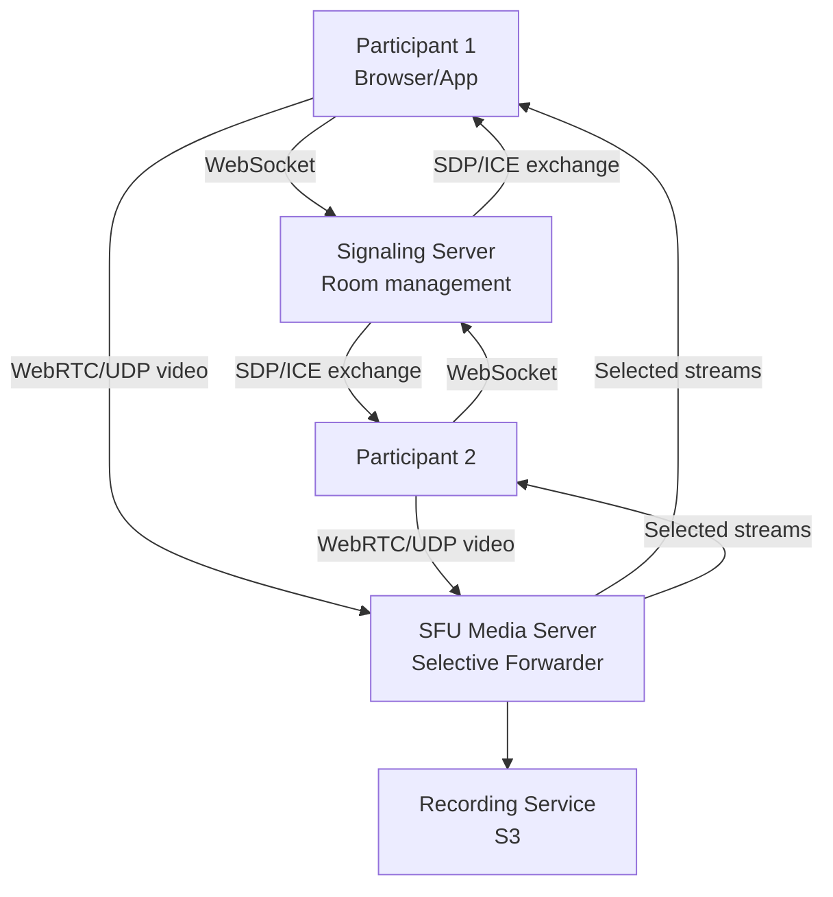

# Design a Video Conferencing System (Zoom)

**Difficulty**: 🔴 Advanced
**Reading Time**: Coming Soon
**Interview Frequency**: High

---

> 🚧 **Full article coming soon.** This stub gives you the essentials to start thinking about this problem.

---

## The Core Problem

Supporting 100,000 concurrent video calls with under 150ms glass-to-glass latency means you can't use HTTP — every second of congestion shows up as frozen video. The core trade-off is P2P (no server cost but N²-N connections) vs SFU (one upload per participant, server forwards) vs MCU (server mixes video, less bandwidth but high CPU cost).

## Functional Requirements

- 1-on-1 and group video calls (up to 1,000 participants in webinar mode)
- Screen sharing and virtual background
- Recording to cloud storage
- Chat alongside the video call
- Adaptive video quality based on network conditions

## Non-Functional Requirements

| Requirement | Target |
|-------------|--------|
| Latency | < 150ms glass-to-glass |
| Video quality | 720p for 1-on-1, 360p for large group |
| Availability | 99.99% (52 min/year) |
| Scale | 300M daily meeting participants (Zoom peak 2020) |

## Back-of-Envelope Estimates

- **Bandwidth per participant**: 720p send = 2.5 Mbps up; 4 others' 360p = 4 × 1 Mbps down = 4 Mbps → 6.5 Mbps per user in a 5-person call
- **SFU bandwidth for 50-person call**: 50 participants × 1 Mbps upload = 50 Mbps inbound; SFU sends each participant 5 "active speaker" streams = 250 Mbps outbound
- **100K concurrent calls**: 100K calls × 6 participants avg × 3 Mbps avg = 1.8 Tbps of media traffic

## Key Design Decisions

1. **SFU (Selective Forwarding Unit) over MCU** — each participant uploads one stream to SFU; SFU selectively forwards relevant streams to each participant; no expensive server-side transcoding (unlike MCU); Zoom uses SFU-based architecture with each media server handling ~100 concurrent sessions.
2. **Signaling Plane Separation** — signaling (who's in the call, ICE candidates, SDP negotiation) is separated from media plane (actual audio/video); signaling uses WebSocket over TCP; media uses WebRTC over UDP for low latency.
3. **Adaptive Bitrate with Congestion Control** — when packet loss > 2%, reduce video resolution; use REMB/Transport-CC feedback to probe available bandwidth; prioritize audio (30 Kbps) over video when bandwidth is scarce.

## High-Level Architecture

## Top Interview Questions for This Problem

| Question | Tests |
|----------|-------|
| What's the difference between P2P, SFU, and MCU? When would you choose each? | Media server topology trade-offs |
| How do you handle a participant with poor internet (high packet loss)? | Adaptive bitrate, FEC, packet loss recovery |
| How would you implement the "spotlight" feature where one presenter is seen by 1000 viewers? | SFU selective forwarding, bandwidth management |

## Related Concepts

- [Live video streaming (Twitch) for comparison](../01-data-processing/live-video-streaming)
- [WebSocket connection management at scale](./facebook-messenger)

---

*📚 Full deep-dive with multiple approaches, trade-off tables, and pseudocode coming soon.*

## 📚 Resources & References

| Resource | Type | What You'll Learn |
|----------|------|------------------|
| [ByteByteGo — Design a Video Conferencing System](https://www.youtube.com/@ByteByteGo) | 📺 YouTube | Search "video conferencing design" — WebRTC, TURN/STUN, SFU/MCU |
| [Zoom Engineering: How Zoom's Architecture Scales](https://medium.com/zoom-developer-blog/zoom-on-zoom-52d73b32dd28) | 📖 Blog | How Zoom handles 300M+ daily meetings with their custom UDP protocol |
| [WebRTC Architecture and Standards](https://webrtc.org/getting-started/peer-connections) | 📚 Docs | The browser-native protocol enabling peer-to-peer video conferencing |
| [Discord Engineering: WebRTC for Voice/Video](https://discord.com/blog/how-discord-handles-two-and-half-million-concurrent-voice-users-using-webrtc) | 📖 Blog | How Discord scales WebRTC to millions of concurrent voice channels |
| [Livekit: SFU Architecture for WebRTC](https://livekit.io/docs) | 📚 Docs | Open-source SFU implementation — how Selective Forwarding Units work |
