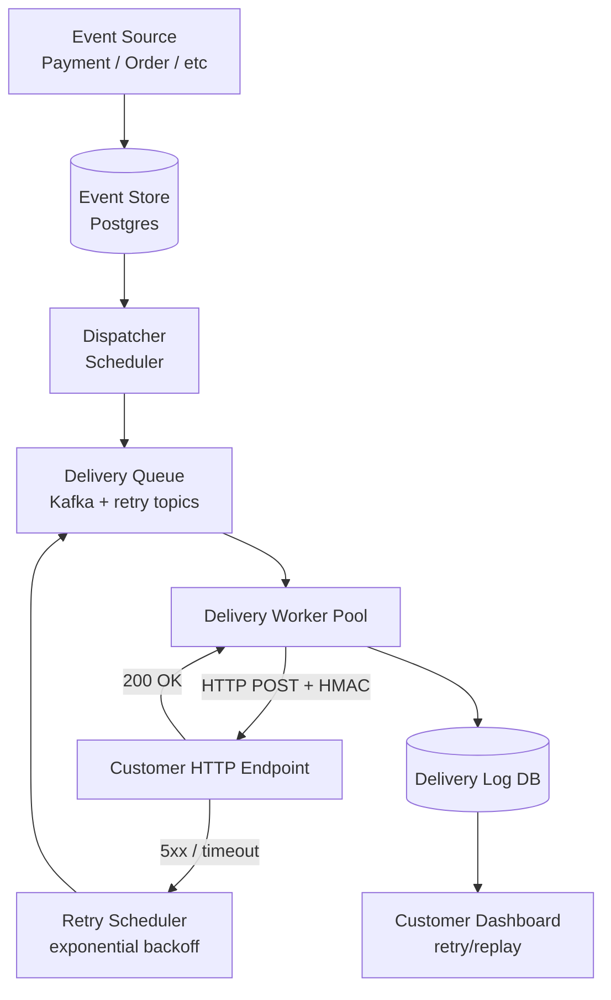

# Design a Webhook Notification System

**Difficulty**: 🟡 Intermediate
**Reading Time**: Coming Soon
**Interview Frequency**: Medium

---

> 🚧 **Full article coming soon.** This stub gives you the essentials to start thinking about this problem.

---

## The Core Problem

Delivering HTTP callbacks to customer-owned endpoints with at-least-once guarantees sounds simple but customer endpoints are unreliable — they return 500s, time out, and go down for deployments. The system must retry without overwhelming customer servers, deduplicate retries on the receiving end, and handle customers who are down for days without losing events.

## Functional Requirements

- Deliver webhook events to registered customer HTTP endpoints
- Retry failed deliveries with exponential backoff
- Provide delivery logs and manual replay capability
- Support event signing so customers can verify authenticity
- Handle 1M webhook deliveries per minute

## Non-Functional Requirements

| Requirement | Target |
|-------------|--------|
| Delivery latency | p99 < 30 seconds for first attempt |
| At-least-once guarantee | Events not lost for 3 days after failure |
| Throughput | 1M deliveries/minute (~16,700/sec) |
| Retry window | Up to 72 hours with exponential backoff |

## Back-of-Envelope Estimates

- **Delivery workers**: 16,700 req/sec × avg 200ms HTTP timeout = ~3,340 concurrent workers needed
- **Retry volume**: 10% failure rate × 1M/min = 100K retries/min; with exponential backoff, load spreads over hours
- **Event log storage**: 1M events/min × 500 bytes = 500MB/min → ~700GB/day retention

## Key Design Decisions

1. **Exponential Backoff with Jitter** — first retry after 1 min, then 2 min, 4 min, 8 min, …, capping at 2 hours; add ±20% random jitter to prevent synchronized retry storms when a customer endpoint recovers.
2. **HMAC Signature for Authenticity** — include `X-Webhook-Signature: hmac-sha256(secret, payload)` in every request; customers verify before processing; prevents replay attacks and spoofed webhooks.
3. **Dead Letter Queue after Max Retries** — after 72 hours / 25 retry attempts, move to DLQ; customer can replay from DLQ manually via dashboard; this prevents infinite retry loops and keeps main queue clean.

## High-Level Architecture

## Top Interview Questions for This Problem

| Question | Tests |
|----------|-------|
| How do you handle a customer endpoint that's been down for 24 hours? | Dead letter queue, retry limits |
| How does HMAC signing protect against replay attacks? | Security, timestamp validation |
| How would you support event ordering guarantees (events in sequence)? | Per-endpoint sequential delivery, ordering guarantees |

## Related Concepts

- [Push notification service for comparison](./push-notification-service)
- [Scalable email service for similar delivery pipeline](./scalable-email-service)

---

*📚 Full deep-dive with multiple approaches, trade-off tables, and pseudocode coming soon.*

## 📚 Resources & References

| Resource | Type | What You'll Learn |
|----------|------|------------------|
| [ByteByteGo — Design a Webhook Delivery System](https://www.youtube.com/@ByteByteGo) | 📺 YouTube | Search "webhook system design" — retry, delivery guarantees, and fan-out |
| [Stripe Engineering: Building a Reliable Webhook System](https://stripe.com/blog/webhooks) | 📖 Blog | How Stripe delivers billions of webhooks with at-least-once guarantees |
| [Shopify Engineering: Webhook Infrastructure](https://shopify.engineering/how-shopify-scales-up-its-server-side-change-data-capture-pipeline) | 📖 Blog | Webhook delivery at Shopify scale — CDC-driven event emission |
| [Standard Webhooks Specification](https://www.standardwebhooks.com/) | 📚 Docs | Emerging standard for webhook security, signing, and retry behavior |
| [Svix: Webhook Infrastructure Architecture](https://www.svix.com/blog/why-webhook-delivery-is-harder-than-you-think/) | 📖 Blog | Why webhook delivery is harder than it looks — ordering, retries, security |
