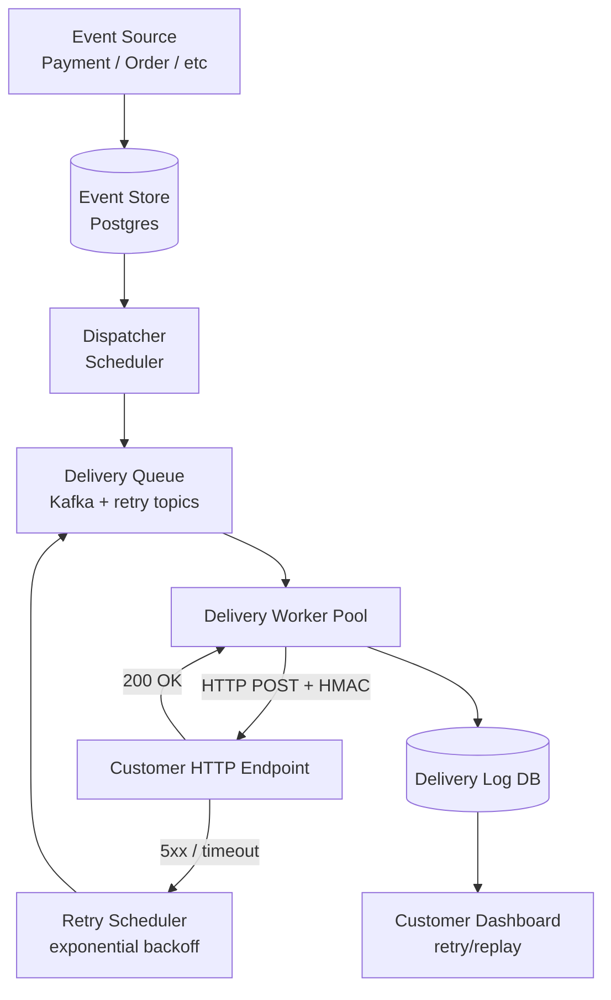
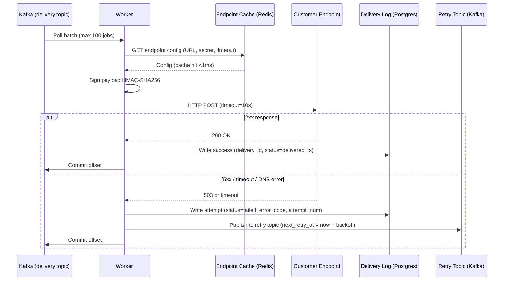
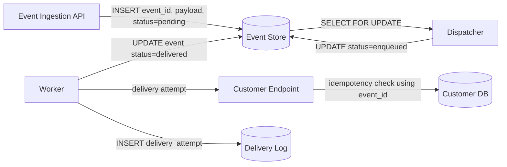
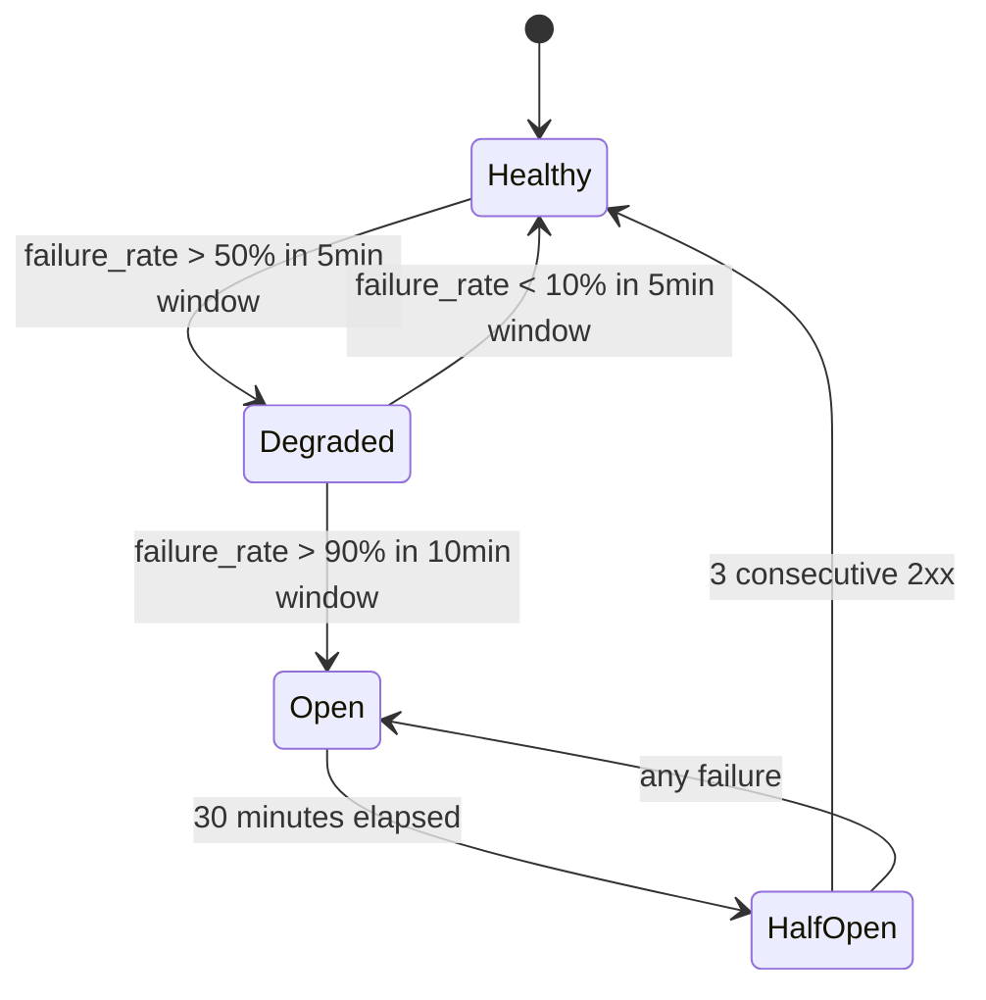

# Design a Webhook Notification System

**Difficulty**: 🟡 Intermediate
**Reading Time**: Coming Soon
**Interview Frequency**: Medium

---

> 🚧 **Full article coming soon.** This stub gives you the essentials to start thinking about this problem.

---

## The Core Problem

Delivering HTTP callbacks to customer-owned endpoints with at-least-once guarantees sounds simple but customer endpoints are unreliable — they return 500s, time out, and go down for deployments. The system must retry without overwhelming customer servers, deduplicate retries on the receiving end, and handle customers who are down for days without losing events.

## Functional Requirements

- Deliver webhook events to registered customer HTTP endpoints
- Retry failed deliveries with exponential backoff
- Provide delivery logs and manual replay capability
- Support event signing so customers can verify authenticity
- Handle 1M webhook deliveries per minute

## Non-Functional Requirements

| Requirement | Target |
|-------------|--------|
| Delivery latency | p99 < 30 seconds for first attempt |
| At-least-once guarantee | Events not lost for 3 days after failure |
| Throughput | 1M deliveries/minute (~16,700/sec) |
| Retry window | Up to 72 hours with exponential backoff |

## Back-of-Envelope Estimates

- **Delivery workers**: 16,700 req/sec × avg 200ms HTTP timeout = ~3,340 concurrent workers needed
- **Retry volume**: 10% failure rate × 1M/min = 100K retries/min; with exponential backoff, load spreads over hours
- **Event log storage**: 1M events/min × 500 bytes = 500MB/min → ~700GB/day retention

## Key Design Decisions

1. **Exponential Backoff with Jitter** — first retry after 1 min, then 2 min, 4 min, 8 min, …, capping at 2 hours; add ±20% random jitter to prevent synchronized retry storms when a customer endpoint recovers.
2. **HMAC Signature for Authenticity** — include `X-Webhook-Signature: hmac-sha256(secret, payload)` in every request; customers verify before processing; prevents replay attacks and spoofed webhooks.
3. **Dead Letter Queue after Max Retries** — after 72 hours / 25 retry attempts, move to DLQ; customer can replay from DLQ manually via dashboard; this prevents infinite retry loops and keeps main queue clean.

## High-Level Architecture



## Top Interview Questions for This Problem

| Question | Tests |
|----------|-------|
| How do you handle a customer endpoint that's been down for 24 hours? | Dead letter queue, retry limits |
| How does HMAC signing protect against replay attacks? | Security, timestamp validation |
| How would you support event ordering guarantees (events in sequence)? | Per-endpoint sequential delivery, ordering guarantees |

## Related Concepts

- [Push notification service for comparison](./push-notification-service)
- [Scalable email service for similar delivery pipeline](./scalable-email-service)

---

## Component Deep Dive 1: Delivery Worker Pool and Retry Scheduler

The delivery worker pool is the most critical component of any webhook system. It sits between the message queue and the outside world, making outbound HTTP calls to customer-registered URLs. Naive implementations treat every delivery as independent and fire-and-forget — this fails spectacularly at scale because of head-of-line blocking, thundering herds, and connection pool exhaustion.

**How it works internally:**

Each worker pulls a delivery job from Kafka, enriches it with endpoint metadata (URL, signing secret, timeout config) from a local cache, signs the payload using HMAC-SHA256, and fires an HTTP POST with a configured timeout (typically 5–30 seconds). If the response is `2xx`, the job is committed and a success record is written to the delivery log. Any other response — `4xx`, `5xx`, timeout, DNS failure, TLS error — is treated as a failure and routed to the retry scheduler.

**Why naive approaches fail at scale:**

A single-threaded worker processing 16,700/sec needs 16,700 × 0.2s = 3,340 concurrent open connections. Naive thread-per-connection models collapse under this load — each thread consumes ~1MB of stack memory, so 3,340 threads = 3.3GB RAM just for stacks. At 10x load (167k/sec), you need 33,400 threads — impossible on a single machine.

The correct approach is async I/O with a fixed-size thread pool. Using Java virtual threads, Go goroutines, or Python asyncio, you can handle 50,000+ concurrent in-flight HTTP requests per worker node with 4–8 CPU cores and 8GB RAM. Each worker node targets a maximum of 5,000 concurrent deliveries; you need ~7 worker nodes for 16,700/sec baseline, ~70 for 10x load.

**The retry scheduler is a separate concern.** Failed deliveries must not block the main delivery queue. The retry scheduler writes failed events to a separate Kafka topic partitioned by `(endpoint_id, next_retry_at)` and uses a scheduled consumer that polls the topic and re-enqueues events only when `next_retry_at <= now`. This prevents the main worker pool from being flooded by events destined for a single unhealthy endpoint.

**Sequence diagram — delivery flow:**



**Implementation options:**

| Approach | Latency (p99) | Throughput per node | Trade-off |
|----------|---------------|---------------------|-----------|
| Thread-per-connection (Java threads) | 15ms | ~500 concurrent | Simple but ~1MB/thread, caps at ~4k connections |
| Async I/O with goroutines (Go) | 8ms | ~50,000 concurrent | Excellent throughput, requires careful timeout and context management |
| Virtual threads (Java 21+) | 10ms | ~30,000 concurrent | JVM ecosystem, lower migration cost from thread-based code |

---

## Component Deep Dive 2: Event Store and Idempotency Layer

The event store has two responsibilities: durably persisting every event so nothing is lost before delivery, and providing idempotency guarantees so that at-least-once delivery does not produce duplicate effects on the customer side.

**How it works internally:**

Events are written to Postgres (or CockroachDB at higher scale) with a UUID `event_id` generated at ingestion time. This `event_id` is included in every webhook payload and in the `X-Webhook-ID` header. Customers are expected to use this `event_id` to deduplicate — they store a `processed_events` table keyed by `event_id` and skip processing if the ID already exists.

The system guarantees at-least-once delivery, NOT exactly-once. The distinction matters: the webhook system will retry until it receives a `2xx`, even if the first attempt succeeded but the `2xx` was lost in transit (network partition, worker crash after send but before commit). This means customers can receive the same event 2+ times during network anomalies, and their idempotency handling is the last line of defense.

**Scale behavior at 10x load:**

At baseline (1M events/min), the event store writes at ~16,700 writes/sec. At 10x (10M events/min, 167,000 writes/sec), a single Postgres primary will saturate its write throughput (~50k writes/sec for simple INSERTs with indexes). Mitigation: shard the event store by `(tenant_id % N)` across N Postgres instances, or migrate to Cassandra/ScyllaDB which handle 500k+ writes/sec per node with linear scaling.

**Idempotency key flow:**



**Key technical decision — status state machine:**

Events move through states: `pending → enqueued → in_flight → delivered | failed | dead_lettered`. The dispatcher uses `SELECT FOR UPDATE SKIP LOCKED` (Postgres 9.5+) to atomically claim events without distributed locks — this is a critical pattern that allows multiple dispatcher instances to run concurrently without double-enqueuing events. At 100x load, even `SKIP LOCKED` becomes a bottleneck; the solution is to move dispatch coordination entirely to Kafka consumer group offsets, eliminating the Postgres lock entirely.

---

## Component Deep Dive 3: HMAC Signing and Replay Attack Prevention

Every webhook delivery includes a cryptographic signature in the `X-Webhook-Signature` header. The signature is computed as `HMAC-SHA256(endpoint_secret, payload_bytes)` and hex-encoded. Customers store a per-endpoint secret (generated at endpoint registration, rotatable via API) and recompute the signature on receipt.

**The replay attack problem:** Without a timestamp, an attacker who intercepts a valid signed webhook can replay it indefinitely — the signature will always verify. The fix is to include a Unix timestamp in both the signed payload and a separate `X-Webhook-Timestamp` header. Customers reject events where `|now - timestamp| > 300 seconds` (5-minute window), making replays stale before they can be abused.

**Implementation specifics:**

```
X-Webhook-Signature: sha256=abc123...
X-Webhook-Timestamp: 1717200000
X-Webhook-ID: evt_01HXZ9K2...
```

The signed string is `timestamp + "." + payload_body` — concatenating timestamp with the raw body before hashing ensures the timestamp cannot be swapped without invalidating the signature. This pattern is used verbatim by Stripe, GitHub, and Shopify.

**Rotating secrets without downtime:** When a customer rotates their endpoint secret, the system stores both the old and new secret for a 24-hour overlap window. The worker signs with the new secret but also includes a secondary signature with the old secret in `X-Webhook-Signature-V1`. Customers can verify against either during the rotation window, then deprecate the old key. This pattern prevents signature failures during secret rotation.

**Performance:** HMAC-SHA256 on a 1KB payload takes ~2 microseconds on modern hardware. At 16,700 deliveries/sec, signing adds 33ms of total CPU time across the cluster — negligible.

---

## Data Model

```sql
-- Registered customer endpoints
CREATE TABLE webhook_endpoints (
    endpoint_id     UUID PRIMARY KEY DEFAULT gen_random_uuid(),
    tenant_id       UUID NOT NULL,
    url             TEXT NOT NULL,                    -- e.g. https://customer.com/hooks/payments
    signing_secret  BYTEA NOT NULL,                   -- 32-byte random secret, encrypted at rest
    event_types     TEXT[] NOT NULL DEFAULT '{}',     -- ['payment.succeeded', 'payment.failed'] or ['*']
    is_active       BOOLEAN NOT NULL DEFAULT TRUE,
    max_retries     INT NOT NULL DEFAULT 25,
    timeout_ms      INT NOT NULL DEFAULT 10000,
    created_at      TIMESTAMPTZ NOT NULL DEFAULT now(),
    updated_at      TIMESTAMPTZ NOT NULL DEFAULT now()
);
CREATE INDEX idx_webhook_endpoints_tenant ON webhook_endpoints(tenant_id) WHERE is_active = TRUE;

-- Durable event store — written before any delivery attempt
CREATE TABLE webhook_events (
    event_id        UUID PRIMARY KEY,                 -- e.g. evt_01HXZ9K2VRMJ8GTE3
    tenant_id       UUID NOT NULL,
    endpoint_id     UUID NOT NULL REFERENCES webhook_endpoints(endpoint_id),
    event_type      TEXT NOT NULL,                    -- e.g. 'payment.succeeded'
    payload         JSONB NOT NULL,                   -- full event body
    payload_size_b  INT NOT NULL,
    status          TEXT NOT NULL DEFAULT 'pending',  -- pending|enqueued|in_flight|delivered|failed|dead_lettered
    attempt_count   INT NOT NULL DEFAULT 0,
    next_retry_at   TIMESTAMPTZ,
    created_at      TIMESTAMPTZ NOT NULL DEFAULT now(),
    delivered_at    TIMESTAMPTZ
);
CREATE INDEX idx_webhook_events_endpoint_status ON webhook_events(endpoint_id, status, next_retry_at)
    WHERE status IN ('pending', 'failed');
CREATE INDEX idx_webhook_events_tenant_created ON webhook_events(tenant_id, created_at DESC);

-- Append-only delivery attempt log — never updated, only inserted
CREATE TABLE webhook_delivery_attempts (
    attempt_id      UUID PRIMARY KEY DEFAULT gen_random_uuid(),
    event_id        UUID NOT NULL REFERENCES webhook_events(event_id),
    attempt_num     INT NOT NULL,                     -- 1, 2, 3, ...
    worker_id       TEXT NOT NULL,                    -- which worker node made this attempt
    attempted_at    TIMESTAMPTZ NOT NULL DEFAULT now(),
    duration_ms     INT NOT NULL,                     -- full round-trip including DNS + TLS
    http_status     INT,                              -- NULL if connection error
    response_body   TEXT,                             -- first 1KB of response for debugging
    error_type      TEXT,                             -- 'timeout'|'dns_failure'|'tls_error'|'http_5xx'|NULL
    success         BOOLEAN NOT NULL
);
CREATE INDEX idx_delivery_attempts_event ON webhook_delivery_attempts(event_id, attempt_num);

-- Dead letter queue — events that exhausted all retry attempts
CREATE TABLE webhook_dead_letters (
    dl_id           UUID PRIMARY KEY DEFAULT gen_random_uuid(),
    event_id        UUID NOT NULL REFERENCES webhook_events(event_id),
    endpoint_id     UUID NOT NULL,
    tenant_id       UUID NOT NULL,
    final_attempt   INT NOT NULL,
    died_at         TIMESTAMPTZ NOT NULL DEFAULT now(),
    replayed_at     TIMESTAMPTZ,                      -- NULL until customer triggers manual replay
    replay_count    INT NOT NULL DEFAULT 0
);
CREATE INDEX idx_dead_letters_tenant ON webhook_dead_letters(tenant_id, died_at DESC);
```

---

## Scale Bottlenecks

| Traffic Level | Component That Breaks | Symptoms | Mitigation |
|---------------|----------------------|----------|------------|
| 10x baseline (167k deliveries/sec) | Worker node connection pool exhaustion | Delivery latency spikes from 200ms to 5–30s; TCP connection errors in worker logs | Scale worker fleet from 7 to 70 nodes; use async I/O (Go goroutines / Java virtual threads) to handle 50k concurrent connections per node |
| 10x baseline | Postgres event store write throughput (~50k inserts/sec ceiling) | INSERT latency > 100ms; `pg_stat_activity` shows long lock waits | Shard event store by `tenant_id % 16`; or migrate to Cassandra (500k writes/sec per node) |
| 100x baseline (1.67M/sec) | Kafka partition count limits fan-out | Consumer lag grows unboundedly; events delivered hours late | Pre-provision 1,000+ partitions per topic; increase consumer group size proportionally; consider separate Kafka clusters per region |
| 100x baseline | Retry topic becomes a thundering herd when a large customer endpoint recovers | All queued retries for that endpoint fire simultaneously, overwhelming it with 10k+ req/sec in seconds | Per-endpoint rate limiting in the retry scheduler; circuit breaker that caps retry rate to `min(queued_retries, endpoint_rate_limit)` per second |
| 1000x baseline (16.7M/sec) | Single-region delivery; DNS + TLS overhead per worker | p99 latency > 30s SLA; connection setup overhead dominates delivery time | Multi-region deployment with geo-routing; persistent HTTP/2 connection pools per endpoint (amortize TLS handshake across many deliveries); HTTP/2 multiplexing reduces connection overhead by 10–50x |

---

## How Stripe Built This

Stripe delivers billions of webhooks per month — their webhook infrastructure is one of the most battle-tested in the industry and they have published detailed specifics in engineering blog posts and conference talks.

**Technology choices:** Stripe uses Ruby on Rails for their API layer but their webhook dispatch infrastructure runs on a custom event pipeline backed by their own distributed task queue (similar to Sidekiq but at massive scale). Events are persisted in their primary MySQL database cluster before dispatch, ensuring durability. Delivery workers run as isolated Ruby processes managed by a custom supervisor, with connection pools maintained via persistent keep-alive connections to repeat-delivery endpoints.

**Specific numbers:** Stripe delivers over 100 million webhooks per day (approximately 1,160/sec average, with peaks exceeding 50,000/sec during high-traffic events like Black Friday). Their p99 first-attempt delivery latency is under 10 seconds for most endpoints. Their retry window is 72 hours across up to 25 attempts with exponential backoff, exactly matching the pattern described in this article.

**Non-obvious architectural decision:** Stripe tracks per-endpoint health separately from per-event retry state. If an endpoint returns `5xx` on 90%+ of deliveries in a 10-minute window, Stripe marks the endpoint as "degraded" and slows delivery to that endpoint down to 1 attempt per minute instead of exhausting retries at full speed. This prevents a single unhealthy customer from consuming disproportionate retry capacity and competing with healthy endpoints. When the endpoint recovers (three consecutive `2xx` responses), the backlog of queued events drains at controlled speed rather than all at once — avoiding the recovery thundering herd problem.

**Signing implementation:** Stripe signs with `HMAC-SHA256(webhook_secret, timestamp + "." + payload)` and includes both the timestamp and signature in headers. The signed payload format prevents timestamp-swapping attacks. Their webhook signing specification has become the de facto standard; the Standard Webhooks initiative (standardwebhooks.com) codified Stripe's approach.

Source: [Stripe Engineering Blog — Webhooks](https://stripe.com/blog/webhooks) and Stripe developer documentation.

---

## Interview Angle

**What the interviewer is testing:** The interviewer is evaluating whether you understand the operational complexity of making outbound HTTP calls reliably at scale — specifically, how retry state management, customer endpoint isolation, and idempotency interact in a distributed system.

**Common mistakes candidates make:**

1. **Treating retries as simple queue re-enqueuing.** Candidates say "just put failed events back in the queue." This is wrong because it causes hot endpoints (down for hours) to monopolize the queue. The correct answer separates the retry topic from the main delivery topic and uses a scheduled consumer that respects `next_retry_at` timestamps, isolating per-endpoint backlog from the main pipeline.

2. **Claiming exactly-once delivery is achievable.** This shows unfamiliarity with distributed systems fundamentals. At-least-once is the realistic guarantee because a worker can send a request, receive a `2xx`, and crash before committing the success to the delivery log — causing a re-delivery. The correct design shifts idempotency responsibility to the customer via the `event_id` header.

3. **Ignoring the recovery thundering herd.** When asked "what happens when a customer endpoint comes back online after 6 hours?", candidates say "the retries will drain." The problem is that 100k queued retries all become eligible simultaneously, sending 100k requests in seconds and immediately overwhelming the just-recovered endpoint. The correct answer includes per-endpoint rate limiting in the retry scheduler (e.g., max 100 deliveries/second per endpoint) and a gradual ramp-up over several minutes.

**The insight that separates good from great answers:** Treating customer endpoints as circuit-breaker-gated destinations rather than simple HTTP targets. Great candidates propose per-endpoint health tracking (success rate over a sliding window), automatic circuit-breaker open/half-open/closed state transitions, and slow-start recovery — borrowing the same pattern used in load balancers. This shows understanding that the webhook system's reliability depends entirely on the behavior of thousands of external systems you don't control.

---

## Key Numbers to Remember

| Metric | Value | Context |
|--------|-------|---------|
| Baseline throughput | 16,700 deliveries/sec | From 1M events/min requirement |
| Concurrent workers needed | ~3,340 | At 200ms avg delivery time, 16,700/sec throughput |
| Worker nodes (async I/O) | 7 nodes | Each handles 50k concurrent connections using goroutines |
| Retry attempts before DLQ | 25 attempts | Over 72-hour window |
| Retry backoff cap | 2 hours | After reaching cap, retries every 2 hours until 72h expires |
| HMAC signing overhead | ~2 microseconds | Per 1KB payload on modern hardware — negligible |
| Replay attack window | 5 minutes | `|now - X-Webhook-Timestamp| <= 300s` |
| Event store write ceiling | ~50k writes/sec | Single Postgres primary before sharding required |
| Stripe delivery volume | 100M+ webhooks/day | ~1,160/sec average, peaks 50k+/sec |
| Storage per event | ~500 bytes | Payload + metadata + delivery log; 700GB/day at 1M events/min |

---

## Fan-Out Architecture: One Event to Many Endpoints

A single business event often needs to be delivered to multiple registered endpoints. For example, a tenant may register 3 URLs all subscribed to `payment.succeeded` — a CRM system, an analytics pipeline, and a fulfillment service. The fan-out architecture determines whether delivery to each is independent or coupled.

**Approach A — Synchronous fan-out at ingestion:**
The ingestion API queries all matching endpoints at write time and creates one `webhook_event` row per endpoint in a single transaction. This is the simplest approach and makes the delivery state per-endpoint explicit. Downside: if a tenant has 100 registered endpoints, one business event causes 100 INSERTs at ingestion time, multiplying write load by the average fan-out factor (typically 1–5x but up to 100x for large enterprise tenants).

**Approach B — Deferred fan-out at dispatch:**
Ingestion writes a single `webhook_event` row with `endpoint_id = NULL` and an `event_type`. The dispatcher queries `webhook_endpoints` at dispatch time to find all matching endpoints and creates per-endpoint delivery jobs. This decouples ingestion throughput from fan-out width. Trade-off: the dispatcher becomes a fan-out bottleneck; at 16,700 events/sec with avg fan-out of 3, the dispatcher must produce 50,100 delivery jobs/sec.

**Approach C — Kafka topic-per-event-type:**
Each event type maps to a Kafka topic (e.g., `webhooks.payment.succeeded`). Endpoint subscriptions map to consumer groups. This scales fan-out horizontally without any dispatcher bottleneck — adding a new endpoint subscription means creating a new consumer group, which costs zero additional write load. Trade-off: Kafka topic count must be bounded (recommended max ~10,000 topics per cluster); event types must be predefined rather than arbitrary strings.

| Approach | Ingestion Complexity | Fan-Out Ceiling | Best For |
|----------|---------------------|-----------------|----------|
| Synchronous fan-out at ingestion | O(N endpoints per event) writes | Limited by DB write throughput × fan-out | Simple systems, low fan-out (<5 endpoints/event) |
| Deferred fan-out at dispatcher | O(1) writes at ingestion | Dispatcher throughput / avg fan-out | Medium scale, variable endpoint counts |
| Kafka topic-per-event-type | O(1) writes, zero dispatcher | Effectively unlimited (consumer group scaling) | High scale, bounded event type catalog |

---

## Endpoint Health Tracking and Circuit Breaker

Without per-endpoint health tracking, a single misconfigured customer endpoint that always returns `503` will consume retry capacity indefinitely, generating 25 delivery attempts over 72 hours for every event — at the cost of real compute and Kafka storage that could serve other customers.

**Circuit breaker states per endpoint:**



**State definitions and delivery behavior:**

- **Healthy**: Deliver at normal speed. Retry on failure with standard exponential backoff.
- **Degraded**: Deliver at 50% of normal rate. Alert the customer via email/dashboard. Retries use longer initial backoff (5 minutes instead of 1 minute).
- **Open**: Stop all new deliveries. Queue events in the retry topic. No outbound HTTP traffic to this endpoint. Customer receives a dashboard alert with a timeline of failures.
- **Half-Open**: Send 1 probe delivery per minute. If 3 consecutive succeed, transition to Healthy and begin draining the queued backlog at a controlled rate (e.g., max 200 deliveries/sec to avoid thundering herd on recovery).

**Storage:** Circuit breaker state is stored in Redis with TTL. Key: `cb:endpoint:{endpoint_id}` → `{state, failure_count, success_count, state_changed_at}`. Redis provides sub-millisecond reads so every worker can check endpoint state before attempting delivery without adding meaningful latency.

**Rate at which state is computed:** A background health-aggregator job (runs every 30 seconds) reads `webhook_delivery_attempts` for all endpoints updated in the last 10 minutes, computes rolling success rates, and writes updated circuit breaker state to Redis. This separates the health computation from the hot delivery path.

---

## Ordering Guarantees: Per-Endpoint Sequential Delivery

By default, the webhook system delivers events concurrently — multiple workers may be delivering events to the same endpoint simultaneously. This is fine for most use cases but breaks event-sourced systems that require strict ordering (e.g., `order.created` must be processed before `order.shipped`).

**The problem with concurrent delivery:**

If events `A` and `B` are created in order but delivered concurrently, `B` may arrive before `A` due to network jitter or a retry on `A`. Customers cannot reconstruct original order from arrival order alone.

**Solution: Per-endpoint ordered delivery queue**

Partition the Kafka delivery topic by `endpoint_id` (not by `event_id`). Kafka guarantees that messages within a single partition are consumed in order. Assign one consumer (one worker coroutine) per partition — this ensures events for a given endpoint are always delivered sequentially. The trade-off: one slow endpoint blocks all subsequent events for that endpoint until the current delivery completes or times out.

**Sequence number in payload:** Include a monotonically increasing `sequence_number` in the webhook payload. Customers can detect gaps (missed events) and out-of-order delivery using this field:

```json
{
  "id": "evt_01HXZ9K2VRMJ8GTE3",
  "type": "order.updated",
  "sequence": 4821,
  "created_at": "2024-05-31T10:00:00Z",
  "data": { "order_id": "ord_123", "status": "shipped" }
}
```

If a customer receives `sequence=4823` before `sequence=4822`, they know event 4822 is in flight or was lost, and they can call the webhook replay API to re-request it explicitly.

**Ordered vs unordered trade-off:**

| Mode | Throughput | Latency Impact | Use Case |
|------|-----------|----------------|----------|
| Unordered (default) | Full parallel; 16,700/sec per endpoint | None | Idempotent consumers, analytics, notifications |
| Ordered (per-endpoint sequential) | Limited by single-consumer throughput; ~500/sec per endpoint | +50–200ms (head-of-line blocking) | Event-sourced systems, inventory updates, state machines |

---

## Delivery Log and Customer Dashboard

The delivery log is append-only and serves two purposes: operational debugging for the platform team, and a customer-facing audit trail accessible via dashboard and API.

**What customers need from the delivery log:**
- Every attempt for every event (timestamp, HTTP status, duration, error message)
- Current event status (delivered, pending retry, dead-lettered)
- One-click manual replay for any event in the last 72 hours
- Bulk replay from DLQ after an extended outage

**Retention policy:**
- Active delivery attempts: retained for 30 days in the hot `webhook_delivery_attempts` table
- Events older than 30 days: archived to S3 as Parquet files (1 file per tenant per day); queryable via Athena for compliance
- DLQ events: retained for 7 days in the hot path; archived to S3 indefinitely

**API surface for customers:**

```
GET  /v1/webhooks/events?status=failed&limit=100          # list failed events
GET  /v1/webhooks/events/{event_id}/attempts              # all delivery attempts for one event
POST /v1/webhooks/events/{event_id}/replay                # trigger manual re-delivery
POST /v1/webhooks/dead-letters/replay-all                 # bulk replay from DLQ
GET  /v1/webhooks/endpoints/{endpoint_id}/health          # current circuit breaker state
```

**Dashboard metrics to surface per endpoint:**
- Success rate (last 1h, 24h, 7d)
- p50 / p99 delivery latency
- Events in DLQ (count, oldest event age)
- Circuit breaker state and history

---

## Observability: What to Instrument

A webhook system that lacks granular metrics becomes impossible to operate at scale. Key signals to emit at every layer:

**Worker metrics (emit per delivery attempt):**
- `webhook_delivery_duration_ms` (histogram, labeled by `event_type`, `http_status_class`)
- `webhook_delivery_attempts_total` (counter, labeled by `success=true|false`, `error_type`)
- `webhook_worker_queue_depth` (gauge, labeled by `topic`)
- `webhook_worker_concurrent_in_flight` (gauge)

**Retry scheduler metrics:**
- `webhook_retry_queue_depth` (gauge, labeled by `endpoint_health=healthy|degraded|open`)
- `webhook_dlq_events_total` (counter — rate of events entering DLQ; alert if this spikes)
- `webhook_retry_delay_minutes` (histogram — how long between creation and next retry attempt)

**Alerting rules:**
- DLQ intake rate > 100 events/min for 5 consecutive minutes → PagerDuty alert (indicates widespread endpoint failures or a delivery pipeline bug)
- Worker queue consumer lag > 60 seconds → scale-out alert
- Any endpoint with circuit breaker in `Open` state > 4 hours → notify customer via email

---

## Security Hardening Beyond HMAC

HMAC signing verifies authenticity but does not address all threat vectors. A production webhook system needs multiple security layers:

**IP allowlisting for egress:** Publish a static list of outbound IP ranges from which webhooks originate (e.g., `203.0.113.0/24`). Customers can firewall their endpoints to only accept connections from these IPs. This prevents spoofed webhooks from arbitrary sources even if an attacker obtains a valid signing secret. The IP list must be kept stable — adding new IP ranges requires advance notice (typically 30 days) to avoid breaking customers' firewall rules.

**TLS certificate validation:** Workers must validate the TLS certificate of the customer endpoint. Accepting self-signed or expired certificates without a flag exposes the platform to MITM attacks where an attacker intercepts the delivery in transit. Provide customers with a `ssl_verify=false` opt-out flag for development environments, but default to strict validation in production.

**Payload size limits:** Enforce a maximum webhook payload size (typically 2MB). Unbounded payloads enable a resource exhaustion attack where a malicious event source creates payloads that consume all worker memory during JSON serialization. Reject oversized payloads at ingestion with a `413 Payload Too Large` error.

**Rate limiting per tenant:** Limit the rate at which a single tenant can produce events — e.g., max 10,000 events/sec per tenant. Without this, a buggy integration that produces events in a tight loop can flood the delivery pipeline and cause tail latency spikes for all other tenants. Use a token bucket algorithm in Redis (key: `rate_limit:tenant:{tenant_id}`, capacity: 10,000/sec).

**Secrets storage:** Signing secrets are never stored in plaintext. Use envelope encryption: encrypt secrets with a per-tenant data key (AES-256), encrypt data keys with a master key in AWS KMS or HashiCorp Vault. Rotate master keys annually. This means a database breach does not expose signing secrets.

| Security Control | Threat Mitigated | Implementation Cost |
|-----------------|-----------------|-------------------|
| HMAC-SHA256 signing + timestamp | Payload tampering, replay attacks | Low — compute + 3 extra HTTP headers |
| IP allowlist for egress | Spoofed webhooks from arbitrary IPs | Medium — requires static IP pool, advance change notice |
| TLS certificate validation | Man-in-the-middle interception | Low — default behavior, opt-out flag for dev |
| Payload size limit (2MB) | Worker memory exhaustion | Low — ingestion validation |
| Tenant rate limiting (10k/sec) | Noisy-neighbor flooding | Medium — Redis token bucket per tenant |
| Envelope-encrypted secrets (KMS) | DB breach exposing signing secrets | Medium — KMS API calls add ~1ms per secret fetch |

---

## Pseudocode: Worker Delivery Loop

The following pseudocode shows the core delivery logic with all production concerns handled:

```python
async def delivery_worker(kafka_consumer, redis_client, db_pool):
    async for batch in kafka_consumer.poll(max_records=100, timeout_ms=500):
        tasks = []
        for record in batch:
            job = DeliveryJob.from_kafka(record)
            tasks.append(deliver_with_circuit_breaker(job, redis_client, db_pool))
        await asyncio.gather(*tasks, return_exceptions=True)
        await kafka_consumer.commit()

async def deliver_with_circuit_breaker(job, redis_client, db_pool):
    cb_state = await redis_client.get(f"cb:endpoint:{job.endpoint_id}")
    if cb_state == "OPEN":
        # re-queue with delay; do not attempt delivery
        await requeue_with_delay(job, delay_seconds=300)
        return

    endpoint = await get_endpoint_config(job.endpoint_id, redis_client)
    signed_payload = hmac_sign(endpoint.secret, job.payload, job.event_id, timestamp=now())

    attempt_start = time.monotonic()
    try:
        async with httpx.AsyncClient(timeout=endpoint.timeout_ms / 1000) as client:
            response = await client.post(
                endpoint.url,
                content=job.payload,
                headers={
                    "Content-Type": "application/json",
                    "X-Webhook-ID": job.event_id,
                    "X-Webhook-Timestamp": str(int(now())),
                    "X-Webhook-Signature": f"sha256={signed_payload}",
                }
            )
        duration_ms = int((time.monotonic() - attempt_start) * 1000)
        success = 200 <= response.status_code < 300

    except (httpx.TimeoutException, httpx.ConnectError) as e:
        duration_ms = int((time.monotonic() - attempt_start) * 1000)
        success = False
        response = None
        error_type = classify_error(e)  # 'timeout' | 'dns_failure' | 'tls_error'

    await log_attempt(db_pool, job, success, duration_ms, response, error_type)
    await update_circuit_breaker(redis_client, job.endpoint_id, success)

    if not success:
        if job.attempt_num >= job.max_retries:
            await move_to_dlq(db_pool, job)
        else:
            backoff = min(60 * (2 ** job.attempt_num), 7200)  # cap at 2h
            jitter = random.uniform(0.8, 1.2)
            await requeue_with_delay(job, delay_seconds=int(backoff * jitter))
```

This pseudocode demonstrates the key production patterns: circuit breaker check before every attempt, HMAC signing with timestamp, classify-and-handle errors distinctly from HTTP failures, exponential backoff with jitter, and DLQ promotion when retries are exhausted.

---

## Common Failure Scenarios and Mitigations

| Failure Scenario | Impact Without Mitigation | Mitigation |
|-----------------|--------------------------|------------|
| Customer endpoint returns `200 OK` but takes 29s per request | Workers accumulate 29s × 16,700/sec = 483k in-flight connections; worker nodes OOM | Per-endpoint timeout config (default 10s, max 30s); circuit breaker opens after sustained slow responses |
| Kafka broker rolling restart during peak | Consumer group rebalance; up to 30s delivery gap | Set `session.timeout.ms=45000`; use sticky partition assignment; pre-warm replacement consumers before draining old ones |
| Worker node crashes mid-batch (50 jobs in flight) | Up to 50 events have been HTTP-delivered but offset not committed; all 50 re-delivered on restart | At-least-once semantics by design; customer-side idempotency with `event_id` handles duplicates |
| Tenant's DB migration causes all endpoints to return `500` for 2 hours | 1M queued retries accumulate; on recovery, 1M requests fire simultaneously | Circuit breaker opens after 10 min of 90%+ failure; on recovery, slow-start drains backlog at 200 req/sec |
| DNS TTL caching causes workers to hit decommissioned IP after customer CDN change | All deliveries to that endpoint fail with `Connection refused` | Respect DNS TTL; set `resolver_cache_ttl=30s`; treat connection errors as transient (retry, not permanent failure) |

---

## TL;DR — Key Takeaways

- **At-least-once, never exactly-once.** A worker can deliver successfully and crash before recording it. Design customers to be idempotent using the `event_id` header — this is non-negotiable.
- **Separate the retry topic from the main delivery topic.** Mixing them causes a single unhealthy endpoint to block delivery for healthy ones. The retry scheduler must respect per-event `next_retry_at` timestamps.
- **Circuit breakers per endpoint are mandatory at scale.** Without them, a degraded endpoint consumes retry capacity proportional to its event volume, starving other tenants. Open the breaker after 90% failure rate in 10 minutes; slow-start on recovery.
- **HMAC + timestamp = replay-proof signing.** Sign `timestamp + "." + payload_body`, not just the payload. Include `X-Webhook-Timestamp` in headers. Reject events where `|now - timestamp| > 300s`.
- **Fan-out strategy drives your DB write amplification.** With avg 3 endpoints per event type and 16,700 events/sec, synchronous fan-out produces 50,100 writes/sec — plan your event store sharding strategy before you need it.
- **Stripe delivers 100M+ webhooks/day** (peak 50k/sec) using per-endpoint health tracking, 25 retry attempts over 72 hours, and controlled slow-start recovery. Their signing format (`HMAC-SHA256(secret, timestamp + "." + body)`) is now the industry standard via the Standard Webhooks spec.
- **HTTP/2 persistent connections reduce TLS overhead by 10–50x** at 1000x scale — switching from HTTP/1.1 connection-per-request to multiplexed HTTP/2 per endpoint is the single highest-leverage optimization at extreme throughput.
- **DLQ is a customer-facing product feature, not just an ops tool.** Expose DLQ events in the customer dashboard with one-click replay and bulk replay. Customers who lose events due to extended outages will not churn if they can self-serve recovery without contacting support.

---

<!-- end of deep-dive sections -->

*📚 Full deep-dive with multiple approaches, trade-off tables, and pseudocode coming soon.*

## 📚 Resources & References

| Resource | Type | What You'll Learn |
|----------|------|------------------|
| [ByteByteGo — Design a Webhook Delivery System](https://www.youtube.com/@ByteByteGo) | 📺 YouTube | Search "webhook system design" — retry, delivery guarantees, and fan-out |
| [Stripe Engineering: Building a Reliable Webhook System](https://stripe.com/blog/webhooks) | 📖 Blog | How Stripe delivers billions of webhooks with at-least-once guarantees |
| [Shopify Engineering: Webhook Infrastructure](https://shopify.engineering/how-shopify-scales-up-its-server-side-change-data-capture-pipeline) | 📖 Blog | Webhook delivery at Shopify scale — CDC-driven event emission |
| [Standard Webhooks Specification](https://www.standardwebhooks.com/) | 📚 Docs | Emerging standard for webhook security, signing, and retry behavior |
| [Svix: Webhook Infrastructure Architecture](https://www.svix.com/blog/why-webhook-delivery-is-harder-than-you-think/) | 📖 Blog | Why webhook delivery is harder than it looks — ordering, retries, security |
