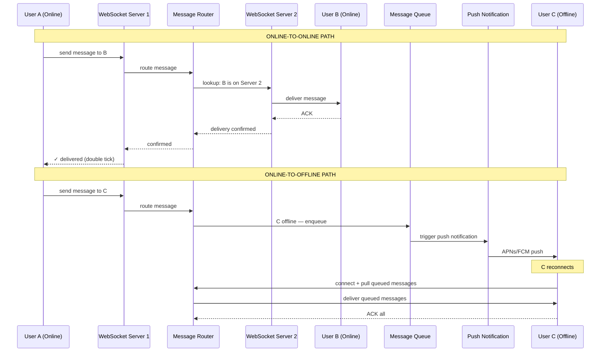
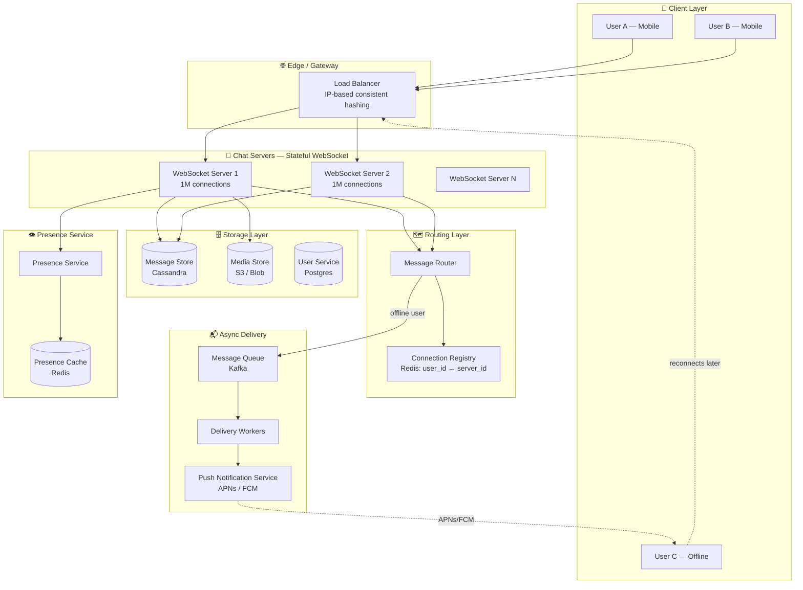
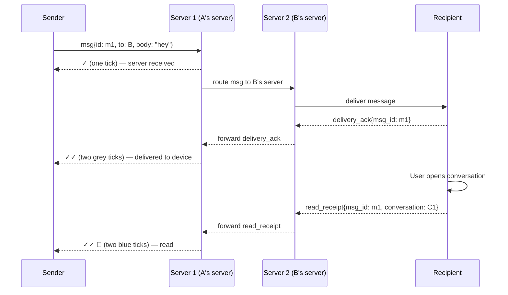
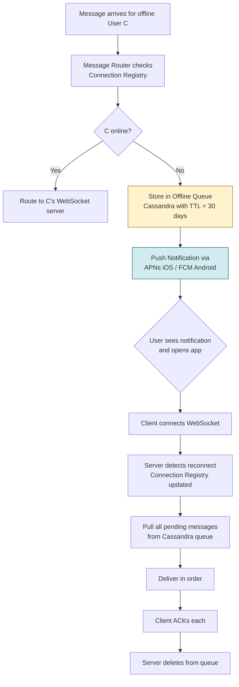
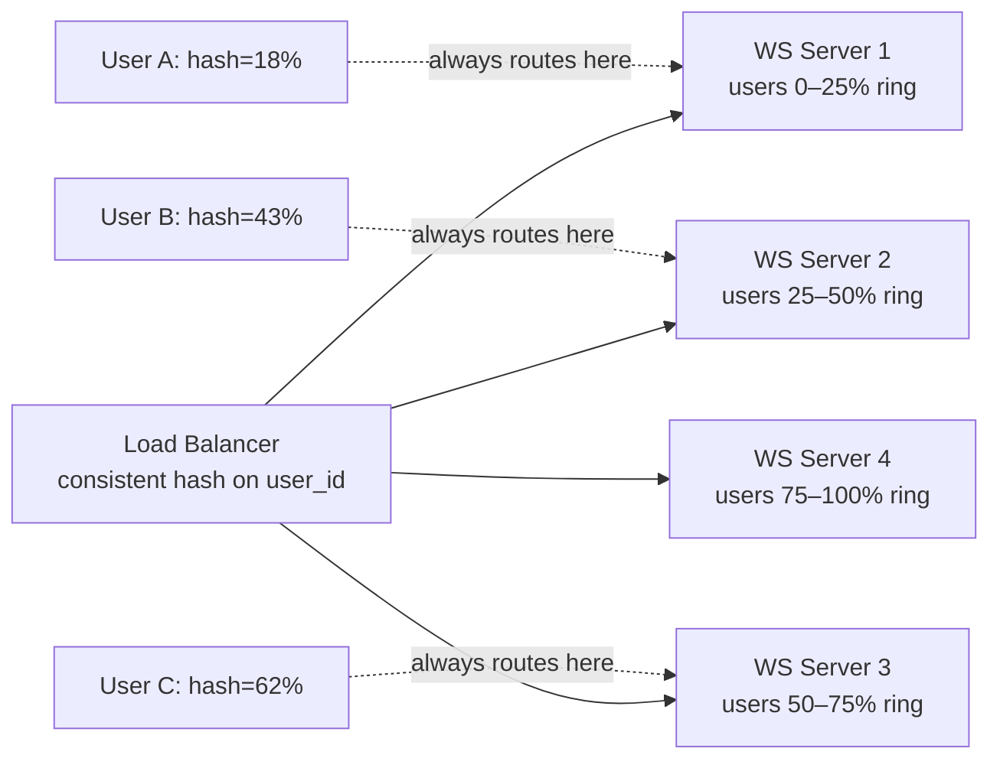
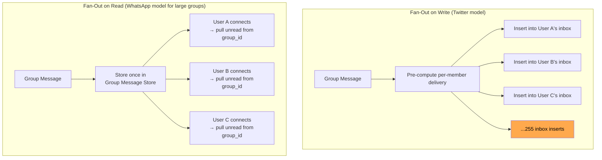
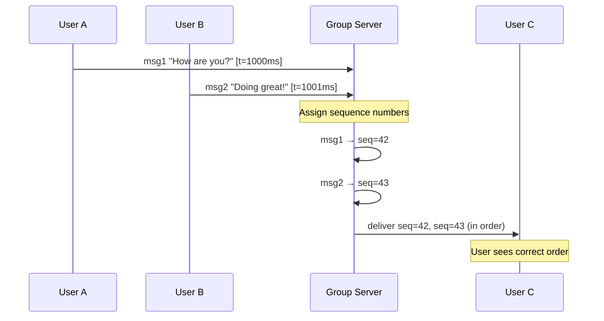

# Design WhatsApp or Facebook Messenger — Real-Time Messaging at Scale

> **Difficulty**: 🔴 Advanced — A benchmark distributed systems problem. Requires understanding of WebSocket connection management, message delivery guarantees, and fan-out at massive scale.

---

## Table of Contents

| # | Section | Core Concept |
|---|---------|-------------|
| 1 | [5-Minute Mental Model](#5-minute-mental-model) | Two paths: online delivery vs offline storage |
| 2 | [Why Messaging is Hard](#why-messaging-is-hard) | Reliability, ordering, fan-out |
| 3 | [Requirements & Numbers](#requirements-with-real-numbers) | Scale targets |
| 4 | [Capacity Estimation](#capacity-estimation) | The math you need |
| 5 | [High-Level Architecture](#high-level-architecture) | All components together |
| 6 | [Deep Dive: Message Delivery Flow](#deep-dive-message-delivery-flow) | Online vs offline paths |
| 7 | [Deep Dive: WebSocket Management](#deep-dive-websocket-connection-management) | Stateful servers, registry |
| 8 | [Deep Dive: Group Messaging Fan-Out](#deep-dive-group-messaging-fan-out) | Fan-out-on-write vs read |
| 9 | [Trade-Off Table](#trade-off-table) | Key architectural decisions |
| 10 | [Problems at Scale](#problems-at-scale) | What breaks and how to fix it |
| 11 | [Follow-Up Questions](#follow-up-questions) | Interviewers love to ask |
| 12 | [Key Takeaways](#key-takeaways) | Numbers to memorize |

---

## 5-Minute Mental Model

Before diving into failure modes and edge cases, understand the **two fundamental delivery paths**:

1. **Online delivery** — both sender and receiver are connected right now → message travels directly across servers
2. **Offline delivery** — receiver is offline → message is stored and pushed when they reconnect



**The key insight**: WhatsApp delivers 100B messages/day with just ~50 engineers (at the time of the 2014 acquisition). The secret is architectural simplicity: Erlang for massive concurrency, each server handles 1M+ connections, and the delivery flow is kept brutally simple.

---

## Why Messaging is Hard

A naive chat app breaks in ways that aren't obvious until you think about scale:

```mermaid
graph TD
    A[Send message] --> B{User online?}

    B -->|Yes| C[Route to their WebSocket server]
    C --> D{Which server?}
    D -->|No registry| E[Broadcast to all servers!<br/>O(n) fan-out just to find 1 user]
    D -->|With registry| F[Route to correct server]

    B -->|No| G[Store in queue]
    G --> H{How long to retain?}
    H -->|Forever| I[Storage explodes!]
    H -->|7 days| J[Message lost if not collected!]

    A --> K{Ordering guarantee?}
    K -->|No| L[Messages arrive out of order!]
    K -->|Yes, single sequence| M[Sequence server = SPOF!]

    A --> N{Exactly once?}
    N -->|No dedup| O[Same message delivered twice!]
    N -->|Server-side dedup| P[Message ID storage cost]

    style E fill:#ff6b6b,color:#fff
    style I fill:#ff6b6b,color:#fff
    style L fill:#ff6b6b,color:#fff
    style M fill:#ffa94d,color:#000
```

| Trap | Why it matters | Fix |
|------|---------------|-----|
| **No connection registry** | Can't route message to correct server without broadcasting | Redis hash: `user_id → server_id` |
| **Unbounded message storage** | Offline users accumulate messages forever | TTL + read receipt → delete after delivery |
| **Out-of-order delivery** | User sees replies before original messages | Logical clock / monotonic message IDs per conversation |
| **Duplicate delivery** | Network retry delivers message twice | Client-side dedup on `message_id` |
| **Group fan-out explosion** | 1 message to 256-member group = 256 delivery events | Fan-out-on-read for large groups |

---

## Requirements with Real Numbers

### Functional Requirements

| Feature | Requirement |
|---------|------------|
| 1:1 messaging | Send/receive text messages in real-time |
| Group messaging | Up to 256 members per group |
| Media sharing | Images, videos, documents (up to 100 MB) |
| Read receipts | Sent ✓, Delivered ✓✓, Read ✓✓ (blue) |
| Online/offline status | Show "last seen" timestamp |
| Message history | Stored for 1 year; deleted on both sides available |

### Non-Functional Requirements (with numbers)

| Requirement | Target | Rationale |
|------------|--------|-----------|
| **Message volume** | 100B messages/day | WhatsApp actual figure |
| **Concurrent connections** | 200M simultaneous WebSockets | 10% of 2B users online at peak |
| **Delivery latency** | < 100ms when both online | Feels instantaneous to users |
| **Delivery guarantee** | 99.999% — no message loss | Lost messages destroy trust |
| **Availability** | 99.99% uptime | < 1 hour downtime/year |
| **Group size** | Max 256 members | WhatsApp's current limit |
| **Media storage** | 5 PB/day | 10% of messages have media at ~500 KB avg |
| **E2E encryption** | Default for all messages | Signal Protocol |

---

## Capacity Estimation

**Always show this math in the interview — it drives every architectural decision.**

### Message Throughput

```
Daily messages: 100,000,000,000 (100B)
Per-second average:
  100B ÷ 86,400 seconds/day = ~1.16M messages/sec

Peak (3× average):
  ~3.5M messages/sec

Per message payload (text):
  message_id:     16 bytes  (UUID)
  sender_id:      8  bytes
  recipient_id:   8  bytes
  conversation_id: 8 bytes
  timestamp:      8  bytes
  content:        ~100 bytes (avg text message)
  status:         1  byte
  TOTAL:          ~150 bytes per message
```

### Storage

```
Text messages (90% of 100B):
  90B × 150 bytes = 13.5 TB/day

Media messages (10% of 100B):
  10B messages × 500 KB avg = 5 PB/day

Media stored externally (S3/Blob store):
  5 PB/day raw → with 1-year retention → 1,825 PB = ~1.8 EB
  (In practice, media is end-to-end encrypted and stored on device primarily)

Message storage with 30-day retention:
  13.5 TB/day × 30 days = 405 TB
  (Messages deleted after delivery ACK in WhatsApp's model)
```

### Connection Capacity

```
Peak concurrent connections: 200M WebSockets
Memory per WebSocket connection: ~5 KB overhead (kernel + app)
Total memory for connections alone:
  200M × 5 KB = 1 TB RAM

Distributed across servers:
  If each server handles 1M connections (Erlang-based, like WhatsApp)
  → Need 200 servers for connection handling
  If each server handles 100K connections (typical Node.js/Go)
  → Need 2,000 servers for connection handling
```

### Why 1M Connections Per Server is Possible

WhatsApp famously ran on **Erlang/OTP** and benchmarked at **1M concurrent connections per server**. This isn't magic — Erlang processes are lightweight (~300 bytes each) vs OS threads (~2 MB each). An Erlang process per WebSocket connection is feasible; an OS thread per connection is not.

```
Traditional (OS threads):
  1 thread per connection × 2 MB/thread × 1M connections = 2 TB RAM — impossible

Erlang (lightweight processes):
  1 process per connection × 300 bytes/process × 1M connections = 300 MB — trivial
```

---

## High-Level Architecture



---

## Deep Dive: Message Delivery Flow

### The Three-State Tick System

WhatsApp uses three visual states to communicate delivery:
- **One grey tick (✓)** — sent to server, not yet delivered to device
- **Two grey ticks (✓✓)** — delivered to recipient's device
- **Two blue ticks (✓✓ blue)** — read by recipient

Each state requires a different acknowledgment flow:



### Exactly-Once Delivery

The naive approach (send → forget) delivers messages at-most-once. Network failures lose messages. The correct approach is **at-least-once delivery** with client-side deduplication:

1. Server assigns globally unique `message_id` (UUID or Snowflake ID)
2. Server stores message with `status: PENDING_DELIVERY` in Cassandra
3. Server delivers to recipient's WebSocket (or push queue if offline)
4. Recipient client sends `delivery_ack{message_id}`
5. Server updates `status: DELIVERED`
6. If no ACK within 30 seconds → server retries delivery
7. Client checks `message_id` — if seen before, silently discards (idempotent)

```
Message state machine:
  CREATED → SENT_TO_SERVER → DELIVERED_TO_DEVICE → READ

Retention policy:
  WhatsApp's model: messages are NOT stored long-term on servers.
  After delivery ACK, server deletes. The device is the primary store.
  This is why deleting your phone means losing message history.
```

### Offline Message Handling

When User C is offline:



---

## Deep Dive: WebSocket Connection Management

### Why WebSockets, Not HTTP Polling

| Approach | Latency | Server Load | Battery (Mobile) |
|----------|---------|-------------|-----------------|
| HTTP Short Polling (every 1s) | 0–1s | Very High — 200M connections × 1 req/sec = 200M req/sec | Poor — constant radio wake |
| HTTP Long Polling (30s timeout) | 0–30s | High — ~6.7M req/sec plus TCP teardown overhead | Moderate |
| WebSocket (persistent) | ~5ms | Low — 200M idle connections, data only when messages arrive | Best — single persistent connection |

At 200M concurrent users, polling would require **200M HTTP requests every 30 seconds = 6.7M req/sec** just to check for new messages — before a single real message is sent. WebSockets reduce this to near-zero idle overhead.

### Connection Registry

The central coordination point is a **Redis hash** that maps each online user to the server handling their WebSocket connection:

```
Redis key: connection_registry
Type: Hash

HSET connection_registry user:12345 "ws-server-42"
HGET connection_registry user:12345  → "ws-server-42"
HDEL connection_registry user:12345  ← on disconnect

TTL: connections have heartbeat mechanism.
     If server crashes, entry expires after 30 seconds (heartbeat interval).
```

This is updated:
- **On connect**: `HSET connection_registry user:X server:Y`
- **On disconnect** (clean): `HDEL connection_registry user:X`
- **On server crash**: TTL expires, entry auto-deletes

**Scale consideration**: At 200M concurrent users, the registry hash has 200M entries × ~40 bytes/entry = **8 GB in Redis**. A single Redis instance handles this comfortably (128 GB RAM is common). For writes: 200M connections × connect/disconnect churn ≈ few hundred thousand registry updates/minute — well within Redis's 1M ops/sec capacity.

### Sticky Sessions vs Consistent Hashing

When a user reconnects (app background → foreground happens constantly on mobile), they may hit any server. Two options:

**Option 1: Sticky sessions (L4 load balancer)**
- Load balancer routes same user to same server based on IP or session cookie
- Problem: If that server restarts, all its connections break

**Option 2: Consistent hashing on user_id**
- Load balancer hashes `user_id` to determine which server handles this user
- Reconnections always land on the same server (unless server is removed from ring)
- Better: losing one server only affects `1/N` of users, not random users



---

## Deep Dive: Group Messaging Fan-Out

### The Fan-Out Math Problem

A group with 256 members: when User A sends a message, it must be delivered to 255 people. At scale:

```
100M group messages/day × 255 avg recipients = 25.5B delivery events/day

That's 25.5B ÷ 86,400 = 295K delivery events/sec just for group messages.
(vs 1.16M total messages/sec — groups are ~25% of total delivery load)
```

### Two Strategies



**Fan-out on write** (pre-compute inboxes):
- Pros: Read is O(1) — just fetch user's inbox
- Cons: At 256 members, 1 message creates 256 write operations. If many members are offline, this is wasted work.
- Works well for: small groups (< 20 members), online users

**Fan-out on read** (single copy, pull on demand):
- Pros: 1 write regardless of group size. Inactive users don't create work.
- Cons: Read is expensive — user must scan group message log, filter by last-seen cursor.
- Works well for: large groups, broadcast channels, offline users

### WhatsApp's Hybrid Strategy

WhatsApp (and most production systems) use **hybrid fan-out**:

| Group Size | Strategy | Rationale |
|-----------|----------|-----------|
| < 100 members | Fan-out on write | Small enough that 100 writes is cheap. Reads are instant. |
| > 100 members | Fan-out on read | 256 writes × millions of large groups = unsustainable |
| Broadcast channels | Fan-out on read | 1 sender → millions of subscribers — must be read-based |

```
Production insight: WhatsApp's 256-member limit exists partly
for this reason. It keeps group fan-out bounded.

Telegram allows groups up to 200,000 members.
They use broadcast/channel model (fan-out on read)
for anything above a few hundred members.
```

### Message Ordering in Groups

When multiple users send to a group simultaneously:



The group server assigns **monotonically increasing sequence numbers** per conversation. Clients sort by sequence number on display. This requires the group messages to funnel through a single server or use a distributed sequence generator (Snowflake-style).

---

## Trade-Off Table

| Decision | Option A | Option B | Production Choice |
|----------|----------|----------|------------------|
| **Transport protocol** | WebSocket (persistent) | HTTP long-poll | WebSocket — 10× less server load |
| **Fan-out strategy (large groups)** | Fan-out on write (inbox pre-fill) | Fan-out on read (single copy) | Hybrid — write for small, read for large |
| **Message storage** | Server stores long-term | Device is primary store | Device-primary (WhatsApp) or server-primary (Messenger) |
| **Connection registry** | Redis (in-memory) | Zookeeper (CP, heavy) | Redis — acceptable to lose registry on crash (clients reconnect) |
| **Offline queue** | Push-only (APNs/FCM) | Pull-on-connect | Pull-on-connect + push as wake signal |
| **Encryption storage** | Server-side key management | E2E (keys on device only) | E2E (WhatsApp Signal Protocol) vs server-managed (Messenger) |
| **Message ordering** | Server-assigned sequence numbers | Client-side logical clocks | Server-assigned — simpler, consistent across devices |

---

## Problems at Scale

### Problem 1: Hot Partition — Celebrity Group

**Scenario**: A group with 256 members where every member is highly active (e.g., an engineering team's on-call channel during an outage). All 256 members sending simultaneously.

```
256 members × 10 messages/sec during incident = 2,560 messages/sec to one group
256 delivery targets × 2,560 = 655,360 delivery events/sec from one group
```

**Fix**: Rate-limit per-group message send rate. Separate high-activity groups onto dedicated partitions.

### Problem 2: Server Crash — Lost Connections

**Scenario**: WebSocket Server 5 crashes. It was handling 1M connections. All 1M users lose their connections simultaneously.

**Impact**: 1M reconnections within 30 seconds = thundering herd against the connection registry (Redis) and load balancer.

**Fix**:
1. **Exponential backoff with jitter**: Clients reconnect with random delay `= base_delay × 2^attempt × rand(0, 1)`
2. **Gradual redistribution**: Load balancer accepts new connections slowly (token bucket for new connections/sec)
3. **Pre-warmed replica**: Keep shadow server with copy of connection state, promote on primary crash

### Problem 3: Message Delivery During Network Partition

**Scenario**: Network partition between data centers. User A (in US-East) sends to User B (in EU-West). The connection between regions is severed.

**Fix**:
- Messages are queued at the originating datacenter
- Per-datacenter delivery guarantee — messages delivered within the same region are unaffected
- Cross-region messages queue and deliver when partition heals
- Status shows "pending" (one tick) until cross-region delivery confirmed

### Problem 4: Read Receipt Privacy

**Scenario**: WhatsApp's "blue tick" tells senders exactly when you read their message. Many users dislike this.

**Fix**: Make read receipts opt-out per-user. If user disables read receipts:
- They cannot see read receipts for messages they send
- Others cannot see when they read messages
- This is symmetric — disabling is mutual

---

## Follow-Up Questions

**Q1: How would you scale to 1 trillion messages/day (10× current)?**

Current bottleneck at 1T msg/day:
- Message routing: 1T ÷ 86,400 = ~11.5M messages/sec (currently ~1.16M)
- Connection handling: If 20% online, ~400M WebSocket connections (currently ~200M)
- Fix: Shard by geographic region. Each region is independent. Cross-region is async.
- Fix: Move from 1M connections/server to 5M connections/server using kernel bypass (DPDK) or user-space networking.

**Q2: How does E2E encryption work with group key management?**

WhatsApp uses the **Signal Protocol**:
1. Each user has a public/private key pair (stored on device, never on server)
2. For a 1:1 conversation: Diffie-Hellman key exchange → shared secret → AES encryption
3. For groups: Group creator generates a **group key**. This key is encrypted separately for each member using their public key. The server stores 256 encrypted copies of the group key (one per member). Each member decrypts with their private key.
4. Key rotation: When a member leaves the group, a new group key is generated and distributed. This prevents the ex-member from decrypting future messages.

**Q3: How do you handle message ordering in a multi-device world?**

User has phone, tablet, and laptop. All three can receive messages. All three can send.

The challenge:
- Device A sends msg at t=100 (local clock)
- Device B sends msg at t=100 (local clock — clocks drift)
- Server receives both at nearly the same time

Solution: **Server-side sequencing**. The server assigns a monotonically increasing sequence number per conversation when it receives each message. All devices sort by server-assigned sequence, not local timestamp. This gives consistent ordering across all devices.

---

## Key Takeaways

Numbers to memorize before the interview:

| Metric | Value | Why it matters |
|--------|-------|---------------|
| Message volume | 100B messages/day | 1.16M messages/sec average |
| Peak concurrent connections | 200M WebSockets | Drives server count calculation |
| Connections per Erlang server | 1M | Why WhatsApp ran on 50 servers |
| Fan-out threshold | 100 members | Switch fan-out strategy here |
| Group message fan-out | 256 recipients × 100M group msgs/day = 25.5B delivery events/day | Why large groups need read-based fan-out |
| Connection registry size | 200M entries × 40 bytes = 8 GB | Fits in single Redis instance |
| Message latency target | < 100ms online-to-online | WebSocket vs polling trade-off |

**The architectural decision that matters most**: Where do messages live long-term? On the server (like iMessage, Telegram) or only on devices (like WhatsApp). This drives your storage costs, E2E encryption model, and backup strategy.

---

## References

- 📖 [WhatsApp Architecture — High Scalability](http://highscalability.com/blog/2014/2/26/the-whatsapp-architecture-facebook-uses-for-1-billion-users.html)
- 📖 [How Facebook Messenger Scales to 1.3 Billion Users](https://engineering.fb.com/2018/06/26/android/how-messenger-scales/)
- 📺 [Building WhatsApp — Jan Koum at Scale Conference](https://www.youtube.com/watch?v=c12cYAUTXXs)
- 📖 [Signal Protocol Documentation](https://signal.org/docs/)
- 📖 [Erlang and 2 Million Connections](http://www.erlang-factory.com/upload/presentations/558/efsf2012-whatsapp.pdf)
