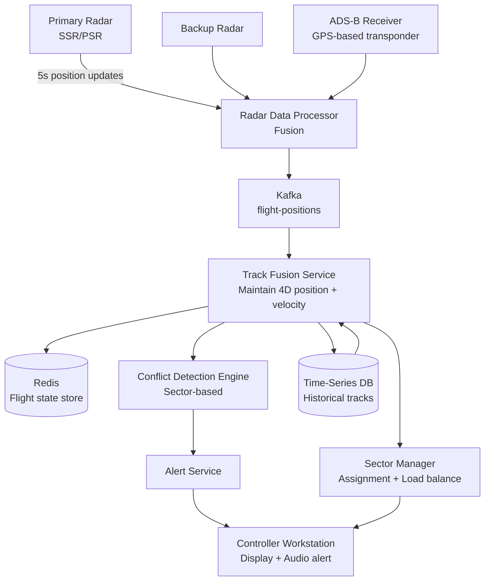
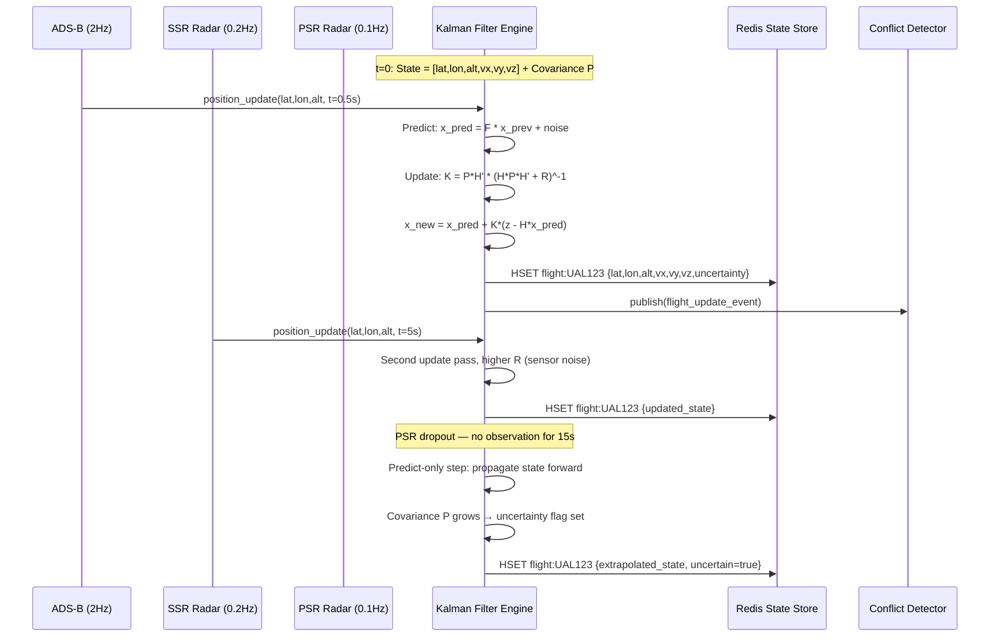

# Design an Air Traffic Control System

**Difficulty**: 🟡 Intermediate
**Reading Time**: ~25 minutes
**The Core Problem**: How do you track 10,000 simultaneous flights in real-time, detect trajectory conflicts before they happen, and ensure a controller is never overwhelmed — with zero tolerance for system failure?

---

## Table of Contents

1. [Requirements](#1-requirements)
2. [Capacity Estimation](#2-capacity-estimation)
3. [High-Level Architecture](#3-high-level-architecture)
4. [Radar Data Ingestion](#4-radar-data-ingestion)
5. [Conflict Detection Algorithm](#5-conflict-detection-algorithm)
6. [Sector Assignment & Workload Balancing](#6-sector-assignment--workload-balancing)
7. [Alert System](#7-alert-system)
8. [High Availability Architecture](#8-high-availability-architecture)
9. [Key Design Decisions](#9-key-design-decisions)
10. [Interview Questions](#10-interview-questions)
11. [Key Takeaways](#11-key-takeaways)
12. [References](#12-references)

---

## 1. Requirements

### Functional
- Display real-time position of all flights in assigned sector
- Detect potential conflicts (two aircraft too close) 5–20 minutes ahead
- Alert controller with resolution recommendations
- Assign flights to airspace sectors and balance controller workload
- Coordinate handoffs between sector controllers

### Non-Functional
- **Scale**: 10,000 simultaneous flights worldwide; 500 per sector controller
- **Radar update rate**: 1 update per 5 seconds per aircraft
- **Conflict detection latency**: Alert within 1 second of detection
- **Availability**: 99.9999% (six nines) — ATC failure costs lives
- **Data integrity**: No position data ever lost

---

## 2. Capacity Estimation

| Metric | Estimate |
|--------|----------|
| Simultaneous flights | 10,000 |
| Radar updates/sec | 10,000 / 5s = **2,000 updates/sec** |
| Sectors | 500 (avg 20 flights per sector) |
| Controllers | 500 (one per sector) |
| Conflict checks/sec | O(N²) per sector: 20² / 2 = 190 pairs × 500 sectors = **95,000 pair checks/sec** |
| Alert events/day | ~10,000 (proximity alerts; most resolved by controller) |
| Position data size | 10,000 × 200 bytes = **2 MB snapshot** |
| Historical position data | 2,000 updates/sec × 200B × 86400s = **34 GB/day** |

---

## 3. High-Level Architecture



---

## 4. Radar Data Ingestion

### Data Sources
```
Primary Surveillance Radar (PSR):
  Detects aircraft by radio echo (no cooperation from aircraft)
  Update rate: 1 sweep / 5-12 seconds
  Position accuracy: ±100m at 100km range
  Does NOT provide altitude

Secondary Surveillance Radar (SSR / Mode-C):
  Transponder on aircraft responds with: flight_id, altitude, squawk code
  Update rate: 1 sweep / 4-10 seconds
  Provides altitude (Mode-C) or 3D position (Mode-S)

ADS-B (Automatic Dependent Surveillance — Broadcast):
  Aircraft GPS transmits position, speed, altitude, intent 2× per second
  Accuracy: ±10m (GPS precision)
  No radar sweep needed; aircraft self-reports
  Blind spots: oceans, remote areas (no ground stations) → satellite ADS-B

Fusion priority: ADS-B (most accurate) > SSR (altitude) > PSR (backup)
```

### Track Fusion
```
Multiple radars may see same aircraft:
  Fusion algorithm: Kalman filter
  Inputs: multiple radar position estimates with error covariance
  Output: best estimate of true position + predicted position at T+5s

State per aircraft (stored in Redis):
{
  "flight_id": "UAL123",
  "lat": 40.1234, "lon": -74.5678, "alt_ft": 35000,
  "heading_deg": 270, "speed_kts": 480,
  "climb_rate_fpm": -200,
  "flight_plan": [waypoints...],
  "sector_id": "NEYE_HIGH",
  "last_updated": 1711800000
}
```

---

## 5. Conflict Detection Algorithm

### Separation Standards
```
ICAO minimum separation:
  Horizontal: 5 nautical miles (nm) lateral OR 1000ft vertical
  Radar separation: 3nm horizontal OR 1000ft vertical

Conflict: current or predicted separation < minimum within 20 minutes

Proximity Alert (short-range): < 3nm horizontal AND < 300ft vertical → immediate alert
Traffic Advisory (medium-range): < 5nm predicted within 10 min → prepare alert
```

### Conflict Detection (per sector)
```
Algorithm (runs every 5 seconds when new radar sweep arrives):

For each pair (A, B) in sector (20 flights → 190 pairs):
  1. Project A's position at T+5min: pos_A_future = pos_A + velocity_A × 5min
  2. Project B's position at T+5min: pos_B_future = pos_B + velocity_B × 5min
  3. Minimum distance between A and B over next 20min:
     (compute along flight paths, not just endpoints)
  4. If min_distance < separation_standard AND time_to_conflict < 20min:
     → Generate conflict alert

Trajectory prediction:
  Linear extrapolation (constant speed/heading) for short-term (5min)
  Flight plan path following for medium-term (5–20min)
  Accuracy degrades beyond 5 minutes

Computational load:
  190 pairs × 500 sectors = 95,000 pair checks/5s = 19,000/sec
  Each check: O(1) vector math → trivially fast even on single CPU
```

---

## 6. Sector Assignment & Workload Balancing

```
Airspace divided into sectors by altitude and geography:
  Example: NY Area — 8 sectors (low, high, transition, approach, departure)

Aircraft assigned to sector based on current position and altitude:
  On entry to sector: automatic sector assignment
  Handoff: controller A contacts controller B: "UAL123 handed off, FL350, cleared direct JFK"
  System confirms handoff: both controllers see aircraft in transition state

Workload balancing:
  Count per sector: aircraft in sector + expected entries in next 15 minutes
  Alert threshold: if sector_count > 25 aircraft → supervisor notified
  Sector split: high-traffic sector can be temporarily split into two sub-sectors
  Sector merge: low-traffic sectors merged to reduce staffing needs (overnight)
```

---

## 7. Alert System

```
Alert priority levels:
  CRITICAL (Red):   Collision Alert (TCAS RA) — < 1nm, < 300ft → immediate evade
  HIGH (Orange):    Short-Term Conflict Alert (STCA) — < 2 min to separation loss
  MEDIUM (Yellow):  Medium-Term Conflict Alert (MTCA) — 5–20 min to separation loss
  INFO (Blue):      Traffic Advisory — awareness only

Alert delivery:
  Visual: Red/orange blinking aircraft tag on controller display
  Audio: distinct beep tone per alert level
  Text: "UAL123 vs DAL456, 2min, FL350, suggest altitude change"

Alert fatigue prevention:
  Deduplicate: same pair with same conflict → single alert (don't re-alert every 5s)
  Auto-clear: alert clears when separation restored beyond 150% of minimum
  Prioritize: show highest-severity unacknowledged alerts first
```

---

## 8. High Availability Architecture

ATC failure is not acceptable. The system must be six-nines available.

```
Active-Standby with hot failover:
  Primary system: processes all radar data, generates alerts
  Hot standby: receives same data feed, maintains synchronized state
  Failover: if primary fails → standby takes over in < 2 seconds
  State sync: Kafka replication across both nodes (same topics)

Network redundancy:
  Dual radar feeds (primary + backup radar)
  Dual network paths (MPLS + fiber)
  UPS + diesel generator (96-hour fuel supply)

Degraded mode operation:
  If real-time conflict detection fails → controllers use manual separation standards
  Paper flight strips as ultimate fallback (always maintained)

Software updates:
  Hot patches only (no downtime restarts during operations)
  Updates deployed to standby first, validated, then failover
```

---

## 9. Key Design Decisions

| Decision | Option A | Option B | Choice & Reason |
|----------|----------|----------|-----------------|
| Conflict detection scope | Global (all 10k flights) | Per-sector (20 flights) | **Per-sector** — O(N²) on 20 is trivial; O(N²) on 10,000 = 50M pairs/5s = infeasible |
| Alert delivery | Pull (controller checks) | Push (automatic) | **Push with audio** — 1-second detection-to-alert is mandatory; controllers cannot poll |
| Data store | Time-series DB (InfluxDB) | PostgreSQL | **Both** — InfluxDB for radar track history (time-series optimized); Postgres for flight plans and metadata |
| Fault tolerance | Hot standby (2-node) | Full active-active | **Hot standby** — active-active introduces split-brain risk; safety-critical systems prefer simpler failover |
| Radar data fusion | Last-write-wins | Kalman filter | **Kalman filter** — statistically optimal fusion of multiple noisy sensor inputs |

---

## 10. Interview Questions

| Question | Key Answer |
|----------|-----------|
| How do you detect conflicts without checking all 50M pairs? | Partition airspace into sectors; only check pairs within same sector (20² = 190 pairs) |
| How do you ensure six-nines availability? | Hot standby with < 2s failover; dual radar feeds; UPS + diesel; paper strips as ultimate fallback |
| What happens if a controller doesn't respond to an alert? | Escalating alerts; supervisor notified; TCAS (onboard collision avoidance) activates if very close |
| How does ADS-B improve over traditional radar? | 10m GPS accuracy vs 100m radar; 2 updates/sec vs 1/5sec; no radar sweep delay |
| How do you handle a radar going offline? | Fused track degrades gracefully to remaining radar sources; alert if only one source remains |

---

## 11. Key Takeaways

- **Per-sector conflict detection** reduces O(N²) from 50M pairs to 190 pairs per sector — the key algorithmic optimization
- **Kalman filter fusion** combines multiple radar sources optimally — single-source ATC would have gaps and inaccuracies
- **Hot standby** (not active-active) is correct for safety-critical systems — split-brain scenarios in ATC are catastrophic
- **Alert fatigue prevention** (dedup, auto-clear) is as important as alert generation — false positives erode controller trust
- **ADS-B replaces radar sweeps** where available — 2 updates/sec at 10m accuracy enables much earlier conflict detection

---

---

## Component Deep Dive 1: Track Fusion Engine (Kalman Filter at Scale)

The Track Fusion Engine is the most critical component in the entire ATC system. Every downstream decision — conflict detection, sector assignment, controller alerts — depends on having an accurate, low-latency position estimate for each aircraft. Getting this wrong by even 50 meters in the horizontal plane can mean the difference between a valid alert and a catastrophic miss.

### How It Works Internally

The Kalman filter maintains a probabilistic state estimate for each aircraft: a 6-dimensional state vector [x, y, z, vx, vy, vz] representing 3D position and velocity, plus a 6x6 covariance matrix encoding uncertainty in each dimension. When a new radar observation arrives, the filter performs two steps:

**Predict step**: Project the current state forward in time using the aircraft's known velocity. The covariance grows with elapsed time (uncertainty increases when no observation arrives).

**Update step**: Incorporate the new radar measurement, weighting it against the prediction by the relative uncertainty of each. A high-quality ADS-B GPS reading (±10m) gets much higher weight than a degraded PSR echo at 100km range (±200m).

When multiple radar sources observe the same aircraft simultaneously, the Kalman filter fuses them by treating each observation as an independent measurement update in sequence, yielding a statistically optimal estimate that is more accurate than any single source.

### Why Naive Approaches Fail

The simplest approach — "take the most recent radar ping and use that as position" — fails for three reasons: (1) Different radar types have wildly different latencies and accuracies, so last-write-wins produces a noisy, jittery position stream; (2) ADS-B data at 2Hz and PSR data at 0.1Hz cannot be naively merged; (3) During sensor dropouts (aircraft entering dead zone between radar sweeps), you have no position at all unless you maintain a predictive model. The Kalman filter solves all three by maintaining a continuous state estimate that degrades gracefully under missing observations rather than going blank.

### Track Fusion Internals



### Trade-off Table: Track Fusion Approaches

| Approach | Latency | Accuracy | Complexity | Failure Mode |
|----------|---------|----------|------------|--------------|
| Kalman Filter (standard) | 1–2ms per update | ±15m fused | High (matrix math, covariance tracking) | Diverges if process noise model is wrong |
| Last-write-wins (no fusion) | <0.1ms | ±100–200m (radar limited) | Trivial | Jittery positions; no prediction during dropout |
| Particle Filter | 10–50ms per update | ±5m (non-linear motion) | Very high | Computationally expensive; overkill for commercial aviation |

The Kalman filter is the industry standard because its computational cost (a few matrix multiplications per aircraft per update) is negligible at 10,000 aircraft scale — roughly 1 CPU-core-millisecond per 5-second radar sweep cycle — while delivering optimal statistical fusion across heterogeneous sensor types.

---

## Component Deep Dive 2: Conflict Detection Engine

The Conflict Detection Engine runs continuously in the background, checking whether any two aircraft are on trajectories that will violate ICAO minimum separation standards within the next 20 minutes. It is sector-scoped, stateless per run (reads from Redis), and must complete a full sector scan within the 5-second radar update window.

### Internal Mechanics

For each sector (approximately 20 aircraft per sector on average), the engine iterates all pairs, projects each aircraft's trajectory forward using a piecewise-linear model — constant velocity for the first 5 minutes, then flight-plan-following for 5–20 minutes — and computes the minimum approach distance along the combined trajectory segment.

The closest-point-of-approach (CPA) calculation is the mathematical core:

```
Given two aircraft A and B with:
  positions: pA, pB (3D vectors, NM units)
  velocities: vA, vB (3D vectors, kts)

Relative position: dp = pB - pA
Relative velocity: dv = vB - vA

Time to CPA: t_cpa = -(dp · dv) / (dv · dv)
  (dot product; clamped to [0, 20min])

Distance at CPA: d_cpa = |dp + dv × t_cpa|
  (Euclidean distance in 3D, lat/lon converted to NM)

Conflict if: d_cpa < separation_standard AND t_cpa < 20min
```

This is O(1) per pair and runs in nanoseconds. At 95,000 pairs/sec, a single CPU core handles the full global conflict check load with headroom to spare.

### Scale Behavior at 10x Load

At 10x the nominal load (100,000 simultaneous flights), the sector-based partition still holds: if sector sizes remain ~20 aircraft, the pair-check math scales linearly with sector count (5,000 sectors vs 500), not quadratically with flight count. The bottleneck shifts to Kafka consumer throughput (20,000 updates/sec instead of 2,000) and Redis read latency (100,000 HGET/sec for state reads). Redis Cluster with 10 shards handles 1M ops/sec trivially, so 100,000 reads/sec is well within budget.

### Conflict Engine Architecture

```mermaid
graph TD
    Kafka[Kafka: flight-positions\npartitioned by sector_id] --> Consumer[Sector Consumer Pool\n500 consumer instances]
    Consumer --> StateRead[Redis HGETALL\nflight state per aircraft]
    StateRead --> PairGen[Pair Generator\nN*(N-1)/2 pairs]
    PairGen --> CPA[CPA Calculator\nconstant-velocity projection]
    CPA --> PlanAware[Flight-Plan Projection\n5-20 min range]
    PlanAware --> Threshold{Separation\nViolated?}
    Threshold -->|Yes| AlertDedup[Alert Dedup Store\nRedis SET with TTL]
    AlertDedup -->|New conflict| AlertKafka[Kafka: conflict-alerts]
    AlertKafka --> AlertSvc[Alert Service\n→ Controller Workstation]
    Threshold -->|No| Drop[Discard]
```

### Trade-off Table: Conflict Detection Approaches

| Approach | Pairs Checked | Accuracy | Latency | Scale Ceiling |
|----------|--------------|----------|---------|---------------|
| Per-sector (current) | 190/sector × 500 = 95k/5s | High within sector | <50ms | Linear with sector count |
| Global (all flights) | 50M pairs/5s | Same | Infeasible (CPU-bound) | Does not scale beyond ~2,000 flights |
| Spatial index (R-tree) | Only nearby pairs | High | <5ms | Excellent — sub-linear with density |

Using an R-tree spatial index (querying only aircraft within 50nm of each other) would reduce pair checks from 95,000 to roughly 5,000/sec even at full scale, at the cost of implementation complexity. Current production ATC systems use sector partitioning because sectors are operationally meaningful (already defined for controller assignment) and conflict-detection granularity matches controller responsibility boundaries.

---

## Component Deep Dive 3: Alert Deduplication and Delivery Layer

The Alert layer faces a unique engineering challenge: it must be low-latency (alert within 1 second of detection), high-reliability (every genuine conflict must reach the controller), but also low-noise (repeated alerts for the same conflict erode controller trust and cause alert fatigue). These goals are in direct tension.

### Technical Implementation

Deduplication uses a Redis SET keyed by `conflict:{flight_a_id}:{flight_b_id}` with a TTL of 30 seconds. When a conflict pair is detected, the engine attempts a Redis SETNX (set if not exists). If the key already exists, the conflict is a duplicate and suppressed. If SETNX succeeds, an alert is emitted and the key expires in 30 seconds — at which point, if the conflict is still active on the next scan cycle, a fresh alert fires. This avoids both duplicate spam and indefinite suppression.

### Alert Delivery Protocol

Alert messages are published to a dedicated `conflict-alerts` Kafka topic (separate from position data), consumed by the Alert Service, which maintains a WebSocket connection to each Controller Workstation (CWP). The CWP renders alerts as overlays on the radar display and triggers audio tones through dedicated speakers — a separate audio subsystem independent of the display rendering pipeline, so a screen freeze does not mute the alert.

### Failure Mode: Alert Service Crash

If the Alert Service crashes, alerts must not be silently dropped. The Kafka consumer group offset is committed only after the WebSocket delivery is acknowledged by the CWP. If the CWP is unreachable, the alert stays in the Kafka topic unconsumed. The Alert Service uses a dead-letter queue for alerts that fail delivery after 3 retries within 500ms, which triggers a supervisor notification — the supervisor's station receives all failed alerts directly.

| Alert Property | Implementation Detail |
|----------------|----------------------|
| Dedup window | 30-second Redis key TTL per flight pair |
| Delivery guarantee | Kafka at-least-once + CWP ack |
| Audio independence | Separate audio daemon, not tied to display process |
| Auto-clear trigger | Separation > 150% of minimum → SREM key from dedup store |
| Escalation path | 3 missed acks → supervisor dead-letter queue |

---

## Data Model

### Redis: Live Flight State (HSET, one key per flight)

```
Key: flight:{flight_id}
Type: Hash
TTL: 60 seconds (auto-expires if no update received — flight gone or squawk lost)

Fields:
  flight_id       VARCHAR(10)   "UAL123"
  callsign        VARCHAR(10)   "UAL123"
  squawk          VARCHAR(4)    "1234"   -- Mode-A transponder code
  lat             FLOAT8        40.1234  -- WGS-84 degrees
  lon             FLOAT8        -74.5678
  alt_ft          INT4          35000    -- pressure altitude, feet
  heading_deg     FLOAT4        270.0    -- true heading
  speed_kts       FLOAT4        480.0    -- groundspeed
  climb_rate_fpm  FLOAT4        -200.0   -- feet per minute (negative = descending)
  vx              FLOAT8        -138.7   -- velocity x component, NM/min (derived)
  vx              FLOAT8        0.0      -- velocity y component
  vz              FLOAT8        -0.2     -- velocity z component, thousands ft/min
  sector_id       VARCHAR(20)   "NEYE_HIGH"
  origin          VARCHAR(4)    "KEWR"   -- ICAO airport code
  destination     VARCHAR(4)    "KLAX"
  aircraft_type   VARCHAR(6)    "B738"
  data_source     VARCHAR(8)    "ADS-B"  -- ADS-B | SSR | PSR | FUSED
  uncertainty_m   FLOAT4        12.5     -- position uncertainty radius, meters
  last_updated    INT8          1711800000  -- Unix epoch ms
```

### PostgreSQL: Flight Plans (relational, updated at filing)

```sql
-- Flight plan (filed before departure, immutable once airborne)
CREATE TABLE flight_plans (
  plan_id          UUID PRIMARY KEY DEFAULT gen_random_uuid(),
  flight_id        VARCHAR(10) NOT NULL,            -- "UAL123"
  origin_icao      CHAR(4) NOT NULL,                -- "KEWR"
  dest_icao        CHAR(4) NOT NULL,                -- "KLAX"
  filed_at         TIMESTAMPTZ NOT NULL,
  etd              TIMESTAMPTZ NOT NULL,            -- estimated departure
  eta              TIMESTAMPTZ NOT NULL,            -- estimated arrival
  cruising_alt_ft  INT NOT NULL,                    -- filed altitude, e.g. 35000
  route_string     TEXT NOT NULL,                   -- "HAPIE DCT BETTE DCT HTO ..."
  aircraft_type    VARCHAR(6) NOT NULL,             -- "B738"
  wake_category    CHAR(1) NOT NULL,                -- H/M/L/J (Heavy/Medium/Light/Super)
  created_at       TIMESTAMPTZ DEFAULT now()
);

-- Route waypoints (parsed from route_string for trajectory projection)
CREATE TABLE route_waypoints (
  id            BIGSERIAL PRIMARY KEY,
  plan_id       UUID REFERENCES flight_plans(plan_id),
  sequence_num  INT NOT NULL,
  fix_name      VARCHAR(10) NOT NULL,               -- "BETTE", "JFK", "V23"
  lat           FLOAT8 NOT NULL,
  lon           FLOAT8 NOT NULL,
  alt_ft        INT,                                -- assigned altitude at this fix
  eta_offset_s  INT                                 -- seconds from departure
);
CREATE INDEX idx_route_waypoints_plan ON route_waypoints(plan_id, sequence_num);

-- Active conflicts (written by conflict engine, read by alert service)
CREATE TABLE active_conflicts (
  conflict_id   UUID PRIMARY KEY DEFAULT gen_random_uuid(),
  flight_a      VARCHAR(10) NOT NULL,
  flight_b      VARCHAR(10) NOT NULL,
  detected_at   TIMESTAMPTZ NOT NULL DEFAULT now(),
  cpa_time      TIMESTAMPTZ,                        -- projected time of closest approach
  cpa_dist_nm   FLOAT4,                             -- projected min separation in NM
  cpa_vert_ft   INT,                                -- projected vertical separation in ft
  severity      VARCHAR(10) NOT NULL,               -- CRITICAL | HIGH | MEDIUM | INFO
  sector_id     VARCHAR(20),
  resolved_at   TIMESTAMPTZ,
  resolution    TEXT,                               -- "altitude change by UAL123"
  UNIQUE (flight_a, flight_b, detected_at)
);
CREATE INDEX idx_active_conflicts_severity ON active_conflicts(severity, resolved_at);
```

### InfluxDB: Historical Radar Tracks (time-series)

```
Measurement: radar_track
Tags (indexed):
  flight_id   "UAL123"
  sector_id   "NEYE_HIGH"
  data_source "ADS-B"
Fields:
  lat           40.1234
  lon          -74.5678
  alt_ft        35000
  speed_kts     480.0
  heading_deg   270.0
  uncertainty_m 12.5
Timestamp: 1711800000000000000  (nanosecond precision)

Retention policy: 90 days raw (2,000 writes/sec × 200B × 86400s = 34GB/day → 3TB/quarter)
Downsampled: 1-year aggregates (1 point/minute per flight) for accident investigation
```

---

## Scale Bottlenecks

| Traffic Level | Component That Breaks | Symptoms | Mitigation |
|---------------|----------------------|----------|------------|
| 2x baseline (20,000 flights) | Kafka consumer lag | Position data arrives stale; conflict alerts delayed | Add Kafka partitions (by sector_id); scale consumer instances horizontally |
| 5x baseline (50,000 flights) | Redis read throughput | HGET latency spikes from <1ms to 10–50ms; Kalman filter inputs delayed | Redis Cluster with 5+ shards; pipeline multi-HGET per sector batch |
| 10x baseline (100,000 flights) | Alert WebSocket fan-out | Alert Service can't sustain 1,000 concurrent WebSocket connections at <1s latency | Alert Service horizontal scaling behind L4 load balancer; sticky sessions per sector |
| 50x baseline (500,000 flights) | Sector manager query performance | Sector assignment queries on PostgreSQL saturate connection pool | Shard flight_plans table by region; cache sector assignments in Redis per flight |
| 100x baseline (1,000,000 flights) | InfluxDB write path | Write buffer overflow; track data lost | Kafka-backed write buffer; InfluxDB cluster with write sharding by flight_id hash |

Realistic ceiling for a single regional ATC facility: approximately 5,000–8,000 simultaneous aircraft. At the FAA ARTCC (Air Route Traffic Control Center) level, a single center handles 1,000–3,000 aircraft in its airspace at peak. Global scope (10,000+ flights) requires a federated architecture where individual ARTCC systems coordinate via the SWIM (System Wide Information Management) protocol rather than a single monolithic deployment.

---

## How the FAA Built NextGen

The FAA's **NextGen** program, launched in 2007 and still being deployed, is the real-world implementation of the architecture described in this article. By 2024, the FAA had equipped over 50,000 aircraft with ADS-B Out transponders and deployed 700+ ADS-B ground stations covering the contiguous United States.

**Technology choices**: The FAA chose a publish-subscribe architecture for position data distribution, implemented through the SWIM (System Wide Information Management) bus — a standards-based messaging backbone (JMS/AMQP) that allows ATC automation systems, airlines, and approved third parties to subscribe to position feeds. This replaces point-to-point radar data circuits with a shared data bus, reducing integration complexity for each new consumer.

**Specific numbers**: ADS-B ground stations process approximately 10 million position messages per hour across the National Airspace System (NAS) — roughly 2,800 messages/second. The Traffic Flow Management System (TFMS) ingests this data and runs a national-level conflict prediction model that looks 3–8 hours ahead, coordinating ground stops and departure metering to prevent sector overloads before they occur.

**Non-obvious architectural decision**: The FAA deliberately kept radar (PSR/SSR) operational alongside ADS-B rather than shutting it down. The reason: ADS-B depends on the aircraft's own GPS receiver and transponder. If a pilot inadvertently turns off the transponder, or a GPS jamming/spoofing event occurs, the aircraft becomes invisible to ADS-B but still appears on independent radar. The fusion of independent sensor types (radar detects without aircraft cooperation; ADS-B provides accurate self-reported data) creates a defense-in-depth position system that no single point of failure can blind.

**Source**: FAA NextGen Implementation Plan 2024 (faa.gov/nextgen) and FAA ADS-B Rule (14 CFR Part 91.225).

---

## Interview Angle

**What the interviewer is testing:** Whether you can reason about a safety-critical, hard-real-time system where failure means human casualties. They want to see that you apply different availability, consistency, and latency standards than you would for a consumer app — and that you understand the operational constraints (controllers, sectors, airspace) that drive technical decisions.

**Common mistakes candidates make:**

1. **Designing for active-active replication.** Many candidates default to "multi-region active-active" for high availability. In ATC, active-active introduces split-brain risk — two nodes disagree on which controller owns a sector or which alert has been acknowledged. For safety-critical systems, hot standby with deterministic single-primary is the correct pattern.

2. **Ignoring the human loop.** Candidates design the system as if alerts are automatically resolved. In reality, the controller is the decision-maker — the system's job is to give them accurate information fast enough to act. Design questions like "what happens if the controller doesn't respond in 30 seconds?" reveal whether you understand that the system exists to support humans, not replace them.

3. **Global O(N²) conflict detection.** Almost every candidate who hasn't thought about this first suggests checking all pairs globally. With 10,000 flights, that's 50 million pair checks every 5 seconds — infeasible. The insight is that two aircraft 3,000 miles apart cannot possibly collide in the next 20 minutes, so spatial partitioning (sectors) is the natural optimization. Get to this quickly.

**The insight that separates good from great answers:** Recognizing that alert fatigue is as dangerous as missed alerts. An ATC system that generates too many false positive alerts trains controllers to ignore alerts — which is the direct cause of the TCAS (Traffic Collision Avoidance System) being added to aircraft themselves as a last-resort backstop when ground ATC fails. The deduplication and suppression logic is not a nice-to-have UX feature; it is a safety requirement.

---

## Key Numbers to Remember

| Metric | Value | Context |
|--------|-------|---------|
| ICAO horizontal separation minimum | 5 nm (radar: 3 nm) | Below this distance → conflict alert required |
| ICAO vertical separation minimum | 1,000 ft (RVSM: 1,000 ft above FL290) | Standard separation in cruise |
| Radar update rate (SSR) | 1 sweep / 4–10 seconds | Drives the 5-second conflict scan window |
| ADS-B position accuracy | ±10 m (GPS) vs ±100 m (PSR) | 10x accuracy improvement over legacy radar |
| ADS-B update rate | 2 Hz (every 500 ms) | 10x more frequent than radar sweeps |
| Conflict detection horizon | 20 minutes | Beyond this, flight plan changes make prediction unreliable |
| Pair checks per sector scan | 190 pairs (20 aircraft per sector) | Per-sector optimization reduces 50M global pairs to 95k |
| Alert latency requirement | < 1 second detection-to-display | Non-negotiable; drives push delivery over pull |
| System availability target | 99.9999% (six nines) | ~32 seconds downtime per year allowed |
| FAA ADS-B network throughput | ~2,800 position messages/sec | Covers full US NAS with 700+ ground stations |
| Hot standby failover time | < 2 seconds | Beyond this, controllers notice a gap in position data |
| Historical track retention | 90 days raw, 1 year downsampled | Accident investigation requirement (ICAO Annex 11) |

---

## 📚 Resources & References

| Resource | Type | What You'll Learn |
|----------|------|------------------|
| [FAA NextGen System Overview](https://www.faa.gov/nextgen/how_nextgen_works/) | 📖 Blog | Modern ATC architecture and ADS-B transition |
| [ByteByteGo — Real-Time Systems](https://www.youtube.com/@ByteByteGo) | 📺 YouTube | Event streaming and real-time data processing |
| [Kalman Filter for Beginners — Phil Kim](https://www.amazon.com/Kalman-Filter-Beginners-MATLAB-Examples/dp/1463648359) | 📚 Book | Sensor fusion and track smoothing |
| [EUROCONTROL SWIM Architecture](https://www.eurocontrol.int/concept/system-wide-information-management) | 📖 Blog | European ATC data sharing architecture |
