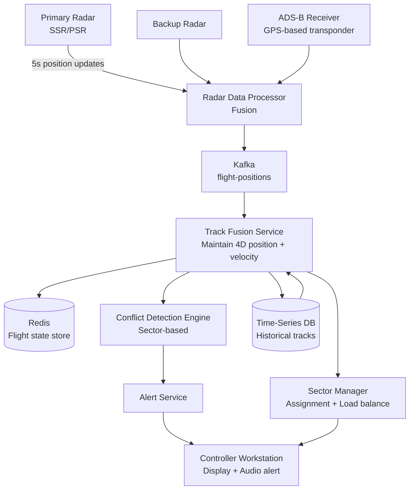

# Design an Air Traffic Control System

**Difficulty**: 🟡 Intermediate
**Reading Time**: ~25 minutes
**The Core Problem**: How do you track 10,000 simultaneous flights in real-time, detect trajectory conflicts before they happen, and ensure a controller is never overwhelmed — with zero tolerance for system failure?

---

## Table of Contents

1. [Requirements](#1-requirements)
2. [Capacity Estimation](#2-capacity-estimation)
3. [High-Level Architecture](#3-high-level-architecture)
4. [Radar Data Ingestion](#4-radar-data-ingestion)
5. [Conflict Detection Algorithm](#5-conflict-detection-algorithm)
6. [Sector Assignment & Workload Balancing](#6-sector-assignment--workload-balancing)
7. [Alert System](#7-alert-system)
8. [High Availability Architecture](#8-high-availability-architecture)
9. [Key Design Decisions](#9-key-design-decisions)
10. [Interview Questions](#10-interview-questions)
11. [Key Takeaways](#11-key-takeaways)
12. [References](#12-references)

---

## 1. Requirements

### Functional
- Display real-time position of all flights in assigned sector
- Detect potential conflicts (two aircraft too close) 5–20 minutes ahead
- Alert controller with resolution recommendations
- Assign flights to airspace sectors and balance controller workload
- Coordinate handoffs between sector controllers

### Non-Functional
- **Scale**: 10,000 simultaneous flights worldwide; 500 per sector controller
- **Radar update rate**: 1 update per 5 seconds per aircraft
- **Conflict detection latency**: Alert within 1 second of detection
- **Availability**: 99.9999% (six nines) — ATC failure costs lives
- **Data integrity**: No position data ever lost

---

## 2. Capacity Estimation

| Metric | Estimate |
|--------|----------|
| Simultaneous flights | 10,000 |
| Radar updates/sec | 10,000 / 5s = **2,000 updates/sec** |
| Sectors | 500 (avg 20 flights per sector) |
| Controllers | 500 (one per sector) |
| Conflict checks/sec | O(N²) per sector: 20² / 2 = 190 pairs × 500 sectors = **95,000 pair checks/sec** |
| Alert events/day | ~10,000 (proximity alerts; most resolved by controller) |
| Position data size | 10,000 × 200 bytes = **2 MB snapshot** |
| Historical position data | 2,000 updates/sec × 200B × 86400s = **34 GB/day** |

---

## 3. High-Level Architecture



---

## 4. Radar Data Ingestion

### Data Sources
```
Primary Surveillance Radar (PSR):
  Detects aircraft by radio echo (no cooperation from aircraft)
  Update rate: 1 sweep / 5-12 seconds
  Position accuracy: ±100m at 100km range
  Does NOT provide altitude

Secondary Surveillance Radar (SSR / Mode-C):
  Transponder on aircraft responds with: flight_id, altitude, squawk code
  Update rate: 1 sweep / 4-10 seconds
  Provides altitude (Mode-C) or 3D position (Mode-S)

ADS-B (Automatic Dependent Surveillance — Broadcast):
  Aircraft GPS transmits position, speed, altitude, intent 2× per second
  Accuracy: ±10m (GPS precision)
  No radar sweep needed; aircraft self-reports
  Blind spots: oceans, remote areas (no ground stations) → satellite ADS-B

Fusion priority: ADS-B (most accurate) > SSR (altitude) > PSR (backup)
```

### Track Fusion
```
Multiple radars may see same aircraft:
  Fusion algorithm: Kalman filter
  Inputs: multiple radar position estimates with error covariance
  Output: best estimate of true position + predicted position at T+5s

State per aircraft (stored in Redis):
{
  "flight_id": "UAL123",
  "lat": 40.1234, "lon": -74.5678, "alt_ft": 35000,
  "heading_deg": 270, "speed_kts": 480,
  "climb_rate_fpm": -200,
  "flight_plan": [waypoints...],
  "sector_id": "NEYE_HIGH",
  "last_updated": 1711800000
}
```

---

## 5. Conflict Detection Algorithm

### Separation Standards
```
ICAO minimum separation:
  Horizontal: 5 nautical miles (nm) lateral OR 1000ft vertical
  Radar separation: 3nm horizontal OR 1000ft vertical

Conflict: current or predicted separation < minimum within 20 minutes

Proximity Alert (short-range): < 3nm horizontal AND < 300ft vertical → immediate alert
Traffic Advisory (medium-range): < 5nm predicted within 10 min → prepare alert
```

### Conflict Detection (per sector)
```
Algorithm (runs every 5 seconds when new radar sweep arrives):

For each pair (A, B) in sector (20 flights → 190 pairs):
  1. Project A's position at T+5min: pos_A_future = pos_A + velocity_A × 5min
  2. Project B's position at T+5min: pos_B_future = pos_B + velocity_B × 5min
  3. Minimum distance between A and B over next 20min:
     (compute along flight paths, not just endpoints)
  4. If min_distance < separation_standard AND time_to_conflict < 20min:
     → Generate conflict alert

Trajectory prediction:
  Linear extrapolation (constant speed/heading) for short-term (5min)
  Flight plan path following for medium-term (5–20min)
  Accuracy degrades beyond 5 minutes

Computational load:
  190 pairs × 500 sectors = 95,000 pair checks/5s = 19,000/sec
  Each check: O(1) vector math → trivially fast even on single CPU
```

---

## 6. Sector Assignment & Workload Balancing

```
Airspace divided into sectors by altitude and geography:
  Example: NY Area — 8 sectors (low, high, transition, approach, departure)

Aircraft assigned to sector based on current position and altitude:
  On entry to sector: automatic sector assignment
  Handoff: controller A contacts controller B: "UAL123 handed off, FL350, cleared direct JFK"
  System confirms handoff: both controllers see aircraft in transition state

Workload balancing:
  Count per sector: aircraft in sector + expected entries in next 15 minutes
  Alert threshold: if sector_count > 25 aircraft → supervisor notified
  Sector split: high-traffic sector can be temporarily split into two sub-sectors
  Sector merge: low-traffic sectors merged to reduce staffing needs (overnight)
```

---

## 7. Alert System

```
Alert priority levels:
  CRITICAL (Red):   Collision Alert (TCAS RA) — < 1nm, < 300ft → immediate evade
  HIGH (Orange):    Short-Term Conflict Alert (STCA) — < 2 min to separation loss
  MEDIUM (Yellow):  Medium-Term Conflict Alert (MTCA) — 5–20 min to separation loss
  INFO (Blue):      Traffic Advisory — awareness only

Alert delivery:
  Visual: Red/orange blinking aircraft tag on controller display
  Audio: distinct beep tone per alert level
  Text: "UAL123 vs DAL456, 2min, FL350, suggest altitude change"

Alert fatigue prevention:
  Deduplicate: same pair with same conflict → single alert (don't re-alert every 5s)
  Auto-clear: alert clears when separation restored beyond 150% of minimum
  Prioritize: show highest-severity unacknowledged alerts first
```

---

## 8. High Availability Architecture

ATC failure is not acceptable. The system must be six-nines available.

```
Active-Standby with hot failover:
  Primary system: processes all radar data, generates alerts
  Hot standby: receives same data feed, maintains synchronized state
  Failover: if primary fails → standby takes over in < 2 seconds
  State sync: Kafka replication across both nodes (same topics)

Network redundancy:
  Dual radar feeds (primary + backup radar)
  Dual network paths (MPLS + fiber)
  UPS + diesel generator (96-hour fuel supply)

Degraded mode operation:
  If real-time conflict detection fails → controllers use manual separation standards
  Paper flight strips as ultimate fallback (always maintained)

Software updates:
  Hot patches only (no downtime restarts during operations)
  Updates deployed to standby first, validated, then failover
```

---

## 9. Key Design Decisions

| Decision | Option A | Option B | Choice & Reason |
|----------|----------|----------|-----------------|
| Conflict detection scope | Global (all 10k flights) | Per-sector (20 flights) | **Per-sector** — O(N²) on 20 is trivial; O(N²) on 10,000 = 50M pairs/5s = infeasible |
| Alert delivery | Pull (controller checks) | Push (automatic) | **Push with audio** — 1-second detection-to-alert is mandatory; controllers cannot poll |
| Data store | Time-series DB (InfluxDB) | PostgreSQL | **Both** — InfluxDB for radar track history (time-series optimized); Postgres for flight plans and metadata |
| Fault tolerance | Hot standby (2-node) | Full active-active | **Hot standby** — active-active introduces split-brain risk; safety-critical systems prefer simpler failover |
| Radar data fusion | Last-write-wins | Kalman filter | **Kalman filter** — statistically optimal fusion of multiple noisy sensor inputs |

---

## 10. Interview Questions

| Question | Key Answer |
|----------|-----------|
| How do you detect conflicts without checking all 50M pairs? | Partition airspace into sectors; only check pairs within same sector (20² = 190 pairs) |
| How do you ensure six-nines availability? | Hot standby with < 2s failover; dual radar feeds; UPS + diesel; paper strips as ultimate fallback |
| What happens if a controller doesn't respond to an alert? | Escalating alerts; supervisor notified; TCAS (onboard collision avoidance) activates if very close |
| How does ADS-B improve over traditional radar? | 10m GPS accuracy vs 100m radar; 2 updates/sec vs 1/5sec; no radar sweep delay |
| How do you handle a radar going offline? | Fused track degrades gracefully to remaining radar sources; alert if only one source remains |

---

## 11. Key Takeaways

- **Per-sector conflict detection** reduces O(N²) from 50M pairs to 190 pairs per sector — the key algorithmic optimization
- **Kalman filter fusion** combines multiple radar sources optimally — single-source ATC would have gaps and inaccuracies
- **Hot standby** (not active-active) is correct for safety-critical systems — split-brain scenarios in ATC are catastrophic
- **Alert fatigue prevention** (dedup, auto-clear) is as important as alert generation — false positives erode controller trust
- **ADS-B replaces radar sweeps** where available — 2 updates/sec at 10m accuracy enables much earlier conflict detection

---

## 📚 Resources & References

| Resource | Type | What You'll Learn |
|----------|------|------------------|
| [FAA NextGen System Overview](https://www.faa.gov/nextgen/how_nextgen_works/) | 📖 Blog | Modern ATC architecture and ADS-B transition |
| [ByteByteGo — Real-Time Systems](https://www.youtube.com/@ByteByteGo) | 📺 YouTube | Event streaming and real-time data processing |
| [Kalman Filter for Beginners — Phil Kim](https://www.amazon.com/Kalman-Filter-Beginners-MATLAB-Examples/dp/1463648359) | 📚 Book | Sensor fusion and track smoothing |
| [EUROCONTROL SWIM Architecture](https://www.eurocontrol.int/concept/system-wide-information-management) | 📖 Blog | European ATC data sharing architecture |
