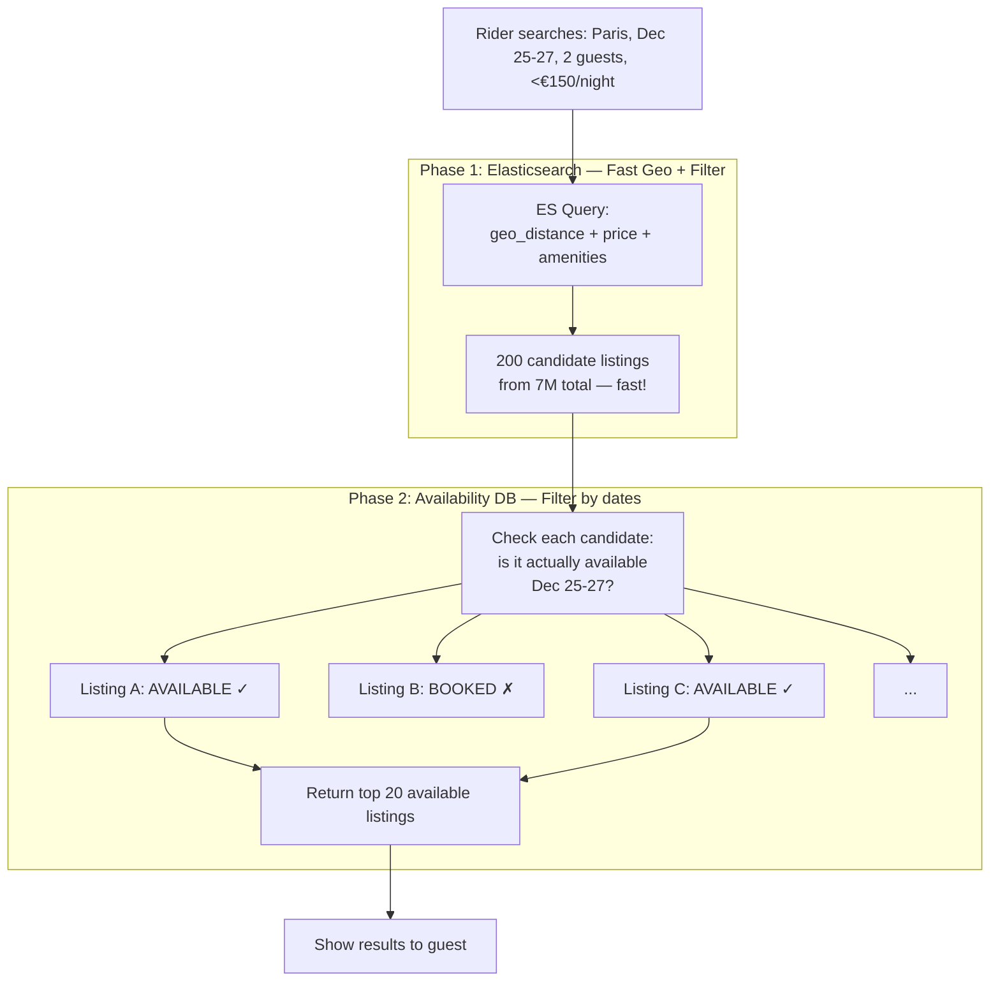
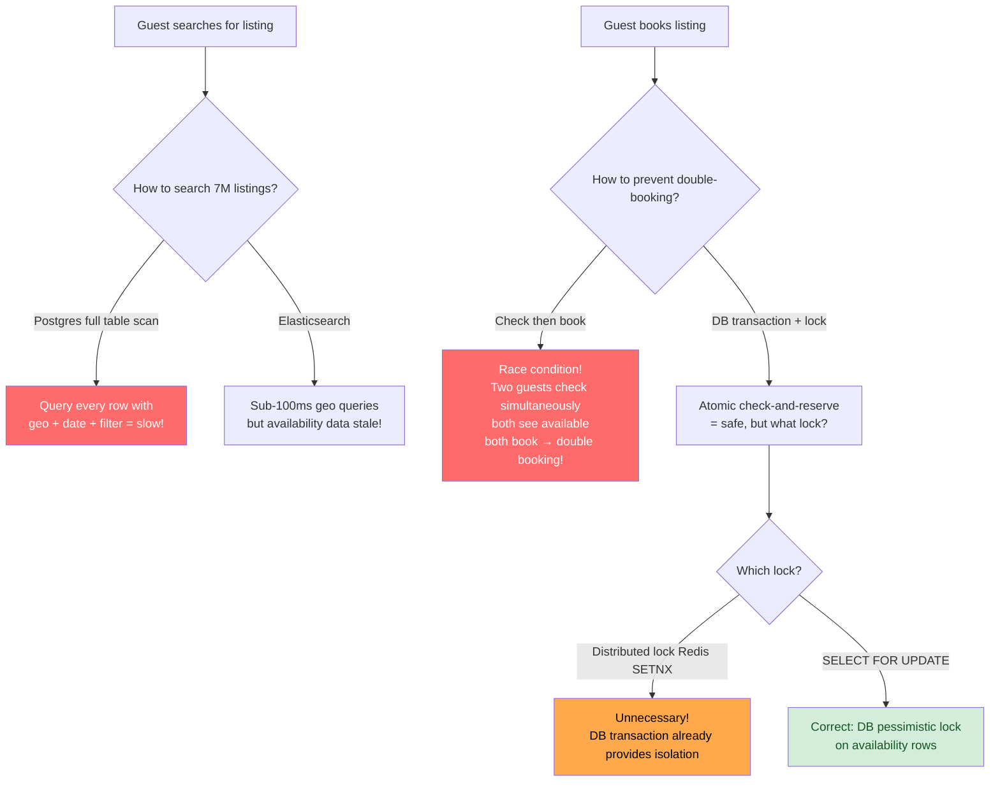
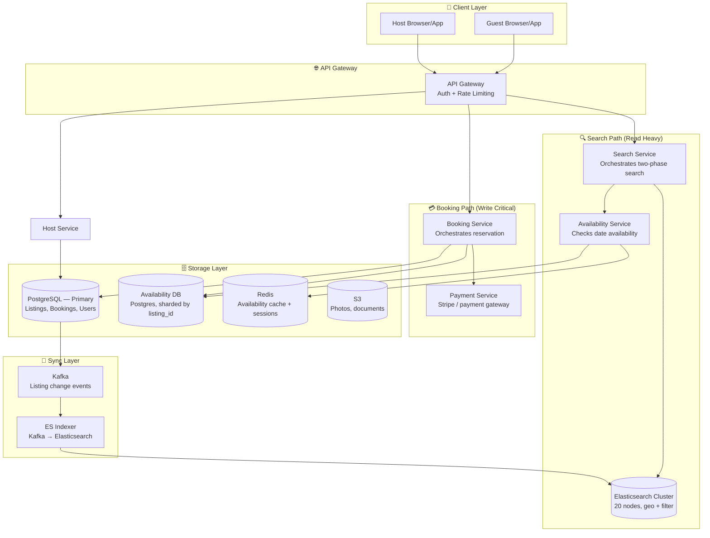

# Design Airbnb — Listing Search with Availability & Booking

> **Difficulty**: 🔴 Advanced — A multi-system problem. Requires understanding of search architecture (Elasticsearch), the two-phase search pattern, and transactional availability management to prevent double-bookings.

---

## Table of Contents

| # | Section | Core Concept |
|---|---------|-------------|
| 1 | [5-Minute Mental Model](#5-minute-mental-model) | Two-phase search: candidates then availability |
| 2 | [Why Airbnb is Hard](#why-airbnb-is-hard) | Search + booking consistency |
| 3 | [Requirements & Numbers](#requirements-with-real-numbers) | Scale targets |
| 4 | [Capacity Estimation](#capacity-estimation) | The math you need |
| 5 | [High-Level Architecture](#high-level-architecture) | All components together |
| 6 | [Deep Dive: Search Architecture](#deep-dive-search-architecture) | Two-phase search, ES vs Postgres |
| 7 | [Deep Dive: Availability Management](#deep-dive-availability-management) | Schema, SELECT FOR UPDATE |
| 8 | [Deep Dive: The Double-Booking Problem](#deep-dive-the-double-booking-problem) | Why DB transactions beat distributed locks |
| 9 | [Trade-Off Table](#trade-off-table) | Key architectural decisions |
| 10 | [Problems at Scale](#problems-at-scale) | What breaks and how to fix it |
| 11 | [Follow-Up Questions](#follow-up-questions) | Interviewers love to ask |
| 12 | [Key Takeaways](#key-takeaways) | Numbers to memorize |

---

## 5-Minute Mental Model

Before diving into failure modes, understand the **two-phase search pattern** — the core architectural insight:



**Why two phases?** Availability data changes too rapidly to keep in Elasticsearch. Instead, ES finds "possibly available" candidates efficiently, then the availability database filters for actual availability. This decouples the fast path (geo search) from the slow, volatile path (booking state).

**The key insight**: Availability data (AVAILABLE/BOOKED/BLOCKED) changes on every booking and cancellation. Syncing this to Elasticsearch with acceptable lag is hard. Instead, keep availability in a relational DB with proper transactions, and only use ES for attributes that change rarely (location, price, amenities, photos).

---

## Why Airbnb is Hard



| Challenge | Why it matters | Solution |
|-----------|---------------|---------|
| **Search at 7M listings** | Full table scan with geo + filter is O(N) — too slow at scale | Elasticsearch geo queries |
| **Availability volatility** | ES index lag means "available" in ES might be booked in reality | Two-phase search: ES → availability DB |
| **Double-booking race condition** | Two concurrent checkouts for same listing + dates → both succeed | `SELECT FOR UPDATE` in DB transaction |
| **Search result freshness** | Listing price changes, host adds photos — when does ES update? | Kafka event stream → ES indexer (5-second lag) |
| **Holiday 100× traffic spike** | Christmas, New Year, summer — all users search simultaneously | Elasticsearch cluster autoscaling + read replicas |

---

## Requirements with Real Numbers

### Functional Requirements

| Feature | Requirement |
|---------|------------|
| Search listings | Filter by location, check-in/check-out dates, guests, price range, amenities |
| View listing detail | Full description, photos, availability calendar, host info, reviews |
| Book listing | Instant booking or request-to-book flow |
| Manage availability | Host blocks dates, updates pricing (dynamic pricing) |
| Reviews | Guest reviews after checkout, host reviews guest |

### Non-Functional Requirements (with numbers)

| Requirement | Target | Rationale |
|------------|--------|-----------|
| **Listings** | 7M globally | Airbnb's approximate active listing count |
| **Concurrent searchers** | 2M peak | Drives search infrastructure sizing |
| **Search latency** | < 300ms P95 | Sub-second feels instant to users |
| **Booking confirmation** | < 1 second | User expects instant confirmation |
| **Double-booking rate** | Zero | Any double-booking is a major UX failure |
| **Availability** | 99.99% | Revenue-critical — downtime = lost bookings |
| **Holiday traffic** | Handle 100× baseline | Christmas week is peak demand |

---

## Capacity Estimation

### Search Traffic

```
Peak concurrent searchers: 2,000,000
Average searches per session: 5 searches per minute
Search QPS:
  2M users × 5 searches/min ÷ 60 sec = ~166,667 search QPS

Each Elasticsearch node handles ~10K-20K QPS for geo queries
  → Need: 166K QPS ÷ 15K per node = ~11 ES nodes at peak
  → Practical: 20 nodes with headroom + holiday spike buffer
```

### Listings Data

```
Listing count: 7,000,000
Average listing metadata: 2 KB
  (title, description, location, price, amenities, host_id)

Total listings in Elasticsearch:
  7M × 2 KB = 14 GB
  (Fits comfortably in memory across 20 ES nodes — 700 MB each)

Photos: stored separately in S3 (~50 photos/listing × 200 KB avg)
  7M listings × 50 × 200 KB = 70 TB of photo storage
```

### Availability Data

```
Availability schema: one row per listing per date
  listing_id: 8 bytes
  date:        4 bytes (date integer)
  status:      1 byte  (AVAILABLE/BOOKED/BLOCKED)
  price:       4 bytes (nightly price, can vary by date)
  TOTAL:       ~17 bytes per row

Rows:
  7M listings × 365 days = 2.555 billion rows
  2.555B × 17 bytes = ~43 GB of availability data

43 GB fits entirely in Redis as a cache!
  7M listings × 365 days × 6 bytes (compressed) = 15 GB in Redis
```

### Booking Volume

```
Airbnb approximate bookings: ~100M per year
  = 274,000 per day
  = ~3.2 bookings/sec average
  = ~32 bookings/sec at peak (10× baseline)

Each booking:
  booking_id:     16 bytes
  listing_id:     8  bytes
  guest_id:       8  bytes
  check_in:       4  bytes
  check_out:      4  bytes
  total_price:    8  bytes
  status:         1  byte
  payment_ref:    16 bytes
  created_at:     8  bytes
  TOTAL:          ~73 bytes per booking

5 years of bookings:
  500M bookings × 73 bytes = ~36 GB — trivially small
```

---

## High-Level Architecture



---

## Deep Dive: Search Architecture

### Why Not Just Use Postgres for Search?

At 7M listings with complex geo + text + filter queries:

```sql
-- This query would take 2-5 seconds in Postgres without careful indexing
SELECT *
FROM listings
WHERE
  ST_DWithin(location, ST_MakePoint(-73.99, 40.73), 5000)  -- within 5km
  AND price_per_night BETWEEN 50 AND 200
  AND max_guests >= 2
  AND has_wifi = true
  AND 'kitchen' = ANY(amenities)
ORDER BY
  price_per_night ASC
LIMIT 200;
```

Problems with Postgres for this query:
1. **Geo index**: PostGIS works but struggles when combined with multiple other filters
2. **Amenities array**: `= ANY(amenities)` can't use standard indexes efficiently
3. **Multi-column filtering**: query planner may choose suboptimal index combination
4. **Full-text search**: listing descriptions need relevance ranking, not just keyword match

**Elasticsearch advantages**:
- Native geo distance queries with compound filters — all in one fast query
- Inverted index for amenities makes array searches sub-millisecond
- Relevance scoring built-in (useful for "best match" sorting)
- Horizontal scaling: add nodes to increase capacity linearly

### Elasticsearch Index Design

```json
// Listing document in Elasticsearch
{
  "listing_id": "listing:abc123",
  "title": "Cozy Paris Apartment near Eiffel Tower",
  "description": "Beautiful 1BR with river view...",
  "location": {
    "lat": 48.8566,
    "lon": 2.3522
  },
  "price_per_night": 120,
  "max_guests": 2,
  "amenities": ["wifi", "kitchen", "washer", "heating"],
  "property_type": "apartment",
  "bedrooms": 1,
  "bathrooms": 1,
  "avg_rating": 4.8,
  "review_count": 47,
  "superhost": true,
  "instant_book": true
}
```

**What's NOT in the Elasticsearch document:**
- Availability (changes too frequently — would require constant reindexing)
- Photos (binary data, queried separately from S3)
- Exact pricing for specific dates (dynamic pricing varies per date)

### The Elasticsearch → Availability DB Sync

```
Listing changes flow:
  Host updates listing (price, description, photos)
  → Postgres UPDATE
  → Postgres WAL (Write-Ahead Log)
  → Debezium CDC connector
  → Kafka topic: listing-changes
  → ES Indexer consumes, updates Elasticsearch document

Lag: ~5 seconds from Postgres write to ES visible
This is acceptable for listing attributes (price, amenities).
It is NOT acceptable for availability — which is why availability
lives outside of Elasticsearch entirely.
```

### Phase 2: Availability Filtering

After Elasticsearch returns 200 candidate listings, the Search Service queries the Availability Service:

```sql
-- Find which candidates are available for requested dates
SELECT listing_id
FROM availability
WHERE
  listing_id = ANY(:candidate_ids)  -- the 200 ES results
  AND date BETWEEN :check_in AND :check_out
  AND status = 'AVAILABLE'
GROUP BY listing_id
HAVING
  COUNT(*) = (:check_out - :check_in)  -- all nights must be available
```

This query runs against **Availability DB** (Postgres, indexed on `(listing_id, date)`). The `IN` clause with 200 candidates is fast — the index can satisfy this with a bitmap scan.

Result: from 200 candidates → typically 20-50 actually available → return top 20 by relevance/price.

---

## Deep Dive: Availability Management

### Schema Design

```sql
CREATE TABLE availability (
  listing_id   BIGINT NOT NULL,
  date         DATE   NOT NULL,
  status       VARCHAR(10) NOT NULL DEFAULT 'AVAILABLE',
    -- 'AVAILABLE' | 'BOOKED' | 'BLOCKED'
  price        DECIMAL(10,2),  -- nullable: use listing default if null
  booking_id   BIGINT,         -- foreign key when BOOKED
  PRIMARY KEY (listing_id, date)  -- composite PK ensures one row per listing per day
);

-- Index for the search query
CREATE INDEX idx_availability_listing_date ON availability(listing_id, date)
WHERE status = 'AVAILABLE';
```

One row per listing per day. A 7-night stay creates 7 rows to check (and update on booking). This is intentionally simple — optimistic updates are wrong here (see next section).

### Atomic Availability Check + Book

The naive approach (check then book) has a race condition:

```
BROKEN: Two-step check-then-book
1. SELECT: is listing available for Dec 25-27? → YES
2. (microsecond gap)
3. Another transaction also sees: is listing available for Dec 25-27? → YES (race!)
4. INSERT: booking confirmed for Guest A
5. INSERT: booking confirmed for Guest B ← DOUBLE BOOKING!
```

The correct approach uses `SELECT FOR UPDATE` to acquire row-level locks:

```sql
BEGIN;

-- Step 1: Check and LOCK the availability rows atomically
SELECT listing_id, date, status
FROM availability
WHERE
  listing_id = :listing_id
  AND date BETWEEN :check_in AND :check_out
FOR UPDATE;  -- ← acquires exclusive locks on these rows

-- Step 2: Application code verifies all rows have status = 'AVAILABLE'
-- If any row is BOOKED or BLOCKED, ROLLBACK here

-- Step 3: Update all rows to BOOKED
UPDATE availability
SET
  status = 'BOOKED',
  booking_id = :new_booking_id
WHERE
  listing_id = :listing_id
  AND date BETWEEN :check_in AND :check_out;

-- Step 4: Insert the booking record
INSERT INTO bookings (booking_id, listing_id, guest_id, check_in, check_out, ...)
VALUES (:new_booking_id, :listing_id, :guest_id, :check_in, :check_out, ...);

COMMIT;
```

When two transactions try to book the same listing for the same dates simultaneously:
- Transaction A runs `SELECT ... FOR UPDATE` → acquires row locks on Dec 25, 26, 27
- Transaction B runs `SELECT ... FOR UPDATE` → **blocks**, waiting for A's locks to release
- Transaction A: all rows are AVAILABLE → proceeds to UPDATE + INSERT → COMMIT
- Transaction A releases locks
- Transaction B unblocks → re-reads rows → status = 'BOOKED' → ROLLBACK
- Transaction B returns "listing no longer available" to guest

**Result: Exactly one booking per date range. No double-booking possible.**

### Performance Under Contention

`SELECT FOR UPDATE` serializes concurrent bookings for the same listing. At peak, multiple guests might try to book the same listing simultaneously.

```
Worst case: 100 concurrent users trying to book the same
popular Paris listing for New Year's Eve.

All 100 hit the availability table simultaneously.
Only 1 holds the lock at a time.
The other 99 wait in a queue (FIFO within Postgres).

Each transaction takes ~5ms (including lock wait for queue position)
Total time for all 100: ~500ms for the last one

This is acceptable because:
1. Popular listings are popular, not every listing is hot
2. The "hot key" problem doesn't cascade — each listing is its own lock
3. 99/100 guests get a "no longer available" response → search for alternatives
```

---

## Deep Dive: The Double-Booking Problem

### Why Distributed Locking (Redis SETNX) is NOT Needed

A common interview mistake is to reach for a distributed lock (Redis `SETNX`) to prevent double-booking:

```python
# UNNECESSARY COMPLEXITY — don't do this
lock_key = f"listing:{listing_id}:dates:{check_in}:{check_out}"
if redis.setnx(lock_key, booking_id, ex=30):
    try:
        # check availability
        # create booking
    finally:
        redis.delete(lock_key)
else:
    return "try again later"
```

**This adds complexity without solving the problem better than a DB transaction:**

| Approach | Double-booking prevention | Failure handling | Complexity |
|----------|--------------------------|-----------------|-----------|
| DB transaction + SELECT FOR UPDATE | ✅ Guaranteed by ACID | ✅ ROLLBACK on any failure | Low |
| Redis SETNX distributed lock | ✅ Prevents concurrent access | ⚠️ Redis crash = lock gone | High |
| Optimistic locking (version column) | ✅ One succeeds, others retry | ✅ No blocking | Medium |

**The database transaction already provides the required isolation.** `SELECT FOR UPDATE` holds row locks until COMMIT or ROLLBACK. If the application server crashes mid-transaction, the database automatically rolls back and releases locks (connection termination). Redis locks don't have this automatic cleanup.

```
The rule: If your problem can be solved within a single database
          transaction, solve it there.
          Distributed locks are for coordinating state across systems
          that cannot participate in a single transaction.
```

### When Would You Use a Distributed Lock?

Redis `SETNX` or Redlock would be appropriate if:
1. Availability and bookings live in **different databases** that can't join in one transaction
2. You need to coordinate with an **external system** (e.g., hotel property management API) that doesn't understand your DB transactions
3. You have a **polyglot persistence** setup where the booking is split across multiple services

For Airbnb's core case (single Postgres DB), the transaction is sufficient and simpler.

### Optimistic vs Pessimistic Locking

| Approach | Best when | Avoid when |
|----------|-----------|-----------|
| **Pessimistic** (SELECT FOR UPDATE) | High contention — many guests targeting same listing | Low contention — wastes time holding locks |
| **Optimistic** (version column + retry) | Low contention — most transactions succeed without conflict | High contention — excessive retries, poor UX |

For popular listings at peak booking times, **pessimistic locking** is correct. The contention is real and retries would make UX worse (users would see "please retry" loops).

For most listings (long tail, low demand), **optimistic locking** would be more efficient, but the added complexity of choosing the right strategy per-listing isn't worth it. Use pessimistic consistently.

---

## Trade-Off Table

| Decision | Option A | Option B | Production Choice |
|----------|----------|----------|------------------|
| **Search engine** | Elasticsearch | Postgres + PostGIS | ES — geo + text + facets in one query |
| **Availability in search** | Store in ES, accept stale | Keep in separate DB | Separate DB — two-phase search |
| **Booking lock** | Pessimistic (SELECT FOR UPDATE) | Optimistic (version + CAS) | Pessimistic — correct for high-value, high-contention |
| **Distributed lock** | Redis SETNX | None (use DB transaction) | None — DB transaction is sufficient |
| **Availability granularity** | One row per date | Bitmap per listing | One row per date — SQL-queryable, simple |
| **ES sync mechanism** | Polling | CDC (Debezium) + Kafka | CDC — low-latency, no polling overhead |
| **Cache availability** | No cache | Redis availability cache | Redis — 15 GB fits, reduces DB reads by 80% |

---

## Problems at Scale

### Problem 1: Christmas Week — 100× Search Traffic

**Scenario**: December 20-25, everyone searches simultaneously. 2M concurrent searchers → 166K search QPS at normal peak. Christmas spike → could reach 500K+ QPS.

**Fix**:
1. **ES autoscaling**: Add ES nodes 1 week before peak (scheduled horizontal scaling)
2. **Search result caching**: Cache popular search queries (Paris, Dec 25-27, ≤2 guests) in Redis with 60-second TTL. At 500K QPS, even 40% cache hit rate = 200K QPS reduction.
3. **Read replicas**: ES replicas serve read traffic. Add extra replicas before holiday.
4. **Request coalescing**: If 10K users all search "Paris, Dec 25" simultaneously, collapse into 1 ES query + 10K in-memory cache hits.

### Problem 2: Calendar Sync — Host Uses External Calendar

**Scenario**: Host also lists on Booking.com and VRBO. External bookings must block Airbnb availability.

**Flow**:
```
Host's Google Calendar / iCal
→ Airbnb imports via iCal URL (polled every 15 minutes)
→ Parse blocked dates
→ UPDATE availability SET status = 'BLOCKED' WHERE ...
→ Triggers ES re-index of listing (availability unchanged in ES, but
  Phase 2 will now correctly filter this listing out)
```

15-minute polling lag means a booking on Booking.com might not be reflected on Airbnb for up to 15 minutes — potential double-booking window. Mitigation: host is responsible for calendar accuracy; Airbnb's ToS provide remediation procedures if this causes a double-booking.

### Problem 3: Long-Tail Listings — Sparse Availability

**Scenario**: Most listings are rural or niche — they receive 5-10 booking inquiries per year. The availability DB has 7M listings × 365 days = 2.5B rows. Most are cold/never accessed.

**Fix**: Partitioning strategy:
```sql
-- Partition availability by listing_id range
-- Hot partition: popular listings (top 100K by booking volume) → dedicated partition
-- Cold partition: long-tail listings → large partition, lower access frequency

ALTER TABLE availability PARTITION BY RANGE (listing_id);
-- Partition 1: listing_id 0-100,000 (hot listings)
-- Partition 2: listing_id 100,001-7,000,000 (cold listings)
```

Hot listings get their partition in SSD-backed storage, cold listings in cheaper HDD-backed storage.

---

## Follow-Up Questions

**Q1: How would you handle instant booking vs request-to-book flows differently?**

**Instant booking**: Guest books → availability locked immediately → host cannot decline.
- Use the `SELECT FOR UPDATE` transaction described above
- Confirmation is synchronous — guest gets confirmation in < 1 second

**Request-to-book**: Guest sends request → host has 24 hours to accept/decline.
- Don't lock availability immediately (host might decline)
- Create a `PENDING` booking record
- Show availability as "pending request" on calendar (soft hold)
- If host accepts: run the full `SELECT FOR UPDATE` lock + convert to BOOKED
- If host declines or times out: release soft hold, return to AVAILABLE
- Risk: if two guests send requests simultaneously, both might be pending, but only one can convert to BOOKED → the second gets disappointed

**Q2: How do you prevent hosts from blocking calendar to avoid refunds?**

This is a policy problem, not a system design problem, but the system must enable the policy:
- Track all calendar change events (who changed what, when) in an audit log
- Machine learning anomaly detection: flag hosts who frequently block dates right after accepting a booking (and then cancelling)
- Trust score: hosts with poor cancellation behavior lose Superhost status + get higher scrutiny

**Q3: How does Airbnb handle the "long-tail" of rarely searched locations?**

Most Elasticsearch nodes and cache are sized for popular destinations (Paris, NYC, Bali). Long-tail locations (rural Vermont, small-town France) get very little traffic.

**Strategies**:
- **ES relevance decay**: Popular locations get higher initial ES ranking → users naturally find them
- **Different cache TTLs**: Paris results cached for 5 minutes (high churn); rural Vermont for 30 minutes (low churn, changes slowly)
- **Lazy indexing**: Long-tail listing changes indexed within 60 seconds (vs 5 seconds for popular)
- **Capacity planning**: The 80th percentile of traffic is Paris + NYC + top-20 destinations. Size for that; long-tail handles itself with leftover capacity.

---

## Key Takeaways

Numbers to memorize before the interview:

| Metric | Value | Why it matters |
|--------|-------|---------------|
| Total listings | 7M | Drives ES cluster sizing |
| Listing metadata in ES | 14 GB | Fits in 20-node cluster with headroom |
| Availability rows | 2.5 billion | Drives sharding strategy |
| Availability in Redis | 15 GB | Caches the full availability dataset |
| Peak search QPS | 166K | Requires 11-20 ES nodes |
| Phase 1 candidates | 200 per query | ES → availability filter |
| Phase 2 results | 20 per query | Shown to user |
| SELECT FOR UPDATE latency | ~5ms | Including lock acquisition |

**The two architectural decisions that matter most**:
1. **Two-phase search**: Elasticsearch finds candidates by geo/filter, then availability DB filters by actual dates. Never put volatile availability state in Elasticsearch.
2. **DB transaction beats distributed locks**: `SELECT FOR UPDATE` in a single database transaction prevents double-bookings without Redis coordination. Only reach for distributed locks when crossing database boundaries.

---

## References

- 📖 [Airbnb Search Architecture](https://medium.com/airbnb-engineering/airbnb-search-architecture-6c6f789b66a1)
- 📖 [How Airbnb Improved Search Ranking](https://medium.com/airbnb-engineering/how-airbnb-democratizes-data-science-with-ml-platform-ae37bcef0072)
- 📖 [Avoiding Double Payments — Airbnb Engineering](https://medium.com/airbnb-engineering/avoiding-double-payments-in-a-distributed-payments-system-2981f6b070bb)
- 📖 [Elasticsearch Geo Documentation](https://www.elastic.co/guide/en/elasticsearch/reference/current/geo-queries.html)
- 📖 [SELECT FOR UPDATE in PostgreSQL](https://www.postgresql.org/docs/current/sql-select.html#SQL-FOR-UPDATE-SHARE)
