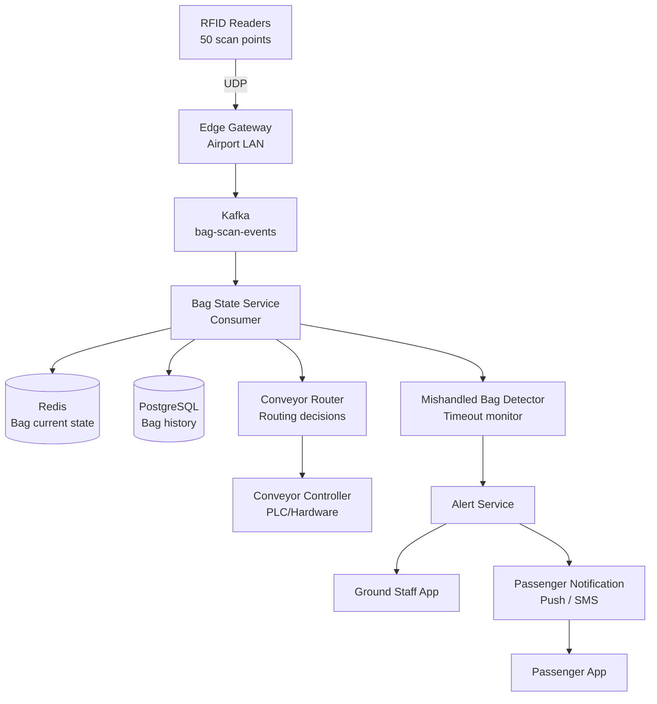

# Design an Airport Baggage Tracking System

**Difficulty**: 🟡 Intermediate
**Reading Time**: ~25 minutes
**The Core Problem**: How do you track 200k bags per day through an airport — from check-in to aircraft hold — using RFID scan events, conveyor routing, and detecting mishandled bags before the flight departs?

---

## Table of Contents

1. [Requirements](#1-requirements)
2. [Capacity Estimation](#2-capacity-estimation)
3. [High-Level Architecture](#3-high-level-architecture)
4. [Bag State Machine](#4-bag-state-machine)
5. [RFID Scan Event Pipeline](#5-rfid-scan-event-pipeline)
6. [Conveyor Routing Algorithm](#6-conveyor-routing-algorithm)
7. [Mishandled Bag Detection](#7-mishandled-bag-detection)
8. [Passenger Notification](#8-passenger-notification)
9. [Key Design Decisions](#9-key-design-decisions)
10. [Interview Questions](#10-interview-questions)
11. [Key Takeaways](#11-key-takeaways)
12. [References](#12-references)

---

## 1. Requirements

### Functional
- Track each bag from check-in to aircraft hold and back to claim belt
- RFID scan events update bag state in real time
- Route bags through conveyor network to correct departure gate
- Detect bags that missed a scan checkpoint (potential mishandling) within 10 minutes
- Notify passengers when baggage is loaded / on claim belt
- Connect bags to correct flight even during re-routing

### Non-Functional
- **Scale**: 200k bags/day (major hub); 50 RFID scan points per airport
- **Latency**: Scan event processed < 1 second
- **Detection time**: Mishandled bag alert within 5 minutes of missed scan
- **Availability**: 99.99% — baggage tracking is safety-critical infrastructure

---

## 2. Capacity Estimation

| Metric | Estimate |
|--------|----------|
| Bags/day | 200k |
| Flights/day | 1,500 (avg 133 bags/flight) |
| RFID scan points | 50 (check-in, sorter, loading, claim) |
| Scan events/bag | ~8 scans per journey |
| Total scan events/day | 200k × 8 = **1.6M events/day** |
| Peak scan events/sec | 1.6M / 57600s (16hr airport operation) × 5× peak = **140 events/sec** |
| Active bags (in system) | 20k concurrent at peak |
| Bag state storage | 200k × 1KB = **200MB/day** |

---

## 3. High-Level Architecture



---

## 4. Bag State Machine

```
States and transitions:

  CHECKED_IN
      ↓  (conveyor intake scan)
  IN_SORTER
      ↓  (sorter scan, route determined)
  ROUTED_TO_GATE_{X}
      ↓  (gate hold scan)
  IN_GATE_HOLD
      ↓  (loader scan)
  LOADED_ON_AIRCRAFT
      ↓  (flight lands, claim belt scan)
  ON_CLAIM_BELT
      ↓  (passenger collects — confirmed by weight sensor or manual)
  COLLECTED

Special states:
  MISHANDLED  ← triggered by timeout monitor
  OFFLOADED   ← security pulls bag from aircraft
  TRANSFERRED ← connecting flight, re-tagged

Allowed transitions (enforced):
  Only forward; MISHANDLED can transition to any valid next state (recovery)
```

---

## 5. RFID Scan Event Pipeline

### RFID Hardware
```
RFID reader: Impinj Speedway R420 (industry standard)
  Read range: 0.5–12 meters
  Read rate: 1000 tags/sec
  Accuracy: 99.5% read rate (vs 85% for barcode in baggage conveyors)
  False positive rate: < 0.01%

RFID tag on bag:
  Memory: 96-bit EPC (Electronic Product Code)
  Encodes: airline_code + flight_date + bag_sequence_number
```

### Edge Gateway Processing
```
RFID readers send raw reads via UDP → Edge Gateway (local server in airport)
Edge Gateway responsibilities:
  1. Deduplicate reads (same tag read 3× as passes under reader → count as 1)
     Dedup window: 2 seconds (bag takes 1–2s to pass reader)
  2. Enrich with context: add reader_id, timestamp, location (CHECKIN-COUNTER-3)
  3. Forward to Kafka: bag-scan-events topic

Event schema:
{
  "bag_id": "BA12345678",
  "reader_id": "READER-GATE-B12",
  "location_code": "GATE_HOLD_B12",
  "scan_type": "GATE_HOLD",
  "timestamp": "2024-03-15T14:22:00Z",
  "flight_id": "AA-100-2024-03-15",
  "confidence": 0.99
}
```

### Kafka Processing
```
Topic: bag-scan-events
Partitions: keyed by bag_id (ordered events per bag)
Consumers:
  - Bag State Service: processes scan → updates Redis + PostgreSQL
  - Flight Manifest Builder: tracks which bags are loaded per flight
  - Mishandled Detector: watches for missed checkpoints
```

---

## 6. Conveyor Routing Algorithm

### Routing Decision Points
```
Conveyor network is a directed graph:
  Nodes: sorter junctions, conveyor segments
  Edges: possible routing directions

Routing decision at each junction:
  Input: bag_id, current_junction_id
  Output: next_direction (LEFT | RIGHT | STRAIGHT)

Algorithm:
  1. Lookup bag's destination gate from flight manifest
  2. Retrieve precomputed shortest path: sorter → destination_gate
  3. At each junction: follow next step in path
  4. Path stored in Redis: bag:{bag_id}:route = ["J1→LEFT", "J5→RIGHT", "J12→STRAIGHT"]

Path precomputation:
  Dijkstra on conveyor graph (static, computed at startup)
  Re-compute if conveyor section is taken offline (maintenance)
  Avg path length: 8 junctions, 600 meters of conveyor
```

### Conveyor Controller Integration
```
System sends routing commands to PLC (Programmable Logic Controller):
  Protocol: OPC-UA (industrial standard)
  Command: { junction_id: "J5", bag_id: "BA12345", direction: "RIGHT" }
  PLC activates divert arm within 200ms (before bag arrives)

Timing: bag takes 3–8s between junctions → plenty of time for command
```

---

## 7. Mishandled Bag Detection

### Timeout-Based Detection
```
Each bag has expected scan checkpoints based on its flight:
  CHECKED_IN     → must reach IN_SORTER      within 10 minutes
  IN_SORTER      → must reach IN_GATE_HOLD   within 30 minutes
  IN_GATE_HOLD   → must reach LOADED         within 60 minutes of departure

Timeout monitor (Redis TTL-based):
  On each scan: set Redis key with TTL = expected_next_scan_timeout
    key: bag_timeout:{bag_id}:{expected_checkpoint}
    TTL: 10 minutes for SORTER checkpoint

  On timeout (key expires):
    Redis keyspace notification → Kafka → Mishandled Detector
    Alert: "Bag BA12345 missed SORTER scan — flight departs in 45 minutes"

Alert priority:
  > 60 min to departure: MEDIUM (information)
  30–60 min: HIGH (ground staff to locate)
  < 30 min: CRITICAL (decision: delay flight or offload?)
```

### Recovery
```
Once mishandled bag is located:
  1. Re-scan bag at current location
  2. Compute new route to destination gate
  3. Update Redis bag state to MISHANDLED → ROUTED_TO_GATE_X
  4. Ground staff app shows updated ETA for loading
```

---

## 8. Passenger Notification

```
Trigger points:
  LOADED_ON_AIRCRAFT: "Your baggage has been loaded on flight AA100"
  ON_CLAIM_BELT: "Your baggage is now on carousel 6"
  MISHANDLED (visible to staff only, not passenger until confirmed)

Notification channels:
  1. Airline app push notification (primary)
  2. SMS to phone on booking (fallback)

MISHANDLED notification to passenger:
  - Only after ground staff confirms bag will be on next flight
  - Message: "Your baggage was delayed. It will arrive on flight AA102 (tomorrow 9am)"
  - File a delayed baggage claim automatically

Delivery guarantee:
  Push + SMS ensures notification delivered even if app is closed
  Notification stored in DB for 48 hours (passenger can check in app retrospectively)
```

---

## 9. Key Design Decisions

| Decision | Option A | Option B | Choice & Reason |
|----------|----------|----------|-----------------|
| Tracking technology | RFID | Barcode | **RFID** — 99.5% vs 85% read rate on conveyor; no line-of-sight needed; faster throughput |
| Routing control | Centralized (single router) | Distributed (edge per junction) | **Centralized** — simpler consistency, easier path updates; junction latency acceptable (3–8s window) |
| Missed scan detection | Polling (cron) | Redis TTL expiry | **Redis TTL** — event-driven, immediate; cron adds up to 1-minute detection delay |
| Passenger notification | At loading only | At each state change | **At loading + claim belt** — too many intermediate states; these two are what passengers care about |
| Data store for state | Redis only | Redis + Postgres | **Redis + Postgres** — Redis for real-time (< 1ms); Postgres for audit, investigations, analytics |

---

## 10. Interview Questions

| Question | Key Answer |
|----------|-----------|
| How do you handle an RFID reader going offline? | Edge gateway queues scans locally; when reconnected, replays in order; bags may show delayed updates |
| How do you associate bags with a connecting flight? | At transfer point, bag re-tagged with new flight info; new tracking chain begins |
| What if a bag is loaded but passenger no-shows (security concern)? | Security offloads bag — OFFLOADED state; ground crew manually removes; RFID scan confirms removal |
| How do you handle duplicate RFID reads at same checkpoint? | Edge gateway dedup window (2s); Kafka consumer: check current state — ignore scan if already in expected state |
| How accurate is the 5-minute mishandled detection? | Detection is within 1s of timeout via Redis keyspace notification; but human response time is the bottleneck |

---

## 11. Key Takeaways

- **RFID over barcode** is the correct choice for baggage conveyors — 99.5% vs 85% read rate, no line-of-sight requirement
- **Redis TTL as a countdown timer** for missed checkpoint detection is the most elegant real-time alerting approach
- **Conveyor routing as Dijkstra on a static graph** with Redis-cached paths handles 200k bags/day at < 100ms routing latency
- **Kafka partitioned by bag_id** guarantees ordered scan event processing per bag
- **IATA Resolution 753** mandates 4-point tracking (departure, loading, arrival, delivery) — design must satisfy this minimum

---

## 📚 Resources & References

| Resource | Type | What You'll Learn |
|----------|------|------------------|
| [IATA Baggage Tracking Resolution 753](https://www.iata.org/en/programs/ops-infra/baggage/baggage-tracking/) | 📚 Book | Industry standard for 4-point bag tracking compliance |
| [SITA Baggage IT Trends Report](https://www.sita.aero/resources/surveys-reports/baggage-report/) | 📖 Blog | Industry mishandling rates and technology adoption |
| [ByteByteGo — Real-Time Streaming](https://www.youtube.com/@ByteByteGo) | 📺 YouTube | Event-driven architecture with Kafka |
| [Impinj RFID — Baggage Handling](https://www.impinj.com/applications/transportation-logistics/airport-baggage-handling/) | 📖 Blog | RFID hardware and integration guide |
