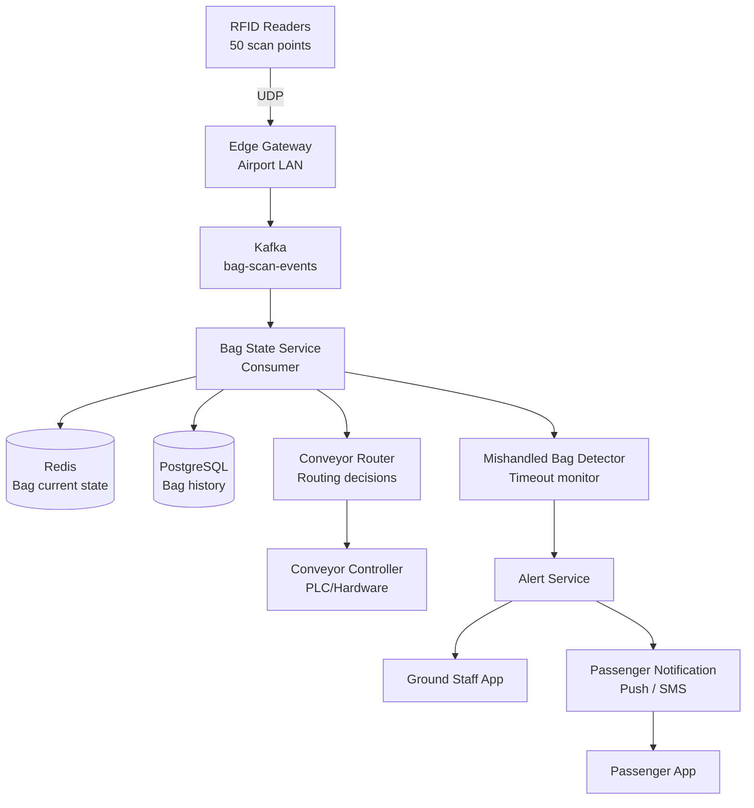
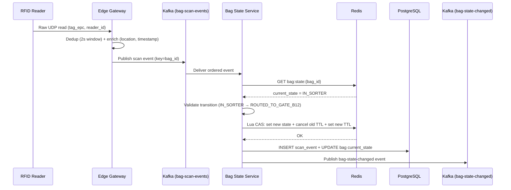
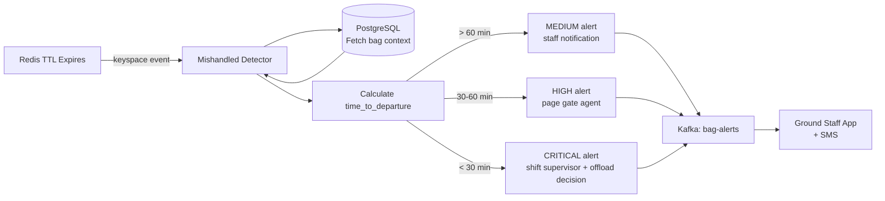

# Design an Airport Baggage Tracking System

**Difficulty**: 🟡 Intermediate
**Reading Time**: ~25 minutes
**The Core Problem**: How do you track 200k bags per day through an airport — from check-in to aircraft hold — using RFID scan events, conveyor routing, and detecting mishandled bags before the flight departs?

---

## Table of Contents

1. [Requirements](#1-requirements)
2. [Capacity Estimation](#2-capacity-estimation)
3. [High-Level Architecture](#3-high-level-architecture)
4. [Bag State Machine](#4-bag-state-machine)
5. [RFID Scan Event Pipeline](#5-rfid-scan-event-pipeline)
6. [Conveyor Routing Algorithm](#6-conveyor-routing-algorithm)
7. [Mishandled Bag Detection](#7-mishandled-bag-detection)
8. [Passenger Notification](#8-passenger-notification)
9. [Key Design Decisions](#9-key-design-decisions)
10. [Interview Questions](#10-interview-questions)
11. [Key Takeaways](#11-key-takeaways)
12. [References](#12-references)

---

## 1. Requirements

### Functional
- Track each bag from check-in to aircraft hold and back to claim belt
- RFID scan events update bag state in real time
- Route bags through conveyor network to correct departure gate
- Detect bags that missed a scan checkpoint (potential mishandling) within 10 minutes
- Notify passengers when baggage is loaded / on claim belt
- Connect bags to correct flight even during re-routing

### Non-Functional
- **Scale**: 200k bags/day (major hub); 50 RFID scan points per airport
- **Latency**: Scan event processed < 1 second
- **Detection time**: Mishandled bag alert within 5 minutes of missed scan
- **Availability**: 99.99% — baggage tracking is safety-critical infrastructure

---

## 2. Capacity Estimation

| Metric | Estimate |
|--------|----------|
| Bags/day | 200k |
| Flights/day | 1,500 (avg 133 bags/flight) |
| RFID scan points | 50 (check-in, sorter, loading, claim) |
| Scan events/bag | ~8 scans per journey |
| Total scan events/day | 200k × 8 = **1.6M events/day** |
| Peak scan events/sec | 1.6M / 57600s (16hr airport operation) × 5× peak = **140 events/sec** |
| Active bags (in system) | 20k concurrent at peak |
| Bag state storage | 200k × 1KB = **200MB/day** |

---

## 3. High-Level Architecture



---

## 4. Bag State Machine

```
States and transitions:

  CHECKED_IN
      ↓  (conveyor intake scan)
  IN_SORTER
      ↓  (sorter scan, route determined)
  ROUTED_TO_GATE_{X}
      ↓  (gate hold scan)
  IN_GATE_HOLD
      ↓  (loader scan)
  LOADED_ON_AIRCRAFT
      ↓  (flight lands, claim belt scan)
  ON_CLAIM_BELT
      ↓  (passenger collects — confirmed by weight sensor or manual)
  COLLECTED

Special states:
  MISHANDLED  ← triggered by timeout monitor
  OFFLOADED   ← security pulls bag from aircraft
  TRANSFERRED ← connecting flight, re-tagged

Allowed transitions (enforced):
  Only forward; MISHANDLED can transition to any valid next state (recovery)
```

---

## 5. RFID Scan Event Pipeline

### RFID Hardware
```
RFID reader: Impinj Speedway R420 (industry standard)
  Read range: 0.5–12 meters
  Read rate: 1000 tags/sec
  Accuracy: 99.5% read rate (vs 85% for barcode in baggage conveyors)
  False positive rate: < 0.01%

RFID tag on bag:
  Memory: 96-bit EPC (Electronic Product Code)
  Encodes: airline_code + flight_date + bag_sequence_number
```

### Edge Gateway Processing
```
RFID readers send raw reads via UDP → Edge Gateway (local server in airport)
Edge Gateway responsibilities:
  1. Deduplicate reads (same tag read 3× as passes under reader → count as 1)
     Dedup window: 2 seconds (bag takes 1–2s to pass reader)
  2. Enrich with context: add reader_id, timestamp, location (CHECKIN-COUNTER-3)
  3. Forward to Kafka: bag-scan-events topic

Event schema:
{
  "bag_id": "BA12345678",
  "reader_id": "READER-GATE-B12",
  "location_code": "GATE_HOLD_B12",
  "scan_type": "GATE_HOLD",
  "timestamp": "2024-03-15T14:22:00Z",
  "flight_id": "AA-100-2024-03-15",
  "confidence": 0.99
}
```

### Kafka Processing
```
Topic: bag-scan-events
Partitions: keyed by bag_id (ordered events per bag)
Consumers:
  - Bag State Service: processes scan → updates Redis + PostgreSQL
  - Flight Manifest Builder: tracks which bags are loaded per flight
  - Mishandled Detector: watches for missed checkpoints
```

---

## 6. Conveyor Routing Algorithm

### Routing Decision Points
```
Conveyor network is a directed graph:
  Nodes: sorter junctions, conveyor segments
  Edges: possible routing directions

Routing decision at each junction:
  Input: bag_id, current_junction_id
  Output: next_direction (LEFT | RIGHT | STRAIGHT)

Algorithm:
  1. Lookup bag's destination gate from flight manifest
  2. Retrieve precomputed shortest path: sorter → destination_gate
  3. At each junction: follow next step in path
  4. Path stored in Redis: bag:{bag_id}:route = ["J1→LEFT", "J5→RIGHT", "J12→STRAIGHT"]

Path precomputation:
  Dijkstra on conveyor graph (static, computed at startup)
  Re-compute if conveyor section is taken offline (maintenance)
  Avg path length: 8 junctions, 600 meters of conveyor
```

### Conveyor Controller Integration
```
System sends routing commands to PLC (Programmable Logic Controller):
  Protocol: OPC-UA (industrial standard)
  Command: { junction_id: "J5", bag_id: "BA12345", direction: "RIGHT" }
  PLC activates divert arm within 200ms (before bag arrives)

Timing: bag takes 3–8s between junctions → plenty of time for command
```

---

## 7. Mishandled Bag Detection

### Timeout-Based Detection
```
Each bag has expected scan checkpoints based on its flight:
  CHECKED_IN     → must reach IN_SORTER      within 10 minutes
  IN_SORTER      → must reach IN_GATE_HOLD   within 30 minutes
  IN_GATE_HOLD   → must reach LOADED         within 60 minutes of departure

Timeout monitor (Redis TTL-based):
  On each scan: set Redis key with TTL = expected_next_scan_timeout
    key: bag_timeout:{bag_id}:{expected_checkpoint}
    TTL: 10 minutes for SORTER checkpoint

  On timeout (key expires):
    Redis keyspace notification → Kafka → Mishandled Detector
    Alert: "Bag BA12345 missed SORTER scan — flight departs in 45 minutes"

Alert priority:
  > 60 min to departure: MEDIUM (information)
  30–60 min: HIGH (ground staff to locate)
  < 30 min: CRITICAL (decision: delay flight or offload?)
```

### Recovery
```
Once mishandled bag is located:
  1. Re-scan bag at current location
  2. Compute new route to destination gate
  3. Update Redis bag state to MISHANDLED → ROUTED_TO_GATE_X
  4. Ground staff app shows updated ETA for loading
```

---

## 8. Passenger Notification

```
Trigger points:
  LOADED_ON_AIRCRAFT: "Your baggage has been loaded on flight AA100"
  ON_CLAIM_BELT: "Your baggage is now on carousel 6"
  MISHANDLED (visible to staff only, not passenger until confirmed)

Notification channels:
  1. Airline app push notification (primary)
  2. SMS to phone on booking (fallback)

MISHANDLED notification to passenger:
  - Only after ground staff confirms bag will be on next flight
  - Message: "Your baggage was delayed. It will arrive on flight AA102 (tomorrow 9am)"
  - File a delayed baggage claim automatically

Delivery guarantee:
  Push + SMS ensures notification delivered even if app is closed
  Notification stored in DB for 48 hours (passenger can check in app retrospectively)
```

---

## 9. Key Design Decisions

| Decision | Option A | Option B | Choice & Reason |
|----------|----------|----------|-----------------|
| Tracking technology | RFID | Barcode | **RFID** — 99.5% vs 85% read rate on conveyor; no line-of-sight needed; faster throughput |
| Routing control | Centralized (single router) | Distributed (edge per junction) | **Centralized** — simpler consistency, easier path updates; junction latency acceptable (3–8s window) |
| Missed scan detection | Polling (cron) | Redis TTL expiry | **Redis TTL** — event-driven, immediate; cron adds up to 1-minute detection delay |
| Passenger notification | At loading only | At each state change | **At loading + claim belt** — too many intermediate states; these two are what passengers care about |
| Data store for state | Redis only | Redis + Postgres | **Redis + Postgres** — Redis for real-time (< 1ms); Postgres for audit, investigations, analytics |

---

## 10. Interview Questions

| Question | Key Answer |
|----------|-----------|
| How do you handle an RFID reader going offline? | Edge gateway queues scans locally; when reconnected, replays in order; bags may show delayed updates |
| How do you associate bags with a connecting flight? | At transfer point, bag re-tagged with new flight info; new tracking chain begins |
| What if a bag is loaded but passenger no-shows (security concern)? | Security offloads bag — OFFLOADED state; ground crew manually removes; RFID scan confirms removal |
| How do you handle duplicate RFID reads at same checkpoint? | Edge gateway dedup window (2s); Kafka consumer: check current state — ignore scan if already in expected state |
| How accurate is the 5-minute mishandled detection? | Detection is within 1s of timeout via Redis keyspace notification; but human response time is the bottleneck |

---

## 11. Key Takeaways

- **RFID over barcode** is the correct choice for baggage conveyors — 99.5% vs 85% read rate, no line-of-sight requirement
- **Redis TTL as a countdown timer** for missed checkpoint detection is the most elegant real-time alerting approach
- **Conveyor routing as Dijkstra on a static graph** with Redis-cached paths handles 200k bags/day at < 100ms routing latency
- **Kafka partitioned by bag_id** guarantees ordered scan event processing per bag
- **IATA Resolution 753** mandates 4-point tracking (departure, loading, arrival, delivery) — design must satisfy this minimum

---

---

## Component Deep Dive 1: Bag State Service (Event Processing Core)

The Bag State Service is the central nervous system of the baggage tracking system. Every RFID scan in the airport funnels through it, and its correctness directly determines whether bags get routed properly, alerts fire on time, and passengers receive accurate notifications.

### How It Works Internally

The service is a Kafka consumer running as a stateful stream processor. It consumes from the `bag-scan-events` topic — partitioned by `bag_id` to guarantee ordered delivery per bag — and for each event it:

1. **Validates the transition**: Looks up current bag state in Redis (`bag:state:{bag_id}`). Rejects illegal transitions (e.g., `LOADED_ON_AIRCRAFT → IN_SORTER`). Accepts idempotent re-scans (same state + same location = no-op).
2. **Updates Redis atomically**: Uses a Lua script to compare-and-swap the state only if it matches the expected prior state. This prevents race conditions when two RFID readers scan the same bag within milliseconds.
3. **Writes to PostgreSQL**: Appends a row to the `bag_scan_events` table (append-only audit log). Also updates the `bags` table current state column.
4. **Emits downstream events**: Publishes a `bag-state-changed` event to a second Kafka topic, which fans out to the Conveyor Router, Mishandled Detector, and Passenger Notification services.
5. **Resets timeout TTL**: After a valid transition, cancels the previous TTL key and sets a new one for the next expected checkpoint.

### Why Naive Approaches Fail

A naive approach might use a REST endpoint — RFID readers POST scan events, a handler updates the DB, done. This breaks at scale for three reasons:

- **Burst absorption**: 140 events/sec average, but sorter areas can spike to 800 events/sec when multiple flights check in simultaneously. A synchronous DB write per event causes connection pool exhaustion and cascading timeouts.
- **Ordering guarantee**: Without Kafka partitioning, two scans 50ms apart can arrive out of order at a horizontally scaled REST service — the state machine processes them wrong (e.g., `SORTER` scan arrives before `CHECKED_IN` scan).
- **Tail latency**: Direct DB writes at high concurrency hit P99 latencies of 200–500ms. Redis-backed state gives P99 < 2ms for the hot path.

### Sequence Diagram: Scan Event to State Update



### Implementation Options Trade-Off

| Approach | Latency (P99) | Throughput | Trade-off |
|----------|---------------|------------|-----------|
| Direct PostgreSQL writes (no Redis) | 80–200ms | ~2,000 events/sec | Simple, but DB becomes bottleneck at peak; no sub-millisecond routing lookups |
| Redis-only (no PostgreSQL) | 1–3ms | 50,000+ events/sec | Fastest, but data loss on Redis restart; no audit trail for investigations or IATA compliance |
| Redis + PostgreSQL async (chosen) | 2–5ms | 15,000 events/sec | Redis for hot path; PG write is async (Kafka consumer lag buffer); best balance |

---

## Component Deep Dive 2: Mishandled Bag Detector (Timeout Monitor)

The Mishandled Bag Detector is a reactive component that watches for silence — bags that stop emitting scan events when they should be progressing through the system. It must fire within 5 minutes of a missed checkpoint, which rules out polling-based designs.

### Internal Mechanics

The detector is built on **Redis keyspace notifications**. When the Bag State Service transitions a bag to a new state, it sets a Redis key with a TTL:

```
SET bag_timeout:{bag_id}:{expected_checkpoint}  ""  EX {timeout_seconds}
```

For example, after `CHECKED_IN`, the key `bag_timeout:BA12345:SORTER` is set with `EX 600` (10-minute TTL). If the bag reaches the sorter and scans in, the Bag State Service deletes this key before it expires.

If the bag *does not* reach the sorter within 10 minutes, the key expires. Redis publishes a `__keyevent@0__:expired` event on the keyspace notification channel. The Mishandled Detector subscribes to this channel, parses the key name to extract `bag_id` and `expected_checkpoint`, then fires the alert pipeline.

### Alert Pipeline



### Scale Behaviour at 10x Load

At 10x load (2M bags/day, 1,400 events/sec), the primary concern is Redis keyspace notification throughput. Redis publishes keyspace events on its pub/sub system, which is single-threaded. At 10x load with 8 checkpoints/bag, up to 16M TTL keys exist at any time. Expired key notifications can saturate the pub/sub channel.

Mitigation: partition the timeout monitoring across multiple Redis instances using consistent hashing on `bag_id`. Each Mishandled Detector instance subscribes to one Redis shard. At 10x, 5 shards handle load comfortably (< 200k active TTL keys per shard).

| Traffic Level | Active TTL Keys | Redis Pub/Sub Load | Mitigation |
|---------------|-----------------|-------------------|------------|
| 1x (200k bags/day) | ~160k | Low | Single Redis instance |
| 10x (2M bags/day) | ~1.6M | Moderate | 3–5 Redis shards |
| 100x (20M bags/day) | ~16M | High | Dedicated Redis cluster + Flink-based timeout detection |

---

## Component Deep Dive 3: Conveyor Router (Path Computation and Real-Time Dispatch)

The Conveyor Router translates a bag's destination gate into a sequence of junction-level commands dispatched to the airport's PLC (Programmable Logic Controller) network. It is latency-sensitive — commands must arrive at each junction 200–500ms before the bag does.

### Path Computation

The conveyor network is modeled as a weighted directed graph where nodes are junctions and edges are conveyor segments with weights representing travel time in seconds. Path computation uses Dijkstra's algorithm, precomputed at startup (the physical network changes rarely — only during maintenance). Paths are stored in Redis:

```
bag:{bag_id}:route → ["J1:LEFT", "J5:RIGHT", "J12:STRAIGHT", "J18:LEFT", "J22:STRAIGHT"]
```

When the Bag State Service emits a `CHECKED_IN → IN_SORTER` event, the Conveyor Router:
1. Looks up the flight's destination gate
2. Retrieves the precomputed path `source_sorter → gate_hold_{X}`
3. Stores it in Redis under the bag's route key
4. Begins dispatching commands as the bag moves (triggered by each subsequent scan event)

### PLC Integration Considerations

PLCs require deterministic timing. The router dispatches the divert command for junction `J5` when the bag departs `J1`, not when it arrives at `J5`. Travel time between junctions (typically 3–8 seconds) provides the command delivery window. The OPC-UA protocol over the airport LAN has < 50ms round-trip latency, giving comfortable margin.

Failure handling: if the PLC does not acknowledge a command within 100ms, the router retries once, then raises an `ACTUATOR_FAILURE` alert. The bag will miss the divert and continue straight — ground staff are alerted to retrieve it manually.

### Routing Recalculation Under Network Disruption

If a conveyor section is taken offline (maintenance, jam), the router receives a `CONVEYOR_DOWN` event, removes the affected edges from the graph, recomputes all affected paths, and updates Redis. For bags already in transit on the affected segment, ground staff are alerted to manual intercept.

---

## Data Model

### PostgreSQL Schema

```sql
-- Core bag record
CREATE TABLE bags (
    bag_id          VARCHAR(20) PRIMARY KEY,         -- e.g., 'BA12345678'
    passenger_id    UUID NOT NULL,
    flight_id       VARCHAR(30) NOT NULL,             -- 'AA-100-2024-03-15'
    destination_gate VARCHAR(10),                     -- 'B12'
    current_state   VARCHAR(30) NOT NULL DEFAULT 'CHECKED_IN',
    current_location VARCHAR(50),                     -- 'GATE_HOLD_B12'
    checked_in_at   TIMESTAMPTZ NOT NULL,
    updated_at      TIMESTAMPTZ NOT NULL,
    is_transfer     BOOLEAN DEFAULT FALSE,
    weight_kg       NUMERIC(5,2),
    tag_epc         VARCHAR(32) UNIQUE NOT NULL       -- 96-bit RFID EPC
);

-- Immutable scan event log (append-only)
CREATE TABLE bag_scan_events (
    event_id        UUID PRIMARY KEY DEFAULT gen_random_uuid(),
    bag_id          VARCHAR(20) NOT NULL REFERENCES bags(bag_id),
    reader_id       VARCHAR(30) NOT NULL,             -- 'READER-GATE-B12'
    location_code   VARCHAR(50) NOT NULL,
    scan_type       VARCHAR(30) NOT NULL,             -- 'GATE_HOLD', 'SORTER', etc.
    from_state      VARCHAR(30),
    to_state        VARCHAR(30),
    scanned_at      TIMESTAMPTZ NOT NULL,
    flight_id       VARCHAR(30),
    confidence      NUMERIC(4,3),                     -- RFID read confidence 0.0–1.0
    is_duplicate    BOOLEAN DEFAULT FALSE,
    raw_epc         VARCHAR(32)
);

-- Mishandled bag log
CREATE TABLE bag_incidents (
    incident_id     UUID PRIMARY KEY DEFAULT gen_random_uuid(),
    bag_id          VARCHAR(20) NOT NULL REFERENCES bags(bag_id),
    incident_type   VARCHAR(30) NOT NULL,             -- 'MISSED_SCAN', 'WRONG_GATE', 'OFFLOADED'
    expected_checkpoint VARCHAR(30),
    detected_at     TIMESTAMPTZ NOT NULL,
    resolved_at     TIMESTAMPTZ,
    time_to_departure_min INT,
    alert_priority  VARCHAR(10),                      -- 'LOW', 'MEDIUM', 'HIGH', 'CRITICAL'
    resolved_by     VARCHAR(50),                      -- staff_id
    resolution_notes TEXT
);

-- Flight manifest (which bags are expected per flight)
CREATE TABLE flight_bag_manifest (
    manifest_id     UUID PRIMARY KEY DEFAULT gen_random_uuid(),
    flight_id       VARCHAR(30) NOT NULL,
    bag_id          VARCHAR(20) NOT NULL REFERENCES bags(bag_id),
    expected_state  VARCHAR(30) NOT NULL DEFAULT 'LOADED_ON_AIRCRAFT',
    actual_loaded   BOOLEAN DEFAULT FALSE,
    loaded_at       TIMESTAMPTZ,
    UNIQUE(flight_id, bag_id)
);

-- Indexes
CREATE INDEX idx_bags_flight ON bags(flight_id);
CREATE INDEX idx_bags_state ON bags(current_state);
CREATE INDEX idx_scan_events_bag_time ON bag_scan_events(bag_id, scanned_at DESC);
CREATE INDEX idx_scan_events_flight ON bag_scan_events(flight_id, scanned_at DESC);
CREATE INDEX idx_incidents_unresolved ON bag_incidents(resolved_at) WHERE resolved_at IS NULL;
```

### Redis Key Schema

```
# Current bag state (hot path, TTL = 48 hours after flight lands)
bag:state:{bag_id}                  → JSON { state, location, flight_id, updated_at }

# Routing path (list of junction commands)
bag:route:{bag_id}                  → LIST ["J1:LEFT", "J5:RIGHT", ...]

# Timeout sentinel keys (fire alert when these expire)
bag_timeout:{bag_id}:{checkpoint}   → "" (TTL = expected seconds until next scan)

# Flight load count (for manifest checking)
flight:loaded:{flight_id}           → INT (INCR on each LOADED_ON_AIRCRAFT event)
flight:expected:{flight_id}         → INT (set at check-in close)
```

---

## Scale Bottlenecks

| Traffic Level | Component That Breaks | Symptoms | Mitigation |
|---------------|----------------------|----------|------------|
| 10x baseline (2M bags/day, 1,400 evt/sec) | Kafka consumer lag in Bag State Service | Scan events processed 10–30s late; routing commands delayed; conveyor timing errors | Scale Bag State Service horizontally (add consumer instances per partition group); increase Kafka partition count from 50 to 150 |
| 10x baseline | Redis keyspace notification saturation | Missed bag timeout alerts; mishandled detection latency rises from 5s to 60s+ | Shard timeout keys across 3–5 Redis instances; one Mishandled Detector per shard |
| 100x baseline (20M bags/day) | PostgreSQL write throughput | `bag_scan_events` insert queue backs up; audit lag grows to hours | Partition `bag_scan_events` by `scanned_at` (monthly); migrate to TimescaleDB or ClickHouse for time-series scan events; keep `bags` (state) in PostgreSQL |
| 100x baseline | Single Conveyor Router instance | PLC command dispatch latency rises above 500ms; bags miss divert arms | Shard Conveyor Router by airport zone (Zone A/B/C/D); each zone manages its own conveyor subgraph |
| 1000x baseline (200M bags/day — entire global air travel) | Everything | N/A at single airport; this is a multi-airport system | Federate: each airport runs independent stack; central aggregation layer for cross-airport transfer bags only; use IATA MessageBus for inter-airport events |

---

## How Delta Air Lines Built This

Delta Air Lines is the most publicly documented airline baggage tracking implementation. In 2016, Delta became the first US airline to comply with IATA Resolution 753 (mandatory 4-point tracking). They subsequently expanded to near-real-time tracking and integrated it into the Fly Delta app.

**Technology stack**: Delta built their baggage tracking on top of their existing SITA BagManager platform (an industry-standard baggage management system), extended with custom microservices for real-time notification. RFID adoption was rolled out at their top 84 airports, representing ~80% of Delta's total bag volume. The remaining airports use 2D barcode scanning.

**Scale numbers**: Delta handles approximately 120 million bags per year across ~6,000 daily flights. At their Atlanta Hartsfield-Jackson hub (the world's busiest), approximately 180,000 bags per day transit the system. Their RFID read accuracy at ATL is 99.9% after tuning reader placement at conveyor entry points.

**Non-obvious architectural decision**: Delta discovered that the highest-value notification is not "bag loaded" (which passengers knew was happening) but "bag on carousel" — the moment they need to physically move to the claim area. This required a separate sensor layer at carousel arrival points (weight sensors + RFID gates at carousel entry) distinct from the departure-side tracking. The carousel detection system was engineered by BEUMER Group and integrated via a separate API into Delta's notification pipeline.

**Outcome**: After full RFID rollout, Delta reduced mishandled baggage rate from 2.85 per 1,000 passengers (industry average in 2016) to 1.58 per 1,000 — a 44% reduction. The Fly Delta app's baggage tracking feature reached 4M+ active users within 18 months of launch.

**Source**: Delta Air Lines Engineering Blog (2016 IATA Resolution 753 compliance announcement); SITA Baggage IT Trends Report 2017; Impinj case study — Delta Air Lines RFID deployment.

---

## Interview Angle

**What the interviewer is testing**: Can you design a real-time event-driven system that bridges physical hardware (RFID readers, PLCs) with software infrastructure? Do you understand the state machine pattern, idempotency in event processing, and timeout-based detection?

**Common mistakes candidates make**:

1. **Using a database polling loop for mishandled bag detection** — candidates often suggest a cron job that scans the DB every minute for bags overdue at a checkpoint. This adds up to 60 seconds of detection delay, violates the 5-minute SLA, and puts unnecessary load on PostgreSQL. The correct answer is Redis TTL expiry with keyspace notifications for sub-second detection.

2. **Ignoring conveyor timing constraints** — candidates design a system where the routing command is sent when the bag *arrives* at a junction rather than when it *departs* the previous junction. At conveyor speed (~2 m/s), a 500ms command propagation delay means the PLC activates the divert arm too late. The design must account for travel time between junctions in the command dispatch logic.

3. **Not handling RFID read failures** — candidates assume 100% RFID read accuracy. In production, 0.5% of bags are not read on first pass (antenna orientation, metal buckles, dense tag fields). The system must handle this: edge gateway should use dual-pass read (two readers in sequence), and the state machine must handle out-of-order "catch-up" scans without corrupting the state.

**The insight that separates good from great answers**: The hardest problem is not the happy path — it is correctly handling the interplay between the state machine, the timeout TTL, and the Conveyor Router during *recovery* from a mishandled bag. When a mishandled bag is found and re-scanned 45 minutes late, the system must: (1) cancel stale TTL keys from the original journey, (2) recompute the conveyor route from the current location (not the sorter), (3) update the flight manifest's expected-not-loaded count, and (4) send a recovery alert to ground staff with a new estimated loading time — all atomically and in the correct order. Showing you have thought through recovery, not just detection, signals senior-level depth.

---

## Key Numbers to Remember

| Metric | Value | Context |
|--------|-------|---------|
| RFID read accuracy | 99.5% (conveyor), 99.9% (with tuned placement) | vs 85% for barcode on moving conveyor; Delta achieved 99.9% at ATL |
| Scan events per bag | ~8 scans | Check-in, sorter entry, sorter exit, gate hold, loading, landing, claim arrival, claim collection |
| Peak scan throughput | 140 events/sec average, 800 events/sec burst | Major hub, 200k bags/day, 16hr operation window, 5x peak factor |
| Mishandled detection SLA | < 5 minutes | Redis TTL expiry fires within 1s; human response is the bottleneck |
| Conveyor command window | 3–8 seconds | Travel time between junctions; OPC-UA command must arrive in < 200ms |
| Redis P99 state lookup | < 2ms | Hot path for routing and state validation |
| Bag state storage | 200MB/day (state records) + 1.6MB/day (scan events at 1KB each) | PostgreSQL; partition monthly |
| Delta mishandled rate after RFID | 1.58 per 1,000 passengers | Down from 2.85 (44% reduction) after RFID rollout at 84 airports |
| IATA Resolution 753 mandate | 4 scan points minimum | Departure gate, loading, arrival, delivery to passenger |
| Conveyor graph path length | 8 junctions, ~600 meters | Average sorter-to-gate path at major hub |

---

## 📚 Resources & References

| Resource | Type | What You'll Learn |
|----------|------|------------------|
| [IATA Baggage Tracking Resolution 753](https://www.iata.org/en/programs/ops-infra/baggage/baggage-tracking/) | 📚 Book | Industry standard for 4-point bag tracking compliance |
| [SITA Baggage IT Trends Report](https://www.sita.aero/resources/surveys-reports/baggage-report/) | 📖 Blog | Industry mishandling rates and technology adoption |
| [ByteByteGo — Real-Time Streaming](https://www.youtube.com/@ByteByteGo) | 📺 YouTube | Event-driven architecture with Kafka |
| [Impinj RFID — Baggage Handling](https://www.impinj.com/applications/transportation-logistics/airport-baggage-handling/) | 📖 Blog | RFID hardware and integration guide |
