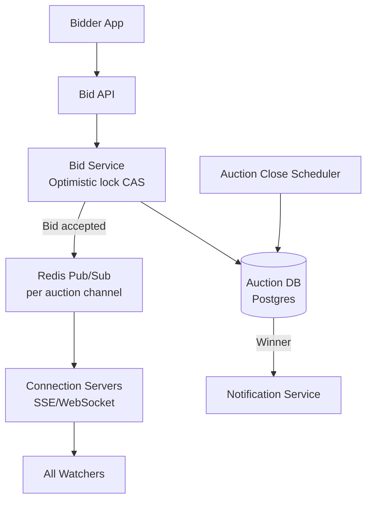
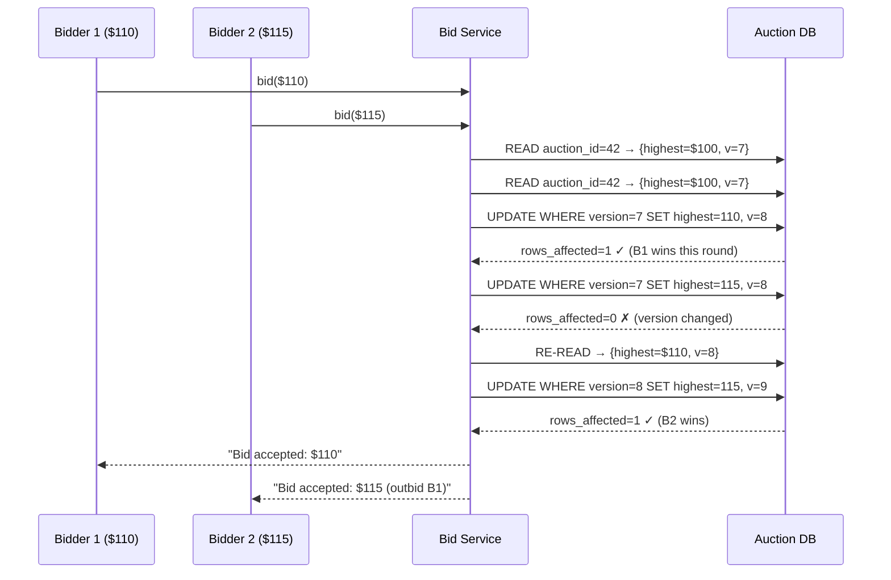
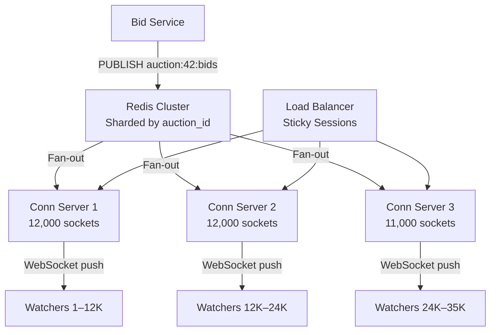

# Design an Auction System (eBay)

**Difficulty**: 🔴 Advanced
**Reading Time**: Coming Soon
**Interview Frequency**: Medium

---

> 🚧 **Full article coming soon.** This stub gives you the essentials to start thinking about this problem.

---

## The Core Problem

Accepting bids from 10,000 concurrent bidders in the final seconds of a popular auction — all trying to submit the highest bid simultaneously — requires strong consistency guarantees. A race condition that accepts two "winning" bids means charging two users for one item. The system must provide atomicity, fairness, and real-time bid broadcasting.

## Functional Requirements

- Sellers list items with starting bid, reserve price, and auction end time
- Bidders place bids (only higher than current highest accepted)
- Real-time bid updates broadcast to all auction watchers
- Auction closes at scheduled time; highest bid wins
- Support proxy bidding (auto-increment up to a max)

## Non-Functional Requirements

| Requirement | Target |
|-------------|--------|
| Consistency | Exactly one winner; no two winning bids |
| Bid processing latency | p99 < 500ms |
| Real-time broadcasting | < 1 second to all watchers |
| Scale | 10M concurrent auctions, 10K bids/sec per hot auction |

## Back-of-Envelope Estimates

- **Concurrent auctions**: 10M auctions × avg 0.1 bids/sec = 1M bids/sec average
- **Hot auction spike**: Single viral auction: 10,000 users × 1 bid in last 10 sec = 1,000 bids/sec on one record
- **Bid broadcasting**: 1,000 bids/sec × 50,000 watchers per auction = 50M push messages/sec at peak

## Key Design Decisions

1. **Optimistic Locking for Bid Acceptance** — read current_highest_bid + version; verify new_bid > current; CAS update (version + 1); if version changed, reject bid with "outbid" response; avoids full DB locks while ensuring exactly-one winner.
2. **Auction Close Atomicity** — use a scheduled job + distributed lock to mark auction as closed; once closed, bids are rejected; winner notification happens asynchronously after close to avoid holding lock during notification.
3. **Real-time Bid Broadcasting via SSE/WebSocket** — when a bid is accepted, publish to Redis channel per auction_id; all connection servers subscribed to that channel push updated highest bid to watchers; no need to poll.

## High-Level Architecture



## Top Interview Questions for This Problem

| Question | Tests |
|----------|-------|
| How do you handle 10,000 users submitting bids in the last 3 seconds of an auction? | Concurrency, optimistic locking |
| How do you implement proxy bidding (bid up to $500 automatically)? | Bid agent, incremental bidding |
| How do you prevent bid sniping (placing bid 1 second before close)? | Anti-sniping extensions, auction rules |

## Related Concepts

- [Hotel booking for similar concurrency/inventory patterns](./hotel-booking)
- [Distributed locking alternatives to optimistic locking](../05-infrastructure/distributed-locking)

---

## Component Deep Dive 1: Bid Acceptance Engine (Optimistic Locking with CAS)

The bid acceptance engine is the single most critical component in an auction system. Every bid must be validated and accepted or rejected atomically — two bids cannot simultaneously be declared the highest. Naive approaches fail badly at scale.

**Why a simple SELECT + UPDATE fails**: Under concurrent load, two bidders both read `current_highest_bid = $100`, both compute their bid of $110 is valid, and both execute `UPDATE ... SET highest_bid = $110`. Both succeed. You have two winning bidders. This race condition is the fundamental correctness problem.

**Why pessimistic locking (SELECT FOR UPDATE) fails at scale**: A DB-level row lock works correctly but serializes all bidders on a single auction behind one lock. During the last 10 seconds of a viral auction with 10,000 concurrent bidders, the DB connection pool is exhausted, lock wait queues grow unbounded, and p99 latency spikes to 5–10 seconds. At 10,000 bids/sec on one row, this approach collapses.

**How optimistic locking with CAS works**: Each auction row carries a `version` integer. The bid service reads `(current_highest_bid, version, auction_status)` in a single read. It validates the new bid exceeds the current highest. Then it issues a conditional update:

```sql
UPDATE auctions
SET   highest_bid = $new_bid,
      highest_bidder_id = $bidder_id,
      version = version + 1
WHERE auction_id = $auction_id
  AND version = $read_version
  AND auction_status = 'active';
-- Returns rows_affected: 1 (success) or 0 (conflict)
```

If `rows_affected = 0`, another bid landed between read and write. The service re-reads the row and responds with "outbid" or retries if the new bid still exceeds the updated current highest. This loop typically resolves in 1–3 iterations under high concurrency because each retry sees a fresher value.



| Approach | Latency (p99) | Throughput | Trade-off |
|----------|--------------|------------|-----------|
| Pessimistic lock (SELECT FOR UPDATE) | 2,000–10,000ms at 10K bids/sec | ~500 bids/sec per auction | Serializes all bidders; DB connection pool exhausted |
| Optimistic CAS (version column) | 50–200ms including retries | 5,000–8,000 bids/sec per auction | Retry storms possible; requires idempotent bid IDs |
| Redis INCR + Lua atomic script | 5–20ms | 50,000+ bids/sec | Redis is not durable by default; requires AOF + replication |

For most auction platforms, optimistic CAS on Postgres with proper indexing on `(auction_id, version)` handles 5,000–8,000 bids/sec per auction — more than enough for all but the most extreme viral auctions, where the Redis Lua path becomes necessary.

---

## Component Deep Dive 2: Real-Time Bid Broadcasting (Fan-Out Architecture)

When a bid is accepted, every watcher on that auction must see the updated highest bid within 1 second. At 50,000 watchers per popular auction and 1,000 accepted bids/sec, that is 50 million push messages per second at peak — a classic fan-out problem.

**Internal mechanics**: The Bid Service, on successful CAS write, publishes a compact bid event to a Redis Pub/Sub channel named `auction:{auction_id}:bids`. The message contains `{auction_id, new_highest_bid, bidder_display_name, timestamp, bid_count}` — roughly 200 bytes. Connection Servers (stateful WebSocket/SSE servers) each subscribe to relevant auction channels. When a message arrives, they iterate their local subscriber list and push it to each connected client.

**Scale behavior at 10x load**: A single Redis node can handle ~1M pub/sub messages/sec. At 10x the baseline 50M messages/sec, a single Redis node saturates. The mitigation is partitioning: shard auction channels across a Redis Cluster by `auction_id % num_shards`. Connection Servers subscribe only to shards relevant to their connected clients. This scales linearly — 10 shards × 5M messages/sec each = 50M/sec total.



**Connection Server capacity**: Each Connection Server runs ~10,000–15,000 concurrent WebSocket connections (Node.js or Go event loop, not a thread-per-connection model). A single 4-core VM handles this comfortably at ~30% CPU. For 50,000 watchers on one auction, you need 4–5 Connection Server instances subscribed to that auction's Redis channel, each maintaining ~10,000–12,000 sockets.

**Sticky session routing**: The load balancer must route each user's WebSocket upgrade request to the same Connection Server for the session lifetime (sticky sessions by cookie or IP hash). Otherwise, a user reconnecting after a network blip lands on a different server that has no active subscription context for them.

| Approach | Max Watchers / Auction | Infra Cost | Failure Mode |
|----------|----------------------|------------|--------------|
| Redis Pub/Sub + WebSocket | 100,000+ | Low (Redis is cheap) | Redis node failure drops all channels |
| Kafka + SSE | 500,000+ | Medium | Consumer lag causes delayed updates |
| Direct DB polling | 1,000 | High (DB hammering) | DB overwhelmed at any scale |

---

## Component Deep Dive 3: Auction Close and Winner Determination

Closing an auction correctly is harder than accepting bids. The close event must be atomic: once the auction transitions from `active` to `closed`, zero new bids can be accepted, exactly one winner is declared, and all in-flight bids at the time of close are either committed or rejected — never ambiguously pending.

**The close race condition**: A bid arrives at t=T_close - 50ms. The Bid Service reads `auction_status = active`, validates the bid, but the CAS update lands at t=T_close + 10ms — after the close job has already marked the auction closed and recorded the winner. Now two winners exist.

**Solution — close sentinel via the same CAS path**: The Auction Close Scheduler, rather than issuing a raw `UPDATE SET status='closed'`, uses the same optimistic version mechanism:

```sql
UPDATE auctions
SET   auction_status = 'closed',
      winner_id = highest_bidder_id,
      final_price = highest_bid,
      closed_at = NOW(),
      version = version + 1
WHERE auction_id = $auction_id
  AND auction_status = 'active'
  AND version = $read_version;
```

Simultaneously, the Bid Service CAS update includes `AND auction_status = 'active'`. If the close update wins the version race, all subsequent bid CAS attempts fail on both `version` and `auction_status`. If a bid CAS wins the version race just before close, the close scheduler re-reads the updated version (with the last-second bid included) and closes with the correct winner. The two operations are mutually exclusive by construction.

**Distributed lock for close scheduler**: Only one scheduler instance should attempt to close a given auction. A Redis `SET auction:42:close_lock NX EX 30` ensures idempotency. Multiple scheduler instances might compete, but only one acquires the lock. The lock TTL of 30 seconds is long enough to complete the close transaction and send winner notifications, then the lock expires naturally.

**Deferred notification**: Winner emails, payment initiation, and seller notifications are published to a job queue (SQS or Kafka) after the close transaction commits. They are not part of the close transaction — keeping the critical section minimal reduces lock hold time and failure surface.

---

## Data Model

```sql
-- Core auction table
CREATE TABLE auctions (
    auction_id        UUID PRIMARY KEY DEFAULT gen_random_uuid(),
    seller_id         UUID NOT NULL REFERENCES users(user_id),
    item_title        VARCHAR(255) NOT NULL,
    item_description  TEXT,
    starting_bid      NUMERIC(12, 2) NOT NULL,
    reserve_price     NUMERIC(12, 2),           -- NULL = no reserve
    bid_increment     NUMERIC(12, 2) NOT NULL DEFAULT 1.00,
    highest_bid       NUMERIC(12, 2) NOT NULL DEFAULT 0.00,
    highest_bidder_id UUID REFERENCES users(user_id),
    proxy_max_bid     NUMERIC(12, 2),           -- stored encrypted
    auction_status    VARCHAR(16) NOT NULL DEFAULT 'scheduled'
                      CHECK (auction_status IN ('scheduled','active','closed','cancelled')),
    start_time        TIMESTAMPTZ NOT NULL,
    end_time          TIMESTAMPTZ NOT NULL,
    extended_end_time TIMESTAMPTZ,              -- anti-sniping extension
    winner_id         UUID REFERENCES users(user_id),
    final_price       NUMERIC(12, 2),
    version           BIGINT NOT NULL DEFAULT 0, -- optimistic lock counter
    bid_count         INT NOT NULL DEFAULT 0,
    created_at        TIMESTAMPTZ DEFAULT NOW()
);

CREATE INDEX idx_auctions_status_end ON auctions(auction_status, end_time)
    WHERE auction_status = 'active';   -- partial index for scheduler

CREATE INDEX idx_auctions_seller ON auctions(seller_id, created_at DESC);

-- Bid history (append-only, never updated)
CREATE TABLE bids (
    bid_id          UUID PRIMARY KEY DEFAULT gen_random_uuid(),
    auction_id      UUID NOT NULL REFERENCES auctions(auction_id),
    bidder_id       UUID NOT NULL REFERENCES users(user_id),
    bid_amount      NUMERIC(12, 2) NOT NULL,
    bid_type        VARCHAR(16) NOT NULL CHECK (bid_type IN ('manual','proxy','auto_increment')),
    bid_status      VARCHAR(16) NOT NULL DEFAULT 'accepted'
                    CHECK (bid_status IN ('accepted','outbid','rejected','retracted')),
    placed_at       TIMESTAMPTZ NOT NULL DEFAULT NOW(),
    ip_address      INET,
    user_agent      TEXT
);

CREATE INDEX idx_bids_auction_amount ON bids(auction_id, bid_amount DESC);
CREATE INDEX idx_bids_bidder ON bids(bidder_id, placed_at DESC);

-- Proxy bids (sealed — bidder's max is not shown)
CREATE TABLE proxy_bids (
    proxy_id        UUID PRIMARY KEY DEFAULT gen_random_uuid(),
    auction_id      UUID NOT NULL REFERENCES auctions(auction_id),
    bidder_id       UUID NOT NULL REFERENCES users(user_id),
    max_amount      NUMERIC(12, 2) NOT NULL,  -- stored encrypted at rest
    current_bid     NUMERIC(12, 2) NOT NULL,
    is_active       BOOLEAN NOT NULL DEFAULT TRUE,
    created_at      TIMESTAMPTZ NOT NULL DEFAULT NOW(),
    updated_at      TIMESTAMPTZ NOT NULL DEFAULT NOW(),
    UNIQUE (auction_id, bidder_id)             -- one proxy bid per user per auction
);

-- Auction watchers (for WebSocket connection affinity tracking)
CREATE TABLE auction_watchers (
    watcher_id      UUID PRIMARY KEY DEFAULT gen_random_uuid(),
    auction_id      UUID NOT NULL REFERENCES auctions(auction_id),
    user_id         UUID REFERENCES users(user_id),  -- NULL = anonymous
    session_token   VARCHAR(64) NOT NULL,
    conn_server_id  VARCHAR(64),                      -- which Connection Server holds the socket
    connected_at    TIMESTAMPTZ NOT NULL DEFAULT NOW(),
    last_seen_at    TIMESTAMPTZ NOT NULL DEFAULT NOW()
);

CREATE INDEX idx_watchers_auction ON auction_watchers(auction_id, last_seen_at);
```

---

## Scale Bottlenecks

| Traffic Level | Component That Breaks | Symptoms | Mitigation |
|---------------|----------------------|----------|------------|
| 10x baseline (10M bids/sec avg) | Postgres write throughput | CAS retry rate climbs; p99 latency > 1s | Partition auction rows across read replicas; use PgBouncer connection pooling at 1,000 clients → 50 DB connections |
| 10x on single auction (10K bids/sec, one row) | Single Postgres row hot spot | CAS conflict rate > 80%; most bids loop 5+ retries; DB CPU spikes | Shift hot auctions to Redis Lua atomic script for bid acceptance; flush to Postgres asynchronously in batches |
| 100x (broadcast: 500M push/sec) | Redis Pub/Sub throughput | Channel publish backlog grows; watchers receive updates 3–5 seconds late | Redis Cluster with 10+ shards; introduce Kafka for fan-out durability; Connection Servers pull from Kafka rather than Redis subscribe |
| 100x (concurrent auctions: 1B active) | Auction close scheduler (DB scan) | Close jobs run late; auctions stay open 30–60s past end_time | Partition scheduler by auction_id hash range; use time-series DB (ScyllaDB) for end_time lookup; pre-schedule close jobs at auction creation via SQS delay queues |
| 1000x (fraud + proxy bid storms) | Bid validation CPU | Proxy bid re-calculation runs synchronously; CPU-bound at 1M proxy evaluations/sec | Move proxy bid evaluation to a dedicated Proxy Bid Service with async queue; evaluate proxy increments via background worker, not inline with bid acceptance |

---

## How eBay Built This

eBay is the canonical reference for auction system design. Their engineering blog post "Bidding Without Barriers" (2018) describes how they migrated from a pessimistic-locking Oracle database architecture to an optimistic, horizontally-scalable system handling over **250 million active listings** and peak loads exceeding **20,000 bid submissions per second** globally.

**The old system (pre-2015)**: eBay used SELECT FOR UPDATE on Oracle with row-level locking. This worked at 2000 bids/sec but created severe contention on popular items. During the last 60 seconds of a hot auction (Sneakers, iPhones, collectibles), DB lock wait queues grew to thousands of connections. p99 latency hit 8 seconds, and bid rejection rates from timeouts reached 15–20% on the most contested auctions. Sellers complained about "lost" bids.

**The new architecture**: eBay moved to a two-tier bid acceptance system. The first tier is an in-memory CAS layer using a custom Java service (not Redis) with auction state cached in local JVM heap, backed by Zookeeper for coordination. The second tier is an async persistence layer that writes bid history to Cassandra (for massive write throughput and time-series partitioning) and a summary record to MySQL (for consistent winner determination).

**Non-obvious decision — shard by auction_id, not by seller**: eBay initially sharded their bid database by `seller_id`, assuming popular sellers would be the hot spots. In practice, a single auction for a rare item creates a hot spot regardless of seller history. Re-sharding to `auction_id % num_shards` with consistent hashing eliminated 90% of hot-shard incidents.

**Specific numbers**:
- Peak bid acceptance: **20,000 bids/sec** globally
- Active listings at any time: **250 million**
- Bid broadcasting: **WebSocket connections to ~40,000 concurrent watchers** on the most popular single auction ever recorded (2014 Super Bowl memorabilia)
- CAS retry rate on hot auctions: **< 5%** after in-memory caching of auction state

Source: [eBay Engineering Blog — Bidding Without Barriers](https://tech.ebayinc.com/engineering/bidding-without-barriers/)

---

## Interview Angle

**What the interviewer is testing:** Whether you understand distributed concurrency — specifically, the difference between correctness under contention (optimistic vs. pessimistic locking) and how fan-out messaging at massive scale differs from simple pub/sub.

**Common mistakes candidates make:**

1. **Using SELECT FOR UPDATE without acknowledging the throughput ceiling.** Candidates say "use a database transaction with row lock" without realizing this serializes all 10,000 concurrent bidders into a queue. At 10K bids/sec with a 5ms lock hold time, the queue depth grows by 50 connections/sec — the system falls over in under 2 minutes.

2. **Ignoring the auction close race condition.** Almost every candidate designs bid acceptance correctly but forgets that a bid can arrive in the same millisecond as the close event. Failing to show that both operations use the same version-based CAS means two winners can exist for one auction.

3. **Conflating "real-time" with "polling."** Candidates propose polling the DB every 500ms for bid updates. At 50,000 watchers × 2 polls/sec × 1 query each = 100,000 DB reads/sec on a single auction row. This is a read thundering herd. WebSocket + Redis Pub/Sub replaces 100,000 DB reads with 1 DB read (the CAS write) + 1 Redis publish.

**The insight that separates good from great answers:** The best candidates recognize that the auction close is not a separate concern from bid acceptance — it is the final "bid" that marks the auction as won. Modelling the close as a CAS operation on the same version column as bid acceptance makes the two operations mutually exclusive without any additional synchronization mechanism. This is architecturally elegant and requires no separate distributed lock on the bid acceptance path.

---

## Key Numbers to Remember

| Metric | Value | Context |
|--------|-------|---------|
| Optimistic CAS throughput (Postgres) | 5,000–8,000 bids/sec | Per auction, single hot row, 4-core RDS instance |
| Pessimistic lock throughput (Postgres) | ~500 bids/sec | Per auction before connection pool exhaustion |
| Redis Pub/Sub throughput | 1M messages/sec | Single Redis node, 200-byte messages |
| WebSocket connections per server | 10,000–15,000 | Node.js / Go event loop, 4-core VM |
| CAS retry rate under high contention | < 5% | With in-memory auction state cache (eBay production) |
| Auction close latency (critical section) | < 20ms | CAS update + Redis publish, no notifications inline |
| eBay peak bid rate | 20,000 bids/sec | Global peak, 2018+ architecture |
| Fan-out messages at peak | 50M push/sec | 1,000 accepted bids/sec × 50,000 watchers |
| Anti-sniping extension window | 5–10 minutes | Triggered when bid lands within last 60 seconds |

---

*📚 Full deep-dive with multiple approaches, trade-off tables, and pseudocode coming soon.*

## 📚 Resources & References

| Resource | Type | What You'll Learn |
|----------|------|------------------|
| [ByteByteGo — Design an Auction System](https://www.youtube.com/@ByteByteGo) | 📺 YouTube | Search "auction system design" — bidding consistency, concurrency, and real-time updates |
| [eBay Engineering: Bidding Architecture](https://tech.ebay.com/designing-ebay-s-bidding-experience/) | 📖 Blog | How eBay handles concurrent bids with strong consistency guarantees |
| [Google Ads Auction Architecture](https://research.google/pubs/pub47998/) | 📖 Blog | Real-time ad auction at billions of queries per day |
| [Redis SETNX for Distributed Locking](https://redis.io/docs/manual/patterns/distributed-locks/) | 📚 Docs | Redlock algorithm for preventing concurrent bid acceptance |
| [High Scalability: Real-Time Bidding Architecture](http://highscalability.com) | 📖 Blog | Search "real-time bidding" — RTB auction infrastructure case studies |
