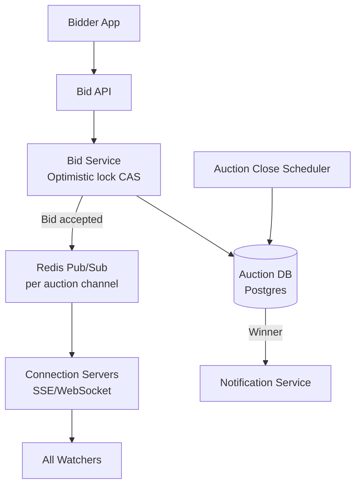

# Design an Auction System (eBay)

**Difficulty**: 🔴 Advanced
**Reading Time**: Coming Soon
**Interview Frequency**: Medium

---

> 🚧 **Full article coming soon.** This stub gives you the essentials to start thinking about this problem.

---

## The Core Problem

Accepting bids from 10,000 concurrent bidders in the final seconds of a popular auction — all trying to submit the highest bid simultaneously — requires strong consistency guarantees. A race condition that accepts two "winning" bids means charging two users for one item. The system must provide atomicity, fairness, and real-time bid broadcasting.

## Functional Requirements

- Sellers list items with starting bid, reserve price, and auction end time
- Bidders place bids (only higher than current highest accepted)
- Real-time bid updates broadcast to all auction watchers
- Auction closes at scheduled time; highest bid wins
- Support proxy bidding (auto-increment up to a max)

## Non-Functional Requirements

| Requirement | Target |
|-------------|--------|
| Consistency | Exactly one winner; no two winning bids |
| Bid processing latency | p99 < 500ms |
| Real-time broadcasting | < 1 second to all watchers |
| Scale | 10M concurrent auctions, 10K bids/sec per hot auction |

## Back-of-Envelope Estimates

- **Concurrent auctions**: 10M auctions × avg 0.1 bids/sec = 1M bids/sec average
- **Hot auction spike**: Single viral auction: 10,000 users × 1 bid in last 10 sec = 1,000 bids/sec on one record
- **Bid broadcasting**: 1,000 bids/sec × 50,000 watchers per auction = 50M push messages/sec at peak

## Key Design Decisions

1. **Optimistic Locking for Bid Acceptance** — read current_highest_bid + version; verify new_bid > current; CAS update (version + 1); if version changed, reject bid with "outbid" response; avoids full DB locks while ensuring exactly-one winner.
2. **Auction Close Atomicity** — use a scheduled job + distributed lock to mark auction as closed; once closed, bids are rejected; winner notification happens asynchronously after close to avoid holding lock during notification.
3. **Real-time Bid Broadcasting via SSE/WebSocket** — when a bid is accepted, publish to Redis channel per auction_id; all connection servers subscribed to that channel push updated highest bid to watchers; no need to poll.

## High-Level Architecture

## Top Interview Questions for This Problem

| Question | Tests |
|----------|-------|
| How do you handle 10,000 users submitting bids in the last 3 seconds of an auction? | Concurrency, optimistic locking |
| How do you implement proxy bidding (bid up to $500 automatically)? | Bid agent, incremental bidding |
| How do you prevent bid sniping (placing bid 1 second before close)? | Anti-sniping extensions, auction rules |

## Related Concepts

- [Hotel booking for similar concurrency/inventory patterns](./hotel-booking)
- [Distributed locking alternatives to optimistic locking](../05-infrastructure/distributed-locking)

---

*📚 Full deep-dive with multiple approaches, trade-off tables, and pseudocode coming soon.*
