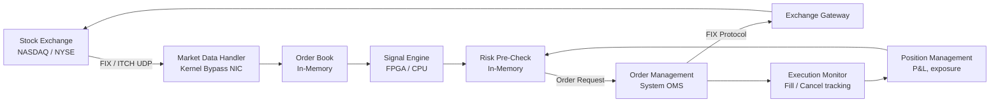
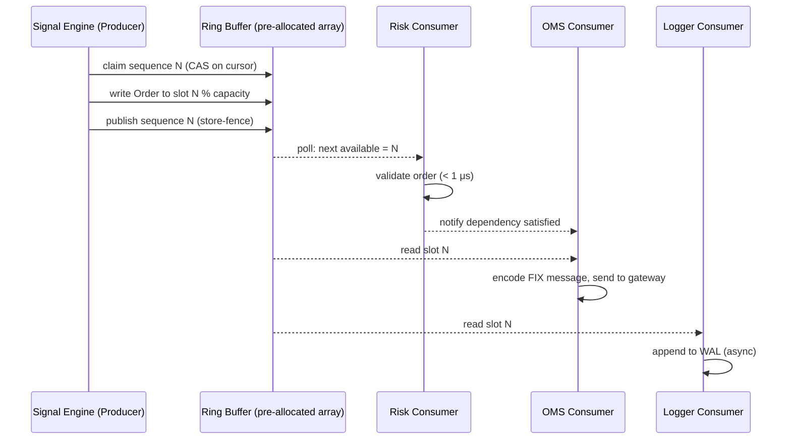
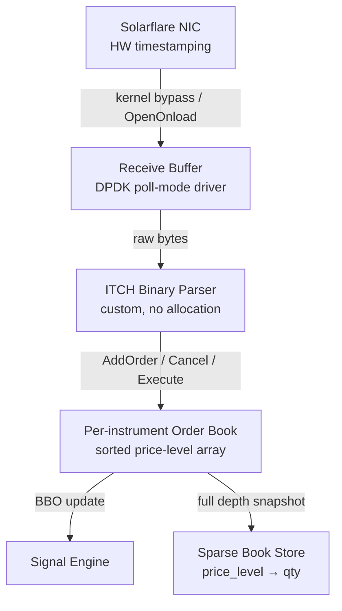

# Design an Automated Trading System

**Difficulty**: 🔴 Advanced
**Reading Time**: ~30 minutes
**The Core Problem**: A trading firm needs to receive market data, compute signals, and submit orders in microseconds — with risk controls that don't add latency. How do you build a system where each nanosecond of latency costs millions of dollars?

---

## Table of Contents

1. [Requirements](#1-requirements)
2. [Latency Budget](#2-latency-budget)
3. [High-Level Architecture](#3-high-level-architecture)
4. [Market Data Feed](#4-market-data-feed)
5. [Signal Engine](#5-signal-engine)
6. [Risk Pre-Check](#6-risk-pre-check)
7. [Order Management System (OMS)](#7-order-management-system-oms)
8. [Exchange Gateway](#8-exchange-gateway)
9. [Back-Testing Framework](#9-back-testing-framework)
10. [Key Design Decisions](#10-key-design-decisions)
11. [Interview Questions](#11-interview-questions)
12. [Key Takeaways](#12-key-takeaways)
13. [References](#13-references)

---

## 1. Requirements

### Functional
- Receive real-time market data (tick-by-tick price feeds)
- Compute trading signals based on strategy (momentum, mean reversion, arbitrage)
- Pre-trade risk checks (position limits, VaR, order rate limits)
- Submit orders to exchanges via FIX protocol
- Track order state (sent → acknowledged → filled/rejected)
- Back-test strategies against historical data

### Non-Functional
- **Latency (HFT)**: Market data receipt → order sent: < 10 microseconds
- **Latency (algorithmic)**: 100 microseconds – 10 milliseconds
- **Throughput**: 1M orders/day; 100k market data ticks/second
- **Reliability**: Zero data loss on orders; idempotent order submission

---

## 2. Latency Budget

```
Total target: 10 microseconds (HFT) / 1 millisecond (algorithmic)

Breakdown:
  Network (co-location, within same datacenter):  1–5 μs
  NIC → kernel bypass (DPDK/Solarflare):          1 μs
  Market data parsing (FIX/ITCH):                 1 μs
  Signal computation:                             1–10 μs
  Risk pre-check:                                 0.5 μs
  Order encoding (FIX):                           0.5 μs
  Network send to exchange:                       1–5 μs
  ─────────────────────────────────────────────────────
  Total:                                          6–23 μs
```

Co-location (placing servers in the exchange's data center) eliminates the 1–5ms internet RTT, reducing to microseconds.

---

## 3. High-Level Architecture



---

## 4. Market Data Feed

### Feed Types
```
Level 1 (NBBO):  Best bid/ask price and size — 1M msgs/sec from all US equities
Level 2 (Full):  All bids and asks at all price levels — 10M msgs/sec
Trade prints:    Completed trades — 500k msgs/sec

Protocols:
  ITCH (NASDAQ): Binary, UDP multicast — lowest latency
  OPRA (Options): UDP multicast, 40M msgs/sec peak
  FIX (order entry): TCP, bidirectional
```

### Kernel Bypass Networking
```
Standard path: NIC → kernel network stack → user space: ~10–100 μs
Kernel bypass:  NIC → DPDK/Solarflare → user space directly: ~1 μs

Kernel bypass libraries:
  - DPDK (Data Plane Development Kit): user-space network stack
  - Solarflare SolarCapture: hardware timestamping, < 1μs NIC-to-user
  - OpenOnload: zero-copy socket on Solarflare NIC
```

### Order Book Maintenance
```
In-memory order book per instrument:
  bids: sorted array descending by price
  asks: sorted array ascending by price

Structure (cache-friendly):
  struct PriceLevel {
    int64_t price;      // fixed-point: price * 100
    int64_t total_qty;
    int32_t order_count;
  };

Update: O(log N) binary search for price level, O(1) qty update
Best bid/ask: O(1) access (front of sorted array)
```

---

## 5. Signal Engine

### Software Implementation (< 100μs latency)
```cpp
// Momentum signal: buy if price > 20-period moving average
struct MomentumSignal {
    double ma_20;
    double prices[20];
    int idx = 0;

    Signal compute(double new_price) {
        prices[idx++ % 20] = new_price;
        ma_20 = std::accumulate(prices, prices+20, 0.0) / 20;
        if (new_price > ma_20 * 1.001)  return Signal::BUY;
        if (new_price < ma_20 * 0.999)  return Signal::SELL;
        return Signal::HOLD;
    }
};
```

### FPGA Signal Engine (< 1μs latency)
Used when competing against other HFT firms:
- Strategy compiled to hardware logic gates
- Market data parsed directly in silicon (no CPU instruction cycles)
- Latency: 100–500 nanoseconds for arbitrage signals
- Downsides: Expensive ($1M+ FPGA boards), inflexible (strategy changes require hardware reprogramming)

---

## 6. Risk Pre-Check

Risk checks happen **before** every order — must be fast (< 1μs).

### Pre-Trade Risk Checks (in-memory, no DB)
```
Check 1 — Position Limit:
  current_position + order_qty <= max_position_limit
  Data: in-memory position map, updated atomically on each fill

Check 2 — Order Rate Limit:
  orders_in_last_100ms < 1000  (exchange-imposed rate limit)
  Data: atomic counter with sliding window

Check 3 — Daily Loss Limit:
  daily_pnl > -$1M  (kill switch)
  Data: real-time P&L from position × mark price

Check 4 — Fat Finger Check:
  order_price within 10% of market price
  order_qty < 10% of daily average volume

If ANY check fails → order rejected, alert sent to risk desk
If ALL pass → order forwarded to OMS (no lock acquired — reads only)
```

### Post-Trade Risk (separate, slower path)
- VaR computation (Value at Risk) — runs every minute
- Stress tests (what if market drops 10%?) — runs every 5 minutes
- Correlation analysis — daily

---

## 7. Order Management System (OMS)

```
Order lifecycle:
  NEW → PENDING_NEW → ACKNOWLEDGED → PARTIALLY_FILLED → FILLED
                                    ↘ CANCELLED
                                    ↘ REJECTED

State stored in-memory (ring buffer, LMAX Disruptor pattern):
  struct Order {
    int64_t  order_id;      // monotonic
    int32_t  instrument_id;
    char     side;          // 'B' | 'S'
    int64_t  price;         // fixed-point
    int32_t  qty;
    int32_t  filled_qty;
    uint8_t  status;
    int64_t  timestamp_ns;
  };

LMAX Disruptor (lock-free ring buffer):
  - Producer: Signal engine writes order to ring buffer
  - Consumer 1: Risk checker reads, validates, passes or blocks
  - Consumer 2: OMS sends to exchange gateway
  - Consumer 3: Logger writes to persistent store
  - No locks — compare-and-swap on sequence numbers
  - Throughput: 6M messages/sec on single thread
```

---

## 8. Exchange Gateway

```
FIX Protocol (Financial Information eXchange):
  Standard messaging format for electronic trading
  Key message types:
    D = New Order Single
    F = Order Cancel Request
    8 = Execution Report (filled, rejected, etc.)

FIX Session Management:
  - TCP connection to exchange co-location switch
  - Heartbeat every 30s (maintain session)
  - Sequence numbers for each side (gap detection)
  - Automatic gap fill on reconnect

Order deduplication:
  - Each order has unique ClOrdID (client order ID)
  - OMS tracks sent ClOrdIDs in-memory
  - On reconnect: reconcile open orders with exchange via FIX 35=AF (Order Mass Status)
```

---

## 9. Back-Testing Framework

```
Back-test architecture:
  1. Load historical tick data from time-series DB (InfluxDB / KDB+)
  2. Replay ticks in chronological order at simulated speed (or 1000× realtime)
  3. Feed to identical signal engine + risk engine
  4. Simulate order fills: limit orders fill when market crosses price
  5. Record all orders, fills, P&L

Back-test vs Live discrepancies:
  - Slippage: real fills at worse prices than model assumes
  - Market impact: large orders move the market
  - Latency: model assumes instant fills; reality adds 1–10ms
  - Survivorship bias: historical data includes de-listed stocks

Tooling: Backtrader, Zipline (Python), or custom KDB+ queries
```

---

## 10. Key Design Decisions

| Decision | Option A | Option B | Choice & Reason |
|----------|----------|----------|-----------------|
| Signal computation | FPGA (sub-μs) | Software (100μs) | **Depends on strategy** — arbitrage needs FPGA; momentum strategies work fine with software |
| Co-location | Exchange data center | Cloud (AWS/GCP) | **Co-location** — cloud adds 1–5ms; co-location gets to microseconds |
| Risk checks | Pre-trade only | Pre-trade + post-trade | **Both** — pre-trade blocks bad orders; post-trade catches complex risk (VaR, correlation) |
| Order state | In-memory (Disruptor) | Database | **In-memory** — nanosecond latency required; DB is milliseconds |
| Market data parsing | Custom binary parser | Generic FIX parser | **Custom binary** — generic parsers add 5–10μs; custom ITCH parser < 1μs |

---

## 11. Interview Questions

| Question | Key Answer |
|----------|-----------|
| Why is co-location critical? | Eliminates 1–5ms internet RTT → reduces to < 10μs within exchange datacenter |
| How do you prevent accidental runaway orders? | Fat finger checks + daily loss limit kill switch + order rate limits |
| What's the LMAX Disruptor pattern? | Lock-free ring buffer where multiple consumers process the same sequence; avoids mutex contention |
| How do you back-test without look-ahead bias? | Replay ticks in order; signal engine never accesses future data; simulate fill at next tick price |
| What happens if exchange connection drops? | OMS marks orders as unknown; on reconnect, reconcile open orders via FIX mass status query |

---

## 12. Key Takeaways

- **Co-location + kernel bypass networking** reduces latency from milliseconds to microseconds — the primary competitive advantage
- **Pre-trade risk checks must be in-memory** (no DB, no lock) — sub-microsecond risk validation using atomic counters
- **LMAX Disruptor** (lock-free ring buffer) achieves 6M+ messages/second with single-digit microsecond latency
- **FIX protocol sequence numbers** enable gap detection and idempotent order submission on reconnect
- **Back-testing requires tick-level replay** — bar-level simulation misses intraday dynamics and slippage

---

## Component Deep Dive 1: LMAX Disruptor — The Lock-Free Order Pipeline

The LMAX Disruptor is the most critical architectural component in a high-frequency trading system. It is a lock-free, single-producer/multi-consumer ring buffer that replaces traditional queue implementations and achieves 6 million+ messages per second with single-digit microsecond latency.

### Why Naive Approaches Fail at Scale

Traditional queue-based pipelines use blocking queues backed by a mutex or a ConcurrentLinkedQueue backed on CAS-based linked-list nodes. At 100k orders/second, this is fine. At 6M+/second the problems compound:

1. **Mutex contention**: Every enqueue/dequeue acquires a lock. Under high contention, threads spin-wait or context-switch. A context switch costs 1–10 μs — larger than the total latency budget.
2. **False sharing**: Independent variables land on the same 64-byte CPU cache line. When thread A writes `head` and thread B reads `tail`, the cache line bounces between cores via the coherence protocol even though neither accesses the other's data.
3. **GC pressure (JVM)**: Linked-list queues allocate a node object per message. At 6M msg/sec, that is 6M allocations/sec, guaranteeing stop-the-world pauses that destroy latency SLAs.

### How the Disruptor Works Internally

The Disruptor pre-allocates a fixed-size array (ring buffer) of event objects. Producers claim a sequence number (a monotonic long) via a single CAS. Consumers each maintain their own sequence cursor and read entries without acquiring any lock. Consumers can be arranged in dependency chains — a risk consumer must complete before the OMS consumer reads the same slot.



Padding is added around each sequence counter to occupy a full 64-byte cache line, eliminating false sharing. The ring buffer itself has a power-of-two size so that `index = sequence & (capacity - 1)` is a single bitwise AND rather than a modulo.

### Trade-off Table: Ring Buffer vs Alternatives

| Approach | Latency (P99) | Throughput | Trade-off |
|----------|---------------|------------|-----------|
| LMAX Disruptor (lock-free ring buffer) | < 1 μs | 6M+ msg/sec | Pre-allocated memory, no GC pressure; fixed capacity — back-pressure must be handled explicitly |
| java.util.concurrent.ArrayBlockingQueue | 10–50 μs | ~1M msg/sec | Simple API; mutex + condition variable add contention overhead |
| Aeron (low-latency messaging) | 100 ns–1 μs | 40M+ msg/sec | Best-in-class, but requires dedicated network infrastructure; more complex ops |

---

## Component Deep Dive 2: Market Data Feed Handler

The Market Data Feed Handler is the entry point of all latency in the system. It is responsible for receiving raw UDP multicast packets from the exchange, parsing binary market data protocols (ITCH, OPRA), maintaining in-memory order books, and delivering processed ticks to downstream signal engines — all within the 1–2 μs budget.

### Internal Mechanics

NASDAQ's ITCH 5.0 protocol sends binary UDP multicast packets. Each packet is fixed-length and self-describing. A packet for an Add Order message (type 'A') is 36 bytes. The parser reads a raw byte buffer with zero-copy: no heap allocation, no string parsing.



A kernel bypass NIC (Solarflare XtremeScale or Mellanox ConnectX) receives packets directly into user-space memory via DMA, skipping the kernel TCP/IP stack entirely. This saves 10–100 μs of kernel overhead. The poll-mode driver busy-polls the NIC receive ring continuously rather than relying on interrupts, reducing interrupt latency jitter.

### Behavior at 10× Load

NASDAQ equities peak is ~10M ITCH messages/second. Options (OPRA) peak at 40M messages/second. At 10× the baseline of 4M msg/sec:

- Single-core parser saturates at ~15M msg/sec (per-message cost ~70 ns on modern Xeon)
- Solution: instrument sharding — each CPU core handles a subset of instrument symbols
- Memory bandwidth becomes the next bottleneck: 40M × 36 bytes = 1.44 GB/sec (within DDR4's 50 GB/sec limit, but L3 cache pressure rises)
- Network bandwidth: 40M × 36 bytes = 1.44 Gbps — requires 10 GbE or 25 GbE NIC

### Trade-off: Order Book Update Strategy

| Strategy | Latency to Update BBO | Memory | Trade-off |
|----------|----------------------|--------|-----------|
| Sorted array (binary search) | O(log N) insert, O(1) read | Low, cache-friendly | Best for BBO access; rebalancing on insert is cache-hostile for deep books |
| Skip list | O(log N) insert + read | Medium | Probabilistic balance; more pointer chasing, poor cache locality |
| Hash map (price → qty) | O(1) insert/update, O(N) BBO scan | Medium | Fast updates; BBO scan is O(N) — unacceptable for hot path |

For HFT, a sorted array with 64-byte-aligned PriceLevel structs and an L1 cache-resident best-bid/best-ask pointer is the dominant approach.

---

## Component Deep Dive 3: Pre-Trade Risk Engine

The pre-trade risk engine runs between the signal decision and the exchange gateway. Every single order must pass through it. Its budget is under 500 nanoseconds. It cannot consult a database, cannot acquire a lock, and cannot allocate memory.

### Technical Decisions

All risk state is held in a contiguous in-memory structure laid out to fit in L1/L2 cache (~32 KB / 256 KB). The risk engine is a pure read path — it reads atomic counters and compares against pre-loaded configuration thresholds.

**Position limits** are maintained as an `int64_t` array indexed by instrument ID. When a fill arrives from the exchange gateway, the position is updated via `std::atomic::fetch_add`. The risk engine reads the current position and speculatively adds the proposed order quantity. If the result exceeds the configured limit, the order is rejected without writing anything.

**Rate limiting** uses a fixed-size sliding window counter. A circular array of 100 slots (each representing 1 ms) tracks order counts. The current slot is determined by `now_ms % 100`. A background thread (running every 100 ms) zeroes expired slots. The risk engine reads the sum in O(100) = O(1) constant time.

**Kill switch (daily loss limit)** is a 64-bit signed integer representing P&L in cents. The execution monitor updates it atomically on each fill. If the value falls below `-$1M` (i.e., -100,000,000 cents), a hardware memory barrier ensures the risk engine reads the updated value before processing the next order. No lock is needed — a simple atomic load with acquire semantics is sufficient.

The entire risk check path is branch-prediction-friendly: four comparisons, all expected to pass (the common case). Modern CPUs predict "branch taken" with > 99.9% accuracy in the normal trading path, reducing branch misprediction penalty to negligible.

---

## Data Model

### Order State (In-Memory, Ring Buffer Slot)

```sql
-- Persistent order log (written async, not on hot path)
CREATE TABLE orders (
    order_id        BIGINT          PRIMARY KEY,     -- monotonic sequence
    client_order_id VARCHAR(64)     NOT NULL UNIQUE, -- ClOrdID for FIX dedup
    instrument_id   INT             NOT NULL,        -- internal symbol ID
    exchange_code   CHAR(4)         NOT NULL,        -- XNAS, XNYS, etc.
    side            CHAR(1)         NOT NULL,        -- 'B' or 'S'
    order_type      CHAR(1)         NOT NULL,        -- 'L' (limit) 'M' (market)
    price           BIGINT          NOT NULL,        -- fixed-point, × 10000
    qty             INT             NOT NULL,
    filled_qty      INT             NOT NULL DEFAULT 0,
    avg_fill_price  BIGINT          NOT NULL DEFAULT 0,
    status          SMALLINT        NOT NULL,        -- 0=NEW 1=PENDING 2=ACK 3=PART 4=FILLED 5=CANCELED 6=REJECTED
    strategy_id     INT             NOT NULL,
    created_at_ns   BIGINT          NOT NULL,        -- nanosecond epoch
    acked_at_ns     BIGINT,
    filled_at_ns    BIGINT
);

CREATE INDEX idx_orders_instrument ON orders(instrument_id, created_at_ns DESC);
CREATE INDEX idx_orders_client     ON orders(client_order_id);

-- Position ledger (updated on each fill)
CREATE TABLE positions (
    instrument_id   INT             NOT NULL,
    strategy_id     INT             NOT NULL,
    net_qty         BIGINT          NOT NULL DEFAULT 0,  -- positive = long
    avg_cost        BIGINT          NOT NULL DEFAULT 0,  -- fixed-point
    realized_pnl    BIGINT          NOT NULL DEFAULT 0,  -- cents
    unrealized_pnl  BIGINT          NOT NULL DEFAULT 0,
    updated_at_ns   BIGINT          NOT NULL,
    PRIMARY KEY (instrument_id, strategy_id)
);

-- Market data tick store (time-series, append-only)
CREATE TABLE ticks (
    instrument_id   INT             NOT NULL,
    exchange_ts_ns  BIGINT          NOT NULL,           -- exchange timestamp
    recv_ts_ns      BIGINT          NOT NULL,           -- local receive timestamp
    bid_price       BIGINT          NOT NULL,
    bid_size        INT             NOT NULL,
    ask_price       BIGINT          NOT NULL,
    ask_size        INT             NOT NULL,
    last_price      BIGINT,
    last_size       INT
) PARTITION BY RANGE (exchange_ts_ns);
-- One partition per trading day; KDB+ or InfluxDB preferred over Postgres for this table
```

### In-Memory Hot Structures (C++ pseudocode)

```cpp
// Pre-allocated, cache-line-padded risk state (fits in 32 KB L1 cache)
struct alignas(64) RiskState {
    std::atomic<int64_t> position[MAX_INSTRUMENTS];   // net shares per instrument
    std::atomic<int64_t> daily_pnl_cents;             // kill switch
    std::atomic<int32_t> orders_in_window[100];       // rate limiter: 100ms slots
    int64_t              max_position[MAX_INSTRUMENTS]; // config, read-only
    int64_t              max_daily_loss_cents;          // config, read-only
};

// Ring buffer slot (64-byte aligned, one per Disruptor entry)
struct alignas(64) OrderEvent {
    int64_t  sequence;
    int64_t  order_id;
    int32_t  instrument_id;
    int32_t  strategy_id;
    int64_t  price;          // fixed-point × 10000
    int32_t  qty;
    int8_t   side;           // 'B' | 'S'
    int8_t   order_type;     // 'L' | 'M'
    int8_t   status;
    uint8_t  _pad[21];       // pad to 64 bytes
};
```

---

## Scale Bottlenecks

| Traffic Level | Component That Breaks | Symptoms | Mitigation |
|---------------|----------------------|----------|------------|
| 10× baseline (1M msg/sec) | Single-core ITCH parser | Parser CPU hits 100%; ticks dropped from UDP receive buffer | Shard instruments across CPU cores; each core handles a symbol range |
| 10× baseline | Disruptor ring buffer back-pressure | Producers spin-wait claiming sequence; P99 latency spikes to 50 μs | Increase ring buffer size (2M entries); add back-pressure signal to signal engine |
| 100× baseline (10M msg/sec) | Network bandwidth (1 GbE NIC) | Packet loss at NIC before kernel bypass layer | Upgrade to 25 GbE or 100 GbE NIC; request dedicated multicast feed from exchange |
| 100× baseline | Order book memory bandwidth | L3 cache miss rate rises; book update latency increases 5–10× | Restrict full-depth book to top 10 price levels in hot path; deep book computed async |
| 1000× baseline (100M msg/sec) | Colocation switch port saturation | Microsecond queuing delay introduced by switch buffers | FPGA-based market data parsing directly on NIC (SmartNIC); eliminates CPU entirely for MD path |
| 1000× baseline | Risk engine position counter contention | `fetch_add` on shared `position[]` creates memory-bus contention across cores | Partition position state by strategy ID; each strategy thread owns its own position counters |

---

## How Jane Street Built This

Jane Street is one of the world's most prominent proprietary trading firms, responsible for roughly 5% of US equity trading volume (approximately 200M shares/day as of 2023). Unlike most HFT firms that use C++ with custom allocators and FPGA offloads, Jane Street built their entire trading infrastructure in **OCaml** — a functional language with a natively compiled garbage collector that achieves pause times under 1 ms.

**Technology choices:**
- **OCaml for the hot path**: Jane Street's Core library provides efficient, allocation-minimizing data structures. OCaml's GC is generational and uses minor heaps (~256 KB) that collect in < 100 μs. For strategies with a 1 ms latency target (statistical arbitrage, not nanosecond HFT), this is acceptable.
- **FIX and proprietary binary gateways**: Jane Street maintains direct FIX connections to 100+ venues globally, plus proprietary binary connections to dark pools. Each gateway is a separately managed OCaml process to isolate faults.
- **Cross-venue risk**: The position management system aggregates exposure across all venues in real time. A central risk daemon (a Unix domain socket server) answers position queries from all strategy processes with a typical latency of 20–50 μs — within acceptable budget for strategies running on > 100 μs cycles.
- **Scale**: Jane Street processes approximately 5 billion market data messages per trading day. Their tick store uses a custom columnar binary format stored on local NVMe SSDs, allowing back-testing to replay at 500× real-time speed.
- **Non-obvious decision**: Jane Street chose OCaml's **immutable data structures** for order book representation. Rather than mutating a shared order book in place (which requires locking), each book update produces a new persistent tree node (path-copying). This allows multiple strategy threads to read a consistent snapshot of the order book at different logical times without any locking — a technique borrowed from functional programming that eliminated an entire class of race conditions.

Source: Jane Street Tech Blog — "Why OCaml?" (janestreet.com/technology), and "How Jane Street sees the market" (Bloomberg, 2019).

---

## Interview Angle

**What the interviewer is testing:** Deep understanding of the latency hierarchy (nanoseconds vs microseconds vs milliseconds) and the ability to identify which standard distributed systems patterns (databases, message brokers, distributed locks) are completely incompatible with the trading hot path.

**Common mistakes candidates make:**

1. **Proposing a relational database for order state.** Candidates who default to "store orders in PostgreSQL" miss that even a local DB round-trip is 1–5 ms — two orders of magnitude above the 10 μs budget. In-memory ring buffers with async durability to a WAL are the correct pattern.

2. **Using a distributed message broker (Kafka, RabbitMQ) on the hot path.** Kafka's minimum producer latency is 1–5 ms. Candidates propose it for order routing between components without realizing this instantly violates every HFT latency SLA. Kafka is appropriate only for post-trade analytics and audit log ingestion.

3. **Conflating pre-trade and post-trade risk.** Candidates put VaR computation, correlation analysis, and stress testing in the same path as the fat-finger check. VaR requires a Monte Carlo simulation over thousands of scenarios — it runs every minute on a separate risk server, not inline with every order.

**The insight that separates good from great answers:** Understanding that **the fastest code is code that doesn't run at all.** Every component in the hot path (market data handler → signal engine → risk engine → order encoder) is designed to be branch-predictable, allocation-free, and lock-free. The key architectural decision is pushing all slow operations (VaR, journaling, position aggregation) off the hot path onto asynchronous consumers that read the same Disruptor ring buffer after the order has already been sent to the exchange.

---

## Key Numbers to Remember

| Metric | Value | Context |
|--------|-------|---------|
| End-to-end HFT latency target | 10 μs | Market data receipt → order wire-out at co-location |
| LMAX Disruptor throughput | 6M messages/sec | Single thread, lock-free ring buffer on modern Xeon |
| Kernel bypass NIC savings | 10–100 μs | vs standard Linux kernel network stack |
| FPGA signal latency | 100–500 ns | vs 1–10 μs for software on CPU |
| NASDAQ ITCH peak rate | 10M messages/sec | US equities; OPRA options peak is 40M messages/sec |
| Co-location RTT to exchange | 1–5 μs | Within same datacenter; vs 1–5 ms over internet |
| Pre-trade risk check budget | < 500 ns | All 4 checks combined; no locks, no DB |
| FIX heartbeat interval | 30 seconds | Session keepalive; gap detection triggers on missed sequence |
| Jane Street daily volume | ~200M shares/day | ~5% of total US equity volume |
| Back-test replay speed | 500× real-time | With custom columnar tick store on NVMe SSD |

---

## 📚 Resources & References

| Resource | Type | What You'll Learn |
|----------|------|------------------|
| [LMAX Architecture — Martin Fowler](https://martinfowler.com/articles/lmax.html) | 📖 Blog | Disruptor pattern, lock-free ring buffer design |
| [High Frequency Trading — Irene Aldridge](https://www.wiley.com/en-us/High+Frequency+Trading%2C+2nd+Edition-p-9781118343500) | 📚 Book | HFT strategies, infrastructure, and market microstructure |
| [ByteByteGo — Stock Exchange System Design](https://www.youtube.com/@ByteByteGo) | 📺 YouTube | Order matching engine and exchange architecture |
| [DPDK Performance Optimization](https://www.dpdk.org/doc/guides/prog_guide/) | 📚 Book | Kernel bypass networking for ultra-low latency |
