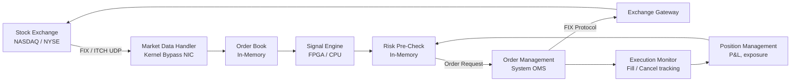

# Design an Automated Trading System

**Difficulty**: 🔴 Advanced
**Reading Time**: ~30 minutes
**The Core Problem**: A trading firm needs to receive market data, compute signals, and submit orders in microseconds — with risk controls that don't add latency. How do you build a system where each nanosecond of latency costs millions of dollars?

---

## Table of Contents

1. [Requirements](#1-requirements)
2. [Latency Budget](#2-latency-budget)
3. [High-Level Architecture](#3-high-level-architecture)
4. [Market Data Feed](#4-market-data-feed)
5. [Signal Engine](#5-signal-engine)
6. [Risk Pre-Check](#6-risk-pre-check)
7. [Order Management System (OMS)](#7-order-management-system-oms)
8. [Exchange Gateway](#8-exchange-gateway)
9. [Back-Testing Framework](#9-back-testing-framework)
10. [Key Design Decisions](#10-key-design-decisions)
11. [Interview Questions](#11-interview-questions)
12. [Key Takeaways](#12-key-takeaways)
13. [References](#13-references)

---

## 1. Requirements

### Functional
- Receive real-time market data (tick-by-tick price feeds)
- Compute trading signals based on strategy (momentum, mean reversion, arbitrage)
- Pre-trade risk checks (position limits, VaR, order rate limits)
- Submit orders to exchanges via FIX protocol
- Track order state (sent → acknowledged → filled/rejected)
- Back-test strategies against historical data

### Non-Functional
- **Latency (HFT)**: Market data receipt → order sent: < 10 microseconds
- **Latency (algorithmic)**: 100 microseconds – 10 milliseconds
- **Throughput**: 1M orders/day; 100k market data ticks/second
- **Reliability**: Zero data loss on orders; idempotent order submission

---

## 2. Latency Budget

```
Total target: 10 microseconds (HFT) / 1 millisecond (algorithmic)

Breakdown:
  Network (co-location, within same datacenter):  1–5 μs
  NIC → kernel bypass (DPDK/Solarflare):          1 μs
  Market data parsing (FIX/ITCH):                 1 μs
  Signal computation:                             1–10 μs
  Risk pre-check:                                 0.5 μs
  Order encoding (FIX):                           0.5 μs
  Network send to exchange:                       1–5 μs
  ─────────────────────────────────────────────────────
  Total:                                          6–23 μs
```

Co-location (placing servers in the exchange's data center) eliminates the 1–5ms internet RTT, reducing to microseconds.

---

## 3. High-Level Architecture



---

## 4. Market Data Feed

### Feed Types
```
Level 1 (NBBO):  Best bid/ask price and size — 1M msgs/sec from all US equities
Level 2 (Full):  All bids and asks at all price levels — 10M msgs/sec
Trade prints:    Completed trades — 500k msgs/sec

Protocols:
  ITCH (NASDAQ): Binary, UDP multicast — lowest latency
  OPRA (Options): UDP multicast, 40M msgs/sec peak
  FIX (order entry): TCP, bidirectional
```

### Kernel Bypass Networking
```
Standard path: NIC → kernel network stack → user space: ~10–100 μs
Kernel bypass:  NIC → DPDK/Solarflare → user space directly: ~1 μs

Kernel bypass libraries:
  - DPDK (Data Plane Development Kit): user-space network stack
  - Solarflare SolarCapture: hardware timestamping, < 1μs NIC-to-user
  - OpenOnload: zero-copy socket on Solarflare NIC
```

### Order Book Maintenance
```
In-memory order book per instrument:
  bids: sorted array descending by price
  asks: sorted array ascending by price

Structure (cache-friendly):
  struct PriceLevel {
    int64_t price;      // fixed-point: price * 100
    int64_t total_qty;
    int32_t order_count;
  };

Update: O(log N) binary search for price level, O(1) qty update
Best bid/ask: O(1) access (front of sorted array)
```

---

## 5. Signal Engine

### Software Implementation (< 100μs latency)
```cpp
// Momentum signal: buy if price > 20-period moving average
struct MomentumSignal {
    double ma_20;
    double prices[20];
    int idx = 0;

    Signal compute(double new_price) {
        prices[idx++ % 20] = new_price;
        ma_20 = std::accumulate(prices, prices+20, 0.0) / 20;
        if (new_price > ma_20 * 1.001)  return Signal::BUY;
        if (new_price < ma_20 * 0.999)  return Signal::SELL;
        return Signal::HOLD;
    }
};
```

### FPGA Signal Engine (< 1μs latency)
Used when competing against other HFT firms:
- Strategy compiled to hardware logic gates
- Market data parsed directly in silicon (no CPU instruction cycles)
- Latency: 100–500 nanoseconds for arbitrage signals
- Downsides: Expensive ($1M+ FPGA boards), inflexible (strategy changes require hardware reprogramming)

---

## 6. Risk Pre-Check

Risk checks happen **before** every order — must be fast (< 1μs).

### Pre-Trade Risk Checks (in-memory, no DB)
```
Check 1 — Position Limit:
  current_position + order_qty <= max_position_limit
  Data: in-memory position map, updated atomically on each fill

Check 2 — Order Rate Limit:
  orders_in_last_100ms < 1000  (exchange-imposed rate limit)
  Data: atomic counter with sliding window

Check 3 — Daily Loss Limit:
  daily_pnl > -$1M  (kill switch)
  Data: real-time P&L from position × mark price

Check 4 — Fat Finger Check:
  order_price within 10% of market price
  order_qty < 10% of daily average volume

If ANY check fails → order rejected, alert sent to risk desk
If ALL pass → order forwarded to OMS (no lock acquired — reads only)
```

### Post-Trade Risk (separate, slower path)
- VaR computation (Value at Risk) — runs every minute
- Stress tests (what if market drops 10%?) — runs every 5 minutes
- Correlation analysis — daily

---

## 7. Order Management System (OMS)

```
Order lifecycle:
  NEW → PENDING_NEW → ACKNOWLEDGED → PARTIALLY_FILLED → FILLED
                                    ↘ CANCELLED
                                    ↘ REJECTED

State stored in-memory (ring buffer, LMAX Disruptor pattern):
  struct Order {
    int64_t  order_id;      // monotonic
    int32_t  instrument_id;
    char     side;          // 'B' | 'S'
    int64_t  price;         // fixed-point
    int32_t  qty;
    int32_t  filled_qty;
    uint8_t  status;
    int64_t  timestamp_ns;
  };

LMAX Disruptor (lock-free ring buffer):
  - Producer: Signal engine writes order to ring buffer
  - Consumer 1: Risk checker reads, validates, passes or blocks
  - Consumer 2: OMS sends to exchange gateway
  - Consumer 3: Logger writes to persistent store
  - No locks — compare-and-swap on sequence numbers
  - Throughput: 6M messages/sec on single thread
```

---

## 8. Exchange Gateway

```
FIX Protocol (Financial Information eXchange):
  Standard messaging format for electronic trading
  Key message types:
    D = New Order Single
    F = Order Cancel Request
    8 = Execution Report (filled, rejected, etc.)

FIX Session Management:
  - TCP connection to exchange co-location switch
  - Heartbeat every 30s (maintain session)
  - Sequence numbers for each side (gap detection)
  - Automatic gap fill on reconnect

Order deduplication:
  - Each order has unique ClOrdID (client order ID)
  - OMS tracks sent ClOrdIDs in-memory
  - On reconnect: reconcile open orders with exchange via FIX 35=AF (Order Mass Status)
```

---

## 9. Back-Testing Framework

```
Back-test architecture:
  1. Load historical tick data from time-series DB (InfluxDB / KDB+)
  2. Replay ticks in chronological order at simulated speed (or 1000× realtime)
  3. Feed to identical signal engine + risk engine
  4. Simulate order fills: limit orders fill when market crosses price
  5. Record all orders, fills, P&L

Back-test vs Live discrepancies:
  - Slippage: real fills at worse prices than model assumes
  - Market impact: large orders move the market
  - Latency: model assumes instant fills; reality adds 1–10ms
  - Survivorship bias: historical data includes de-listed stocks

Tooling: Backtrader, Zipline (Python), or custom KDB+ queries
```

---

## 10. Key Design Decisions

| Decision | Option A | Option B | Choice & Reason |
|----------|----------|----------|-----------------|
| Signal computation | FPGA (sub-μs) | Software (100μs) | **Depends on strategy** — arbitrage needs FPGA; momentum strategies work fine with software |
| Co-location | Exchange data center | Cloud (AWS/GCP) | **Co-location** — cloud adds 1–5ms; co-location gets to microseconds |
| Risk checks | Pre-trade only | Pre-trade + post-trade | **Both** — pre-trade blocks bad orders; post-trade catches complex risk (VaR, correlation) |
| Order state | In-memory (Disruptor) | Database | **In-memory** — nanosecond latency required; DB is milliseconds |
| Market data parsing | Custom binary parser | Generic FIX parser | **Custom binary** — generic parsers add 5–10μs; custom ITCH parser < 1μs |

---

## 11. Interview Questions

| Question | Key Answer |
|----------|-----------|
| Why is co-location critical? | Eliminates 1–5ms internet RTT → reduces to < 10μs within exchange datacenter |
| How do you prevent accidental runaway orders? | Fat finger checks + daily loss limit kill switch + order rate limits |
| What's the LMAX Disruptor pattern? | Lock-free ring buffer where multiple consumers process the same sequence; avoids mutex contention |
| How do you back-test without look-ahead bias? | Replay ticks in order; signal engine never accesses future data; simulate fill at next tick price |
| What happens if exchange connection drops? | OMS marks orders as unknown; on reconnect, reconcile open orders via FIX mass status query |

---

## 12. Key Takeaways

- **Co-location + kernel bypass networking** reduces latency from milliseconds to microseconds — the primary competitive advantage
- **Pre-trade risk checks must be in-memory** (no DB, no lock) — sub-microsecond risk validation using atomic counters
- **LMAX Disruptor** (lock-free ring buffer) achieves 6M+ messages/second with single-digit microsecond latency
- **FIX protocol sequence numbers** enable gap detection and idempotent order submission on reconnect
- **Back-testing requires tick-level replay** — bar-level simulation misses intraday dynamics and slippage

---

## 📚 Resources & References

| Resource | Type | What You'll Learn |
|----------|------|------------------|
| [LMAX Architecture — Martin Fowler](https://martinfowler.com/articles/lmax.html) | 📖 Blog | Disruptor pattern, lock-free ring buffer design |
| [High Frequency Trading — Irene Aldridge](https://www.wiley.com/en-us/High+Frequency+Trading%2C+2nd+Edition-p-9781118343500) | 📚 Book | HFT strategies, infrastructure, and market microstructure |
| [ByteByteGo — Stock Exchange System Design](https://www.youtube.com/@ByteByteGo) | 📺 YouTube | Order matching engine and exchange architecture |
| [DPDK Performance Optimization](https://www.dpdk.org/doc/guides/prog_guide/) | 📚 Book | Kernel bypass networking for ultra-low latency |
