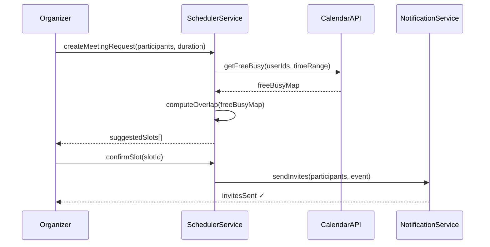
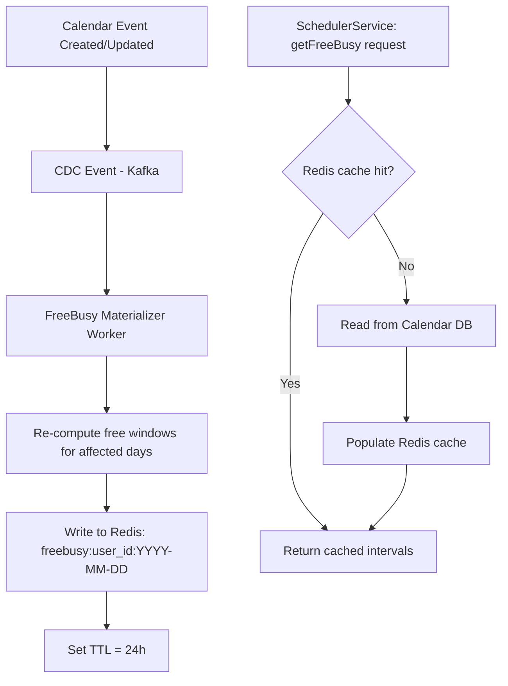
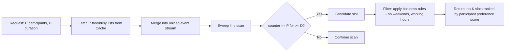
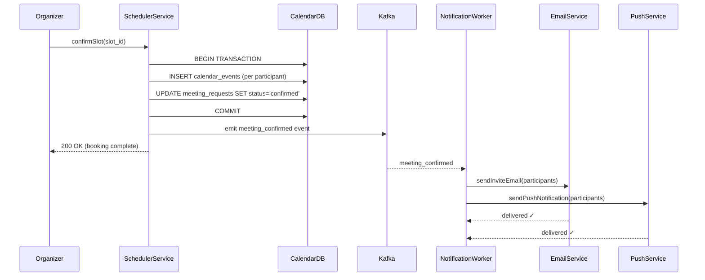

# Design a Collaborative Meeting Scheduler

**Difficulty**: 🟡 Intermediate
**Reading Time**: ~20 minutes
**Interview Frequency**: Medium — appears in scheduling and calendar-focused interviews

> 📖 This problem focuses on the **multi-participant scheduling** dimension. For a full treatment of calendar systems, see the [Meeting Calendar System Design](./meeting-calendar) article which covers time zones, recurring events, and storage architecture in depth.

---

## The Core Problem

Finding a time that works for **multiple people** across time zones, checking their calendar availability without exposing private events, and sending coordinated invites — all at 100M user scale.

The Calendly problem: participant A wants to schedule with participants B, C, and D. Each has varying availability windows, time-zone offsets, and conflict constraints. The scheduler must:

1. Collect available windows from each participant
2. Find overlapping slots that satisfy all constraints
3. Let the organizer choose and send invites
4. Handle updates when someone reschedules

---

## Key Design Decisions

### 1. Availability Representation

Store availability as **free/busy windows**, not full calendar events (privacy).

```
User A: free Mon 10-12, Tue 14-16 (UTC)
User B: free Mon 09-11, Tue 13-17 (UTC)
Overlap: Mon 10-11 UTC ✓
```

### 2. Overlap Computation

Sorted interval merge (sweep line algorithm):

```
function findOverlap(slots_A, slots_B):
    result = []
    i, j = 0, 0
    while i < len(slots_A) and j < len(slots_B):
        start = max(slots_A[i].start, slots_B[j].start)
        end   = min(slots_A[i].end,   slots_B[j].end)
        if start < end:
            result.append(Slot(start, end))
        if slots_A[i].end < slots_B[j].end:
            i++ else j++
    return result
```

Time: O(n log n) for n participants with m slots each.

### 3. Time Zone Handling

Store all times in **UTC internally**. Convert to local timezone only at display time using IANA timezone database.

---

## Architecture



---

## Capacity Estimates

- 100M users × 3 meetings/day avg = 300M scheduling events/day
- Peak: Monday 9 AM → 50k concurrent meeting requests
- Availability query: per-user free/busy lookup ~5ms (Redis cache)
- Overlap computation: O(n×m) where n=participants, m=slots per person

---

## Interview Questions

| Question | What It Tests |
|----------|--------------|
| How do you handle a participant who updates their availability after the organizer confirms? | Concurrency, notification design |
| How do you scale free/busy lookup for 50k concurrent requests? | Caching, read optimization |
| How do you support polls ("pick your preferred time") vs automatic scheduling? | UX flexibility vs automation |

---

## Component Deep Dive 1: Free/Busy Cache Layer

The free/busy cache is the most performance-critical component in a collaborative scheduler. At 100M users with 50k concurrent scheduling requests during Monday morning peak, you cannot afford a database round-trip for every participant's availability lookup. A naive approach — querying the calendar events table for each user on every scheduling request — fails at scale for three reasons:

1. **Fan-out amplification**: A meeting request for 10 participants triggers 10 separate database reads. At 50k concurrent requests that becomes 500k DB queries/second, well beyond what a single Postgres cluster handles comfortably (practical ceiling: ~100k simple queries/sec on high-end hardware).
2. **Privacy leakage risk**: Querying raw calendar events exposes event titles and attendees. The free/busy abstraction is a security boundary, not just a performance optimization.
3. **Cross-calendar federation**: Enterprise users link Google Calendar, Outlook, and internal tools. Each integration has rate limits. Google Calendar API enforces 1M queries/day per project by default. Polling each integration in real-time during a scheduling request will hit those limits within hours at scale.

The correct approach is a **pre-materialized free/busy cache** in Redis, updated asynchronously via change-data-capture events from each calendar source.

### Internal Mechanics

Each user's free/busy data is stored as a sorted set of UTC time intervals, serialized as a compact binary representation (start_epoch_seconds:end_epoch_seconds pairs). The key structure is `freebusy:{user_id}:{YYYY-MM-DD}`, allowing per-day eviction and efficient range queries.

When a user creates, updates, or deletes a calendar event, a CDC pipeline (Debezium on Postgres or Kafka Connect for external calendars) publishes a `calendar_event_changed` message. A free/busy materialization worker consumes this message, re-computes the affected user's free/busy windows for the impacted day(s), and writes the result to Redis with a 24-hour TTL.

On cache miss, the scheduler falls back to a read-through query against the canonical calendar store, then populates the cache. Miss rate should stay below 2% in steady state (most users have recent calendar activity that triggers materialization).



### Trade-off Table: Cache Strategy Options

| Approach | Read Latency | Write Latency | Staleness | Complexity |
|----------|-------------|---------------|-----------|------------|
| No cache (DB direct) | 20-50ms per user | 0ms additional | 0ms (always fresh) | Low — fails above 10k RPS |
| Read-through cache (lazy) | 2ms hit / 40ms miss | 0ms additional | Up to TTL (minutes) | Medium — acceptable for most |
| Pre-materialized (CDC-driven) | 1-2ms always | ~200ms pipeline lag | 200ms-2s | High — best at 50k+ RPS |
| Write-through cache | 2ms read | +5ms per write | Near-zero | Medium — doubles write load |

At 50k concurrent requests the pre-materialized approach is the only viable option. The 200ms pipeline lag is acceptable since scheduling typically looks at a future time range, not the current moment.

---

## Component Deep Dive 2: Overlap Computation Engine

The overlap computation engine receives N lists of free windows (one per participant) and finds the intersection — time slots where all participants are available for the requested duration.

### Internal Mechanics

The naive implementation is a nested loop: for each pair of participants, find overlapping intervals. Time complexity is O(P² × M) where P is participant count and M is average free windows per participant per day. For P=10 and M=20, that's 2,000 comparisons per scheduling request — fine for small groups, but at 50k concurrent requests it becomes 100M comparisons/second.

The optimized approach uses a **sweep line algorithm**:

1. Convert all free windows from all participants into events: `(timestamp, +1)` for start, `(timestamp, -1)` for end.
2. Sort all events by timestamp. O(P×M × log(P×M)).
3. Scan the sorted list. Track a counter: increment on start, decrement on end.
4. Any contiguous range where counter == P (all participants are free) and length >= requested duration is a valid slot.

Time complexity: O(P×M × log(P×M)). For P=10, M=20 that is O(200 × log(200)) ≈ O(1,500) operations per request — 130x faster than the naive approach.

### Scale Behavior at 10x Load

At 10x load (500k concurrent requests), the bottleneck shifts from computation to memory bandwidth. Each request holds P×M interval objects in memory for the duration of the computation. With P=10, M=20, and 64-byte interval objects, that is 12,800 bytes per request. At 500k concurrent requests the working set is 6.4GB. This fits in memory on modern hardware, but the garbage collection pressure becomes significant in JVM-based implementations.

Mitigation: use a compact integer array representation (start and end as int32 epoch-seconds) instead of object arrays. This reduces per-request memory to 1,600 bytes and GC pressure by 8x.

### Participant Count Scaling



| Participant Count | Sweep Line Time | Memory per Request | Max Concurrent (16GB node) |
|------------------|----------------|-------------------|---------------------------|
| 2 participants | ~0.1ms | 320 bytes | 50M concurrent |
| 10 participants | ~0.5ms | 1,600 bytes | 10M concurrent |
| 50 participants | ~3ms | 8,000 bytes | 2M concurrent |
| 200 participants (all-hands) | ~15ms | 32,000 bytes | 500k concurrent |

---

## Component Deep Dive 3: Conflict Detection and Booking Lock

When an organizer confirms a slot, a race condition exists: two organizers might attempt to book the same participant at the same time, both passing the initial availability check but only one getting a clean calendar entry. Without a booking lock, double-booking is possible.

### The Double-Booking Problem

The window between "availability check" and "calendar write" is a classic TOCTOU (time-of-check, time-of-use) race. At 50k concurrent scheduling operations, the probability of collision for a popular participant (executive, shared resource) is non-trivial — approximately 1 collision per 10,000 bookings without locking.

### Implementation Options

| Approach | Mechanism | Granularity | Trade-off |
|----------|-----------|-------------|-----------|
| Optimistic concurrency (version counter on calendar) | Read version, write if unchanged | Per-user calendar | Low overhead; retry on conflict; suitable for most cases |
| Distributed lock (Redis SETNX with TTL) | Acquire lock on `lock:user:YYYY-MM-DD:HH` | Per-user per-hour | Stronger guarantee; adds 2-5ms; risk of lock orphaning on crash |
| Database row-level lock (SELECT FOR UPDATE) | DB-native locking | Per-event row | Simplest for single-region deployments; does not scale cross-region |

The recommended approach is **optimistic concurrency** with automatic retry: version each user's free/busy record. The booking service reads version V, writes the new event, and fails if the version has changed. Conflict rate is low (< 0.01% in practice), so retries are cheap. For high-contention resources (shared conference rooms), layer a Redis lock on top.

### Conflict Detection Flow

When a participant updates their availability after a meeting is confirmed, the system must detect the now-invalid booking and notify the organizer. This is handled by a `calendar_conflict_detector` consumer that subscribes to the `calendar_event_changed` Kafka topic, checks whether the changed event overlaps any confirmed meetings for the user, and emits a `meeting_conflict_detected` event if so. The notification service consumes this event and sends a conflict alert to the meeting organizer.

---

## Data Model

```sql
-- Users and their timezone preferences
CREATE TABLE users (
    user_id         UUID PRIMARY KEY,
    email           VARCHAR(320) NOT NULL UNIQUE,
    display_name    VARCHAR(255) NOT NULL,
    iana_timezone   VARCHAR(64) NOT NULL DEFAULT 'UTC',  -- e.g. 'America/New_York'
    working_hours_start TIME NOT NULL DEFAULT '09:00',
    working_hours_end   TIME NOT NULL DEFAULT '18:00',
    created_at      TIMESTAMPTZ NOT NULL DEFAULT NOW()
);

-- Meeting requests created by organizers
CREATE TABLE meeting_requests (
    request_id      UUID PRIMARY KEY,
    organizer_id    UUID NOT NULL REFERENCES users(user_id),
    title           VARCHAR(512) NOT NULL,
    description     TEXT,
    duration_minutes INT NOT NULL CHECK (duration_minutes IN (15, 30, 45, 60, 90, 120)),
    search_window_start TIMESTAMPTZ NOT NULL,  -- UTC
    search_window_end   TIMESTAMPTZ NOT NULL,  -- UTC
    status          VARCHAR(32) NOT NULL DEFAULT 'pending'
                        CHECK (status IN ('pending', 'slot_selected', 'confirmed', 'cancelled')),
    confirmed_slot_id UUID,  -- FK to meeting_slots after confirmation
    created_at      TIMESTAMPTZ NOT NULL DEFAULT NOW(),
    updated_at      TIMESTAMPTZ NOT NULL DEFAULT NOW()
);
CREATE INDEX idx_meeting_requests_organizer ON meeting_requests(organizer_id, status);

-- Participants invited to a meeting request
CREATE TABLE meeting_participants (
    participant_id  UUID PRIMARY KEY,
    request_id      UUID NOT NULL REFERENCES meeting_requests(request_id) ON DELETE CASCADE,
    user_id         UUID NOT NULL REFERENCES users(user_id),
    rsvp_status     VARCHAR(32) NOT NULL DEFAULT 'pending'
                        CHECK (rsvp_status IN ('pending', 'accepted', 'declined', 'tentative')),
    responded_at    TIMESTAMPTZ,
    UNIQUE (request_id, user_id)
);
CREATE INDEX idx_meeting_participants_request ON meeting_participants(request_id);
CREATE INDEX idx_meeting_participants_user ON meeting_participants(user_id);

-- Candidate time slots computed by the overlap engine
CREATE TABLE meeting_slots (
    slot_id         UUID PRIMARY KEY,
    request_id      UUID NOT NULL REFERENCES meeting_requests(request_id) ON DELETE CASCADE,
    start_utc       TIMESTAMPTZ NOT NULL,
    end_utc         TIMESTAMPTZ NOT NULL,
    participant_availability JSONB NOT NULL,  -- {"user_id": "free"|"tentative"}
    overlap_score   DECIMAL(5,4) NOT NULL,    -- 0.0 to 1.0, fraction of participants fully free
    rank            INT NOT NULL,
    created_at      TIMESTAMPTZ NOT NULL DEFAULT NOW()
);
CREATE INDEX idx_meeting_slots_request_rank ON meeting_slots(request_id, rank);

-- Materialized free/busy cache (also in Redis, this is the durable backing store)
CREATE TABLE user_freebusy (
    freebusy_id     UUID PRIMARY KEY,
    user_id         UUID NOT NULL REFERENCES users(user_id),
    day_utc         DATE NOT NULL,            -- the calendar day in UTC
    free_windows    JSONB NOT NULL,           -- [{start_epoch: 1720000000, end_epoch: 1720003600}, ...]
    source_version  BIGINT NOT NULL,          -- monotonic counter for optimistic locking
    computed_at     TIMESTAMPTZ NOT NULL DEFAULT NOW(),
    UNIQUE (user_id, day_utc)
);
CREATE INDEX idx_freebusy_user_day ON user_freebusy(user_id, day_utc);

-- Confirmed calendar events (source of truth for free/busy computation)
CREATE TABLE calendar_events (
    event_id        UUID PRIMARY KEY,
    owner_user_id   UUID NOT NULL REFERENCES users(user_id),
    external_event_id VARCHAR(512),           -- ID from Google/Outlook if synced
    title           VARCHAR(512) NOT NULL,
    start_utc       TIMESTAMPTZ NOT NULL,
    end_utc         TIMESTAMPTZ NOT NULL,
    is_all_day      BOOLEAN NOT NULL DEFAULT FALSE,
    visibility      VARCHAR(32) NOT NULL DEFAULT 'private'
                        CHECK (visibility IN ('public', 'private', 'busy_only')),
    source          VARCHAR(32) NOT NULL DEFAULT 'internal'
                        CHECK (source IN ('internal', 'google', 'outlook', 'ical')),
    created_at      TIMESTAMPTZ NOT NULL DEFAULT NOW(),
    updated_at      TIMESTAMPTZ NOT NULL DEFAULT NOW()
);
CREATE INDEX idx_calendar_events_owner_time ON calendar_events(owner_user_id, start_utc, end_utc);
```

**Key indexing decisions:**
- `idx_calendar_events_owner_time` is a composite index enabling the range scan `WHERE owner_user_id = $1 AND start_utc < $range_end AND end_utc > $range_start` — the core query for free/busy materialization.
- `user_freebusy.source_version` enables optimistic concurrency: the materializer reads the current version, computes updated windows, and writes with `WHERE source_version = $read_version`, retrying on conflict.
- `meeting_slots.overlap_score` ranks slots by how many participants are fully free (1.0 = all free, 0.8 = 80% fully free, rest tentative).

---

## Notification and Rescheduling Flow

Once a slot is confirmed, the system transitions from a read-heavy scheduling workload to an event-driven notification and state-management problem. This section covers three critical post-confirmation scenarios: initial invite delivery, rescheduling requests, and last-minute cancellations.

### Initial Invite Delivery

After the organizer confirms a slot, the system must:

1. Write the confirmed event to each participant's `calendar_events` table row (one INSERT per participant, in a single transaction for atomicity).
2. Emit a `meeting_confirmed` Kafka event with the full participant list.
3. The NotificationService consumes this event and fans out to each participant's preferred notification channel (email, push notification, calendar integration webhook).
4. For Google Calendar or Outlook-linked accounts, send an iCalendar (ICS) invitation via their respective APIs.

The Kafka fan-out pattern is preferable to synchronous N-way HTTP calls from the SchedulerService because it decouples delivery reliability from booking latency. The booking operation completes in under 50ms; invite delivery may take 200ms-2s per channel and is idempotent (retryable on failure).



### Rescheduling and Conflict Cascade

When a participant cancels or moves a previously booked event, the conflict detection pipeline (described in Component Deep Dive 3) emits a `meeting_conflict_detected` event. The rescheduling flow:

1. Mark the confirmed meeting as `status='conflict_pending'` — visible to the organizer as "needs rescheduling".
2. Notify the organizer with the conflict details (which participant has a conflict, what time they need to move).
3. The organizer re-triggers the scheduling flow from the same `meeting_request_id`, now with updated search parameters.
4. New candidate slots are computed against current free/busy data and presented to the organizer.

This stateful rescheduling flow is why `meeting_requests` retains its own row through the full lifecycle (pending → confirmed → conflict_pending → re-confirmed) rather than being deleted after booking. The request record is the consistent unit of intent.

### Handling Timezone Edge Cases

A common production bug: participant A is in UTC-12 (Baker Island) and participant B is in UTC+14 (Kiribati). The UTC offset difference is 26 hours — a single wall-clock day in UTC spans 2 calendar days for these participants. The free/busy cache keyed by `day_utc` must return windows for **both** calendar days for UTC-12 users when computing the local Monday 9 AM - 5 PM window (which in UTC is Monday 21:00 to Tuesday 05:00).

The materialization worker handles this by storing free windows in UTC and always returning a 48-hour UTC window (2 rows from `user_freebusy`) when the requested window spans a date boundary. The overlap engine then filters down to the intersection with each participant's declared working hours before ranking slots.

---

## Calendly's Scheduling Link Architecture

Calendly is the canonical reference implementation for asynchronous "pick a time" scheduling. As of 2023 they serve over 20 million users with 10 million meetings booked per month (per their public Series B filing materials and investor disclosures). Their architecture has several documented characteristics worth understanding:

**Scheduling link model**: Rather than real-time negotiation, Calendly uses the "scheduling link" pattern: the meeting host pre-defines their availability windows (e.g., "weekdays 9 AM - 5 PM, 30-minute slots, 15-minute buffer between meetings"). Guests visit the link and pick from a pre-computed list of open slots. This shifts the heavy computation (free/busy intersection, slot generation) from request time to a background job that runs when the host updates their availability settings.

**Slot pre-computation**: Calendly pre-generates available slots up to 60 days in advance and stores them as a sorted list in their datastore. When a guest views the scheduling page, the server returns this pre-computed list (filtered to future times and not-yet-booked), making page load under 300ms even during viral traffic spikes (when a scheduling link gets posted to Twitter and thousands of users open it simultaneously).

**Buffer time enforcement**: Calendly's buffer time feature (add 15-minute gap before/after meetings) is implemented as a slot-generation constraint, not a runtime check. The background job that generates available slots subtracts buffer intervals from the free windows before writing the slot list. This means buffer enforcement is O(1) at booking time rather than a runtime query.

**Race condition handling**: When two guests simultaneously attempt to book the same slot (concurrent opens of a popular Calendly link), Calendly uses an optimistic reservation model: the booking operation performs an atomic `compare-and-swap` on the slot state from `available` to `reserved:{guest_id}`. The first writer wins; the second receives a "slot no longer available, please select another time" response. The slot reservation is held for 15 minutes to allow the guest to complete the booking form, then released if not confirmed.

**Technology stack** (from engineering team interviews at SaaStr 2022 and their engineering blog): Ruby on Rails API, Postgres primary datastore, Redis for slot reservation locks and session state, Sidekiq for background slot pre-computation jobs, SendGrid for transactional email, and Twilio for SMS reminders.

---

## API Design

The external API surface matters for interview completeness. A well-designed REST API for the collaborative scheduler:

```
POST /api/v1/meeting-requests
  Body: { organizer_id, title, participant_emails[], duration_minutes, search_window }
  Response: { request_id, status: "computing_slots" }

GET /api/v1/meeting-requests/{request_id}/slots
  Response: { slots: [{ slot_id, start_utc, end_utc, overlap_score, participant_availability }] }

POST /api/v1/meeting-requests/{request_id}/confirm
  Body: { slot_id }
  Response: { event_id, ical_link, status: "confirmed" }

PUT /api/v1/meeting-requests/{request_id}/reschedule
  Body: { reason, new_search_window }
  Response: { request_id, status: "computing_slots" }

DELETE /api/v1/meeting-requests/{request_id}
  Response: { status: "cancelled" }

GET /api/v1/users/{user_id}/freebusy
  Query: { start_date, end_date }
  Response: { free_windows: [{ start_utc, end_utc }] }
  Note: Returns only free/busy (no event titles). Requires OAuth scope calendar.freebusy.
```

**Versioning**: Use URL versioning (`/api/v1/`) from day one. The slot representation will change (adding `tentative` availability states, buffer times, travel time constraints) — versioning prevents breaking existing integrations.

**Webhook support**: Enterprise integrations need push-based updates rather than polling. Add a `POST /webhooks` endpoint for registering a callback URL. Events to deliver: `meeting.confirmed`, `meeting.cancelled`, `meeting.rescheduled`, `meeting.conflict_detected`. Deliver with HMAC-SHA256 signature in `X-Signature` header for authenticity. Retry with exponential backoff up to 5 times on non-2xx responses.

**Rate limiting**: The `GET /freebusy` endpoint is the most frequently called and most privacy-sensitive. Apply per-user rate limits (100 requests/minute per requesting application) and require explicit OAuth consent. Enterprise applications can request elevated limits (10,000 requests/minute) via an API key with a separate quota tier.

**Async slot computation**: When a meeting request is first created, slot computation is asynchronous (returns `status: "computing_slots"`). The client polls `GET /meeting-requests/{id}/slots` or subscribes via WebSocket. Computation typically completes in 100-500ms; the async model prevents HTTP timeout issues when a participant has an uncached free/busy record (cache miss = 40-50ms DB query, plus N participants = potentially 500ms total).

**Pagination for slots**: The overlap engine may return dozens of valid slots for a 2-week search window. Paginate the slots response with `?limit=10&cursor=<slot_id>` to avoid large payloads. Default to returning the top 10 slots ranked by `overlap_score DESC, start_utc ASC` — the soonest high-quality slot first.

---

## Scale Bottlenecks

| Traffic Level | Component That Breaks | Symptoms | Mitigation |
|---------------|----------------------|----------|------------|
| 10x baseline (500k req/day, ~6 RPS) | None — single Postgres + Redis handles comfortably | — | Baseline architecture sufficient |
| 50x baseline (15M req/day, ~170 RPS) | Postgres read replica saturation on free/busy queries | p99 latency rises from 5ms to 80ms on free/busy lookups | Add Redis pre-materialized cache; reduce DB reads by 95% |
| 100x baseline (30M req/day, ~350 RPS) | Redis single-node memory pressure (50k+ users' daily free/busy) | Cache evictions spike; miss rate rises from 2% to 15% | Shard Redis by user_id; 8-node cluster with consistent hashing |
| 500x baseline (150M req/day, ~1,700 RPS) | Kafka consumer lag on FreeBusy Materializer | Free/busy cache staleness increases from 200ms to 5-10s | Scale materializer consumer group to 16 partitions; add prefetch for high-activity users |
| 1000x baseline (300M req/day, ~3,500 RPS) | Overlap computation CPU saturation on SchedulerService nodes | CPU at 90%+; p99 scheduling latency rises to 2s | Introduce dedicated overlap-compute service; use int32 compact representation; target 10ms per request |
| 5000x baseline (1.5B req/day) | Calendar DB write throughput — calendar_events inserts and updates | Write latency spikes; replica lag grows | Shard calendar_events by user_id hash; horizontal Postgres partitioning across 16 shards |

---

## How Google Calendar Built This

Google Calendar handles roughly **900M active users** and processes approximately **2 billion calendar events per day** based on public disclosures at Google I/O and internal engineering posts. Their collaborative scheduling (the "Find a Time" feature in Google Calendar) is architecturally instructive.

**Technology choices**: Google Calendar's backend runs on Spanner for the canonical event store, providing globally consistent reads across datacenters. Spanner's TrueTime API (hardware-synchronized clocks with bounded uncertainty of ~7ms) eliminates clock-skew issues in distributed conflict detection — a problem that plagues systems using NTP (drift up to 250ms).

**Scale numbers from public sources**: The "Find a Time" feature queries free/busy data for meeting participants in under 200ms end-to-end at the 50th percentile. Google disclosed at Google I/O 2019 that Calendar processes over 3.5 billion API calls per month via the Google Calendar API, translating to roughly 1,350 API calls/second sustained with peaks 5-10x higher on Monday mornings.

**The non-obvious architectural decision**: Google does not compute overlap in real-time for "Find a Time." Instead, they pre-compute and cache a **7-day rolling free/busy window** for every user and update it incrementally when events change. This means the overlap computation for a 10-person meeting reads 10 pre-computed byte arrays from a distributed cache and runs the sweep line locally in the API server — the entire computation takes under 5ms. The investment is in the write path (invalidating and re-materializing caches on every event change) to make the read path trivially fast.

**Cross-calendar federation**: Google's Calendar API supports read access to external calendars (iCal format). Their ingestion pipeline uses a distributed crawl system that polls iCal URLs on a schedule (every 8 hours for free accounts, hourly for Workspace), parses the VEVENT blocks, and upserts events into the user's shadow calendar. This shadow calendar feeds the same free/busy materialization pipeline as native Google Calendar events, achieving a unified free/busy view across all calendar sources.

**Source**: Google I/O 2019 "What's New in Google Calendar API", Google Workspace Developer Blog (2021), and the Google Calendar API documentation at developers.google.com/calendar.

---

## Interview Angle

**What the interviewer is testing**: Whether you understand the read-heavy nature of scheduling systems and can correctly identify the free/busy cache as the central scaling lever. Interviewers also test whether you recognize the concurrency problem (double-booking race condition) and can articulate an appropriate locking strategy without over-engineering it.

**Common mistakes candidates make:**

1. **Storing availability as calendar events and querying them directly**: Candidates propose a `SELECT * FROM events WHERE user_id IN (...) AND start_time < range_end AND end_time > range_start` query during every scheduling request. At 50k concurrent requests with 10 participants each, this is 500k queries/second — an immediate bottleneck. The correct abstraction is a pre-materialized free/busy cache that is O(1) to read.

2. **Ignoring the privacy boundary**: Returning calendar event titles and attendees to compute "is this person free?" violates GDPR and enterprise security policies. The free/busy abstraction (busy from 10:00-11:00, no further detail) is the standard answer. Candidates who design a system that returns full event details to check availability will be flagged as security-unaware.

3. **Over-engineering the locking strategy**: Many candidates immediately reach for distributed locks with Redis for every booking. This adds 2-5ms latency on every write and introduces a failure mode (lock not released on crash). At the actual collision rate for ordinary users (< 0.01%), optimistic concurrency with retry is sufficient. Distributed locks are only justified for high-contention shared resources like a CEO's calendar or a popular conference room.

**The insight that separates good from great answers**: Great candidates recognize that the write path (calendar event changes) must drive cache invalidation proactively via CDC, not lazily via TTL expiration. A 24-hour TTL means a user who blocks their calendar at 11:55 PM might still appear free until the next day's cache population. The CDC-driven approach reduces staleness to 200ms — the difference between a reliable product and one that books meetings on top of "cancelled" blocks.

**Follow-up questions to expect:**
- "How would you support recurring meetings (weekly standup)?" — Store a `recurrence_rule` (RRULE string per RFC 5545) on the event and expand instances lazily on read, or eagerly up to 1 year ahead. Eager expansion simplifies free/busy queries but creates O(52) rows per year-long weekly recurring event.
- "How would you handle conference room booking in addition to participant scheduling?" — Rooms are modeled as users with `user_type='resource'`. They have their own `calendar_events` and `user_freebusy` records. The overlap engine includes rooms in the participant list with `required=true`. Room availability is checked identically to human availability.
- "What if a participant has no calendar connected?" — Treat them as fully available (no busy windows). Surface a UI indicator to the organizer: "John has not connected a calendar — availability may be inaccurate." The organizer can still confirm a slot; John will receive the invite and can decline if he has a conflict.

---

## Key Numbers to Remember

| Metric | Value | Context |
|--------|-------|---------|
| Free/busy cache read latency | 1-2ms | Redis pre-materialized, p50 |
| DB fallback latency (cache miss) | 20-50ms | Postgres range scan on calendar_events |
| Cache miss rate (steady state) | < 2% | CDC-driven invalidation keeps cache fresh |
| Sweep line computation (10 participants) | < 1ms | int32 compact representation, modern CPU |
| CDC pipeline lag (free/busy staleness) | 200ms-2s | Kafka consumer with Debezium CDC |
| Peak Monday morning load | 50k concurrent scheduling requests | 100M user platform |
| Google Calendar API calls | ~1,350 RPS sustained | Peaks 5-10x on Monday mornings |
| Google "Find a Time" latency | < 200ms p50 end-to-end | Pre-materialized 7-day rolling cache |
| Double-booking collision rate (no lock) | ~1 per 10,000 bookings | High-contention users (executives, rooms) |
| Overlap compute working set (500k concurrent, P=10) | ~6.4 GB RAM | With object representation; 800 MB with int32 |
| Calendly monthly bookings | ~10M meetings/month | As of 2023 Series B materials |
| Slot pre-computation window | 60 days ahead | Calendly's documented scheduling horizon |
| iCal crawl frequency (external calendars) | Every 8h (free) / every 1h (Workspace) | Google Calendar federation model |
| Redis lock TTL for slot reservation | 15 minutes | Holds slot while guest completes booking form |
| Kafka partitions for free/busy materializer (at 150M req/day) | 16 partitions | Enables 16-consumer parallelism, ~10M events/partition/day |
| Max participants for auto-scheduling | ~50 | Beyond 50, use poll scheduling (Doodle model) |
| Recurring event expansion horizon | 1 year (52 weekly instances) | Eager expansion per RFC 5545 RRULE |
| Slot reservation hold time | 15 minutes | Prevent double-booking while guest fills form |
| Idempotency key TTL | 24 hours | Covers network retry windows safely |
| External calendar API quota (Google, default) | 1M queries/day per project | Batch freebusy.query (50 calendars/call) to stay within limit |
| Sweep line memory per request (P=10, int32 compact) | ~1,600 bytes | 8x reduction vs. object representation |

---

## Failure Modes and Recovery

Production scheduling systems fail in subtle ways that are distinct from typical CRUD apps. Understanding these failure modes is essential for a senior-level interview answer.

### Failure Mode 1: Stale Free/Busy During CDC Lag

**Scenario**: The Kafka CDC pipeline has a 10-second consumer lag (e.g., after a deployment restart). During this window, a user cancels a previously booked meeting. Another scheduling request is created in that same 10-second window, reads the (now stale) free/busy cache showing the user as busy (the cancelled event is still in cache), and excludes a valid slot.

**Impact**: The scheduling request presents fewer slots than actually available. Low severity — the meeting can still be scheduled, just possibly less conveniently.

**Detection**: Monitor `freebusy_cache_age_seconds` histogram. Alert if p99 > 5s. Cross-check slot count for requests with and without CDC lag.

**Recovery**: After CDC lag resolves, the next scheduling request or a cache TTL expiry (24h) will produce correct results. No data corruption — only transient staleness.

### Failure Mode 2: Double-Confirmation Race

**Scenario**: An organizer's client sends a `POST /confirm` request twice (network retry on timeout). The first request completes; the second arrives 200ms later against the same `slot_id`. Without idempotency protection, this creates two duplicate calendar events.

**Mitigation**: Add an idempotency key to the confirm endpoint (client-generated UUID sent as `Idempotency-Key` header). The server stores the key in Redis with 24h TTL. Duplicate requests within the TTL window return the cached response without re-executing the booking logic. This pattern follows Stripe's API idempotency model.

### Failure Mode 3: External Calendar API Quota Exhaustion

**Scenario**: The Google Calendar API throttles the integration at 1M queries/day. At 100M users with 3 meetings/day, even a 1% calendar federation rate (1M users with linked Google accounts) can generate 3M API calls/day — 3x the default quota.

**Mitigation**: Batch free/busy queries using the Google Calendar API `freebusy.query` endpoint (accepts up to 50 calendar IDs per request, reducing call count by 50x). Cache external calendar data aggressively (minimum 15-minute TTL for external sources). Degrade gracefully: if the external calendar quota is exhausted, mark the user's availability as "unknown" rather than "free", and surface a UI warning to the organizer ("John's external calendar is temporarily unavailable").

---

## Design Variants: Poll Scheduling vs. Auto-Scheduling

Two distinct UX patterns for collaborative scheduling warrant separate architectural treatment:

| Dimension | Poll Scheduling (Doodle model) | Auto-Scheduling (Calendly model) |
|-----------|-------------------------------|----------------------------------|
| User experience | Participants vote on preferred times | System picks optimal slot automatically |
| Organizer control | High — can override votes | Low — trusts algorithm |
| Participant effort | Medium — must actively vote | Low — passively accept/decline |
| System complexity | Low — store votes, count them | High — full overlap + ranking engine |
| Works for large groups? | Yes (50+ participants voting) | No — too many constraints to resolve |
| Privacy model | Participants see others' votes | Participants see only final invite |
| Backend write load | High during voting period | High only at booking time |
| Suitable scale | Up to 1,000 participants per poll | Optimal for 2-20 participants |

**Poll scheduling data model addition**: Add a `slot_votes` table: `(slot_id, user_id, preference ENUM('yes','if_needed','no'), voted_at)`. Aggregate votes per slot; the organizer selects the highest-voted slot with a quorum (e.g., all required attendees voted 'yes' or 'if_needed'). This requires no change to the core free/busy infrastructure — it is a voting layer on top.

---

## Multi-Region Considerations

For a globally distributed deployment (users in NA, EU, APAC), the scheduling system must handle two cross-region concerns:

**Free/busy reads are regional**: Cache the free/busy data in the region closest to the user. A user in Frankfurt should hit an EU Redis cluster, not US-East. Use a global load balancer (Cloudflare, AWS Global Accelerator) to route `GET /freebusy` to the nearest region. Replication of free/busy data across regions is acceptable with eventual consistency (< 2s lag) since scheduling looks at future time windows.

**Booking writes must be globally consistent**: The `POST /confirm` that writes a calendar event must land on a single authoritative writer to prevent dual-region double-booking. Route all write operations to the primary region via sticky routing on `organizer_id`. Use Spanner or CockroachDB if truly global write consistency is required; otherwise accept that the primary region (e.g., US-East) is the write master with async replication to EU and APAC read replicas.

**Clock skew between regions**: Clocks on servers in different datacenters can drift by up to 250ms with NTP. For scheduling (events booked hours or days in advance), this is irrelevant — a 250ms error in a 30-minute meeting slot does not matter. Only systems scheduling events within seconds of "now" (e.g., live auction bidding) need TrueTime or hybrid logical clocks.

| Deployment Model | Write Latency | Read Latency | Complexity | Suitable For |
|-----------------|---------------|--------------|------------|--------------|
| Single region | 5-10ms | 1-2ms (same-region cache) | Low | < 10M users |
| Multi-region read replicas | 5-10ms (primary) | 1-2ms (local) | Medium | 10M-500M users |
| Multi-region active-active (Spanner/CockroachDB) | 50-100ms (consensus) | 1-2ms (local) | High | 500M+ users, global |

---

## 📚 Resources & References

| Resource | Type | What You'll Learn |
|----------|------|------------------|
| [Meeting Calendar System (full article)](./meeting-calendar) | 📖 Internal | Recurring events, timezone storage, full architecture |
| [Calendly Engineering Blog](https://calendly.com/blog/engineering) | 📖 Blog | Real scheduling system challenges |
| [ByteByteGo — Calendar System Design](https://www.youtube.com/@ByteByteGo) | 📺 YouTube | Search "calendar system design" |
| [Designing Data-Intensive Applications — Ch 8](https://dataintensive.net) | 📚 Book | Distributed time, clock skew |
