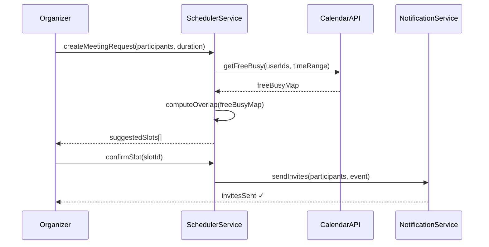

# Design a Collaborative Meeting Scheduler

**Difficulty**: 🟡 Intermediate
**Reading Time**: ~20 minutes
**Interview Frequency**: Medium — appears in scheduling and calendar-focused interviews

> 📖 This problem focuses on the **multi-participant scheduling** dimension. For a full treatment of calendar systems, see the [Meeting Calendar System Design](./meeting-calendar) article which covers time zones, recurring events, and storage architecture in depth.

---

## The Core Problem

Finding a time that works for **multiple people** across time zones, checking their calendar availability without exposing private events, and sending coordinated invites — all at 100M user scale.

The Calendly problem: participant A wants to schedule with participants B, C, and D. Each has varying availability windows, time-zone offsets, and conflict constraints. The scheduler must:

1. Collect available windows from each participant
2. Find overlapping slots that satisfy all constraints
3. Let the organizer choose and send invites
4. Handle updates when someone reschedules

---

## Key Design Decisions

### 1. Availability Representation

Store availability as **free/busy windows**, not full calendar events (privacy).

```
User A: free Mon 10-12, Tue 14-16 (UTC)
User B: free Mon 09-11, Tue 13-17 (UTC)
Overlap: Mon 10-11 UTC ✓
```

### 2. Overlap Computation

Sorted interval merge (sweep line algorithm):

```
function findOverlap(slots_A, slots_B):
    result = []
    i, j = 0, 0
    while i < len(slots_A) and j < len(slots_B):
        start = max(slots_A[i].start, slots_B[j].start)
        end   = min(slots_A[i].end,   slots_B[j].end)
        if start < end:
            result.append(Slot(start, end))
        if slots_A[i].end < slots_B[j].end:
            i++ else j++
    return result
```

Time: O(n log n) for n participants with m slots each.

### 3. Time Zone Handling

Store all times in **UTC internally**. Convert to local timezone only at display time using IANA timezone database.

---

## Architecture



---

## Capacity Estimates

- 100M users × 3 meetings/day avg = 300M scheduling events/day
- Peak: Monday 9 AM → 50k concurrent meeting requests
- Availability query: per-user free/busy lookup ~5ms (Redis cache)
- Overlap computation: O(n×m) where n=participants, m=slots per person

---

## Interview Questions

| Question | What It Tests |
|----------|--------------|
| How do you handle a participant who updates their availability after the organizer confirms? | Concurrency, notification design |
| How do you scale free/busy lookup for 50k concurrent requests? | Caching, read optimization |
| How do you support polls ("pick your preferred time") vs automatic scheduling? | UX flexibility vs automation |

---

## 📚 Resources & References

| Resource | Type | What You'll Learn |
|----------|------|------------------|
| [Meeting Calendar System (full article)](./meeting-calendar) | 📖 Internal | Recurring events, timezone storage, full architecture |
| [Calendly Engineering Blog](https://calendly.com/blog/engineering) | 📖 Blog | Real scheduling system challenges |
| [ByteByteGo — Calendar System Design](https://www.youtube.com/@ByteByteGo) | 📺 YouTube | Search "calendar system design" |
| [Designing Data-Intensive Applications — Ch 8](https://dataintensive.net) | 📚 Book | Distributed time, clock skew |
