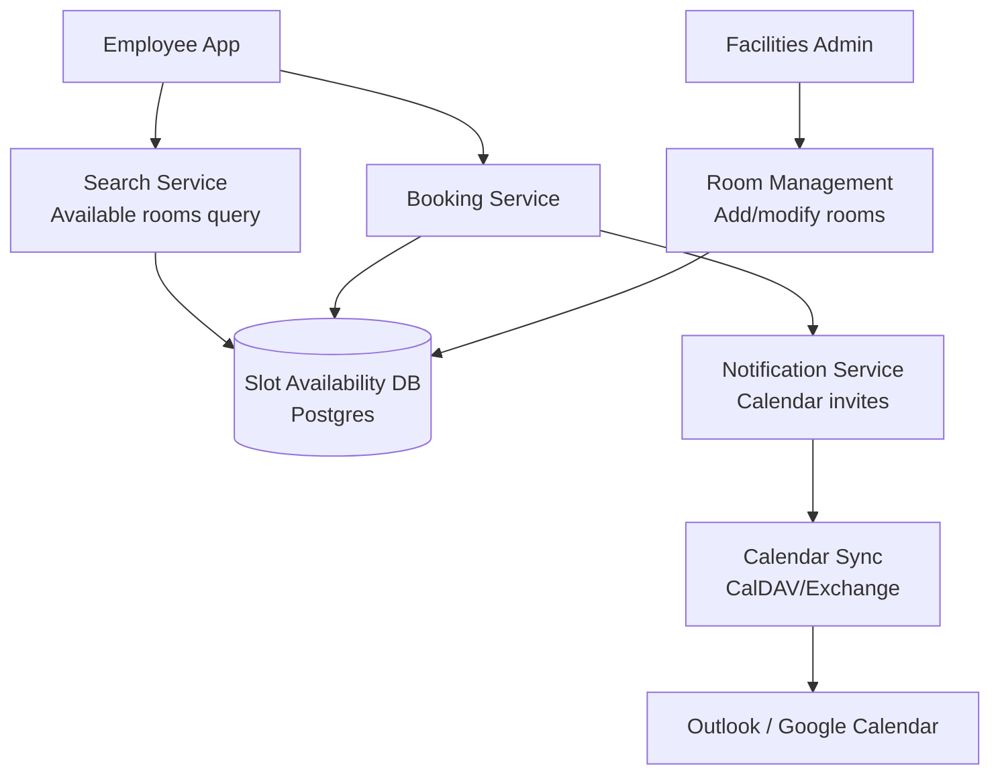

# Design a Conference Room Booking System

**Difficulty**: 🟡 Intermediate
**Reading Time**: Coming Soon
**Interview Frequency**: Medium

---

> 🚧 **Full article coming soon.** This stub gives you the essentials to start thinking about this problem.

---

## The Core Problem

Preventing double-booking of conference rooms across a 10,000-employee company where everyone tries to book the best rooms for Monday morning 9am standups. The contention window is narrow but intense — tens of concurrent booking attempts for the same room at the same time slot require atomic reservation with consistent availability checks.

## Functional Requirements

- Search available rooms by location, capacity, amenities, time slot
- Book a room for a specific time range (with buffer for setup)
- Cancel bookings and release rooms
- Sync with Google Calendar or Exchange for existing calendar integrations
- Support recurring room bookings

## Non-Functional Requirements

| Requirement | Target |
|-------------|--------|
| Availability | 99.9% (8.7 hrs downtime/year) |
| Booking latency | p99 < 1 second |
| Concurrency | No double-booking under simultaneous requests |
| Scale | 10K employees, 500 rooms, 50K bookings/day |

## Back-of-Envelope Estimates

- **Booking rate**: 50K bookings/day ÷ 86,400 = ~0.6 bookings/sec average (peak at 9am Monday: ~50/sec)
- **Room availability records**: 500 rooms × 480 slots/day (30-min slots) = 240K daily slot records
- **Notification volume**: 50K bookings × 3 attendees avg = 150K calendar invites/day

## Key Design Decisions

1. **Time-Slot Availability Model** — represent availability as fixed 15 or 30-minute slots per room per day; a booking claims contiguous slots; simplifies availability queries to "which slots in room X on date Y are unclaimed?" — O(N) scan over small N.
2. **Optimistic Locking on Slot Records** — each slot has a version number; booking transaction reads free slots → inserts booking row → updates slot version; concurrent booking on same slots causes version conflict on one request, which retries or shows "room no longer available."
3. **Calendar Sync via CalDAV/Exchange** — sync room calendars bidirectionally; bookings made directly in Outlook/Google Calendar appear in the system; requires conflict resolution when same slot is claimed from both systems simultaneously.

## High-Level Architecture

## Top Interview Questions for This Problem

| Question | Tests |
|----------|-------|
| How do you prevent two people from booking the same room at the same time? | Optimistic locking, atomic slots |
| How do you handle bookings made directly in Outlook that bypass your system? | CalDAV sync, conflict resolution |
| How would you recommend the best room for a 10-person meeting with video conferencing? | Search ranking, capacity/amenity filtering |

## Related Concepts

- [Meeting calendar for scheduling and recurring events](./meeting-calendar)
- [Hotel booking for similar inventory/booking patterns](./hotel-booking)

---

*📚 Full deep-dive with multiple approaches, trade-off tables, and pseudocode coming soon.*

## 📚 Resources & References

| Resource | Type | What You'll Learn |
|----------|------|------------------|
| [ByteByteGo — Design a Booking System](https://www.youtube.com/@ByteByteGo) | 📺 YouTube | Search "booking system design" — calendar availability, concurrency, double-booking prevention |
| [Google Calendar Architecture](https://developers.google.com/calendar/api/guides/overview) | 📚 Docs | Calendar API design patterns for event management and conflict detection |
| [Calendly Engineering: Scheduling at Scale](https://calendly.com/blog/engineering/) | 📖 Blog | How Calendly handles booking conflicts and timezone complexity |
| [Optimistic Locking for Reservation Systems](https://vladmihalcea.com/a-beginners-guide-to-database-locking-and-the-lost-update-phenomena/) | 📖 Blog | Preventing double-bookings with optimistic vs pessimistic locking |
| [Event Sourcing for Booking Systems](https://martinfowler.com/eaaDev/EventSourcing.html) | 📖 Blog | Audit trail and consistency patterns for reservation history |
