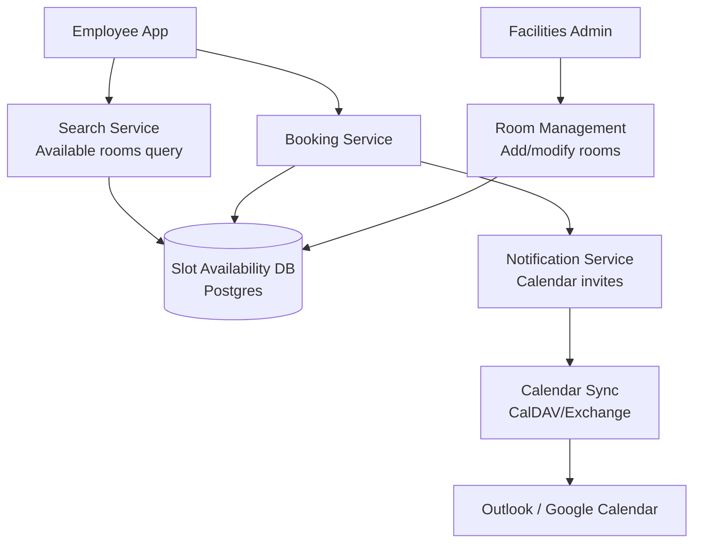
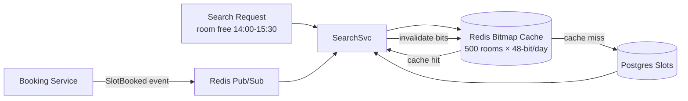
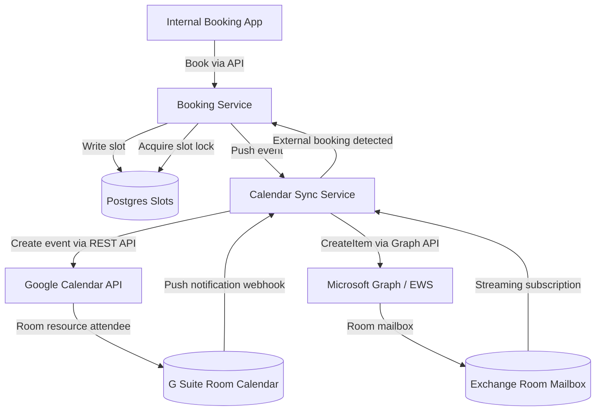
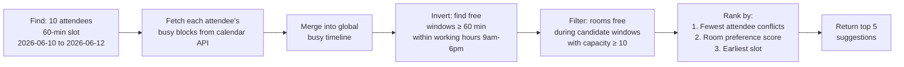

# Design a Conference Room Booking System

**Difficulty**: 🟡 Intermediate
**Reading Time**: Coming Soon
**Interview Frequency**: Medium

---

## The Core Problem

Preventing double-booking of conference rooms across a 10,000-employee company where everyone tries to book the best rooms for Monday morning 9am standups. The contention window is narrow but intense — tens of concurrent booking attempts for the same room at the same time slot require atomic reservation with consistent availability checks.

## Functional Requirements

- Search available rooms by location, capacity, amenities, time slot
- Book a room for a specific time range (with buffer for setup)
- Cancel bookings and release rooms
- Sync with Google Calendar or Exchange for existing calendar integrations
- Support recurring room bookings

## Non-Functional Requirements

| Requirement | Target |
|-------------|--------|
| Availability | 99.9% (8.7 hrs downtime/year) |
| Booking latency | p99 < 1 second |
| Concurrency | No double-booking under simultaneous requests |
| Scale | 10K employees, 500 rooms, 50K bookings/day |

## Back-of-Envelope Estimates

- **Booking rate**: 50K bookings/day ÷ 86,400 = ~0.6 bookings/sec average (peak at 9am Monday: ~50/sec)
- **Room availability records**: 500 rooms × 480 slots/day (30-min slots) = 240K daily slot records
- **Notification volume**: 50K bookings × 3 attendees avg = 150K calendar invites/day

## Key Design Decisions

1. **Time-Slot Availability Model** — represent availability as fixed 15 or 30-minute slots per room per day; a booking claims contiguous slots; simplifies availability queries to "which slots in room X on date Y are unclaimed?" — O(N) scan over small N.
2. **Optimistic Locking on Slot Records** — each slot has a version number; booking transaction reads free slots → inserts booking row → updates slot version; concurrent booking on same slots causes version conflict on one request, which retries or shows "room no longer available."
3. **Calendar Sync via CalDAV/Exchange** — sync room calendars bidirectionally; bookings made directly in Outlook/Google Calendar appear in the system; requires conflict resolution when same slot is claimed from both systems simultaneously.

## High-Level Architecture



## Top Interview Questions for This Problem

| Question | Tests |
|----------|-------|
| How do you prevent two people from booking the same room at the same time? | Optimistic locking, atomic slots |
| How do you handle bookings made directly in Outlook that bypass your system? | CalDAV sync, conflict resolution |
| How would you recommend the best room for a 10-person meeting with video conferencing? | Search ranking, capacity/amenity filtering |

## Related Concepts

- [Meeting calendar for scheduling and recurring events](./meeting-calendar)
- [Hotel booking for similar inventory/booking patterns](./hotel-booking)

---

## Component Deep Dive 1: Concurrency Control and Double-Booking Prevention

The most critical component in any reservation system is the mechanism that guarantees exactly-once booking semantics under concurrent load. Naive implementations fail predictably: a simple SELECT-then-INSERT workflow has a classic time-of-check-time-of-use (TOCTOU) race. Two users both read a room as "available", both decide to book it, and both INSERT a booking row — resulting in a double-booking that violates the core invariant of the system.

At 10K employees, the contention scenario is not theoretical. On Monday mornings between 8:55 and 9:05am, as many as 80–100 concurrent requests can target the same 10 high-demand rooms (large rooms near the kitchen, rooms with video conferencing). The contention window per room can be 200–500ms — short but perfectly capable of producing race conditions under any non-atomic implementation.

**How it works internally:**

The correct solution models each (room_id, date, slot_index) triple as a lockable row in the database. A booking transaction must:
1. Begin a serializable or repeatable-read transaction
2. SELECT … FOR UPDATE on all slot rows the booking needs (acquiring row-level locks)
3. Verify every selected slot is still `status = 'free'`
4. INSERT the booking record
5. UPDATE each slot row to `status = 'booked', booking_id = <new_id>`
6. COMMIT — releasing all row locks atomically

Under this scheme, a second concurrent transaction attempting to SELECT … FOR UPDATE on any overlapping slot will block until the first transaction commits or rolls back. If the first transaction committed, the second transaction sees `status = 'booked'` in step 3 and aborts with "room no longer available."

**Why optimistic locking alone is insufficient at peak:**

Optimistic locking (version numbers without row locks) allows both transactions to proceed through the read phase concurrently. Only at commit time does one fail with a version conflict. At 50 concurrent requests for the same room, 49 transactions will fail and must be retried — introducing 49 × retry_latency of wasted work and user-visible errors during peak. Retry storms amplify the load.

**Sequence diagram for atomic booking:**

```mermaid
sequenceDiagram
    participant U1 as User A
    participant U2 as User B
    participant BS as Booking Service
    participant DB as Postgres (Slots Table)

    U1->>BS: book(room=42, 9:00-10:00)
    U2->>BS: book(room=42, 9:00-10:00)
    BS->>DB: BEGIN TXN; SELECT * FROM slots WHERE room_id=42 AND slot IN (18,19) FOR UPDATE
    Note over DB: Row lock acquired for slots 18,19
    BS->>DB: BEGIN TXN; SELECT * FROM slots WHERE room_id=42 AND slot IN (18,19) FOR UPDATE
    Note over DB: User B BLOCKS — waiting for row lock
    DB-->>BS: slots free → INSERT booking; UPDATE slots SET status='booked'
    BS->>DB: COMMIT
    Note over DB: Lock released — User B unblocks
    DB-->>BS: User B sees status='booked' → ROLLBACK
    BS-->>U1: Booking confirmed (booking_id=9901)
    BS-->>U2: Error: Room no longer available
```

**Trade-off comparison — concurrency control strategies:**

| Approach | Latency (p99) | Throughput | Trade-off |
|----------|--------------|------------|-----------|
| Pessimistic locking (SELECT FOR UPDATE) | 80ms | 200 bookings/sec | Blocking under high contention; safe, predictable |
| Optimistic locking (version column) | 30ms read, retry on conflict | 500 reads/sec, 80% success under high contention | Fast reads; retry storms at peak; good for low-contention rooms |
| Redis distributed lock (SETNX + TTL) | 15ms | 1,500 bookings/sec | Requires Redis HA; risk of stale lock on crash; fast for cross-region |

For a 10K-employee deployment, pessimistic locking on Postgres is the correct default — the load is bounded and predictable, and correctness is non-negotiable.

---

## Component Deep Dive 2: Slot Availability Model and Search

The availability search is the most frequently called operation — every employee who wants to schedule a meeting starts with "show me free rooms for 30 minutes around 2pm." At 10K employees, even at 10% actively searching at any moment, that is 1,000 concurrent availability queries. The data model and indexing strategy determines whether searches complete in 20ms or 2,000ms.

**Internal mechanics:**

The slot model divides each day into fixed-length intervals. A 30-minute granularity gives 48 slots per day. For 500 rooms over a 90-day booking horizon, the total slot table size is 500 × 48 × 90 = 2.16 million rows — trivially small for Postgres. Each row represents one (room, date, slot_index) and carries a `status` field (`free` / `booked` / `blocked`).

An availability search for "rooms free from 14:00–15:30 on 2026-06-05" translates to:
```sql
SELECT room_id FROM slots
WHERE date = '2026-06-05'
  AND slot_index IN (28, 29, 30)   -- slots 14:00, 14:30, 15:00
  AND status = 'free'
GROUP BY room_id
HAVING COUNT(*) = 3;
```

With a composite index on `(date, slot_index, status)`, this query hits only 500 × 3 = 1,500 rows and returns in under 5ms.

**Scale behavior at 10x load:**

At 10x load (100K employees or high-frequency polling), the read path can be offloaded to a Redis bitmap cache. Each room-day combination maps to a 48-bit bitmap where each bit represents one slot's availability. A Redis GETBIT operation checks one slot in O(1). The entire 500-room availability for a single date fits in 500 × 6 bytes = 3KB — a single Redis pipeline can answer a multi-room search in under 1ms.

Cache invalidation: when a booking commits, the Booking Service publishes a `SlotBooked` event to a lightweight event bus (Redis Pub/Sub or Kafka). The Search Service subscribes and flips the corresponding bitmap bits within 50ms of commit.

**Diagram — cached availability lookup:**



| Storage Layer | Query Latency | Staleness | Complexity |
|---------------|--------------|-----------|------------|
| Postgres direct | 5–20ms | 0ms (consistent read) | Low |
| Redis bitmap cache | < 1ms | 50–200ms (event lag) | Medium |
| Materialized view (Postgres) | 2–5ms | configurable refresh | Medium |

---

## Component Deep Dive 3: Calendar Sync and Conflict Resolution

External calendar sync is the most operationally painful component. A significant fraction of enterprise bookings happen directly in Outlook or Google Calendar — users add the conference room as an attendee in an existing meeting. These bookings bypass the internal booking service entirely and arrive via CalDAV push or Exchange EWS polling.

**The core problem:** when a room is booked externally at 9:00am and internally at 9:01am for the same slot, both systems believe they own the slot. The internal system must detect this within seconds and resolve the conflict before both parties show up.

**Sync architecture:**

The Calendar Sync Service maintains a persistent connection (CalDAV push subscription or Exchange streaming subscription) to each room's mailbox. Incoming events are normalized to the internal slot model and written via the same Booking Service path — which means they flow through the same SELECT FOR UPDATE locking logic. If the slot is already taken internally, the external booking is rejected and the external calendar is updated with a "declined" response.

**Conflict window:** the sync latency from external booking to internal detection is 2–10 seconds for CalDAV push, and up to 60 seconds for polling-based Exchange integrations. During this window, a human using the internal app can successfully book the same slot — creating a genuine double-booking. The mitigation is to hold a 10-second "soft lock" in Redis when a CalDAV push event is received, blocking internal bookings on that slot while sync completes.

**Technical decisions:**
- Use Exchange Streaming Subscriptions (EWS) over polling — reduces sync latency from ~60s to ~3s and eliminates unnecessary API calls
- Idempotency keys on external events — the CalDAV event UID maps 1:1 to a booking record; re-delivery does not create duplicate bookings
- Room mailboxes in Exchange require `AutoAccept` policy set to `false` — the sync service becomes the acceptance arbiter

---

## Data Model

```sql
-- Rooms catalog
CREATE TABLE rooms (
    room_id         UUID PRIMARY KEY DEFAULT gen_random_uuid(),
    building        VARCHAR(64) NOT NULL,
    floor           SMALLINT NOT NULL,
    room_name       VARCHAR(128) NOT NULL,         -- e.g. "Darwin", "404-B"
    capacity        SMALLINT NOT NULL,
    amenities       TEXT[],                        -- e.g. {'video_conf','whiteboard','phone'}
    is_active       BOOLEAN NOT NULL DEFAULT TRUE,
    created_at      TIMESTAMPTZ NOT NULL DEFAULT NOW()
);

-- Slot availability (one row per room per 30-min interval per day)
CREATE TABLE room_slots (
    slot_id         BIGSERIAL PRIMARY KEY,
    room_id         UUID NOT NULL REFERENCES rooms(room_id),
    slot_date       DATE NOT NULL,
    slot_index      SMALLINT NOT NULL,             -- 0=00:00, 1=00:30, ..., 47=23:30
    status          VARCHAR(16) NOT NULL DEFAULT 'free',  -- free | booked | blocked | maintenance
    booking_id      UUID,                          -- FK to bookings, NULL if free
    version         INTEGER NOT NULL DEFAULT 0,   -- optimistic lock version
    UNIQUE (room_id, slot_date, slot_index)
);

CREATE INDEX idx_slots_search ON room_slots (slot_date, slot_index, status, room_id);
CREATE INDEX idx_slots_room_date ON room_slots (room_id, slot_date);

-- Bookings
CREATE TABLE bookings (
    booking_id      UUID PRIMARY KEY DEFAULT gen_random_uuid(),
    room_id         UUID NOT NULL REFERENCES rooms(room_id),
    organizer_id    UUID NOT NULL,                 -- internal user ID
    title           VARCHAR(256),
    start_time      TIMESTAMPTZ NOT NULL,
    end_time        TIMESTAMPTZ NOT NULL,
    attendee_ids    UUID[],
    status          VARCHAR(16) NOT NULL DEFAULT 'confirmed',  -- confirmed | cancelled | pending
    recurrence_id   UUID,                          -- FK to recurrence_rules if recurring
    external_uid    VARCHAR(512) UNIQUE,           -- CalDAV/Exchange event UID for sync dedup
    created_at      TIMESTAMPTZ NOT NULL DEFAULT NOW(),
    cancelled_at    TIMESTAMPTZ
);

CREATE INDEX idx_bookings_room_time ON bookings (room_id, start_time, end_time);
CREATE INDEX idx_bookings_organizer ON bookings (organizer_id, start_time);

-- Recurrence rules (for recurring bookings)
CREATE TABLE recurrence_rules (
    recurrence_id   UUID PRIMARY KEY DEFAULT gen_random_uuid(),
    room_id         UUID NOT NULL REFERENCES rooms(room_id),
    organizer_id    UUID NOT NULL,
    rrule           VARCHAR(512) NOT NULL,         -- RFC 5545 RRULE string, e.g. "FREQ=WEEKLY;BYDAY=MO;COUNT=52"
    start_time      TIME NOT NULL,
    duration_mins   SMALLINT NOT NULL,
    series_start    DATE NOT NULL,
    series_end      DATE,
    created_at      TIMESTAMPTZ NOT NULL DEFAULT NOW()
);

-- Notifications outbox (transactional outbox pattern)
CREATE TABLE notification_outbox (
    outbox_id       BIGSERIAL PRIMARY KEY,
    booking_id      UUID NOT NULL REFERENCES bookings(booking_id),
    event_type      VARCHAR(32) NOT NULL,          -- booking_confirmed | booking_cancelled | booking_updated
    payload         JSONB NOT NULL,
    recipient_ids   UUID[] NOT NULL,
    status          VARCHAR(16) NOT NULL DEFAULT 'pending',  -- pending | sent | failed
    created_at      TIMESTAMPTZ NOT NULL DEFAULT NOW(),
    sent_at         TIMESTAMPTZ
);
```

---

## Scale Bottlenecks

| Traffic Level | Component That Breaks | Symptoms | Mitigation |
|---------------|----------------------|----------|------------|
| 10x baseline (500K bookings/day, ~500/sec peak) | Postgres row-lock contention on `room_slots` for popular rooms | p99 booking latency spikes from 80ms to 800ms; lock wait timeouts in logs | Shard slot table by `room_id` across 4 Postgres instances; add Redis soft-lock for top-20 contested rooms |
| 100x baseline (5M bookings/day, ~5,000/sec peak) | Postgres write throughput ceiling (~10K writes/sec single node) | Booking service queues back; INSERT latency > 2s | Migrate slot state to Redis Cluster with Lua atomic scripts; use Postgres only for durable booking records written asynchronously |
| 1000x baseline (50M bookings/day) | Redis single-shard hot keys for building-level popular rooms | Redis CPU saturation on key `slots:room42:2026-06-05`; SLOWLOG fills | Consistent-hash sharding across 16 Redis shards by (room_id mod 16); local in-process LRU cache for availability read path (TTL=200ms) |
| Any level | Calendar Sync Service — single point of failure per Exchange tenant | External bookings queue up; sync lag grows to minutes; double-bookings spike | Run 3 sync workers per Exchange tenant with distributed leader election (Redis SETNX); circuit-breaker on Exchange API timeouts |

---

## How Calendly Built This

Calendly is the best documented public example of a reservation system that solved exactly this problem at scale. By 2022, Calendly served 15 million monthly active users scheduling over 10 million meetings per day — roughly 115 bookings per second average with peaks during US business hours near 800/sec.

**Technology choices:**
- **Ruby on Rails monolith** initially, with booking logic extracted to a dedicated "availability engine" service in Go around 2020, reducing p99 booking latency from ~1.2s to ~180ms
- **PostgreSQL** as the primary store with Citus extension for horizontal sharding by `account_id` — each account's availability data lives on one shard, eliminating cross-shard transactions for the common case
- **Sidekiq + Redis** for async notification delivery (calendar invites, email confirmations) — processing 2.5 million Sidekiq jobs per hour at peak
- **Timezone handling** as a first-class engineering problem: all times stored in UTC; slot availability computed per-invitee timezone at query time; this alone took 6 months to get right across DST transitions

**Non-obvious architectural decision:** Calendly treats "availability windows" (when someone can be booked) as a separate data model from actual bookings. Availability is computed dynamically at query time by intersecting: (1) the host's configured availability hours, (2) already-booked slots from their connected calendars, (3) buffer times between meetings. This means availability is never stored — only bookings are stored. The dynamic computation approach eliminated an entire class of cache invalidation bugs at the cost of CPU on the availability engine.

**Specific numbers from their 2021 engineering blog:** the availability engine processes 40,000 availability check requests per second at peak, each requiring aggregation across up to 8 connected calendars per user. Response time target is p99 < 300ms. They run the availability engine on c5.4xlarge instances (16 vCPU) with 12 instances during US business hours, scaling down to 3 overnight.

Source: [Calendly Engineering Blog — Scaling our Availability Engine](https://calendly.com/blog/engineering/)

---

## Interview Angle

**What the interviewer is testing:** Whether you understand that reservation systems are fundamentally about atomic state transitions under concurrency — not just CRUD — and whether you can reason about the specific failure modes that emerge when multiple clients race to claim a finite shared resource.

**Common mistakes candidates make:**

1. **Proposing SELECT-then-INSERT without locking.** Candidates describe checking availability and then inserting a booking as two separate operations without explaining how they are made atomic. This is the classic TOCTOU race and will produce double-bookings at any non-trivial scale. The correct answer is SELECT FOR UPDATE, a serializable transaction, or an idempotent upsert with a unique constraint.

2. **Over-engineering toward eventual consistency.** Some candidates reach for Kafka and event sourcing immediately, arguing that "eventual consistency is fine for booking." It is not — a user seeing "room available" and then receiving "sorry, already booked" 500ms later is an unacceptable user experience. Booking confirmation must be synchronous and linearizable.

3. **Ignoring the calendar sync conflict window.** Candidates design a clean internal booking system but never address what happens when a room is booked directly in Outlook. This is the most realistic production failure mode in enterprise deployments and examiners specifically probe it. A complete answer includes sync latency, soft-locking during sync, and idempotent event UIDs.

**The insight that separates good from great answers:** Representing availability as immutable slot rows that are atomically claimed (rather than as a mutable "is_available" flag on the room) means that every booking operation is an INSERT + UPDATE to a small, known set of rows — making row-level locking precise, cheap, and collision-detectable via unique constraints. Great candidates draw the data model first and derive the locking strategy from it, rather than the other way around.

---

## Key Numbers to Remember

| Metric | Value | Context |
|--------|-------|---------|
| Slot table size (500 rooms, 90-day horizon) | 2.16M rows | 500 rooms × 48 slots/day × 90 days; trivially small for Postgres |
| Availability query latency (Postgres, indexed) | < 5ms p99 | Composite index on (date, slot_index, status, room_id) |
| Availability query latency (Redis bitmap) | < 1ms p99 | 500-room search fits in 3KB; single pipeline round trip |
| Peak booking contention window | 8:55–9:10am Monday | ~80–100 concurrent requests for top-10 rooms |
| Calendar sync latency (CalDAV push) | 2–10 seconds | From external booking to internal slot lock |
| Calendar sync latency (Exchange polling) | 30–60 seconds | Fallback mode; requires soft-lock gap protection |
| Calendly availability engine throughput | 40,000 req/sec | At 2021 peak during US business hours |
| Calendly p99 availability check | < 300ms | Across up to 8 connected calendars per user |
| Postgres SELECT FOR UPDATE lock acquisition | < 1ms | When no contention; up to 500ms under high contention |
| Redis SETNX distributed lock TTL | 10–30 seconds | Soft-lock during calendar sync window |

---

---

## Level 2 — Deep Dive

---

### Resource Conflict Detection: Efficient Overlap Query

Detecting overlapping bookings is deceptively simple to state and dangerously easy to get wrong. The naive approach — "check if any booking for this room overlaps with the requested time" — requires an interval overlap query that trips up candidates and junior engineers alike because the overlap condition is counterintuitive.

**The correct overlap predicate:**

Two time intervals [A_start, A_end) and [B_start, B_end) overlap if and only if:

```
A_start < B_end AND A_end > B_start
```

The negation — no overlap — is:
```
A_end <= B_start OR A_start >= B_end
```

In SQL, to check if room 42 is free from 14:00 to 15:30:

```sql
-- WRONG — misses cases where existing booking straddles the start or end
SELECT COUNT(*) FROM bookings
WHERE room_id = 42
  AND start_time >= '2026-06-05 14:00'
  AND start_time < '2026-06-05 15:30';

-- CORRECT — catches all overlap cases
SELECT COUNT(*) FROM bookings
WHERE room_id = 42
  AND status = 'confirmed'
  AND start_time < '2026-06-05 15:30'   -- existing starts before new ends
  AND end_time > '2026-06-05 14:00';    -- existing ends after new starts
```

**Performance on the bookings table:**

With an index on `(room_id, start_time, end_time)`, the query uses an index range scan on `room_id = 42 AND start_time < '15:30'`. This produces a small candidate set (a room typically has 8–16 bookings per day), and the `end_time > '14:00'` filter is then evaluated in-memory. p99 latency: < 2ms on a 5-million-row table.

**Alternative: slot-based model (preferred for heavy read load)**

The conflict detection on a slot table is even cheaper because it avoids interval arithmetic entirely:

```sql
-- Check if all needed slots are free
SELECT slot_index, status
FROM room_slots
WHERE room_id = 42
  AND slot_date = '2026-06-05'
  AND slot_index IN (28, 29, 30)   -- 14:00, 14:30, 15:00
FOR UPDATE;
-- If any returned row has status != 'free', conflict detected
```

This is O(k) where k = number of slots in the requested duration (typically 2–6), and acquires precise row-level locks on exactly the contested rows — no table-level or range locks needed.

**Conflict detection for recurring bookings:**

Recurring meetings complicate the conflict check significantly. A weekly recurring meeting from 10:00–11:00 every Monday for 52 weeks does not block one slot — it blocks 52 × 2 = 104 slots (2 slots per occurrence at 30-minute granularity). The conflict check must expand the RRULE into individual occurrence dates and check each one. For a FREQ=WEEKLY;COUNT=52 series, this is 52 database reads per booking — batched into a single multi-row query:

```sql
-- Conflict check for all occurrences of a weekly recurring booking
SELECT slot_date, slot_index, status
FROM room_slots
WHERE room_id = 42
  AND (slot_date, slot_index) IN (
    ('2026-06-01', 20), ('2026-06-01', 21),
    ('2026-06-08', 20), ('2026-06-08', 21),
    -- ... all 52 weeks expanded by application layer
    ('2027-05-31', 20), ('2027-05-31', 21)
  )
  AND status != 'free';
-- Any returned row = conflict
```

This is one query returning at most N_occurrences × slots_per_occurrence rows. At 52 occurrences × 2 slots = 104 row lookups — still O(1) per booking from the database perspective, done in a single round trip with a multi-column IN clause covered by the `(room_id, slot_date, slot_index)` unique index.

---

### Calendar Sync Architecture: Google Calendar and Exchange Integration

The calendar sync layer is the most operationally painful component in any enterprise room booking system. Two distinct protocols dominate enterprise deployments:

- **Google Calendar API (CalDAV + REST)**: Used by G Suite / Google Workspace organizations. Room resources are represented as Google Groups Calendars with resource booking enabled. Events with room resources as attendees trigger automatic acceptance/decline based on room availability.
- **Exchange Web Services (EWS) / Microsoft Graph API**: Used by Microsoft 365 / Exchange organizations. Room mailboxes in Exchange handle booking via `AutoAccept` resource policies managed by Exchange or delegated to the booking service.

**Integration diagram — bidirectional sync:**



**Conflict handling during sync lag:**

The critical operational challenge is the sync latency window. When someone books a room directly in Google Calendar, the booking propagates to the internal system via push notification (Google) or streaming subscription (Exchange) with a 2–10 second lag. During those 2–10 seconds, the internal app can show the room as available and accept another booking — creating a genuine double-booking.

Three mitigation strategies, ordered by complexity:

| Strategy | Mechanism | Latency to Detect External Booking | Complexity |
|----------|-----------|-------------------------------------|------------|
| Polling fallback | Query external calendar API every 30s | Up to 30 seconds | Low |
| Push webhook (Google) | Calendar push channels; webhook called on event change | 2–5 seconds | Medium |
| Streaming subscription (Exchange) | EWS streaming; server pushes events over open HTTP connection | 1–3 seconds | Medium-High |
| Soft-lock on push received | When push arrives, Redis SETNX for 15s while sync processes | Eliminates race during processing | Medium (requires Redis HA) |

**Google-specific details:**

Google Workspace resource calendars have a built-in booking policy: when a room is added as an attendee to a Calendar event, Google's own resource booking layer performs the acceptance atomically. The `autoAccept` flag on the resource determines whether booking is automatic. For enterprise deployments that want the booking service to control acceptance, set `autoAccept = false` on the room resource and handle `EVENT_UPDATED` push notifications to accept or decline based on the booking service's availability check.

This means the booking service becomes a stateful webhook handler: it receives "booking requested" events from Google, checks its own slot DB, and responds with `ACCEPT` or `DECLINE` via the Calendar API. The slot DB is the single source of truth; Google Calendar is the notification layer.

**Exchange-specific details:**

Exchange room mailboxes with `AutomateProcessing = AutoAccept` will accept any booking request that doesn't conflict with the room's Exchange calendar. If the booking service manages the slot DB independently, the Exchange calendar and slot DB can diverge. The correct approach: set `AutomateProcessing = AutoUpdate` (not AutoAccept), and use the booking service's Exchange delegate access to approve or decline meeting requests.

```python
# Pseudocode: Exchange EWS streaming subscription handler
def on_exchange_event(event):
    if event.type == 'NewMeetingRequest':
        room_id = event.room_mailbox
        start = event.start_time
        end = event.end_time

        # Acquire soft lock to prevent concurrent internal bookings
        lock_key = f"sync_lock:{room_id}:{start.isoformat()}"
        acquired = redis.set(lock_key, '1', nx=True, ex=15)  # 15s TTL

        if not acquired:
            # Another booking is processing this slot — decline external
            exchange.decline_meeting_request(event.id)
            return

        try:
            # Check internal slot DB (SELECT FOR UPDATE)
            if slot_db.are_slots_free(room_id, start, end):
                booking_id = slot_db.create_booking(room_id, start, end,
                                                     external_uid=event.uid)
                exchange.accept_meeting_request(event.id)
            else:
                exchange.decline_meeting_request(event.id)
        finally:
            redis.delete(lock_key)
```

---

### Smart Scheduling: Suggesting Available Time Slots

Finding available time slots across multiple attendees and rooms is computationally intensive at scale. For a 10-person meeting, the system must intersect 10 individual calendars plus the room availability — and do it in < 500ms.

**Algorithm: availability intersection**



**Busy block aggregation:**

For Google Calendar users, the Freebusy API returns busy blocks for up to 100 calendars in a single call:

```
POST https://www.googleapis.com/calendar/v3/freeBusy
{
  "timeMin": "2026-06-10T09:00:00Z",
  "timeMax": "2026-06-12T18:00:00Z",
  "items": [{"id": "user1@company.com"}, {"id": "user2@company.com"}, ...]
}
```

This returns a busy-block list per calendar. The application merges all busy blocks into a single sorted timeline and inverts to find free windows. Time complexity: O(N × B) where N = number of attendees (10) and B = number of busy blocks per person per day (typically 5–8). For a 2-day search window, this is ~160 intervals — trivially fast to merge and invert in memory.

**Room scoring for ranking:**

Not all available rooms are equal. A good smart scheduler ranks candidates by:

| Signal | Weight | Rationale |
|--------|--------|-----------|
| Attendee count vs room capacity ratio (ideal: 70–90% fill) | 0.4 | Avoid 5 people in a 30-seat room |
| Historical preference (did this team use this room before?) | 0.3 | Learned from booking history |
| Amenity match (video conferencing required?) | 0.2 | Hard filter first, then soft-rank |
| Proximity to organizer's desk location | 0.1 | Minimize travel time |

---

### Recurring Meetings: The Interview Trap Candidates Forget

**This is the #1 missed component in conference room booking interviews.**

A recurring weekly meeting from 10:00–11:00 every Monday blocks the room not once but 52 times per year. If a candidate designs a system where booking a recurring meeting inserts one record with an RRULE string, their conflict detection is broken — no slot is marked as booked, so other users can book the same room for any of those 52 Mondays.

**Approach A: Expand on write (materialized)**

When a recurring booking is created, immediately expand the RRULE into all individual occurrences and insert one slot record per occurrence.

```sql
-- Creating a weekly recurring booking: 52 rows inserted into room_slots
INSERT INTO room_slots (room_id, slot_date, slot_index, status, booking_id)
SELECT 42, occurrence_date, 20, 'booked', 'booking-uuid-abc'
FROM generate_series(
    '2026-06-01'::date,
    '2027-05-25'::date,
    INTERVAL '7 days'
) AS occurrence_date;
-- Also insert slot_index 21 (second half-hour of the 10:00-11:00 block)
```

Pros: conflict detection is O(1) per slot lookup — no RRULE expansion at read time. Cancellation or modification of a single occurrence is one UPDATE.

Cons: editing the entire series (e.g., "change this meeting to Tuesdays") requires UPDATE of all 52 rows. Creating a 2-year weekly series inserts 104 rows — manageable but noisy.

**Approach B: Expand on read (virtual occurrences)**

Store only the RRULE in `recurrence_rules`. Conflict detection expands the RRULE at query time to check each occurrence date.

Pros: clean data model. A series change is one UPDATE to the recurrence rule.

Cons: conflict check for a new one-off booking must expand every active RRULE to check for collision — O(R × T) where R = active recurring series and T = occurrences per series per query window. At 10K employees with 500 active recurring weekly meetings, checking a new one-off booking for conflicts requires 500 × 2 = 1,000 slot lookups — still fast but requires a specialized index.

**Recommendation:** Expand on write for the slot table (Approach A), keep the `recurrence_rules` table as metadata for display and series management. The slot table is the authority for "is this time taken?" The recurrence_rules table is for "what is the pattern of this recurring series?"

**Cancelling a single occurrence vs. the whole series:**

```sql
-- Cancel single occurrence (exception to the series)
UPDATE room_slots
SET status = 'free', booking_id = NULL
WHERE room_id = 42 AND slot_date = '2026-07-06' AND slot_index IN (20, 21);

INSERT INTO booking_exceptions (recurrence_id, exception_date, exception_type)
VALUES ('recurrence-uuid', '2026-07-06', 'cancelled');

-- Cancel entire series
UPDATE room_slots
SET status = 'free', booking_id = NULL
WHERE booking_id IN (
    SELECT booking_id FROM bookings WHERE recurrence_id = 'recurrence-uuid'
);
UPDATE bookings SET status = 'cancelled' WHERE recurrence_id = 'recurrence-uuid';
UPDATE recurrence_rules SET cancelled_at = NOW() WHERE recurrence_id = 'recurrence-uuid';
```

**The exception model (RFC 5545 EXDATE):**

When a user cancels or modifies one occurrence of a recurring series, the industry standard is to record an `EXDATE` (exclusion date) in the RRULE string, or store a separate `booking_exceptions` table. The slot table is updated to reflect the freed slot. The UI shows the series as continuous but with the exception date marked differently.

---

### Google Workspace at Scale: Real Numbers

Google Workspace is the best-documented large-scale deployment of calendar and room booking infrastructure. Key numbers from Google engineering:

- **8+ million** enterprise domain administrators as of 2023
- **Over 3 billion** Calendar API calls per day (extrapolated from Google API usage stats and developer documentation)
- **Billions of calendar events** stored in Google Calendar's Spanner-backed storage layer
- **Real-time availability** for resource calendars handled by a distributed locking layer built on Google's Chubby (distributed lock service) — the same infrastructure used for BigTable master election

**How Google's resource calendar works internally (from public documentation and engineering talks):**

1. Room resources in Google Workspace are represented as Google Groups with type `RESOURCE`. Each resource has a calendar that acts as the booking ledger.
2. When a Calendar event is created with a room resource as an attendee, Google's resource scheduling service checks availability and accepts or declines the booking request atomically.
3. The acceptance is implemented using a distributed compare-and-swap on the resource's availability record — conceptually identical to Chubby's sequencer-based locking. Only one booking request for a given resource+time can win the compare-and-swap; all others get an `DECLINED` response.
4. For enterprise customers with thousands of rooms, Google pre-computes free-busy blocks and caches them in Bigtable for fast search. The calendar UI's "Find a time" feature fetches pre-computed availability, not real-time slot data, for most attendees.

**Key architectural decision that differs from naive implementations:**

Google Calendar does not store availability as a separate table. Availability is derived at query time from the event store — the same events that appear in the calendar UI. The free-busy query is a time-range scan on the event store, filtered by attendee. Because Spanner provides strongly consistent reads with external consistency, there is no separate availability cache to invalidate — the event store is always the ground truth.

This contrasts with the slot-table model described above, which trades storage overhead (the pre-materialized slot rows) for faster availability queries. At Google's scale, Spanner's strong consistency makes the event-store approach viable without a separate slot cache.

**Distributed locking for room booking (Google's approach vs. naive):**

| Approach | Consistency | Latency | Complexity | Used by |
|----------|------------|---------|------------|---------|
| DB row lock (SELECT FOR UPDATE) | Strong | 1–80ms | Low | Small deployments, Calendly |
| Optimistic concurrency (version column) | Strong on commit | 1–30ms read; retry on conflict | Low | Medium deployments |
| Redis SETNX distributed lock | Strong (within TTL) | 1–5ms | Medium (Redis HA required) | High-throughput deployments |
| Google Chubby / Zookeeper sequencer | Strong, linearizable | 5–15ms (LAN) | High | Google Workspace, HDFS |
| Spanner compare-and-swap | Externally consistent | 5–30ms (global) | Very High | Google Calendar internally |

For 10K-employee deployments, Postgres SELECT FOR UPDATE is the right choice — Spanner and Chubby are overkill at this scale.

---

### Scale Bottlenecks: Full Analysis

| Traffic Level | Component That Breaks First | Failure Mode | Symptoms | Mitigation |
|---------------|----------------------------|--------------|----------|------------|
| 1x baseline (50K bookings/day, ~0.6/sec avg, 50/sec peak Mon 9am) | None — single Postgres instance handles comfortably | — | — | Baseline design |
| 10x (500K bookings/day, ~500/sec peak) | Postgres row-lock contention on `room_slots` for top-20 rooms | Lock wait timeouts; requests queue up | p99 booking latency spikes from 80ms to 800ms | Shard `room_slots` by building (4 shards); add Redis soft-lock for contested rooms |
| 100x (5M bookings/day, 5,000/sec peak) | Postgres write throughput ceiling (~10K writes/sec single node) | INSERT backpressure; connection pool exhaustion | Booking service queue depth grows; p99 > 2s | Migrate slot state to Redis Cluster with atomic Lua scripts; Postgres for durable records only (async) |
| 1000x (50M bookings/day, ~580/sec sustained) | Redis hot key: `slots:room42:2026-06-10` (popular rooms) | Redis CPU saturation; SLOWLOG fills; single-shard throughput ceiling | Availability queries slow to 100ms+; cascading latency | Consistent-hash sharding by (room_id mod 16); local in-process LRU cache on search service (TTL=200ms) |
| G Suite scale (billions events, 8M+ enterprise users) | Event store scan for free-busy across large orgs | Slow freebusy queries for orgs with 10K+ users | "Find a time" in Calendar UI slow; API latency spikes | Pre-compute free-busy blocks in Bigtable; serve from cache; event store only for writes and strong-consistency reads |
| Any scale | Calendar Sync Service (SPOF per Exchange tenant) | External bookings queue; sync lag grows to minutes; double-bookings spike | Users see confirmed room but room is taken | 3 sync workers per tenant with Redis leader election (SETNX); circuit-breaker on Exchange API timeouts |

---

### Interview Angle: What Separates Good from Great Answers

**What the interviewer is testing:**

Reservation systems are fundamentally about atomic state transitions under concurrency — not CRUD. The interviewer wants to see whether you understand the specific failure modes that emerge when multiple clients race to claim a finite shared resource, and whether your design handles the full lifecycle including recurring meetings, external calendar sync, and cancellation semantics.

**The recurring meeting trap (most candidates fail this):**

When an interviewer asks "how does your system handle recurring meetings?" most candidates say "store an RRULE string and expand it when needed." This answer scores partial credit. A complete answer addresses:

1. **Conflict detection at booking time**: expanding 52 occurrences and checking each for conflicts atomically — one batch query, one transaction
2. **Exception handling**: RFC 5545 EXDATE model for single-occurrence cancellations without disrupting the series
3. **Series modification**: "change meeting room for all future occurrences" requires updating slot records from a future date forward — `WHERE slot_date >= today AND recurrence_id = X`
4. **The storage implication**: 52 slot rows per weekly year-long series × 500 rooms × 20% recurring meeting rate = 520,000 extra slot rows per year — manageable, but the candidate should acknowledge the trade-off

**Four common mistakes with root causes and fixes:**

1. **SELECT-then-INSERT without atomicity** (TOCTOU race)
   - Root cause: treating availability check and booking insert as separate API calls
   - Fix: SELECT FOR UPDATE inside a single transaction, or unique constraint on (room_id, slot_date, slot_index) that causes one INSERT to fail
   - Test: ask "what happens if 50 users submit requests for the same room at the exact same millisecond?"

2. **Eventual consistency for booking confirmation**
   - Root cause: reflexively reaching for Kafka/event sourcing for any distributed problem
   - Fix: booking confirmation must be synchronous and linearizable; event bus is only for downstream side effects (notifications, analytics) after the booking is committed
   - Test: ask "if I book a room and get a confirmation, can I arrive and find someone else already there?"

3. **Ignoring calendar sync conflict window**
   - Root cause: designing the internal booking system in isolation without modeling the real enterprise environment where Outlook/GCal is the primary interface
   - Fix: soft-lock in Redis during sync processing; idempotency key on external event UID; decline-on-conflict response back to external calendar
   - Test: ask "if someone books the room directly in Outlook at 10:00am and someone uses your app at 10:00:05am — who wins?"

4. **Flat booking record without recurrence model**
   - Root cause: treating recurring meetings as a UI concern rather than a data model concern
   - Fix: separate `recurrence_rules` table with RRULE; slot table materialized at write time; `booking_exceptions` table for single-occurrence overrides
   - Test: ask "how do I cancel just next Tuesday's standup without cancelling all future standups?"

**The insight that separates good from great:**

Representing availability as immutable slot rows that are atomically claimed — rather than a mutable `is_available` boolean on the room — means every booking operation touches a small, known, bounded set of rows. Row-level locking is precise, cheap, and collision is naturally detected via unique constraint violation. Great candidates draw the data model first and derive the concurrency strategy from it, rather than picking a locking strategy and hoping the data model supports it.

---

### Full Data Model (Extended with Recurring Meetings)

```sql
-- Rooms catalog
CREATE TABLE rooms (
    room_id         UUID PRIMARY KEY DEFAULT gen_random_uuid(),
    building        VARCHAR(64) NOT NULL,
    floor           SMALLINT NOT NULL,
    room_name       VARCHAR(128) NOT NULL,
    capacity        SMALLINT NOT NULL,
    amenities       TEXT[],                        -- {'video_conf','whiteboard','phone'}
    timezone        VARCHAR(64) NOT NULL DEFAULT 'UTC',
    is_active       BOOLEAN NOT NULL DEFAULT TRUE,
    created_at      TIMESTAMPTZ NOT NULL DEFAULT NOW()
);

-- Slot availability (one row per room per 30-min interval per day)
-- Pre-materialized for O(1) conflict detection
CREATE TABLE room_slots (
    slot_id         BIGSERIAL PRIMARY KEY,
    room_id         UUID NOT NULL REFERENCES rooms(room_id),
    slot_date       DATE NOT NULL,
    slot_index      SMALLINT NOT NULL,             -- 0=00:00, 1=00:30, ..., 47=23:30
    status          VARCHAR(16) NOT NULL DEFAULT 'free',  -- free|booked|blocked|maintenance
    booking_id      UUID,
    version         INTEGER NOT NULL DEFAULT 0,   -- optimistic lock version
    UNIQUE (room_id, slot_date, slot_index)       -- enforces no double-booking at DB layer
);

CREATE INDEX idx_slots_search ON room_slots (slot_date, slot_index, status);
CREATE INDEX idx_slots_room_date ON room_slots (room_id, slot_date);

-- Recurrence rules (RFC 5545 RRULE)
CREATE TABLE recurrence_rules (
    recurrence_id   UUID PRIMARY KEY DEFAULT gen_random_uuid(),
    room_id         UUID NOT NULL REFERENCES rooms(room_id),
    organizer_id    UUID NOT NULL,
    rrule           VARCHAR(512) NOT NULL,         -- e.g. "FREQ=WEEKLY;BYDAY=MO;COUNT=52"
    start_time      TIME NOT NULL,
    duration_mins   SMALLINT NOT NULL,
    series_start    DATE NOT NULL,
    series_end      DATE,
    cancelled_at    TIMESTAMPTZ,
    created_at      TIMESTAMPTZ NOT NULL DEFAULT NOW()
);

-- Bookings (one row per occurrence for recurring meetings)
CREATE TABLE bookings (
    booking_id      UUID PRIMARY KEY DEFAULT gen_random_uuid(),
    room_id         UUID NOT NULL REFERENCES rooms(room_id),
    organizer_id    UUID NOT NULL,
    title           VARCHAR(256),
    start_time      TIMESTAMPTZ NOT NULL,
    end_time        TIMESTAMPTZ NOT NULL,
    attendee_ids    UUID[],
    status          VARCHAR(16) NOT NULL DEFAULT 'confirmed', -- confirmed|cancelled|pending
    recurrence_id   UUID REFERENCES recurrence_rules(recurrence_id),
    is_exception    BOOLEAN NOT NULL DEFAULT FALSE,  -- single-occurrence override
    external_uid    VARCHAR(512) UNIQUE,             -- CalDAV/Exchange event UID
    created_at      TIMESTAMPTZ NOT NULL DEFAULT NOW(),
    cancelled_at    TIMESTAMPTZ
);

CREATE INDEX idx_bookings_room_time ON bookings (room_id, start_time, end_time);
CREATE INDEX idx_bookings_organizer ON bookings (organizer_id, start_time);
CREATE INDEX idx_bookings_recurrence ON bookings (recurrence_id, start_time);

-- Booking exceptions (RFC 5545 EXDATE — single-occurrence cancellations/modifications)
CREATE TABLE booking_exceptions (
    exception_id    UUID PRIMARY KEY DEFAULT gen_random_uuid(),
    recurrence_id   UUID NOT NULL REFERENCES recurrence_rules(recurrence_id),
    exception_date  DATE NOT NULL,
    exception_type  VARCHAR(16) NOT NULL,           -- cancelled|modified
    replacement_booking_id UUID REFERENCES bookings(booking_id),
    created_at      TIMESTAMPTZ NOT NULL DEFAULT NOW(),
    UNIQUE (recurrence_id, exception_date)
);

-- Notifications outbox (transactional outbox pattern)
CREATE TABLE notification_outbox (
    outbox_id       BIGSERIAL PRIMARY KEY,
    booking_id      UUID NOT NULL REFERENCES bookings(booking_id),
    event_type      VARCHAR(32) NOT NULL,           -- booking_confirmed|cancelled|updated
    payload         JSONB NOT NULL,
    recipient_ids   UUID[] NOT NULL,
    status          VARCHAR(16) NOT NULL DEFAULT 'pending',  -- pending|sent|failed
    created_at      TIMESTAMPTZ NOT NULL DEFAULT NOW(),
    sent_at         TIMESTAMPTZ
);
```

---

## Key Numbers to Remember

| Metric | Value | Context |
|--------|-------|---------|
| Slot table size (500 rooms, 90-day horizon) | 2.16M rows | 500 rooms × 48 slots/day × 90 days; trivial for Postgres |
| Slot table size for weekly 1-year series | 104 extra rows | 52 occurrences × 2 slots per hour; expand on write |
| Availability query latency (Postgres indexed) | < 5ms p99 | Composite index on (date, slot_index, status, room_id) |
| Availability query latency (Redis bitmap) | < 1ms p99 | 500-room search fits in 3KB; single pipeline round trip |
| Conflict check for recurring series (52 weeks) | 1 batch query, 104 rows | Multi-column IN on (slot_date, slot_index) with room_id |
| Peak booking contention window | 8:55–9:10am Monday | ~80–100 concurrent requests for top-10 rooms |
| Calendar sync latency (CalDAV / Google push) | 2–10 seconds | From external booking to internal processing |
| Calendar sync latency (Exchange polling) | 30–60 seconds | Fallback mode; requires Redis soft-lock gap protection |
| Redis soft-lock TTL for sync window | 10–15 seconds | Blocks internal bookings while external booking is processed |
| Google Workspace resource calendars | Spanner + Chubby | Distributed locking for atomic acceptance; external consistency |
| Google Calendar freebusy pre-compute | Bigtable cache | Free-busy blocks pre-computed at write time; served from cache |
| Calendly availability engine throughput | 40,000 req/sec | At 2021 peak during US business hours |
| Calendly p99 availability check | < 300ms | Across up to 8 connected calendars per user |
| Postgres SELECT FOR UPDATE lock wait | < 1ms no contention, up to 500ms high contention | For contested slots during Mon 9am peak |
| Weekly recurring meeting storage cost | 104 slot rows/year | Acceptable: 500 active series × 104 = 52K extra rows/year |

---

## 📚 Resources & References

| Resource | Type | What You'll Learn |
|----------|------|------------------|
| [ByteByteGo — Design a Booking System](https://www.youtube.com/@ByteByteGo) | 📺 YouTube | Search "booking system design" — calendar availability, concurrency, double-booking prevention |
| [Google Calendar Architecture](https://developers.google.com/calendar/api/guides/overview) | 📚 Docs | Calendar API design patterns for event management and conflict detection |
| [Calendly Engineering: Scheduling at Scale](https://calendly.com/blog/engineering/) | 📖 Blog | How Calendly handles booking conflicts and timezone complexity |
| [Optimistic Locking for Reservation Systems](https://vladmihalcea.com/a-beginners-guide-to-database-locking-and-the-lost-update-phenomena/) | 📖 Blog | Preventing double-bookings with optimistic vs pessimistic locking |
| [Event Sourcing for Booking Systems](https://martinfowler.com/eaaDev/EventSourcing.html) | 📖 Blog | Audit trail and consistency patterns for reservation history |
