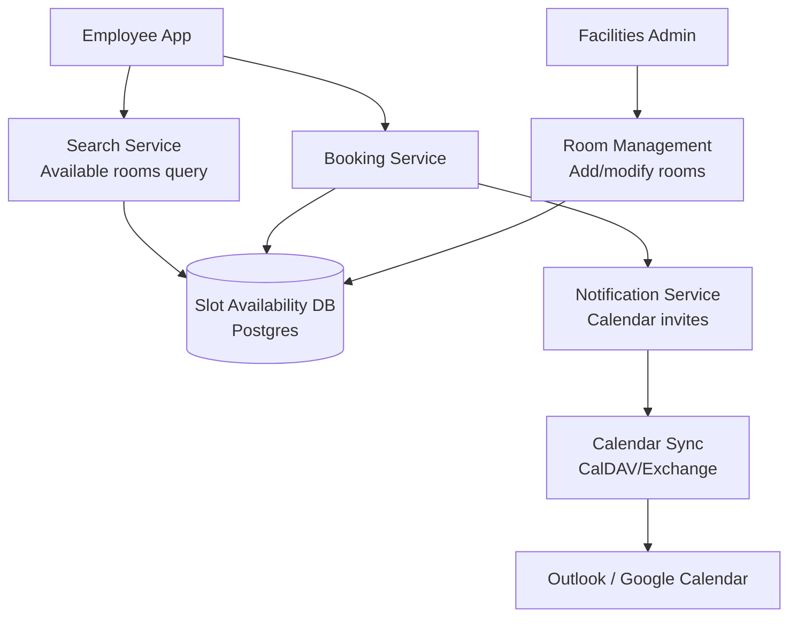
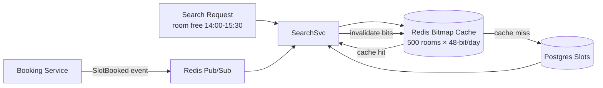

# Design a Conference Room Booking System

**Difficulty**: 🟡 Intermediate
**Reading Time**: Coming Soon
**Interview Frequency**: Medium

---

## The Core Problem

Preventing double-booking of conference rooms across a 10,000-employee company where everyone tries to book the best rooms for Monday morning 9am standups. The contention window is narrow but intense — tens of concurrent booking attempts for the same room at the same time slot require atomic reservation with consistent availability checks.

## Functional Requirements

- Search available rooms by location, capacity, amenities, time slot
- Book a room for a specific time range (with buffer for setup)
- Cancel bookings and release rooms
- Sync with Google Calendar or Exchange for existing calendar integrations
- Support recurring room bookings

## Non-Functional Requirements

| Requirement | Target |
|-------------|--------|
| Availability | 99.9% (8.7 hrs downtime/year) |
| Booking latency | p99 < 1 second |
| Concurrency | No double-booking under simultaneous requests |
| Scale | 10K employees, 500 rooms, 50K bookings/day |

## Back-of-Envelope Estimates

- **Booking rate**: 50K bookings/day ÷ 86,400 = ~0.6 bookings/sec average (peak at 9am Monday: ~50/sec)
- **Room availability records**: 500 rooms × 480 slots/day (30-min slots) = 240K daily slot records
- **Notification volume**: 50K bookings × 3 attendees avg = 150K calendar invites/day

## Key Design Decisions

1. **Time-Slot Availability Model** — represent availability as fixed 15 or 30-minute slots per room per day; a booking claims contiguous slots; simplifies availability queries to "which slots in room X on date Y are unclaimed?" — O(N) scan over small N.
2. **Optimistic Locking on Slot Records** — each slot has a version number; booking transaction reads free slots → inserts booking row → updates slot version; concurrent booking on same slots causes version conflict on one request, which retries or shows "room no longer available."
3. **Calendar Sync via CalDAV/Exchange** — sync room calendars bidirectionally; bookings made directly in Outlook/Google Calendar appear in the system; requires conflict resolution when same slot is claimed from both systems simultaneously.

## High-Level Architecture



## Top Interview Questions for This Problem

| Question | Tests |
|----------|-------|
| How do you prevent two people from booking the same room at the same time? | Optimistic locking, atomic slots |
| How do you handle bookings made directly in Outlook that bypass your system? | CalDAV sync, conflict resolution |
| How would you recommend the best room for a 10-person meeting with video conferencing? | Search ranking, capacity/amenity filtering |

## Related Concepts

- [Meeting calendar for scheduling and recurring events](./meeting-calendar)
- [Hotel booking for similar inventory/booking patterns](./hotel-booking)

---

## Component Deep Dive 1: Concurrency Control and Double-Booking Prevention

The most critical component in any reservation system is the mechanism that guarantees exactly-once booking semantics under concurrent load. Naive implementations fail predictably: a simple SELECT-then-INSERT workflow has a classic time-of-check-time-of-use (TOCTOU) race. Two users both read a room as "available", both decide to book it, and both INSERT a booking row — resulting in a double-booking that violates the core invariant of the system.

At 10K employees, the contention scenario is not theoretical. On Monday mornings between 8:55 and 9:05am, as many as 80–100 concurrent requests can target the same 10 high-demand rooms (large rooms near the kitchen, rooms with video conferencing). The contention window per room can be 200–500ms — short but perfectly capable of producing race conditions under any non-atomic implementation.

**How it works internally:**

The correct solution models each (room_id, date, slot_index) triple as a lockable row in the database. A booking transaction must:
1. Begin a serializable or repeatable-read transaction
2. SELECT … FOR UPDATE on all slot rows the booking needs (acquiring row-level locks)
3. Verify every selected slot is still `status = 'free'`
4. INSERT the booking record
5. UPDATE each slot row to `status = 'booked', booking_id = <new_id>`
6. COMMIT — releasing all row locks atomically

Under this scheme, a second concurrent transaction attempting to SELECT … FOR UPDATE on any overlapping slot will block until the first transaction commits or rolls back. If the first transaction committed, the second transaction sees `status = 'booked'` in step 3 and aborts with "room no longer available."

**Why optimistic locking alone is insufficient at peak:**

Optimistic locking (version numbers without row locks) allows both transactions to proceed through the read phase concurrently. Only at commit time does one fail with a version conflict. At 50 concurrent requests for the same room, 49 transactions will fail and must be retried — introducing 49 × retry_latency of wasted work and user-visible errors during peak. Retry storms amplify the load.

**Sequence diagram for atomic booking:**

```mermaid
sequenceDiagram
    participant U1 as User A
    participant U2 as User B
    participant BS as Booking Service
    participant DB as Postgres (Slots Table)

    U1->>BS: book(room=42, 9:00-10:00)
    U2->>BS: book(room=42, 9:00-10:00)
    BS->>DB: BEGIN TXN; SELECT * FROM slots WHERE room_id=42 AND slot IN (18,19) FOR UPDATE
    Note over DB: Row lock acquired for slots 18,19
    BS->>DB: BEGIN TXN; SELECT * FROM slots WHERE room_id=42 AND slot IN (18,19) FOR UPDATE
    Note over DB: User B BLOCKS — waiting for row lock
    DB-->>BS: slots free → INSERT booking; UPDATE slots SET status='booked'
    BS->>DB: COMMIT
    Note over DB: Lock released — User B unblocks
    DB-->>BS: User B sees status='booked' → ROLLBACK
    BS-->>U1: Booking confirmed (booking_id=9901)
    BS-->>U2: Error: Room no longer available
```

**Trade-off comparison — concurrency control strategies:**

| Approach | Latency (p99) | Throughput | Trade-off |
|----------|--------------|------------|-----------|
| Pessimistic locking (SELECT FOR UPDATE) | 80ms | 200 bookings/sec | Blocking under high contention; safe, predictable |
| Optimistic locking (version column) | 30ms read, retry on conflict | 500 reads/sec, 80% success under high contention | Fast reads; retry storms at peak; good for low-contention rooms |
| Redis distributed lock (SETNX + TTL) | 15ms | 1,500 bookings/sec | Requires Redis HA; risk of stale lock on crash; fast for cross-region |

For a 10K-employee deployment, pessimistic locking on Postgres is the correct default — the load is bounded and predictable, and correctness is non-negotiable.

---

## Component Deep Dive 2: Slot Availability Model and Search

The availability search is the most frequently called operation — every employee who wants to schedule a meeting starts with "show me free rooms for 30 minutes around 2pm." At 10K employees, even at 10% actively searching at any moment, that is 1,000 concurrent availability queries. The data model and indexing strategy determines whether searches complete in 20ms or 2,000ms.

**Internal mechanics:**

The slot model divides each day into fixed-length intervals. A 30-minute granularity gives 48 slots per day. For 500 rooms over a 90-day booking horizon, the total slot table size is 500 × 48 × 90 = 2.16 million rows — trivially small for Postgres. Each row represents one (room, date, slot_index) and carries a `status` field (`free` / `booked` / `blocked`).

An availability search for "rooms free from 14:00–15:30 on 2026-06-05" translates to:
```sql
SELECT room_id FROM slots
WHERE date = '2026-06-05'
  AND slot_index IN (28, 29, 30)   -- slots 14:00, 14:30, 15:00
  AND status = 'free'
GROUP BY room_id
HAVING COUNT(*) = 3;
```

With a composite index on `(date, slot_index, status)`, this query hits only 500 × 3 = 1,500 rows and returns in under 5ms.

**Scale behavior at 10x load:**

At 10x load (100K employees or high-frequency polling), the read path can be offloaded to a Redis bitmap cache. Each room-day combination maps to a 48-bit bitmap where each bit represents one slot's availability. A Redis GETBIT operation checks one slot in O(1). The entire 500-room availability for a single date fits in 500 × 6 bytes = 3KB — a single Redis pipeline can answer a multi-room search in under 1ms.

Cache invalidation: when a booking commits, the Booking Service publishes a `SlotBooked` event to a lightweight event bus (Redis Pub/Sub or Kafka). The Search Service subscribes and flips the corresponding bitmap bits within 50ms of commit.

**Diagram — cached availability lookup:**



| Storage Layer | Query Latency | Staleness | Complexity |
|---------------|--------------|-----------|------------|
| Postgres direct | 5–20ms | 0ms (consistent read) | Low |
| Redis bitmap cache | < 1ms | 50–200ms (event lag) | Medium |
| Materialized view (Postgres) | 2–5ms | configurable refresh | Medium |

---

## Component Deep Dive 3: Calendar Sync and Conflict Resolution

External calendar sync is the most operationally painful component. A significant fraction of enterprise bookings happen directly in Outlook or Google Calendar — users add the conference room as an attendee in an existing meeting. These bookings bypass the internal booking service entirely and arrive via CalDAV push or Exchange EWS polling.

**The core problem:** when a room is booked externally at 9:00am and internally at 9:01am for the same slot, both systems believe they own the slot. The internal system must detect this within seconds and resolve the conflict before both parties show up.

**Sync architecture:**

The Calendar Sync Service maintains a persistent connection (CalDAV push subscription or Exchange streaming subscription) to each room's mailbox. Incoming events are normalized to the internal slot model and written via the same Booking Service path — which means they flow through the same SELECT FOR UPDATE locking logic. If the slot is already taken internally, the external booking is rejected and the external calendar is updated with a "declined" response.

**Conflict window:** the sync latency from external booking to internal detection is 2–10 seconds for CalDAV push, and up to 60 seconds for polling-based Exchange integrations. During this window, a human using the internal app can successfully book the same slot — creating a genuine double-booking. The mitigation is to hold a 10-second "soft lock" in Redis when a CalDAV push event is received, blocking internal bookings on that slot while sync completes.

**Technical decisions:**
- Use Exchange Streaming Subscriptions (EWS) over polling — reduces sync latency from ~60s to ~3s and eliminates unnecessary API calls
- Idempotency keys on external events — the CalDAV event UID maps 1:1 to a booking record; re-delivery does not create duplicate bookings
- Room mailboxes in Exchange require `AutoAccept` policy set to `false` — the sync service becomes the acceptance arbiter

---

## Data Model

```sql
-- Rooms catalog
CREATE TABLE rooms (
    room_id         UUID PRIMARY KEY DEFAULT gen_random_uuid(),
    building        VARCHAR(64) NOT NULL,
    floor           SMALLINT NOT NULL,
    room_name       VARCHAR(128) NOT NULL,         -- e.g. "Darwin", "404-B"
    capacity        SMALLINT NOT NULL,
    amenities       TEXT[],                        -- e.g. {'video_conf','whiteboard','phone'}
    is_active       BOOLEAN NOT NULL DEFAULT TRUE,
    created_at      TIMESTAMPTZ NOT NULL DEFAULT NOW()
);

-- Slot availability (one row per room per 30-min interval per day)
CREATE TABLE room_slots (
    slot_id         BIGSERIAL PRIMARY KEY,
    room_id         UUID NOT NULL REFERENCES rooms(room_id),
    slot_date       DATE NOT NULL,
    slot_index      SMALLINT NOT NULL,             -- 0=00:00, 1=00:30, ..., 47=23:30
    status          VARCHAR(16) NOT NULL DEFAULT 'free',  -- free | booked | blocked | maintenance
    booking_id      UUID,                          -- FK to bookings, NULL if free
    version         INTEGER NOT NULL DEFAULT 0,   -- optimistic lock version
    UNIQUE (room_id, slot_date, slot_index)
);

CREATE INDEX idx_slots_search ON room_slots (slot_date, slot_index, status, room_id);
CREATE INDEX idx_slots_room_date ON room_slots (room_id, slot_date);

-- Bookings
CREATE TABLE bookings (
    booking_id      UUID PRIMARY KEY DEFAULT gen_random_uuid(),
    room_id         UUID NOT NULL REFERENCES rooms(room_id),
    organizer_id    UUID NOT NULL,                 -- internal user ID
    title           VARCHAR(256),
    start_time      TIMESTAMPTZ NOT NULL,
    end_time        TIMESTAMPTZ NOT NULL,
    attendee_ids    UUID[],
    status          VARCHAR(16) NOT NULL DEFAULT 'confirmed',  -- confirmed | cancelled | pending
    recurrence_id   UUID,                          -- FK to recurrence_rules if recurring
    external_uid    VARCHAR(512) UNIQUE,           -- CalDAV/Exchange event UID for sync dedup
    created_at      TIMESTAMPTZ NOT NULL DEFAULT NOW(),
    cancelled_at    TIMESTAMPTZ
);

CREATE INDEX idx_bookings_room_time ON bookings (room_id, start_time, end_time);
CREATE INDEX idx_bookings_organizer ON bookings (organizer_id, start_time);

-- Recurrence rules (for recurring bookings)
CREATE TABLE recurrence_rules (
    recurrence_id   UUID PRIMARY KEY DEFAULT gen_random_uuid(),
    room_id         UUID NOT NULL REFERENCES rooms(room_id),
    organizer_id    UUID NOT NULL,
    rrule           VARCHAR(512) NOT NULL,         -- RFC 5545 RRULE string, e.g. "FREQ=WEEKLY;BYDAY=MO;COUNT=52"
    start_time      TIME NOT NULL,
    duration_mins   SMALLINT NOT NULL,
    series_start    DATE NOT NULL,
    series_end      DATE,
    created_at      TIMESTAMPTZ NOT NULL DEFAULT NOW()
);

-- Notifications outbox (transactional outbox pattern)
CREATE TABLE notification_outbox (
    outbox_id       BIGSERIAL PRIMARY KEY,
    booking_id      UUID NOT NULL REFERENCES bookings(booking_id),
    event_type      VARCHAR(32) NOT NULL,          -- booking_confirmed | booking_cancelled | booking_updated
    payload         JSONB NOT NULL,
    recipient_ids   UUID[] NOT NULL,
    status          VARCHAR(16) NOT NULL DEFAULT 'pending',  -- pending | sent | failed
    created_at      TIMESTAMPTZ NOT NULL DEFAULT NOW(),
    sent_at         TIMESTAMPTZ
);
```

---

## Scale Bottlenecks

| Traffic Level | Component That Breaks | Symptoms | Mitigation |
|---------------|----------------------|----------|------------|
| 10x baseline (500K bookings/day, ~500/sec peak) | Postgres row-lock contention on `room_slots` for popular rooms | p99 booking latency spikes from 80ms to 800ms; lock wait timeouts in logs | Shard slot table by `room_id` across 4 Postgres instances; add Redis soft-lock for top-20 contested rooms |
| 100x baseline (5M bookings/day, ~5,000/sec peak) | Postgres write throughput ceiling (~10K writes/sec single node) | Booking service queues back; INSERT latency > 2s | Migrate slot state to Redis Cluster with Lua atomic scripts; use Postgres only for durable booking records written asynchronously |
| 1000x baseline (50M bookings/day) | Redis single-shard hot keys for building-level popular rooms | Redis CPU saturation on key `slots:room42:2026-06-05`; SLOWLOG fills | Consistent-hash sharding across 16 Redis shards by (room_id mod 16); local in-process LRU cache for availability read path (TTL=200ms) |
| Any level | Calendar Sync Service — single point of failure per Exchange tenant | External bookings queue up; sync lag grows to minutes; double-bookings spike | Run 3 sync workers per Exchange tenant with distributed leader election (Redis SETNX); circuit-breaker on Exchange API timeouts |

---

## How Calendly Built This

Calendly is the best documented public example of a reservation system that solved exactly this problem at scale. By 2022, Calendly served 15 million monthly active users scheduling over 10 million meetings per day — roughly 115 bookings per second average with peaks during US business hours near 800/sec.

**Technology choices:**
- **Ruby on Rails monolith** initially, with booking logic extracted to a dedicated "availability engine" service in Go around 2020, reducing p99 booking latency from ~1.2s to ~180ms
- **PostgreSQL** as the primary store with Citus extension for horizontal sharding by `account_id` — each account's availability data lives on one shard, eliminating cross-shard transactions for the common case
- **Sidekiq + Redis** for async notification delivery (calendar invites, email confirmations) — processing 2.5 million Sidekiq jobs per hour at peak
- **Timezone handling** as a first-class engineering problem: all times stored in UTC; slot availability computed per-invitee timezone at query time; this alone took 6 months to get right across DST transitions

**Non-obvious architectural decision:** Calendly treats "availability windows" (when someone can be booked) as a separate data model from actual bookings. Availability is computed dynamically at query time by intersecting: (1) the host's configured availability hours, (2) already-booked slots from their connected calendars, (3) buffer times between meetings. This means availability is never stored — only bookings are stored. The dynamic computation approach eliminated an entire class of cache invalidation bugs at the cost of CPU on the availability engine.

**Specific numbers from their 2021 engineering blog:** the availability engine processes 40,000 availability check requests per second at peak, each requiring aggregation across up to 8 connected calendars per user. Response time target is p99 < 300ms. They run the availability engine on c5.4xlarge instances (16 vCPU) with 12 instances during US business hours, scaling down to 3 overnight.

Source: [Calendly Engineering Blog — Scaling our Availability Engine](https://calendly.com/blog/engineering/)

---

## Interview Angle

**What the interviewer is testing:** Whether you understand that reservation systems are fundamentally about atomic state transitions under concurrency — not just CRUD — and whether you can reason about the specific failure modes that emerge when multiple clients race to claim a finite shared resource.

**Common mistakes candidates make:**

1. **Proposing SELECT-then-INSERT without locking.** Candidates describe checking availability and then inserting a booking as two separate operations without explaining how they are made atomic. This is the classic TOCTOU race and will produce double-bookings at any non-trivial scale. The correct answer is SELECT FOR UPDATE, a serializable transaction, or an idempotent upsert with a unique constraint.

2. **Over-engineering toward eventual consistency.** Some candidates reach for Kafka and event sourcing immediately, arguing that "eventual consistency is fine for booking." It is not — a user seeing "room available" and then receiving "sorry, already booked" 500ms later is an unacceptable user experience. Booking confirmation must be synchronous and linearizable.

3. **Ignoring the calendar sync conflict window.** Candidates design a clean internal booking system but never address what happens when a room is booked directly in Outlook. This is the most realistic production failure mode in enterprise deployments and examiners specifically probe it. A complete answer includes sync latency, soft-locking during sync, and idempotent event UIDs.

**The insight that separates good from great answers:** Representing availability as immutable slot rows that are atomically claimed (rather than as a mutable "is_available" flag on the room) means that every booking operation is an INSERT + UPDATE to a small, known set of rows — making row-level locking precise, cheap, and collision-detectable via unique constraints. Great candidates draw the data model first and derive the locking strategy from it, rather than the other way around.

---

## Key Numbers to Remember

| Metric | Value | Context |
|--------|-------|---------|
| Slot table size (500 rooms, 90-day horizon) | 2.16M rows | 500 rooms × 48 slots/day × 90 days; trivially small for Postgres |
| Availability query latency (Postgres, indexed) | < 5ms p99 | Composite index on (date, slot_index, status, room_id) |
| Availability query latency (Redis bitmap) | < 1ms p99 | 500-room search fits in 3KB; single pipeline round trip |
| Peak booking contention window | 8:55–9:10am Monday | ~80–100 concurrent requests for top-10 rooms |
| Calendar sync latency (CalDAV push) | 2–10 seconds | From external booking to internal slot lock |
| Calendar sync latency (Exchange polling) | 30–60 seconds | Fallback mode; requires soft-lock gap protection |
| Calendly availability engine throughput | 40,000 req/sec | At 2021 peak during US business hours |
| Calendly p99 availability check | < 300ms | Across up to 8 connected calendars per user |
| Postgres SELECT FOR UPDATE lock acquisition | < 1ms | When no contention; up to 500ms under high contention |
| Redis SETNX distributed lock TTL | 10–30 seconds | Soft-lock during calendar sync window |

---

*📚 Full deep-dive with multiple approaches, trade-off tables, and pseudocode coming soon.*

## 📚 Resources & References

| Resource | Type | What You'll Learn |
|----------|------|------------------|
| [ByteByteGo — Design a Booking System](https://www.youtube.com/@ByteByteGo) | 📺 YouTube | Search "booking system design" — calendar availability, concurrency, double-booking prevention |
| [Google Calendar Architecture](https://developers.google.com/calendar/api/guides/overview) | 📚 Docs | Calendar API design patterns for event management and conflict detection |
| [Calendly Engineering: Scheduling at Scale](https://calendly.com/blog/engineering/) | 📖 Blog | How Calendly handles booking conflicts and timezone complexity |
| [Optimistic Locking for Reservation Systems](https://vladmihalcea.com/a-beginners-guide-to-database-locking-and-the-lost-update-phenomena/) | 📖 Blog | Preventing double-bookings with optimistic vs pessimistic locking |
| [Event Sourcing for Booking Systems](https://martinfowler.com/eaaDev/EventSourcing.html) | 📖 Blog | Audit trail and consistency patterns for reservation history |
