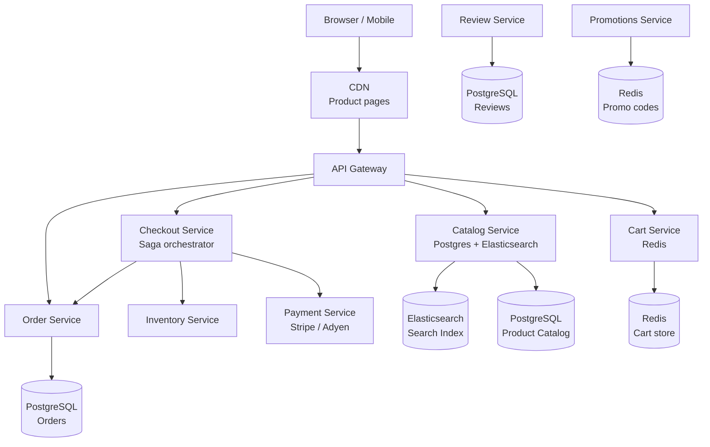
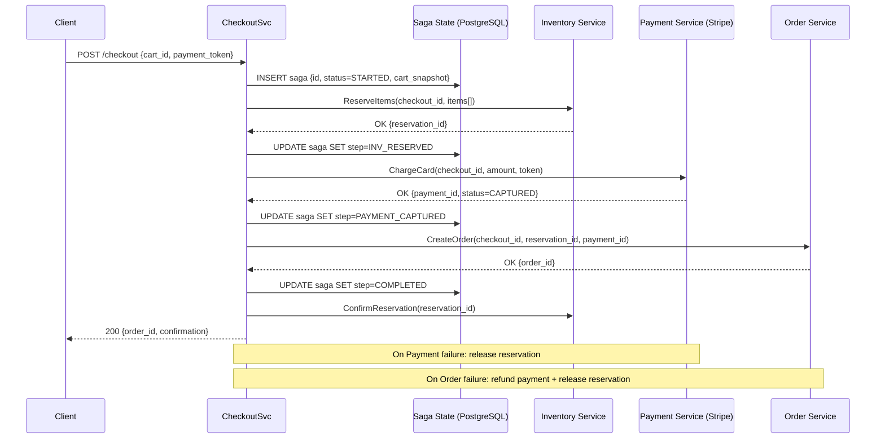
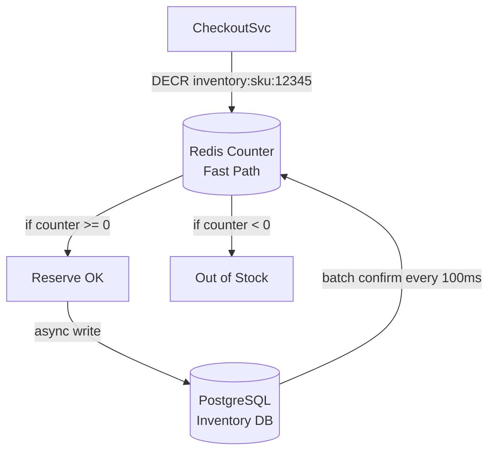

# Design an E-Commerce Platform

**Difficulty**: 🟡 Intermediate
**Reading Time**: ~30 minutes
**The Core Problem**: How do you build a platform handling 100M product listings, 10M orders/day — with a cart that persists across devices, a checkout saga that coordinates inventory + payment + order atomically, and product search that returns results in < 200ms?

---

## Table of Contents

1. [Requirements](#1-requirements)
2. [Capacity Estimation](#2-capacity-estimation)
3. [High-Level Architecture](#3-high-level-architecture)
4. [Product Catalog](#4-product-catalog)
5. [Shopping Cart](#5-shopping-cart)
6. [Checkout Saga](#6-checkout-saga)
7. [Order Management](#7-order-management)
8. [Review System](#8-review-system)
9. [Key Design Decisions](#9-key-design-decisions)
10. [Interview Questions](#10-interview-questions)
11. [Key Takeaways](#11-key-takeaways)
12. [References](#12-references)

---

## 1. Requirements

### Functional
- Browse and search 100M product catalog with filtering
- Persistent shopping cart (survives browser close, syncs across devices)
- Checkout: reserve inventory → charge payment → confirm order
- Order management and tracking
- Product reviews (1–5 stars, text, images)
- Promotions and discounts

### Non-Functional
- **Scale**: 100M products, 10M orders/day, 500M monthly active users
- **Search latency**: < 200ms
- **Cart operations**: < 50ms
- **Checkout**: < 3 seconds end-to-end
- **Availability**: 99.99% for checkout; 99.9% for browse

---

## 2. Capacity Estimation

| Metric | Estimate |
|--------|----------|
| Products | 100M |
| Orders/day | 10M |
| Peak orders/sec | 10M / 86400 × 20× peak = **2.3k orders/sec** |
| Product page views/day | 1B (100 views per order) |
| Product page QPS | 1B / 86400 × 3× = **34k QPS** |
| Search QPS | 10k QPS |
| Cart operations/sec | 50k (add/remove/view) |
| Search index size | 100M × 2KB avg doc = **200 GB** |
| Order storage/year | 10M × 365 × 1KB = **3.6 TB/year** |

---

## 3. High-Level Architecture



---

## 4. Product Catalog

### Dual Storage: PostgreSQL + Elasticsearch
```
PostgreSQL (source of truth):
  products table: id, title, description, brand, category_id, seller_id, price, status
  product_attributes: product_id, attribute_name, attribute_value (EAV model for flexible attributes)
  product_images: product_id, url, order, alt_text
  categories: tree structure (ltree extension for path queries)

Elasticsearch (search + discovery):
  Sync via Kafka: product.created/updated events → ES indexer
  Index schema:
    { id, title, description, brand, price, category_path, attributes,
      avg_rating, review_count, in_stock, seller_rating }

Search query:
{
  "query": {
    "bool": {
      "must": { "multi_match": { "query": "bluetooth headphones", "fields": ["title^3", "description"] } },
      "filter": [
        { "range": { "price": { "gte": 50, "lte": 200 } } },
        { "term": { "in_stock": true } }
      ]
    }
  },
  "sort": [{ "avg_rating": "desc" }, { "_score": "desc" }]
}
```

### Product Page Caching
```
Product detail page: 34k QPS → cache aggressively
  CDN: Cache product HTML for 5 minutes (accept slightly stale price)
  Redis: Cache product JSON for 5 minutes
  Exception: Price and stock status must be fresh (re-fetch on checkout)
```

---

## 5. Shopping Cart

### Redis Cart Storage
```
key: cart:{user_id}  (for logged-in users)
key: cart:anon:{session_id}  (for anonymous users)
type: Hash
TTL: 30 days (logged-in), 7 days (anonymous)

Cart item structure:
{
  "items": [
    { "product_id": "p123", "qty": 2, "added_at": 1711800000, "price_snapshot": 49.99 }
  ],
  "discount_code": "SAVE10",
  "last_modified": 1711900000
}
```

### Cart Operations
```
Add item: O(1)
  HSET cart:{user_id} items <updated_json>
  EXPIRE cart:{user_id} 2592000  (reset TTL on activity)

Remove item: O(1)

Get cart: O(1) — Redis HGET, then hydrate product details from catalog service

Price freshness:
  Prices in cart are snapshots (stored at time of add)
  At checkout: re-fetch current prices; if price changed → show user before confirm
  Price increase by > 10%: require explicit re-confirm
  Price decrease: apply automatically (customer-friendly)

Merge on login:
  Anonymous user adds 3 items → logs in
  Merge anonymous cart into user cart (deduplicate by product_id, keep max qty)
  Delete anonymous cart after merge
```

---

## 6. Checkout Saga

Checkout is a distributed transaction across 3 services: inventory, payment, order.

### Saga Steps (Orchestration Pattern)
```
Orchestrator: Checkout Service

Step 1 — Validate cart
  Check product prices (fresh from Catalog)
  Apply discount codes (Promotions Service)
  Calculate taxes (Tax Service)

Step 2 — Reserve inventory
  Call Inventory Service: reserve all items
  If any item out of stock → fail checkout, show user "X is no longer available"
  Compensating transaction: if later step fails → release reservations

Step 3 — Charge payment
  Call Payment Service: charge user's payment method
  Returns: { payment_id, status: success/failure }
  If payment fails → release inventory reservations → show payment error

Step 4 — Create order
  Call Order Service: create order record
  Status: CONFIRMED
  Trigger: fulfillment notification to warehouse

Step 5 — Confirm inventory
  Call Inventory Service: convert reservation to confirmed deduction
  Send order confirmation email

Rollback (compensating transactions):
  Step 3 fails → reverse Step 2 (release inventory reservation)
  Step 4 fails → reverse Step 3 (refund payment) + Step 2 (release inventory)
```

### Idempotency
```
Each saga step uses idempotency key (checkout_id):
  Payment: Stripe idempotency key = checkout_id (prevents double charge on retry)
  Order creation: unique constraint on (checkout_id) (prevents duplicate order)
  Saga stores state: which steps completed (for retry from correct step)
```

---

## 7. Order Management

```sql
CREATE TABLE orders (
  order_id        BIGSERIAL PRIMARY KEY,
  customer_id     BIGINT,
  checkout_id     UUID UNIQUE,
  status          VARCHAR(30),
  subtotal        NUMERIC(10,2),
  tax             NUMERIC(10,2),
  shipping        NUMERIC(10,2),
  total           NUMERIC(10,2),
  payment_id      VARCHAR(100),
  discount_code   VARCHAR(50),
  created_at      TIMESTAMPTZ DEFAULT NOW()
);

CREATE TABLE order_items (
  order_id    BIGINT REFERENCES orders,
  product_id  BIGINT,
  seller_id   BIGINT,
  qty         INT,
  unit_price  NUMERIC(10,2),
  subtotal    NUMERIC(10,2)
);
```

### Order State Machine
```
PENDING → CONFIRMED → PROCESSING → SHIPPED → DELIVERED
                ↘ CANCELLED (before SHIPPED)
DELIVERED → RETURN_REQUESTED → RETURNED
```

---

## 8. Review System

```
Review constraints:
  - One review per (user, product)
  - Only users who purchased can review (verified_purchase flag)
  - Reviews moderated (spam filter + manual queue for flagged content)

Rating aggregation:
  DO NOT compute average on query (expensive at 100M products)
  Pre-computed: products table has avg_rating (Float), review_count (Int)
  Updated after each review: UPDATE products SET
    avg_rating = (avg_rating * review_count + new_rating) / (review_count + 1),
    review_count = review_count + 1

Helpful votes:
  review_helpfulness: { review_id, total_votes, helpful_votes }
  Sort options: Most recent / Most helpful / Verified only
```

---

## 9. Key Design Decisions

| Decision | Option A | Option B | Choice & Reason |
|----------|----------|----------|-----------------|
| Cart persistence | Session (browser only) | Database (persisted) | **Redis persisted** — cross-device sync is table stakes; 30-day TTL balances cost vs UX |
| Checkout coordination | 2-phase commit | Saga | **Saga** — 2PC doesn't scale across microservices; saga with compensating transactions is the standard |
| Product search | PostgreSQL full-text | Elasticsearch | **Elasticsearch** — 200ms search over 100M products requires inverted index + relevance scoring |
| Inventory reservation timing | At add-to-cart | At checkout | **At checkout** — reserving at add-to-cart depletes inventory for users who never buy; checkout is the right gate |
| Payment flow | Synchronous (wait for bank) | Async (poll status) | **Synchronous with 30s timeout** — customers expect immediate confirmation; modern payment APIs (Stripe) are < 2s |

---

## 10. Interview Questions

| Question | Key Answer |
|----------|-----------|
| How do you handle a product going out of stock in someone's cart? | No reservation at cart time; re-check at checkout; show "no longer available" before payment |
| What happens if payment succeeds but order creation fails? | Saga compensating transaction: issue refund via payment API; alert ops team for manual review |
| How do you handle the Elasticsearch index being stale? | Event-driven sync via Kafka (< 5s lag); stale price shown in search, re-fetched fresh at checkout |
| How do you scale product page reads at 34k QPS? | CDN + Redis cache for product JSON; only dynamic parts (stock, reviews) fetched from DB |
| How do reviews affect search ranking? | avg_rating and review_count are Elasticsearch fields used in relevance scoring |

---

## 11. Key Takeaways

- **Dual storage** (PostgreSQL + Elasticsearch) is the canonical e-commerce pattern — Postgres for ACID, Elasticsearch for sub-200ms search
- **Saga pattern** (not 2PC) is the correct distributed transaction model for checkout across microservices
- **Cart at Redis** (not DB) with 30-day TTL handles 500M users with sub-50ms operations
- **Reserve inventory at checkout, not at cart** — avoids inventory starvation from window shoppers
- **Idempotency keys** on payment and order creation prevent double-charge on network retries

---

---

## 12. Component Deep Dive 1: Checkout Saga Orchestrator

The Checkout Saga is the most critical component in any e-commerce platform — it coordinates a distributed transaction across Inventory, Payment, and Order services without 2-phase commit. Getting this wrong means double charges, ghost orders, or inventory leaks that cost real money.

### Why Naive Approaches Fail at Scale

**Synchronous chain (naive):** CheckoutService calls Inventory → then Payment → then Order in sequence. If Payment succeeds but Order creation times out, the request fails. Does the customer get charged? Did inventory decrement? There is no rollback. At 2.3k orders/sec, this happens hundreds of times per day — resulting in revenue loss and CS tickets.

**Distributed 2-Phase Commit:** Requires a coordinator that holds locks across all three services simultaneously. At peak checkout load (2.3k orders/sec), a single slow Payment API call (Stripe P99 = 800ms) holds inventory locks for that duration. This serializes all checkouts through a lock manager — throughput collapses to < 200 orders/sec and tail latency explodes.

**Saga with Orchestration** solves this: the Checkout Service drives the saga, persists each step's outcome to its own database, and issues compensating transactions on failure. No cross-service locks. Each step is idempotent. Failure at any step triggers a well-defined rollback sequence.

### Saga Sequence Diagram



### Implementation Options

| Approach | Latency (P99) | Throughput | Trade-off |
|----------|--------------|------------|-----------|
| Orchestration Saga (single coordinator) | 2.1s | 2.5k orders/sec | Simple rollback logic; coordinator is SPOF — mitigate with leader election |
| Choreography Saga (events between services) | 2.8s | 4k orders/sec | Higher throughput; harder to debug partial failures; requires distributed tracing |
| 2-Phase Commit with XA transactions | 800ms (no rollback needed) | 200 orders/sec | Locks serialize all checkouts; does not scale past 1k orders/sec |

**Recommendation:** Orchestration Saga at this scale. It trades a small throughput ceiling for dramatically simpler failure debugging and compensation logic — critical when a bug means a customer was charged but got no order.

### Saga State Machine in PostgreSQL

```sql
CREATE TABLE saga_state (
  saga_id       UUID PRIMARY KEY DEFAULT gen_random_uuid(),
  checkout_id   UUID UNIQUE NOT NULL,
  customer_id   BIGINT NOT NULL,
  status        VARCHAR(30) NOT NULL DEFAULT 'STARTED',
  -- STARTED | INV_RESERVED | PAYMENT_CAPTURED | COMPLETED | FAILED | COMPENSATING
  current_step  VARCHAR(30),
  reservation_id VARCHAR(100),
  payment_id    VARCHAR(100),
  cart_snapshot JSONB NOT NULL,
  failure_reason TEXT,
  created_at    TIMESTAMPTZ DEFAULT NOW(),
  updated_at    TIMESTAMPTZ DEFAULT NOW()
);

CREATE INDEX idx_saga_checkout ON saga_state(checkout_id);
CREATE INDEX idx_saga_customer ON saga_state(customer_id, created_at DESC);
```

---

## 13. Component Deep Dive 2: Inventory Reservation System

Inventory is the hardest consistency problem in e-commerce. Two users viewing the last pair of shoes in size 10 can both attempt checkout simultaneously. Without proper concurrency control, both succeed — the seller ships one pair and issues a painful apology refund for the other.

### Internal Mechanics: Soft Reservations

The system maintains two quantities per SKU: `available_qty` (what customers see) and `reserved_qty` (held by in-flight checkouts). The `sellable_qty = available_qty - reserved_qty` is what drives the "In Stock" display.

**Reservation lifecycle:**
1. Checkout saga Step 2 calls `ReserveItems` → decrements `reserved_qty` (optimistic lock or SELECT FOR UPDATE)
2. If saga completes → `ConfirmReservation` decrements `available_qty` and resets `reserved_qty`
3. If saga fails or expires (timeout after 10 minutes) → `ReleaseReservation` resets `reserved_qty`

A background job sweeps expired reservations every 60 seconds — critical to prevent inventory being "stuck" from abandoned checkouts.

### Concurrency at 10x Load

At baseline (2.3k orders/sec), a single PostgreSQL node with `SELECT FOR UPDATE` on the inventory row handles contention. At 23k orders/sec (10x), the hot SKU problem emerges: a viral product with 10k concurrent checkout attempts creates 10k row-level lock queues on a single `product_sku` row. P99 latency for inventory reserve spikes from 15ms to 4+ seconds.

**Mitigation:** Inventory sharding by `sku_id % N` across N PostgreSQL replicas, combined with a Redis counter as the fast path:



Redis `DECR` is atomic and completes in < 1ms regardless of contention. The PostgreSQL write is async and batched — eventual consistency acceptable for inventory (a 200ms lag between Redis and Postgres is fine; the Redis counter is authoritative for reservations).

### Trade-off Table

| Strategy | Consistency | Latency (hot SKU) | Oversell Risk | Complexity |
|----------|-------------|-------------------|---------------|------------|
| PostgreSQL SELECT FOR UPDATE | Strong | 4s at 10x load | None | Low |
| Redis atomic DECR + async PG write | Eventual (200ms) | < 1ms always | Near-zero (Redis is authoritative) | Medium |
| Optimistic locking (version check) | Strong | High retry rate at contention | None | Medium |

**Shopify uses Redis as the inventory fast path** for flash sales (e.g., limited-edition drops where 50k users click "Buy" in the first second). Their engineering blog describes using Redis sorted sets to implement "virtual queues" during drops — only top N users are allowed through to checkout, preventing inventory system overload.

---

## 14. Component Deep Dive 3: Product Search with Elasticsearch

Search is the primary product discovery surface — 60–80% of purchases start with a search query. At 10k QPS over a 100M-product index, Elasticsearch must return relevant results in < 200ms including network round-trip.

### Why PostgreSQL Full-Text Search Fails Here

PostgreSQL `tsvector` with GIN index handles full-text search, but has three critical limitations at this scale:

1. **Relevance scoring**: PostgreSQL's `ts_rank` is basic. It cannot score by field weight (title vs description), boost by `avg_rating`, or personalize by user history.
2. **Faceted filtering**: "Show me headphones under $100 with 4+ stars in the Bluetooth category" requires aggregations across 100M docs. PostgreSQL's query planner makes wrong cardinality estimates → full table scans at large scale.
3. **Index size and RAM**: A 200 GB Elasticsearch index is split across shards (e.g., 10 primary shards × 20 GB each). Elasticsearch keeps frequently-accessed shard segments in OS page cache. PostgreSQL GIN indexes are monolithic — can't shard the index without application-level partitioning.

### Elasticsearch Index Configuration

```json
{
  "settings": {
    "number_of_shards": 10,
    "number_of_replicas": 1,
    "index.refresh_interval": "5s"
  },
  "mappings": {
    "properties": {
      "product_id":    { "type": "keyword" },
      "title":         { "type": "text", "boost": 3.0, "analyzer": "english" },
      "description":   { "type": "text", "analyzer": "english" },
      "brand":         { "type": "keyword" },
      "category_path": { "type": "keyword" },
      "price":         { "type": "scaled_float", "scaling_factor": 100 },
      "avg_rating":    { "type": "half_float" },
      "review_count":  { "type": "integer" },
      "in_stock":      { "type": "boolean" },
      "seller_rating": { "type": "half_float" },
      "attributes":    { "type": "flattened" }
    }
  }
}
```

Key decisions: `refresh_interval: 5s` (new products visible within 5 seconds, reduces indexing overhead by 5×); `scaled_float` for price (avoids floating-point precision issues in range queries); `flattened` for attributes (avoids mapping explosion from 1000s of unique attribute keys across 100M products).

### Sync Pipeline: PostgreSQL → Kafka → Elasticsearch

```
Product created/updated in PostgreSQL
  → Debezium CDC captures WAL change
  → Publishes to Kafka topic: product.events
  → ES Indexer consumer: transform + bulk index (batch 500 docs, flush every 500ms)
  → Elasticsearch index updated within 5s of DB change
```

Lag budget: 5s end-to-end (Debezium + Kafka + batch indexing). This means a new product is searchable within 5 seconds of creation — acceptable for most use cases. For "instantly searchable" requirements (e.g., seller just added a flash-sale product), a direct index call bypasses the pipeline with < 500ms visibility.

---

## 15. Data Model

### Full Schema

```sql
-- Product Catalog (PostgreSQL)
CREATE TABLE products (
  product_id    BIGSERIAL PRIMARY KEY,
  seller_id     BIGINT NOT NULL,
  category_id   INT NOT NULL,
  title         VARCHAR(500) NOT NULL,
  description   TEXT,
  brand         VARCHAR(200),
  base_price    NUMERIC(10,2) NOT NULL,
  status        VARCHAR(20) DEFAULT 'ACTIVE', -- ACTIVE | INACTIVE | DELETED
  avg_rating    NUMERIC(3,2) DEFAULT 0,
  review_count  INT DEFAULT 0,
  created_at    TIMESTAMPTZ DEFAULT NOW(),
  updated_at    TIMESTAMPTZ DEFAULT NOW()
);

CREATE INDEX idx_products_seller ON products(seller_id);
CREATE INDEX idx_products_category ON products(category_id);
CREATE INDEX idx_products_status ON products(status) WHERE status = 'ACTIVE';

CREATE TABLE product_skus (
  sku_id        BIGSERIAL PRIMARY KEY,
  product_id    BIGINT REFERENCES products(product_id),
  sku_code      VARCHAR(100) UNIQUE NOT NULL,  -- seller's SKU code
  variant_attrs JSONB,  -- {"color": "black", "size": "L"}
  price         NUMERIC(10,2),  -- overrides base_price if set
  weight_grams  INT,
  available_qty INT NOT NULL DEFAULT 0,
  reserved_qty  INT NOT NULL DEFAULT 0,
  version       BIGINT DEFAULT 0  -- optimistic lock version
);

CREATE INDEX idx_skus_product ON product_skus(product_id);

-- Inventory Reservations
CREATE TABLE inventory_reservations (
  reservation_id  UUID PRIMARY KEY DEFAULT gen_random_uuid(),
  checkout_id     UUID NOT NULL,
  sku_id          BIGINT NOT NULL,
  qty_reserved    INT NOT NULL,
  status          VARCHAR(20) DEFAULT 'PENDING',  -- PENDING | CONFIRMED | RELEASED
  expires_at      TIMESTAMPTZ NOT NULL,  -- NOW() + 10 minutes
  created_at      TIMESTAMPTZ DEFAULT NOW()
);

CREATE INDEX idx_reservations_checkout ON inventory_reservations(checkout_id);
CREATE INDEX idx_reservations_expiry ON inventory_reservations(expires_at) WHERE status = 'PENDING';

-- Orders
CREATE TABLE orders (
  order_id        BIGSERIAL PRIMARY KEY,
  customer_id     BIGINT NOT NULL,
  checkout_id     UUID UNIQUE NOT NULL,
  status          VARCHAR(30) NOT NULL DEFAULT 'CONFIRMED',
  subtotal        NUMERIC(10,2) NOT NULL,
  discount_amount NUMERIC(10,2) DEFAULT 0,
  tax_amount      NUMERIC(10,2) NOT NULL,
  shipping_amount NUMERIC(10,2) NOT NULL,
  total_amount    NUMERIC(10,2) NOT NULL,
  currency_code   CHAR(3) DEFAULT 'USD',
  payment_id      VARCHAR(200) NOT NULL,
  shipping_addr   JSONB NOT NULL,
  discount_code   VARCHAR(50),
  created_at      TIMESTAMPTZ DEFAULT NOW(),
  updated_at      TIMESTAMPTZ DEFAULT NOW()
);

CREATE INDEX idx_orders_customer ON orders(customer_id, created_at DESC);
CREATE INDEX idx_orders_status ON orders(status, updated_at DESC);

CREATE TABLE order_items (
  order_item_id   BIGSERIAL PRIMARY KEY,
  order_id        BIGINT REFERENCES orders(order_id),
  sku_id          BIGINT NOT NULL,
  product_id      BIGINT NOT NULL,
  seller_id       BIGINT NOT NULL,
  product_title   VARCHAR(500) NOT NULL,  -- snapshot at purchase time
  sku_attrs       JSONB,                  -- snapshot: {"color": "black", "size": "L"}
  unit_price      NUMERIC(10,2) NOT NULL,
  qty             INT NOT NULL,
  line_total      NUMERIC(10,2) NOT NULL
);

CREATE INDEX idx_order_items_order ON order_items(order_id);
CREATE INDEX idx_order_items_seller ON order_items(seller_id, order_id);

-- Reviews
CREATE TABLE product_reviews (
  review_id       BIGSERIAL PRIMARY KEY,
  product_id      BIGINT REFERENCES products(product_id),
  customer_id     BIGINT NOT NULL,
  order_id        BIGINT,  -- NULL if not a verified purchase
  rating          SMALLINT NOT NULL CHECK (rating BETWEEN 1 AND 5),
  title           VARCHAR(200),
  body            TEXT,
  is_verified     BOOLEAN DEFAULT FALSE,
  helpful_votes   INT DEFAULT 0,
  total_votes     INT DEFAULT 0,
  status          VARCHAR(20) DEFAULT 'PUBLISHED',  -- PUBLISHED | PENDING | REMOVED
  created_at      TIMESTAMPTZ DEFAULT NOW()
);

CREATE UNIQUE INDEX idx_reviews_unique_user_product ON product_reviews(customer_id, product_id);
CREATE INDEX idx_reviews_product ON product_reviews(product_id, status, created_at DESC);

-- Redis key patterns (documentation)
-- cart:{user_id}              Hash, TTL 30 days
-- cart:anon:{session_id}      Hash, TTL 7 days
-- inventory:sku:{sku_id}      String (integer counter), TTL none
-- product:cache:{product_id}  String (JSON), TTL 5 minutes
-- promo:{code}                String (JSON), TTL = promo expiry
```

---

## 16. Scale Bottlenecks

| Traffic Level | Component That Breaks | Symptoms | Mitigation |
|---------------|----------------------|----------|------------|
| 2× baseline (4.6k orders/sec) | Checkout Saga DB (saga_state writes) | saga_state INSERT latency > 500ms; checkout P99 > 5s | Partition saga_state by checkout_id % 8; use connection pooler (PgBouncer) |
| 5× baseline (11.5k orders/sec) | Inventory PostgreSQL (hot SKU row locks) | InventoryService timeouts; SELECT FOR UPDATE queue depth grows | Add Redis atomic DECR as fast path; async PG write for confirmation |
| 10× baseline (23k orders/sec) | Elasticsearch cluster (search QPS = 100k) | Search P99 > 500ms; ES GC pauses; heap pressure | Scale ES to 30 nodes; add search result Redis cache (TTL 30s) for top 10k queries |
| 50× baseline (115k orders/sec) | API Gateway + CartSvc Redis | Redis single-node CPU saturation; cart op latency > 50ms | Redis Cluster (16 shards by user_id); API Gateway horizontal scale |
| 100× baseline (230k orders/sec) | Payment provider rate limits | Stripe returns 429s; checkout failure rate > 5% | Multi-PSP routing (Stripe + Adyen + Braintree); queue-based checkout with async confirmation |
| 1000× baseline (viral event / flash sale) | Entire checkout funnel | All services overwhelmed; DB connection exhaustion | Virtual queue (users assigned positions); shed load; pre-scale 30 min before scheduled sale |

---

## 17. How Shopify Built This

Shopify is the best-documented e-commerce platform at scale, with engineering blog posts covering exactly these architectural problems.

**Scale**: As of 2023, Shopify processes over 1M orders/day on busy days (e.g., BFCM 2023 hit a peak of **5.1M orders in a single hour**, or ~1.4k orders/sec — comparable to the mid-range of our capacity model). Their platform serves 2M+ merchants with a single multi-tenant architecture.

**Technology choices:**
- **Ruby on Rails monolith → modular monolith**: Shopify did NOT decompose into microservices. Instead, they built "component boundaries" inside a Rails monolith, using their open-source `Packwerk` tool to enforce dependency rules. This avoided the operational complexity of 50+ microservices while retaining separation of concerns.
- **MySQL (not PostgreSQL)**: All transactional data is MySQL 8.0, horizontally sharded by `shop_id`. Each shard holds all data for a specific shop — this is the "shop pod" model. A viral shop's orders don't contend with other shops.
- **Redis for cart and sessions**: Cart data in Redis, consistent with the design above.
- **Kafka for event streaming**: Product catalog changes, order events, inventory updates all flow through Kafka topics consumed by search indexers and downstream services.
- **Lua scripts in Redis for flash sale inventory**: During limited-edition product drops, Shopify uses Redis Lua scripts for atomic inventory decrements, making the decrement-and-check operation a single Redis round trip (< 1ms). This is the key insight that allows them to handle 100k concurrent users clicking "Buy" on a single product without overselling.

**Non-obvious architectural decision**: Shopify's "checkout fence" — all checkouts for a shop are serialized through a per-shop Redis lock during flash sales. This sounds like a scalability anti-pattern, but for a specific shop with a viral product, it prevents the thundering herd from hammering that shop's MySQL shard. The lock is held for < 50ms per checkout (just long enough to decrement inventory), so throughput for a single shop peaks around 20k checkouts/sec — more than sufficient for any single seller.

**Source**: [Shopify Engineering — Caching Strategies for High-Performance E-Commerce](https://shopify.engineering/performance-at-scale) and BFCM infrastructure post-mortems published annually.

---

## 18. Interview Angle

**What the interviewer is testing:** Whether you can handle the distributed transaction problem (checkout saga) without reaching for 2PC, and whether you understand inventory consistency trade-offs under contention.

**Common mistakes candidates make:**

1. **"I'll use a distributed transaction / 2PC for checkout"** — 2PC requires a coordinator that holds locks across all services. At 2.3k orders/sec with 800ms payment latency, the lock manager becomes a serialization bottleneck. Throughput collapses. The correct answer is Saga with compensating transactions.

2. **"I'll reserve inventory when items are added to the cart"** — This causes inventory starvation. If 100k users add a popular item to their carts, the inventory shows 0 even though 99k users will never actually buy. Amazon, Shopify, and every major platform reserves at checkout, not at cart-add.

3. **"I'll use a single PostgreSQL for everything including search"** — At 100M products, PostgreSQL full-text search fails on relevance scoring, faceted aggregations, and index sharding. Elasticsearch is the standard answer; candidates should explain WHY (inverted index, field boosting, aggregation performance) not just WHAT.

**The insight that separates good from great answers:** Explaining that the Elasticsearch index can be eventually consistent (5-second lag from Kafka sync) because price shown in search is always re-validated at checkout time. This means you can tolerate stale search data with zero risk of incorrect charges — the checkout saga re-fetches current price from PostgreSQL regardless of what ES shows. Great candidates articulate this "read path vs. write path consistency" boundary explicitly.

---

## 19. Key Numbers to Remember

| Metric | Value | Context |
|--------|-------|---------|
| Peak orders/sec | 2,300 | 10M orders/day × 20× peak factor |
| Product page QPS | 34,000 | 1B page views/day × 3× peak |
| Cart operation latency | < 50ms P99 | Redis Hash GET/SET |
| Checkout E2E latency | < 3s | Including Stripe API call (P99 ~800ms) |
| Search latency | < 200ms | Elasticsearch over 100M-doc index |
| Elasticsearch index size | 200 GB | 100M products × 2 KB avg document |
| Inventory reservation TTL | 10 minutes | Abandoned checkout auto-release window |
| Cart TTL (logged-in) | 30 days | Redis TTL reset on each activity |
| Kafka lag (search sync) | < 5 seconds | Debezium CDC → ES indexer pipeline |
| Shopify BFCM 2023 peak | 5.1M orders/hour (~1,417/sec) | Real production benchmark for comparison |

---

## 📚 Resources & References

| Resource | Type | What You'll Learn |
|----------|------|------------------|
| [Amazon Architecture — High Scalability](https://highscalability.com/amazon-architecture/) | 📖 Blog | Amazon's evolution from monolith to microservices |
| [Shopify Engineering Blog](https://shopify.engineering/) | 📖 Blog | Cart, checkout, and inventory at Shopify scale |
| [ByteByteGo — E-Commerce Design](https://www.youtube.com/@ByteByteGo) | 📺 YouTube | End-to-end e-commerce system walkthrough |
| [Designing Microservices — Sam Newman](https://samnewman.io/books/building_microservices/) | 📚 Book | Saga pattern and service decomposition strategies |
