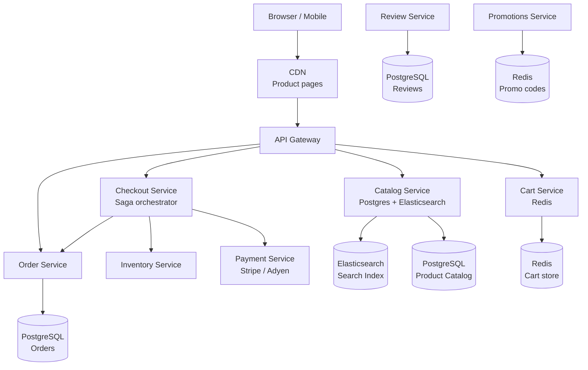

# Design an E-Commerce Platform

**Difficulty**: 🟡 Intermediate
**Reading Time**: ~30 minutes
**The Core Problem**: How do you build a platform handling 100M product listings, 10M orders/day — with a cart that persists across devices, a checkout saga that coordinates inventory + payment + order atomically, and product search that returns results in < 200ms?

---

## Table of Contents

1. [Requirements](#1-requirements)
2. [Capacity Estimation](#2-capacity-estimation)
3. [High-Level Architecture](#3-high-level-architecture)
4. [Product Catalog](#4-product-catalog)
5. [Shopping Cart](#5-shopping-cart)
6. [Checkout Saga](#6-checkout-saga)
7. [Order Management](#7-order-management)
8. [Review System](#8-review-system)
9. [Key Design Decisions](#9-key-design-decisions)
10. [Interview Questions](#10-interview-questions)
11. [Key Takeaways](#11-key-takeaways)
12. [References](#12-references)

---

## 1. Requirements

### Functional
- Browse and search 100M product catalog with filtering
- Persistent shopping cart (survives browser close, syncs across devices)
- Checkout: reserve inventory → charge payment → confirm order
- Order management and tracking
- Product reviews (1–5 stars, text, images)
- Promotions and discounts

### Non-Functional
- **Scale**: 100M products, 10M orders/day, 500M monthly active users
- **Search latency**: < 200ms
- **Cart operations**: < 50ms
- **Checkout**: < 3 seconds end-to-end
- **Availability**: 99.99% for checkout; 99.9% for browse

---

## 2. Capacity Estimation

| Metric | Estimate |
|--------|----------|
| Products | 100M |
| Orders/day | 10M |
| Peak orders/sec | 10M / 86400 × 20× peak = **2.3k orders/sec** |
| Product page views/day | 1B (100 views per order) |
| Product page QPS | 1B / 86400 × 3× = **34k QPS** |
| Search QPS | 10k QPS |
| Cart operations/sec | 50k (add/remove/view) |
| Search index size | 100M × 2KB avg doc = **200 GB** |
| Order storage/year | 10M × 365 × 1KB = **3.6 TB/year** |

---

## 3. High-Level Architecture



---

## 4. Product Catalog

### Dual Storage: PostgreSQL + Elasticsearch
```
PostgreSQL (source of truth):
  products table: id, title, description, brand, category_id, seller_id, price, status
  product_attributes: product_id, attribute_name, attribute_value (EAV model for flexible attributes)
  product_images: product_id, url, order, alt_text
  categories: tree structure (ltree extension for path queries)

Elasticsearch (search + discovery):
  Sync via Kafka: product.created/updated events → ES indexer
  Index schema:
    { id, title, description, brand, price, category_path, attributes,
      avg_rating, review_count, in_stock, seller_rating }

Search query:
{
  "query": {
    "bool": {
      "must": { "multi_match": { "query": "bluetooth headphones", "fields": ["title^3", "description"] } },
      "filter": [
        { "range": { "price": { "gte": 50, "lte": 200 } } },
        { "term": { "in_stock": true } }
      ]
    }
  },
  "sort": [{ "avg_rating": "desc" }, { "_score": "desc" }]
}
```

### Product Page Caching
```
Product detail page: 34k QPS → cache aggressively
  CDN: Cache product HTML for 5 minutes (accept slightly stale price)
  Redis: Cache product JSON for 5 minutes
  Exception: Price and stock status must be fresh (re-fetch on checkout)
```

---

## 5. Shopping Cart

### Redis Cart Storage
```
key: cart:{user_id}  (for logged-in users)
key: cart:anon:{session_id}  (for anonymous users)
type: Hash
TTL: 30 days (logged-in), 7 days (anonymous)

Cart item structure:
{
  "items": [
    { "product_id": "p123", "qty": 2, "added_at": 1711800000, "price_snapshot": 49.99 }
  ],
  "discount_code": "SAVE10",
  "last_modified": 1711900000
}
```

### Cart Operations
```
Add item: O(1)
  HSET cart:{user_id} items <updated_json>
  EXPIRE cart:{user_id} 2592000  (reset TTL on activity)

Remove item: O(1)

Get cart: O(1) — Redis HGET, then hydrate product details from catalog service

Price freshness:
  Prices in cart are snapshots (stored at time of add)
  At checkout: re-fetch current prices; if price changed → show user before confirm
  Price increase by > 10%: require explicit re-confirm
  Price decrease: apply automatically (customer-friendly)

Merge on login:
  Anonymous user adds 3 items → logs in
  Merge anonymous cart into user cart (deduplicate by product_id, keep max qty)
  Delete anonymous cart after merge
```

---

## 6. Checkout Saga

Checkout is a distributed transaction across 3 services: inventory, payment, order.

### Saga Steps (Orchestration Pattern)
```
Orchestrator: Checkout Service

Step 1 — Validate cart
  Check product prices (fresh from Catalog)
  Apply discount codes (Promotions Service)
  Calculate taxes (Tax Service)

Step 2 — Reserve inventory
  Call Inventory Service: reserve all items
  If any item out of stock → fail checkout, show user "X is no longer available"
  Compensating transaction: if later step fails → release reservations

Step 3 — Charge payment
  Call Payment Service: charge user's payment method
  Returns: { payment_id, status: success/failure }
  If payment fails → release inventory reservations → show payment error

Step 4 — Create order
  Call Order Service: create order record
  Status: CONFIRMED
  Trigger: fulfillment notification to warehouse

Step 5 — Confirm inventory
  Call Inventory Service: convert reservation to confirmed deduction
  Send order confirmation email

Rollback (compensating transactions):
  Step 3 fails → reverse Step 2 (release inventory reservation)
  Step 4 fails → reverse Step 3 (refund payment) + Step 2 (release inventory)
```

### Idempotency
```
Each saga step uses idempotency key (checkout_id):
  Payment: Stripe idempotency key = checkout_id (prevents double charge on retry)
  Order creation: unique constraint on (checkout_id) (prevents duplicate order)
  Saga stores state: which steps completed (for retry from correct step)
```

---

## 7. Order Management

```sql
CREATE TABLE orders (
  order_id        BIGSERIAL PRIMARY KEY,
  customer_id     BIGINT,
  checkout_id     UUID UNIQUE,
  status          VARCHAR(30),
  subtotal        NUMERIC(10,2),
  tax             NUMERIC(10,2),
  shipping        NUMERIC(10,2),
  total           NUMERIC(10,2),
  payment_id      VARCHAR(100),
  discount_code   VARCHAR(50),
  created_at      TIMESTAMPTZ DEFAULT NOW()
);

CREATE TABLE order_items (
  order_id    BIGINT REFERENCES orders,
  product_id  BIGINT,
  seller_id   BIGINT,
  qty         INT,
  unit_price  NUMERIC(10,2),
  subtotal    NUMERIC(10,2)
);
```

### Order State Machine
```
PENDING → CONFIRMED → PROCESSING → SHIPPED → DELIVERED
                ↘ CANCELLED (before SHIPPED)
DELIVERED → RETURN_REQUESTED → RETURNED
```

---

## 8. Review System

```
Review constraints:
  - One review per (user, product)
  - Only users who purchased can review (verified_purchase flag)
  - Reviews moderated (spam filter + manual queue for flagged content)

Rating aggregation:
  DO NOT compute average on query (expensive at 100M products)
  Pre-computed: products table has avg_rating (Float), review_count (Int)
  Updated after each review: UPDATE products SET
    avg_rating = (avg_rating * review_count + new_rating) / (review_count + 1),
    review_count = review_count + 1

Helpful votes:
  review_helpfulness: { review_id, total_votes, helpful_votes }
  Sort options: Most recent / Most helpful / Verified only
```

---

## 9. Key Design Decisions

| Decision | Option A | Option B | Choice & Reason |
|----------|----------|----------|-----------------|
| Cart persistence | Session (browser only) | Database (persisted) | **Redis persisted** — cross-device sync is table stakes; 30-day TTL balances cost vs UX |
| Checkout coordination | 2-phase commit | Saga | **Saga** — 2PC doesn't scale across microservices; saga with compensating transactions is the standard |
| Product search | PostgreSQL full-text | Elasticsearch | **Elasticsearch** — 200ms search over 100M products requires inverted index + relevance scoring |
| Inventory reservation timing | At add-to-cart | At checkout | **At checkout** — reserving at add-to-cart depletes inventory for users who never buy; checkout is the right gate |
| Payment flow | Synchronous (wait for bank) | Async (poll status) | **Synchronous with 30s timeout** — customers expect immediate confirmation; modern payment APIs (Stripe) are < 2s |

---

## 10. Interview Questions

| Question | Key Answer |
|----------|-----------|
| How do you handle a product going out of stock in someone's cart? | No reservation at cart time; re-check at checkout; show "no longer available" before payment |
| What happens if payment succeeds but order creation fails? | Saga compensating transaction: issue refund via payment API; alert ops team for manual review |
| How do you handle the Elasticsearch index being stale? | Event-driven sync via Kafka (< 5s lag); stale price shown in search, re-fetched fresh at checkout |
| How do you scale product page reads at 34k QPS? | CDN + Redis cache for product JSON; only dynamic parts (stock, reviews) fetched from DB |
| How do reviews affect search ranking? | avg_rating and review_count are Elasticsearch fields used in relevance scoring |

---

## 11. Key Takeaways

- **Dual storage** (PostgreSQL + Elasticsearch) is the canonical e-commerce pattern — Postgres for ACID, Elasticsearch for sub-200ms search
- **Saga pattern** (not 2PC) is the correct distributed transaction model for checkout across microservices
- **Cart at Redis** (not DB) with 30-day TTL handles 500M users with sub-50ms operations
- **Reserve inventory at checkout, not at cart** — avoids inventory starvation from window shoppers
- **Idempotency keys** on payment and order creation prevent double-charge on network retries

---

## 📚 Resources & References

| Resource | Type | What You'll Learn |
|----------|------|------------------|
| [Amazon Architecture — High Scalability](https://highscalability.com/amazon-architecture/) | 📖 Blog | Amazon's evolution from monolith to microservices |
| [Shopify Engineering Blog](https://shopify.engineering/) | 📖 Blog | Cart, checkout, and inventory at Shopify scale |
| [ByteByteGo — E-Commerce Design](https://www.youtube.com/@ByteByteGo) | 📺 YouTube | End-to-end e-commerce system walkthrough |
| [Designing Microservices — Sam Newman](https://samnewman.io/books/building_microservices/) | 📚 Book | Saga pattern and service decomposition strategies |
