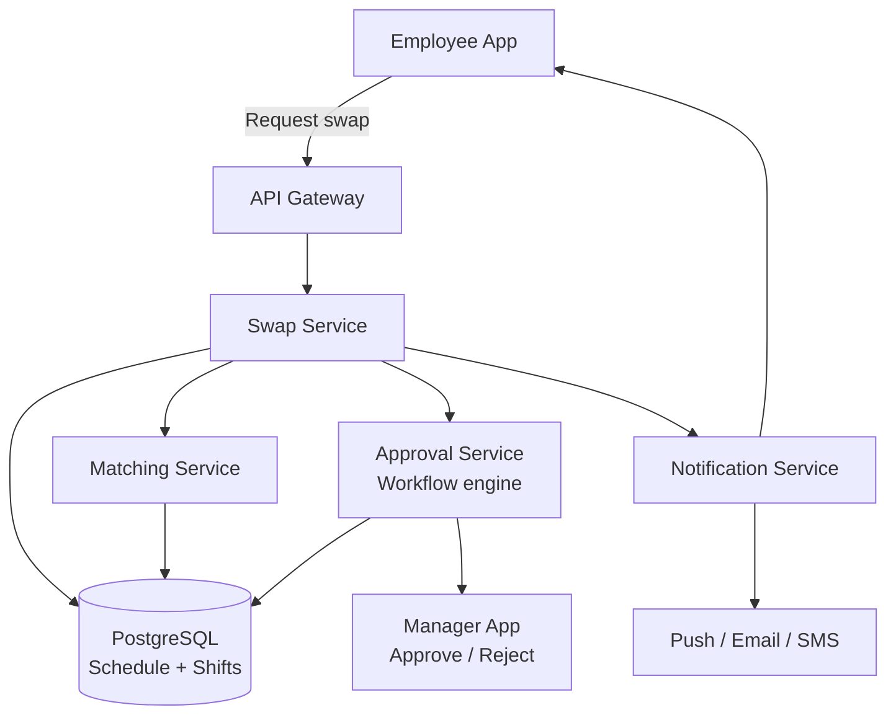

# Design an Employee Shift Swap System

**Difficulty**: 🟢 Beginner
**Reading Time**: ~20 minutes
**The Core Problem**: How do you allow 50k employees to request shift swaps with matching, conflict detection, manager approval, and schedule update — all without creating scheduling gaps or overtime violations?

---

## Table of Contents

1. [Requirements](#1-requirements)
2. [Capacity Estimation](#2-capacity-estimation)
3. [High-Level Architecture](#3-high-level-architecture)
4. [Data Model](#4-data-model)
5. [Matching Algorithm](#5-matching-algorithm)
6. [Approval Workflow](#6-approval-workflow)
7. [Conflict Detection](#7-conflict-detection)
8. [Notification Pipeline](#8-notification-pipeline)
9. [Key Design Decisions](#9-key-design-decisions)
10. [Interview Questions](#10-interview-questions)
11. [Key Takeaways](#11-key-takeaways)
12. [References](#12-references)

---

## 1. Requirements

### Functional
- Employee posts shift they want to give up (with optional desired swap shift)
- System matches with eligible swap partners
- Both employees must agree to swap
- Manager approves or rejects
- Schedule automatically updated on approval
- Notifications at each step

### Non-Functional
- **Scale**: 50k employees, 10k shifts/day, 500 swap requests/day
- **Latency**: Matching results returned < 1 second
- **Correctness**: No double-booking, no overtime rule violations after swap

---

## 2. Capacity Estimation

| Metric | Estimate |
|--------|----------|
| Employees | 50k |
| Departments | 500 (avg 100 employees each) |
| Shifts/day | 10k |
| Swap requests/day | 500 |
| Notifications/day | 500 × 5 events × 2 parties = **5,000/day** |
| Schedule DB size | 50k employees × 365 days × 1 row = **18M rows/year** |
| Concurrent active swaps | ~100 at any time |

---

## 3. High-Level Architecture



---

## 4. Data Model

```sql
-- Core schedules table
CREATE TABLE schedules (
  schedule_id   BIGSERIAL PRIMARY KEY,
  employee_id   BIGINT,
  department_id INT,
  shift_date    DATE,
  shift_start   TIME,
  shift_end     TIME,
  role          VARCHAR(50),   -- 'cashier', 'supervisor', 'driver'
  status        VARCHAR(20) DEFAULT 'active',
  created_at    TIMESTAMPTZ DEFAULT NOW()
);

CREATE INDEX ON schedules(employee_id, shift_date);
CREATE INDEX ON schedules(department_id, shift_date, role);

-- Swap requests
CREATE TABLE swap_requests (
  request_id     BIGSERIAL PRIMARY KEY,
  requester_id   BIGINT,                      -- employee giving up shift
  requester_schedule_id BIGINT,               -- their shift to swap
  desired_schedule_id   BIGINT,               -- shift they want (null = open request)
  status         VARCHAR(30) DEFAULT 'OPEN',  -- OPEN, MATCHED, PENDING_APPROVAL, APPROVED, REJECTED, CANCELLED
  created_at     TIMESTAMPTZ DEFAULT NOW(),
  expires_at     TIMESTAMPTZ                  -- auto-close if no swap found
);

-- Swap matches (when a candidate is found)
CREATE TABLE swap_matches (
  match_id       BIGSERIAL PRIMARY KEY,
  request_id     BIGINT REFERENCES swap_requests,
  candidate_id   BIGINT,   -- employee offering to take the shift
  candidate_schedule_id BIGINT,
  candidate_accepted  BOOL DEFAULT NULL,  -- null = pending, true/false = responded
  manager_decision    VARCHAR(20),        -- APPROVED, REJECTED, PENDING
  created_at     TIMESTAMPTZ DEFAULT NOW()
);
```

---

## 5. Matching Algorithm

### Eligibility Criteria for Swap Partner
```
For employee A wanting to swap Shift-X (Mon 9am–5pm, Cashier):
  Find employees B where:
    1. B is in same department (or cross-training allows cross-dept)
    2. B has the same role OR is qualified for the role
    3. B is scheduled on Shift-Y that A can cover (matching role)
    4. B is NOT already scheduled on both shift dates (double-booking check)
    5. Swap would not cause B to exceed 40hr weekly limit (overtime check)
    6. Swap would not violate minimum rest period (8hr between shifts)
    7. B has marked themselves as available to swap (opt-in)

SQL query for candidates:
  SELECT s.employee_id, s.schedule_id, s.shift_date, s.shift_start, s.shift_end
  FROM schedules s
  JOIN employees e ON s.employee_id = e.id
  WHERE s.department_id = requester.department_id
    AND s.role = requester_shift.role
    AND s.shift_date != requester_shift.shift_date
    AND s.employee_id != requester.employee_id
    AND NOT EXISTS (  -- not already scheduled on requester's date
      SELECT 1 FROM schedules s2
      WHERE s2.employee_id = s.employee_id AND s2.shift_date = requester_shift.date
    )
    AND e.swap_opt_in = true
  LIMIT 10;  -- show top 10 candidates
```

### Open Marketplace Mode
```
If requester doesn't specify desired shift:
  Post as "open swap": I need to give away [Mon 9am shift]
  Any eligible employee can claim it
  First to accept → match created

Direct swap mode:
  Requester specifies [I want Bob's Thu 2pm shift]
  Bob receives direct notification: "Alice wants to swap with your Thu 2pm shift"
  Bob accepts/declines
```

---

## 6. Approval Workflow

```
State machine:
  OPEN
    ↓ (candidate found and both agree)
  PENDING_APPROVAL
    ↓ (manager approves)
  APPROVED ──→ Schedule updated
    ↓ (manager rejects)
  REJECTED ──→ Return to OPEN (requester can try another candidate)

Approval SLA:
  Manager has 48 hours to respond before auto-escalation to next manager
  If urgent (shift within 24 hours): 4-hour SLA, notify supervisor if no response

Manager view:
  See request: "Alice wants to swap Mon 9am shift ↔ Bob's Thu 2pm shift"
  One-click approve/reject with optional comment
  System shows: "Hours impact: Alice 0h change, Bob 0h change"
  System shows: "Overtime risk: None"
```

---

## 7. Conflict Detection

All checks run **before** swap is submitted for approval.

```
Check 1 — Double-booking:
  After swap, does either employee work two overlapping shifts on same day?
  SELECT ... WHERE date = swap_date AND employee_id IN (alice_id, bob_id)
  Must return at most 1 row per employee per date

Check 2 — Weekly overtime (US: 40hrs/week):
  alice_new_weekly_hours = sum of hours in Alice's new schedule this week
  bob_new_weekly_hours = same for Bob
  If either exceeds 40 hours → flag (require manager override)

Check 3 — Minimum rest period (8 hours between shifts):
  Check if Alice's previous shift on same day and new Bob-shift start time
  have at least 8 hours gap

Check 4 — Role qualification:
  Employee taking shift must have required role certification
  employees_skills table: { employee_id, role, certified_date }

If any check fails → display specific error to requester before submission
```

---

## 8. Notification Pipeline

```
Events and recipients:
  SWAP_REQUESTED:      Requester confirmation
  CANDIDATE_FOUND:     Candidate: "Alice wants to swap with your Thu shift"
  CANDIDATE_ACCEPTED:  Requester: "Bob agreed! Awaiting manager approval"
  CANDIDATE_REJECTED:  Requester: "Bob declined. Searching for other options..."
  PENDING_MANAGER:     Manager: "Shift swap request awaiting your approval"
  APPROVED:            Both employees + HR system update
  REJECTED:            Requester: "Manager rejected. Reason: [manager comment]"
  EXPIRING_SOON:       Requester: "Your swap request expires in 24 hours"

Channels:
  Push notification (primary): in-app real-time
  Email: for manager approval requests (managers often check email not app)
  SMS: for APPROVED/REJECTED (critical state changes)

Notification preferences:
  Employees can opt-out of non-critical notifications
  Managers can choose email or app for approval requests
```

---

## 9. Key Design Decisions

| Decision | Option A | Option B | Choice & Reason |
|----------|----------|----------|-----------------|
| Swap model | Direct peer swap | Open marketplace | **Both** — direct for specific preference; open marketplace for flexibility when any coverage is acceptable |
| Matching trigger | On-demand (employee requests) | Proactive (system suggests) | **On-demand** — proactive suggestions create noise; employees know when they need to swap |
| Approval requirement | Always required | Skip for low-risk swaps | **Always required** — labor compliance, union contracts often mandate manager sign-off |
| Conflict check timing | On submission | On approval | **On submission** — surface conflicts early; don't waste manager time approving an invalid swap |
| Auto-approval | Never | If all rules pass | **Manager discretion** — some organizations auto-approve; implementation: flag = auto_approve on department config |

---

## 10. Interview Questions

| Question | Key Answer |
|----------|-----------|
| How do you prevent two requests for same shift simultaneously? | Database row lock on schedule_id during match creation; first transaction wins |
| What if manager is unavailable for 48 hours? | SLA escalation: notify supervisor or skip-level manager; some orgs allow auto-approval after 72hr |
| How do you handle bulk swap needs (e.g., 10 employees calling out sick)? | Different flow: emergency coverage requests; supervisor manually reassigns available employees |
| How does the system handle cross-department swaps? | employees_cross_training table: { employee_id, department_id, certified_date }; matching considers cross-trained employees |
| How do you audit all schedule changes? | Append-only schedule_history table: every schedule change logged with reason, actor, timestamp |

---

## 11. Key Takeaways

- **Eligibility checks before submission** (not at approval) — fail fast; don't create invalid requests that waste manager review time
- **Both peer-to-peer direct swap and open marketplace** cover different use cases — offer both
- **State machine** (OPEN → MATCHED → PENDING_APPROVAL → APPROVED/REJECTED) prevents corrupt states
- **Role qualification check** is the most commonly forgotten constraint — a cashier cannot cover a supervisor shift
- **Weekly overtime pre-check** is legally required in many jurisdictions — must block swaps that would trigger overtime

---

## 📚 Resources & References

| Resource | Type | What You'll Learn |
|----------|------|------------------|
| [ByteByteGo — Notification System](https://www.youtube.com/@ByteByteGo) | 📺 YouTube | Multi-channel notification architecture |
| [Workforce Management Architecture](https://highscalability.com) | 📖 Blog | Scheduling and shift management at scale |
| [Building Approval Workflows](https://engineering.fb.com) | 📖 Blog | State machine-based approval system design |
| [PostgreSQL Row-Level Locking](https://www.postgresql.org/docs/current/explicit-locking.html) | 📚 Book | Preventing double-booking in concurrent systems |
