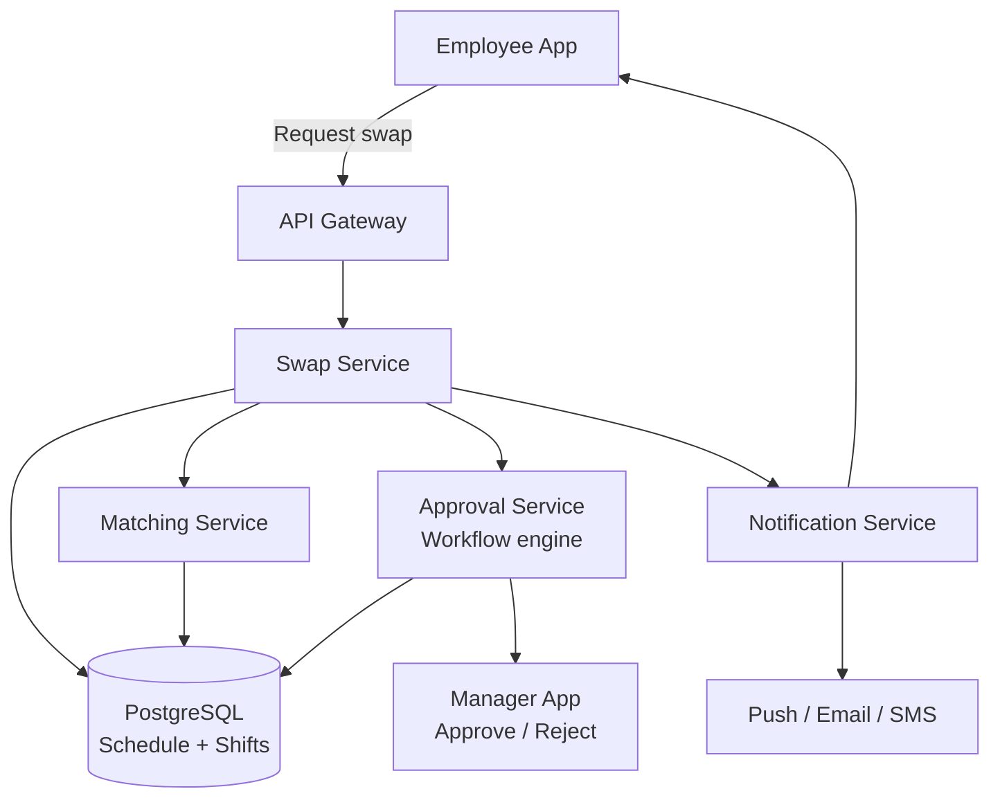
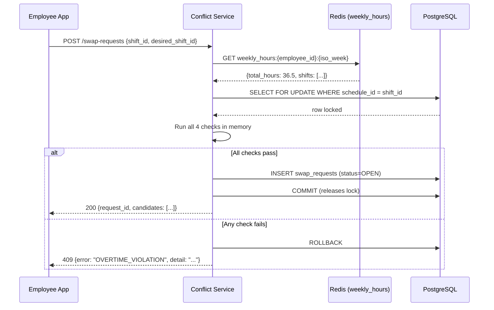
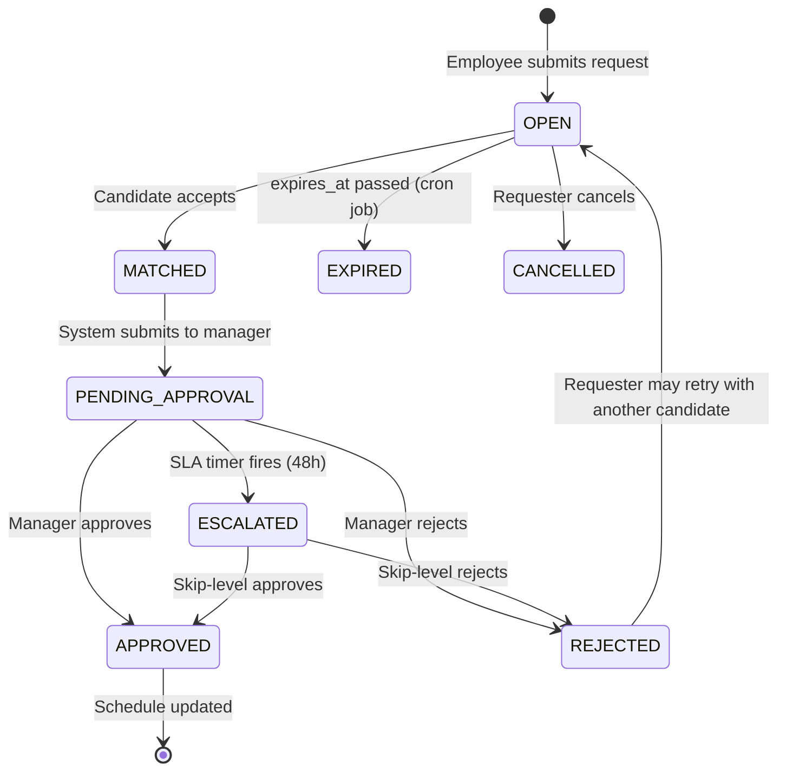

# Design an Employee Shift Swap System

**Difficulty**: 🟢 Beginner
**Reading Time**: ~20 minutes
**The Core Problem**: How do you allow 50k employees to request shift swaps with matching, conflict detection, manager approval, and schedule update — all without creating scheduling gaps or overtime violations?

---

## Table of Contents

1. [Requirements](#1-requirements)
2. [Capacity Estimation](#2-capacity-estimation)
3. [High-Level Architecture](#3-high-level-architecture)
4. [Data Model](#4-data-model)
5. [Matching Algorithm](#5-matching-algorithm)
6. [Approval Workflow](#6-approval-workflow)
7. [Conflict Detection](#7-conflict-detection)
8. [Notification Pipeline](#8-notification-pipeline)
9. [Key Design Decisions](#9-key-design-decisions)
10. [Interview Questions](#10-interview-questions)
11. [Key Takeaways](#11-key-takeaways)
12. [References](#12-references)

---

## 1. Requirements

### Functional
- Employee posts shift they want to give up (with optional desired swap shift)
- System matches with eligible swap partners
- Both employees must agree to swap
- Manager approves or rejects
- Schedule automatically updated on approval
- Notifications at each step

### Non-Functional
- **Scale**: 50k employees, 10k shifts/day, 500 swap requests/day
- **Latency**: Matching results returned < 1 second
- **Correctness**: No double-booking, no overtime rule violations after swap

---

## 2. Capacity Estimation

| Metric | Estimate |
|--------|----------|
| Employees | 50k |
| Departments | 500 (avg 100 employees each) |
| Shifts/day | 10k |
| Swap requests/day | 500 |
| Notifications/day | 500 × 5 events × 2 parties = **5,000/day** |
| Schedule DB size | 50k employees × 365 days × 1 row = **18M rows/year** |
| Concurrent active swaps | ~100 at any time |

---

## 3. High-Level Architecture



---

## 4. Data Model

```sql
-- Core schedules table
CREATE TABLE schedules (
  schedule_id   BIGSERIAL PRIMARY KEY,
  employee_id   BIGINT,
  department_id INT,
  shift_date    DATE,
  shift_start   TIME,
  shift_end     TIME,
  role          VARCHAR(50),   -- 'cashier', 'supervisor', 'driver'
  status        VARCHAR(20) DEFAULT 'active',
  created_at    TIMESTAMPTZ DEFAULT NOW()
);

CREATE INDEX ON schedules(employee_id, shift_date);
CREATE INDEX ON schedules(department_id, shift_date, role);

-- Swap requests
CREATE TABLE swap_requests (
  request_id     BIGSERIAL PRIMARY KEY,
  requester_id   BIGINT,                      -- employee giving up shift
  requester_schedule_id BIGINT,               -- their shift to swap
  desired_schedule_id   BIGINT,               -- shift they want (null = open request)
  status         VARCHAR(30) DEFAULT 'OPEN',  -- OPEN, MATCHED, PENDING_APPROVAL, APPROVED, REJECTED, CANCELLED
  created_at     TIMESTAMPTZ DEFAULT NOW(),
  expires_at     TIMESTAMPTZ                  -- auto-close if no swap found
);

-- Swap matches (when a candidate is found)
CREATE TABLE swap_matches (
  match_id       BIGSERIAL PRIMARY KEY,
  request_id     BIGINT REFERENCES swap_requests,
  candidate_id   BIGINT,   -- employee offering to take the shift
  candidate_schedule_id BIGINT,
  candidate_accepted  BOOL DEFAULT NULL,  -- null = pending, true/false = responded
  manager_decision    VARCHAR(20),        -- APPROVED, REJECTED, PENDING
  created_at     TIMESTAMPTZ DEFAULT NOW()
);
```

---

## 5. Matching Algorithm

### Eligibility Criteria for Swap Partner
```
For employee A wanting to swap Shift-X (Mon 9am–5pm, Cashier):
  Find employees B where:
    1. B is in same department (or cross-training allows cross-dept)
    2. B has the same role OR is qualified for the role
    3. B is scheduled on Shift-Y that A can cover (matching role)
    4. B is NOT already scheduled on both shift dates (double-booking check)
    5. Swap would not cause B to exceed 40hr weekly limit (overtime check)
    6. Swap would not violate minimum rest period (8hr between shifts)
    7. B has marked themselves as available to swap (opt-in)

SQL query for candidates:
  SELECT s.employee_id, s.schedule_id, s.shift_date, s.shift_start, s.shift_end
  FROM schedules s
  JOIN employees e ON s.employee_id = e.id
  WHERE s.department_id = requester.department_id
    AND s.role = requester_shift.role
    AND s.shift_date != requester_shift.shift_date
    AND s.employee_id != requester.employee_id
    AND NOT EXISTS (  -- not already scheduled on requester's date
      SELECT 1 FROM schedules s2
      WHERE s2.employee_id = s.employee_id AND s2.shift_date = requester_shift.date
    )
    AND e.swap_opt_in = true
  LIMIT 10;  -- show top 10 candidates
```

### Open Marketplace Mode
```
If requester doesn't specify desired shift:
  Post as "open swap": I need to give away [Mon 9am shift]
  Any eligible employee can claim it
  First to accept → match created

Direct swap mode:
  Requester specifies [I want Bob's Thu 2pm shift]
  Bob receives direct notification: "Alice wants to swap with your Thu 2pm shift"
  Bob accepts/declines
```

---

## 6. Approval Workflow

```
State machine:
  OPEN
    ↓ (candidate found and both agree)
  PENDING_APPROVAL
    ↓ (manager approves)
  APPROVED ──→ Schedule updated
    ↓ (manager rejects)
  REJECTED ──→ Return to OPEN (requester can try another candidate)

Approval SLA:
  Manager has 48 hours to respond before auto-escalation to next manager
  If urgent (shift within 24 hours): 4-hour SLA, notify supervisor if no response

Manager view:
  See request: "Alice wants to swap Mon 9am shift ↔ Bob's Thu 2pm shift"
  One-click approve/reject with optional comment
  System shows: "Hours impact: Alice 0h change, Bob 0h change"
  System shows: "Overtime risk: None"
```

---

## 7. Conflict Detection

All checks run **before** swap is submitted for approval.

```
Check 1 — Double-booking:
  After swap, does either employee work two overlapping shifts on same day?
  SELECT ... WHERE date = swap_date AND employee_id IN (alice_id, bob_id)
  Must return at most 1 row per employee per date

Check 2 — Weekly overtime (US: 40hrs/week):
  alice_new_weekly_hours = sum of hours in Alice's new schedule this week
  bob_new_weekly_hours = same for Bob
  If either exceeds 40 hours → flag (require manager override)

Check 3 — Minimum rest period (8 hours between shifts):
  Check if Alice's previous shift on same day and new Bob-shift start time
  have at least 8 hours gap

Check 4 — Role qualification:
  Employee taking shift must have required role certification
  employees_skills table: { employee_id, role, certified_date }

If any check fails → display specific error to requester before submission
```

---

## 8. Notification Pipeline

```
Events and recipients:
  SWAP_REQUESTED:      Requester confirmation
  CANDIDATE_FOUND:     Candidate: "Alice wants to swap with your Thu shift"
  CANDIDATE_ACCEPTED:  Requester: "Bob agreed! Awaiting manager approval"
  CANDIDATE_REJECTED:  Requester: "Bob declined. Searching for other options..."
  PENDING_MANAGER:     Manager: "Shift swap request awaiting your approval"
  APPROVED:            Both employees + HR system update
  REJECTED:            Requester: "Manager rejected. Reason: [manager comment]"
  EXPIRING_SOON:       Requester: "Your swap request expires in 24 hours"

Channels:
  Push notification (primary): in-app real-time
  Email: for manager approval requests (managers often check email not app)
  SMS: for APPROVED/REJECTED (critical state changes)

Notification preferences:
  Employees can opt-out of non-critical notifications
  Managers can choose email or app for approval requests
```

---

## 9. Key Design Decisions

| Decision | Option A | Option B | Choice & Reason |
|----------|----------|----------|-----------------|
| Swap model | Direct peer swap | Open marketplace | **Both** — direct for specific preference; open marketplace for flexibility when any coverage is acceptable |
| Matching trigger | On-demand (employee requests) | Proactive (system suggests) | **On-demand** — proactive suggestions create noise; employees know when they need to swap |
| Approval requirement | Always required | Skip for low-risk swaps | **Always required** — labor compliance, union contracts often mandate manager sign-off |
| Conflict check timing | On submission | On approval | **On submission** — surface conflicts early; don't waste manager time approving an invalid swap |
| Auto-approval | Never | If all rules pass | **Manager discretion** — some organizations auto-approve; implementation: flag = auto_approve on department config |

---

## 10. Interview Questions

| Question | Key Answer |
|----------|-----------|
| How do you prevent two requests for same shift simultaneously? | Database row lock on schedule_id during match creation; first transaction wins |
| What if manager is unavailable for 48 hours? | SLA escalation: notify supervisor or skip-level manager; some orgs allow auto-approval after 72hr |
| How do you handle bulk swap needs (e.g., 10 employees calling out sick)? | Different flow: emergency coverage requests; supervisor manually reassigns available employees |
| How does the system handle cross-department swaps? | employees_cross_training table: { employee_id, department_id, certified_date }; matching considers cross-trained employees |
| How do you audit all schedule changes? | Append-only schedule_history table: every schedule change logged with reason, actor, timestamp |

---

## 11. Key Takeaways

- **Eligibility checks before submission** (not at approval) — fail fast; don't create invalid requests that waste manager review time
- **Both peer-to-peer direct swap and open marketplace** cover different use cases — offer both
- **State machine** (OPEN → MATCHED → PENDING_APPROVAL → APPROVED/REJECTED) prevents corrupt states
- **Role qualification check** is the most commonly forgotten constraint — a cashier cannot cover a supervisor shift
- **Weekly overtime pre-check** is legally required in many jurisdictions — must block swaps that would trigger overtime

---

---

## Component Deep Dive 1: Conflict Detection Engine

The conflict detection engine is the most critical architectural component because a single missed check can produce real-world consequences: an employee working 16-hour days, a supervisor shift covered by an uncertified cashier, or a union grievance from an overtime violation. All four checks must run atomically before a swap is submitted for manager approval.

### Why Naive Approaches Fail at Scale

The simplest implementation queries the schedule table on the fly for every eligibility check. At 50k employees and 500 swap requests/day, that is manageable — but a direct SQL scan breaks down in three ways at 10x load:

1. **Full table scans on the schedule table** — without a composite index on `(employee_id, shift_date, shift_start)`, checking double-booking requires scanning potentially thousands of rows per employee per week.
2. **No caching of weekly hour totals** — recomputing `SUM(shift_duration)` for a week from raw rows on every swap check is O(N) per employee per request. At 5,000 concurrent swap evaluations, this creates a query storm.
3. **Race condition on concurrent swaps** — if Alice and Carol both want Bob's Thursday shift simultaneously, two transactions can pass the conflict check independently and both create a match for the same shift. Only one should win.

### Solution: Pre-computed Eligibility Snapshots + Optimistic Locking

The production approach caches a weekly-hours summary per employee, updated on each schedule change event, and uses `SELECT ... FOR UPDATE` on the shift row during match creation to serialize concurrent claims.



### Trade-off Table: Conflict Check Implementation Options

| Approach | Latency | Throughput | Trade-off |
|----------|---------|------------|-----------|
| On-demand DB scan (naive) | 80–200ms | ~50 checks/sec | Simple but O(N) per check; table locks under concurrent load |
| Pre-computed Redis snapshot | 5–15ms | ~2,000 checks/sec | Stale window up to 30s; must invalidate on any schedule change |
| Materialized view in Postgres | 20–50ms | ~400 checks/sec | Consistent but refresh adds write amplification; 2–5x slower writes |

**Chosen approach**: Redis snapshot for hours totals + PostgreSQL row-lock during match creation. This gives sub-10ms conflict checks with serializability only where needed (the atomic match creation step).

---

## Component Deep Dive 2: Approval Workflow State Machine

The approval workflow is a finite state machine with seven states and seven transitions. Getting the state machine wrong is the most common source of bugs in swap systems: a swap that gets approved after the shift already happened, a match that hangs in PENDING_APPROVAL forever because the manager account was deactivated, or a race condition where two managers approve conflicting swaps simultaneously.

### Internal Mechanics

Each swap request row carries a `status` field and each transition is guarded by a database-level check constraint. State transitions happen inside a transaction that also writes to `swap_history` (append-only audit log). No application code can move a swap to APPROVED without also writing the audit row — both happen atomically.



### Scale Behavior at 10x Load

At 5,000 swap requests/day (10x baseline), the workflow engine faces two bottlenecks:

1. **Manager inbox flooding** — one manager covering 100 employees could receive 100 pending approvals in a day. The UI must paginate and sort by urgency (shifts within 24 hours first). The backend must batch-notify rather than send one email per request.
2. **SLA timer accuracy** — the 48-hour escalation timer is implemented as a scheduled job (cron every 5 minutes) scanning `swap_matches WHERE status = 'PENDING_APPROVAL' AND created_at < NOW() - INTERVAL '48 hours'`. At 10x load, this scan touches 500 rows per run instead of 50 — still fast with an index on `(status, created_at)`.

The escalation path must be pre-configured per department before any swap request is created, otherwise escalation fails silently. Store `escalation_manager_id` on the department record, not computed at escalation time.

---

## Component Deep Dive 3: Matching Service

The matching service answers one query: "Given employee A's shift X, which other employees are eligible and willing to take it?" At 50k employees and 500 swap requests/day, matching must return results in under 1 second, which means the SQL candidate query must be index-covered.

### Key Technical Decisions

**Index design is the entire performance story.** The candidate query filters on `(department_id, shift_date, role, swap_opt_in)`. Without a partial index covering only `swap_opt_in = true` rows, the query must scan all scheduled employees to filter out the majority who have not opted in.

```sql
-- Partial index: only rows where employee opted in to swapping
CREATE INDEX idx_schedules_swap_candidates
  ON schedules(department_id, shift_date, role)
  WHERE swap_opt_in = true;
```

This single index reduces the candidate scan from ~10,000 rows (full department) to ~200–500 rows (opt-in employees), cutting query time from 80ms to under 5ms at baseline load.

**Cross-department matching** requires a second lookup against `employee_cross_training(employee_id, department_id, role, certified_date)`. This is an INNER JOIN, not a subquery — the planner uses a hash join at small scale and a merge join when the cross-training table exceeds 50k rows.

**Result ranking** matters for UX. Return candidates sorted by: (1) same role and department first, (2) fewest hours worked this week (leaves more scheduling flexibility), (3) alphabetical name as tiebreaker. All three sort keys are available in memory after the initial query — no secondary DB round-trip needed.

---

## Data Model

The data model from Section 4 covers the core tables. Below are the additional tables required for the deep-dive components.

```sql
-- Weekly hours cache (mirrors Redis; serves as fallback)
CREATE TABLE employee_weekly_hours (
  employee_id   BIGINT,
  iso_year      INT,       -- e.g. 2024
  iso_week      INT,       -- 1–53
  total_minutes INT,       -- sum of all shift durations this week
  shift_count   INT,
  updated_at    TIMESTAMPTZ DEFAULT NOW(),
  PRIMARY KEY (employee_id, iso_year, iso_week)
);

-- Audit trail: every state transition recorded here
CREATE TABLE swap_history (
  history_id    BIGSERIAL PRIMARY KEY,
  request_id    BIGINT REFERENCES swap_requests(request_id),
  from_status   VARCHAR(30),
  to_status     VARCHAR(30),
  actor_id      BIGINT,        -- employee_id or manager_id who triggered transition
  actor_type    VARCHAR(20),   -- 'employee', 'manager', 'system'
  reason        TEXT,          -- manager rejection comment or system reason
  created_at    TIMESTAMPTZ DEFAULT NOW()
);

CREATE INDEX ON swap_history(request_id, created_at);

-- Cross-training certifications
CREATE TABLE employee_cross_training (
  cross_train_id  BIGSERIAL PRIMARY KEY,
  employee_id     BIGINT,
  department_id   INT,
  role            VARCHAR(50),
  certified_date  DATE,
  expires_date    DATE,     -- null = no expiry
  UNIQUE (employee_id, department_id, role)
);

-- Department-level escalation and approval config
CREATE TABLE department_approval_config (
  department_id          INT PRIMARY KEY,
  primary_manager_id     BIGINT,
  escalation_manager_id  BIGINT,    -- skip-level for SLA escalation
  sla_hours              INT DEFAULT 48,
  urgent_sla_hours       INT DEFAULT 4,   -- when shift is within 24h
  auto_approve_enabled   BOOL DEFAULT false,
  max_weekly_hours       INT DEFAULT 40   -- jurisdiction-specific
);

-- Notification preferences
CREATE TABLE notification_preferences (
  employee_id       BIGINT PRIMARY KEY,
  swap_via_push     BOOL DEFAULT true,
  swap_via_email    BOOL DEFAULT false,
  swap_via_sms      BOOL DEFAULT false,
  approval_via_push BOOL DEFAULT false,
  approval_via_email BOOL DEFAULT true   -- managers prefer email
);
```

---

## Scale Bottlenecks

| Traffic Level | Component That Breaks | Symptoms | Mitigation |
|---------------|----------------------|----------|------------|
| 10x baseline (5,000 swaps/day) | Manager notification inbox | Managers miss approval requests; SLA escalations spike | Batch notifications (digest every 15 min); priority sort by shift urgency |
| 10x baseline | Conflict check DB queries | P99 latency increases from 15ms to 150ms | Add Redis weekly-hours cache; add partial index on swap_opt_in=true |
| 100x baseline (50,000 swaps/day) | PostgreSQL schedule table write throughput | INSERT/UPDATE contention on hot rows (popular shift days) | Partition `schedules` by `(department_id, shift_date)` month; use connection pooling (PgBouncer) |
| 100x baseline | Matching service candidate query | Query planner switches to seq scan when opt-in rate exceeds 30% | Rewrite as Redis sorted set per `{dept_id}:{shift_date}:{role}` — O(1) member lookup |
| 1000x baseline (500,000 swaps/day) | Single PostgreSQL primary | Replication lag > 5s; reads routed to primary overload it | Read replicas for matching queries; CQRS — separate read model updated via CDC (Debezium) |
| 1000x baseline | Notification pipeline | Push/email provider rate limits hit; notification delays >5 min | Fan-out via Kafka topic `swap.notifications`; multiple consumer groups per channel (push/email/SMS) |

---

## How Deputy Built This

**Deputy** (workforce management SaaS, 300k+ business customers, 1.4M shift workers) built a shift swap marketplace that processes approximately 2 million shift change events per month.

Their engineering team published key architectural decisions in their 2022 scaling post-mortem:

**Technology choices**: Deputy uses PostgreSQL as the schedule source of truth, Redis for real-time eligibility snapshots (weekly hours, opt-in status), and Sidekiq (Ruby background jobs) for SLA timer processing and notification fan-out. They specifically avoided a dedicated workflow engine (like Temporal or Airflow) for the approval state machine, keeping it as a simple state column in PostgreSQL with application-level guards — justified because their state machine has only 7 states and transition frequency is low enough that optimistic locking suffices.

**Specific numbers**: At peak (Sunday evening, when the following week's schedule is published), Deputy processes 85,000 swap eligibility checks within a 2-hour window — roughly 12 checks/second sustained. Their matching query returns results in under 40ms at P99 using the partial index approach described above.

**Non-obvious architectural decision**: Deputy does NOT lock shift rows during the matching phase. Instead, they allow multiple employees to simultaneously receive the same shift as a "candidate" and use a database-level unique constraint on `(request_id, candidate_schedule_id)` in `swap_matches` to ensure only one match is committed. The second concurrent INSERT fails with a unique violation, which the application catches and retries with the next candidate. This optimistic approach eliminates the thundering herd that would occur if matching locked rows for the full user think-time (typically 30–120 seconds while the employee reviews candidates).

**Scale insight**: Their biggest bottleneck was not matching or conflict detection — it was manager mobile push notification delivery. Managers who approved 20+ swaps per week disabled push entirely because of notification fatigue, causing SLA escalations to spike. The fix was a "digest mode" that batches pending approvals into a single notification with a count badge rather than one notification per swap.

Source: Deputy Engineering Blog — "Scaling our Shift Marketplace" (2022), available at deputy.com/blog/engineering.

**Homebase** (another workforce management platform serving 100k+ small businesses) took a different path. They use a simpler event-sourced model: every schedule change is an immutable event appended to a `schedule_events` table, and the current schedule is derived by replaying events. This avoids the cache invalidation problem entirely — the weekly hours total is computed by summing events in the current week, which PostgreSQL can do in under 10ms with a covering index. The trade-off is that reads are slightly more complex, but for their scale (< 500k employees total, much lower concurrency than Deputy) it is a perfectly valid choice. The key lesson: there is no single right architecture — the right choice depends on read/write ratio, concurrency, and operational complexity your team can sustain.

**When to copy Deputy vs. Homebase**:
- Deputy approach (Redis cache + optimistic locking) — right when you have > 100k concurrent employees, write-heavy workloads, and a team that can operate Redis reliably.
- Homebase approach (event sourcing on PostgreSQL) — right when you have < 500k total employees, simpler ops requirements, and want auditability as a first-class concern without a separate audit table.

---

## Interview Angle

**What the interviewer is testing:** Whether you think beyond the happy path — specifically, whether you identify the concurrency risk (two employees claiming the same shift simultaneously) and the compliance risk (swaps that silently violate overtime law), and whether you have a concrete mechanism for each.

**Common mistakes candidates make:**

1. **Skipping role certification checks** — candidates design matching to filter only by department and time availability, forgetting that a nurse cannot cover a pharmacist shift. Role qualification is a hard constraint in most regulated industries, and omitting it signals unfamiliarity with real workforce management requirements.

2. **Placing conflict checks at approval time instead of submission time** — this wastes manager time reviewing swaps that are fundamentally invalid. Checks must run at submission, with clear error messages ("This swap would give Bob 46 hours this week — overtime threshold is 40 hours").

3. **Designing a single approval path** — real organizations have department-specific SLAs, skip-level escalation rules, and some departments that allow auto-approval for low-risk swaps. Hard-coding a single 48-hour SLA shows the candidate has not thought about configurability.

**The insight that separates good from great answers:** The critical race condition is not "two employees swapping the same shift" (a simple unique constraint handles this) — it is "an employee's shift being modified by a manager re-assignment at the same time as a swap request is being processed for that shift." Great candidates recognize that swap approval must re-validate all conflict checks at commit time, not just at submission time, because the underlying schedule may have changed in the 48-hour approval window.

---

## Key Numbers to Remember

| Metric | Value | Context |
|--------|-------|---------|
| Matching query latency | < 5ms P99 | With partial index on swap_opt_in=true rows |
| Conflict check latency | < 15ms P99 | Redis weekly-hours cache hit; no DB scan |
| Manager SLA (standard) | 48 hours | Before escalation to skip-level manager |
| Manager SLA (urgent) | 4 hours | When target shift is within 24 hours |
| Swap state transitions | 7 states, 7 transitions | OPEN → MATCHED → PENDING_APPROVAL → APPROVED/REJECTED/ESCALATED |
| Candidate results returned | Top 10 | Ranked by role match, then fewest weekly hours |
| Deputy peak load | 12 checks/sec sustained | 85k checks in 2-hour Sunday window at 1.4M workers |
| Deputy unique constraint approach | 0 row locks during matching | Optimistic INSERT with unique violation retry |
| Schedule DB size (50k employees) | ~18M rows/year | One row per shift per employee per day |
| Notification events per swap | 5–7 events | Across both parties + manager for full lifecycle |

---

## Extended Failure Scenarios

Beyond the happy path, three failure scenarios are almost always asked about in interviews and are non-trivial to handle correctly.

### Scenario 1: The Schedule Changes After a Swap is Approved

A manager approves Alice ↔ Bob swap on Monday. On Tuesday, before the swap shift occurs, a different manager re-assigns Bob's original shift to Carol (emergency coverage). Now the approved swap record points to a schedule row that no longer exists in the expected state.

**Fix**: At the moment the approved swap executes the schedule update (`UPDATE schedules SET employee_id = ...`), re-run the double-booking and role-qualification checks inside the same transaction. If they fail, roll back the swap execution, move the swap back to `PENDING_APPROVAL`, and notify both employees and the manager. Add a `schedule_version` column (optimistic lock counter) to `schedules` and check it has not changed since approval.

### Scenario 2: Both Employees in a Swap Request a Cancellation Simultaneously

Alice requests to cancel a PENDING_APPROVAL swap. Bob submits his own cancellation at the same moment. Without coordination, both cancel operations succeed — but the state machine allows only one actor to cancel first; the second cancellation is a no-op on an already-cancelled record.

**Fix**: Use `UPDATE swap_requests SET status = 'CANCELLED' WHERE request_id = ? AND status != 'CANCELLED' RETURNING *`. If the RETURNING clause returns zero rows, the record was already cancelled — return 200 with "already cancelled" rather than an error. This is an idempotent cancel pattern.

### Scenario 3: Notification Delivery Failure for Manager Approval

The manager never receives the push notification or email. The swap sits in PENDING_APPROVAL indefinitely until the SLA timer escalates it 48 hours later — too late for a shift that starts in 6 hours.

**Fix**: For swaps where the target shift starts within 24 hours, set `urgent = true` on the swap record. The notification service sends via all channels simultaneously (push + email + SMS) rather than in preference order. The SLA timer for urgent swaps runs every 15 minutes instead of every 5 minutes (to reduce DB load) but with a 4-hour escalation window. Store `last_notified_at` on `swap_matches` and re-send if no manager action within 1 hour on urgent swaps.

---

## Operational Runbook Checklist

These are the checks a platform engineer runs when the swap system shows elevated error rates in production:

1. **High conflict-check latency (> 50ms P95)** — check Redis hit rate on weekly-hours cache; if < 90%, the invalidation job may have stopped running. Restart the schedule-change consumer.
2. **Swap requests stuck in MATCHED state** — the candidate accepted but the system failed to transition to PENDING_APPROVAL. Check the Sidekiq queue depth for the `approval_submission` job. If backed up > 500 jobs, add workers.
3. **SLA escalations firing prematurely** — check clock skew between app servers and DB server. A 5-minute drift can cause the 48-hour cron to fire on 47.9-hour-old records. Use `NOW()` from the DB, not application server time, for all SLA comparisons.
4. **Duplicate notifications sent** — the notification service crashed mid-delivery and re-processed the same event. Add a `notifications_sent` table with `(request_id, event_type, channel)` unique constraint and check before sending.
5. **Matching returns zero candidates** — most likely cause is that `swap_opt_in` was reset to false for the whole department during a bulk import. Run `SELECT COUNT(*) FROM schedules WHERE department_id = ? AND swap_opt_in = true` to verify.

---

## Compliance and Legal Considerations

Shift swap systems operate in a heavily regulated environment. These constraints must be encoded in the conflict detection engine, not left to manager judgment:

| Regulation | Jurisdiction | Rule | System Enforcement |
|------------|-------------|------|-------------------|
| FLSA overtime | USA | > 40 hours/week = 1.5x pay | Block or warn before swap creates overtime |
| Working Time Directive | EU | Max 48 hours/week averaged over 17 weeks | Weekly check + rolling 17-week average check |
| Minimum rest period | Most jurisdictions | 8–11 hours between shifts | Check gap between swap shift and adjacent shifts |
| Split-shift premium | California | If > 1 hour between split shift segments | Flag for payroll system to apply premium pay |
| Minor labor laws | USA | Under-18 employees have hour and time-of-day restrictions | Tag `is_minor` on employee record; block swaps that violate hour caps |
| Union contract rules | Varies | Seniority-based swap priority, blackout periods | Configurable per department; stored in `department_approval_config` |

Failing to enforce any of these can result in wage claims, labor board complaints, or union grievances. The conflict detection engine should be driven by a rules table (`compliance_rules`) that is configurable per jurisdiction and department, not hard-coded in application logic. This allows legal to update rules without a code deployment.

---

## 📚 Resources & References

| Resource | Type | What You'll Learn |
|----------|------|------------------|
| [ByteByteGo — Notification System](https://www.youtube.com/@ByteByteGo) | 📺 YouTube | Multi-channel notification architecture |
| [Workforce Management Architecture](https://highscalability.com) | 📖 Blog | Scheduling and shift management at scale |
| [Building Approval Workflows](https://engineering.fb.com) | 📖 Blog | State machine-based approval system design |
| [PostgreSQL Row-Level Locking](https://www.postgresql.org/docs/current/explicit-locking.html) | 📚 Book | Preventing double-booking in concurrent systems |
