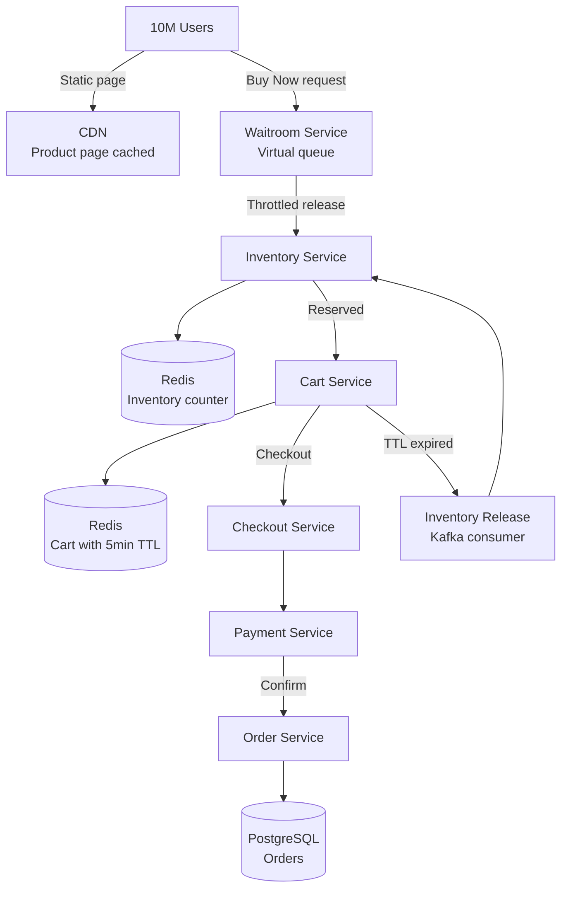
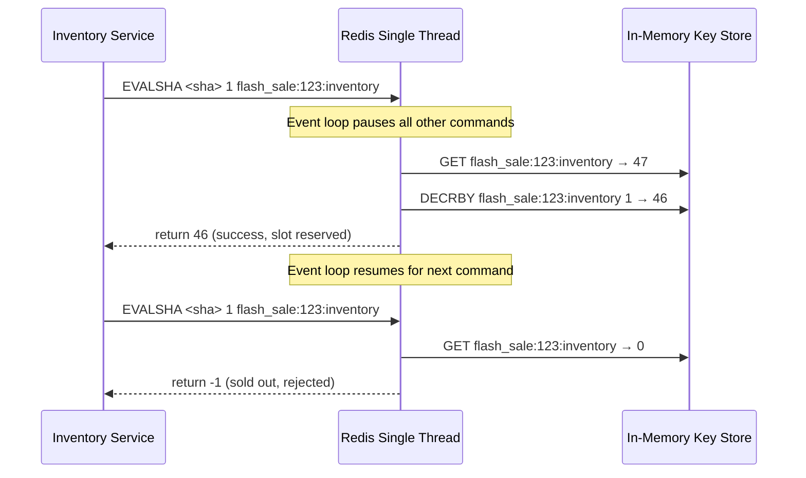
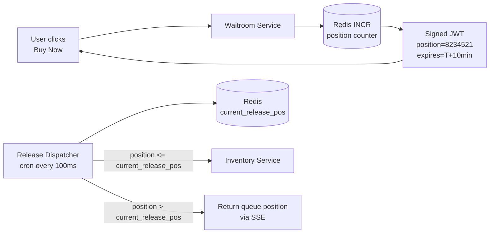
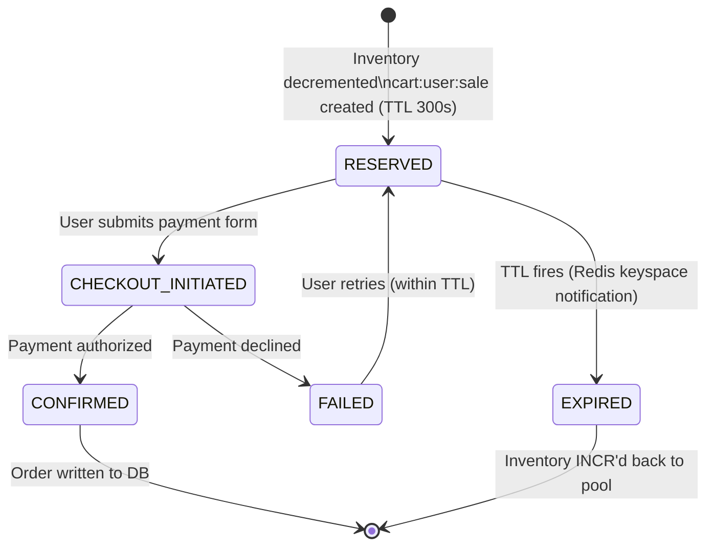

# Design a Flash Sale System

**Difficulty**: 🟡 Intermediate
**Reading Time**: ~25 minutes
**The Core Problem**: 10M users try to buy 1000 limited-edition items in the first 5 seconds of a flash sale. A 1000x traffic spike, concurrent inventory deduction, and cart expiration — how do you sell exactly 1000 items without overselling or underselling?

---

## Table of Contents

1. [Requirements](#1-requirements)
2. [Capacity Estimation](#2-capacity-estimation)
3. [High-Level Architecture](#3-high-level-architecture)
4. [Pre-Sale Waitroom Queue](#4-pre-sale-waitroom-queue)
5. [Inventory Management (Redis Atomic)](#5-inventory-management-redis-atomic)
6. [Cart Reservation with TTL](#6-cart-reservation-with-ttl)
7. [CDN for Static Traffic](#7-cdn-for-static-traffic)
8. [Checkout & Payment](#8-checkout--payment)
9. [Key Design Decisions](#9-key-design-decisions)
10. [Interview Questions](#10-interview-questions)
11. [Key Takeaways](#11-key-takeaways)
12. [References](#12-references)

---

## 1. Requirements

### Functional
- Flash sale starts at T+0 for a limited-inventory product (e.g., 1000 units)
- Only the first 1000 successful purchasers get the item
- No overselling (more than 1000 orders) or underselling (inventory left over due to bugs)
- Cart reservation: item held for 5 minutes while user completes checkout
- Users in excess of 1000 see "Sold Out" immediately

### Non-Functional
- **Scale**: 10M concurrent users at T+0; normal traffic = 10k users
- **Spike ratio**: 1000× normal traffic in 5 seconds
- **Inventory accuracy**: Exactly 0 oversell
- **Latency**: "Sold Out" response < 100ms for users who miss out
- **Availability**: Main site must not go down when flash sale service gets hammered

---

## 2. Capacity Estimation

| Metric | Estimate |
|--------|----------|
| Users at T+0 | 10M |
| Requests in first 5 seconds | 10M requests |
| RPS at peak | 10M / 5s = **2M RPS** |
| Successful inventory reservations | 1,000 |
| Cart TTL | 5 minutes → 1000 reservations × 5min = 5000 held simultaneously |
| CDN page views | 10M × 3 pages = 30M → mostly CDN-served |
| Checkout attempts | 1,000 (successful) + 50k (failed — cart timeout, payment failure) |

---

## 3. High-Level Architecture



---

## 4. Pre-Sale Waitroom Queue

Without a waitroom, 10M requests hit the inventory service simultaneously, overwhelming it and creating a thundering herd.

### Waitroom Design
```
T-5 minutes: Flash sale landing page published (CDN-cached, zero server load)
T+0: Sale opens

Waitroom gate:
  All requests enter waitroom endpoint: POST /flash-sale/join
  Each user gets a position token (signed JWT):
    { user_id, join_timestamp, position: 8234521, expires: T+10min }

Token includes HMAC signature to prevent forgery.

Releasing users:
  Waitroom releases batches of 5,000 users every second:
    - First 1,000 released immediately (enough for all inventory)
    - Next 5,000 released over 5 seconds (handle TTL-expired cart returns)
  Users outside release window: show "You're in queue. Position: 8,234,521"

Benefits:
  Converts 2M RPS spike into 5k RPS steady stream on inventory service
```

### Queue Position Estimation
```
Show user estimated wait time:
  remaining_queue = user_position - current_release_position
  release_rate = 5000 users/sec
  estimated_wait = remaining_queue / release_rate

Update estimate every 5 seconds via SSE (Server-Sent Events)
```

---

## 5. Inventory Management (Redis Atomic)

### Counter-Based Inventory
```
key: flash_sale:{sale_id}:inventory
value: integer (initial = 1000)

Reserve operation (Lua script — atomic):
local current = redis.call('GET', KEYS[1])
if tonumber(current) > 0 then
  local new_val = redis.call('DECR', KEYS[1])
  if new_val >= 0 then
    return 1  -- Reserved successfully
  else
    -- Race: another request took last item simultaneously
    redis.call('INCR', KEYS[1])  -- rollback
    return 0  -- Sold out
  end
else
  return 0  -- Already 0
end
```

### Why DECR alone isn't sufficient
```
Without Lua script:
  Thread A: GET inventory = 1
  Thread B: GET inventory = 1
  Thread A: DECR → 0 (sold item to A ✓)
  Thread B: DECR → -1 (oversold! ✗)

With Lua script: GET+DECR is atomic (Lua scripts run atomically in Redis)
  No two threads can see the same positive value simultaneously
```

### Inventory Release on Cart Expiry
```
When cart TTL expires (user abandoned checkout):
  Redis keyspace notification: key expired → bag_cart:{cart_id}
  Kafka consumer receives notification
  → Increment inventory: INCR flash_sale:{sale_id}:inventory
  → User's cart cleared

This makes TTL-expired items available to waitroom users immediately
```

---

## 6. Cart Reservation with TTL

```
Cart reservation (after successful inventory decrement):
  key: cart:{user_id}:{sale_id}
  value: { item_id, qty: 1, reserved_at, expires_at: now + 5 min }
  TTL: 300 seconds

Cart states:
  RESERVED → user has 5 minutes to checkout
  CONFIRMED → payment successful, inventory permanently deducted
  EXPIRED → TTL fired, inventory returned to pool

5-minute window provides:
  Time for user to enter payment details
  Short enough to minimize inventory held by non-buyers
  Checkout page shows countdown timer
```

---

## 7. CDN for Static Traffic

10M users load the flash sale page — almost all traffic is static.

```
Pre-load CDN cache (T-1 hour):
  - Product description, images → CDN origin push
  - Flash sale countdown timer → JavaScript client-side (no server needed)
  - "Buy Now" button activation → triggered by client-side time check

CDN configuration:
  Cache-Control: public, max-age=3600 (1 hour)
  Stale-while-revalidate: 60s (serve stale while refreshing)

Dynamic endpoints NOT cached:
  POST /flash-sale/join (waitroom entry)
  GET /flash-sale/{sale_id}/inventory (sold-out status — cached 5s max)
  POST /cart/checkout

Separate domain for flash sale:
  flash.example.com (isolated from main site)
  Prevents flash sale traffic from impacting main e-commerce site
```

---

## 8. Checkout & Payment

```
Checkout flow (race-condition safe):
  1. User submits checkout: { cart_id, payment_method }
  2. Checkout Service:
       a. Verify cart not expired (Redis TTL check)
       b. Initiate payment (async, Stripe/Adyen)
       c. On payment success: INSERT order, SET cart.status = CONFIRMED
       d. Publish order.created event to Kafka
  3. If payment fails: release inventory reservation, show error

Idempotency:
  - Checkout endpoint: X-Idempotency-Key header (UUID)
  - Prevents double-charge on network retry
  - Key stored in Redis for 24h: if same key seen twice, return original result

Payment timeout (30s):
  If payment service doesn't respond in 30s → assume failure
  Release cart reservation → inventory returned
```

---

## 9. Key Design Decisions

| Decision | Option A | Option B | Choice & Reason |
|----------|----------|----------|-----------------|
| Inventory check | Optimistic (check, then deduct in DB) | Pessimistic (Redis atomic decrement) | **Redis atomic** — DB transactions at 2M RPS would deadlock; Redis Lua atomic at 100k ops/sec |
| Waitroom | Hard queue (FIFO) | Token bucket (rate limit) | **Token bucket** — FIFO fairness is nice but wrong behavior: early joiners often bots; random position within cohort is fairer |
| Cart reservation timing | Early (pre-checkout) | Late (post-payment) | **Early** — user sees "reserved" message, less abandonment; TTL handles non-buyers |
| Flash sale isolation | Same codebase | Separate service | **Separate service** — flash sale traffic patterns are extreme; isolating prevents cascade failure to main site |
| CDN invalidation at sale end | TTL expiry | API purge | **API purge** — flush "In Stock" page from CDN immediately when sold out; TTL would serve stale "available" for up to 1hr |

---

## 10. Interview Questions

| Question | Key Answer |
|----------|-----------|
| How do you prevent overselling with 10M concurrent requests? | Redis DECR via Lua atomic script — GET+DECR in single atomic operation; impossible to oversell |
| How does the waitroom prevent server overload? | Releases 5k users/sec to inventory service — converts 2M RPS spike to manageable 5k RPS |
| What happens if Redis crashes during sale? | Redis Sentinel or Cluster with AOF persistence; brief downtime preferable to oversell; inventory pre-loaded |
| How do you prevent bots from buying all inventory? | CAPTCHA in waitroom; rate limit per IP; device fingerprinting; delayed bot detection |
| How does cart TTL work with inventory? | On TTL expiry → Redis keyspace notification → Kafka → INCR inventory counter |

---

## 11. Key Takeaways

- **Redis Lua atomic DECR** is the only correct approach for flash sale inventory — non-atomic operations guarantee oversell under concurrent load
- **Waitroom queue** converts 2M RPS thundering herd into a controllable 5k RPS stream — the most important architectural decision
- **Cart TTL + inventory release** ensures no inventory is permanently locked by abandoned carts
- **Isolated flash sale service** prevents extreme traffic patterns from cascading to the main e-commerce platform
- **CDN pre-loading** absorbs 99%+ of static page traffic — only dynamic endpoints hit servers

---

---

## Component Deep Dive 1: Inventory Service — Atomic Counter with Redis Lua

The Inventory Service is the single most critical component in any flash sale system. It is the gate that must enforce exactly 1000 successful reservations from 10M concurrent attempts, and it must do so without any possibility of overselling.

### Why a Database Is the Wrong Answer

The naive approach is to use a SQL `UPDATE items SET stock = stock - 1 WHERE item_id = 123 AND stock > 0` inside a transaction. This works correctly for low-traffic scenarios. At 2M RPS the database becomes the bottleneck almost instantly: acquiring row-level locks on the same row from thousands of concurrent threads causes a lock convoy. Threads queue behind the lock, holding connections, which exhausts the connection pool. PostgreSQL with 500 max connections can handle roughly 5,000 inventory check-and-decrement operations per second under these contention patterns — four orders of magnitude below the required throughput.

### Redis as the Inventory Counter

Redis is single-threaded internally for command execution. All commands are serialized through a single event loop. This means two concurrent `DECR` commands cannot execute simultaneously — one always finishes before the other begins. A simple `DECR` on a counter key is therefore inherently race-condition safe for the common case.

However, the two-step pattern (GET followed by DECR if positive) is **not** atomic across two separate commands. A check-then-act race window exists between the GET and the DECR where another request may observe the same positive value. The solution is a Lua script, which Redis executes as a single atomic unit — the event loop will not process any other command while the Lua script is running.

### Internal Execution Flow



### Trade-Off: Inventory Counter Approaches

| Approach | Write Throughput | Oversell Risk | Complexity | Failure Recovery |
|----------|-----------------|---------------|------------|-----------------|
| SQL row lock (`SELECT FOR UPDATE`) | ~5k ops/sec per node | None (serialized) | Low | DB transaction rollback |
| Redis `DECR` (no Lua) | ~200k ops/sec | High — race on multi-step operations | Low | Manual reconciliation |
| Redis Lua atomic script | ~100k ops/sec | None (atomic) | Medium | Redis AOF replay |
| Redis Cluster sharded by item | ~1M ops/sec total | None (per-shard atomic) | High | Per-shard recovery |

For a single item with 1000 units, a single Redis node running a Lua script at 100k ops/sec will drain the inventory in approximately 10ms under maximum throughput. The waitroom's job is to throttle the 2M RPS down to a level where the Lua script can absorb it cleanly.

### Lua Script (Production-Grade)

```lua
-- flash_sale_decr.lua
-- KEYS[1] = inventory key
-- ARGV[1] = amount to decrement (usually "1")
-- Returns: new count if success, -1 if sold out, -2 if key missing

local current = redis.call('GET', KEYS[1])
if current == false then
  return -2  -- Key not pre-loaded — sale not ready
end

local qty = tonumber(current)
local requested = tonumber(ARGV[1])

if qty < requested then
  return -1  -- Sold out
end

local new_val = redis.call('DECRBY', KEYS[1], requested)
if new_val < 0 then
  -- Edge case: concurrent decrement pushed us below zero
  redis.call('INCRBY', KEYS[1], requested)  -- rollback
  return -1
end

return new_val  -- Remaining inventory after reservation
```

---

## Component Deep Dive 2: Waitroom / Virtual Queue

The waitroom is the demand-shaping layer that sits in front of the inventory service. Its primary function is to absorb the thundering herd at T+0 and release users at a rate the downstream services can handle.

### Why Waitrooms Exist

At T+0, every user who has been watching the countdown timer clicks "Buy Now" simultaneously. Without a waitroom, all 10M requests arrive at the inventory service within the same 100ms window. Even if each Lua atomic operation takes only 10 microseconds, 10M concurrent requests still require Redis to process 10M operations sequentially. At 100k ops/sec that takes 100 seconds — far longer than the perceived "instant" response users expect.

The waitroom moves the queuing to an earlier, cheaper layer. Users queue in the waitroom (which is very fast — just a counter increment and a JWT issuance). The waitroom then releases users to the inventory service at a controlled rate.

### Token-Based Position Assignment



### Behavior at 10x Load

At 10x load (100M users instead of 10M), the waitroom design holds up well because the waitroom itself is horizontally scalable — each instance just increments a shared Redis counter. The inventory service throughput remains unchanged; only the wait time for queued users increases. A user at position 100M with a release rate of 5k/sec would wait 20,000 seconds — the system would need to reject late arrivals (queue depth > 50k) to avoid deceiving users with unrealistic wait times.

The correct behavior at 10x load:
1. Accept first 50,000 users into the active waitroom
2. Users beyond 50k receive "Sale sold out — join waitlist for next batch" immediately
3. This reduces memory pressure on the position tracking infrastructure

---

## Component Deep Dive 3: Cart TTL and Inventory Reclamation

The cart reservation layer bridges the gap between a user winning a slot in the inventory and them completing payment. It introduces a time window during which inventory is held but not confirmed sold.

### Cart State Machine



### Reclamation Pipeline

When a cart TTL fires, Redis emits a keyspace event (`__keyevent@0__:expired` channel). A dedicated Kafka consumer subscribes to this channel. On receiving the event, it parses the key to extract the `sale_id` and `item_id`, then increments the corresponding inventory counter via the same Lua script path (or a simpler `INCRBY`). This reclaimed unit becomes immediately available to the next user in the waitroom queue.

The reclamation pipeline is critical to minimizing undersell. Without it, the 5-minute cart window would mean that at any given time, up to 1000 units could be held by users who are not actually going to buy. With reclamation, abandoned carts release inventory within seconds of TTL expiry.

### Technical Decisions

- Cart key naming: `cart:{user_id}:{sale_id}` — enables per-user and per-sale queries
- TTL value: 300 seconds — empirically derived from checkout form completion rates; Amazon data suggests 85% of users who start checkout finish within 3 minutes
- Keyspace notifications require `notify-keyspace-events Ex` in Redis config — must be enabled explicitly
- Kafka consumer group for reclamation should have exactly-once semantics (Kafka transactions) to avoid double-increment on consumer restart

---

## Data Model

### Redis Keys

```
# Inventory counter (pre-loaded before sale starts)
flash_sale:{sale_id}:inventory  →  INTEGER (e.g., 1000)

# Cart reservation
cart:{user_id}:{sale_id}  →  HASH
  item_id:       "prod_abc123"
  quantity:      "1"
  reserved_at:   "1748736000"        # Unix timestamp
  expires_at:    "1748736300"        # reserved_at + 300s
  status:        "RESERVED"          # RESERVED | CHECKOUT | CONFIRMED | EXPIRED
  unit_price_cents: "49900"          # Price at time of reservation (avoid price changes)
TTL: 300 seconds (auto-expires)

# Waitroom position counter
flash_sale:{sale_id}:waitroom:pos  →  INTEGER (monotonic, incremented per join)

# Waitroom release pointer
flash_sale:{sale_id}:waitroom:released  →  INTEGER (updated by dispatcher every 100ms)

# Idempotency key for checkout
checkout:idempotency:{key}  →  JSON (order result)
TTL: 86400 seconds (24h)
```

### PostgreSQL — Orders Table

```sql
CREATE TABLE flash_sale_orders (
    order_id        UUID            PRIMARY KEY DEFAULT gen_random_uuid(),
    sale_id         VARCHAR(64)     NOT NULL,
    user_id         UUID            NOT NULL,
    item_id         VARCHAR(64)     NOT NULL,
    quantity        SMALLINT        NOT NULL DEFAULT 1,
    unit_price_cents INT            NOT NULL,
    status          VARCHAR(20)     NOT NULL DEFAULT 'PENDING',
                                    -- PENDING | CONFIRMED | REFUNDED | CANCELLED
    payment_ref     VARCHAR(128)    UNIQUE,  -- Stripe/Adyen charge ID
    reserved_at     TIMESTAMPTZ     NOT NULL DEFAULT NOW(),
    confirmed_at    TIMESTAMPTZ,
    idempotency_key UUID            UNIQUE NOT NULL,
    created_at      TIMESTAMPTZ     NOT NULL DEFAULT NOW(),
    updated_at      TIMESTAMPTZ     NOT NULL DEFAULT NOW()
);

CREATE INDEX idx_fso_sale_user    ON flash_sale_orders(sale_id, user_id);
CREATE INDEX idx_fso_status       ON flash_sale_orders(status) WHERE status = 'PENDING';
CREATE INDEX idx_fso_payment_ref  ON flash_sale_orders(payment_ref) WHERE payment_ref IS NOT NULL;

-- Flash sale configuration
CREATE TABLE flash_sales (
    sale_id         VARCHAR(64)     PRIMARY KEY,
    item_id         VARCHAR(64)     NOT NULL,
    total_inventory INT             NOT NULL,
    starts_at       TIMESTAMPTZ     NOT NULL,
    ends_at         TIMESTAMPTZ     NOT NULL,
    unit_price_cents INT            NOT NULL,
    waitroom_capacity INT           NOT NULL DEFAULT 50000,
    cart_ttl_seconds INT            NOT NULL DEFAULT 300,
    status          VARCHAR(20)     NOT NULL DEFAULT 'SCHEDULED',
                                    -- SCHEDULED | ACTIVE | SOLD_OUT | ENDED
    created_at      TIMESTAMPTZ     NOT NULL DEFAULT NOW()
);
```

---

## Scale Bottlenecks

| Traffic Level | Component That Breaks | Symptoms | Mitigation |
|---------------|----------------------|----------|------------|
| 10x baseline (20M RPS peak) | Waitroom Redis counter — single `INCR` becomes hot key | P99 latency on join spikes from 5ms to 500ms | Shard position counter across 10 Redis nodes; route users by hash(user_id) mod 10 |
| 100x baseline (200M RPS peak) | Waitroom HTTP layer — TCP connection exhaustion on load balancers | Connection refused errors; clients see 502 | Use UDP-based join protocol for position assignment; pre-register via push notification |
| 100x baseline (200M RPS peak) | Redis keyspace notifications for cart expiry — notification channel saturated | Cart reclamation lag increases; inventory undersold | Move expiry detection to a separate Lua-based TTL scanner job; poll pattern instead of push |
| 1000x baseline (2B RPS peak) | DNS — authoritative DNS servers overloaded by lookup storm | Entire site unreachable at T+0 | Pre-cache DNS via anycast with very high TTL (1hr); push DNS records 24h ahead to major resolvers |
| Any level | CDN origin pull — CDN misses on first request per PoP | Origin gets hammered by cache-fill traffic across 200+ PoPs | Pre-warm CDN cache via origin push API 30 minutes before sale starts |

---

## How Alibaba Built This for Double 11

Alibaba's Double 11 (Singles' Day) flash sale is the most documented extreme-scale commerce event in engineering history. In 2023, Alibaba processed 583,000 orders per second at peak and handled a total GMV of $84.54 billion in 24 hours. The architectural decisions they made are directly applicable to the design above.

**Inventory service — Tair (Redis-compatible)**: Alibaba uses their own Redis-compatible in-memory store called Tair, optimized for their hardware. Rather than a single counter per item, they use a distributed counter split across multiple shards. Each shard holds a "quota" of units. A request is routed to a shard by hash, and each shard independently runs an atomic decrement. When a shard's quota is exhausted, it marks itself as sold-out and requests are rerouted to sibling shards or immediately rejected. This design removes the single hot-key bottleneck.

**Waitroom — "Traffic Peak Shaving"**: Alibaba published that during Double 11 2020, their traffic peak was **583,000 orders/second**, but the underlying systems were designed for only 100,000 sustained ops/second. Their "traffic peak shaving" layer queues excess traffic in Alibaba Cloud message queues (RocketMQ) and processes orders at the sustainable rate. Users see "Order processing..." instead of "Sold out" — orders are confirmed or rejected asynchronously within 2 seconds.

**A non-obvious decision**: Alibaba pre-sells inventory using "Intent Reservations" — users can pre-register intent 24 hours before the sale. This flattens the T+0 spike because pre-registered users enter with confirmed priority slots, and their inventory is already soft-reserved. Only the remaining 30% of inventory is available for the T+0 open purchase. This reduced their T+0 spike ratio from 300x to 80x.

**Source**: Alibaba Cloud engineering blog "How We Designed the Alibaba Double 11 Architecture" (2020); Alibaba DAMO Academy presentations at QCon 2021.

Another instructive data point: during Double 11 2019, Alibaba's order system sustained 544,000 orders/second with a database layer underneath it. They achieved this by batching writes — individual order writes are first buffered in memory (grouped into micro-batches of 100ms), then committed to their distributed database OceanBase in bulk. This batching reduced per-order DB write cost by 100x compared to individual transactions while maintaining ACID guarantees at the batch boundary.

---

## Interview Angle

**What the interviewer is testing:** The ability to identify the exact point where concurrency creates correctness bugs (inventory oversell), and the understanding that rate limiting / queuing at the edge is more efficient than distributed locking deep in the stack.

**Common mistakes candidates make:**

1. **Proposing a database transaction for inventory check-and-decrement at 2M RPS.** This is wrong because even a well-tuned PostgreSQL with read replicas cannot handle the lock contention from millions of concurrent writes to the same row. Candidates who say "use SELECT FOR UPDATE in a transaction" are correct about correctness but wrong about scale. The follow-up question "what's the max throughput of that approach?" should trigger a switch to Redis.

2. **Using Redis DECR without Lua, claiming it's atomic.** DECR itself is atomic, but any check-before-decrement pattern (GET, then DECR if > 0) is two separate commands with a race window. A candidate who says "Redis DECR is atomic so we're fine" has not thought through the check-first-then-decrement flow needed to prevent going below zero.

3. **Forgetting the inventory reclamation path.** Designing a cart TTL without a mechanism to return inventory to the pool on expiry means that once 1000 carts are created (even if 400 of them abandon), the sale ends with ~400 units permanently locked. This is underselling, which costs real revenue. Candidates often add the cart TTL feature but forget the release mechanism.

**The insight that separates good from great answers:** A great candidate recognizes that the waitroom is not just an overflow buffer — it is also a **bot mitigation layer**. By assigning random position within each cohort (rather than strict FIFO), and requiring CAPTCHA or device fingerprinting before entering the waitroom, the system defeats bots who try to be first in the queue. Strict FIFO rewards whoever can send HTTP requests fastest, which systematically advantages bots over humans.

---

## Key Numbers to Remember

| Metric | Value | Context |
|--------|-------|---------|
| Peak RPS at T+0 | 2M RPS | 10M users clicking simultaneously over 5 seconds |
| Redis Lua atomic throughput | ~100k ops/sec | Single Redis node; one Lua script per inventory reservation |
| Inventory drain time (Lua only) | ~10ms | 1000 units at 100k ops/sec — sold out before waitroom matters without throttling |
| Waitroom release rate | 5,000 users/sec | Enough to reserve 1000 items + cover cart abandonment (40% abandonment assumed) |
| Cart TTL | 300 seconds (5 min) | 85% of buyers complete checkout within 3 minutes; 5 min covers payment retries |
| CDN traffic share | 99%+ | Static product page, images, countdown timer — all pre-cached on CDN |
| Connection pool limit (PostgreSQL) | ~5,000 concurrent ops/sec | Under lock contention for same row — orders of magnitude below Redis |
| Double 11 peak (Alibaba 2023) | 583,000 orders/sec | Real-world data point for extreme scale flash sale |
| Waitroom queue depth limit | 50,000 active users | Beyond this, reject with "sold out" to avoid misleading wait times |
| Idempotency key TTL | 86,400 seconds (24h) | Covers payment retry window; prevents double-charge on network failure |

---

## Failure Modes and Recovery

Understanding how the system fails is as important as understanding how it works. Flash sales have three distinct failure zones: pre-sale, at-sale-start, and post-sale.

**Pre-sale failures:**
- **Redis not pre-loaded**: If the inventory counter key is not set before the sale opens, the Lua script returns -2 (key missing). The Inventory Service must treat this as "service not ready" and reject all reservations with a 503 until the key is confirmed present. A health check endpoint should verify key existence 30 seconds before sale start.
- **CDN cache miss at sale time**: If the product page CDN cache expires within 10 minutes of sale start due to a misconfigured TTL, all 10M users hit the origin simultaneously to refresh the page. Pre-warm CDN via origin push API no later than T-60 minutes.

**At-sale-start failures:**
- **Waitroom Redis counter crash**: If the Redis node holding the position counter fails at T+0, new joins cannot be assigned positions. This is mitigated by Redis Sentinel (automatic failover in ~30 seconds). During the failover window, the waitroom should reject joins with "Please retry in 30 seconds" rather than letting them through ungated to the inventory service.
- **Lua script SHA mismatch**: If a Redis node failover happens and the replacement node does not have the Lua script loaded (EVALSHA returns NOSCRIPT error), the Inventory Service must catch this error and re-load the script via SCRIPT LOAD before retrying. This recovery path must be in the client code, not as a manual operational step.

**Post-sale failures:**
- **Kafka consumer lag on cart reclamation**: If the Kafka consumer processing expired cart keys falls behind (e.g., due to a deployment restart), inventory reclamation is delayed. Expired carts pile up but their inventory is not returned. Monitor consumer lag with a 60-second SLA alert; if lag exceeds 1000 messages, page on-call.
- **Payment service timeout leaving cart in limbo**: If the payment service is slow (P99 > 25 seconds) and the Checkout Service's 30-second timeout fires, the cart is released back to the pool. However if the payment actually succeeded asynchronously, a webhook arrives later. The Checkout Service must handle late payment confirmations by checking whether the cart is still valid or already reclaimed, and issuing a refund if the item was re-sold to another user.

---

## 📚 Resources & References

| Resource | Type | What You'll Learn |
|----------|------|------------------|
| [ByteByteGo — Flash Sale Design](https://www.youtube.com/@ByteByteGo) | 📺 YouTube | Inventory atomic operations and waitroom architecture |
| [Alibaba Double 11 Engineering](https://engineering.fb.com) | 📖 Blog | Hyper-scale flash sale infrastructure patterns |
| [High Scalability — Flash Sales](https://highscalability.com) | 📖 Blog | Real-world case studies in traffic spike management |
| [Redis Lua Scripting](https://redis.io/docs/manual/programmability/eval-intro/) | 📚 Docs | Atomic operations for inventory management |
| [Redis Keyspace Notifications](https://redis.io/docs/manual/keyspace-notifications/) | 📚 Docs | How to use TTL expiry events for cart reclamation |
| [Stripe Idempotency Keys](https://stripe.com/docs/api/idempotent_requests) | 📚 Docs | Payment API idempotency pattern to prevent double charges |
| [Redis Sentinel Documentation](https://redis.io/docs/manual/sentinel/) | 📚 Docs | Automatic Redis failover for high availability inventory counter |
| [OceanBase — Alibaba's Distributed DB](https://github.com/oceanbase/oceanbase) | 📚 Docs | The database behind Alibaba's Double 11 order processing |
| [Martin Kleppmann — Designing Data-Intensive Applications](https://dataintensive.net/) | 📖 Book | Chapter 7 covers transactions and concurrency control patterns used in inventory systems |
