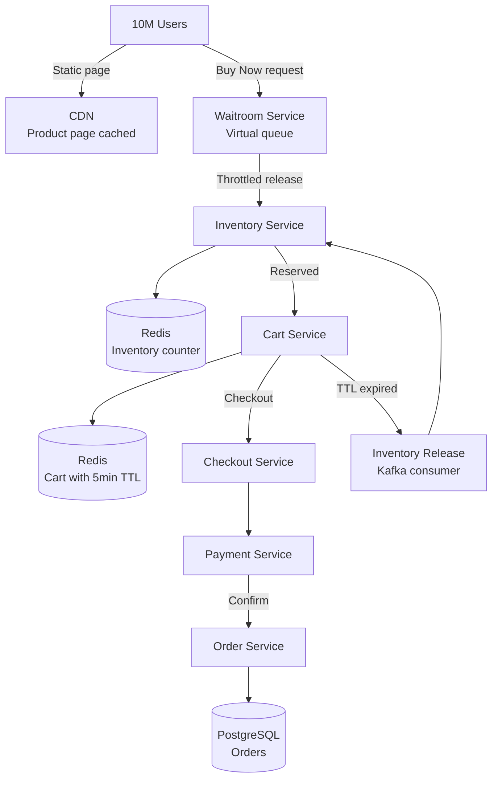

# Design a Flash Sale System

**Difficulty**: 🟡 Intermediate
**Reading Time**: ~25 minutes
**The Core Problem**: 10M users try to buy 1000 limited-edition items in the first 5 seconds of a flash sale. A 1000x traffic spike, concurrent inventory deduction, and cart expiration — how do you sell exactly 1000 items without overselling or underselling?

---

## Table of Contents

1. [Requirements](#1-requirements)
2. [Capacity Estimation](#2-capacity-estimation)
3. [High-Level Architecture](#3-high-level-architecture)
4. [Pre-Sale Waitroom Queue](#4-pre-sale-waitroom-queue)
5. [Inventory Management (Redis Atomic)](#5-inventory-management-redis-atomic)
6. [Cart Reservation with TTL](#6-cart-reservation-with-ttl)
7. [CDN for Static Traffic](#7-cdn-for-static-traffic)
8. [Checkout & Payment](#8-checkout--payment)
9. [Key Design Decisions](#9-key-design-decisions)
10. [Interview Questions](#10-interview-questions)
11. [Key Takeaways](#11-key-takeaways)
12. [References](#12-references)

---

## 1. Requirements

### Functional
- Flash sale starts at T+0 for a limited-inventory product (e.g., 1000 units)
- Only the first 1000 successful purchasers get the item
- No overselling (more than 1000 orders) or underselling (inventory left over due to bugs)
- Cart reservation: item held for 5 minutes while user completes checkout
- Users in excess of 1000 see "Sold Out" immediately

### Non-Functional
- **Scale**: 10M concurrent users at T+0; normal traffic = 10k users
- **Spike ratio**: 1000× normal traffic in 5 seconds
- **Inventory accuracy**: Exactly 0 oversell
- **Latency**: "Sold Out" response < 100ms for users who miss out
- **Availability**: Main site must not go down when flash sale service gets hammered

---

## 2. Capacity Estimation

| Metric | Estimate |
|--------|----------|
| Users at T+0 | 10M |
| Requests in first 5 seconds | 10M requests |
| RPS at peak | 10M / 5s = **2M RPS** |
| Successful inventory reservations | 1,000 |
| Cart TTL | 5 minutes → 1000 reservations × 5min = 5000 held simultaneously |
| CDN page views | 10M × 3 pages = 30M → mostly CDN-served |
| Checkout attempts | 1,000 (successful) + 50k (failed — cart timeout, payment failure) |

---

## 3. High-Level Architecture



---

## 4. Pre-Sale Waitroom Queue

Without a waitroom, 10M requests hit the inventory service simultaneously, overwhelming it and creating a thundering herd.

### Waitroom Design
```
T-5 minutes: Flash sale landing page published (CDN-cached, zero server load)
T+0: Sale opens

Waitroom gate:
  All requests enter waitroom endpoint: POST /flash-sale/join
  Each user gets a position token (signed JWT):
    { user_id, join_timestamp, position: 8234521, expires: T+10min }

Token includes HMAC signature to prevent forgery.

Releasing users:
  Waitroom releases batches of 5,000 users every second:
    - First 1,000 released immediately (enough for all inventory)
    - Next 5,000 released over 5 seconds (handle TTL-expired cart returns)
  Users outside release window: show "You're in queue. Position: 8,234,521"

Benefits:
  Converts 2M RPS spike into 5k RPS steady stream on inventory service
```

### Queue Position Estimation
```
Show user estimated wait time:
  remaining_queue = user_position - current_release_position
  release_rate = 5000 users/sec
  estimated_wait = remaining_queue / release_rate

Update estimate every 5 seconds via SSE (Server-Sent Events)
```

---

## 5. Inventory Management (Redis Atomic)

### Counter-Based Inventory
```
key: flash_sale:{sale_id}:inventory
value: integer (initial = 1000)

Reserve operation (Lua script — atomic):
local current = redis.call('GET', KEYS[1])
if tonumber(current) > 0 then
  local new_val = redis.call('DECR', KEYS[1])
  if new_val >= 0 then
    return 1  -- Reserved successfully
  else
    -- Race: another request took last item simultaneously
    redis.call('INCR', KEYS[1])  -- rollback
    return 0  -- Sold out
  end
else
  return 0  -- Already 0
end
```

### Why DECR alone isn't sufficient
```
Without Lua script:
  Thread A: GET inventory = 1
  Thread B: GET inventory = 1
  Thread A: DECR → 0 (sold item to A ✓)
  Thread B: DECR → -1 (oversold! ✗)

With Lua script: GET+DECR is atomic (Lua scripts run atomically in Redis)
  No two threads can see the same positive value simultaneously
```

### Inventory Release on Cart Expiry
```
When cart TTL expires (user abandoned checkout):
  Redis keyspace notification: key expired → bag_cart:{cart_id}
  Kafka consumer receives notification
  → Increment inventory: INCR flash_sale:{sale_id}:inventory
  → User's cart cleared

This makes TTL-expired items available to waitroom users immediately
```

---

## 6. Cart Reservation with TTL

```
Cart reservation (after successful inventory decrement):
  key: cart:{user_id}:{sale_id}
  value: { item_id, qty: 1, reserved_at, expires_at: now + 5 min }
  TTL: 300 seconds

Cart states:
  RESERVED → user has 5 minutes to checkout
  CONFIRMED → payment successful, inventory permanently deducted
  EXPIRED → TTL fired, inventory returned to pool

5-minute window provides:
  Time for user to enter payment details
  Short enough to minimize inventory held by non-buyers
  Checkout page shows countdown timer
```

---

## 7. CDN for Static Traffic

10M users load the flash sale page — almost all traffic is static.

```
Pre-load CDN cache (T-1 hour):
  - Product description, images → CDN origin push
  - Flash sale countdown timer → JavaScript client-side (no server needed)
  - "Buy Now" button activation → triggered by client-side time check

CDN configuration:
  Cache-Control: public, max-age=3600 (1 hour)
  Stale-while-revalidate: 60s (serve stale while refreshing)

Dynamic endpoints NOT cached:
  POST /flash-sale/join (waitroom entry)
  GET /flash-sale/{sale_id}/inventory (sold-out status — cached 5s max)
  POST /cart/checkout

Separate domain for flash sale:
  flash.example.com (isolated from main site)
  Prevents flash sale traffic from impacting main e-commerce site
```

---

## 8. Checkout & Payment

```
Checkout flow (race-condition safe):
  1. User submits checkout: { cart_id, payment_method }
  2. Checkout Service:
       a. Verify cart not expired (Redis TTL check)
       b. Initiate payment (async, Stripe/Adyen)
       c. On payment success: INSERT order, SET cart.status = CONFIRMED
       d. Publish order.created event to Kafka
  3. If payment fails: release inventory reservation, show error

Idempotency:
  - Checkout endpoint: X-Idempotency-Key header (UUID)
  - Prevents double-charge on network retry
  - Key stored in Redis for 24h: if same key seen twice, return original result

Payment timeout (30s):
  If payment service doesn't respond in 30s → assume failure
  Release cart reservation → inventory returned
```

---

## 9. Key Design Decisions

| Decision | Option A | Option B | Choice & Reason |
|----------|----------|----------|-----------------|
| Inventory check | Optimistic (check, then deduct in DB) | Pessimistic (Redis atomic decrement) | **Redis atomic** — DB transactions at 2M RPS would deadlock; Redis Lua atomic at 100k ops/sec |
| Waitroom | Hard queue (FIFO) | Token bucket (rate limit) | **Token bucket** — FIFO fairness is nice but wrong behavior: early joiners often bots; random position within cohort is fairer |
| Cart reservation timing | Early (pre-checkout) | Late (post-payment) | **Early** — user sees "reserved" message, less abandonment; TTL handles non-buyers |
| Flash sale isolation | Same codebase | Separate service | **Separate service** — flash sale traffic patterns are extreme; isolating prevents cascade failure to main site |
| CDN invalidation at sale end | TTL expiry | API purge | **API purge** — flush "In Stock" page from CDN immediately when sold out; TTL would serve stale "available" for up to 1hr |

---

## 10. Interview Questions

| Question | Key Answer |
|----------|-----------|
| How do you prevent overselling with 10M concurrent requests? | Redis DECR via Lua atomic script — GET+DECR in single atomic operation; impossible to oversell |
| How does the waitroom prevent server overload? | Releases 5k users/sec to inventory service — converts 2M RPS spike to manageable 5k RPS |
| What happens if Redis crashes during sale? | Redis Sentinel or Cluster with AOF persistence; brief downtime preferable to oversell; inventory pre-loaded |
| How do you prevent bots from buying all inventory? | CAPTCHA in waitroom; rate limit per IP; device fingerprinting; delayed bot detection |
| How does cart TTL work with inventory? | On TTL expiry → Redis keyspace notification → Kafka → INCR inventory counter |

---

## 11. Key Takeaways

- **Redis Lua atomic DECR** is the only correct approach for flash sale inventory — non-atomic operations guarantee oversell under concurrent load
- **Waitroom queue** converts 2M RPS thundering herd into a controllable 5k RPS stream — the most important architectural decision
- **Cart TTL + inventory release** ensures no inventory is permanently locked by abandoned carts
- **Isolated flash sale service** prevents extreme traffic patterns from cascading to the main e-commerce platform
- **CDN pre-loading** absorbs 99%+ of static page traffic — only dynamic endpoints hit servers

---

## 📚 Resources & References

| Resource | Type | What You'll Learn |
|----------|------|------------------|
| [ByteByteGo — Flash Sale Design](https://www.youtube.com/@ByteByteGo) | 📺 YouTube | Inventory atomic operations and waitroom architecture |
| [Alibaba Double 11 Engineering](https://engineering.fb.com) | 📖 Blog | Hyper-scale flash sale infrastructure patterns |
| [High Scalability — Flash Sales](https://highscalability.com) | 📖 Blog | Real-world case studies in traffic spike management |
| [Redis Lua Scripting](https://redis.io/docs/manual/programmability/eval-intro/) | 📚 Book | Atomic operations for inventory management |
