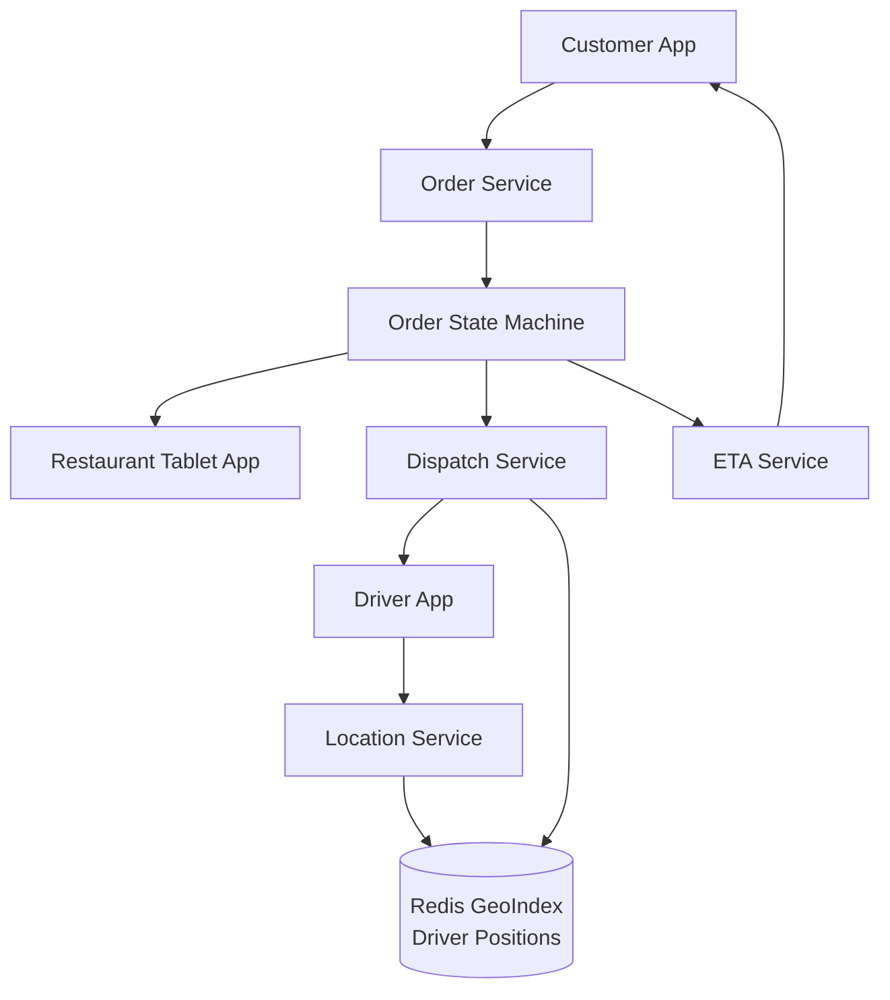
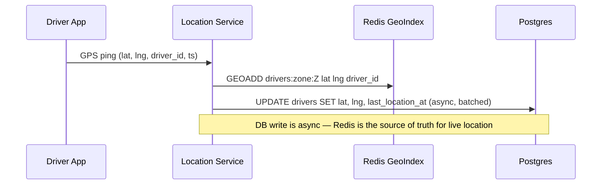
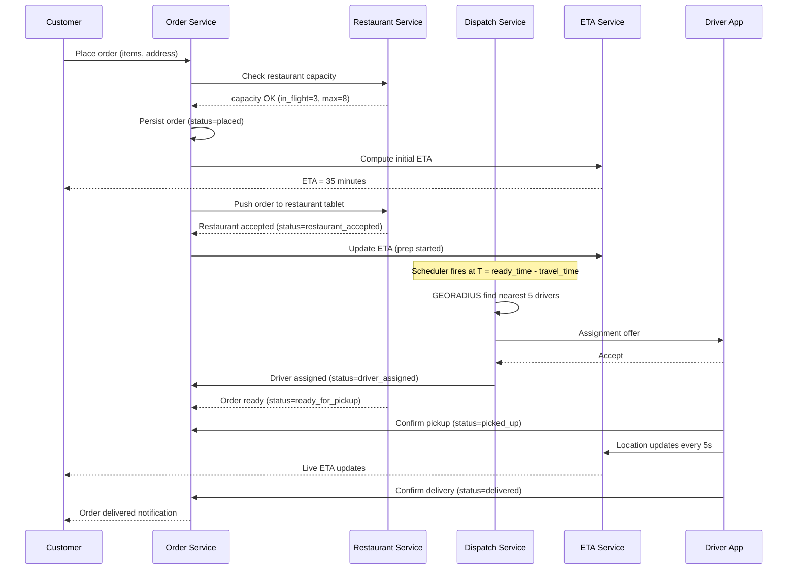

# Design a Food Delivery App (DoorDash)

**Difficulty**: 🟡 Intermediate
**Reading Time**: 18–22 minutes
**Interview Frequency**: High

---

## Level 1 — Surface (2-Minute Read)

### What Is This Problem?

Coordinate a **three-sided marketplace** (customers, restaurants, drivers) where each party has independent availability, variable timing, and real-time state. The central challenge is not just moving data — it is sequencing actions across three independent systems that all move at different speeds.

**The trigger**: When dinner rush hits, a restaurant that normally fulfills orders in 15 minutes now takes 35. If you assigned a driver the moment the order was placed, that driver has been waiting outside the restaurant for 20 minutes. The system must detect kitchen slowdowns and delay or re-assign drivers accordingly.

### Core Concepts (5 bullets)

- **Order state machine**: each order is a finite state machine with 8 states; every transition emits an event consumed by restaurant, driver, and customer
- **Deferred driver dispatch**: assign driver not at order time but at `(estimated_ready_time − driver_travel_time_to_restaurant)`; reduces driver idle wait by 40-60%
- **Restaurant capacity model**: every restaurant has a max concurrent orders limit; the system must track `in_flight_orders` and block new assignments when at capacity
- **Geo-index for driver matching**: active driver GPS positions stored in Redis `GEOADD`; radius search via `GEORADIUS` in O(N+log M) time
- **ETA as three separate segments**: `ETA_total = prep_time_remaining + driver_to_restaurant + restaurant_to_customer`; each segment is updated independently as conditions change

### Level 1 Architecture Diagram



### When To Use This Pattern

| Use this when | Don't use this when |
|---|---|
| Three or more parties must coordinate around a shared physical asset (food, parcel) | Simple two-party scheduling (calendar booking) |
| Each party has unpredictable availability or variable processing time | All timings are fixed and deterministic |
| Real-time state visibility is required by all parties | Batch processing is acceptable |
| Demand spikes 10–20x at predictable intervals (meal times) | Load is uniform |

---

## Level 2 — Deep Dive

### Problem Statement and Failure Scenario

**Traffic numbers**: DoorDash processes ~25 million deliveries per month (as of 2023), roughly 833,000 orders per day, or ~580 orders/second at peak dinner rush. At this scale, naive approaches cause visible failures:

**Failure scenario — restaurant capacity ignored**:  
At 6:30 PM, a single McDonald's location receives 40 simultaneous orders. Each order triggers an immediate driver assignment. Forty drivers converge on the restaurant, all waiting. The kitchen can only handle 8 orders in parallel. Drivers wait 25 minutes. Customer ETAs are wrong by 20 minutes. Restaurant staff are overwhelmed. Driver earnings plummet because they are idle rather than delivering.

**Root cause**: The dispatch system treated driver availability as the only constraint. It ignored **restaurant throughput capacity** — the number of concurrent orders a kitchen can fulfill without queue buildup.

---

### Data Model

Every entity in the system needs precise fields. Vague field names cause bugs when translating from whiteboard to production.

#### `orders` table

```sql
CREATE TABLE orders (
    id             UUID PRIMARY KEY,
    customer_id    UUID NOT NULL,
    restaurant_id  UUID NOT NULL,
    driver_id      UUID,                         -- null until dispatch
    status         order_status NOT NULL,         -- enum: see state machine
    items          JSONB NOT NULL,               -- [{item_id, qty, price}]
    subtotal_cents INT NOT NULL,
    delivery_fee_cents INT NOT NULL,
    tip_cents      INT NOT NULL DEFAULT 0,
    address_lat    DECIMAL(9,6) NOT NULL,
    address_lng    DECIMAL(9,6) NOT NULL,
    placed_at      TIMESTAMPTZ NOT NULL DEFAULT now(),
    accepted_at    TIMESTAMPTZ,
    ready_at       TIMESTAMPTZ,
    picked_up_at   TIMESTAMPTZ,
    delivered_at   TIMESTAMPTZ,
    est_prep_secs  INT,                          -- ML prediction at order time
    est_travel_secs INT,                         -- routing API at dispatch time
    eta_at         TIMESTAMPTZ,                  -- continuously updated
    INDEX          idx_orders_restaurant_status (restaurant_id, status),
    INDEX          idx_orders_driver (driver_id)
);

CREATE TYPE order_status AS ENUM (
    'placed', 'restaurant_accepted', 'preparing',
    'ready_for_pickup', 'driver_assigned', 'driver_en_route',
    'picked_up', 'delivered', 'cancelled'
);
```

#### `restaurants` table

```sql
CREATE TABLE restaurants (
    id                   UUID PRIMARY KEY,
    name                 VARCHAR(255),
    lat                  DECIMAL(9,6) NOT NULL,
    lng                  DECIMAL(9,6) NOT NULL,
    max_concurrent_orders INT NOT NULL DEFAULT 8,  -- kitchen capacity
    avg_prep_secs        INT NOT NULL DEFAULT 900,  -- baseline, overridden by ML
    is_open              BOOLEAN NOT NULL DEFAULT false,
    pause_new_orders     BOOLEAN NOT NULL DEFAULT false,  -- restaurant can self-pause
    zone_id              UUID NOT NULL                    -- for geo-partitioning
);
```

#### `drivers` table

```sql
CREATE TABLE drivers (
    id              UUID PRIMARY KEY,
    status          driver_status NOT NULL,   -- enum: offline, available, en_route_to_restaurant, delivering
    current_lat     DECIMAL(9,6),
    current_lng     DECIMAL(9,6),
    last_location_at TIMESTAMPTZ,
    vehicle_type    VARCHAR(50),              -- bike, car, scooter
    current_order_id UUID,                   -- null when available
    zone_id         UUID NOT NULL,
    rating          DECIMAL(3,2)
);

CREATE TYPE driver_status AS ENUM (
    'offline', 'available', 'en_route_to_restaurant', 'at_restaurant', 'delivering'
);
```

#### `deliveries` table (audit / analytics)

```sql
CREATE TABLE deliveries (
    id              UUID PRIMARY KEY,
    order_id        UUID NOT NULL REFERENCES orders(id),
    driver_id       UUID NOT NULL REFERENCES drivers(id),
    assigned_at     TIMESTAMPTZ,
    picked_up_at    TIMESTAMPTZ,
    delivered_at    TIMESTAMPTZ,
    predicted_eta   TIMESTAMPTZ,
    actual_duration_secs INT,
    distance_meters INT,
    route_polyline  TEXT          -- compressed Google/Mapbox polyline
);
```

---

### Approach A: Eager Dispatch (Naive)

Assign a driver the moment an order is placed.

**Flow**:
1. Customer places order
2. Restaurant receives notification
3. Dispatch service immediately finds nearest available driver
4. Driver travels to restaurant and waits

**Problem**: At 15-minute average prep time and 4-minute average driver travel time, drivers wait ~11 minutes per order. At 25M deliveries/month, that is **275 million driver-idle-minutes per month**. DoorDash's own research showed eager dispatch was their biggest driver earning complaint before 2019.

**When it works**: Only viable when average prep time < average driver travel time — for example, ghost kitchens optimized to sub-5-minute prep.

---

### Approach B: Deferred Dispatch (Production Standard)

Assign a driver at `T = estimated_ready_time − driver_travel_time`.

```
dispatch_trigger_time = order.placed_at
                      + ml_predicted_prep_time(restaurant_id, items, current_queue)
                      - routing_api_travel_time(nearest_driver, restaurant)
                      - BUFFER_SECS  (typically 60-120 seconds)
```

The dispatch service runs a **scheduler loop** that continuously evaluates pending orders whose `dispatch_trigger_time <= now()`. When triggered, it runs driver assignment.

**Trade-off**: Requires accurate prep-time prediction. If the ML model is wrong by 5+ minutes, either the driver arrives too early (waits) or too late (food sits cold on the counter).

---

### Approach C: Batch Dispatch with Hungarian Algorithm (DoorDash's Approach)

At scale, optimizing one driver per order ignores network-level efficiency. DoorDash's dispatch algorithm works on **batches of pending orders** every ~30 seconds and solves a **bipartite matching problem**.

**Problem modeled as**:
- Left nodes = unassigned orders (with pickup location and time window)
- Right nodes = available drivers (with current location and capacity)
- Edge weight = cost function: `travel_time + wait_time + customer_ETA_penalty`

The **Hungarian algorithm** finds a minimum-cost perfect matching in O(n³) time. At 232 orders/second during peak, batching 30-second windows gives ~7,000 orders per batch — too large for classic Hungarian. DoorDash uses a **relaxed approximate solver** with local search heuristics.

**Why batching matters**: Consider three orders in a 500-meter radius. Eager dispatch sends three drivers. Batch dispatch can assign one driver who picks up orders A, B, C in sequence — a "stack" — reducing total vehicle miles by 35-50%.

---

### Deep Dive: Restaurant Capacity Modeling

This is the section most candidates skip. The interviewer will ask about it.

Every restaurant has a hard limit on concurrent orders — constrained by:
- Number of kitchen stations
- Number of active cooks
- Equipment throughput (fryers, ovens)

**Capacity tracking in Redis** (not Postgres — too slow for hot-path writes):

```
# When order is accepted by restaurant:
INCR restaurant:{restaurant_id}:in_flight

# When order is marked ready_for_pickup:
DECR restaurant:{restaurant_id}:in_flight

# Check before accepting new order:
capacity = GET restaurant:{restaurant_id}:max_capacity   # from Postgres, cached
in_flight = GET restaurant:{restaurant_id}:in_flight
if in_flight >= capacity:
    return RESTAURANT_AT_CAPACITY
```

**The `pause_new_orders` flag**: Restaurants can press a "pause" button on their tablet when overwhelmed. This sets `restaurants.pause_new_orders = true`, which the order service checks before routing a new order to that restaurant. The platform also auto-pauses if `(in_flight / max_capacity) > 0.9` for more than 5 consecutive minutes.

**Dynamic capacity adjustment**: DoorDash infers kitchen load from order acceptance latency. If a restaurant's acceptance time-to-confirm rises above 2 minutes (normal < 30 seconds), the system reduces its effective capacity by 20% and extends prep-time estimates.

---

### Deep Dive: Driver Location Service and Geo-Index

**GPS update frequency**: Driver apps send location every 5 seconds when `status = en_route_to_restaurant` or `delivering`; every 30 seconds when `available`; no updates when `offline`.

**Scale**: 500,000 active drivers × (1 update / 5 seconds) = **100,000 writes/second** at peak.

**Why Redis GEOADD, not Postgres**:

| | Postgres PostGIS | Redis GEO |
|---|---|---|
| Write throughput | ~5,000 writes/sec | ~100,000 writes/sec |
| Radius query latency | 5-20ms with spatial index | 0.5-2ms |
| Data durability | Full ACID | RDB snapshots (acceptable — location data is transient) |
| Memory per point | ~200 bytes | ~52 bytes (geohash encoded) |

**Redis GEO commands used**:

```bash
# Driver sends GPS update:
GEOADD drivers:zone:{zone_id} {lng} {lat} {driver_id}

# Dispatch service finds 5 nearest available drivers within 5km:
GEORADIUS drivers:zone:{zone_id} {restaurant_lng} {restaurant_lat}
          5 km ASC COUNT 5 WITHCOORD

# Driver goes offline:
ZREM drivers:zone:{zone_id} {driver_id}
```

**Zone partitioning**: Drivers are sharded into geographic zones (typically 10km × 10km cells using H3 hexagonal grid). Each zone maps to a dedicated Redis shard. This prevents hot-key issues where a single Redis instance handles all Manhattan drivers.

**Location update pipeline**:



---

### Deep Dive: ETA Prediction

ETA has three independent segments:

```
ETA_customer = T_now
             + prep_time_remaining(order_id)
             + driver_travel_to_restaurant(driver_id, restaurant_id)
             + restaurant_to_customer(restaurant_id, order.address)
```

**Segment 1 — Prep time remaining**: ML model trained on:
- Restaurant historical completion times per item category
- Current `in_flight` orders at restaurant
- Time of day, day of week
- Weather (rain increases kitchen demand)
- Restaurant's recent acceptance latency (proxy for kitchen load)

Input features produce P50 and P90 estimates. The system shows customers the P75 estimate — slightly conservative, leading to positive surprise more often than negative.

**Segment 2 and 3 — Travel times**: Google Maps Platform Distance Matrix API or internal routing engine (Uber uses its own; DoorDash uses a mix). Travel time is re-fetched every 60 seconds as traffic conditions update.

**ETA update triggers**:
1. Driver location changes by > 200 meters
2. Restaurant status transitions (accepted → preparing → ready)
3. Traffic API detects delay on route
4. Driver or restaurant is more than 2 minutes off the predicted timeline

**ETA accuracy target**: ±5 minutes for 90% of deliveries. DoorDash's published metric is that late deliveries (more than 10 minutes late) make up less than 3% of total deliveries after their ETA improvements in 2021.

---

### Full System Sequence Diagram



---

### Trade-off Table: Driver Assignment Strategies

| Strategy | Latency | Driver Utilization | ETA Accuracy | Complexity | Best For |
|---|---|---|---|---|---|
| Eager dispatch | Lowest (<1s) | Low (idle wait) | Moderate | Simple | Low volume, short prep times |
| Deferred dispatch | Low (ML delay) | High | High (ML dependent) | Medium | Standard food delivery |
| Batch matching (Hungarian) | Moderate (30s batch) | Highest | Highest | High | Dense urban markets, stacking |
| Driver self-selection (broadcast) | Variable | Medium | Low | Low | Rural/low-density markets |

---

### Scale Bottlenecks at 1M Orders/Day

At 1M orders/day (~580 peak orders/second), these components break first:

**1. Driver location writes (breaks first, ~50K-100K writes/sec)**

A single Redis instance handles ~100,000 GEOADD writes/second. At 500K active drivers pinging every 5 seconds, you hit this limit. Fix: shard Redis by zone (H3 level-6 hex cells). Each shard handles only drivers in that zone.

**2. Order status reads (hot rows)**

With 8 state transitions per order × 580 orders/second = 4,640 status update writes/second. Postgres handles this fine. The bottleneck is *reads*: customers poll order status every 3 seconds. At 1M concurrent active orders × (1 read/3s) = 333,000 reads/second. Fix: fan out status updates via WebSocket push; eliminate polling entirely. Fallback: cache order status in Redis with 3-second TTL.

**3. ETA computation cost**

At 580 orders/second, each requiring 2 routing API calls (driver→restaurant, restaurant→customer), you need 1,160 routing API calls/second. Google Maps Platform charges $5 per 1,000 calls — at scale this is $500,000/month in routing costs alone. Fix: cache routes for common restaurant-to-zone paths, use internal routing engine for high-volume corridors.

**4. Dispatch service fan-out**

The dispatch scheduler evaluates all orders whose `dispatch_trigger_time <= now()`. At 580 orders/second, this scan must happen continuously. A naive `SELECT * FROM orders WHERE status='placed' AND dispatch_trigger_time <= now()` table scan becomes slow. Fix: maintain a priority queue (Redis sorted set with score = dispatch_trigger_time); the scheduler `ZRANGEBYSCORE` the head of the queue every second.

```bash
# Add order to dispatch queue:
ZADD dispatch_queue {dispatch_trigger_epoch} {order_id}

# Dispatch scheduler (runs every 1 second):
ZRANGEBYSCORE dispatch_queue -inf {now_epoch} LIMIT 0 100
```

**5. Restaurant capacity contention**

Under thundering herd (10 customers ordering from the same restaurant in the same second), all 10 check capacity concurrently and all see `in_flight=7, max=8`. All 10 attempt to increment. Race condition: 9 orders get accepted when only 1 slot was available. Fix: use Redis atomic `INCR` with a compare-and-set Lua script:

```lua
-- Atomic capacity check-and-reserve:
local key = "restaurant:" .. KEYS[1] .. ":in_flight"
local max = tonumber(ARGV[1])
local current = tonumber(redis.call("GET", key) or "0")
if current >= max then
  return 0  -- at capacity
end
redis.call("INCR", key)
return 1  -- reserved
```

---

### Real Company Reference: DoorDash at Scale

**DoorDash production numbers (2023)**:
- **25 million deliveries/month** (~833K/day, ~580/sec peak)
- **37 million active customers** in the US
- **650,000 active Dashers** (drivers)
- **500,000+ merchant partners**

**DoorDash dispatch evolution**:

| Year | Approach | Result |
|---|---|---|
| 2015 | Eager dispatch, manual zone management | Dashers idle 30% of time |
| 2018 | Deferred dispatch, rule-based | Idle time reduced to 18% |
| 2020 | ML-based prep-time prediction + batch matching | Idle time < 8%, on-time delivery improved 12% |
| 2022 | Real-time Hungarian solver on 30s windows + order stacking | Delivery cost per order reduced 15%, Dasher earnings per hour up 22% |

**DoorDash's specific implementation details (from their engineering blog)**:
- Uses a **bipartite matching solver** they call "Caviar" for dispatch optimization
- Prep-time ML model is updated with online learning — each completed order feeds back to improve future predictions for that restaurant
- Driver location data is stored in **Apache Cassandra** (not Redis) for their scale — Cassandra handles 200K+ writes/second per cluster with geo-partitioned data
- ETA computation uses a proprietary internal routing graph built from GPS trace data, updated daily

---

### Interview Angle: The Restaurant Capacity Trap

**Most candidates design the driver side well and ignore the restaurant side entirely.**

A strong answer acknowledges that the system has two queuing problems running in parallel:
1. **Driver queue**: Matching available drivers to orders spatially and temporally
2. **Restaurant queue**: Managing kitchen throughput so orders don't pile up unbounded

**Questions you should answer proactively**:

- "What happens when a restaurant gets overwhelmed?" — You should describe the `max_concurrent_orders` field, the Redis capacity counter, the auto-pause mechanism, and how the ETA model incorporates kitchen load.
- "How does the platform know a restaurant is slow before they self-report?" — Acceptance latency tracking, actual vs. predicted ready times, and the dynamic capacity adjustment mechanism.
- "A restaurant closes mid-service — what happens to in-flight orders?" — Status machine: orders in `preparing` or earlier get cancelled and refunded; orders in `ready_for_pickup` or later complete with the already-assigned driver.

**The strongest candidates also mention**:
- **Supply-side forecasting**: Pre-positioning Dashers in high-demand zones before meal rush starts, based on historical order patterns (DoorDash calls this "Dasher Zone Management")
- **Restaurant onboarding capacity modeling**: New restaurants get a conservative `max_concurrent_orders = 4` until their actual throughput is measured from 2 weeks of data

---

### Common Mistakes

**Mistake 1: Treating GPS updates as database writes**

Storing every 5-second GPS ping directly to Postgres means 100,000 writes/second hitting a relational database. This breaks at ~5,000 writes/second on standard hardware. GPS data is **transient** — you only need the latest position, not history (history can be batched to a time-series DB asynchronously). Solution: Redis for live positions, async Kafka flush to Cassandra/BigQuery for analytics.

**Mistake 2: Assigning drivers immediately on order placement**

As described above, this causes systematic driver idle time. The key insight is that the optimal driver assignment time is a function of both prep time and travel time, not a fixed offset from order placement.

**Mistake 3: Single ETA estimate that's never updated**

Many candidates compute ETA once at order placement and display it statically. Real systems recompute ETA every 60 seconds and push updates via WebSocket. Customers tolerate 5 extra minutes if the ETA updates honestly; they escalate to support if they see the original ETA pass with no update.

**Mistake 4: No handling for driver cancellations post-pickup**

If a driver cancels after physically picking up food, re-dispatch is impossible (there's no food to re-prepare). The correct handling is: platform contacts the driver, offers a penalty waiver for self-return, auto-escalates to operations team if driver goes dark. Algorithmically, drivers with a history of post-pickup cancellations are deprioritized in matching.

**Mistake 5: Ignoring time zones and daylight saving in ETA**

Restaurants operate on local time. A server storing UTC timestamps must convert correctly when displaying "ready at 6:15 PM" to a restaurant tablet in Eastern vs. Pacific time. Missing this causes meal rush timing bugs during DST transitions.

---

### Key Takeaways / TL;DR

- **Deferred dispatch reduces driver idle time by 40-60%**: dispatch at `ready_time - travel_time`, not at order placement
- **Restaurant capacity is the hidden bottleneck**: model `max_concurrent_orders` per restaurant, enforce atomically in Redis with a Lua script, auto-pause when `in_flight/capacity > 0.9` for 5+ minutes
- **Driver location requires Redis GeoIndex, not Postgres**: 100,000 writes/second is beyond relational databases; Redis GEOADD + GEORADIUS solves proximity search in O(N+log M) with 0.5–2ms latency
- **ETA = 3 segments updated independently**: prep time remaining (ML) + driver→restaurant (routing API) + restaurant→customer (routing API); recompute every 60 seconds or when any segment deviates 2+ minutes
- **DoorDash processes 25M deliveries/month using batch Hungarian matching**: 30-second batching windows, bipartite matching solver, reduces delivery cost per order by 15% vs. greedy one-by-one dispatch

---

## Related Concepts

- [Uber Backend for similar dispatch architecture](./uber-backend)
- [Hotel booking for inventory/concurrency patterns](./hotel-booking)

---

## Resources and References

| Resource | Type | What You'll Learn |
|----------|------|------------------|
| [DoorDash Engineering: Next-Gen Optimization for Dasher Dispatch](https://doordash.engineering/2020/02/28/next-generation-optimization-for-dasher-dispatch-at-doordash/) | 📖 Blog | ML-driven batch matching, Hungarian algorithm, supply-demand optimization |
| [DoorDash Engineering: Order Management System](https://doordash.engineering/2020/09/15/understanding-how-we-improved-our-order-management-system/) | 📖 Blog | State machine design, reliability at scale, multi-party coordination |
| [Uber Eats Engineering: Real-Time Delivery ETA](https://eng.uber.com/uber-eats-trip-optimization/) | 📖 Blog | Segment-based ETA, ML models for prep time, routing API integration |
| [Uber Eats Engineering: Order Reliability](https://eng.uber.com/uber-eats-order-reliability/) | 📖 Blog | Multi-party workflow reliability, failure modes, and recovery strategies |
| [Uber H3: Hexagonal Hierarchical Geospatial Indexing](https://eng.uber.com/h3/) | 📖 Blog | H3 grid for driver zone management and geo-partitioning at scale |
| [Redis GEORADIUS Documentation](https://redis.io/commands/georadius/) | 📚 Docs | GEO commands, performance characteristics, use with driver proximity |
| [ByteByteGo — Design a Food Delivery App](https://www.youtube.com/@ByteByteGo) | 📺 YouTube | Visual walkthrough of order matching and dispatch architecture |
