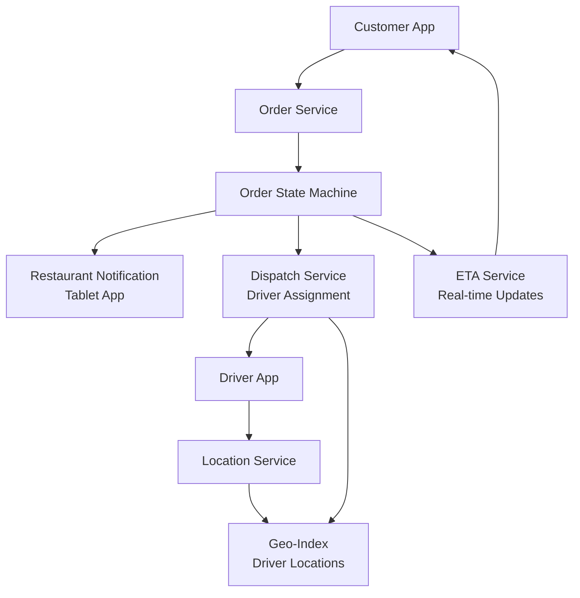

# Design a Food Delivery App (DoorDash)

**Difficulty**: 🟡 Intermediate
**Reading Time**: Coming Soon
**Interview Frequency**: Medium

---

> 🚧 **Full article coming soon.** This stub gives you the essentials to start thinking about this problem.

---

## The Core Problem

Coordinating a three-sided marketplace (restaurants, drivers, customers) with real-time tracking and accurate ETA requires sequential orchestration across parties who each have independent availability and variable timing. When a restaurant takes 40 minutes instead of 20, the system must dynamically re-dispatch a driver to arrive at the right time — not too early (driver waits and costs money) and not too late (food gets cold).

## Functional Requirements

- Customers place food orders from restaurants
- Platform notifies restaurant, assigns a delivery driver
- Real-time tracking of order status and driver location
- Accurate ETA shown to customer from order placement to delivery
- Support restaurant and driver supply fluctuations

## Non-Functional Requirements

| Requirement | Target |
|-------------|--------|
| Availability | 99.9% (8.7 hrs downtime/year) |
| Order-to-accept latency | < 5 seconds for driver assignment |
| ETA accuracy | ±5 minutes for 90% of deliveries |
| Scale | 1M orders/day, 500K drivers, 500K restaurants |

## Back-of-Envelope Estimates

- **Order rate**: 1M orders/day ÷ 86,400 = ~11.6 orders/sec average (20x spike at dinner rush = ~232/sec)
- **Driver location updates**: 500K active drivers × (1 update/10 sec) = 50,000 location writes/sec
- **State transitions per order**: 8 states (placed → accepted → preparing → ready → picked-up → delivered) × 1M orders = 8M state change events/day

## Key Design Decisions

1. **Order State Machine** — model order lifecycle as explicit state machine (placed → restaurant_accepted → preparing → ready_for_pickup → driver_en_route → delivered); each transition emits an event; all parties subscribe to relevant events via WebSocket/push.
2. **Driver Assignment Optimization** — don't assign driver immediately on order; wait until restaurant's estimated prep time minus driver travel time; reduces driver idle wait at restaurant; requires accurate prep-time ML model per restaurant.
3. **ETA Computation** — break total ETA into segments: (1) restaurant prep time (ML model), (2) driver-to-restaurant travel (maps API), (3) driver-to-customer travel (maps API); update each segment in real-time as conditions change.

## High-Level Architecture

## Top Interview Questions for This Problem

| Question | Tests |
|----------|-------|
| How do you handle a restaurant that's running 20 minutes behind on all orders? | State machine updates, ETA re-calculation |
| How would you assign drivers to multiple orders in the same area (batching)? | Optimization, delivery batching |
| What happens if the assigned driver cancels after picking up the food? | Failure recovery, re-dispatch |

## Related Concepts

- [Uber Backend for similar dispatch architecture](./uber-backend)
- [Hotel booking for inventory/concurrency patterns](./hotel-booking)

---

*📚 Full deep-dive with multiple approaches, trade-off tables, and pseudocode coming soon.*
