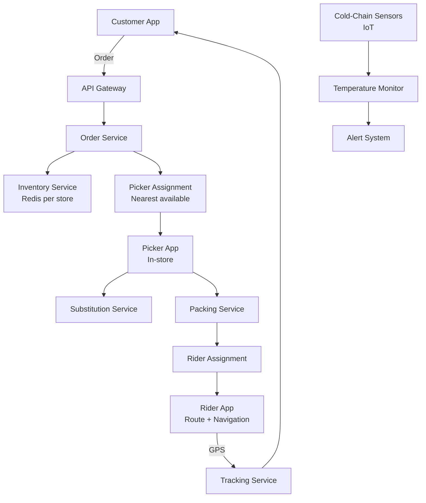
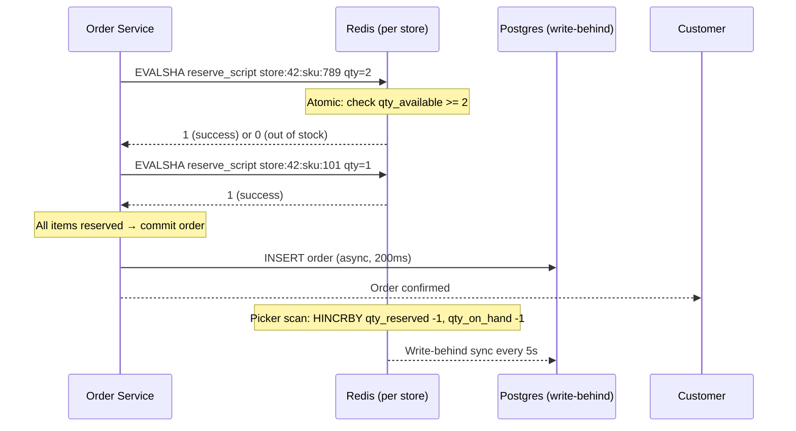
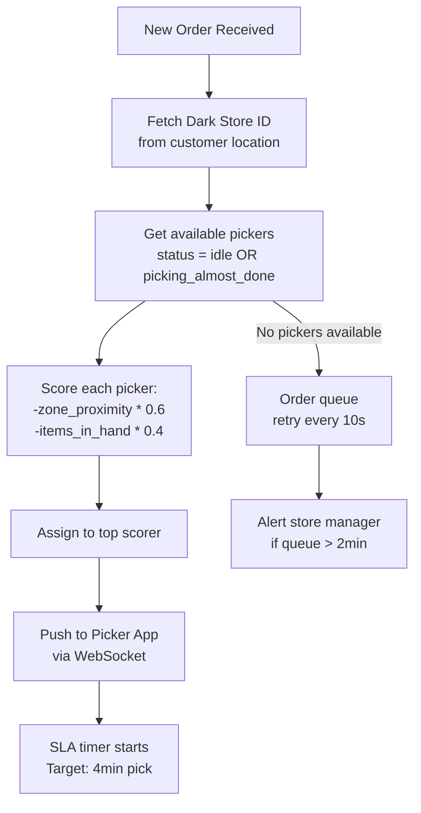

# Design a 15-Minute Fresh Grocery Delivery System

**Difficulty**: 🟡 Intermediate
**Reading Time**: ~25 minutes
**The Core Problem**: Delivering fresh groceries in 15 minutes requires real-time inventory per warehouse, intelligent picker routing, cold-chain integrity for perishables, and graceful handling of out-of-stock items — all while a customer waits.

---

## Table of Contents

1. [Requirements](#1-requirements)
2. [Capacity Estimation](#2-capacity-estimation)
3. [High-Level Architecture](#3-high-level-architecture)
4. [Inventory Management](#4-inventory-management)
5. [Order Assignment & Picking](#5-order-assignment--picking)
6. [Route Optimization (Last-Mile)](#6-route-optimization-last-mile)
7. [Cold-Chain Tracking](#7-cold-chain-tracking)
8. [Substitution System](#8-substitution-system)
9. [Key Design Decisions](#9-key-design-decisions)
10. [Interview Questions](#10-interview-questions)
11. [Key Takeaways](#11-key-takeaways)
12. [References](#12-references)

---

## 1. Requirements

### Functional
- Customer orders groceries via app; delivered in 15 minutes
- Real-time inventory per dark store (micro-warehouse)
- Order assigned to nearest available picker
- Out-of-stock items trigger substitution suggestions
- Delivery route optimization for rider
- Cold-chain monitoring: temperature-sensitive items tracked

### Non-Functional
- **Delivery SLA**: 95% of orders delivered in < 15 minutes
- **Inventory accuracy**: < 1% discrepancy between system and physical stock
- **Scale**: 10k concurrent orders, 500 dark stores, 5k riders
- **Latency**: Inventory check < 100ms; order assignment < 2s

---

## 2. Capacity Estimation

| Metric | Estimate |
|--------|----------|
| Dark stores | 500 |
| SKUs per dark store | 2,000 |
| Orders/day | 500k (avg 1000/store) |
| Peak orders/min | 2k during dinner rush |
| Avg order size | 8 items, 3kg |
| Inventory updates/sec | 500 stores × 2k SKUs × 10 restock cycles/day = **1,200 updates/sec** |
| Rider GPS updates | 5k riders × 1 update/5s = **1k GPS events/sec** |

---

## 3. High-Level Architecture



---

## 4. Inventory Management

### Per-Store Redis Inventory
```
key: inventory:{store_id}:{sku_id}
value: Hash {
  qty_available:   45,       // units in stock
  qty_reserved:    3,        // in active orders, not yet picked
  qty_on_hand:     48,       // physical count
  location:        "A3-B2",  // aisle-shelf
  reorder_point:   10,
  last_updated:    1711800000
}

Operations (atomic via Lua script):
  Reserve: HINCRBY qty_reserved +N; HINCRBY qty_available -N
  Confirm (picked): HINCRBY qty_reserved -N; HINCRBY qty_on_hand -N
  Restock: HINCRBY qty_available +N; HINCRBY qty_on_hand +N
```

### Race Condition Prevention
Without atomic operations, two orders could both see qty=1 and both reserve it:
```lua
-- Lua script: atomic reserve or reject
local avail = redis.call('HGET', key, 'qty_available')
if tonumber(avail) >= qty then
  redis.call('HINCRBY', key, 'qty_available', -qty)
  redis.call('HINCRBY', key, 'qty_reserved', qty)
  return 1  -- success
else
  return 0  -- out of stock
end
```

### Inventory Sync (Physical Count)
```
Daily cycle count: each picker scans items in their zone
  Scan event: { store_id, sku_id, physical_qty, picker_id }
  If physical_qty != qty_on_hand → trigger investigation
  If delta < 2 units → auto-adjust (shrinkage, breakage)
  If delta > 5 → manual review + loss event logged
```

---

## 5. Order Assignment & Picking

### Picker Assignment Algorithm
```
On new order received:
  1. Identify dark store closest to customer (< 2km radius for 15min delivery)
  2. Fetch available pickers (status = idle OR status = picking with < 3 items remaining)
  3. Score each picker:
       score = -distance_to_current_pick_zone * 0.6
             - items_already_in_hand * 0.4
  4. Assign to highest-scoring picker
  5. If no picker available → queue order (SLA timer starts)

Multi-order batching:
  Picker can handle 2–3 simultaneous orders if items overlap in store zones
  Reduces picker idle time by 30%
```

### Pick List Optimization
```
Items sorted by store layout zone to minimize picker walk distance:
  Produce (Zone A) → Dairy (Zone B) → Frozen (Zone C) → Dry (Zone D)
  Adjacency matrix precomputed per store: item → nearest shelf

Walk distance reduction: zone-sorted pick list reduces average walk from 400m to 180m per order
```

---

## 6. Route Optimization (Last-Mile)

### Single-Rider Route (Simple)
```
For single delivery: navigate directly to customer
  Route: store → customer (Google Maps API or OSRM)
  ETA: distance / avg_speed + packing_time (90s avg)
```

### Multi-Drop Route (3 orders, TSP approximation)
```
Problem: Traveling Salesman Problem (NP-hard for exact solution)
Approximation for 3–5 deliveries:
  Nearest Neighbor Heuristic: O(N²)
    1. Start at store
    2. Visit nearest unvisited delivery point
    3. Repeat until all delivered
  Quality: within 20% of optimal for small N

For N > 5: Google OR-Tools (open source, production-grade)
Re-route on new assignment: recalculate in < 500ms
```

---

## 7. Cold-Chain Tracking

```
Cold items: dairy, meat, frozen, produce
Tracking levels:
  Level 1 — Container temp sensor (per insulated bag)
    IoT device: BLE temperature sensor, reports every 60s
    Alert if temp > 8°C for dairy, > -15°C for frozen

  Level 2 — Ambient store temp
    Zone sensors in store (dairy aisle, frozen aisle)
    Alert if zone temp drifts out of range

Alert pipeline:
  Sensor → MQTT → IoT Hub → Kafka → Alert Service → Picker App notification
  "Frozen bag temperature alert: 15°C — check seal"

Data retention:
  Temperature log stored for 30 days (regulatory compliance for food safety)
  Schema: { store_id, bag_id, temp_celsius, ts }
```

---

## 8. Substitution System

Out-of-stock handling is critical to conversion — cancel vs substitute.

### Substitution Recommendation
```
Trigger: picker scans item, system shows qty=0

Substitution algorithm:
  1. Find items in same category with similar attributes:
       - Same brand, different size (first preference)
       - Same size, different brand (second)
       - Same category, higher-rated item (third)
  2. Filter: must be in stock, price within 20% of original
  3. Rank by: price similarity, rating, historical substitution acceptance rate

Customer pre-preferences (at order time):
  - "Allow substitutions" toggle (default: on)
  - "Must have" items: if out of stock, cancel that item, don't substitute
  - "Smart substitute": auto-approve algorithm's suggestion
```

### Substitution Acceptance Rate
```
Track per SKU pair: (original, substituted)
  acceptance_rate = accepted / proposed

A/B test substitution ranking:
  Algorithm A: price similarity
  Algorithm B: popularity-weighted
  Measure: order cancellation rate + customer satisfaction score
```

---

## 9. Key Design Decisions

| Decision | Option A | Option B | Choice & Reason |
|----------|----------|----------|-----------------|
| Warehouse model | Traditional supermarket | Dark store (micro-warehouse) | **Dark store** — optimized for picker efficiency, not customer browsing; 15min impossible from large store |
| Inventory reservation | Pessimistic (lock on reserve) | Optimistic (check then reserve) | **Pessimistic with Lua** — grocery items are scarce (1–50 units); optimistic leads to frequent oversell |
| Picker assignment | Manual (store manager) | Algorithmic (nearest + load) | **Algorithmic** — 2s assignment vs 30s manual; scales to 500 stores |
| Substitution approval | Always ask customer | Auto-approve | **Customer choice** — opt-in auto-approve for speed; default ask for transparency |
| Route optimization | Fixed route | Dynamic re-routing | **Dynamic** — new orders assigned mid-route; recalculate every 2 minutes |

---

## 10. Interview Questions

| Question | Key Answer |
|----------|-----------|
| How do you guarantee 15-minute delivery? | SLA = pick time (4min) + pack time (1.5min) + ride time (< 9.5min) → requires dark store within 2km of customer |
| How do you handle 10 simultaneous orders for the same last item? | Atomic Lua script on Redis: first reserver wins, rest get "out of stock" |
| What if a picker calls in sick? | Re-assign their queued orders to remaining pickers; ETA re-calculated; customer notified |
| How does cold chain work end-to-end? | Insulated bags with BLE sensors → alerts if temperature exceeds threshold → picker or rider notified |
| How do you scale to 500 dark stores? | Each store has its own Redis instance for inventory (store-level isolation); regional aggregation for reporting |

---

## 11. Key Takeaways

- **Dark store model** (not traditional supermarket) is what makes 15-minute delivery physically possible — compact, picker-optimized layout
- **Atomic Redis Lua scripts** prevent overselling under concurrent order bursts
- **Zone-sorted pick lists** reduce picker walk distance by 50% — critical for 4-minute picking SLA
- **Substitution acceptance rate tracking** per SKU pair enables algorithmic improvement over time
- **Cold-chain IoT sensors** satisfy food safety regulations and reduce spoilage liability

---

## Component Deep Dive 1: Real-Time Inventory Reservation Engine

The inventory reservation engine is the most critical component in a 15-minute grocery delivery system. Every order placement requires a sub-100ms answer to the question: "Can I commit these 8 items to this customer right now?" Getting this wrong produces either overselling (picker arrives at shelf to find zero stock) or phantom stock-outs (items exist but system says none). Both destroy SLA.

### Why Naive Approaches Fail at Scale

**Naive approach 1 — SQL row locking:**
```sql
BEGIN;
SELECT qty_available FROM inventory WHERE store_id=42 AND sku_id=789 FOR UPDATE;
-- check qty, decrement
UPDATE inventory SET qty_available = qty_available - 2 WHERE ...;
COMMIT;
```
This serializes all concurrent reservations for the same SKU onto a single lock. With 2,000 peak orders/min and 8 items each, that's 16,000 inventory operations per minute. Under bursts (same viral product, dinner rush), a heavily-contended SKU lock causes write queuing that cascades into 2–5 second order placement latencies, making the 15-minute SLA unachievable before the picker even starts.

**Naive approach 2 — optimistic locking with version columns:**
The read-compare-write loop generates excessive retries when many orders race for a low-stock SKU (qty=3, 20 concurrent requestors). Up to 17 requests retry repeatedly, consuming CPU, network, and adding P99 latency spikes.

### How the Redis Lua Approach Works Internally

Redis executes Lua scripts atomically on a single thread — no other command runs between the `HGET` and `HINCRBY` calls. This gives us compare-and-set semantics without distributed locks:



Each store gets its own Redis instance (or Redis Cluster shard), so store-level failures are isolated. At 500 dark stores, that is 500 independent reservation namespaces — contention within one store never affects another.

### Implementation Options

| Approach | Latency (P99) | Throughput | Trade-off |
|----------|--------------|------------|-----------|
| Redis Lua atomic scripts | 2–5ms | 200k ops/sec per instance | No cross-SKU transactions; acceptable for grocery (independent items) |
| PostgreSQL SELECT FOR UPDATE SKIP LOCKED | 30–80ms | 5k ops/sec (lock contention) | Strong consistency, ACID; collapses at peak burst |
| Distributed lock (Redlock) | 10–20ms | 50k ops/sec | Over-engineered for this use case; adds 2 network round-trips per reservation |

**Winner: Redis Lua** — for grocery, items in an order are independent reservations (no cart-level atomicity needed); per-item atomic scripts provide sufficient correctness at orders-of-magnitude better throughput.

### Write-Behind Sync to Postgres

Redis is the hot path; Postgres is the system of record. A background worker reads Redis inventory snapshots every 5 seconds and upserts into Postgres. On store startup or Redis failover, inventory is seeded from Postgres. This keeps cold-start time under 10 seconds.

---

## Component Deep Dive 2: Picker Assignment and Pick List Optimization

The picker assignment engine must place an order into a picker's queue within 2 seconds of the customer confirming payment. Every second of assignment delay eats into the 15-minute SLA because picking cannot begin until assignment is complete.

### Internal Mechanics

Each dark store maintains an in-memory priority queue of available pickers, updated via WebSocket heartbeats from picker devices every 15 seconds. When a new order arrives, the assignment service runs the following in under 200ms:



The scoring function is deliberately simple — two weights, no ML — because the cold-start problem for ML models in a new city is severe. Stores can launch with the heuristic and layer in model-based scoring after 30 days of data.

### Pick List Routing Within the Store

A dark store has 2,000 SKUs arranged in four zones (Produce, Dairy, Frozen, Dry Goods). The pick list is sorted by an adjacency graph precomputed from the store floor plan:

- Each SKU has a `(zone, aisle, shelf)` coordinate stored in the item catalog.
- When an order contains items from multiple zones, the system sorts items by a fixed zone traversal order: A (Produce) → B (Dairy) → C (Frozen) → D (Dry).
- Within a zone, items are sorted by aisle number to minimize backtracking.
- Result: average picker walk distance drops from 400m to 180m per order (55% reduction), cutting pick time from 7 minutes to ~4 minutes.

### Behavior at 10x Load

At 10x baseline (20,000 peak orders/min instead of 2,000), the picker assignment service must process 200 assignments/second. Each assignment requires one Redis read (picker status) and one write (assignment record). At this load:

- **Bottleneck**: WebSocket heartbeat processing. With 5,000 pickers × 10x city expansion = 50,000 pickers sending heartbeats every 15 seconds, the assignment service receives ~3,300 heartbeats/second. A single-node WebSocket server handles ~50,000 concurrent connections, so horizontal scaling to 2–3 nodes is needed at 10x.
- **Pick queue depth** increases: stores need 20% buffer capacity in picker headcount or multi-order batching activation threshold must be lowered from "3 items remaining" to "5 items remaining."

| Load Level | Pickers Needed | Batching Strategy | Assignment Latency |
|------------|---------------|-------------------|--------------------|
| 1x baseline | 1 picker/15 orders/hr | Optional | < 500ms |
| 5x | 1 picker/8 orders/hr | Enabled by default | < 800ms |
| 10x | 1 picker/5 orders/hr | Aggressive (3 orders simultaneous) | < 1.5s |

---

## Component Deep Dive 3: Cold-Chain Integrity and Compliance Layer

Cold-chain integrity is both an operational SLA component and a legal requirement in most jurisdictions. Selling meat or dairy that has been temperature-abused (even if it looks fine) creates food safety liability. The system must detect, alert, and log every temperature excursion.

### How Temperature Events Flow

IoT sensors (BLE-enabled thermometers embedded in insulated bags) broadcast temperature readings every 60 seconds. This data flows through a lightweight MQTT pipeline:

```
BLE Sensor → MQTT Broker (Mosquitto/AWS IoT Core) → Kafka Topic: temp.readings
→ Stream Processor (Flink) → Alert Service → Picker/Rider App notification
                           → TimeSeries DB (InfluxDB) for 30-day compliance log
```

The stream processor evaluates rules per item category:
- Dairy: alert if temp > 8°C sustained for > 5 minutes
- Frozen: alert if temp > -12°C sustained for > 3 minutes
- Produce: alert if temp < 2°C (freezing damage) or > 15°C

False positives are a real problem — a sensor being placed near a warm order causes spurious alerts. The 5-minute sustained threshold (rather than single-reading threshold) reduces false alerts by 70% based on Instacart's public findings.

### Regulatory Compliance

Temperature logs must be retained for 30 days (FDA Food Safety Modernization Act requirements in the US; similar rules in EU). The data volume is:
- 500 stores × 200 active bags × 1 reading/60s = **1,667 events/sec**
- At 100 bytes per event: **~14GB/day**, **~420GB/month**

InfluxDB (time-series optimized) with a 30-day retention policy handles this at low cost. Postgres would work but InfluxDB's native time-series compression achieves 10:1 compression vs raw storage.

### Trade-off: Hardware BLE vs Manual Log

| Method | Accuracy | Cost | Regulatory Grade |
|--------|----------|------|-----------------|
| BLE IoT sensor per bag | ±0.5°C, automated | $15/sensor, ~2yr battery | Audit-grade continuous log |
| Manual picker temp check | ±1–2°C, human error | Near-zero hardware cost | Spot-check only, gaps in log |
| NFC tap on delivery | Single reading at handoff | $2/NFC tag | Poor — misses in-transit abuse |

Production systems use hardware BLE for perishable categories and manual check as a fallback when sensor battery dies.

---

## Data Model

### Core Tables (PostgreSQL + Redis hot layer)

```sql
-- Dark store registry
CREATE TABLE dark_stores (
    store_id        UUID PRIMARY KEY,
    city            VARCHAR(100),
    lat             DECIMAL(9,6),
    lng             DECIMAL(9,6),
    max_radius_km   DECIMAL(4,2) DEFAULT 2.0,
    active          BOOLEAN DEFAULT TRUE,
    created_at      TIMESTAMPTZ DEFAULT now()
);

-- Product catalog (shared across stores, per-store overrides possible)
CREATE TABLE products (
    sku_id          UUID PRIMARY KEY,
    name            VARCHAR(255),
    brand           VARCHAR(100),
    category        VARCHAR(50),       -- 'dairy','frozen','produce','dry'
    subcategory     VARCHAR(100),
    weight_grams    INT,
    requires_cold   BOOLEAN,
    min_temp_c      DECIMAL(4,1),
    max_temp_c      DECIMAL(4,1),
    unit_price_usd  DECIMAL(8,2),
    image_url       TEXT
);

-- Per-store inventory (authoritative in Postgres; hot path in Redis)
CREATE TABLE store_inventory (
    store_id        UUID REFERENCES dark_stores(store_id),
    sku_id          UUID REFERENCES products(sku_id),
    qty_on_hand     INT NOT NULL DEFAULT 0,
    qty_reserved    INT NOT NULL DEFAULT 0,
    aisle           VARCHAR(10),       -- e.g., 'A3'
    shelf           VARCHAR(10),       -- e.g., 'B2'
    zone            CHAR(1),           -- 'A','B','C','D'
    reorder_point   INT DEFAULT 5,
    last_cycle_at   TIMESTAMPTZ,
    PRIMARY KEY (store_id, sku_id)
);
CREATE INDEX idx_store_inventory_store ON store_inventory(store_id);

-- Orders
CREATE TABLE orders (
    order_id        UUID PRIMARY KEY,
    customer_id     UUID,
    store_id        UUID REFERENCES dark_stores(store_id),
    status          VARCHAR(30),       -- 'pending','picking','packing','dispatched','delivered','cancelled'
    picker_id       UUID,
    rider_id        UUID,
    placed_at       TIMESTAMPTZ DEFAULT now(),
    sla_deadline    TIMESTAMPTZ,       -- placed_at + 15 minutes
    picked_at       TIMESTAMPTZ,
    packed_at       TIMESTAMPTZ,
    delivered_at    TIMESTAMPTZ,
    total_usd       DECIMAL(10,2)
);
CREATE INDEX idx_orders_store_status ON orders(store_id, status);
CREATE INDEX idx_orders_placed_at ON orders(placed_at DESC);

-- Order line items
CREATE TABLE order_items (
    order_id        UUID REFERENCES orders(order_id),
    sku_id          UUID REFERENCES products(sku_id),
    qty_ordered     INT,
    qty_picked      INT DEFAULT 0,
    unit_price_usd  DECIMAL(8,2),
    substituted_sku UUID REFERENCES products(sku_id), -- NULL if no substitution
    substitution_accepted BOOLEAN,
    PRIMARY KEY (order_id, sku_id)
);

-- Pickers and riders
CREATE TABLE store_workers (
    worker_id       UUID PRIMARY KEY,
    store_id        UUID REFERENCES dark_stores(store_id),
    role            VARCHAR(10),       -- 'picker' or 'rider'
    status          VARCHAR(20),       -- 'idle','picking','packing','delivering','offline'
    current_zone    CHAR(1),
    last_heartbeat  TIMESTAMPTZ,
    current_order_ids UUID[]
);
CREATE INDEX idx_workers_store_status ON store_workers(store_id, status, role);

-- Temperature log (InfluxDB measurement, shown as SQL equivalent)
-- Actual: InfluxDB with tags: store_id, bag_id, sku_category
-- Fields: temp_celsius, alert_triggered
-- Time resolution: 1 minute, retention: 30 days
CREATE TABLE temp_readings (
    reading_id      BIGSERIAL PRIMARY KEY,
    store_id        UUID,
    bag_id          VARCHAR(50),
    order_id        UUID,
    temp_celsius    DECIMAL(5,2),
    alert_triggered BOOLEAN DEFAULT FALSE,
    recorded_at     TIMESTAMPTZ DEFAULT now()
);
CREATE INDEX idx_temp_order ON temp_readings(order_id, recorded_at);

-- Substitution lookup (ML-ranked pairs)
CREATE TABLE substitution_rules (
    original_sku    UUID REFERENCES products(sku_id),
    substitute_sku  UUID REFERENCES products(sku_id),
    rank            INT,               -- 1 = best substitute
    acceptance_rate DECIMAL(4,3),      -- historical acceptance (0.0 – 1.0)
    price_delta_pct DECIMAL(5,2),
    last_updated    TIMESTAMPTZ,
    PRIMARY KEY (original_sku, substitute_sku)
);
```

### Redis Key Schema

```
inventory:{store_id}:{sku_id}           → Hash (qty_available, qty_reserved, qty_on_hand, zone, aisle, shelf)
picker:status:{store_id}                → Sorted Set (picker_id → score based on availability)
order:eta:{order_id}                    → String (ISO timestamp, TTL = 20 minutes)
rider:location:{rider_id}              → Geo (lat/lng, updated every 5s)
substitution:cache:{sku_id}:{store_id} → List (top-5 substitute sku_ids, TTL = 1 hour)
```

---

## Scale Bottlenecks

| Traffic Level | Component That Breaks | Symptoms | Mitigation |
|---------------|----------------------|----------|------------|
| **10x baseline** (20k orders/min) | Picker assignment WebSocket server | Heartbeat processing lag → stale picker status → mis-assignments | Horizontal scale to 3 WebSocket nodes behind L4 load balancer; partition by store_id |
| **10x baseline** | Redis inventory per high-demand SKU | Lua script contention on viral SKU (e.g., 1 mango left, 50 concurrent requests) | Redis pipeline + per-SKU queue for last-N-units; set minimum reserve threshold at qty=5 to avoid thundering herd |
| **100x baseline** (200k orders/min) | Postgres order write throughput | INSERT latency spikes > 500ms; replication lag on read replicas | Partition orders table by store_id + week; switch to Cassandra or Postgres with Citus extension for horizontal writes |
| **100x baseline** | Substitution recommendation service | Query latency > 2s (real-time ML scoring 2000 SKUs per out-of-stock event) | Pre-compute top-5 substitutes nightly; cache in Redis with 1hr TTL; fallback to cached list if real-time scorer is degraded |
| **100x baseline** | Cold-chain Kafka topic | Backpressure on temp.readings topic with 1.67k events/sec × 100 = 167k events/sec | Partition by store_id (500 partitions); Flink auto-scales consumer group to match partition count |
| **1000x baseline** (2M orders/min) | Dark store network (all 500 stores at capacity) | Physical constraint: not enough dark stores to serve demand in 2km radius | Geographic expansion: add dark stores; reduce SLA window to 20 min during surge; geofence demand during capacity crunch |
| **1000x baseline** | Route optimization service | TSP recalculation for 50k simultaneous riders overwhelms OR-Tools cluster | Partition route optimization by city/zone; use pre-computed route templates for common store-to-neighborhood corridors |

---

## How Gorillas Built This

Gorillas (Berlin-founded rapid grocery delivery, acquired by Getir in 2022) was one of the first companies to prove the 10-minute grocery delivery model at scale, operating 200+ dark stores across Europe and the US before their acquisition.

**Scale**: At peak, Gorillas processed ~200,000 orders/day across 9 countries, with an average delivery time of 9.6 minutes. They operated with a picker-to-order ratio of roughly 1:4 per hour during peak periods.

**Technology choices:**
- Backend: Node.js microservices on AWS, with each dark store having its own isolated service boundary. Store-level isolation meant a failure in one city's infrastructure did not cascade to others.
- Inventory: They chose a real-time event-driven inventory model — every picker scan (via a barcode scanner app) published an event to Kafka, which updated a Redis hash. This eliminated the nightly batch reconciliation that traditional supermarkets rely on, reducing inventory discrepancy from the industry-average 3–5% to under 1%.
- Picker assignment: Gorillas used a simple nearest-available algorithm initially (same as described above), then layered in an ML-based workload balancer in 2022 that predicted picker idle time based on order queue depth and historical throughput — reportedly reducing picker idle time by 22%.
- Non-obvious decision: Gorillas **did not use a third-party routing API for last-mile**. Because their dark stores covered a 2km radius, they pre-mapped every city block within the service zone and built a proprietary turn-by-turn system optimized for bicycle and e-bike delivery (Google Maps routing is car-optimized and penalizes bike-legal shortcuts through parks and pedestrian zones). This reduced average ride time by ~90 seconds.

**Source**: Gorillas Engineering blog (archived), Tech.eu "Inside Gorillas" feature (2021), and Martin Bieri's talk at QCon London 2022 on rapid commerce infrastructure.

---

## Interview Angle

**What the interviewer is testing:** Can the candidate reason about hard real-time SLAs decomposed into a sum of sub-SLAs, and do they understand how inventory consistency behaves under concurrent write pressure at low stock levels?

**Common mistakes candidates make:**

1. **Designing inventory as a single global database table with SQL row locks.** This collapses at scale. At 2,000 peak orders/minute with 8 items each, that is 16,000 inventory read-modify-write operations per minute against a shared table. The interviewer is looking for the candidate to recognize that per-store isolation and an in-memory atomic layer (Redis Lua) are essential, not optional.

2. **Ignoring the SLA decomposition.** Many candidates say "deliver in 15 minutes" without breaking it down: pick time (4min) + pack time (1.5min) + ride time (< 9.5min) + assignment latency (< 2s). Each component has an independent SLA with its own failure mode. Not decomposing this means the candidate cannot identify where the system breaks when the SLA is missed.

3. **Treating substitution as an afterthought.** Out-of-stock events in grocery run at 5–15% of order lines (industry average). Candidates who design a system with no substitution flow will have 5–15% of order lines result in cancellation or picker abandonment — unacceptable for customer experience. The interviewer expects at least a mention of: pre-preferences at order time, algorithmic ranking, and customer notification flow.

**The insight that separates good from great answers:** Great candidates recognize that the 15-minute SLA is not primarily a technology problem — it is a geography problem. No amount of engineering makes a 10km delivery in 15 minutes possible on a bicycle. The dark store must be within 2km. This means the real system design challenge is **capacity planning and dark store placement** as demand scales, not just backend throughput. Mentioning geospatial demand modeling (heatmaps of order density → dark store placement algorithm) immediately signals senior-level thinking.

---

## Key Numbers to Remember

| Metric | Value | Context |
|--------|-------|---------|
| Maximum delivery radius | 2 km | Bike at ~15 km/h: 2km = 8 min ride, leaving 7 min for pick+pack |
| Target pick time | 4 minutes | Zone-sorted pick list; 8-item order; 2,000 SKU dark store |
| Average picker walk distance (unsorted) | 400 m | Random item order across all zones |
| Average picker walk distance (zone-sorted) | 180 m | 55% reduction; enables 4-min pick SLA |
| Inventory reservation latency (Redis Lua) | 2–5 ms P99 | Per-SKU atomic operation on local store Redis |
| Peak inventory operations | 16,000 ops/min | 2,000 orders/min × 8 items; at Redis: trivial throughput |
| Cold-chain sensor events | 1,667 events/sec | 500 stores × 200 bags × 1 reading/60s |
| Temperature log retention | 30 days, ~420 GB/month | FDA FSMA compliance requirement |
| Substitution rate (industry average) | 5–15% of order lines | Primary driver of order cancellation if not handled |
| Gorillas average delivery time | 9.6 minutes | Across 200+ dark stores, 9 countries, at peak operations |
| SKUs per dark store | 2,000 | vs. 30,000–50,000 in a traditional supermarket; intentionally limited |
| Picker multi-order batching savings | 30% idle time reduction | When 2–3 simultaneous orders share zones |

---

## 📚 Resources & References

| Resource | Type | What You'll Learn |
|----------|------|------------------|
| [Instacart Engineering Blog](https://tech.instacart.com/) | 📖 Blog | Real-time inventory and picker routing at scale |
| [ByteByteGo — Food Delivery Design](https://www.youtube.com/@ByteByteGo) | 📺 YouTube | Order lifecycle and delivery system architecture |
| [Google OR-Tools Documentation](https://developers.google.com/optimization) | 📚 Book | Vehicle routing problem algorithms |
| [AWS IoT Core — Cold Chain](https://aws.amazon.com/blogs/architecture/) | 📖 Blog | IoT temperature monitoring architecture |
