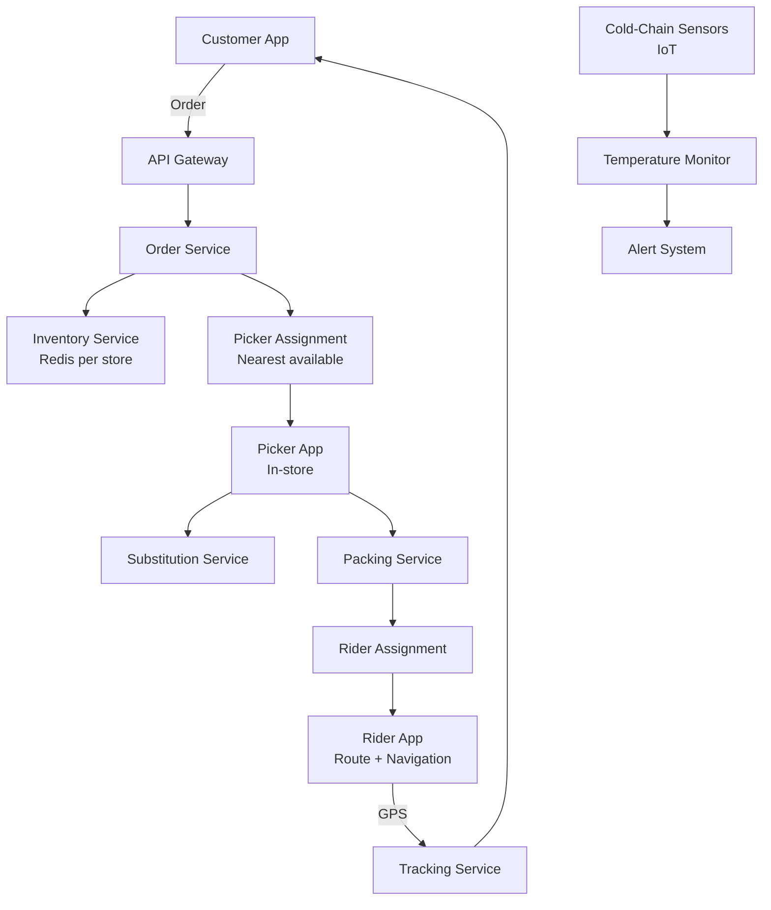

# Design a 15-Minute Fresh Grocery Delivery System

**Difficulty**: 🟡 Intermediate
**Reading Time**: ~25 minutes
**The Core Problem**: Delivering fresh groceries in 15 minutes requires real-time inventory per warehouse, intelligent picker routing, cold-chain integrity for perishables, and graceful handling of out-of-stock items — all while a customer waits.

---

## Table of Contents

1. [Requirements](#1-requirements)
2. [Capacity Estimation](#2-capacity-estimation)
3. [High-Level Architecture](#3-high-level-architecture)
4. [Inventory Management](#4-inventory-management)
5. [Order Assignment & Picking](#5-order-assignment--picking)
6. [Route Optimization (Last-Mile)](#6-route-optimization-last-mile)
7. [Cold-Chain Tracking](#7-cold-chain-tracking)
8. [Substitution System](#8-substitution-system)
9. [Key Design Decisions](#9-key-design-decisions)
10. [Interview Questions](#10-interview-questions)
11. [Key Takeaways](#11-key-takeaways)
12. [References](#12-references)

---

## 1. Requirements

### Functional
- Customer orders groceries via app; delivered in 15 minutes
- Real-time inventory per dark store (micro-warehouse)
- Order assigned to nearest available picker
- Out-of-stock items trigger substitution suggestions
- Delivery route optimization for rider
- Cold-chain monitoring: temperature-sensitive items tracked

### Non-Functional
- **Delivery SLA**: 95% of orders delivered in < 15 minutes
- **Inventory accuracy**: < 1% discrepancy between system and physical stock
- **Scale**: 10k concurrent orders, 500 dark stores, 5k riders
- **Latency**: Inventory check < 100ms; order assignment < 2s

---

## 2. Capacity Estimation

| Metric | Estimate |
|--------|----------|
| Dark stores | 500 |
| SKUs per dark store | 2,000 |
| Orders/day | 500k (avg 1000/store) |
| Peak orders/min | 2k during dinner rush |
| Avg order size | 8 items, 3kg |
| Inventory updates/sec | 500 stores × 2k SKUs × 10 restock cycles/day = **1,200 updates/sec** |
| Rider GPS updates | 5k riders × 1 update/5s = **1k GPS events/sec** |

---

## 3. High-Level Architecture



---

## 4. Inventory Management

### Per-Store Redis Inventory
```
key: inventory:{store_id}:{sku_id}
value: Hash {
  qty_available:   45,       // units in stock
  qty_reserved:    3,        // in active orders, not yet picked
  qty_on_hand:     48,       // physical count
  location:        "A3-B2",  // aisle-shelf
  reorder_point:   10,
  last_updated:    1711800000
}

Operations (atomic via Lua script):
  Reserve: HINCRBY qty_reserved +N; HINCRBY qty_available -N
  Confirm (picked): HINCRBY qty_reserved -N; HINCRBY qty_on_hand -N
  Restock: HINCRBY qty_available +N; HINCRBY qty_on_hand +N
```

### Race Condition Prevention
Without atomic operations, two orders could both see qty=1 and both reserve it:
```lua
-- Lua script: atomic reserve or reject
local avail = redis.call('HGET', key, 'qty_available')
if tonumber(avail) >= qty then
  redis.call('HINCRBY', key, 'qty_available', -qty)
  redis.call('HINCRBY', key, 'qty_reserved', qty)
  return 1  -- success
else
  return 0  -- out of stock
end
```

### Inventory Sync (Physical Count)
```
Daily cycle count: each picker scans items in their zone
  Scan event: { store_id, sku_id, physical_qty, picker_id }
  If physical_qty != qty_on_hand → trigger investigation
  If delta < 2 units → auto-adjust (shrinkage, breakage)
  If delta > 5 → manual review + loss event logged
```

---

## 5. Order Assignment & Picking

### Picker Assignment Algorithm
```
On new order received:
  1. Identify dark store closest to customer (< 2km radius for 15min delivery)
  2. Fetch available pickers (status = idle OR status = picking with < 3 items remaining)
  3. Score each picker:
       score = -distance_to_current_pick_zone * 0.6
             - items_already_in_hand * 0.4
  4. Assign to highest-scoring picker
  5. If no picker available → queue order (SLA timer starts)

Multi-order batching:
  Picker can handle 2–3 simultaneous orders if items overlap in store zones
  Reduces picker idle time by 30%
```

### Pick List Optimization
```
Items sorted by store layout zone to minimize picker walk distance:
  Produce (Zone A) → Dairy (Zone B) → Frozen (Zone C) → Dry (Zone D)
  Adjacency matrix precomputed per store: item → nearest shelf

Walk distance reduction: zone-sorted pick list reduces average walk from 400m to 180m per order
```

---

## 6. Route Optimization (Last-Mile)

### Single-Rider Route (Simple)
```
For single delivery: navigate directly to customer
  Route: store → customer (Google Maps API or OSRM)
  ETA: distance / avg_speed + packing_time (90s avg)
```

### Multi-Drop Route (3 orders, TSP approximation)
```
Problem: Traveling Salesman Problem (NP-hard for exact solution)
Approximation for 3–5 deliveries:
  Nearest Neighbor Heuristic: O(N²)
    1. Start at store
    2. Visit nearest unvisited delivery point
    3. Repeat until all delivered
  Quality: within 20% of optimal for small N

For N > 5: Google OR-Tools (open source, production-grade)
Re-route on new assignment: recalculate in < 500ms
```

---

## 7. Cold-Chain Tracking

```
Cold items: dairy, meat, frozen, produce
Tracking levels:
  Level 1 — Container temp sensor (per insulated bag)
    IoT device: BLE temperature sensor, reports every 60s
    Alert if temp > 8°C for dairy, > -15°C for frozen

  Level 2 — Ambient store temp
    Zone sensors in store (dairy aisle, frozen aisle)
    Alert if zone temp drifts out of range

Alert pipeline:
  Sensor → MQTT → IoT Hub → Kafka → Alert Service → Picker App notification
  "Frozen bag temperature alert: 15°C — check seal"

Data retention:
  Temperature log stored for 30 days (regulatory compliance for food safety)
  Schema: { store_id, bag_id, temp_celsius, ts }
```

---

## 8. Substitution System

Out-of-stock handling is critical to conversion — cancel vs substitute.

### Substitution Recommendation
```
Trigger: picker scans item, system shows qty=0

Substitution algorithm:
  1. Find items in same category with similar attributes:
       - Same brand, different size (first preference)
       - Same size, different brand (second)
       - Same category, higher-rated item (third)
  2. Filter: must be in stock, price within 20% of original
  3. Rank by: price similarity, rating, historical substitution acceptance rate

Customer pre-preferences (at order time):
  - "Allow substitutions" toggle (default: on)
  - "Must have" items: if out of stock, cancel that item, don't substitute
  - "Smart substitute": auto-approve algorithm's suggestion
```

### Substitution Acceptance Rate
```
Track per SKU pair: (original, substituted)
  acceptance_rate = accepted / proposed

A/B test substitution ranking:
  Algorithm A: price similarity
  Algorithm B: popularity-weighted
  Measure: order cancellation rate + customer satisfaction score
```

---

## 9. Key Design Decisions

| Decision | Option A | Option B | Choice & Reason |
|----------|----------|----------|-----------------|
| Warehouse model | Traditional supermarket | Dark store (micro-warehouse) | **Dark store** — optimized for picker efficiency, not customer browsing; 15min impossible from large store |
| Inventory reservation | Pessimistic (lock on reserve) | Optimistic (check then reserve) | **Pessimistic with Lua** — grocery items are scarce (1–50 units); optimistic leads to frequent oversell |
| Picker assignment | Manual (store manager) | Algorithmic (nearest + load) | **Algorithmic** — 2s assignment vs 30s manual; scales to 500 stores |
| Substitution approval | Always ask customer | Auto-approve | **Customer choice** — opt-in auto-approve for speed; default ask for transparency |
| Route optimization | Fixed route | Dynamic re-routing | **Dynamic** — new orders assigned mid-route; recalculate every 2 minutes |

---

## 10. Interview Questions

| Question | Key Answer |
|----------|-----------|
| How do you guarantee 15-minute delivery? | SLA = pick time (4min) + pack time (1.5min) + ride time (< 9.5min) → requires dark store within 2km of customer |
| How do you handle 10 simultaneous orders for the same last item? | Atomic Lua script on Redis: first reserver wins, rest get "out of stock" |
| What if a picker calls in sick? | Re-assign their queued orders to remaining pickers; ETA re-calculated; customer notified |
| How does cold chain work end-to-end? | Insulated bags with BLE sensors → alerts if temperature exceeds threshold → picker or rider notified |
| How do you scale to 500 dark stores? | Each store has its own Redis instance for inventory (store-level isolation); regional aggregation for reporting |

---

## 11. Key Takeaways

- **Dark store model** (not traditional supermarket) is what makes 15-minute delivery physically possible — compact, picker-optimized layout
- **Atomic Redis Lua scripts** prevent overselling under concurrent order bursts
- **Zone-sorted pick lists** reduce picker walk distance by 50% — critical for 4-minute picking SLA
- **Substitution acceptance rate tracking** per SKU pair enables algorithmic improvement over time
- **Cold-chain IoT sensors** satisfy food safety regulations and reduce spoilage liability

---

## 📚 Resources & References

| Resource | Type | What You'll Learn |
|----------|------|------------------|
| [Instacart Engineering Blog](https://tech.instacart.com/) | 📖 Blog | Real-time inventory and picker routing at scale |
| [ByteByteGo — Food Delivery Design](https://www.youtube.com/@ByteByteGo) | 📺 YouTube | Order lifecycle and delivery system architecture |
| [Google OR-Tools Documentation](https://developers.google.com/optimization) | 📚 Book | Vehicle routing problem algorithms |
| [AWS IoT Core — Cold Chain](https://aws.amazon.com/blogs/architecture/) | 📖 Blog | IoT temperature monitoring architecture |
