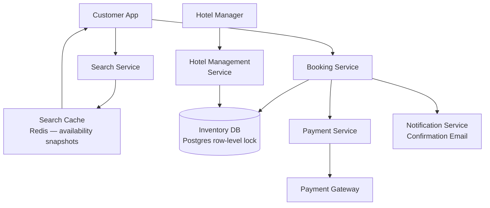
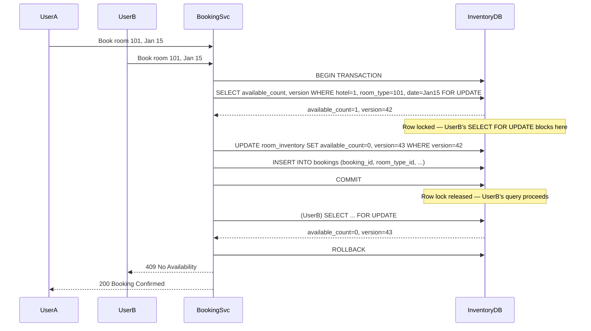

# Design a Hotel Booking System

**Difficulty**: 🟡 Intermediate
**Reading Time**: ~18 minutes
**Interview Frequency**: High

---

## The Core Problem

Preventing double-booking across 100,000 hotels with 10 million concurrent search users requires solving a classic inventory reservation problem: room availability must be consistent (can't oversell), reads massively outnumber writes (search vs book), and the window between "check availability" and "complete booking" must be atomic to prevent race conditions.

## Functional Requirements

- Search for available rooms by hotel, dates, room type
- Book a specific room for specific dates (atomic reservation)
- Cancel bookings with refund processing
- Support for hotel managers to manage room inventory
- View booking confirmation and history

## Non-Functional Requirements

| Requirement | Target |
|-------------|--------|
| Availability | 99.99% (52 min/year) |
| Search latency | p99 < 500ms |
| Booking latency | p99 < 2 seconds |
| Scale | 100K hotels, 10M searches/day, 1M bookings/day |

## Back-of-Envelope Estimates

- **Search queries**: 10M searches/day ÷ 86,400 = ~116 searches/sec (peak 10x = 1,160/sec)
- **Booking writes**: 1M bookings/day ÷ 86,400 = ~12 bookings/sec — low write rate
- **Room inventory records**: 100K hotels × 200 rooms avg × 365 days = 7.3B availability slots/year

## Key Design Decisions

1. **Optimistic Locking for Booking** — check availability → begin booking → DB check-and-set with version number; if version changed (another booking snuck in), retry; optimistic locking works well when conflicts are rare (<1% collision rate at 12 bookings/sec).
2. **Room Inventory Model** — store availability as a count per (hotel_id, room_type, date) rather than per individual room; reduces record count from millions to thousands; use DB row-level locking during booking transaction.
3. **Idempotent Booking with Booking ID** — generate booking_id client-side before calling API; API uses booking_id as idempotency key; if network fails and client retries, server recognizes duplicate and returns original result — no double charge.

## High-Level Architecture



## Top Interview Questions for This Problem

| Question | Tests |
|----------|-------|
| How do you prevent two users from booking the last room simultaneously? | Optimistic locking, atomic operations |
| How do you handle a payment failure after inventory has been reserved? | Saga pattern, compensating transactions |
| How would you show accurate availability during a search without locking? | Eventual consistency, snapshot reads |

## Related Concepts

- [Ticketmaster for similar inventory contention](../04-reservation-scheduling/ticketmaster)
- [Shopify flash sales for similar concurrency problems](../02-social-platforms/shopify)

---

## Component Deep Dive 1: Inventory Reservation and Concurrency Control

The inventory reservation component is the most critical and most failure-prone part of a hotel booking system. Its job is deceptively simple: atomically decrement an availability counter when a booking is confirmed and atomically restore it on cancellation. In practice, it must handle thousands of concurrent requests racing over the same (hotel, room_type, date) inventory record.

**Why naive approaches fail at scale**

The most obvious naive approach is a read-check-write pattern: read current availability, check if count > 0, then write a new booking row. This has a classic TOCTOU (time-of-check-to-time-of-use) race condition. Two users both read `available_rooms = 1`, both see it is non-zero, and both proceed to write a booking — result: two bookings for one room. At 12 bookings/sec this collision is rare, but at peak (major holidays, flash sales), it becomes unavoidable.

A second naive approach is to use application-level locks (Redis SET NX with TTL). This works for simple cases but has failure modes: the process holding the lock crashes before releasing it (TTL helps but introduces latency overhead), clock drift across Redis replicas causes lock inconsistency, and Redlock-style distributed locking adds complexity without eliminating all edge cases.

**The correct approach: database row-level locking with SELECT FOR UPDATE**

The production-grade pattern is to use `SELECT ... FOR UPDATE` within a database transaction on the `room_inventory` row keyed by `(hotel_id, room_type_id, date)`. This acquires an exclusive row lock that blocks concurrent writers until the transaction commits or rolls back. The lock scope is exactly one row, so it does not block reads or writes to other hotels or dates.

For optimistic locking (fewer blocked reads), use a `version` column. The booking transaction reads the row with its current version, then updates with a `WHERE version = :read_version` clause. If another booking committed between the read and the write, the row version will have changed and the UPDATE affects 0 rows — the application retries with fresh data.



**Trade-off table: three locking strategies**

| Approach | Latency (p99) | Throughput | Trade-off |
|----------|--------------|------------|-----------|
| SELECT FOR UPDATE (pessimistic) | 50–200ms | ~500 concurrent bookings/hotel | Serializes writes; safe but blocks under high contention |
| Optimistic locking (version column) | 10–40ms (no conflict) | High for low-conflict workloads | Retry storms if many users race for the last room |
| Redis distributed lock (Redlock) | 5–20ms + lock RTT | ~2,000 concurrent across cluster | Network partition risk; complex failure modes; not ACID |

For hotel booking the recommendation is **pessimistic locking** (`SELECT FOR UPDATE`) at the inventory row level. Hotel booking is low-write (12 bookings/sec globally), the lock is held for <100ms, and correctness is non-negotiable.

---

## Component Deep Dive 2: Search and Availability Caching

The search service handles 10–100x more traffic than the booking service (1,160 searches/sec at peak vs 12 bookings/sec). Search must return results in <500ms p99 across 100K hotels, 200 room types, and a rolling 365-day date window. Querying the live `room_inventory` table for every search is infeasible — it would require range scans over billions of rows with sub-second latency.

**Internal mechanics: snapshot-based availability cache**

The solution is a two-tier availability snapshot. The live inventory DB stores ground truth. A background job (or CDC stream via Debezium) writes aggregated availability snapshots to Redis every 60 seconds per hotel. The search service reads exclusively from Redis. The booking service writes to the inventory DB and also invalidates the Redis key for that hotel after every committed booking.

At scale this means search sees at most 60-second-stale data — acceptable because availability flips from "available" to "unavailable" only when a booking commits. Users searching for rooms and seeing a stale "available" result who then click "book" will hit the real availability check at booking time. This is the same pattern used at Booking.com: search shows stale counts, the booking flow enforces real availability.

**What happens at 10x load (11,600 searches/sec)**

At 10x load the Redis cluster is the bottleneck. A single Redis node handles ~100,000 GET/sec, so 11,600 searches/sec with each search touching 5–10 hotel keys is well within a single Redis node's capacity. The real concern is cache invalidation thundering herd: if 100 hotels all complete bookings in the same second, 100 Redis invalidations fire simultaneously. The search cache rebuild for each hotel requires a DB read — 100 concurrent DB reads spike the primary. Mitigation: use lazy cache rebuild (read-through) with jitter on TTL (e.g., TTL = 60 ± random(10) seconds), and rate-limit invalidation fanout.

| Layer | Handles | Limit | Failure Mode |
|-------|---------|-------|--------------|
| Redis search cache | 100K hotel snapshots | ~100K GET/sec per node | Stale reads during invalidation lag |
| Postgres inventory DB | Booking transactions | ~500 concurrent row locks | Lock contention on hot inventory rows |
| CDN (static hotel data) | Hotel metadata, images | Millions of req/sec | Cache miss rate spike on new hotels |

---

## Component Deep Dive 3: Saga Pattern for Payment-Booking Consistency

A hotel booking is a multi-step transaction spanning at least three services: inventory reservation, payment charge, and booking confirmation. If payment fails after inventory is reserved, or if the confirmation email fails after payment succeeds, the system is in an inconsistent state. Traditional two-phase commit (2PC) across services is impractical — it creates distributed locks that span network hops and external payment gateways.

**The Saga pattern with compensating transactions**

A Saga breaks the multi-step workflow into a sequence of local transactions, each with a corresponding compensating transaction that undoes it if a later step fails. For hotel booking:

1. `ReserveInventory` → compensating: `ReleaseInventory`
2. `ChargePayment` → compensating: `RefundPayment`
3. `CreateBookingRecord` → compensating: `DeleteBookingRecord`
4. `SendConfirmation` → (no compensation needed — idempotent retry)

If `ChargePayment` fails, the Saga orchestrator calls `ReleaseInventory` to free the room. If `CreateBookingRecord` fails after a successful payment, the orchestrator calls `RefundPayment` then `ReleaseInventory`.

**Choreography vs orchestration**

Choreography (event-based: each service emits events and reacts to others' events) scales well but is hard to debug when a booking gets stuck mid-saga. Orchestration (a central Saga coordinator service issues commands to each participant) makes the flow explicit and observable. For hotel booking, orchestration is preferred because: payments require synchronous confirmation from the gateway, the number of steps is small (4–5), and tracing a failed booking to root cause requires a clear audit log that an orchestrator naturally provides.

**Idempotency is mandatory at every step**

Every Saga step must be idempotent. The booking service generates a `booking_id` UUID client-side before the first API call. This UUID flows through every downstream call as an idempotency key. The payment gateway receives `booking_id` as the payment reference — duplicate retries return the original charge result. The DB upserts on `booking_id` as primary key. Without idempotency, network retries cause double charges — the most user-visible failure mode.

---

## Data Model

The data model uses a count-per-slot approach for inventory (not a row per physical room) to keep the hot table small and lockable at a predictable granularity.

```sql
-- Core hotel inventory
CREATE TABLE hotels (
    hotel_id        BIGSERIAL PRIMARY KEY,
    name            VARCHAR(255) NOT NULL,
    city            VARCHAR(100) NOT NULL,
    country_code    CHAR(2) NOT NULL,
    star_rating     SMALLINT CHECK (star_rating BETWEEN 1 AND 5),
    created_at      TIMESTAMPTZ DEFAULT now()
);

CREATE TABLE room_types (
    room_type_id    BIGSERIAL PRIMARY KEY,
    hotel_id        BIGINT NOT NULL REFERENCES hotels(hotel_id),
    name            VARCHAR(100) NOT NULL,   -- "Deluxe King", "Standard Twin"
    capacity        SMALLINT NOT NULL,       -- max guests
    base_price_usd  NUMERIC(10, 2) NOT NULL,
    total_rooms     SMALLINT NOT NULL        -- physical room count for this type
);

-- One row per (hotel, room_type, date) — 7.3B rows for 100K hotels × 200 types × 365 days
-- Partition by date range (monthly partitions) to keep scans fast
CREATE TABLE room_inventory (
    hotel_id        BIGINT NOT NULL,
    room_type_id    BIGINT NOT NULL,
    stay_date       DATE NOT NULL,
    available_count SMALLINT NOT NULL DEFAULT 0,
    price_usd       NUMERIC(10, 2) NOT NULL,  -- dynamic pricing may differ from base
    version         BIGINT NOT NULL DEFAULT 0, -- optimistic lock version
    PRIMARY KEY (hotel_id, room_type_id, stay_date)
) PARTITION BY RANGE (stay_date);

-- Index for search: "all available room types in city X for date range"
CREATE INDEX idx_inventory_search
    ON room_inventory (hotel_id, stay_date, available_count)
    WHERE available_count > 0;

-- Bookings table
CREATE TABLE bookings (
    booking_id      UUID PRIMARY KEY,          -- client-generated idempotency key
    user_id         BIGINT NOT NULL,
    hotel_id        BIGINT NOT NULL REFERENCES hotels(hotel_id),
    room_type_id    BIGINT NOT NULL REFERENCES room_types(room_type_id),
    check_in_date   DATE NOT NULL,
    check_out_date  DATE NOT NULL,
    total_price_usd NUMERIC(12, 2) NOT NULL,
    status          VARCHAR(20) NOT NULL        -- PENDING, CONFIRMED, CANCELLED, REFUNDED
                    CHECK (status IN ('PENDING','CONFIRMED','CANCELLED','REFUNDED')),
    payment_ref     VARCHAR(255),              -- external payment gateway reference
    created_at      TIMESTAMPTZ DEFAULT now(),
    updated_at      TIMESTAMPTZ DEFAULT now()
);

CREATE INDEX idx_bookings_user ON bookings (user_id, check_in_date DESC);
CREATE INDEX idx_bookings_hotel ON bookings (hotel_id, check_in_date);

-- Saga state machine for booking workflow
CREATE TABLE booking_sagas (
    saga_id         UUID PRIMARY KEY,
    booking_id      UUID NOT NULL REFERENCES bookings(booking_id),
    current_step    VARCHAR(50) NOT NULL,
    status          VARCHAR(20) NOT NULL CHECK (status IN ('IN_PROGRESS','COMPLETED','COMPENSATING','FAILED')),
    step_payload    JSONB,                     -- step-specific context for retry/compensation
    attempts        SMALLINT DEFAULT 0,
    created_at      TIMESTAMPTZ DEFAULT now(),
    updated_at      TIMESTAMPTZ DEFAULT now()
);
```

---

## Scale Bottlenecks

| Traffic Level | Component That Breaks | Symptoms | Mitigation |
|---------------|----------------------|----------|------------|
| 10x baseline (1,160 searches/sec, 120 bookings/sec) | Redis search cache | Cache miss rate spikes on invalidation bursts; DB read pressure | Increase Redis cluster nodes; add read replicas; stagger TTL with jitter |
| 100x baseline (11,600 searches/sec, 1,200 bookings/sec) | Postgres inventory DB | Row lock wait times spike from <10ms to 500ms+; booking p99 breaches 2s SLA | Shard inventory DB by `hotel_id % N`; promote read replicas for search; migrate hot inventory to CockroachDB for distributed row locks |
| 1000x baseline (116,000 searches/sec, 12,000 bookings/sec) | Everything | Full DB saturation; cache CPU saturation; Saga orchestrator becomes bottleneck | Migrate to a globally distributed DB (Spanner, YugabyteDB); move search to Elasticsearch with Kafka-fed index; move Saga orchestration to a durable workflow engine (Temporal, Conductor) |

**The 100x threshold is the critical inflection point.** Below it, a single Postgres primary with read replicas and a Redis cache handles load comfortably. Above it, the inventory DB sharding decision must be made — and the sharding key (`hotel_id`) means cross-hotel queries (e.g., "find all available 5-star rooms in Paris") require scatter-gather across shards. This is why Booking.com separates its search index (Elasticsearch) from its booking database (sharded Postgres) — they are optimized for completely different access patterns.

---

## How Booking.com Built This

Booking.com is the world's largest online travel platform, handling over **28 million bookings per day** across 28 million reported accommodation listings. Their engineering challenge is the clearest real-world analog to this design problem.

**Technology choices**

Booking.com runs on a PHP monolith that was incrementally decomposed into services over a decade. The core inventory system is backed by **MySQL** (not Postgres) with heavy use of `SELECT ... FOR UPDATE` at the room availability row level — the same pessimistic locking pattern described above. They use **Memcached** (not Redis) for their availability snapshot cache, with cache keys structured as `avail:{hotel_id}:{date_range_hash}`. Cache TTL is 60 seconds by default but drops to 15 seconds when a hotel is within 80% occupancy — they dynamically tighten freshness as rooms become scarce.

**Specific numbers**

Their search infrastructure handles approximately **500,000 availability queries per second** at peak (New Year's Eve, summer holidays). Their booking write path processes approximately **300 booking writes per second** at peak. The inventory cache layer serves 99.5% of availability reads; the database handles the remaining 0.5% (cache misses and booking-time consistency checks).

**The non-obvious architectural decision: split availability vs bookability**

Booking.com distinguishes between *availability* (can the room be shown in search?) and *bookability* (can the room actually be booked right now?). Search uses the cached availability snapshot. The moment a user clicks "Book Now," a separate synchronous availability check hits the live database before the payment form is shown. This pre-booking check — which they call the "hold" step — reserves a soft lock on the room for 15 minutes while the user completes payment. The soft lock is implemented as a DB row with an expiry timestamp; a background job releases expired holds every 60 seconds.

This two-phase "show availability from cache, hold before payment" design decouples the 500K/sec search load from the live inventory database, while still preventing double-booking at the critical payment step.

Source: Booking.com Engineering Blog — [How we improved our booking system](https://medium.com/booking-com-development), and engineering talks at GOTO Conference 2019.

---

## Interview Angle

**What the interviewer is testing:** Whether you understand that the hard problem is not the happy path (one user books a room) but the concurrency edge cases — what happens when two users race for the last room, and what happens when payment fails midway through a booking. The interviewer wants to see you identify the TOCTOU race condition and propose a correct atomic solution.

**Common mistakes candidates make:**

1. **Application-level locking with Redis SET NX** — candidates often reach for Redis distributed locks because they feel modern. This is wrong for inventory: Redis locks are advisory, not enforced by the inventory DB. A process crash, a Redis failover, or clock drift can cause two bookings for one room. The DB transaction is the enforcement boundary.

2. **Forgetting idempotency on the booking API** — candidates design the booking flow but skip what happens when the client retries after a timeout. Without a client-generated `booking_id` as an idempotency key, a retry creates a second booking (and a second payment charge). This is the most common real-world bug in booking systems.

3. **Using 2PC across services** — some candidates propose two-phase commit between the booking service and payment service to guarantee consistency. 2PC is impractical across service boundaries (payment gateways do not implement 2PC) and creates distributed locks that span external network calls. The correct answer is the Saga pattern with compensating transactions.

**The insight that separates good from great answers:** Recognizing that search and booking have fundamentally incompatible consistency requirements. Search can tolerate stale data (60-second-old cache) because the cost of showing a stale "available" result is just a failure at booking time — not a data corruption. But booking must be strictly consistent because the cost of overselling is a real customer harm. A great candidate explicitly separates these two subsystems, gives each its own consistency model, and explains why eventual consistency is safe for search but unsafe for the booking transaction.

---

## Key Numbers to Remember

| Metric | Value | Context |
|--------|-------|---------|
| Search-to-booking ratio | ~100:1 | 1,160 searches/sec vs 12 bookings/sec at baseline |
| Availability cache TTL | 60 seconds (normal) / 15 seconds (near-full hotel) | Booking.com dynamic TTL strategy |
| Inventory table size | 7.3 billion rows | 100K hotels × 200 room types × 365 days |
| Row lock hold duration | <100ms | SELECT FOR UPDATE during booking transaction |
| Booking.com peak search QPS | ~500,000/sec | Served 99.5% from Memcached |
| Booking.com peak booking writes | ~300/sec | Against live MySQL with row locks |
| Soft hold TTL | 15 minutes | Time to complete payment before hold expires |
| Saga compensation window | <5 minutes | Maximum time for a compensating transaction to execute |

---

## 📚 Resources & References

| Resource | Type | What You'll Learn |
|----------|------|------------------|
| [System Design Interview Vol 2 — Alex Xu](https://www.amazon.com/System-Design-Interview-Insiders-Guide/dp/1736049119) | 📚 Book | Chapter on hotel reservation system design |
| [ByteByteGo — Design a Hotel Booking System](https://www.youtube.com/@ByteByteGo) | 📺 YouTube | Search "hotel booking design" — inventory management and double-booking prevention |
| [Booking.com Engineering: Availability Search](https://medium.com/booking-com-development/how-we-re-improving-our-booking-system-8b4d54a34e2f) | 📖 Blog | How Booking.com handles 28M+ bookings/day with inventory consistency |
| [Airbnb Engineering: Listing Availability](https://medium.com/airbnb-engineering/scaling-airbnbs-architecture-cba7f28fef84) | 📖 Blog | How Airbnb manages calendar availability and booking conflicts |
| [Two-Phase Commit for Booking Transactions](https://docs.yugabyte.com/preview/explore/transactions/distributed-transactions-ysql/) | 📚 Docs | Distributed transaction patterns for cross-service booking operations |
