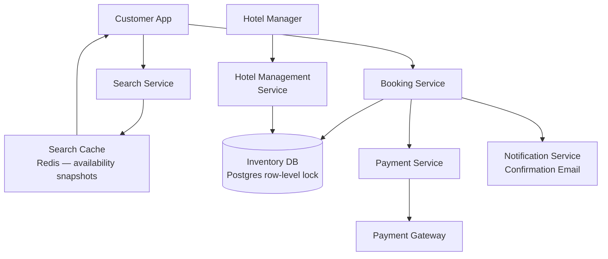

# Design a Hotel Booking System

**Difficulty**: 🟡 Intermediate
**Reading Time**: Coming Soon
**Interview Frequency**: High

---

> 🚧 **Full article coming soon.** This stub gives you the essentials to start thinking about this problem.

---

## The Core Problem

Preventing double-booking across 100,000 hotels with 10 million concurrent search users requires solving a classic inventory reservation problem: room availability must be consistent (can't oversell), reads massively outnumber writes (search vs book), and the window between "check availability" and "complete booking" must be atomic to prevent race conditions.

## Functional Requirements

- Search for available rooms by hotel, dates, room type
- Book a specific room for specific dates (atomic reservation)
- Cancel bookings with refund processing
- Support for hotel managers to manage room inventory
- View booking confirmation and history

## Non-Functional Requirements

| Requirement | Target |
|-------------|--------|
| Availability | 99.99% (52 min/year) |
| Search latency | p99 < 500ms |
| Booking latency | p99 < 2 seconds |
| Scale | 100K hotels, 10M searches/day, 1M bookings/day |

## Back-of-Envelope Estimates

- **Search queries**: 10M searches/day ÷ 86,400 = ~116 searches/sec (peak 10x = 1,160/sec)
- **Booking writes**: 1M bookings/day ÷ 86,400 = ~12 bookings/sec — low write rate
- **Room inventory records**: 100K hotels × 200 rooms avg × 365 days = 7.3B availability slots/year

## Key Design Decisions

1. **Optimistic Locking for Booking** — check availability → begin booking → DB check-and-set with version number; if version changed (another booking snuck in), retry; optimistic locking works well when conflicts are rare (<1% collision rate at 12 bookings/sec).
2. **Room Inventory Model** — store availability as a count per (hotel_id, room_type, date) rather than per individual room; reduces record count from millions to thousands; use DB row-level locking during booking transaction.
3. **Idempotent Booking with Booking ID** — generate booking_id client-side before calling API; API uses booking_id as idempotency key; if network fails and client retries, server recognizes duplicate and returns original result — no double charge.

## High-Level Architecture

## Top Interview Questions for This Problem

| Question | Tests |
|----------|-------|
| How do you prevent two users from booking the last room simultaneously? | Optimistic locking, atomic operations |
| How do you handle a payment failure after inventory has been reserved? | Saga pattern, compensating transactions |
| How would you show accurate availability during a search without locking? | Eventual consistency, snapshot reads |

## Related Concepts

- [Ticketmaster for similar inventory contention](../04-reservation-scheduling/ticketmaster)
- [Shopify flash sales for similar concurrency problems](../02-social-platforms/shopify)

---

*📚 Full deep-dive with multiple approaches, trade-off tables, and pseudocode coming soon.*
