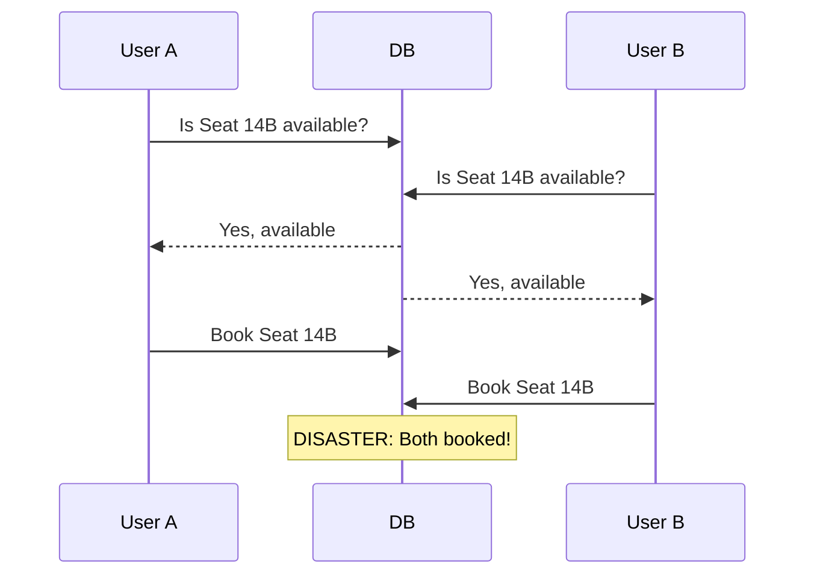

# 📅 Reservation & Scheduling

These problems are united by the hardest problem in distributed systems: **two users want the same thing at the same time**.

## The Double-Booking Problem

| Problem | Key Challenge | Difficulty |
|---------|---------------|-----------|
| [Ticketmaster](./ticketmaster) | Seat hold concurrency, scalper prevention | 🔴 Hard |
| [Uber Backend](./uber-backend) | Real-time matching, geo proximity | 🔴 Hard |
| [Food Delivery](./food-delivery) | Multi-party coordination, ETA | 🔴 Hard |
| [Hotel Booking](./hotel-booking) | Room availability, date ranges | 🔴 Hard |
| [Auction System](./auction-system) | Bid ordering, fraud prevention | 🔴 Hard |
| [Task Scheduler](./task-scheduler) | Cron jobs, at-most-once execution | 🟡 Medium |

## The Fundamental Solutions

1. **Optimistic Locking**: Read version, update with WHERE version=N — good for low contention
2. **Pessimistic Locking**: SELECT FOR UPDATE — good for high contention, bad for throughput
3. **Distributed Lock (Redis)**: SETNX + TTL — good for seat holds with auto-expiry
4. **Saga Pattern**: Distributed transactions without 2PC — required for multi-service bookings
