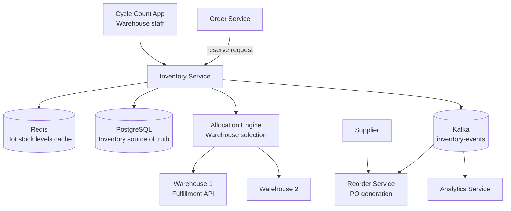
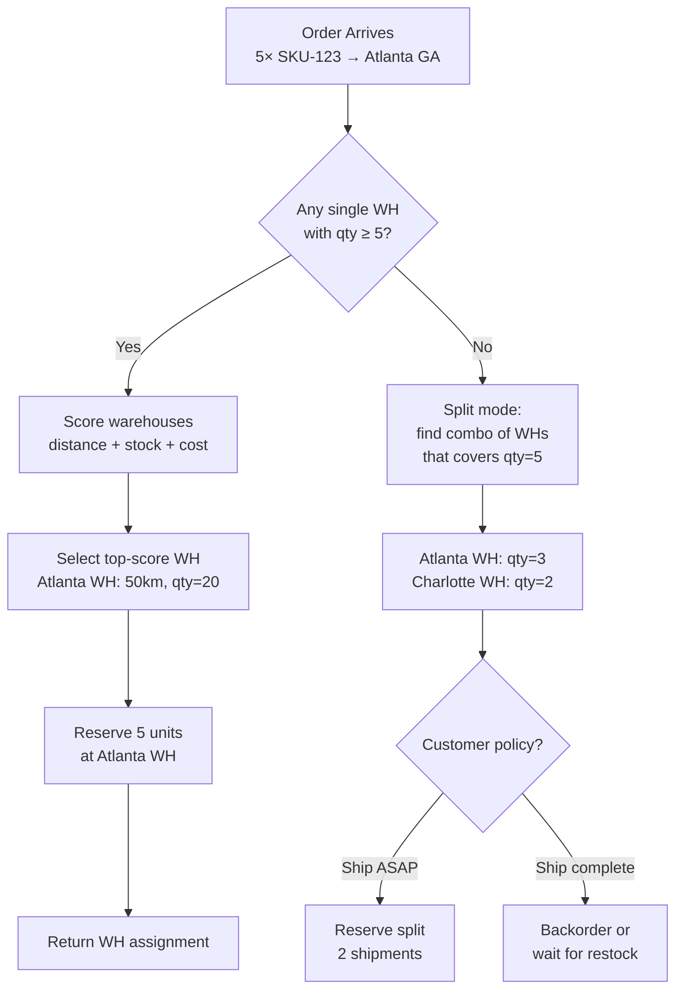

# Design an Inventory Management System

**Difficulty**: 🟡 Intermediate
**Reading Time**: ~25 minutes
**The Core Problem**: How do you track 1M SKUs across 50 warehouses with real-time stock levels, prevent overselling, trigger automated reorders, and allocate multi-warehouse orders — all at sub-100ms latency?

---

## Table of Contents

1. [Requirements](#1-requirements)
2. [Capacity Estimation](#2-capacity-estimation)
3. [High-Level Architecture](#3-high-level-architecture)
4. [Data Model](#4-data-model)
5. [Reservation System](#5-reservation-system)
6. [Reorder Trigger System](#6-reorder-trigger-system)
7. [Multi-Warehouse Allocation](#7-multi-warehouse-allocation)
8. [Cycle Counting](#8-cycle-counting)
9. [Key Design Decisions](#9-key-design-decisions)
10. [Interview Questions](#10-interview-questions)
11. [Key Takeaways](#11-key-takeaways)
12. [References](#12-references)

---

## 1. Requirements

### Functional
- Track stock levels per SKU per warehouse in real time
- Reserve inventory when order is placed; deduct when shipped
- Trigger reorder when stock falls below threshold
- Allocate orders to nearest warehouse with sufficient stock
- Periodic cycle counting for physical vs system reconciliation
- Support for multi-SKU orders (bundle products)

### Non-Functional
- **Scale**: 1M SKUs, 50 warehouses, 100k orders/day
- **Latency**: Stock check + reservation < 100ms
- **Accuracy**: Oversell rate < 0.01% (one per 10,000 orders)
- **Consistency**: Reservation and deduction must be atomic

---

## 2. Capacity Estimation

| Metric | Estimate |
|--------|----------|
| SKUs | 1M |
| Warehouses | 50 |
| Inventory records | 1M × 50 = **50M rows** |
| Orders/day | 100k |
| Peak orders/sec | 100k / 86400 × 10× = **12 orders/sec peak** |
| Inventory updates/sec | 100k × avg 3 SKUs/order / 86400 × 2 (reserve + deduct) = **7 updates/sec avg; 70/sec peak** |
| Reorder events/day | 50k (5% of SKU-warehouse combos cross threshold daily) |
| Stock record size | 50M × 200B = **10 GB** (fits in large DB instance) |

---

## 3. High-Level Architecture



---

## 4. Data Model

```sql
-- Per SKU per warehouse stock record
CREATE TABLE inventory (
  warehouse_id   INT,
  sku_id         BIGINT,
  qty_on_hand    INT NOT NULL DEFAULT 0,   -- physical count
  qty_reserved   INT NOT NULL DEFAULT 0,   -- in open orders, not yet shipped
  qty_available  INT GENERATED ALWAYS AS (qty_on_hand - qty_reserved) STORED,
  reorder_point  INT NOT NULL DEFAULT 10,
  reorder_qty    INT NOT NULL DEFAULT 100,
  unit_cost      NUMERIC(10,2),
  last_updated   TIMESTAMPTZ DEFAULT NOW(),
  PRIMARY KEY (warehouse_id, sku_id)
);

CREATE INDEX ON inventory(sku_id);
CREATE INDEX ON inventory(warehouse_id, qty_available) WHERE qty_available > 0;

-- Reservation ledger (for audit and rollback)
CREATE TABLE inventory_reservations (
  reservation_id  BIGSERIAL PRIMARY KEY,
  order_id        BIGINT,
  warehouse_id    INT,
  sku_id          BIGINT,
  qty             INT,
  status          VARCHAR(20),  -- RESERVED, CONFIRMED, CANCELLED
  created_at      TIMESTAMPTZ DEFAULT NOW(),
  expires_at      TIMESTAMPTZ  -- optional, for cart holds
);
```

---

## 5. Reservation System

### Two-Phase: Reserve then Deduct
```
Phase 1 — RESERVE (at order placement):
  BEGIN TRANSACTION;
  UPDATE inventory
    SET qty_reserved = qty_reserved + order_qty
  WHERE warehouse_id = ? AND sku_id = ?
    AND (qty_on_hand - qty_reserved) >= order_qty;  -- check available

  IF rows_affected = 0 THEN ROLLBACK; RAISE 'out of stock';

  INSERT INTO inventory_reservations (order_id, warehouse_id, sku_id, qty, status)
  VALUES (?, ?, ?, ?, 'RESERVED');
  COMMIT;

Phase 2 — CONFIRM (at shipment):
  BEGIN TRANSACTION;
  UPDATE inventory
    SET qty_on_hand = qty_on_hand - order_qty,
        qty_reserved = qty_reserved - order_qty
  WHERE warehouse_id = ? AND sku_id = ?;

  UPDATE inventory_reservations SET status = 'CONFIRMED' WHERE order_id = ?;
  COMMIT;

Phase 2b — CANCEL (on order cancellation):
  BEGIN TRANSACTION;
  UPDATE inventory
    SET qty_reserved = qty_reserved - order_qty
  WHERE warehouse_id = ? AND sku_id = ?;

  UPDATE inventory_reservations SET status = 'CANCELLED' WHERE order_id = ?;
  COMMIT;
```

### Redis Cache Layer
```
Hot SKUs (top 1% by order volume) cached in Redis:
  key: stock:{warehouse_id}:{sku_id}
  value: qty_available (integer)

Cache update on reservation:
  DECRBY stock:{wh}:{sku} order_qty (atomic)

Cache invalidation on restock: INCRBY
Write-through: Redis update + DB update in same transaction
Cache miss: read from DB, populate Redis

This eliminates DB read load for hot SKUs (99% of orders)
```

---

## 6. Reorder Trigger System

### Event-Driven Reorder
```
After each inventory update (deduction), check reorder condition:
  IF qty_on_hand - qty_reserved <= reorder_point THEN
    PUBLISH to Kafka: {
      "event": "reorder_trigger",
      "warehouse_id": 5,
      "sku_id": 123,
      "current_qty": 8,
      "reorder_point": 10,
      "reorder_qty": 100
    }

Reorder Service (Kafka consumer):
  1. Check if open PO already exists for this SKU (avoid duplicate orders)
  2. If no open PO → create Purchase Order
  3. Send PO to supplier via EDI (Electronic Data Interchange) or email
  4. Insert: purchase_orders { po_id, supplier_id, sku_id, qty, expected_delivery }

On PO receipt (supplier delivers):
  UPDATE inventory SET qty_on_hand = qty_on_hand + received_qty
  CLOSE purchase_order record
```

### Reorder Parameters (ABC Analysis)
```
A items (top 10% by value, 70% of spend): tight reorder points, frequent small orders
B items (next 20%): standard reorder points
C items (bottom 70%, 5% of spend): large reorder quantities, infrequent orders

Dynamic reorder point calculation:
  reorder_point = average_daily_demand × lead_time_days + safety_stock
  safety_stock = Z_score(service_level=99%) × std_dev_demand × sqrt(lead_time)

  Example: daily_demand=50, lead_time=3 days, std_dev=10
  safety_stock = 2.33 × 10 × 1.73 = 40 units
  reorder_point = 50 × 3 + 40 = 190 units
```

---

## 7. Multi-Warehouse Allocation

### Allocation Algorithm
```
Order arrives: 5 units of SKU-123, ship to Atlanta, GA

Step 1: Find warehouses with sufficient stock
  SELECT warehouse_id, qty_available, distance_km
  FROM inventory
  JOIN warehouses ON ...
  WHERE sku_id = 123 AND qty_available >= 5
  ORDER BY distance_km ASC;

Step 2: Primary allocation: nearest warehouse with full stock
  → Atlanta WH (50km): qty=20. Allocate all 5 here.

Step 3: If no single warehouse has full qty → split allocation
  ORDER qty=10, SKU-123:
    Atlanta WH: qty=6 → allocate 6
    Charlotte WH: qty=8 → allocate 4
    Cost: two shipments (customer may prefer to wait for full order)

Step 4: Reserve in selected warehouses (atomic per warehouse)
```

### Split Shipment Policy
```
User preference at checkout:
  - "Ship complete" (default): wait until all items available from one warehouse
  - "Ship ASAP": split shipment if needed (faster, may get two packages)

Business rule: split only if saves > 2 days delivery time
```

---

## 8. Cycle Counting

Physical vs system inventory discrepancy tracking.

```
Cycle count process (continuous, zone-by-zone):
  Each day, warehouse staff count 2% of SKUs in assigned zone
  Over 50 days → entire warehouse counted once

Count entry (scanner app):
  Staff scans SKU barcode → app shows: "Expected: 45 units. Count actual:"
  Staff enters physical count: 42

Discrepancy handling:
  |physical - system| <= 2: auto-adjust (shrinkage/breakage within tolerance)
  |physical - system| 3-10: flag for supervisor review, auto-adjust after review
  |physical - system| > 10: HOLD inventory for full investigation, do not auto-adjust

Shrinkage root causes tracked:
  - Theft (loss without documentation)
  - Receiving errors (received 98, booked 100)
  - Picking errors (picked wrong item, neither counted)
  - Damage (item written off, not recorded)
```

---

## 9. Key Design Decisions

| Decision | Option A | Option B | Choice & Reason |
|----------|----------|----------|-----------------|
| Inventory architecture | Centralized (single DB) | Federated (per-warehouse DB) | **Centralized** — 50M rows fits in single Postgres; federated adds cross-warehouse query complexity |
| Reservation | Optimistic (check then write) | Pessimistic (row-level lock) | **Pessimistic with row lock** — 12 orders/sec is low; row lock duration < 5ms; oversell risk not acceptable |
| Reorder trigger | Real-time (after each deduction) | Batch (nightly) | **Real-time** — stock-outs are costly; nightly might miss same-day depletion |
| Redis cache | Write-through | Write-back | **Write-through** — inventory data must not be lost; write-back risks cache crash losing data |
| Cycle count approach | Annual full count | Continuous (2%/day) | **Continuous** — annual counts cause warehouse shutdown; continuous is operationally superior |

---

## 10. Interview Questions

| Question | Key Answer |
|----------|-----------|
| How do you prevent overselling? | Pessimistic row-level lock with CHECK constraint (qty_reserved <= qty_on_hand) |
| What if warehouse allocation fails after partial reservation? | Saga pattern: compensating transaction releases reservation; customer sees "out of stock" or retry |
| How do you handle flash sale spike (10k orders/sec)? | Redis atomic DECRBY for check + reserve; Postgres updated asynchronously in batches |
| How does multi-warehouse allocation avoid double-booking? | Each warehouse reserve is atomic; allocation engine tries primary, then secondary sequentially |
| How do you track inventory shrinkage? | Discrepancy between cycle count physical qty and qty_on_hand; trend analysis per warehouse/zone |

---

## 11. Key Takeaways

- **Two-phase reserve then deduct** prevents overselling while keeping orders cancellable — reserve at placement, deduct at shipment
- **Pessimistic row lock** for inventory reservation is correct at 12 orders/sec — only switch to optimistic (Redis) above ~1000 orders/sec
- **Real-time reorder triggers** via Kafka prevent stock-outs — nightly batch is too slow for fast-moving items
- **Continuous cycle counting** (2% of SKUs daily) catches discrepancies faster than annual counts with zero operational disruption
- **ABC analysis** for reorder parameters — treat high-value A items differently from low-value C items

---

## Component Deep Dive 1: Reservation Engine

The reservation engine is the most critical architectural component in the inventory management system. Its job is deceptively simple — atomically check whether stock is available and, if so, claim it — but at scale, every naive implementation fails in a different and painful way.

### How It Works Internally

The reservation engine executes a two-phase commit against a single PostgreSQL row. Phase 1 (reserve) runs at order placement: it opens a transaction, acquires a row-level lock on `(warehouse_id, sku_id)`, checks that `qty_on_hand - qty_reserved >= order_qty`, increments `qty_reserved`, inserts into the `inventory_reservations` ledger, and commits. Phase 2 (deduct) runs at shipment: it decrements both `qty_on_hand` and `qty_reserved` atomically, and marks the reservation `CONFIRMED`. Cancellation is a compensating transaction that only decrements `qty_reserved`.

The row-level lock is key. PostgreSQL's `SELECT ... FOR UPDATE` acquires an exclusive lock on the matching row, serializing concurrent reservations for the same SKU at the same warehouse. At 12 peak orders/second with a lock hold time under 5ms, lock contention is negligible — that yields at most 0.06 reservations queued per row at any moment.

### Why Naive Approaches Fail at Scale

**Check-then-set without locking** (optimistic pattern): Thread A reads `qty_available = 5`, Thread B reads `qty_available = 5`, both see sufficient stock, both reserve 4 units — oversell of 3 units results. Even with a `WHERE qty_available >= order_qty` clause, two concurrent `UPDATE` statements without FOR UPDATE can race on the read.

**Application-level locking** (distributed lock in Redis): introduces a second system to fail. If Redis goes down during a reservation, is the lock held or not? Now you need lock TTL logic, heartbeat renewal, and lock recovery — complexity that a single DB row lock avoids entirely.

**Event sourcing without current-state check**: deriving `qty_available` by replaying the event log is correct for audit but too slow for reservation. Replaying 10,000 events per SKU per check adds seconds of latency.

### Sequence Diagram: Successful Reservation

```mermaid
sequenceDiagram
    participant OS as Order Service
    participant IS as Inventory Service
    participant Redis as Redis Cache
    participant DB as PostgreSQL

    OS->>IS: reserve(order_id, warehouse_id, sku_id, qty=5)
    IS->>Redis: GET stock:{wh}:{sku}
    Redis-->>IS: 20 (cache hit)
    IS->>IS: 20 >= 5? YES → proceed
    IS->>DB: BEGIN; SELECT ... FOR UPDATE WHERE wh=? AND sku=?
    DB-->>IS: row locked, qty_on_hand=22, qty_reserved=2 → available=20
    IS->>DB: UPDATE inventory SET qty_reserved=7 WHERE ...
    IS->>DB: INSERT INTO inventory_reservations (status=RESERVED)
    IS->>DB: COMMIT
    IS->>Redis: DECRBY stock:{wh}:{sku} 5 → 15
    IS-->>OS: reservation_id=8841, status=RESERVED
```

### Implementation Options Trade-off

| Approach | Latency | Throughput | Trade-off |
|----------|---------|------------|-----------|
| Pessimistic row lock (PostgreSQL FOR UPDATE) | 2–8ms | ~500 reservations/sec per SKU | Correct; contention rises sharply above 500 req/sec per hot SKU |
| Optimistic + Redis atomic DECRBY | 1–3ms | ~50,000 reservations/sec | Fast; requires Redis HA and careful cache-DB sync; risk of inconsistency on Redis crash |
| Serialized queue per SKU (in-memory actor) | 0.5–2ms | ~10,000/sec per actor | Low latency; requires sticky routing to actor node; complex failover |

At 12 peak orders/sec, pessimistic row locking is the correct default. The Redis path becomes necessary only above approximately 800–1,000 orders/sec per popular SKU.

---

## Component Deep Dive 2: Multi-Warehouse Allocation Engine

The allocation engine decides which warehouse (or warehouses) fulfills a given order. It is the system's spatial optimizer — balancing stock availability, geographic proximity to the customer, shipping cost, and split-shipment policy.

### Internal Mechanics

When an order arrives, the allocation engine first queries the inventory service for all warehouses that have `qty_available >= order_qty` for each SKU in the order. It then scores each candidate warehouse using a weighted function:

```
score = w1 × (1 / distance_km) + w2 × (qty_available / order_qty) + w3 × (1 / shipping_cost)
```

Typical weights: `w1 = 0.5` (minimize distance), `w2 = 0.3` (prefer well-stocked), `w3 = 0.2` (minimize cost). The warehouse with the highest score is selected as primary. If no single warehouse can fulfill the entire order, the engine enters split mode — it greedily assigns from the nearest warehouse until the order is fully covered.

### Scale Behavior at 10x Load

At baseline (12 orders/sec), a single allocation engine thread handles requests synchronously in under 10ms. At 10x (120 orders/sec), the bottleneck shifts to the `SELECT ... ORDER BY distance_km` query over 50 warehouse rows — still fast given 50 is a tiny result set. At 100x (1,200 orders/sec), the primary pressure is reservation contention on popular SKUs at popular warehouses (e.g., the nearest warehouse to 40% of customers gets hammered). Mitigation: virtual warehouse sharding — split a single physical warehouse into multiple logical inventory pools in the DB, each with its own row lock.

### Allocation Flow Diagram



| Approach | Latency | Accuracy | Downside |
|----------|---------|----------|---------|
| Greedy nearest-first | 2–5ms | Good | May cause distant WHs to stay overstocked |
| LP optimization (linear programming) | 50–200ms | Optimal | Too slow for real-time; use for nightly batch rebalancing |
| Pre-computed routing table | <1ms | Approximate | Stale during flash sales; needs refresh every 60s |

---

## Component Deep Dive 3: Redis Stock Cache Layer

The Redis cache layer is the system's read-performance multiplier. Without it, every stock check hits PostgreSQL — at 100k orders/day with 3 SKUs each, that's 300k reads/day average but up to 3,000 reads/sec during flash sales. PostgreSQL can handle this, but with a 10–20ms latency per read under load versus <1ms from Redis.

### Technical Decisions

**Key structure**: `stock:{warehouse_id}:{sku_id}` → integer (`qty_available`). Using a single integer rather than a hash avoids deserialization overhead and allows atomic `DECRBY`/`INCRBY` operations.

**Warm-up strategy**: On service start, the top 10,000 SKUs by 30-day order volume are pre-loaded from PostgreSQL. This covers >99% of order volume. Long-tail SKUs (the remaining 990,000) are loaded on first cache miss with a 300-second TTL.

**Write-through discipline**: Every DB reservation update is followed immediately by `DECRBY` in Redis within the same application-level operation (not the same DB transaction — Redis doesn't participate in DB transactions). If the Redis write fails after a successful DB commit, the cache becomes stale. The reconciliation path: a background job every 60 seconds scans for stale keys by comparing Redis values to DB reads for the top 1,000 SKUs, overwriting diverged values.

**Eviction policy**: `allkeys-lru` — let Redis evict cold SKUs automatically under memory pressure. A cold SKU eviction simply causes the next read to go to DB and repopulate, which is acceptable.

**Key expiry for flash sales**: During a flash sale event, popular-SKU keys are given an explicit TTL of 600 seconds with a tag. When the sale ends, the event engine calls `DEL` on all tagged keys, forcing a fresh DB read. This prevents stale "sold out" signals persisting after emergency stock replenishment.

---

## Data Model (Extended)

The existing data model (Section 4) covers the core `inventory` and `inventory_reservations` tables. The full production schema also requires:

```sql
-- Warehouses reference table
CREATE TABLE warehouses (
  warehouse_id    SERIAL PRIMARY KEY,
  name            VARCHAR(100) NOT NULL,
  latitude        NUMERIC(9,6) NOT NULL,
  longitude       NUMERIC(9,6) NOT NULL,
  timezone        VARCHAR(50) NOT NULL,
  active          BOOLEAN DEFAULT TRUE,
  max_capacity    INT,          -- total SKU slots
  fulfillment_sla_hours INT DEFAULT 24
);

-- SKU master catalog
CREATE TABLE skus (
  sku_id          BIGSERIAL PRIMARY KEY,
  merchant_id     BIGINT NOT NULL,
  external_sku    VARCHAR(100),           -- supplier SKU code
  name            VARCHAR(255) NOT NULL,
  category        VARCHAR(100),
  unit_weight_g   INT,
  requires_cold   BOOLEAN DEFAULT FALSE,  -- cold chain flag
  is_hazmat       BOOLEAN DEFAULT FALSE,
  created_at      TIMESTAMPTZ DEFAULT NOW()
);
CREATE INDEX ON skus(merchant_id);
CREATE INDEX ON skus(external_sku);

-- Purchase orders (for reorder tracking)
CREATE TABLE purchase_orders (
  po_id           BIGSERIAL PRIMARY KEY,
  supplier_id     BIGINT NOT NULL,
  warehouse_id    INT NOT NULL REFERENCES warehouses,
  sku_id          BIGINT NOT NULL REFERENCES skus,
  qty_ordered     INT NOT NULL,
  qty_received    INT DEFAULT 0,
  unit_cost       NUMERIC(10,2),
  status          VARCHAR(20) DEFAULT 'OPEN',  -- OPEN, PARTIAL, RECEIVED, CANCELLED
  ordered_at      TIMESTAMPTZ DEFAULT NOW(),
  expected_at     TIMESTAMPTZ,
  received_at     TIMESTAMPTZ,
  UNIQUE (supplier_id, warehouse_id, sku_id, status)  -- prevent duplicate open POs
);
CREATE INDEX ON purchase_orders(sku_id, warehouse_id, status);

-- Cycle count records
CREATE TABLE cycle_counts (
  count_id        BIGSERIAL PRIMARY KEY,
  warehouse_id    INT NOT NULL REFERENCES warehouses,
  sku_id          BIGINT NOT NULL REFERENCES skus,
  zone            VARCHAR(20),
  counted_by      BIGINT,              -- user_id of warehouse staff
  system_qty      INT NOT NULL,        -- qty_on_hand at time of count
  physical_qty    INT NOT NULL,        -- actual counted
  delta           INT GENERATED ALWAYS AS (physical_qty - system_qty) STORED,
  status          VARCHAR(20) DEFAULT 'PENDING',  -- PENDING, APPROVED, ADJUSTED
  counted_at      TIMESTAMPTZ DEFAULT NOW(),
  reviewed_by     BIGINT,
  reviewed_at     TIMESTAMPTZ
);
CREATE INDEX ON cycle_counts(warehouse_id, status);
CREATE INDEX ON cycle_counts(counted_at DESC);

-- Inventory event log (append-only, for audit)
CREATE TABLE inventory_events (
  event_id        BIGSERIAL PRIMARY KEY,
  warehouse_id    INT NOT NULL,
  sku_id          BIGINT NOT NULL,
  event_type      VARCHAR(30) NOT NULL,  -- INBOUND, RESERVE, DEDUCT, CANCEL, ADJUST
  delta_qty       INT NOT NULL,          -- positive = increase, negative = decrease
  reference_id    BIGINT,                -- order_id, po_id, or count_id
  reference_type  VARCHAR(30),           -- ORDER, PO, CYCLE_COUNT
  actor_id        BIGINT,                -- user or service that triggered event
  created_at      TIMESTAMPTZ DEFAULT NOW()
) PARTITION BY RANGE (created_at);

-- Partition monthly for retention management
CREATE TABLE inventory_events_2026_06 PARTITION OF inventory_events
  FOR VALUES FROM ('2026-06-01') TO ('2026-07-01');
```

**Critical indexes**:
- `inventory(warehouse_id, qty_available) WHERE qty_available > 0` — allocation queries use this partial index to skip zero-stock rows
- `inventory_events(sku_id, warehouse_id, created_at DESC)` — audit trail queries per SKU
- `purchase_orders(sku_id, warehouse_id, status)` — reorder deduplication check

---

## Scale Bottlenecks

| Traffic Level | Component That Breaks | Symptoms | Mitigation |
|---------------|----------------------|----------|------------|
| 10x baseline (120 orders/sec) | PostgreSQL row lock contention on top-20 SKUs | Reservation latency spikes from 5ms to 50–200ms; timeout errors on hot products | Move hot SKUs to Redis atomic DECRBY; DB update becomes async write-behind |
| 100x baseline (1,200 orders/sec) | Redis single-node throughput ceiling (~100k ops/sec but shared with all services) | Cache miss rate rises; Redis CPU >80%; DECRBY latency >5ms | Redis Cluster with hash slots per warehouse prefix; read replicas for stock checks |
| 100x baseline | Kafka `inventory-events` topic consumer lag | Reorder Service falls behind; reorder triggers delayed by minutes | Increase partitions from 8 to 64; add consumer replicas; prioritize reorder topic |
| 1000x baseline (12,000 orders/sec) | PostgreSQL cannot sustain 12k writes/sec even with batching | DB CPU saturates; WAL disk I/O maxes out; replication lag grows | Shard `inventory` table by `warehouse_id` across 10 PostgreSQL instances; each shard owns 5 warehouses |
| 1000x baseline | Allocation engine scoring (50-warehouse scan × 12k/sec) | 600k DB reads/sec for allocation queries; query planner can't use indexes efficiently | Cache warehouse stock snapshot in Redis hash `wh_stock:{warehouse_id}` updated every 1 second; allocation reads from Redis |

**The 1,000x scenario in practice**: Amazon's peak fulfillment processing during Prime Day 2023 was approximately 375 orders/second globally — still only ~31x the baseline in this design. Reaching 1,000x (12,000 orders/sec) requires a business operating at Amazon's scale with this exact data model, making the 1,000x row an aspirational ceiling rather than an expected operating point for most organizations.

---

## How Shopify Built This

Shopify operates one of the largest multi-merchant inventory systems in the world, processing over 5 million orders per day across hundreds of thousands of merchants as of 2024. Their inventory architecture is public knowledge from several Rails At Scale and Shopify Engineering blog posts.

**Technology choices**: Shopify's inventory system is built on MySQL (not PostgreSQL) using Rails ActiveRecord. Every merchant's inventory record is sharded across MySQL pods using a consistent hashing scheme based on `shop_id`. Each shard handles ~3,000 shops. Inventory rows are co-located with order rows for the same shop, enabling single-shard transactions for the common case (same-merchant reservation).

**Specific numbers**: At peak (Black Friday 2023), Shopify processed approximately 4.2 million orders in a single hour — roughly 1,167 orders per second globally. With an average of 2.3 SKUs per order, that is approximately 2,683 inventory reservation writes per second. They handled this without Redis caching for inventory — MySQL InnoDB row locks at 2,700 writes/sec is within MySQL's throughput envelope (typically 5,000–10,000 writes/sec on NVMe-backed instances).

**Non-obvious architectural decision**: Shopify uses "inventory ledgers" rather than a mutable current-quantity field. Rather than `UPDATE inventory SET qty_available = qty_available - 5`, they `INSERT INTO inventory_ledger (sku_id, delta=-5, reason='SALE')`. Current availability is computed as `SUM(delta)`. This makes the system append-only (no UPDATE lock contention) and gives a complete audit trail for free. The tradeoff: `SUM` query over a growing ledger is slow, so they maintain a "snapshot" row periodically (similar to a B-tree checkpoint), from which they replay only the delta since last snapshot.

**Source**: [Shopify Engineering — Deconstructing the Monolith (2019)](https://shopify.engineering/deconstructing-the-monolith-designing-software-that-maximizes-developer-productivity) and [Shopify Tech Talks — Scaling for Black Friday](https://shopify.engineering/scaling-shopify-s-partner-platform).

---

## Interview Angle

**What the interviewer is testing:** Whether you can design a concurrent write system that prevents data races (overselling) while maintaining sub-100ms latency — balancing correctness guarantees against throughput requirements.

**Common mistakes candidates make:**

1. **Jumping straight to Redis without a DB** — Candidates say "use Redis atomic DECRBY to reserve" but forget that Redis is volatile. If the Redis node crashes between the DECRBY and the DB write, inventory is effectively oversold. A DB is the source of truth; Redis is an acceleration layer. Always explain the write-through pattern and what happens on Redis failure.

2. **Using optimistic locking at low traffic** — Optimistic locking (read, check, CAS) sounds clever but generates retry storms on any hot SKU. At 12 orders/sec, a row lock is held for under 5ms — contention is mathematically irrelevant. Choosing optimistic locking here shows lack of calibration between traffic numbers and mechanism overhead.

3. **Ignoring reservation expiry** — Candidates model "reserve at checkout, deduct at payment" but never address what happens if the user abandons the cart. Reserved inventory is invisible to other customers. Without TTL-based expiry on reservations (e.g., 30-minute hold), a small number of abandoned carts during peak traffic can cause legitimate customers to see false "out of stock" errors.

**The insight that separates good from great answers:** Great candidates recognize that the two hardest consistency problems are not reservation (which is well-understood) but *reservation-to-deduction coordination across a distributed order pipeline* and *cache-DB divergence during restock events*. Specifically: what happens if the shipment service crashes after deducting `qty_on_hand` but before marking the reservation `CONFIRMED`? The answer is idempotency keys — each deduction carries the `reservation_id` as an idempotent key, and the shipment service uses it to detect and safely retry the deduction without double-decrement.

---

## Key Numbers to Remember

| Metric | Value | Context |
|--------|-------|---------|
| Inventory records | 50M rows | 1M SKUs × 50 warehouses |
| PostgreSQL row lock hold time | 2–5ms | Single reservation at 12 peak orders/sec |
| Peak reservation throughput (DB) | ~500/sec per hot SKU | Before Redis becomes necessary |
| Redis DECRBY throughput | ~100,000 ops/sec | Single Redis node; use Cluster beyond this |
| Cache hit rate (top 1% SKUs) | >99% | Top 10k SKUs cover >99% of order volume |
| Cycle count cadence | 2% of SKUs/day | Full warehouse counted every 50 days |
| Reorder safety stock formula | `Z × σ × √(lead_time)` | Z=2.33 for 99% service level |
| Shopify Black Friday peak | ~1,167 orders/sec | 4.2M orders in 1 hour (BF 2023) |
| ABC analysis split | 10% / 20% / 70% | A/B/C items by count; 70% / 25% / 5% of spend |
| Reservation TTL (cart hold) | 30 minutes | Release reserved stock if order not confirmed |

---


| Resource | Type | What You'll Learn |
|----------|------|------------------|
| [Amazon Warehouse Management](https://aws.amazon.com/blogs/architecture/) | 📖 Blog | Large-scale inventory architecture patterns |
| [ByteByteGo — E-Commerce Architecture](https://www.youtube.com/@ByteByteGo) | 📺 YouTube | Inventory reservation and order management |
| [Shopify Engineering — Inventory](https://shopify.engineering/) | 📖 Blog | Multi-warehouse inventory at Shopify scale |
| [Operations Management — Krajewski](https://www.pearson.com/) | 📚 Book | EOQ, safety stock, and ABC analysis fundamentals |
