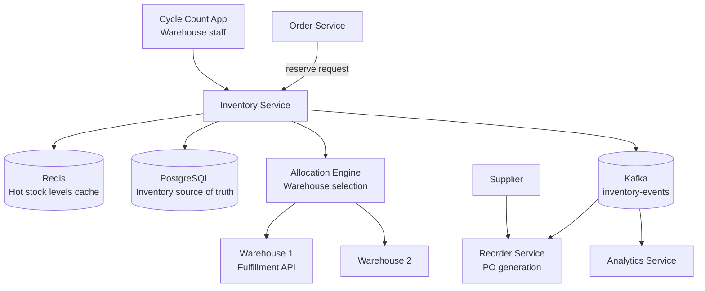

# Design an Inventory Management System

**Difficulty**: 🟡 Intermediate
**Reading Time**: ~25 minutes
**The Core Problem**: How do you track 1M SKUs across 50 warehouses with real-time stock levels, prevent overselling, trigger automated reorders, and allocate multi-warehouse orders — all at sub-100ms latency?

---

## Table of Contents

1. [Requirements](#1-requirements)
2. [Capacity Estimation](#2-capacity-estimation)
3. [High-Level Architecture](#3-high-level-architecture)
4. [Data Model](#4-data-model)
5. [Reservation System](#5-reservation-system)
6. [Reorder Trigger System](#6-reorder-trigger-system)
7. [Multi-Warehouse Allocation](#7-multi-warehouse-allocation)
8. [Cycle Counting](#8-cycle-counting)
9. [Key Design Decisions](#9-key-design-decisions)
10. [Interview Questions](#10-interview-questions)
11. [Key Takeaways](#11-key-takeaways)
12. [References](#12-references)

---

## 1. Requirements

### Functional
- Track stock levels per SKU per warehouse in real time
- Reserve inventory when order is placed; deduct when shipped
- Trigger reorder when stock falls below threshold
- Allocate orders to nearest warehouse with sufficient stock
- Periodic cycle counting for physical vs system reconciliation
- Support for multi-SKU orders (bundle products)

### Non-Functional
- **Scale**: 1M SKUs, 50 warehouses, 100k orders/day
- **Latency**: Stock check + reservation < 100ms
- **Accuracy**: Oversell rate < 0.01% (one per 10,000 orders)
- **Consistency**: Reservation and deduction must be atomic

---

## 2. Capacity Estimation

| Metric | Estimate |
|--------|----------|
| SKUs | 1M |
| Warehouses | 50 |
| Inventory records | 1M × 50 = **50M rows** |
| Orders/day | 100k |
| Peak orders/sec | 100k / 86400 × 10× = **12 orders/sec peak** |
| Inventory updates/sec | 100k × avg 3 SKUs/order / 86400 × 2 (reserve + deduct) = **7 updates/sec avg; 70/sec peak** |
| Reorder events/day | 50k (5% of SKU-warehouse combos cross threshold daily) |
| Stock record size | 50M × 200B = **10 GB** (fits in large DB instance) |

---

## 3. High-Level Architecture



---

## 4. Data Model

```sql
-- Per SKU per warehouse stock record
CREATE TABLE inventory (
  warehouse_id   INT,
  sku_id         BIGINT,
  qty_on_hand    INT NOT NULL DEFAULT 0,   -- physical count
  qty_reserved   INT NOT NULL DEFAULT 0,   -- in open orders, not yet shipped
  qty_available  INT GENERATED ALWAYS AS (qty_on_hand - qty_reserved) STORED,
  reorder_point  INT NOT NULL DEFAULT 10,
  reorder_qty    INT NOT NULL DEFAULT 100,
  unit_cost      NUMERIC(10,2),
  last_updated   TIMESTAMPTZ DEFAULT NOW(),
  PRIMARY KEY (warehouse_id, sku_id)
);

CREATE INDEX ON inventory(sku_id);
CREATE INDEX ON inventory(warehouse_id, qty_available) WHERE qty_available > 0;

-- Reservation ledger (for audit and rollback)
CREATE TABLE inventory_reservations (
  reservation_id  BIGSERIAL PRIMARY KEY,
  order_id        BIGINT,
  warehouse_id    INT,
  sku_id          BIGINT,
  qty             INT,
  status          VARCHAR(20),  -- RESERVED, CONFIRMED, CANCELLED
  created_at      TIMESTAMPTZ DEFAULT NOW(),
  expires_at      TIMESTAMPTZ  -- optional, for cart holds
);
```

---

## 5. Reservation System

### Two-Phase: Reserve then Deduct
```
Phase 1 — RESERVE (at order placement):
  BEGIN TRANSACTION;
  UPDATE inventory
    SET qty_reserved = qty_reserved + order_qty
  WHERE warehouse_id = ? AND sku_id = ?
    AND (qty_on_hand - qty_reserved) >= order_qty;  -- check available

  IF rows_affected = 0 THEN ROLLBACK; RAISE 'out of stock';

  INSERT INTO inventory_reservations (order_id, warehouse_id, sku_id, qty, status)
  VALUES (?, ?, ?, ?, 'RESERVED');
  COMMIT;

Phase 2 — CONFIRM (at shipment):
  BEGIN TRANSACTION;
  UPDATE inventory
    SET qty_on_hand = qty_on_hand - order_qty,
        qty_reserved = qty_reserved - order_qty
  WHERE warehouse_id = ? AND sku_id = ?;

  UPDATE inventory_reservations SET status = 'CONFIRMED' WHERE order_id = ?;
  COMMIT;

Phase 2b — CANCEL (on order cancellation):
  BEGIN TRANSACTION;
  UPDATE inventory
    SET qty_reserved = qty_reserved - order_qty
  WHERE warehouse_id = ? AND sku_id = ?;

  UPDATE inventory_reservations SET status = 'CANCELLED' WHERE order_id = ?;
  COMMIT;
```

### Redis Cache Layer
```
Hot SKUs (top 1% by order volume) cached in Redis:
  key: stock:{warehouse_id}:{sku_id}
  value: qty_available (integer)

Cache update on reservation:
  DECRBY stock:{wh}:{sku} order_qty (atomic)

Cache invalidation on restock: INCRBY
Write-through: Redis update + DB update in same transaction
Cache miss: read from DB, populate Redis

This eliminates DB read load for hot SKUs (99% of orders)
```

---

## 6. Reorder Trigger System

### Event-Driven Reorder
```
After each inventory update (deduction), check reorder condition:
  IF qty_on_hand - qty_reserved <= reorder_point THEN
    PUBLISH to Kafka: {
      "event": "reorder_trigger",
      "warehouse_id": 5,
      "sku_id": 123,
      "current_qty": 8,
      "reorder_point": 10,
      "reorder_qty": 100
    }

Reorder Service (Kafka consumer):
  1. Check if open PO already exists for this SKU (avoid duplicate orders)
  2. If no open PO → create Purchase Order
  3. Send PO to supplier via EDI (Electronic Data Interchange) or email
  4. Insert: purchase_orders { po_id, supplier_id, sku_id, qty, expected_delivery }

On PO receipt (supplier delivers):
  UPDATE inventory SET qty_on_hand = qty_on_hand + received_qty
  CLOSE purchase_order record
```

### Reorder Parameters (ABC Analysis)
```
A items (top 10% by value, 70% of spend): tight reorder points, frequent small orders
B items (next 20%): standard reorder points
C items (bottom 70%, 5% of spend): large reorder quantities, infrequent orders

Dynamic reorder point calculation:
  reorder_point = average_daily_demand × lead_time_days + safety_stock
  safety_stock = Z_score(service_level=99%) × std_dev_demand × sqrt(lead_time)

  Example: daily_demand=50, lead_time=3 days, std_dev=10
  safety_stock = 2.33 × 10 × 1.73 = 40 units
  reorder_point = 50 × 3 + 40 = 190 units
```

---

## 7. Multi-Warehouse Allocation

### Allocation Algorithm
```
Order arrives: 5 units of SKU-123, ship to Atlanta, GA

Step 1: Find warehouses with sufficient stock
  SELECT warehouse_id, qty_available, distance_km
  FROM inventory
  JOIN warehouses ON ...
  WHERE sku_id = 123 AND qty_available >= 5
  ORDER BY distance_km ASC;

Step 2: Primary allocation: nearest warehouse with full stock
  → Atlanta WH (50km): qty=20. Allocate all 5 here.

Step 3: If no single warehouse has full qty → split allocation
  ORDER qty=10, SKU-123:
    Atlanta WH: qty=6 → allocate 6
    Charlotte WH: qty=8 → allocate 4
    Cost: two shipments (customer may prefer to wait for full order)

Step 4: Reserve in selected warehouses (atomic per warehouse)
```

### Split Shipment Policy
```
User preference at checkout:
  - "Ship complete" (default): wait until all items available from one warehouse
  - "Ship ASAP": split shipment if needed (faster, may get two packages)

Business rule: split only if saves > 2 days delivery time
```

---

## 8. Cycle Counting

Physical vs system inventory discrepancy tracking.

```
Cycle count process (continuous, zone-by-zone):
  Each day, warehouse staff count 2% of SKUs in assigned zone
  Over 50 days → entire warehouse counted once

Count entry (scanner app):
  Staff scans SKU barcode → app shows: "Expected: 45 units. Count actual:"
  Staff enters physical count: 42

Discrepancy handling:
  |physical - system| <= 2: auto-adjust (shrinkage/breakage within tolerance)
  |physical - system| 3-10: flag for supervisor review, auto-adjust after review
  |physical - system| > 10: HOLD inventory for full investigation, do not auto-adjust

Shrinkage root causes tracked:
  - Theft (loss without documentation)
  - Receiving errors (received 98, booked 100)
  - Picking errors (picked wrong item, neither counted)
  - Damage (item written off, not recorded)
```

---

## 9. Key Design Decisions

| Decision | Option A | Option B | Choice & Reason |
|----------|----------|----------|-----------------|
| Inventory architecture | Centralized (single DB) | Federated (per-warehouse DB) | **Centralized** — 50M rows fits in single Postgres; federated adds cross-warehouse query complexity |
| Reservation | Optimistic (check then write) | Pessimistic (row-level lock) | **Pessimistic with row lock** — 12 orders/sec is low; row lock duration < 5ms; oversell risk not acceptable |
| Reorder trigger | Real-time (after each deduction) | Batch (nightly) | **Real-time** — stock-outs are costly; nightly might miss same-day depletion |
| Redis cache | Write-through | Write-back | **Write-through** — inventory data must not be lost; write-back risks cache crash losing data |
| Cycle count approach | Annual full count | Continuous (2%/day) | **Continuous** — annual counts cause warehouse shutdown; continuous is operationally superior |

---

## 10. Interview Questions

| Question | Key Answer |
|----------|-----------|
| How do you prevent overselling? | Pessimistic row-level lock with CHECK constraint (qty_reserved <= qty_on_hand) |
| What if warehouse allocation fails after partial reservation? | Saga pattern: compensating transaction releases reservation; customer sees "out of stock" or retry |
| How do you handle flash sale spike (10k orders/sec)? | Redis atomic DECRBY for check + reserve; Postgres updated asynchronously in batches |
| How does multi-warehouse allocation avoid double-booking? | Each warehouse reserve is atomic; allocation engine tries primary, then secondary sequentially |
| How do you track inventory shrinkage? | Discrepancy between cycle count physical qty and qty_on_hand; trend analysis per warehouse/zone |

---

## 11. Key Takeaways

- **Two-phase reserve then deduct** prevents overselling while keeping orders cancellable — reserve at placement, deduct at shipment
- **Pessimistic row lock** for inventory reservation is correct at 12 orders/sec — only switch to optimistic (Redis) above ~1000 orders/sec
- **Real-time reorder triggers** via Kafka prevent stock-outs — nightly batch is too slow for fast-moving items
- **Continuous cycle counting** (2% of SKUs daily) catches discrepancies faster than annual counts with zero operational disruption
- **ABC analysis** for reorder parameters — treat high-value A items differently from low-value C items

---

## 📚 Resources & References

| Resource | Type | What You'll Learn |
|----------|------|------------------|
| [Amazon Warehouse Management](https://aws.amazon.com/blogs/architecture/) | 📖 Blog | Large-scale inventory architecture patterns |
| [ByteByteGo — E-Commerce Architecture](https://www.youtube.com/@ByteByteGo) | 📺 YouTube | Inventory reservation and order management |
| [Shopify Engineering — Inventory](https://shopify.engineering/) | 📖 Blog | Multi-warehouse inventory at Shopify scale |
| [Operations Management — Krajewski](https://www.pearson.com/) | 📚 Book | EOQ, safety stock, and ABC analysis fundamentals |
