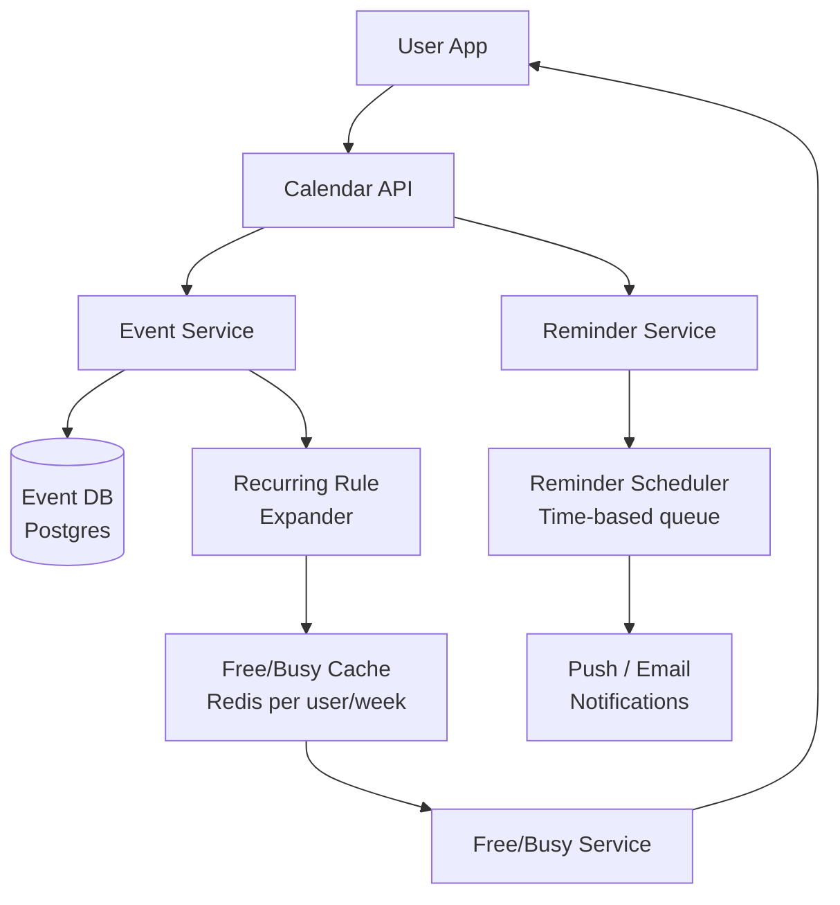

# Design a Meeting Calendar System (Google Calendar)

**Difficulty**: 🟡 Intermediate
**Reading Time**: Coming Soon
**Interview Frequency**: Medium

---

> 🚧 **Full article coming soon.** This stub gives you the essentials to start thinking about this problem.

---

## The Core Problem

Scheduling meetings across time zones with conflict detection for 100 million users sounds simple until you encounter recurring events: "every other Tuesday at 3pm except holidays" stored as a rule, not 52 individual records. Expanding these rules on-the-fly for conflict detection while keeping query performance under 100ms is the central challenge.

## Functional Requirements

- Create, update, delete events (one-time and recurring)
- Invite attendees and track acceptance
- Check free/busy status for a user or group
- Set reminders (email, push, popup)
- Support recurring events with exceptions (skip or reschedule one occurrence)

## Non-Functional Requirements

| Requirement | Target |
|-------------|--------|
| Availability | 99.99% (52 min/year) |
| Event load latency | p99 < 200ms for week view |
| Notification delivery | Reminders within ±1 minute of scheduled time |
| Scale | 100M users, 5B events, 500K invites sent/day |

## Back-of-Envelope Estimates

- **Events per user**: 100M users × 500 events avg = 50B event records
- **Recurring expansion**: User with "daily standup" for 5 years = 1,825 occurrences from one rule → store rule, expand on query
- **Reminder volume**: 500K meetings/day × 3 attendees avg × 2 reminders = 3M reminder notifications/day

## Key Design Decisions

1. **Recurring Event Storage: Rule vs Expansion** — store RRULE (RFC 5545) as a single record, not individual occurrences; expand to occurrences at query time for a given date range; modifications to single occurrences stored as exception records with original event reference.
2. **Free/Busy Query Optimization** — free/busy (is user available from 2-3pm?) is the most frequent query type for scheduling; cache expanded event intervals per user per week in Redis; invalidate when events change; avoids re-expanding recurring rules on every check.
3. **Timezone Storage** — always store timestamps in UTC; store original timezone of event creator as separate field; render in viewer's local timezone at display time; never store in local time to avoid DST bugs.

## High-Level Architecture

## Top Interview Questions for This Problem

| Question | Tests |
|----------|-------|
| How do you store a recurring event that repeats every Tuesday for 10 years? | RRULE storage, lazy expansion |
| How do you detect scheduling conflicts for a group of 20 people? | Free/busy aggregation, intersection |
| What happens when a user in New York creates a meeting and a user in Tokyo views it? | UTC storage, timezone rendering |

## Related Concepts

- [Conference room booking for similar conflict detection](./conference-room-booking)
- [Task scheduler for recurring job scheduling comparison](./task-scheduler)

---

*📚 Full deep-dive with multiple approaches, trade-off tables, and pseudocode coming soon.*

## 📚 Resources & References

| Resource | Type | What You'll Learn |
|----------|------|------------------|
| [ByteByteGo — Design a Calendar System](https://www.youtube.com/@ByteByteGo) | 📺 YouTube | Search "calendar system design" — recurring events, timezone handling, and sync |
| [Google Calendar API Design Patterns](https://developers.google.com/calendar/api/guides/concepts) | 📚 Docs | Recurring event representation, conflict resolution, and attendee management |
| [Outlook Calendar Architecture](https://techcommunity.microsoft.com/t5/exchange-team-blog/) | 📖 Blog | How Exchange/Outlook handles calendar sync across millions of mailboxes |
| [iCalendar RFC 5545 Specification](https://datatracker.ietf.org/doc/html/rfc5545) | 📚 Docs | The standard for calendar data interchange — RRULE for recurring events |
| [Calendly Engineering: Timezone Handling](https://calendly.com/blog/engineering-timezone-detection) | 📖 Blog | The complexity of timezone-aware scheduling at scale |
