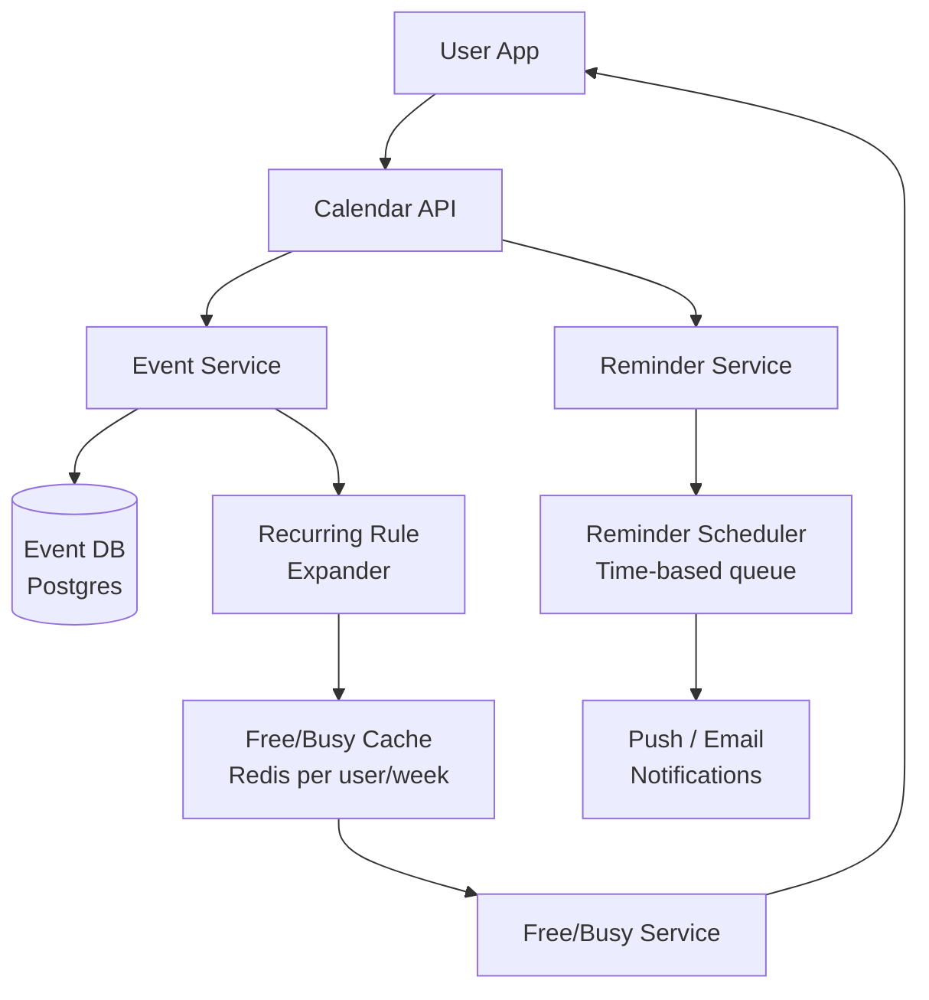
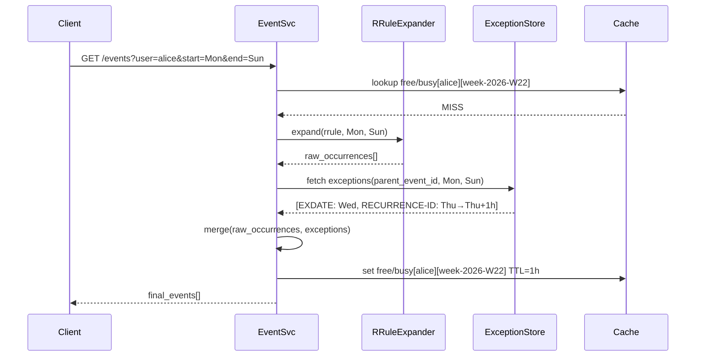
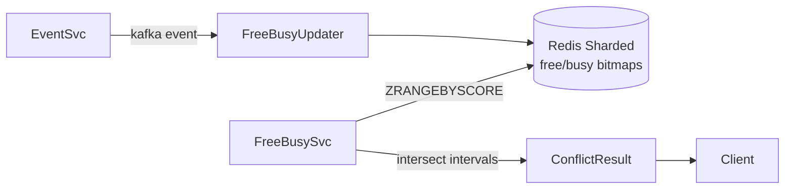
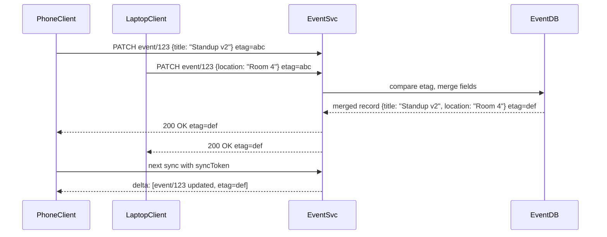
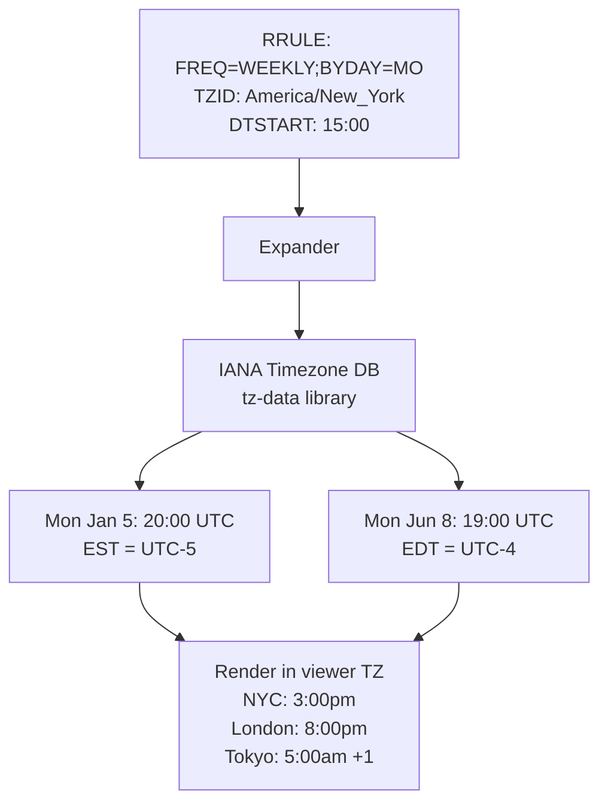
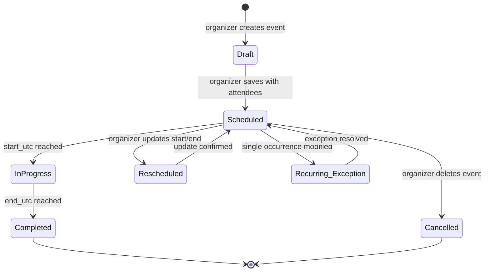

# Design a Meeting Calendar System (Google Calendar)

**Difficulty**: 🟡 Intermediate
**Reading Time**: 25 min
**Interview Frequency**: Medium

---

## The Core Problem

Scheduling meetings across time zones with conflict detection for 100 million users sounds simple until you encounter recurring events: "every other Tuesday at 3pm except holidays" stored as a rule, not 52 individual records. Expanding these rules on-the-fly for conflict detection while keeping query performance under 100ms is the central challenge.

## Functional Requirements

- Create, update, delete events (one-time and recurring)
- Invite attendees and track acceptance
- Check free/busy status for a user or group
- Set reminders (email, push, popup)
- Support recurring events with exceptions (skip or reschedule one occurrence)

## Non-Functional Requirements

| Requirement | Target |
|-------------|--------|
| Availability | 99.99% (52 min/year) |
| Event load latency | p99 < 200ms for week view |
| Notification delivery | Reminders within ±1 minute of scheduled time |
| Scale | 100M users, 5B events, 500K invites sent/day |

## Back-of-Envelope Estimates

- **Events per user**: 100M users × 500 events avg = 50B event records
- **Recurring expansion**: User with "daily standup" for 5 years = 1,825 occurrences from one rule → store rule, expand on query
- **Reminder volume**: 500K meetings/day × 3 attendees avg × 2 reminders = 3M reminder notifications/day

## Key Design Decisions

1. **Recurring Event Storage: Rule vs Expansion** — store RRULE (RFC 5545) as a single record, not individual occurrences; expand to occurrences at query time for a given date range; modifications to single occurrences stored as exception records with original event reference.
2. **Free/Busy Query Optimization** — free/busy (is user available from 2-3pm?) is the most frequent query type for scheduling; cache expanded event intervals per user per week in Redis; invalidate when events change; avoids re-expanding recurring rules on every check.
3. **Timezone Storage** — always store timestamps in UTC; store original timezone of event creator as separate field; render in viewer's local timezone at display time; never store in local time to avoid DST bugs.

## High-Level Architecture



## Quick Reference: Design Choices at a Glance

| Decision | Choice | Why |
|----------|--------|-----|
| Recurring event storage | RRULE string + exception records | 1 row vs 780 rows for a 3-year daily event |
| Timestamp storage | UTC + creator TZID | Survives DST transitions; renders correctly in any viewer timezone |
| Free/busy backing store | Redis sorted set per user/week | Sub-millisecond lookup vs 200–500ms RRULE re-expansion from DB |
| Conflict detection algorithm | In-memory interval intersection | O(N×K log K); fast once intervals are fetched from Redis |
| Reminder delivery | Redis sorted set + ZPOPMIN workers | Time-ordered, idempotent, horizontally scalable |
| Search index | Elasticsearch (async via Kafka) | Full-text + attendee filter; eventual consistency acceptable |
| Sync protocol | syncToken + change log table | Incremental sync; full re-sync on 410 Gone |
| Concurrent edit resolution | ETag optimistic locking, field-level merge | No distributed locks; 412 on conflict; client re-fetches |

## Top Interview Questions for This Problem

| Question | Tests |
|----------|-------|
| How do you store a recurring event that repeats every Tuesday for 10 years? | RRULE storage, lazy expansion |
| How do you detect scheduling conflicts for a group of 20 people? | Free/busy aggregation, intersection |
| What happens when a user in New York creates a meeting and a user in Tokyo views it? | UTC storage, timezone rendering |

## Related Concepts

- [Conference room booking for similar conflict detection](./conference-room-booking)
- [Task scheduler for recurring job scheduling comparison](./task-scheduler)

---

## Component Deep Dive 1: Recurring Event Engine

The recurring event engine is the most architecturally complex component of any calendar system. A naive approach stores each occurrence as a separate row: a "Daily standup, Mon–Fri, for 3 years" becomes 780 rows. At 100M users each with a handful of recurring events, you quickly reach tens of billions of rows — most of which are never read, but all of which must be written, indexed, and garbage-collected. This approach also makes editing the recurrence rule catastrophically expensive: updating "change time from 9am to 10am" requires a bulk UPDATE on potentially thousands of rows.

The production approach stores a single canonical RRULE record and expands occurrences lazily at query time. The RFC 5545 RRULE grammar is rich: `RRULE:FREQ=WEEKLY;BYDAY=TU,TH;UNTIL=20271231T000000Z` encodes "every Tuesday and Thursday until end of 2027" in one string. The expander interprets this grammar for any requested date range in microseconds using a generative algorithm (not table scans).

The critical complexity is **exception handling**. RFC 5545 defines `EXDATE` (exclude a date) and `RECURRENCE-ID` (replace one occurrence with a modified version). Both are stored as child records pointing back to the parent recurring event via `parent_event_id`. When the expander generates occurrences for a week view, it must:
1. Generate all raw occurrences from the RRULE for that window.
2. Remove any occurrences whose date appears in the `EXDATE` list.
3. For any `RECURRENCE-ID` overrides, replace the generated occurrence with the exception record.

This three-step merge must happen in-memory per query — it cannot be pre-materialized without losing the ability to efficiently edit the base rule.



| Approach | Latency | Storage Cost | Edit Cost |
|----------|---------|--------------|-----------|
| Fully materialized rows | ~5ms (index scan) | 780 rows per 3yr daily event | O(N) bulk UPDATE on all future rows |
| RRULE + lazy expansion | ~15ms (expansion CPU) | 1 row + exceptions | O(1) UPDATE on parent row |
| Hybrid: materialize next 30 days | ~5ms (index scan) | ~30 rows hot + 1 rule | O(K) re-materialize on edit, K≤30 |

The RRULE + lazy expansion with a Redis cache for expanded intervals is the production choice for systems at Google Calendar scale. The hybrid pre-materialization model is a reasonable middle ground for smaller deployments where CPU cost of expansion per query is measurable.

---

## Component Deep Dive 2: Free/Busy Service and Conflict Detection

The free/busy query — "is this person available between 2pm and 3pm next Tuesday?" — is issued far more often than event creation. Every time a user opens the "find a time" scheduling UI, the client fires free/busy requests for every invitee simultaneously. For a meeting with 20 attendees, that is 20 parallel queries that must each return under 50ms for the UI to feel responsive.

**Naive approach failure**: issuing a SQL range query against the events table for each user, expanding RRULEs in the database layer, and returning results. At 100M users each with hundreds of events, even with indexes on `(user_id, start_utc, end_utc)`, the RRULE expansion must run application-side, making cold queries 200–500ms per user. At 20 users per scheduling request, aggregate latency is unacceptable.

**Production approach**: maintain a pre-computed free/busy bitmap per user per week in Redis. When an event is created or deleted, the Event Service publishes a `calendar.event.changed` message on Kafka. A Free/Busy Updater consumer reads these messages and recomputes the affected user's weekly bitmap. The bitmap is a sorted list of `[start_utc, end_utc]` intervals stored as a Redis sorted set (score = start timestamp). A free/busy lookup is then a Redis ZRANGEBYSCORE call: sub-millisecond.

**At 10x load (1B users)**: Redis memory becomes the bottleneck. Each user's weekly free/busy set is ~200 bytes × 52 weeks = ~10KB per user. At 1B users, that is 10TB of Redis data — requiring a sharded Redis cluster with consistent hashing on `user_id`. The real Google Calendar uses a distributed cache tier (Bigtable-backed for persistence, Memcache for L1) rather than Redis, but the principle is identical.



Conflict detection for group scheduling is an interval intersection problem. Given N users' free intervals, find the common free slots. This is O(N × K log K) where K is events per user per week — efficient enough in-memory once the per-user interval sets are fetched from Redis.

The "Find a Time" UI optimization: rather than waiting for all N attendee free/busy responses before rendering, the client renders partial results progressively. As each attendee's interval set arrives, the UI updates the slot availability overlay. Attendees who respond within 50ms (Redis hit) appear first; slow responders (cache miss, RRULE re-expansion needed) update the UI when they complete. This streaming approach is why "Find a Time" feels responsive even for large meeting groups.

**Partial availability**: some attendees may have calendar sharing disabled or belong to an external organization. The free/busy service returns `status: "busy"`, `status: "free"`, or `status: "unknown"` per user per interval. The UI renders "unknown" slots differently (hatched pattern) so the organizer can see which attendees have visible calendars vs. opaque ones.

---

## Component Deep Dive 3: Reminder / Notification Delivery

The reminder pipeline has a harder constraint than the calendar query path: reminders must fire within ±1 minute of the scheduled time. This is a **time-series scheduling problem**, not a typical request-response workload.

**Naive approach**: a cron job that runs every minute, queries the events table for `reminder_time BETWEEN now() AND now()+60s`, and fires notifications. This breaks at scale because: (1) the query scans billions of rows every minute; (2) a crash during the 60s window causes a re-scan that double-fires all reminders; (3) horizontal scaling causes duplicate scans.

**Production approach**: a dedicated Reminder Scheduler service that maintains a time-ordered work queue. On event creation, the Reminder Scheduler inserts a reminder job into a time-sorted Redis sorted set (score = fire_at_unix_epoch). A set of worker processes poll this sorted set with `ZPOPMIN` for jobs due in the current second, fire the notification, and mark the job complete. Idempotency keys (event_id + reminder_type + fire_at) prevent double-delivery if a worker crashes and the job re-queues.

For 3M reminders/day (~35/sec average, with morning spikes up to 2,000/sec at 9:30am when standups fire), a single Redis instance with 10 worker processes handles the load comfortably. At 10x scale, shard the sorted set by `hash(user_id) % N_shards`.

The notification dispatch itself (email, push, in-app) is handed off to dedicated notification microservices behind a message queue, decoupling latency-sensitive reminder scheduling from potentially slow external API calls (APNs, FCM, SendGrid).

---

## Data Model

```sql
-- Core event record (one-time OR recurring parent)
CREATE TABLE events (
    event_id        UUID PRIMARY KEY DEFAULT gen_random_uuid(),
    owner_user_id   BIGINT NOT NULL REFERENCES users(user_id),
    title           VARCHAR(1024) NOT NULL,
    description     TEXT,
    location        VARCHAR(512),

    -- Timing (always UTC)
    start_utc       TIMESTAMPTZ NOT NULL,
    end_utc         TIMESTAMPTZ NOT NULL,
    creator_tz      VARCHAR(64) NOT NULL,  -- e.g. 'America/New_York'

    -- Recurring event fields (NULL for one-time events)
    rrule           TEXT,                  -- RFC 5545 RRULE string
    recur_until     TIMESTAMPTZ,           -- denormalized end from RRULE for index

    -- Exception fields (set when this record overrides a parent occurrence)
    parent_event_id UUID REFERENCES events(event_id),
    recurrence_date DATE,                  -- which occurrence this overrides
    is_cancelled    BOOLEAN DEFAULT FALSE, -- TRUE means this date is excluded (EXDATE)

    -- Metadata
    created_at      TIMESTAMPTZ DEFAULT now(),
    updated_at      TIMESTAMPTZ DEFAULT now(),
    etag            VARCHAR(64)            -- optimistic concurrency token
);

-- Indexes
CREATE INDEX idx_events_owner_start ON events (owner_user_id, start_utc, end_utc);
CREATE INDEX idx_events_parent ON events (parent_event_id) WHERE parent_event_id IS NOT NULL;
CREATE INDEX idx_events_recur_range ON events (owner_user_id, recur_until) WHERE rrule IS NOT NULL;

-- Attendees (many-to-many: event ↔ users)
CREATE TABLE event_attendees (
    event_id        UUID NOT NULL REFERENCES events(event_id) ON DELETE CASCADE,
    user_id         BIGINT NOT NULL REFERENCES users(user_id),
    email           VARCHAR(320) NOT NULL,  -- external attendees may not have accounts
    rsvp_status     VARCHAR(16) NOT NULL DEFAULT 'needs_action',
                    -- ENUM: 'accepted', 'declined', 'tentative', 'needs_action'
    is_organizer    BOOLEAN DEFAULT FALSE,
    added_at        TIMESTAMPTZ DEFAULT now(),
    PRIMARY KEY (event_id, user_id)
);

CREATE INDEX idx_attendees_user ON event_attendees (user_id, event_id);

-- Reminders (per-attendee override possible)
CREATE TABLE reminders (
    reminder_id     BIGSERIAL PRIMARY KEY,
    event_id        UUID NOT NULL REFERENCES events(event_id) ON DELETE CASCADE,
    user_id         BIGINT NOT NULL REFERENCES users(user_id),
    method          VARCHAR(16) NOT NULL,  -- 'email', 'popup', 'push'
    minutes_before  INT NOT NULL,          -- fire X minutes before event start
    fire_at_utc     TIMESTAMPTZ NOT NULL,  -- denormalized = start_utc - interval
    fired_at        TIMESTAMPTZ,           -- set when notification sent (idempotency)
    UNIQUE (event_id, user_id, method, minutes_before)
);

CREATE INDEX idx_reminders_fire_at ON reminders (fire_at_utc) WHERE fired_at IS NULL;

-- Free/Busy cache table (or Redis — same schema for reference)
-- Key: user_id:week_start_iso  Value: sorted list of [start_utc, end_utc] intervals
-- Stored in Redis sorted set: ZADD freebusy:{user_id}:{week} score=start_utc member="start:end"
```

---

## Scale Bottlenecks

| Traffic Level | Component That Breaks | Symptoms | Mitigation |
|---------------|----------------------|----------|------------|
| 10x baseline (1B users) | Redis free/busy cache | OOM errors; evictions cause cache miss storm; re-expansion CPU spikes | Shard Redis by `user_id % N`; increase TTL; add L2 in-process cache per API pod |
| 10x baseline | PostgreSQL event table | Slow range scans on 50B+ rows; replication lag on write-heavy primaries | Shard events by `owner_user_id % 256`; read replicas for calendar view queries |
| 100x baseline (10B users) | Reminder Scheduler Redis sorted set | ZPOPMIN contention; single sorted set becomes bottleneck at >5K reminders/sec | Partition sorted set by minute bucket (`reminders:{epoch_minute}`); 1 worker per bucket |
| 100x baseline | Event write path | Kafka consumer lag on free/busy updater | Increase partition count; add consumer group replicas; pre-shard by user_id |
| 1000x baseline (global scale) | Cross-region consistency | Users in Tokyo see stale events created in New York | Multi-region Postgres with async replication + version vector reads; accept eventual consistency for non-conflicting writes |

---

## How Google Calendar Built This

Google Calendar serves over 500 million active users and processes roughly 3 billion API calls per day according to Google's published developer statistics. Its architecture is a masterclass in handling the recurring event problem at planetary scale.

**Storage layer**: Google Calendar does not use a traditional relational database as its primary event store. Instead, it uses **Bigtable**, Google's wide-column store, with a row key of `user_id:start_timestamp:event_id`. This layout makes range scans for a user's week view extremely fast — a single Bigtable row prefix scan returns all events in a time window without a secondary index. The RRULE string and exception records are stored in separate Bigtable column families within the same row group.

**RRULE expansion**: Google open-sourced their calendar RRULE expansion library as part of the Android project (`android.ical`). Internally, recurring event expansion is handled by a stateless microservice that interprets RFC 5545 rules against a requested date range. This service is horizontally scaled independently of the storage layer, allowing CPU-intensive expansion work to scale separately from I/O-intensive storage reads.

**Free/busy infrastructure**: Google's "Find a Time" feature — which suggests open meeting slots for a group — relies on a specialized **availability index** built on top of Bigtable. When an event is created, a background worker writes a compact interval record (just `user_id`, `start`, `end`) into a separate availability table sharded by `(user_id, week_number)`. A group free/busy query reads N availability rows in parallel (one per attendee) and computes interval intersections in memory on the API server. At peak, this system handles over 10 million "Find a Time" queries per hour.

**Non-obvious decision**: Google stores the **expanded occurrence timestamps** for the next 12 months of recurring events in a separate materialization table. This is a deliberate hybrid strategy: the canonical RRULE is stored for correctness and editability, but the near-term occurrences are pre-materialized for read performance. On RRULE edit, the system invalidates the materialized occurrences and re-materializes them asynchronously — accepting a brief window of stale data in exchange for consistent sub-10ms read latency.

Source: Google I/O 2019 "Building Calendar" talk; Google Calendar API design documentation; Google Cloud Bigtable case studies (cloud.google.com/bigtable/docs/case-studies).

---

## Interview Angle

**What the interviewer is testing:** The interviewer wants to see whether you understand the tension between storage efficiency and query performance for recurring events, and whether you can reason about time-series scheduling constraints (reminders) separately from query constraints (calendar view). They also want to see timezone awareness — candidates who store local time instead of UTC reveal a fundamental gap.

**Common mistakes candidates make:**

1. **Storing each recurring occurrence as a separate row.** Candidates who propose `INSERT INTO events (...) FOR EACH OCCURRENCE` don't recognize that 100M users × moderate recurrence means hundreds of billions of rows, most never read. The interviewer is specifically probing this. Correct answer: store RRULE, expand on query.

2. **Ignoring RRULE exceptions.** Candidates describe RRULE storage but fail to mention the exception handling layer (`EXDATE`, `RECURRENCE-ID`). In practice, "I deleted one occurrence of my weekly standup" is the most common edit operation. Without an exception model, a single occurrence delete forces a full RRULE rewrite with an exclusion list that grows unboundedly.

3. **Using local timestamps or naive UTC conversion.** Storing `2026-03-08 09:00:00 America/New_York` and converting to UTC at write time produces `2026-03-08 14:00:00Z`. But if the event was created before a DST change and the user meant "9am in New York regardless of DST," you've encoded the wrong time. Always store UTC for the actual instant, and store the original TZID so the display layer can re-render correctly after DST transitions.

**A follow-up the interviewer will ask:** "How would you handle a recurring event modification — the user wants to change only future occurrences, not past ones?" The correct answer: create a new recurring event starting from the modified date, set `recur_until` on the old event to the day before, and link the new event to the old via a `supersedes_event_id` field. This preserves immutable history (past occurrences unchanged), supports correct CalDAV sync (old event gets an update, new event is a create), and keeps the exception model clean. Candidates who propose "bulk UPDATE all future exception records" miss that RRULE-based systems don't have future exception records to update — they only have the parent RRULE, which must be split.

**The insight that separates good from great answers:** Great candidates recognize that **free/busy is a read-optimized query path that must be decoupled from the event write path**. Rather than querying the event table on every free/busy check, maintaining a pre-aggregated interval cache per user per week — kept fresh via event-change events on Kafka — reduces the hottest query in the system from a complex RRULE-expansion DB query to a sub-millisecond Redis ZRANGEBYSCORE lookup. This architectural separation of "write truth" (normalized event records) from "read cache" (pre-expanded free/busy intervals) is the core insight that scales the system 100x beyond naive implementations.

---

## Key Numbers to Remember

| Metric | Value | Context |
|--------|-------|---------|
| Events per user (avg) | 500 events | Back-of-envelope baseline for storage estimates |
| Total events at 100M users | 50 billion rows | Reason enough NOT to materialize recurring occurrences |
| Free/busy cache entry size | ~200 bytes/week | Sorted set of [start, end] intervals per user per week |
| Redis memory for free/busy (100M users, 52 weeks) | ~1 TB | Requires Redis cluster; shardable by user_id |
| Google Calendar API calls/day | ~3 billion | Published by Google; reminder: read >> write ratio ≈ 100:1 |
| Reminder peak rate (100M users) | ~2,000 reminders/sec | Morning spike at 9:30am standup time; size your reminder workers for this, not average |
| RRULE expansion CPU time (1 year) | < 1ms | RFC 5545 generative algorithms are fast; bottleneck is I/O, not expansion math |
| p99 calendar view latency target | < 200ms | Achieved via Redis free/busy cache + pre-computed week views |
| Bigtable row scan for week view | ~5–10ms | With `user_id:start_ts` row key design; vs 50–200ms for Postgres range query at same scale |
| CalDAV sync round-trip | ~100–300ms | Full sync on client open; incremental sync with syncToken ~20ms |
| Elasticsearch search latency | < 20ms p99 | Full-text event search at 100M user scale with per-user index sharding |
| Webhook push notification lag | < 2 seconds | From event write to client push delivery; polling alternative = 30s avg lag |
| Max attendees per free/busy API call | 50 users | Rate-limit bound; computing intersections for 50 × 20 intervals/user = trivial in-memory |

---

## Calendar Sync Architecture

One of the most underappreciated challenges in calendar design is **multi-device sync**. A user with a phone, laptop, and tablet expects changes made on one device to appear on others within seconds — even when offline edits happen concurrently. This is a distributed systems consistency problem disguised as a UX problem.

### The Sync Protocol Problem

A naive sync approach sends the full calendar state on each sync ("give me all events"). This is impractical at 50B events. The production approach uses **incremental sync with change tokens**:

1. Initial sync: client fetches all events, server returns a `syncToken` representing the current state.
2. Incremental sync: client sends `syncToken` in the next request; server returns only events created/updated/deleted since that token.
3. Token invalidation: if the server loses the sync state (cache eviction, schema migration), it returns HTTP 410 Gone, and the client performs a full re-sync.

The `syncToken` is typically a monotonic sequence number or a wall-clock timestamp rounded to a sync epoch. The server maintains a **change log table** that records every mutation with a sequence number. Incremental sync is then a simple range scan on this change log: `SELECT * FROM change_log WHERE seq > :last_known_seq AND user_id = :uid`.

### Conflict Resolution for Concurrent Edits

When a user edits an event on their phone while offline, and another attendee edits the same event simultaneously on their laptop, both changes land on the server as competing writes. Calendar systems use **last-write-wins at the field level** (not at the record level) to merge these changes. The `etag` field in the events table is a hash of the record content; if two writes arrive with the same base etag, the server applies both changes field-by-field, taking the later timestamp per field. Only if the same field is modified by both parties in conflicting ways does the server reject one write with HTTP 409 Conflict, requiring the client to re-fetch and re-apply.



### CalDAV: The Industry Standard Sync Protocol

Google Calendar, Apple Calendar, and Microsoft Exchange all support **CalDAV** (RFC 4791), the WebDAV-based standard for calendar sync. CalDAV models calendars as HTTP resources: `PUT /calendars/{user}/{cal-id}/{event-id}.ics` creates an event; `REPORT` is used for sync queries. The `.ics` format is the iCalendar wire format from RFC 5545.

In practice, most production calendar systems implement a proprietary sync protocol (Google's `events.list` with `syncToken`, Microsoft's EWS notifications) that is faster than raw CalDAV, while maintaining CalDAV compatibility as a fallback for third-party clients like Thunderbird.

---

## Timezone Deep Dive

Timezone handling is the source of the most insidious calendar bugs in production. The rule is simple to state and surprisingly hard to implement correctly: **store instants in UTC, store the original TZID as metadata, render in the viewer's local timezone at display time**. Each step has failure modes.

### The DST Problem

Daylight saving time transitions create two classes of bugs:

**Wall-clock ambiguity**: On November 1, 2026 at 2:00am Eastern time, the clock falls back to 1:00am. If you schedule a meeting at 1:30am Eastern and store UTC, you get `06:30Z`. When the user views the meeting at 1:30am after the fallback, the local time correctly shows 1:30am ET — but a naive system that stored only wall-clock time without DST flag cannot determine which side of the transition the meeting was on.

**Recurring event transitions**: A weekly meeting set for "3pm Eastern, every Monday" should fire at `20:00Z` in winter (EST, UTC-5) and `19:00Z` in summer (EDT, UTC-4). If you generate future UTC occurrences at event creation time and store them literally, your winter meetings have the wrong UTC time after DST transitions. The correct model: store the RRULE + TZID, and compute the UTC instant per occurrence at expansion time using the IANA timezone database — which captures all historical and future DST rules.



### Timezone Storage Best Practices

| Approach | Problem | Recommended? |
|----------|---------|--------------|
| Store local time string `"2026-11-01 09:00 EST"` | EST is ambiguous (multiple regions); doesn't survive DST rename | No |
| Store UTC timestamp only | Loses original wall-clock intent; DST transitions break recurring events | Partial — only for one-time events |
| Store UTC + TZID (e.g., `America/New_York`) | Correct: TZID unambiguously identifies the timezone; IANA db handles all DST rules | Yes |
| Store UTC offset (+05:30) | Offset is fixed; doesn't capture DST transitions in that region | No |

The TZID must use IANA timezone database identifiers (`America/New_York`, `Europe/London`, `Asia/Kolkata`) — NOT OS-specific names like `Eastern Standard Time` (Windows) which are not universally understood.

---

## Event Lifecycle and State Machine

Every event in a calendar system transitions through a well-defined state machine. Understanding these transitions is important for correctly handling attendee workflows and notification triggers.



**Attendee RSVP state machine** (per event_attendees row):

- `needs_action` → `accepted` (attendee clicks Accept)
- `needs_action` → `declined` (attendee clicks Decline)
- `needs_action` → `tentative` (attendee clicks Maybe)
- `accepted` → `declined` (attendee changes mind; triggers re-notification to organizer)
- Any state → `removed` (organizer removes attendee; delete from event_attendees; send cancellation notification)

Each RSVP state transition triggers a notification: attendee acceptance/decline fires an email to the organizer. When the organizer reschedules, all `accepted` and `tentative` attendees receive an update notification and their RSVP status resets to `needs_action`.

---

## Pseudocode: Core Algorithms

### RRULE Expansion with Exception Merge

```python
def expand_events_for_range(user_id, range_start, range_end):
    """
    Returns all event occurrences for user in [range_start, range_end).
    Handles one-time events, recurring events, and exceptions.
    """
    one_time_events = db.query("""
        SELECT * FROM events
        WHERE owner_user_id = %s
          AND rrule IS NULL
          AND parent_event_id IS NULL
          AND start_utc < %s AND end_utc > %s
    """, [user_id, range_end, range_start])

    recurring_parents = db.query("""
        SELECT * FROM events
        WHERE owner_user_id = %s
          AND rrule IS NOT NULL
          AND start_utc < %s
          AND (recur_until IS NULL OR recur_until > %s)
    """, [user_id, range_end, range_start])

    result = list(one_time_events)

    for parent in recurring_parents:
        # Step 1: generate raw occurrences from RRULE
        raw = rrule_expand(parent.rrule, parent.start_utc, range_start, range_end, tzid=parent.creator_tz)

        # Step 2: fetch exceptions in this range
        exceptions = db.query("""
            SELECT * FROM events
            WHERE parent_event_id = %s
              AND recurrence_date BETWEEN %s AND %s
        """, [parent.event_id, range_start.date(), range_end.date()])

        exdate_set = {e.recurrence_date for e in exceptions if e.is_cancelled}
        override_map = {e.recurrence_date: e for e in exceptions if not e.is_cancelled}

        # Step 3: merge
        for occurrence_start in raw:
            occurrence_date = occurrence_start.date()
            if occurrence_date in exdate_set:
                continue  # EXDATE: skip this occurrence
            if occurrence_date in override_map:
                result.append(override_map[occurrence_date])  # RECURRENCE-ID: use override
            else:
                result.append(make_occurrence(parent, occurrence_start))

    return sorted(result, key=lambda e: e.start_utc)


def check_conflict(user_id, proposed_start, proposed_end):
    """
    Fast free/busy check using Redis cache.
    Returns True if user is busy during [proposed_start, proposed_end).
    """
    week_key = f"freebusy:{user_id}:{iso_week(proposed_start)}"
    intervals = redis.zrangebyscore(week_key, proposed_start.timestamp(), proposed_end.timestamp())

    # An interval overlaps [proposed_start, proposed_end) if interval.start < proposed_end
    # AND interval.end > proposed_start
    for interval_str in intervals:
        iv_start, iv_end = parse_interval(interval_str)
        if iv_start < proposed_end and iv_end > proposed_start:
            return True  # BUSY

    return False  # FREE
```

### Reminder Scheduler Worker

```python
# Runs continuously; one process per shard
def reminder_worker(shard_id, total_shards):
    sorted_set_key = f"reminders:shard:{shard_id}"

    while True:
        now_epoch = time.time()
        # Pop up to 100 reminders due in the next second
        due = redis.zrangebyscore(sorted_set_key, 0, now_epoch + 1, start=0, num=100)

        for reminder_data in due:
            reminder = parse(reminder_data)
            idempotency_key = f"reminder_sent:{reminder.event_id}:{reminder.user_id}:{reminder.fire_at}"

            if redis.setnx(idempotency_key, "1", ex=86400):  # 24h TTL
                # First worker to claim this reminder
                dispatch_notification(reminder)
                redis.zrem(sorted_set_key, reminder_data)
                db.update("SET fired_at = now() WHERE reminder_id = %s", [reminder.reminder_id])

        time.sleep(0.1)  # Poll 10x per second
```

---

## Search and Indexing

Calendar search ("find all meetings with Alice in Q1 2026") is a secondary but important feature. The events table's primary index on `(owner_user_id, start_utc, end_utc)` handles time-range queries efficiently but cannot support full-text search on `title` or `description`, nor attendee-based filtering across millions of events.

**Approach**: write events asynchronously to a search index (Elasticsearch or Typesense) after successful Postgres writes. The Kafka `calendar.event.changed` topic drives both the free/busy cache updater and the search indexer. The search document includes:

```json
{
  "event_id": "uuid",
  "owner_user_id": 12345,
  "title": "Q2 Planning Standup",
  "description": "Discuss roadmap priorities",
  "attendee_emails": ["alice@example.com", "bob@example.com"],
  "start_utc": "2026-04-01T14:00:00Z",
  "end_utc": "2026-04-01T15:00:00Z",
  "location": "Zoom"
}
```

Search queries hit Elasticsearch directly (bypassing the event DB), filtered by `owner_user_id` to enforce authorization. Full-text match on `title` + `description`, plus a terms filter on `attendee_emails` for "meetings with Alice", runs in under 20ms for 99th percentile at 100M user scale with per-user index sharding.

The critical consistency concern: the search index is eventually consistent with the event DB (typically 1–3 seconds lag). This is acceptable for search but not for free/busy conflict detection, which is why these two read paths use different backing stores (Redis vs Elasticsearch).

**Authorization on search**: every search query must be scoped by `owner_user_id`. Without this filter, a user could query another user's private event titles. The Elasticsearch index includes `owner_user_id` as a required term filter injected server-side — never trusted from the client. Shared calendars (where user A can view user B's calendar) are handled by writing a secondary index document with `viewer_user_id = B` at share-grant time, so user B's searches return shared events without cross-user data leakage.

| Query Type | Backing Store | Latency (p99) | Consistency |
|------------|--------------|---------------|-------------|
| Week view (time range) | PostgreSQL + Redis cache | < 50ms | Strong (reads from primary) |
| Free/busy check | Redis sorted set | < 5ms | Eventual (1–3s lag on event change) |
| Full-text search | Elasticsearch | < 20ms | Eventual (1–3s lag) |
| Attendee lookup | Elasticsearch | < 20ms | Eventual |

---

## API Design

The public API surface for a calendar system reflects the domain model directly. These are the core endpoints and their design decisions.

| Method | Endpoint | Notes |
|--------|----------|-------|
| `POST` | `/calendars/{calId}/events` | Create event; returns `event_id` + `etag` |
| `GET` | `/calendars/{calId}/events` | List events; required params: `timeMin`, `timeMax`; optional: `singleEvents=true` expands recurrences |
| `GET` | `/calendars/{calId}/events/{eventId}` | Fetch single event by ID |
| `PATCH` | `/calendars/{calId}/events/{eventId}` | Partial update; include `If-Match: {etag}` header for optimistic locking |
| `DELETE` | `/calendars/{calId}/events/{eventId}` | Delete; for recurring, optional `?recurringEventAction=thisAndFollowing\|all\|this` |
| `GET` | `/freeBusy` | Body: `{timeMin, timeMax, items: [{id: user_email}]}`; returns busy intervals per user |
| `POST` | `/calendars/{calId}/events/quickAdd` | Natural language: `"Lunch with Alice tomorrow at noon"` → parsed event |

**Key design decision — `singleEvents=true`**: By default, a recurring event returns one record (the parent RRULE). When the client passes `singleEvents=true`, the server expands occurrences within `[timeMin, timeMax]` and returns each as an individual virtual event object. This moves expansion cost to the server and keeps client code simple. Google Calendar's API uses exactly this pattern.

**Optimistic locking via ETag**: Every PATCH must include `If-Match: {etag}`. If the server's current etag differs (someone else modified the event), it returns `412 Precondition Failed`. The client re-fetches and re-applies. This prevents lost updates without requiring distributed locks.

**Rate limiting considerations**: The `/freeBusy` endpoint is the most abuse-prone — a malicious or buggy client can query free/busy for thousands of users in a loop. Apply per-OAuth-client rate limits (e.g., 1,000 requests/100 seconds per client, matching Google Calendar API quotas). Free/busy responses can also be throttled by attendee count: cap at 50 users per request to bound server-side interval intersection work.

**Webhook push notifications**: Rather than clients polling for calendar changes, production systems support server-sent push notifications. Clients register a webhook URL; the server POSTs a lightweight "something changed" payload to the webhook when events in a watched calendar are modified. The client then calls the incremental sync endpoint to fetch the delta. This push+pull model reduces polling traffic by 90%+ compared to naive polling at 30-second intervals, at the cost of webhook delivery infrastructure (retry queues, SSL validation, delivery logs).

---

## 📚 Resources & References

| Resource | Type | What You'll Learn |
|----------|------|------------------|
| [ByteByteGo — Design a Calendar System](https://www.youtube.com/@ByteByteGo) | 📺 YouTube | Search "calendar system design" — recurring events, timezone handling, and sync |
| [Google Calendar API Design Patterns](https://developers.google.com/calendar/api/guides/concepts) | 📚 Docs | Recurring event representation, conflict resolution, and attendee management |
| [Outlook Calendar Architecture](https://techcommunity.microsoft.com/t5/exchange-team-blog/) | 📖 Blog | How Exchange/Outlook handles calendar sync across millions of mailboxes |
| [iCalendar RFC 5545 Specification](https://datatracker.ietf.org/doc/html/rfc5545) | 📚 Docs | The standard for calendar data interchange — RRULE for recurring events |
| [Calendly Engineering: Timezone Handling](https://calendly.com/blog/engineering-timezone-detection) | 📖 Blog | The complexity of timezone-aware scheduling at scale |
