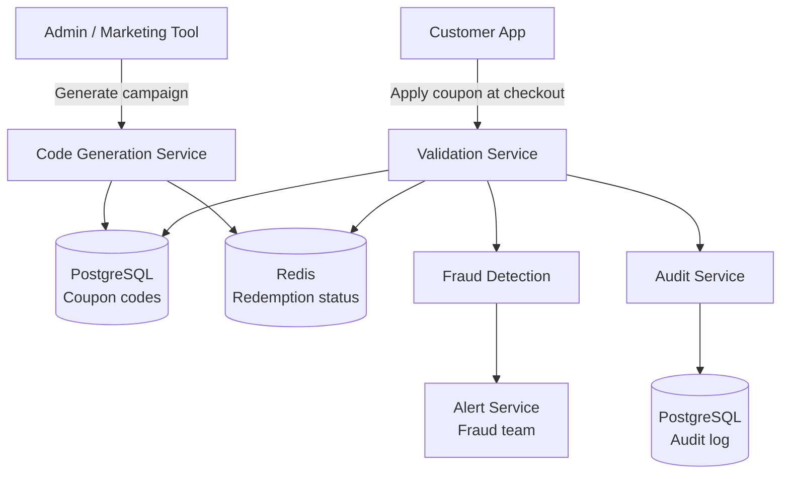
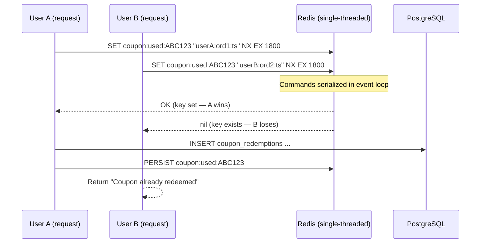
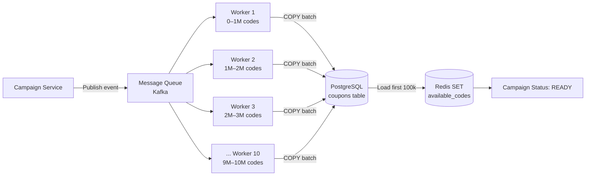

# Design an Online Coupon Distribution System

**Difficulty**: 🟡 Intermediate
**Reading Time**: ~20 minutes
**The Core Problem**: How do you generate 10M unique coupon codes, enforce single-use at scale, and prevent fraud — while handling a burst of 100k redemptions/minute during a sale?

---

## Table of Contents

1. [Requirements](#1-requirements)
2. [Capacity Estimation](#2-capacity-estimation)
3. [High-Level Architecture](#3-high-level-architecture)
4. [Code Generation](#4-code-generation)
5. [Single-Use Enforcement](#5-single-use-enforcement)
6. [Fraud Detection](#6-fraud-detection)
7. [Batch Pre-Generation](#7-batch-pre-generation)
8. [Audit Log](#8-audit-log)
9. [Key Design Decisions](#9-key-design-decisions)
10. [Interview Questions](#10-interview-questions)
11. [Key Takeaways](#11-key-takeaways)
12. [Component Deep Dive 1: Single-Use Enforcement with Redis](#component-deep-dive-1-single-use-enforcement-with-redis)
13. [Component Deep Dive 2: Batch Code Generation Pipeline](#component-deep-dive-2-batch-code-generation-pipeline)
14. [Component Deep Dive 3: Fraud Detection Layer](#component-deep-dive-3-fraud-detection-layer)
15. [Data Model](#data-model)
16. [Scale Bottlenecks](#scale-bottlenecks)
17. [How Shopify Built This](#how-shopify-built-this)
18. [Interview Angle](#interview-angle)
19. [Key Numbers to Remember](#key-numbers-to-remember)
20. [References](#20-references)

---

## 1. Requirements

### Functional
- Generate unique coupon codes (single-use and multi-use types)
- Bulk generation (10M codes for a campaign)
- Validate coupon at checkout: check validity + apply discount
- Single-use codes: each code can only be redeemed once
- Fraud prevention: detect mass redemption from single source
- Audit log: who redeemed what, when

### Non-Functional
- **Scale**: 10M unique codes per campaign, 100k redemptions/minute peak
- **Latency**: Code validation < 50ms
- **Accuracy**: Zero double-redemption of single-use codes
- **Durability**: Redemption audit log never lost

---

## 2. Capacity Estimation

| Metric | Estimate |
|--------|----------|
| Codes per campaign | 10M |
| Active campaigns | 10 (100M total codes) |
| Redemptions/day | 5M |
| Peak redemptions/min | 100k (sale start) |
| Peak redemptions/sec | 1,667 |
| Code storage | 100M × 50 bytes = **5 GB** |
| Audit log | 5M/day × 100 bytes = **500 MB/day** |
| Redis memory for active codes | 10M codes × 20 bytes = **200 MB** |

---

## 3. High-Level Architecture



---

## 4. Code Generation

### Code Format
```
Requirements for a good coupon code:
  - Human-readable and typeable (no confusing chars: 0/O, 1/I/l)
  - Random (not sequential — sequential codes are guessable)
  - Short enough for email/print (8–10 characters)
  - URL-safe (no special characters)

Character set: Base58 (like Bitcoin addresses)
  Characters: 123456789ABCDEFGHJKLMNPQRSTUVWXYZabcdefghijkmnopqrstuvwxyz
  Excludes: 0, O, I, l (confusing)
  58 chars in set

8-character code: 58^8 = 128 trillion combinations
10M codes = 10M / 128 trillion = 0.008% collision probability → negligible
```

### Code Generation Algorithm
```python
import secrets
import base58  # or custom Base58 alphabet

ALPHABET = '123456789ABCDEFGHJKLMNPQRSTUVWXYZabcdefghijkmnopqrstuvwxyz'

def generate_code(length=8):
    while True:
        # Generate random bytes, map to alphabet
        code = ''.join(secrets.choice(ALPHABET) for _ in range(length))
        # Verify uniqueness (batch check reduces DB round trips)
        return code

# Batch generation: 10M codes
codes = set()
while len(codes) < 10_000_000:
    codes.add(generate_code())

# Insert in batches of 10k using COPY for speed
# 10M inserts in batches: ~10 minutes
```

### Code Storage Schema
```sql
CREATE TABLE coupons (
  code           VARCHAR(12) PRIMARY KEY,
  campaign_id    BIGINT,
  discount_type  VARCHAR(20),    -- 'percent', 'fixed', 'free_shipping'
  discount_value NUMERIC(10,2),
  min_order_value NUMERIC(10,2) DEFAULT 0,
  max_uses       INT DEFAULT 1,  -- 1 = single use
  current_uses   INT DEFAULT 0,
  expires_at     TIMESTAMPTZ,
  created_at     TIMESTAMPTZ DEFAULT NOW()
);

CREATE TABLE coupon_redemptions (
  id          BIGSERIAL PRIMARY KEY,
  code        VARCHAR(12) REFERENCES coupons(code),
  user_id     BIGINT,
  order_id    BIGINT,
  redeemed_at TIMESTAMPTZ DEFAULT NOW(),
  ip_address  INET,
  discount_amount NUMERIC(10,2)
);

CREATE INDEX ON coupon_redemptions(user_id);
CREATE INDEX ON coupon_redemptions(code);
CREATE INDEX ON coupon_redemptions(ip_address);
```

---

## 5. Single-Use Enforcement

### Redis SET NX (Atomic)
```
At redemption time:
  SET coupon:used:{code} {user_id}:{order_id}:{timestamp} NX EX 86400

NX = "Set only if key does Not eXist"
EX = expire after 24h (safety cleanup for abandoned carts)

If SET returns OK → code not yet used → proceed to checkout
If SET returns nil → code already used → reject with "Coupon already redeemed"

After order confirmed (payment success):
  Persist to PostgreSQL coupon_redemptions
  PERSIST coupon:used:{code}  (remove TTL — make permanent)
  UPDATE coupons SET current_uses = current_uses + 1 WHERE code = ?

Race condition test:
  User A and User B both try same code simultaneously:
    A: SET coupon:used:ABC123 ... NX → OK (A wins)
    B: SET coupon:used:ABC123 ... NX → nil (B loses)
  Only A can proceed. B sees "already redeemed."
```

### Multi-Use Codes (Different approach)
```
For codes valid for first 1000 users (campaign-level limit):
  key: coupon:count:{campaign_id}
  Command: INCR coupon:count:{campaign_id}
  If returned value > 1000 → reject (limit reached)

Store in DB: UPDATE coupons SET current_uses = current_uses + 1
Consistency: Redis counter is source of truth during campaign; sync to DB async
```

---

## 6. Fraud Detection

### Signal 1: Same IP Using Many Codes
```
Redis counter:
  INCR fraud:ip:{ip_address}:redemptions:{day}
  EXPIRE fraud:ip:{ip_address}:redemptions:{day} 86400

Threshold: if counter > 5 for same IP in 1 day → flag + manual review
Extreme: if counter > 20 → auto-block IP
```

### Signal 2: Same User Redeeming Multiple Codes
```
Single-use policy: 1 coupon code per order
Brand policy: user can use 1 coupon per campaign (regardless of how many codes they have)

Check at redemption:
  SELECT COUNT(*) FROM coupon_redemptions
  WHERE user_id = ? AND campaign_id = ?
  If count > 0 → reject "Already used a coupon for this campaign"
```

### Signal 3: Rapid Code Discovery (Guessing Attack)
```
Attacker tries random codes to find valid ones:
  Rate limit per IP: 5 invalid codes per minute → auto-block for 1 hour
  Track in Redis: INCR fraud:ip:{ip}:invalid_codes with 60s TTL
  If value > 5 → add IP to Redis blocklist (SADD blocked_ips {ip}, TTL 1hr)
```

---

## 7. Batch Pre-Generation

Generating 10M codes at campaign launch is slow. Pre-generate and pool.

```
Async generation pipeline:
  1. Marketing creates campaign config (discount, expiry, count=10M)
  2. Campaign service publishes event: { campaign_id, count: 10M, ... }
  3. Code generator worker pool (10 workers × 1M codes each):
     - Generate codes in memory (Python set for dedup)
     - Bulk INSERT to PostgreSQL using COPY (2M rows/min per worker)
     - Total: 10M codes inserted in ~5 minutes
  4. Load hot subset (first 100k) to Redis SET (for fast distribution)
  5. Status: READY → campaign can launch

Code distribution:
  Email campaign: export CSV of (email, code) pairs → send via email service
  "Unlock discount" flow: claim one code → atomically pop from Redis set:
    SPOP campaign:{campaign_id}:available_codes → random available code
    Mark as assigned in DB
```

---

## 8. Audit Log

```
Every redemption attempt logged (success and failure):
{
  event_id:       UUID,
  code:           "ABC12345",
  user_id:        12345,
  order_id:       67890,
  action:         "REDEEMED" | "REJECTED_USED" | "REJECTED_EXPIRED" | "REJECTED_INVALID",
  discount_amount: 15.00,
  ip_address:     "1.2.3.4",
  user_agent:     "Mozilla/5.0...",
  timestamp:      "2024-03-15T14:30:00Z"
}

Storage: append-only table in PostgreSQL (never update, never delete)
Retention: 7 years (financial audit requirements)
Query patterns:
  - Find all uses of a code: indexed by code
  - Find all codes used by a user: indexed by user_id
  - Find suspicious IP: indexed by ip_address
```

---

## 9. Key Design Decisions

| Decision | Option A | Option B | Choice & Reason |
|----------|----------|----------|-----------------|
| Code format | Sequential numeric (1000, 1001...) | Random Base58 | **Random Base58** — sequential codes are guessable; attackers can enumerate valid codes |
| Single-use enforcement | DB row lock | Redis SET NX | **Redis SET NX** — atomic and < 1ms; DB locks at 1667/sec create contention |
| Validation | Check DB first | Check Redis first | **Redis first** — 99% cache hit for valid codes; DB fallback for cold codes or cache miss |
| Fraud check timing | Pre-validation | Post-validation | **Pre-validation** — prevent fraudulent codes from ever reaching checkout |
| Code generation timing | On-demand | Pre-generated batch | **Pre-generated** — on-demand generation at 100k/min redemptions would cause latency spikes |

---

## 10. Interview Questions

| Question | Key Answer |
|----------|-----------|
| How do you prevent two users from redeeming the same code? | Redis SET NX — atomic; only one SET succeeds; loser gets nil response |
| How do you handle the code being in cart but not yet checked out? | SET with 30min TTL (cart session); on checkout confirm → PERSIST (remove TTL) |
| How do you generate 10M unique codes quickly? | Batch generation in worker pool using secrets.choice; bulk COPY to Postgres; ~5 min |
| What if Redis is down during peak redemption? | Fallback: DB row-level lock with SELECT FOR UPDATE — 10× slower but correct |
| How do you detect coupon sharing on social media? | Spike in redemptions from diverse IPs for same code in short window → campaign review |

---

## 11. Key Takeaways

- **Redis SET NX** is the correct atomic primitive for single-use enforcement — no DB lock contention at peak load
- **Random Base58 codes** (not sequential) prevent enumeration attacks — 58^8 = 128 trillion combinations
- **Pre-generate codes** (not on-demand) — bulk generation takes 5 minutes; on-demand generation at peak creates latency
- **IP rate limiting** (5 invalid codes/minute) catches both brute-force guessing and bulk testing
- **Append-only audit log** for all redemptions — critical for fraud investigations and financial audits

---

## Component Deep Dive 1: Single-Use Enforcement with Redis

Single-use enforcement is the hardest correctness problem in a coupon system. At 1,667 redemptions/sec peak, even a 1ms window of non-atomicity means two concurrent requests can both see a code as "unused" and both succeed — resulting in double discounts and revenue leakage.

### Why Naive Approaches Fail

**Naive approach 1 — Check-then-set in application code:**
```
if not db.exists(code): # request A reads: code unused
    db.mark_used(code)  # request B also reads: code unused before A writes
                        # both proceed — double redemption
```
This is a classic TOCTOU (time-of-check/time-of-use) race. With 1,667 concurrent requests, the probability of two requests hitting the same code in the same millisecond is nonzero — especially if a code has been shared on social media and 10,000 users try it simultaneously.

**Naive approach 2 — Database row lock:**
```sql
SELECT * FROM coupons WHERE code = 'ABC123' FOR UPDATE;
UPDATE coupons SET current_uses = current_uses + 1 WHERE code = 'ABC123';
```
`SELECT FOR UPDATE` acquires a row-level lock which is correct, but at 1,667 writes/sec across 100M rows, PostgreSQL lock contention drives average query latency from 2ms to 50–200ms. Connection pool exhaustion (default 100 connections) becomes a hard ceiling at ~5,000 concurrent users.

### Redis SET NX — Internals

Redis processes commands in a single-threaded event loop. `SET key value NX` is atomic by design — no two clients can interleave their check and write. The sequence diagram below shows the correct behavior under concurrent load:



The EX 1800 (30-minute TTL) handles the abandoned-cart case: if User A puts the code in their cart but never checks out, the key expires and the code becomes available again. After successful payment, `PERSIST` removes the TTL to make the lock permanent.

### Trade-off Table: Enforcement Approaches

| Approach | Write Latency | Throughput Ceiling | Failure Mode | Recovery |
|----------|--------------|-------------------|--------------|----------|
| Redis SET NX | < 1ms | ~500k ops/sec per node | Redis unavailable | Fallback to DB lock |
| PostgreSQL SELECT FOR UPDATE | 2–200ms under load | ~5,000 writes/sec (connection pool) | Lock contention, pool exhaustion | Read replicas don't help (locks need primary) |
| Optimistic locking (version field) | 2ms happy path, retry on conflict | ~10k/sec before retry storms | High contention → retry loops | Exponential backoff + circuit breaker |

At 1,667 redemptions/sec, only Redis SET NX comfortably handles the load with sub-millisecond latency and a hardware ceiling of ~500k ops/sec on a single Redis node — 300× headroom.

---

## Component Deep Dive 2: Batch Code Generation Pipeline

Generating 10M unique codes at campaign launch is a write-heavy bulk operation that must complete before the campaign goes live. Doing this inline with user requests would be catastrophic — each code generation involves a uniqueness check, a DB write, and (optionally) a Redis load.

### Internal Mechanics

The generation pipeline runs asynchronously in a worker pool. Each worker handles an independent shard of the code space:



Each worker generates codes in-memory using Python's `secrets` module (cryptographically secure random), deduplicates within its own batch using a set, then uses PostgreSQL's `COPY FROM STDIN` to bulk-insert. `COPY` bypasses the SQL parser and WAL logging overhead for individual statements — achieving 2M rows/minute per worker versus ~100k rows/minute for individual `INSERT` statements.

### Scale Behavior at 10x Load

At baseline (10M codes, 10 campaigns), generation completes in ~5 minutes. At 10x load (100M codes, 100 campaigns), the bottleneck shifts:

- **CPU**: Code generation is CPU-bound (CSPRNG + set dedup). 10 workers × 10x = 100 workers needed. Worker pool auto-scales on a Kubernetes HPA targeting CPU > 60%.
- **PostgreSQL write throughput**: `COPY` throughput peaks at ~20M rows/minute per table partition on an 8-core RDS instance. With 100 concurrent workers hitting the same table, write amplification causes I/O saturation. Fix: partition `coupons` table by `campaign_id` — each partition accepts writes independently.
- **Redis memory**: Loading 100M codes into Redis at 20 bytes each = 2 GB. At 10x, this exceeds a single Redis node's recommended memory ceiling. Fix: use Redis Cluster sharded by `campaign_id`, and only load the "hot" first 1% (100k codes per campaign) into Redis — remaining codes stay in PostgreSQL and are loaded lazily.

### Trade-off: Pre-generation vs. On-Demand

| Approach | Generation Cost | Redemption Latency | Waste Risk | Complexity |
|----------|----------------|-------------------|------------|------------|
| Pre-generate all 10M | 5 min up-front, 0 at redemption | < 1ms (Redis) | Up to 9.9M unused codes per campaign | Medium |
| Generate on-demand | 0 up-front | 5–15ms (CSPRNG + DB write) | Zero waste | Low |
| Hybrid (pre-gen 100k, lazy rest) | 30 sec for first batch | < 1ms for first 100k, 5ms for the rest | Minimal | High |

The hybrid approach is optimal for campaigns where demand is uncertain — pre-generate a "warm" pool of 100k codes to handle the initial burst, then generate more in the background as the pool drains.

---

## Component Deep Dive 3: Fraud Detection Layer

The fraud detection layer sits between the validation service and the checkout flow. It operates on three signals — IP-level velocity, user-level policy, and code-guessing patterns — and must complete in under 5ms to keep the total validation latency under 50ms.

### IP-Level Velocity Detection

Redis sorted sets enable sliding-window rate limiting without a separate time-series database:

```
ZADD fraud:ip:{ip}:redemptions {current_timestamp} {event_uuid}
ZREMRANGEBYSCORE fraud:ip:{ip}:redemptions 0 {timestamp_minus_60s}
count = ZCARD fraud:ip:{ip}:redemptions
EXPIRE fraud:ip:{ip}:redemptions 300
```

This pattern (token-bucket via sorted set) counts events in the last 60 seconds without a cron job. At the threshold (5 per minute), the IP is added to a blocklist (`SADD blocked_ips {ip}` with 1-hour TTL). The cost is ~5 Redis ops per request — roughly 1ms overhead.

### User-Level Campaign Policy

The one-code-per-campaign-per-user rule is a DB read that cannot be served from Redis alone because the redemption history may span previous sessions. The query runs against a read replica:

```sql
SELECT 1 FROM coupon_redemptions cr
JOIN coupons c ON c.code = cr.code
WHERE cr.user_id = $1
  AND c.campaign_id = $2
  AND cr.created_at > NOW() - INTERVAL '30 days'
LIMIT 1;
```

With indexes on `(user_id, campaign_id)` this runs in < 2ms at 100k redemptions/day. At 1,000x scale (1M redemptions/day), the index still performs but read replica lag may cause a 1–5s staleness window — meaning a user could theoretically redeem twice within that window. Fix: use `user_id % N` routing to Redis counters per campaign as a first-pass check, with DB as authoritative source.

### Code-Guessing Attack Detection

Attackers attempting brute-force enumeration generate a detectable signal: high invalid-code rate per IP. A valid Base58(8) code space has 128 trillion possibilities; even 10,000 guesses per second would take 4 billion years to exhaust. But attackers only need to find valid codes, not all codes — and with 10M valid codes in 128T space, the hit rate is 1 in 12.8 million. Blocking after 5 invalid attempts in 60 seconds reduces their effective throughput to 7,200 guesses/day per IP — making enumeration economically infeasible.

---

## Data Model

Full normalized schema covering all system components:

```sql
-- Campaigns: top-level discount configuration
CREATE TABLE campaigns (
  campaign_id       BIGSERIAL PRIMARY KEY,
  name              VARCHAR(200) NOT NULL,
  discount_type     VARCHAR(20) NOT NULL CHECK (discount_type IN ('percent','fixed','free_shipping','bogo')),
  discount_value    NUMERIC(10,2) NOT NULL,
  min_order_value   NUMERIC(10,2) DEFAULT 0,
  max_uses_global   BIGINT,               -- NULL = unlimited
  max_uses_per_user INT DEFAULT 1,
  starts_at         TIMESTAMPTZ NOT NULL,
  expires_at        TIMESTAMPTZ NOT NULL,
  status            VARCHAR(20) DEFAULT 'draft' CHECK (status IN ('draft','generating','ready','active','paused','expired')),
  created_by        BIGINT NOT NULL,       -- admin user ID
  created_at        TIMESTAMPTZ DEFAULT NOW(),
  updated_at        TIMESTAMPTZ DEFAULT NOW()
);

-- Individual coupon codes (one row per code)
CREATE TABLE coupons (
  code              VARCHAR(12) PRIMARY KEY,
  campaign_id       BIGINT NOT NULL REFERENCES campaigns(campaign_id),
  assigned_to_user  BIGINT,               -- NULL = unassigned (pool code)
  assigned_at       TIMESTAMPTZ,
  status            VARCHAR(20) DEFAULT 'available'
                    CHECK (status IN ('available','assigned','redeemed','expired','voided')),
  max_uses          INT DEFAULT 1,
  current_uses      INT DEFAULT 0,
  created_at        TIMESTAMPTZ DEFAULT NOW()
) PARTITION BY HASH (campaign_id);        -- 16 partitions by campaign_id

CREATE INDEX idx_coupons_campaign_status ON coupons(campaign_id, status);
CREATE INDEX idx_coupons_assigned_user ON coupons(assigned_to_user) WHERE assigned_to_user IS NOT NULL;

-- Redemption events (append-only, never updated)
CREATE TABLE coupon_redemptions (
  redemption_id     BIGSERIAL PRIMARY KEY,
  code              VARCHAR(12) NOT NULL,  -- soft ref, not FK (for perf)
  campaign_id       BIGINT NOT NULL,       -- denormalized for fast campaign queries
  user_id           BIGINT NOT NULL,
  order_id          BIGINT NOT NULL,
  session_id        VARCHAR(64),
  discount_amount   NUMERIC(10,2) NOT NULL,
  order_total       NUMERIC(10,2) NOT NULL,
  ip_address        INET NOT NULL,
  user_agent        TEXT,
  device_fingerprint VARCHAR(64),
  status            VARCHAR(20) DEFAULT 'success'
                    CHECK (status IN ('success','reversed','expired')),
  created_at        TIMESTAMPTZ DEFAULT NOW()
) PARTITION BY RANGE (created_at);        -- monthly partitions

CREATE INDEX idx_redemptions_code ON coupon_redemptions(code);
CREATE INDEX idx_redemptions_user_campaign ON coupon_redemptions(user_id, campaign_id);
CREATE INDEX idx_redemptions_ip ON coupon_redemptions(ip_address, created_at);
CREATE INDEX idx_redemptions_order ON coupon_redemptions(order_id);

-- Audit log (all attempts including failures)
CREATE TABLE coupon_audit_log (
  log_id            BIGSERIAL PRIMARY KEY,
  code              VARCHAR(12),
  user_id           BIGINT,
  order_id          BIGINT,
  action            VARCHAR(40) NOT NULL
                    CHECK (action IN (
                      'REDEEMED','REJECTED_USED','REJECTED_EXPIRED',
                      'REJECTED_INVALID','REJECTED_FRAUD','REJECTED_LIMIT',
                      'REVERSED','VOIDED'
                    )),
  failure_reason    TEXT,
  discount_amount   NUMERIC(10,2),
  ip_address        INET,
  user_agent        TEXT,
  created_at        TIMESTAMPTZ DEFAULT NOW()
) PARTITION BY RANGE (created_at);        -- monthly partitions, 7-year retention

-- Redis key schema (documented here for reference)
-- coupon:used:{code}             → "{user_id}:{order_id}:{ts}"   NX EX 1800
-- coupon:count:{campaign_id}     → integer counter (INCR)
-- campaign:{id}:available_codes  → SET of unassigned codes (SPOP)
-- fraud:ip:{ip}:redemptions      → ZSET of {timestamp}:{uuid}
-- fraud:ip:{ip}:invalid_codes    → integer counter EX 60
-- blocked_ips                    → SET of blocked IPs (SADD/SISMEMBER)
```

---

## Scale Bottlenecks

| Traffic Level | Component That Breaks | Symptoms | Mitigation |
|---------------|----------------------|----------|------------|
| **10x baseline** (16,670 redemptions/sec) | Redis single-node write throughput (500k ops/sec ceiling) | P99 latency spikes to 10ms; occasional timeouts on SET NX | Redis Cluster with 6 nodes (3 primary + 3 replica); shard by code hash |
| **10x baseline** | PostgreSQL audit log write rate (~167k rows/sec) | WAL write amplification; disk I/O at 100%; replica lag > 30s | Async audit writes via Kafka → dedicated append-only Postgres; partition by month |
| **100x baseline** (166,700 redemptions/sec) | Fraud detection DB read replica | per-user campaign check query latency > 100ms; read replica can't keep up | Cache per-user campaign redemption flags in Redis (TTL 5min); accept 5-min stale window |
| **100x baseline** | Validation service horizontal pod count | k8s scheduler can't provision pods fast enough for sudden bursts | Pre-warm 50 pods during scheduled sale events; set HPA min-replicas to 20 |
| **1000x baseline** (1.67M redemptions/sec) | PostgreSQL `coupons` table — `current_uses` column hot update | Row-level lock contention on high-traffic codes; deadlocks | Replace `current_uses` column with Redis INCR; sync to DB in batches every 10 seconds |
| **1000x baseline** | Network bandwidth between validation service and Redis Cluster | Each validation requires ~5 Redis round trips; at 1.67M/sec = 8.35M Redis ops/sec | Lua scripts to batch multiple Redis ops into a single round trip; reduces to 1 op per redemption |

---

## How Shopify Built This

Shopify's coupon and discount system powers over 1.75 million merchants and processes more than 500 million discount redemptions per year — roughly 1,580 redemptions/sec average, spiking to 100,000+/sec during BFCM (Black Friday / Cyber Monday).

**Technology stack**: Ruby on Rails application layer, MySQL (with Vitess sharding) for the `DiscountCode` and `DiscountAllocation` tables, Redis for atomic single-use enforcement and rate limiting.

**Specific numbers**: During BFCM 2023, Shopify processed 61 million orders in 24 hours (4.2M orders/hour peak), with a large fraction applying discount codes. Their engineering team reported sustaining 3.1 million checkouts/minute at peak — approximately 51,000 checkout/sec, a meaningful portion of which involve coupon validation.

**Non-obvious architectural decision**: Shopify does not store coupon validity in a centralized Redis cluster. Instead, each shopify store's discount codes are sharded to a pod (a MySQL + Redis pair) based on `shop_id`. This means a coupon validation for store A never contends with store B — even if store B has 50,000 concurrent users. The trade-off is that cross-store discount logic (rare) requires a cross-shard join, which is intentionally not supported.

**The uniqueness check**: Shopify uses MySQL's unique index on `(code, shop_id)` as the final arbiter of uniqueness, with an optimistic create-on-first-use pattern. The Redis `SET NX` layer handles the hot path (< 1ms), and MySQL handles persistence. Redis state is treated as a cache — on cache miss, they fall through to MySQL with `INSERT IGNORE` semantics to guarantee exactly-one insertion.

**Source**: Shopify Engineering Blog — "Handling Black Friday Traffic" (2023), and the open-source `shopify/shipit-engine` deployment architecture talks at RailsConf 2019.

---

## Interview Angle

**What the interviewer is testing:** Whether you understand that correctness under concurrent writes requires atomic primitives (not application-level checks), and whether you can reason about the performance trade-offs between Redis and relational databases at 1,667 writes/sec.

**Common mistakes candidates make:**

1. **Using a DB SELECT then UPDATE without a lock**: Candidates often say "check if code is used in the DB, then mark it used." This ignores the TOCTOU race — two concurrent requests both read "not used" and both proceed. Redis SET NX or SELECT FOR UPDATE is required.

2. **Choosing SELECT FOR UPDATE without acknowledging the throughput ceiling**: Some candidates correctly identify database locking but don't account for connection pool exhaustion (100 connections × 5ms = 500 concurrent lock holders max → ~10k/sec ceiling, not 100k/min).

3. **Generating codes on-demand at redemption time**: Under a 100k/minute flash sale, generating and persisting a new code for every new user (for "claim a code" flows) causes write amplification. Pre-generation separates the write-heavy generation workload from the latency-sensitive validation path.

**The insight that separates good from great answers:** Explicitly modeling the two-phase commit between Redis and PostgreSQL — SET NX in Redis is a reservation, not a final commit. The code is only truly redeemed when the PostgreSQL row is inserted and the Redis key's TTL is removed via PERSIST. This two-phase approach gracefully handles cart abandonment (TTL expires → code becomes claimable again) without a separate cleanup job.

---

## Key Numbers to Remember

| Metric | Value | Context |
|--------|-------|---------|
| Redis SET NX latency | < 1ms | Single-use enforcement, single Redis node |
| Redis single-node throughput | ~500k ops/sec | Ceiling before needing Redis Cluster |
| PostgreSQL SELECT FOR UPDATE ceiling | ~5,000 writes/sec | Limited by 100-connection pool × 20ms avg lock time |
| PostgreSQL COPY throughput | ~2M rows/min | Bulk code generation per worker process |
| 10M code generation time | ~5 minutes | 10 workers × 1M codes each via COPY |
| Base58(8) code space | 128 trillion combinations | 58^8; 10M codes = 0.008% of space |
| Fraud detection latency budget | < 5ms total | 3 Redis ops + 1 DB read replica query |
| Redis memory per 10M codes | ~200 MB | 20 bytes per key (SET NX pattern) |
| Audit log growth | ~500 MB/day | At 5M redemptions/day × 100 bytes/event |
| Cart hold TTL | 30 minutes (1800 seconds) | EX 1800 on SET NX; PERSIST on payment success |

---

## 📚 Resources & References

| Resource | Type | What You'll Learn |
|----------|------|------------------|
| [ByteByteGo — Unique ID Generation](https://www.youtube.com/@ByteByteGo) | 📺 YouTube | Code generation strategies and uniqueness guarantees |
| [Redis SET NX Documentation](https://redis.io/commands/setnx/) | 📚 Docs | Atomic single-use enforcement patterns |
| [Stripe Coupon API](https://stripe.com/docs/api/coupons) | 📖 Blog | Industry-standard coupon system design |
| [High Scalability — Coupon Systems](https://highscalability.com) | 📖 Blog | Scale patterns for promotional code systems |
| [Shopify Engineering — BFCM Infrastructure](https://shopify.engineering) | 📖 Blog | How Shopify handles 61M orders in 24 hours |
| [Redis Sorted Sets for Rate Limiting](https://redis.io/docs/manual/patterns/twitter-clone/) | 📚 Docs | Sliding-window rate limiting with ZADD/ZRANGEBYSCORE |
