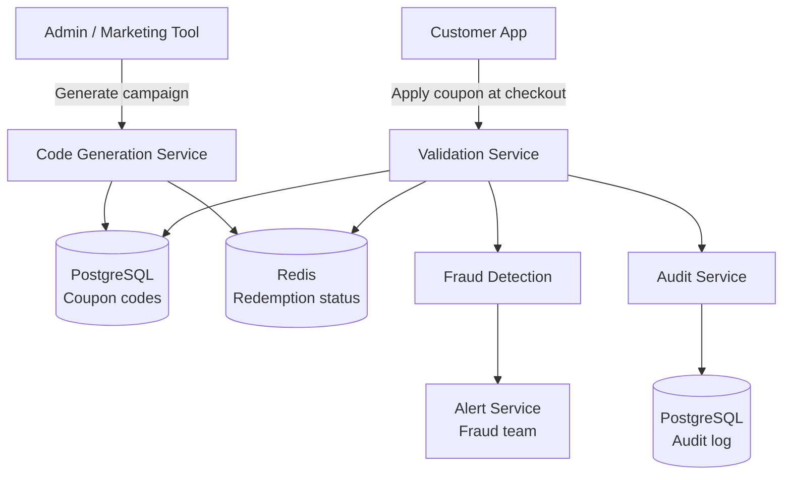

# Design an Online Coupon Distribution System

**Difficulty**: 🟡 Intermediate
**Reading Time**: ~20 minutes
**The Core Problem**: How do you generate 10M unique coupon codes, enforce single-use at scale, and prevent fraud — while handling a burst of 100k redemptions/minute during a sale?

---

## Table of Contents

1. [Requirements](#1-requirements)
2. [Capacity Estimation](#2-capacity-estimation)
3. [High-Level Architecture](#3-high-level-architecture)
4. [Code Generation](#4-code-generation)
5. [Single-Use Enforcement](#5-single-use-enforcement)
6. [Fraud Detection](#6-fraud-detection)
7. [Batch Pre-Generation](#7-batch-pre-generation)
8. [Audit Log](#8-audit-log)
9. [Key Design Decisions](#9-key-design-decisions)
10. [Interview Questions](#10-interview-questions)
11. [Key Takeaways](#11-key-takeaways)
12. [References](#12-references)

---

## 1. Requirements

### Functional
- Generate unique coupon codes (single-use and multi-use types)
- Bulk generation (10M codes for a campaign)
- Validate coupon at checkout: check validity + apply discount
- Single-use codes: each code can only be redeemed once
- Fraud prevention: detect mass redemption from single source
- Audit log: who redeemed what, when

### Non-Functional
- **Scale**: 10M unique codes per campaign, 100k redemptions/minute peak
- **Latency**: Code validation < 50ms
- **Accuracy**: Zero double-redemption of single-use codes
- **Durability**: Redemption audit log never lost

---

## 2. Capacity Estimation

| Metric | Estimate |
|--------|----------|
| Codes per campaign | 10M |
| Active campaigns | 10 (100M total codes) |
| Redemptions/day | 5M |
| Peak redemptions/min | 100k (sale start) |
| Peak redemptions/sec | 1,667 |
| Code storage | 100M × 50 bytes = **5 GB** |
| Audit log | 5M/day × 100 bytes = **500 MB/day** |
| Redis memory for active codes | 10M codes × 20 bytes = **200 MB** |

---

## 3. High-Level Architecture



---

## 4. Code Generation

### Code Format
```
Requirements for a good coupon code:
  - Human-readable and typeable (no confusing chars: 0/O, 1/I/l)
  - Random (not sequential — sequential codes are guessable)
  - Short enough for email/print (8–10 characters)
  - URL-safe (no special characters)

Character set: Base58 (like Bitcoin addresses)
  Characters: 123456789ABCDEFGHJKLMNPQRSTUVWXYZabcdefghijkmnopqrstuvwxyz
  Excludes: 0, O, I, l (confusing)
  58 chars in set

8-character code: 58^8 = 128 trillion combinations
10M codes = 10M / 128 trillion = 0.008% collision probability → negligible
```

### Code Generation Algorithm
```python
import secrets
import base58  # or custom Base58 alphabet

ALPHABET = '123456789ABCDEFGHJKLMNPQRSTUVWXYZabcdefghijkmnopqrstuvwxyz'

def generate_code(length=8):
    while True:
        # Generate random bytes, map to alphabet
        code = ''.join(secrets.choice(ALPHABET) for _ in range(length))
        # Verify uniqueness (batch check reduces DB round trips)
        return code

# Batch generation: 10M codes
codes = set()
while len(codes) < 10_000_000:
    codes.add(generate_code())

# Insert in batches of 10k using COPY for speed
# 10M inserts in batches: ~10 minutes
```

### Code Storage Schema
```sql
CREATE TABLE coupons (
  code           VARCHAR(12) PRIMARY KEY,
  campaign_id    BIGINT,
  discount_type  VARCHAR(20),    -- 'percent', 'fixed', 'free_shipping'
  discount_value NUMERIC(10,2),
  min_order_value NUMERIC(10,2) DEFAULT 0,
  max_uses       INT DEFAULT 1,  -- 1 = single use
  current_uses   INT DEFAULT 0,
  expires_at     TIMESTAMPTZ,
  created_at     TIMESTAMPTZ DEFAULT NOW()
);

CREATE TABLE coupon_redemptions (
  id          BIGSERIAL PRIMARY KEY,
  code        VARCHAR(12) REFERENCES coupons(code),
  user_id     BIGINT,
  order_id    BIGINT,
  redeemed_at TIMESTAMPTZ DEFAULT NOW(),
  ip_address  INET,
  discount_amount NUMERIC(10,2)
);

CREATE INDEX ON coupon_redemptions(user_id);
CREATE INDEX ON coupon_redemptions(code);
CREATE INDEX ON coupon_redemptions(ip_address);
```

---

## 5. Single-Use Enforcement

### Redis SET NX (Atomic)
```
At redemption time:
  SET coupon:used:{code} {user_id}:{order_id}:{timestamp} NX EX 86400

NX = "Set only if key does Not eXist"
EX = expire after 24h (safety cleanup for abandoned carts)

If SET returns OK → code not yet used → proceed to checkout
If SET returns nil → code already used → reject with "Coupon already redeemed"

After order confirmed (payment success):
  Persist to PostgreSQL coupon_redemptions
  PERSIST coupon:used:{code}  (remove TTL — make permanent)
  UPDATE coupons SET current_uses = current_uses + 1 WHERE code = ?

Race condition test:
  User A and User B both try same code simultaneously:
    A: SET coupon:used:ABC123 ... NX → OK (A wins)
    B: SET coupon:used:ABC123 ... NX → nil (B loses)
  Only A can proceed. B sees "already redeemed."
```

### Multi-Use Codes (Different approach)
```
For codes valid for first 1000 users (campaign-level limit):
  key: coupon:count:{campaign_id}
  Command: INCR coupon:count:{campaign_id}
  If returned value > 1000 → reject (limit reached)

Store in DB: UPDATE coupons SET current_uses = current_uses + 1
Consistency: Redis counter is source of truth during campaign; sync to DB async
```

---

## 6. Fraud Detection

### Signal 1: Same IP Using Many Codes
```
Redis counter:
  INCR fraud:ip:{ip_address}:redemptions:{day}
  EXPIRE fraud:ip:{ip_address}:redemptions:{day} 86400

Threshold: if counter > 5 for same IP in 1 day → flag + manual review
Extreme: if counter > 20 → auto-block IP
```

### Signal 2: Same User Redeeming Multiple Codes
```
Single-use policy: 1 coupon code per order
Brand policy: user can use 1 coupon per campaign (regardless of how many codes they have)

Check at redemption:
  SELECT COUNT(*) FROM coupon_redemptions
  WHERE user_id = ? AND campaign_id = ?
  If count > 0 → reject "Already used a coupon for this campaign"
```

### Signal 3: Rapid Code Discovery (Guessing Attack)
```
Attacker tries random codes to find valid ones:
  Rate limit per IP: 5 invalid codes per minute → auto-block for 1 hour
  Track in Redis: INCR fraud:ip:{ip}:invalid_codes with 60s TTL
  If value > 5 → add IP to Redis blocklist (SADD blocked_ips {ip}, TTL 1hr)
```

---

## 7. Batch Pre-Generation

Generating 10M codes at campaign launch is slow. Pre-generate and pool.

```
Async generation pipeline:
  1. Marketing creates campaign config (discount, expiry, count=10M)
  2. Campaign service publishes event: { campaign_id, count: 10M, ... }
  3. Code generator worker pool (10 workers × 1M codes each):
     - Generate codes in memory (Python set for dedup)
     - Bulk INSERT to PostgreSQL using COPY (2M rows/min per worker)
     - Total: 10M codes inserted in ~5 minutes
  4. Load hot subset (first 100k) to Redis SET (for fast distribution)
  5. Status: READY → campaign can launch

Code distribution:
  Email campaign: export CSV of (email, code) pairs → send via email service
  "Unlock discount" flow: claim one code → atomically pop from Redis set:
    SPOP campaign:{campaign_id}:available_codes → random available code
    Mark as assigned in DB
```

---

## 8. Audit Log

```
Every redemption attempt logged (success and failure):
{
  event_id:       UUID,
  code:           "ABC12345",
  user_id:        12345,
  order_id:       67890,
  action:         "REDEEMED" | "REJECTED_USED" | "REJECTED_EXPIRED" | "REJECTED_INVALID",
  discount_amount: 15.00,
  ip_address:     "1.2.3.4",
  user_agent:     "Mozilla/5.0...",
  timestamp:      "2024-03-15T14:30:00Z"
}

Storage: append-only table in PostgreSQL (never update, never delete)
Retention: 7 years (financial audit requirements)
Query patterns:
  - Find all uses of a code: indexed by code
  - Find all codes used by a user: indexed by user_id
  - Find suspicious IP: indexed by ip_address
```

---

## 9. Key Design Decisions

| Decision | Option A | Option B | Choice & Reason |
|----------|----------|----------|-----------------|
| Code format | Sequential numeric (1000, 1001...) | Random Base58 | **Random Base58** — sequential codes are guessable; attackers can enumerate valid codes |
| Single-use enforcement | DB row lock | Redis SET NX | **Redis SET NX** — atomic and < 1ms; DB locks at 1667/sec create contention |
| Validation | Check DB first | Check Redis first | **Redis first** — 99% cache hit for valid codes; DB fallback for cold codes or cache miss |
| Fraud check timing | Pre-validation | Post-validation | **Pre-validation** — prevent fraudulent codes from ever reaching checkout |
| Code generation timing | On-demand | Pre-generated batch | **Pre-generated** — on-demand generation at 100k/min redemptions would cause latency spikes |

---

## 10. Interview Questions

| Question | Key Answer |
|----------|-----------|
| How do you prevent two users from redeeming the same code? | Redis SET NX — atomic; only one SET succeeds; loser gets nil response |
| How do you handle the code being in cart but not yet checked out? | SET with 30min TTL (cart session); on checkout confirm → PERSIST (remove TTL) |
| How do you generate 10M unique codes quickly? | Batch generation in worker pool using secrets.choice; bulk COPY to Postgres; ~5 min |
| What if Redis is down during peak redemption? | Fallback: DB row-level lock with SELECT FOR UPDATE — 10× slower but correct |
| How do you detect coupon sharing on social media? | Spike in redemptions from diverse IPs for same code in short window → campaign review |

---

## 11. Key Takeaways

- **Redis SET NX** is the correct atomic primitive for single-use enforcement — no DB lock contention at peak load
- **Random Base58 codes** (not sequential) prevent enumeration attacks — 58^8 = 128 trillion combinations
- **Pre-generate codes** (not on-demand) — bulk generation takes 5 minutes; on-demand generation at peak creates latency
- **IP rate limiting** (5 invalid codes/minute) catches both brute-force guessing and bulk testing
- **Append-only audit log** for all redemptions — critical for fraud investigations and financial audits

---

## 📚 Resources & References

| Resource | Type | What You'll Learn |
|----------|------|------------------|
| [ByteByteGo — Unique ID Generation](https://www.youtube.com/@ByteByteGo) | 📺 YouTube | Code generation strategies and uniqueness guarantees |
| [Redis SET NX Documentation](https://redis.io/commands/setnx/) | 📚 Book | Atomic single-use enforcement patterns |
| [Stripe Coupon API](https://stripe.com/docs/api/coupons) | 📖 Blog | Industry-standard coupon system design |
| [High Scalability — Coupon Systems](https://highscalability.com) | 📖 Blog | Scale patterns for promotional code systems |
