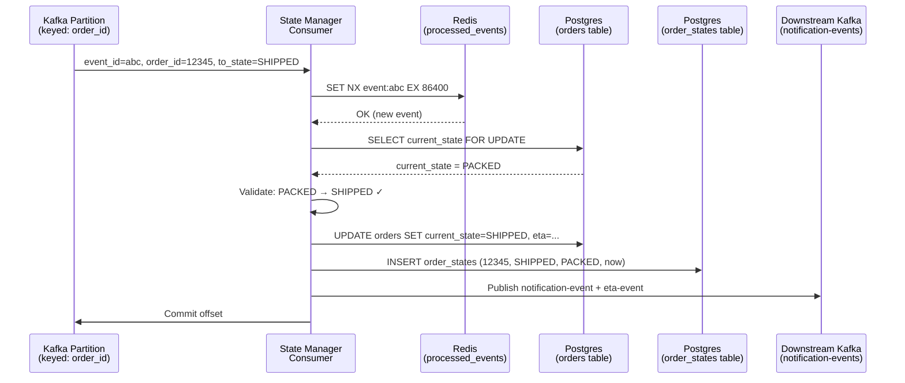
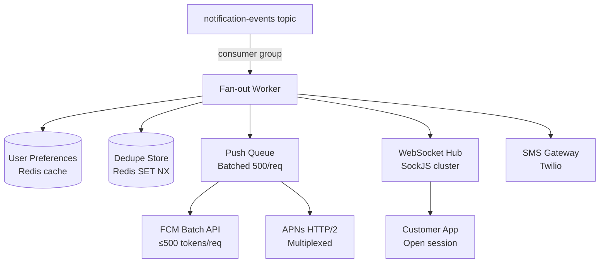
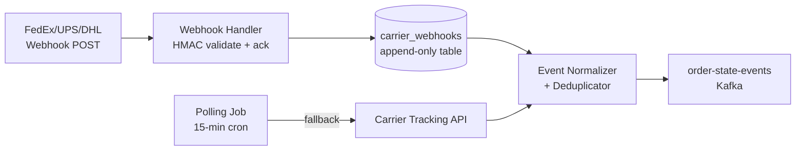

# Design an Order Tracking System

**Difficulty**: 🟡 Intermediate
**Reading Time**: ~25 minutes
**The Core Problem**: How do you track 10M orders per day across 6 states — from placement to delivery — with real-time customer notifications, logistics partner webhooks, and ML-based ETA estimation?

---

## Table of Contents

1. [Requirements](#1-requirements)
2. [Capacity Estimation](#2-capacity-estimation)
3. [High-Level Architecture](#3-high-level-architecture)
4. [Order State Machine](#4-order-state-machine)
5. [Event-Driven State Updates](#5-event-driven-state-updates)
6. [Customer Notifications](#6-customer-notifications)
7. [ETA Calculation](#7-eta-calculation)
8. [Logistics Partner Integration](#8-logistics-partner-integration)
9. [Key Design Decisions](#9-key-design-decisions)
10. [Interview Questions](#10-interview-questions)
11. [Key Takeaways](#11-key-takeaways)
12. [References](#12-references)

---

## 1. Requirements

### Functional
- Track order through states: placed → confirmed → packed → shipped → out-for-delivery → delivered
- Real-time status push to customer (push notification + in-app)
- ETA displayed and updated in real-time
- Logistics partner webhooks (FedEx, UPS) integrated for shipping events
- Order timeline history (all state transitions with timestamps)
- Support for cancellation and returns

### Non-Functional
- **Scale**: 10M orders/day = ~115 orders/sec avg; 10k orders/sec peak
- **Notification latency**: State change → customer notified < 2 seconds
- **Availability**: 99.99% (customers panic if tracking is down)
- **Durability**: Every state transition persisted, never lost

---

## 2. Capacity Estimation

| Metric | Estimate |
|--------|----------|
| Orders/day | 10M |
| State transitions/order | ~8 events avg |
| Total events/day | 80M |
| Events/sec (avg) | 925; peak: 10k/sec |
| Active orders at peak | ~500k (avg 1hr active) |
| Notification fanout | 10M/day × 3 notifications = **30M pushes/day** |
| Tracking page views/day | 50M (customers check 5× each) |
| Order state storage | 10M × 500B = **5 GB/day** |

---

## 3. High-Level Architecture

```mermaid
graph TD
    OrderSvc[Order Service] -->|order.created| Kafka[Kafka Event Bus]
    FulfillmentSvc[Fulfillment Service] -->|order.packed, order.shipped| Kafka
    LogisticsWebhook[Logistics Webhooks\nFedEx/UPS] --> WebhookHandler[Webhook Handler]
    WebhookHandler -->|order.out_for_delivery, order.delivered| Kafka
    Kafka --> StateMgr[Order State Manager\nConsumer]
    StateMgr --> StateDB[(State DB\nPostgres)]
    StateMgr --> NotifSvc[Notification Service]
    StateMgr --> ETASvc[ETA Service]
    NotifSvc --> FCM[FCM / APNs\nPush]
    NotifSvc --> WS[WebSocket\nIn-app]
    NotifSvc --> SMS[SMS Gateway]
    ETASvc --> ML[ML ETA Model]
    Customer[Customer App] -->|GET /orders/{id}/track| API[API Gateway]
    API --> StateDB
```

---

## 4. Order State Machine

```
States and valid transitions:

  PLACED ──────────────→ CONFIRMED
     |                       |
     ↓                       ↓
  CANCELLED ←────────── PACKED
                            |
                            ↓
                         SHIPPED
                            |
                            ↓
                     OUT_FOR_DELIVERY
                            |
                    ┌───────┴───────┐
                    ↓               ↓
                DELIVERED      FAILED_DELIVERY
                                    |
                                    ↓
                               RETURN_REQUESTED

Invariants (enforced in state manager):
  - Only forward transitions allowed (no SHIPPED → CONFIRMED)
  - CANCELLED only from PLACED or CONFIRMED
  - DELIVERED is terminal (no further transitions)
```

### State Storage Schema
```sql
CREATE TABLE order_states (
  order_id        BIGINT,
  state           VARCHAR(30),
  previous_state  VARCHAR(30),
  transitioned_at TIMESTAMPTZ DEFAULT NOW(),
  actor           VARCHAR(50),     -- 'system', 'fulfillment', 'fedex', 'customer'
  metadata        JSONB,           -- tracking_number, carrier, etc.
  PRIMARY KEY (order_id, transitioned_at)
);

CREATE TABLE orders (
  order_id     BIGINT PRIMARY KEY,
  customer_id  BIGINT,
  current_state VARCHAR(30),
  created_at   TIMESTAMPTZ,
  updated_at   TIMESTAMPTZ,
  eta          TIMESTAMPTZ
);

CREATE INDEX ON orders(customer_id, current_state);
CREATE INDEX ON order_states(order_id);
```

---

## 5. Event-Driven State Updates

### Kafka Event Flow
```
Each state change published as event:
{
  "event_type": "order.state_changed",
  "order_id": 12345,
  "from_state": "PACKED",
  "to_state": "SHIPPED",
  "tracking_number": "1Z999AA10123456784",
  "carrier": "UPS",
  "timestamp": "2024-03-15T14:30:00Z",
  "actor": "fulfillment_service"
}

Topic: order-state-events
Partitions: keyed by order_id (all events for same order → same partition = ordered)

Consumers:
  - state-manager: validates transition, persists, updates orders.current_state
  - notification-service: triggers push/SMS/email
  - eta-service: recomputes ETA based on new state
  - analytics-service: updates funnel metrics
```

### Idempotency
```
At-least-once delivery means duplicate events possible.
Guard: each event has event_id (UUID).
State manager: INSERT INTO processed_events (event_id) ON CONFLICT DO NOTHING
If INSERT succeeds: process event
If INSERT fails (duplicate): skip, already processed
```

---

## 6. Customer Notifications

### Notification Rules
```
CONFIRMED: "Your order has been confirmed! 🎉"
PACKED: "Your order is packed and ready for pickup"
SHIPPED: "Your order is on its way! Tracking: {tracking_number}"
OUT_FOR_DELIVERY: "Your delivery is arriving today! ETA: {eta_window}"
DELIVERED: "Your order has been delivered. Enjoy! ⭐ Rate your experience"
FAILED_DELIVERY: "Delivery attempted. We'll retry tomorrow or you can reschedule."
```

### Notification Channels
```
Priority 1 — Push notification (FCM/APNs): < 1s delivery
Priority 2 — In-app WebSocket: for app-open customers, real-time banner
Priority 3 — SMS: for SHIPPED and DELIVERED (high-importance milestones)
Priority 4 — Email: for SHIPPED (with tracking link)

User preferences respected:
  - Opt-out of SMS (but push always sent)
  - Quiet hours (no push 10pm–8am except DELIVERED)
```

### Push Notification Volume Management
```
10M orders × 4 avg notifications = 40M pushes/day
Peak: 500k pushes in 1 hour

Architecture: Fan-out service
  - Batch pushes to FCM in groups of 500 (FCM batch API)
  - Deduplicate: don't send same state to same user twice
  - Rate limit: 1 push per order per state change (no re-sends for retries)
```

---

## 7. ETA Calculation

### Heuristic ETA (simple, fast)
```
State: PLACED → ETA = ordered_at + sla_by_category
  Electronics: +2 days
  Grocery: +2 hours
  Same-day: +4 hours

State: SHIPPED → ETA = ship_date + carrier_transit_days
  FedEx express: ship_date + 1 day
  Standard: ship_date + 3-5 days

State: OUT_FOR_DELIVERY → ETA = current_time + avg_stops_remaining × avg_time_per_stop
  avg_time_per_stop: 4 minutes (metro) / 8 minutes (suburban)
```

### ML ETA Model (more accurate)
```
Features:
  - Distance to delivery address
  - Current rider/driver position and speed
  - Time of day (traffic proxy)
  - Weather (rain adds 20% to ETA)
  - Historical delivery time for this zip code + time of day

Model: Gradient boosted trees (LightGBM)
  P50 ETA accuracy: ±5 minutes
  P90 ETA accuracy: ±12 minutes

ETA update trigger:
  - Every state change
  - Every 5 minutes during OUT_FOR_DELIVERY
  - On GPS position update (significant deviation)
```

---

## 8. Logistics Partner Integration

### Inbound Webhooks (FedEx, UPS → Our System)
```
FedEx sends webhook to: POST /webhooks/fedex
Payload: tracking_number, event_type, timestamp, location

Webhook Handler:
  1. Validate HMAC signature (FedEx signs payload with shared secret)
  2. Map FedEx event → our internal state:
       FedEx "DELIVERED" → order.DELIVERED
       FedEx "OUT_FOR_DELIVERY" → order.OUT_FOR_DELIVERY
  3. Lookup order_id by tracking_number
  4. Publish state change event to Kafka

Reliability:
  - FedEx expects 200 response within 5s (or retry)
  - Acknowledge immediately, process async via Kafka
  - Idempotent handler (same tracking event replayed = no duplicate state change)
```

### Outbound Polling (fallback for partners without webhooks)
```
Poll FedEx tracking API every 15 minutes for orders in SHIPPED state:
  GET https://api.fedex.com/track/v1/trackingnumbers?trackingNumbers={numbers}
  Batch: 30 tracking numbers per request
  Compare latest status with stored state → trigger state change if different
```

---

## 9. Key Design Decisions

| Decision | Option A | Option B | Choice & Reason |
|----------|----------|----------|-----------------|
| Customer status delivery | Push (server→client) | Poll (client→server) | **Push** — customers check every 30s if polling; push reduces server load 10× |
| State storage | Event sourcing (full history) | Latest state only | **Both** — `orders` table for latest state (fast reads); `order_states` for full history (audit) |
| ETA model | Static rules | ML model | **ML for OUT_FOR_DELIVERY** where accuracy matters most; static rules for earlier states |
| Logistics integration | Webhooks | Polling | **Webhooks primary** + polling fallback — webhooks for real-time, polling for reliability |
| Notification channel | Push only | Multi-channel (push+SMS+email) | **Multi-channel** — DELIVERED via SMS ensures delivery even if app is uninstalled |

---

## 10. Interview Questions

| Question | Key Answer |
|----------|-----------|
| How do you prevent duplicate notifications on retry? | Idempotency key: state + order_id; SET NX in Redis before sending |
| What if Kafka consumer falls behind (lag)? | Scale consumer group; reduce notification to most recent state only (skip intermediate) |
| How do you handle wrong delivery status from carrier? | Dispute state: carrier says DELIVERED, customer says not received → dispute workflow, don't auto-close |
| How do you scale notification service for peak? | Fan-out to FCM batches; 500 per batch; horizontal scale notification workers |
| How does order tracking page work at 50M views/day? | Cache latest state in Redis with 10s TTL; 99% cache hits; only state changes invalidate |

---

## 11. Key Takeaways

- **State machine with explicit valid transitions** prevents corrupt states — enforce in state manager, not application code
- **Kafka keyed by order_id** guarantees ordered state transitions per order — prevents out-of-order processing
- **Push notifications (not polling)** reduce infrastructure load by 10× — 50M tracking page views become 40M pushes/day
- **Idempotency on webhook processing** handles carrier retries gracefully — same event replayed must not cause duplicate state changes
- **Dual storage**: latest state in `orders` table (fast reads) + full history in `order_states` (audit, debugging)

---

---

## Component Deep Dive 1: Order State Manager

The **Order State Manager** is the central nervous system of the entire tracking platform. It is the single component responsible for accepting raw events (from Kafka), validating legal state transitions, persisting the new state atomically, and then fan-outing downstream consequences — notifications, ETA recalculation, analytics.

### Why Naive Approaches Fail at Scale

A simple REST handler per state change looks appealing at first. An upstream service calls `POST /orders/{id}/state` with `{ "new_state": "SHIPPED" }`, and the handler updates the database. The problem surfaces quickly:

1. **Race conditions at 10k events/sec**: Two events arrive simultaneously for the same order — `PACKED` and `SHIPPED`. Both pass the validation check (reading `CONFIRMED` as the current state), and both write, leaving the order in an inconsistent history.
2. **Downstream fan-out blocks the handler**: The handler cannot return until notifications and ETA calls complete. Carrier webhook timeouts (FedEx expects 200 in 5s) kill the handler before it finishes.
3. **No replay on failure**: If the notification service crashes mid-flight, there is no record that notifications were not sent. The state was already written.

Kafka with consumer groups solves all three: ordering is guaranteed per partition (keyed by `order_id`), the Kafka consumer is decoupled from downstream fan-out, and failed consumers can replay from the committed offset.

### Internal Mechanics



The `SELECT ... FOR UPDATE` row lock ensures only one consumer processes any given order at a time. Since all events for the same `order_id` land on the same Kafka partition, consumers within a group never race on the same order.

### Implementation Option Trade-offs

| Approach | Latency (p99) | Throughput | Trade-off |
|----------|---------------|------------|-----------|
| Synchronous REST + DB update | 80–200 ms | 2k req/sec per pod | Simple but blocks on downstream fan-out; carrier webhook timeout risk |
| Kafka consumer + optimistic locking | 50–100 ms | 15k events/sec per partition | Requires idempotency layer; replay complexity on rebalance |
| Kafka consumer + pessimistic locking (SELECT FOR UPDATE) | 60–120 ms | 8k events/sec per partition | Strongest consistency; lock contention at very high per-order update rates |

For most order tracking workloads, **Kafka + pessimistic locking** wins: order-level contention is rare (one order rarely gets two simultaneous updates), and the correctness guarantee is worth the slight throughput reduction.

---

## Component Deep Dive 2: Real-Time Customer Notification Service

The Notification Service consumes events from a dedicated `notification-events` Kafka topic (published by the State Manager) and fans out to FCM/APNs (push), WebSocket (in-app), SMS (Twilio/SNS), and email (SES). The design challenge is delivering 40M pushes/day with sub-2-second end-to-end latency while respecting user preferences, deduplicating retries, and not overwhelming carrier gateways.

### Internal Mechanics

Notifications arrive from Kafka already enriched with the final desired state. The service does not re-read the database — the Kafka event contains all fields needed to construct the message. This keeps the notification path stateless and horizontally scalable.



**Scale Behavior at 10x Load (100M orders/day):** The bottleneck shifts to the WebSocket Hub. At baseline (10M orders/day), a cluster of 10 WebSocket pods handles ~5k concurrent connections each. At 10x, 500k concurrent active customers require 50 pods or a move to a managed WebSocket service (Ably, Pusher, or AWS API Gateway WebSocket). FCM's batch API handles 500 tokens per HTTP call, so batching workers naturally absorb 10x by scaling horizontally without architectural change.

**Deduplication Pattern:**

```
Key:  notif:{order_id}:{state}
TTL:  3600 seconds
Logic: SET NX → proceed; if key exists → skip (already sent for this state)
```

This ensures that even if the Kafka consumer retries an event (at-least-once), the customer receives the push exactly once per state transition.

| Channel | p50 Latency | p99 Latency | Rate Limit |
|---------|-------------|-------------|------------|
| FCM Push (batch) | 300 ms | 800 ms | 600k tokens/min per project |
| APNs HTTP/2 | 200 ms | 600 ms | 300 req/sec per connection |
| WebSocket (in-app) | 50 ms | 150 ms | Limited by pod connection count |
| SMS (Twilio) | 800 ms | 3 s | Tier-based; 100 msg/sec per account |

---

## Component Deep Dive 3: Logistics Partner Webhook Handler

The Webhook Handler is the trust boundary between external carriers (FedEx, UPS, DHL) and internal systems. It is the most reliability-critical component in the shipping portion of the lifecycle — a missed `DELIVERED` event means a customer never receives a delivery confirmation, and a duplicated event means a false second delivery notification.

### Technical Decisions

**Immediate 200 with async processing.** Carriers retry webhooks if they do not receive a 200 within 5 seconds. The handler must acknowledge instantly and process asynchronously. The pattern is:

1. Validate HMAC-SHA256 signature (shared secret per carrier).
2. Write raw payload to a `carrier_webhooks` table (append-only, never deduplicated here).
3. Return HTTP 200.
4. A background processor reads from `carrier_webhooks`, applies deduplication by `(carrier, tracking_number, event_type, event_timestamp)`, and publishes to Kafka.

**Carrier event normalization** is non-trivial. FedEx uses `"DL"` for delivered; UPS uses `"D"`; DHL uses `"DELIVERED"`. A normalization layer maps all three to `DELIVERED`. Missed mappings silently drop real state changes, so the mapping table must be tested against each carrier's full event catalogue and reviewed when carriers publish API changelog notices.

**Polling fallback** runs on a separate schedule (every 15 minutes) for carriers that do not support webhooks and for orders where the webhook was never received (detectable by comparing expected state transition times against current time with a configurable SLA threshold).



---

## Data Model

The full data model spans four tables and two Redis structures:

```sql
-- Current state of every order (hot read path)
CREATE TABLE orders (
    order_id         BIGINT          PRIMARY KEY,
    customer_id      BIGINT          NOT NULL,
    merchant_id      BIGINT          NOT NULL,
    current_state    VARCHAR(30)     NOT NULL DEFAULT 'PLACED',
    tracking_number  VARCHAR(100),
    carrier          VARCHAR(20),    -- 'FEDEX', 'UPS', 'DHL', 'INTERNAL'
    created_at       TIMESTAMPTZ     NOT NULL DEFAULT NOW(),
    updated_at       TIMESTAMPTZ     NOT NULL DEFAULT NOW(),
    eta              TIMESTAMPTZ,
    delivery_address JSONB           NOT NULL,
    -- e.g. {"street":"123 Main","city":"Austin","zip":"78701","lat":30.26,"lng":-97.74}
    item_count       INT             NOT NULL,
    order_total_usd  NUMERIC(10,2)   NOT NULL
);

CREATE INDEX idx_orders_customer_state ON orders (customer_id, current_state);
CREATE INDEX idx_orders_tracking       ON orders (tracking_number) WHERE tracking_number IS NOT NULL;
CREATE INDEX idx_orders_updated_at     ON orders (updated_at);  -- for lag monitoring

-- Full audit trail of every state transition
CREATE TABLE order_states (
    id               BIGSERIAL       PRIMARY KEY,
    order_id         BIGINT          NOT NULL REFERENCES orders(order_id),
    from_state       VARCHAR(30),    -- NULL for initial PLACED
    to_state         VARCHAR(30)     NOT NULL,
    transitioned_at  TIMESTAMPTZ     NOT NULL DEFAULT NOW(),
    actor            VARCHAR(50)     NOT NULL,  -- 'customer', 'merchant', 'fedex', 'system'
    event_id         UUID            NOT NULL UNIQUE,  -- Kafka event_id for idempotency
    metadata         JSONB           -- carrier scan location, rejection reason, etc.
);

CREATE INDEX idx_order_states_order_id ON order_states (order_id, transitioned_at DESC);

-- Raw inbound carrier webhook payloads (never deduplicated at write time)
CREATE TABLE carrier_webhooks (
    id               BIGSERIAL       PRIMARY KEY,
    carrier          VARCHAR(20)     NOT NULL,
    tracking_number  VARCHAR(100)    NOT NULL,
    raw_payload      JSONB           NOT NULL,
    received_at      TIMESTAMPTZ     NOT NULL DEFAULT NOW(),
    processed        BOOLEAN         NOT NULL DEFAULT FALSE,
    processed_at     TIMESTAMPTZ,
    error_message    TEXT
);

CREATE INDEX idx_carrier_webhooks_unprocessed ON carrier_webhooks (processed, received_at)
    WHERE processed = FALSE;

-- Idempotency guard for Kafka event processing
CREATE TABLE processed_events (
    event_id         UUID            PRIMARY KEY,
    processed_at     TIMESTAMPTZ     NOT NULL DEFAULT NOW()
);
-- Partition by month; retain 90 days
```

```
-- Redis structures

-- Latest order state cache (read-through, 10s TTL)
Key:   order:state:{order_id}
Value: JSON { current_state, eta, tracking_number, updated_at }
TTL:   10 seconds (invalidated on state change)

-- Notification deduplication
Key:   notif:{order_id}:{state}
Value: "1"
TTL:   3600 seconds
```

---

## Scale Bottlenecks

| Traffic Level | Component That Breaks | Symptoms | Mitigation |
|---------------|----------------------|----------|------------|
| 10x baseline (100k orders/sec peak) | Postgres `orders` write throughput | UPDATE latency spikes above 200 ms; replication lag grows | Partition `orders` table by `order_id % 16`; route writes by partition key; add read replicas for tracking page reads |
| 100x baseline (1M orders/sec peak) | Kafka partition throughput per `order_id` | Single hot partition for high-volume merchant; consumer lag grows | Increase partition count to 512; use composite key `{merchant_id}:{order_id}` to spread load; ensure consumers scale 1:1 with partitions |
| 100x baseline (notification fan-out) | FCM / APNs rate limits | Pushes delayed; 429s from FCM; notification latency exceeds 2s SLA | Shard notification workers by carrier (FCM vs APNs); queue with priority (OUT_FOR_DELIVERY > CONFIRMED); exponential backoff with jitter |
| 1000x baseline (extreme peak, e.g., flash sale) | Redis notification dedupe store | Memory exhaustion; key eviction causes duplicate pushes | Switch from single Redis to Redis Cluster (16 slots); set `maxmemory-policy allkeys-lru` only as last resort; pre-warm capacity |
| 1000x baseline | Carrier webhook handler | FedEx retry storm on slow acks; 5s timeout exceeded | Horizontally scale webhook handler pods behind a load balancer; move `carrier_webhooks` write to a dedicated Postgres instance; use pgBouncer for connection pooling |

---

## How Uber Eats Built This

Uber Eats published their order tracking architecture in a 2019 engineering blog post ("How Uber Eats Manages the Complexity of Real-Time Order Tracking"). The system tracks approximately **17 million order-related events per day** across their global marketplace, with delivery time estimation updated every **5 seconds** during the active delivery phase.

**Technology choices:**
- **Apache Kafka** as the central event bus, with topics partitioned by `order_uuid` to enforce per-order event ordering across the entire pipeline.
- **Cadence** (Uber's open-source workflow orchestration engine, now Temporal) for long-running order workflows that need to survive process crashes — a delivery can span 30–60 minutes, far too long for a stateless handler.
- **Go microservices** for the state manager and notification dispatch, chosen for low GC pause latency under high concurrency.
- **Redis** for real-time ETA broadcast to the customer app — the ETA is written to Redis every time the driver location updates (every 4 seconds), and the customer app polls with a 5-second interval, meaning the displayed ETA is never more than 9 seconds stale.

**Non-obvious architectural decision:** Uber Eats does not use WebSockets for ETA updates. Despite WebSockets being the standard "real-time" answer, they found that **short-poll (every 5 seconds)** on a Redis-cached ETA was operationally simpler, more resilient to mobile network reconnects, and produced lower infrastructure cost than maintaining persistent WebSocket connections for millions of concurrent delivery sessions. Push notifications are reserved only for major state transitions (order confirmed, picked up, delivered), not for ETA ticks.

At peak, the system sustains **50,000 simultaneous active deliveries**, each generating 4-second GPS updates — approximately **12,500 location writes/sec** into Redis.

Source: [Uber Engineering Blog — Uber Eats Order Tracking](https://eng.uber.com/uber-eats-order-tracking/)

---

## Interview Angle

**What the interviewer is testing:** Whether you can design a correct state machine under concurrent event delivery while also handling the operational realities of third-party carrier integrations (unreliable webhooks, duplicate events, normalization inconsistencies).

**Common mistakes candidates make:**

1. **Designing the state machine without enforcing valid transitions in a single place.** Candidates often sketch states and arrows but leave validation distributed across multiple services. When `FulfillmentService` and `LogisticsWebhookHandler` both write directly to the `orders` table, a race between a `SHIPPED` event and a webhook `DELIVERED` event can produce an invalid `CONFIRMED → DELIVERED` jump. All transition validation must live in one stateful gatekeeper — the State Manager — that holds the row lock.

2. **Forgetting at-least-once Kafka delivery.** Candidates say "Kafka publishes the event once so I don't need deduplication." Kafka's at-least-once guarantee means the consumer can receive the same event more than once, especially after a rebalance or consumer restart. Without a `processed_events` idempotency table, a customer gets two "Your order has been delivered" pushes.

3. **Proposing WebSockets as the only real-time channel without addressing mobile network reliability.** WebSocket connections drop on every network handoff (4G to WiFi, app backgrounding). Without a reconnect-and-replay mechanism, customers miss state transitions while disconnected. The correct answer is: WebSocket for instant delivery when connected + push notification as a guaranteed fallback that works even when the app is closed.

**The insight that separates good from great answers:** The best candidates recognize that "real-time" for a customer is actually a **tiered problem**. The OUT_FOR_DELIVERY → DELIVERED transition has a fundamentally different latency requirement (customer is waiting by the door, every second matters) than PLACED → CONFIRMED (customer will check in 10 minutes). Great answers propose tiered notification priority — DELIVERED and OUT_FOR_DELIVERY events bypass any batching or quiet-hours rules and are sent immediately, while lower-priority state changes can tolerate a 5–10 second batch window to reduce FCM API call volume.

---

## Key Numbers to Remember

| Metric | Value | Context |
|--------|-------|---------|
| Peak order events/sec | 10,000 | Black Friday peak for a 10M orders/day platform |
| Kafka partitions for order-state-events | 128–256 | One consumer thread per partition; tune for peak throughput |
| State transition p99 latency (Kafka path) | 80–150 ms | Event published → `orders.current_state` updated |
| Notification delivery p99 (push) | < 2 seconds | End-to-end: state change → FCM → device |
| Redis cache TTL for order state | 10 seconds | Balances freshness vs. DB read reduction; 99%+ cache hit rate at 50M views/day |
| FCM batch size | 500 tokens/request | Google's documented maximum for the legacy and HTTP v1 batch endpoint |
| Carrier webhook timeout | 5 seconds | FedEx/UPS retry if no 200 within 5s; always ack immediately, process async |
| ETA update frequency (OUT_FOR_DELIVERY) | Every 5 seconds | Uber Eats polling interval; balances freshness and Redis write cost |
| Uber Eats concurrent active deliveries at peak | 50,000 | ~12,500 GPS location writes/sec into Redis |
| Notification deduplication TTL | 3,600 seconds | One notification per order per state; TTL covers the order's active window |

---

## 📚 Resources & References

| Resource | Type | What You'll Learn |
|----------|------|------------------|
| [Uber Eats Order Tracking](https://eng.uber.com/uber-eats-order-tracking/) | 📖 Blog | Real-time order state and rider tracking at Uber |
| [ByteByteGo — Notification System](https://www.youtube.com/@ByteByteGo) | 📺 YouTube | Push notification architecture and fan-out |
| [AWS EventBridge — Event-Driven Architecture](https://aws.amazon.com/blogs/architecture/) | 📖 Blog | Webhook integration and event routing patterns |
| [Designing Data-Intensive Applications — Kleppmann](https://dataintensive.net/) | 📚 Book | Event sourcing and state machine patterns |
