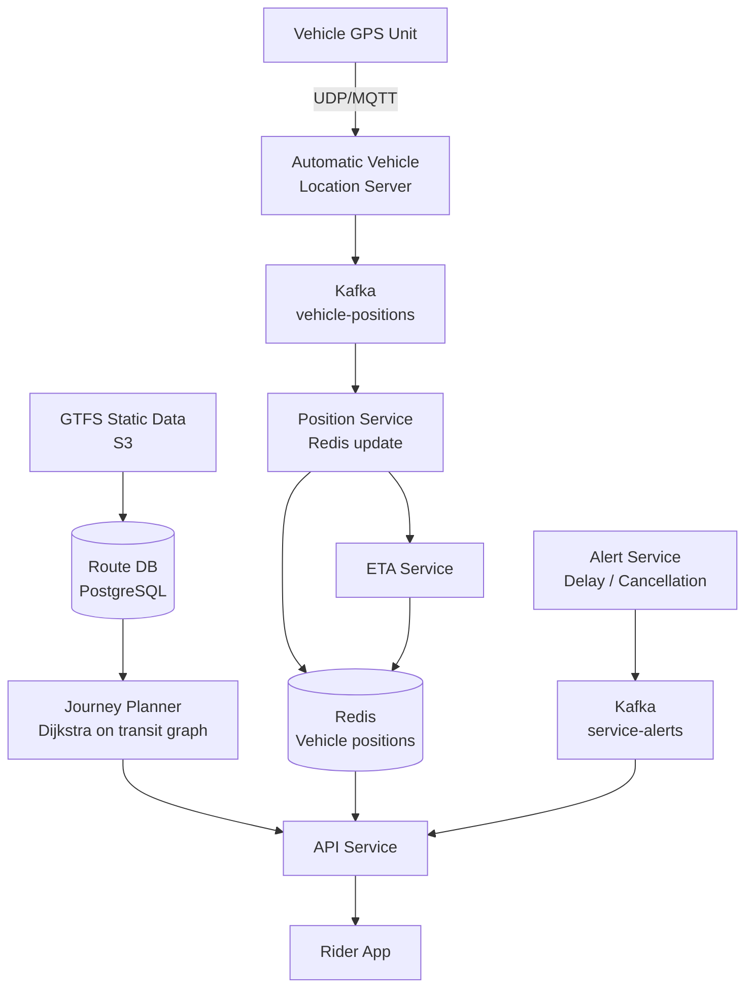

# Design a Real-Time Public Transportation System

**Difficulty**: 🟡 Intermediate
**Reading Time**: ~25 minutes
**The Core Problem**: How do you provide real-time bus/train positions and accurate ETAs to 1M daily riders, combining live GPS data from 10k vehicles with static schedule data — at < 200ms response latency?

---

## Table of Contents

1. [Requirements](#1-requirements)
2. [Capacity Estimation](#2-capacity-estimation)
3. [High-Level Architecture](#3-high-level-architecture)
4. [Vehicle GPS Pipeline](#4-vehicle-gps-pipeline)
5. [ETA Calculation](#5-eta-calculation)
6. [Journey Planner](#6-journey-planner)
7. [GTFS Data Model](#7-gtfs-data-model)
8. [Real-Time Updates Feed](#8-real-time-updates-feed)
9. [Key Design Decisions](#9-key-design-decisions)
10. [Interview Questions](#10-interview-questions)
11. [Key Takeaways](#11-key-takeaways)
12. [References](#12-references)

---

## 1. Requirements

### Functional
- Real-time vehicle position on map (bus/train)
- ETA for next vehicle at each stop
- Journey planner: A to B (multiple modes, transfers)
- Service alerts (delays, cancellations)
- Offline schedule (basic, no live data)

### Non-Functional
- **Scale**: 10k vehicles, 50k stops, 1M daily riders
- **GPS update rate**: Every 30 seconds per vehicle
- **ETA accuracy**: P50 within 1 minute; P90 within 3 minutes
- **Rider query latency**: < 200ms for stop departure times

---

## 2. Capacity Estimation

| Metric | Estimate |
|--------|----------|
| Vehicles | 10k (buses + trains) |
| GPS updates/sec | 10k / 30s = **333 GPS events/sec** |
| Stops | 50k |
| Rider queries/sec | 1M users × 10 queries/day / 86400 = **115 QPS avg, 1k QPS peak** |
| Real-time position data | 10k × 200 bytes = **2 MB snapshot** (tiny, fits in RAM) |
| GTFS static data | ~500 MB (all routes, stops, schedules) |
| ETA computations/sec | 1k QPS × avg 5 stops in journey = **5k ETA computations/sec** |

---

## 3. High-Level Architecture



---

## 4. Vehicle GPS Pipeline

### GPS Data Ingestion
```
Vehicle GPS units transmit position every 30 seconds:
  Protocol: MQTT (over cellular — reliable, low bandwidth)
  Payload: { vehicle_id, lat, lon, speed, heading, timestamp, route_id, trip_id }

AVL (Automatic Vehicle Location) Server:
  - Receives MQTT messages from all vehicles
  - Validates: timestamp freshness (< 2 min old), lat/lon range
  - Publishes to Kafka topic: vehicle-positions

Position Service (Kafka consumer):
  For each GPS event:
    1. Update Redis: HSET vehicle:{vehicle_id} lat lon speed heading trip_id ts
    2. Map-match: snap GPS coordinate to nearest road/track segment
    3. Determine next stops based on current position on route
    4. Trigger ETA recalculation for affected stops
```

### Map Matching
```
GPS readings have 5–15m error. Must snap to route geometry:
  Algorithm: Hidden Markov Model (HMM) on road network
    - States: candidate road segments near GPS point
    - Transitions: vehicle movement probability between segments
    - Best path through segments = map-matched route

Simpler for trains: fixed track, snap to nearest track segment
Buses: full HMM or simple nearest-road segment snapping

Library: Valhalla (open-source, used by Mapbox)
Latency: < 50ms per vehicle position
```

---

## 5. ETA Calculation

### Schedule-Based ETA (simple, always available)
```
From GTFS: each trip has scheduled arrival times per stop
Scheduled ETA = scheduled_arrival - now

Adjustment: use vehicle's current delay (computed from last scan)
  current_delay = actual_departure_from_prev_stop - scheduled_departure
  adjusted_ETA = scheduled_ETA + current_delay

Accuracy: P50 within 2 minutes; poor in high-traffic situations
```

### Real-Time ETA (better, requires vehicle data)
```
Given vehicle position on route:
  1. Compute distance to next stop along route geometry
  2. Estimate travel time: distance / historical_speed_for_segment_at_this_time
  3. Sum travel times for each remaining stop

Historical speed dataset:
  speed_by_segment_hour:
    { route_id, segment_id, hour_of_week, avg_speed_kmh, p90_speed_kmh }

  Populated from historical GPS traces (millions of trips)
  Updated weekly with rolling window

ETA confidence:
  If vehicle just left prev stop: ETA accuracy ±30s
  If vehicle is 500m away: ETA accuracy ±1min
  If vehicle is 5km away: ETA accuracy ±3min
```

---

## 6. Journey Planner

### Transit Graph Model
```
Graph nodes: stops
Graph edges: transit legs (stop A to stop B via route X, departs at time T)

Edge weight options:
  - Travel time only (minimize time)
  - Time + transfer penalty (minimize transfers)
  - Time + walking distance (minimize walking)

Algorithm: RAPTOR (Round-based Public Transit Routing)
  - Industry standard for multi-modal transit routing
  - O(K × stops) per query where K = max transfers
  - Faster than Dijkstra on transit graphs (transit-specific optimizations)

Alternative for smaller cities: Time-Dependent Dijkstra
  - Each edge departure time matters (miss a bus = next bus is the edge)
  - Correct but slower than RAPTOR for large networks
```

### Journey Query Example
```
Request: From "Central Station" to "Airport Terminal 2" departing now

RAPTOR answer:
  Option 1: Walk 5min → Bus 23 (departs 14:32, arrives 15:05) → Transfer → Train 7 (departs 15:10, arrives 15:22). Total: 50min, 1 transfer.
  Option 2: Bus 45 (departs 14:35, arrives 15:25). Total: 50min, 0 transfers.
  Option 3: Walk to taxi...

Each option shows: departure time, real-time delay incorporated, platform, fare
```

---

## 7. GTFS Data Model

GTFS (General Transit Feed Specification) is the industry standard.

```
Core GTFS files (static):
  agency.txt        — Transit agency info
  routes.txt        — Routes (Bus 23, Train Line 7)
  trips.txt         — Specific trip runs (Route 23, Monday 14:32 departure)
  stop_times.txt    — Arrival/departure times per stop per trip
  stops.txt         — Stop locations (lat/lon, name, accessibility)
  calendar.txt      — Service days (weekday/weekend/holiday)
  shapes.txt        — Route geometry (polyline)

GTFS Realtime (protobuf):
  TripUpdate:       Delay information per trip per stop
  VehiclePosition:  Real-time vehicle lat/lon
  Alert:            Service disruptions

Update frequency:
  Static GTFS: updated weekly (schedule changes)
  Realtime: updated every 30 seconds
```

---

## 8. Real-Time Updates Feed

### Service Alerts Pipeline
```
Alert creation:
  Operations center manually creates alert OR
  Automated detection: trip deviation > 10 min → auto-generate delay alert

Alert schema:
  { alert_id, effect: DELAY|CANCELLATION|DETOUR, route_id, trip_id,
    header_text, description, active_period: { start, end } }

Distribution:
  Kafka topic: service-alerts → API Service → Push notification to affected riders
  Affected riders = anyone with active journey involving this route in next 30min
  Push via FCM: "Bus 23 delayed 15min due to road closure"
```

### Push Notification Targeting
```
Proactive alerts (don't wait for user to open app):
  1. User saves "Home → Work" route (favorites)
  2. Each morning, system checks for delays on saved routes
  3. If delay > 5min → send push notification 30min before planned departure
  4. "Your usual Bus 23 is delayed. Leave 15min earlier."

Opt-in only; max 2 pushes per user per morning
```

---

## 9. Key Design Decisions

| Decision | Option A | Option B | Choice & Reason |
|----------|----------|----------|-----------------|
| ETA calculation | Schedule + delay offset | ML model on GPS traces | **Historical speed + current position** — better than pure schedule; ML adds complexity without proportional accuracy gain |
| Route planning algorithm | Dijkstra | RAPTOR | **RAPTOR** — 10× faster than Dijkstra for public transit with transfers; industry standard |
| Vehicle position storage | Redis | PostgreSQL | **Redis** — 2MB position snapshot for 10k vehicles; sub-ms reads for ETA computation |
| GTFS data model | Custom | GTFS standard | **GTFS** — universal standard; integrates with Google Maps, Apple Maps, Transit app automatically |
| Transfer penalty | None | Fixed 5min | **Fixed 5min** — users generally prefer fewer transfers even at cost of extra time; makes option A (0 transfers) preferable |

---

## 10. Interview Questions

| Question | Key Answer |
|----------|-----------|
| How do you handle GPS dropout (vehicle loses signal)? | Last known position + dead reckoning (speed × time); mark vehicle as "signal lost" after 2 minutes |
| How do you update static GTFS data without downtime? | Blue-green: load new GTFS into standby DB, switch routing service atomically after validation |
| How does journey planner handle real-time delays? | RAPTOR uses adjusted departure times (schedule + current delay) as edge weights |
| How do you serve 1M riders at < 200ms? | Redis for vehicle positions (< 1ms); route DB indexed by stop_id; RAPTOR pre-computed on popular pairs |
| What if a bus skips a stop? | Alert generated; passengers at that stop notified; trip marked as cancelled for that stop |

---

## 11. Key Takeaways

- **GTFS is the universal data standard** — using it means automatic integration with Apple Maps, Google Maps, and 3rd-party transit apps
- **Redis for real-time vehicle positions** — 2MB snapshot for 10k vehicles, sub-ms access for ETA computation
- **RAPTOR outperforms Dijkstra** for multi-modal transit routing with transfers — design choice affects query latency by 10×
- **Historical speed by segment × time of day** is the practical ETA model — pure schedule has P50 error of ±2min; historical speed reduces to ±1min
- **Proactive delay push notifications** (not just reactive) are the highest-value rider feature — know before you leave home

---

## 📚 Resources & References

| Resource | Type | What You'll Learn |
|----------|------|------------------|
| [GTFS Realtime Specification](https://gtfs.org/documentation/realtime/reference/) | 📚 Book | Industry standard transit data format |
| [ByteByteGo — Location-Based Services](https://www.youtube.com/@ByteByteGo) | 📺 YouTube | GPS data pipeline and proximity services |
| [RAPTOR Algorithm Paper](https://www.microsoft.com/en-us/research/publication/raptor-round-based-public-transit-routing/) | 📖 Blog | RAPTOR multi-modal transit routing algorithm |
| [Valhalla Open-Source Routing](https://github.com/valhalla/valhalla) | 📚 Book | Map matching and route geometry handling |
