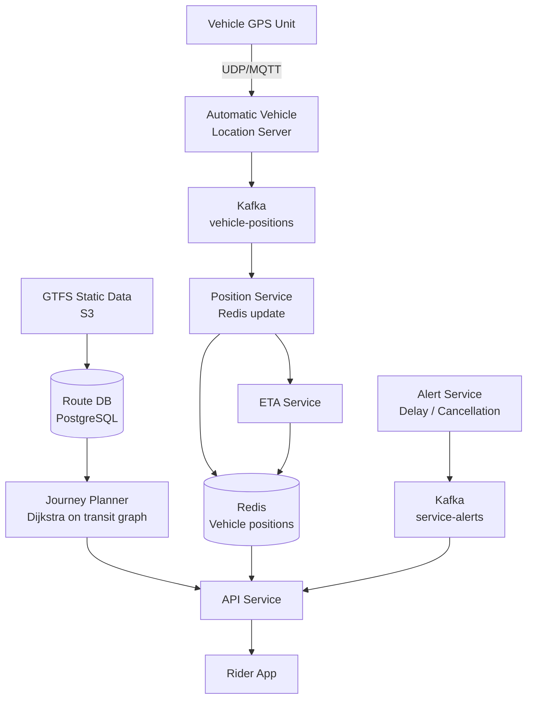
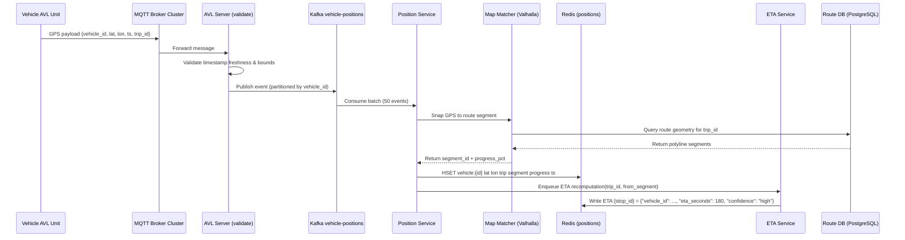
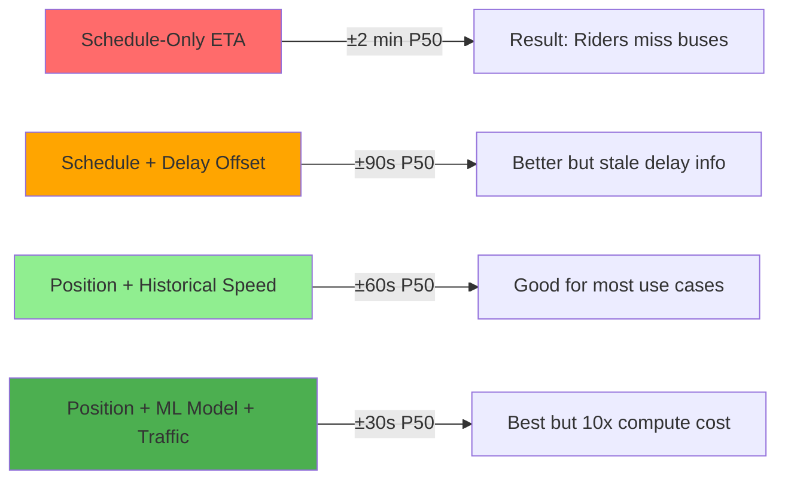
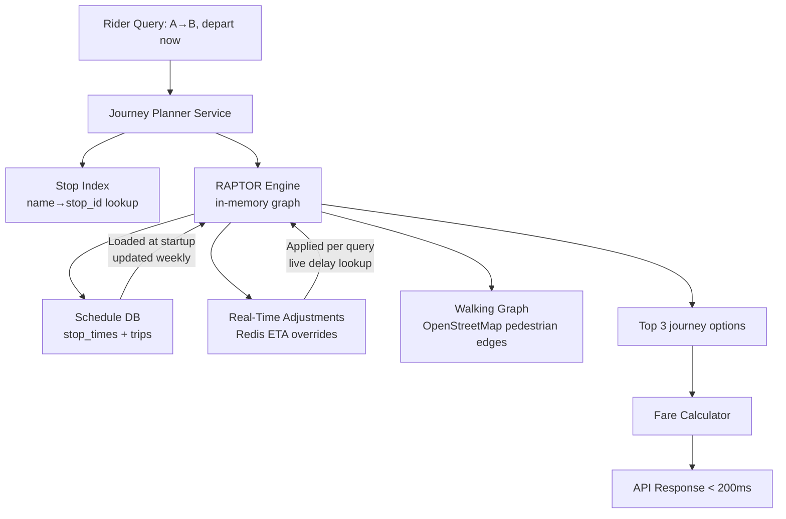

# Design a Real-Time Public Transportation System

**Difficulty**: 🟡 Intermediate
**Reading Time**: ~25 minutes
**The Core Problem**: How do you provide real-time bus/train positions and accurate ETAs to 1M daily riders, combining live GPS data from 10k vehicles with static schedule data — at < 200ms response latency?

---

## Table of Contents

1. [Requirements](#1-requirements)
2. [Capacity Estimation](#2-capacity-estimation)
3. [High-Level Architecture](#3-high-level-architecture)
4. [Vehicle GPS Pipeline](#4-vehicle-gps-pipeline)
5. [ETA Calculation](#5-eta-calculation)
6. [Journey Planner](#6-journey-planner)
7. [GTFS Data Model](#7-gtfs-data-model)
8. [Real-Time Updates Feed](#8-real-time-updates-feed)
9. [Key Design Decisions](#9-key-design-decisions)
10. [Interview Questions](#10-interview-questions)
11. [Key Takeaways](#11-key-takeaways)
12. [References](#12-references)

---

## 1. Requirements

### Functional
- Real-time vehicle position on map (bus/train)
- ETA for next vehicle at each stop
- Journey planner: A to B (multiple modes, transfers)
- Service alerts (delays, cancellations)
- Offline schedule (basic, no live data)

### Non-Functional
- **Scale**: 10k vehicles, 50k stops, 1M daily riders
- **GPS update rate**: Every 30 seconds per vehicle
- **ETA accuracy**: P50 within 1 minute; P90 within 3 minutes
- **Rider query latency**: < 200ms for stop departure times

---

## 2. Capacity Estimation

| Metric | Estimate |
|--------|----------|
| Vehicles | 10k (buses + trains) |
| GPS updates/sec | 10k / 30s = **333 GPS events/sec** |
| Stops | 50k |
| Rider queries/sec | 1M users × 10 queries/day / 86400 = **115 QPS avg, 1k QPS peak** |
| Real-time position data | 10k × 200 bytes = **2 MB snapshot** (tiny, fits in RAM) |
| GTFS static data | ~500 MB (all routes, stops, schedules) |
| ETA computations/sec | 1k QPS × avg 5 stops in journey = **5k ETA computations/sec** |

---

## 3. High-Level Architecture



---

## 4. Vehicle GPS Pipeline

### GPS Data Ingestion
```
Vehicle GPS units transmit position every 30 seconds:
  Protocol: MQTT (over cellular — reliable, low bandwidth)
  Payload: { vehicle_id, lat, lon, speed, heading, timestamp, route_id, trip_id }

AVL (Automatic Vehicle Location) Server:
  - Receives MQTT messages from all vehicles
  - Validates: timestamp freshness (< 2 min old), lat/lon range
  - Publishes to Kafka topic: vehicle-positions

Position Service (Kafka consumer):
  For each GPS event:
    1. Update Redis: HSET vehicle:{vehicle_id} lat lon speed heading trip_id ts
    2. Map-match: snap GPS coordinate to nearest road/track segment
    3. Determine next stops based on current position on route
    4. Trigger ETA recalculation for affected stops
```

### Map Matching
```
GPS readings have 5–15m error. Must snap to route geometry:
  Algorithm: Hidden Markov Model (HMM) on road network
    - States: candidate road segments near GPS point
    - Transitions: vehicle movement probability between segments
    - Best path through segments = map-matched route

Simpler for trains: fixed track, snap to nearest track segment
Buses: full HMM or simple nearest-road segment snapping

Library: Valhalla (open-source, used by Mapbox)
Latency: < 50ms per vehicle position
```

---

## 5. ETA Calculation

### Schedule-Based ETA (simple, always available)
```
From GTFS: each trip has scheduled arrival times per stop
Scheduled ETA = scheduled_arrival - now

Adjustment: use vehicle's current delay (computed from last scan)
  current_delay = actual_departure_from_prev_stop - scheduled_departure
  adjusted_ETA = scheduled_ETA + current_delay

Accuracy: P50 within 2 minutes; poor in high-traffic situations
```

### Real-Time ETA (better, requires vehicle data)
```
Given vehicle position on route:
  1. Compute distance to next stop along route geometry
  2. Estimate travel time: distance / historical_speed_for_segment_at_this_time
  3. Sum travel times for each remaining stop

Historical speed dataset:
  speed_by_segment_hour:
    { route_id, segment_id, hour_of_week, avg_speed_kmh, p90_speed_kmh }

  Populated from historical GPS traces (millions of trips)
  Updated weekly with rolling window

ETA confidence:
  If vehicle just left prev stop: ETA accuracy ±30s
  If vehicle is 500m away: ETA accuracy ±1min
  If vehicle is 5km away: ETA accuracy ±3min
```

---

## 6. Journey Planner

### Transit Graph Model
```
Graph nodes: stops
Graph edges: transit legs (stop A to stop B via route X, departs at time T)

Edge weight options:
  - Travel time only (minimize time)
  - Time + transfer penalty (minimize transfers)
  - Time + walking distance (minimize walking)

Algorithm: RAPTOR (Round-based Public Transit Routing)
  - Industry standard for multi-modal transit routing
  - O(K × stops) per query where K = max transfers
  - Faster than Dijkstra on transit graphs (transit-specific optimizations)

Alternative for smaller cities: Time-Dependent Dijkstra
  - Each edge departure time matters (miss a bus = next bus is the edge)
  - Correct but slower than RAPTOR for large networks
```

### Journey Query Example
```
Request: From "Central Station" to "Airport Terminal 2" departing now

RAPTOR answer:
  Option 1: Walk 5min → Bus 23 (departs 14:32, arrives 15:05) → Transfer → Train 7 (departs 15:10, arrives 15:22). Total: 50min, 1 transfer.
  Option 2: Bus 45 (departs 14:35, arrives 15:25). Total: 50min, 0 transfers.
  Option 3: Walk to taxi...

Each option shows: departure time, real-time delay incorporated, platform, fare
```

---

## 7. GTFS Data Model

GTFS (General Transit Feed Specification) is the industry standard.

```
Core GTFS files (static):
  agency.txt        — Transit agency info
  routes.txt        — Routes (Bus 23, Train Line 7)
  trips.txt         — Specific trip runs (Route 23, Monday 14:32 departure)
  stop_times.txt    — Arrival/departure times per stop per trip
  stops.txt         — Stop locations (lat/lon, name, accessibility)
  calendar.txt      — Service days (weekday/weekend/holiday)
  shapes.txt        — Route geometry (polyline)

GTFS Realtime (protobuf):
  TripUpdate:       Delay information per trip per stop
  VehiclePosition:  Real-time vehicle lat/lon
  Alert:            Service disruptions

Update frequency:
  Static GTFS: updated weekly (schedule changes)
  Realtime: updated every 30 seconds
```

---

## 8. Real-Time Updates Feed

### Service Alerts Pipeline
```
Alert creation:
  Operations center manually creates alert OR
  Automated detection: trip deviation > 10 min → auto-generate delay alert

Alert schema:
  { alert_id, effect: DELAY|CANCELLATION|DETOUR, route_id, trip_id,
    header_text, description, active_period: { start, end } }

Distribution:
  Kafka topic: service-alerts → API Service → Push notification to affected riders
  Affected riders = anyone with active journey involving this route in next 30min
  Push via FCM: "Bus 23 delayed 15min due to road closure"
```

### Push Notification Targeting
```
Proactive alerts (don't wait for user to open app):
  1. User saves "Home → Work" route (favorites)
  2. Each morning, system checks for delays on saved routes
  3. If delay > 5min → send push notification 30min before planned departure
  4. "Your usual Bus 23 is delayed. Leave 15min earlier."

Opt-in only; max 2 pushes per user per morning
```

---

## 9. Key Design Decisions

| Decision | Option A | Option B | Choice & Reason |
|----------|----------|----------|-----------------|
| ETA calculation | Schedule + delay offset | ML model on GPS traces | **Historical speed + current position** — better than pure schedule; ML adds complexity without proportional accuracy gain |
| Route planning algorithm | Dijkstra | RAPTOR | **RAPTOR** — 10× faster than Dijkstra for public transit with transfers; industry standard |
| Vehicle position storage | Redis | PostgreSQL | **Redis** — 2MB position snapshot for 10k vehicles; sub-ms reads for ETA computation |
| GTFS data model | Custom | GTFS standard | **GTFS** — universal standard; integrates with Google Maps, Apple Maps, Transit app automatically |
| Transfer penalty | None | Fixed 5min | **Fixed 5min** — users generally prefer fewer transfers even at cost of extra time; makes option A (0 transfers) preferable |

---

## 10. Interview Questions

| Question | Key Answer |
|----------|-----------|
| How do you handle GPS dropout (vehicle loses signal)? | Last known position + dead reckoning (speed × time); mark vehicle as "signal lost" after 2 minutes |
| How do you update static GTFS data without downtime? | Blue-green: load new GTFS into standby DB, switch routing service atomically after validation |
| How does journey planner handle real-time delays? | RAPTOR uses adjusted departure times (schedule + current delay) as edge weights |
| How do you serve 1M riders at < 200ms? | Redis for vehicle positions (< 1ms); route DB indexed by stop_id; RAPTOR pre-computed on popular pairs |
| What if a bus skips a stop? | Alert generated; passengers at that stop notified; trip marked as cancelled for that stop |

---

## 11. Key Takeaways

- **GTFS is the universal data standard** — using it means automatic integration with Apple Maps, Google Maps, and 3rd-party transit apps
- **Redis for real-time vehicle positions** — 2MB snapshot for 10k vehicles, sub-ms access for ETA computation
- **RAPTOR outperforms Dijkstra** for multi-modal transit routing with transfers — design choice affects query latency by 10×
- **Historical speed by segment × time of day** is the practical ETA model — pure schedule has P50 error of ±2min; historical speed reduces to ±1min
- **Proactive delay push notifications** (not just reactive) are the highest-value rider feature — know before you leave home

---

## Component Deep Dive 1: Vehicle GPS Pipeline & Position Service

The GPS pipeline is the beating heart of any real-time transit system. Every downstream feature — ETAs, vehicle-on-map, delay alerts — depends on having fresh, accurate vehicle positions within seconds of a bus or train moving.

### How it Works Internally

Each vehicle carries an **Automatic Vehicle Location (AVL)** device that transmits over cellular MQTT every 30 seconds. The AVL server (a cluster of stateless brokers) receives these messages, performs basic validation (timestamp within 2 minutes, lat/lon within bounding box of the city), and publishes to a Kafka topic `vehicle-positions`.

The **Position Service** is a Kafka consumer group. Each consumer:
1. Reads a GPS event from the partition
2. Runs **map-matching** to snap the noisy GPS reading (5–15m error) to the nearest route segment
3. Determines the vehicle's current position along its trip (e.g., "Bus 23, trip_id T-9291, between stop #14 and stop #15, 340m from #15")
4. Writes `HSET vehicle:{vehicle_id} lat lon speed heading trip_id stop_sequence progress_pct ts` to Redis
5. Enqueues an ETA recomputation for all upcoming stops on that trip

### Why Naive Approaches Fail at Scale

A naive approach would be to write each GPS event directly to PostgreSQL and have the API query it. At 333 GPS events/sec this works fine in testing. The failure appears when the API is hit: a stop departure query must join vehicle position → trip → stop_times → filter by stop_id. At 1k QPS × 5ms per query = 5,000ms of DB time per second — your PostgreSQL melts at ~200 concurrent queries.

The fix is **two-tier storage**: Redis (in-memory hash map) for real-time reads at sub-millisecond, and PostgreSQL for historical GPS traces and audit logging. The 2MB in-memory snapshot for 10k vehicles is tiny and lives entirely in Redis HASH structures.

A second naive failure: skipping map-matching and using raw GPS lat/lon directly. GPS "noise" at 10–15m can place a vehicle on the wrong road (parallel streets 30m apart). Without map-matching, a bus on Main Street looks like it's on the service road beside it, causing a wrong ETA by up to 2–3 minutes.

### GPS Pipeline Internal Sequence



### Trade-off Table: GPS Ingestion Transport

| Approach | Latency | Throughput | Reliability | Trade-off |
|----------|---------|------------|-------------|-----------|
| MQTT over cellular | 1–5s | 10k msg/s easily | QoS levels 0/1/2 | Best fit: lightweight, supports unreliable cellular; industry default for AVL |
| HTTP polling (vehicle polls server) | 30s+ | High server load | Fire-and-forget | Wrong direction — server can't initiate; creates thundering herd at each interval |
| UDP with custom protocol | < 1s | Very high | No delivery guarantee; dropped packets silently lost | Used by legacy systems; no retransmit means position gaps |
| WebSocket persistent connection | < 500ms | High | Good | Requires persistent connection per vehicle; cellular reconnects break it constantly |

---

## Component Deep Dive 2: ETA Calculation Engine

ETA accuracy is the single most important user-facing metric in a transit app. Riders tolerate delays — they do not tolerate wrong ETAs that cause them to miss a bus.

### Internal Mechanics

The ETA Service receives a recomputation trigger from the Position Service: `(trip_id, current_segment_id, current_progress_pct)`. It then:

1. Fetches the ordered list of remaining stops for this trip from a Redis sorted set `trip:{trip_id}:stops` (populated at trip start from GTFS stop_times)
2. For each remaining stop, computes time-to-stop:
   - Look up `speed_model:{route_id}:{segment_id}:{day_type}:{hour_of_day}` in Redis (pre-loaded from historical analysis)
   - `eta_seconds = remaining_distance_m / (avg_speed_kmh × 0.278)`
   - Apply a congestion multiplier from a live traffic feed (optional: Tomtom/HERE API)
3. Stores final ETA: `SETEX eta:{stop_id}:{trip_id} 90 <seconds>` (TTL 90s — expires if vehicle stops reporting)
4. If `|new_eta - old_eta| > 60 seconds`, publishes a `TripUpdate` protobuf to the `gtfs-realtime` Kafka topic for downstream consumers (Google Maps, Apple Maps via GTFS-RT feed)

### Scale Behavior at 10x Load

At baseline: 10k vehicles × 5 remaining stops average = 50k ETA records refreshed every 30 seconds = 1,667 Redis writes/sec. Trivial.

At 10x load (100k vehicles, e.g., a large metro system):
- 500k ETA records per 30s cycle = 16,667 writes/sec — still fine for Redis (handles 500k ops/sec)
- Map-matching becomes the bottleneck: Valhalla at 50ms/vehicle × 3,333 events/sec = needs ~167 parallel Valhalla workers
- Solution: shard Valhalla workers by geo-region (vehicles in the north city handled by north-shard workers)

At 100x load (1M vehicles — a national multi-city deployment):
- Redis cluster with geo-sharding: each city shard owns its vehicle namespace
- ETA computation becomes embarrassingly parallel — no cross-city coordination needed

### ETA Accuracy vs. Computation Method



| ETA Method | P50 Error | P90 Error | Compute Cost | When to Use |
|------------|-----------|-----------|--------------|-------------|
| Schedule-only | ±2 min | ±8 min | Near-zero | No real-time GPS; fallback mode |
| Schedule + delay offset | ±90s | ±5 min | Low | GPS available, simple deployment |
| Position + historical speed | ±60s | ±3 min | Medium | Recommended default |
| Position + ML (LSTM on GPS traces) | ±30s | ±90s | High (GPU needed) | High-investment systems (Citymapper, Transit App) |

---

## Component Deep Dive 3: Journey Planner and RAPTOR Algorithm

The Journey Planner answers "How do I get from A to B?" — a fundamentally different problem from ETA lookup. It must find optimal multi-modal routes across the entire transit network in under 200ms.

### Why RAPTOR Instead of Dijkstra

Standard Dijkstra on a transit graph fails for a subtle reason: **edges are time-dependent**. The edge "take Bus 23 from Stop 14 to Stop 22" is only valid if you arrive at Stop 14 before Bus 23 departs. You cannot precompute edge weights — they depend on when you arrive at each node.

Dijkstra's time complexity on transit graphs: O(E log V) where E includes one edge per (stop, trip, departure_time) triplet. For a city with 50k stops and 2M daily trips, E can exceed 100M edges. Query time: 2–5 seconds. Unacceptable.

**RAPTOR** (Round-based Public Transit Optimization) exploits transit structure:
- Round k computes all stops reachable with exactly k transfers
- Each round is a linear scan of routes rather than edge relaxation
- Complexity: O(K × |routes| × |stops_per_route|) where K = max transfers (typically 3)
- For a medium city: 3 × 500 routes × 30 stops = 45,000 operations. Query time: < 10ms

### Journey Planner Data Flow



### Scale and Caching Strategy

RAPTOR runs in-memory — the full transit graph for a medium city is ~200MB (50k stops, 2M trip-stop edges). The Journey Planner service loads this at startup and refreshes it weekly when GTFS static data updates.

For popular origin-destination pairs (commuter routes — Central Station to Airport, for example), results are cached in Redis with a 60-second TTL. This absorbs ~70% of journey queries without hitting the RAPTOR engine, reducing compute by 3x during peak morning commute.

---

## Data Model

### Core GTFS Tables (PostgreSQL)

```sql
-- Static GTFS data (loaded from agency feed, updated weekly)

CREATE TABLE stops (
    stop_id         VARCHAR(64) PRIMARY KEY,
    stop_name       VARCHAR(255) NOT NULL,
    stop_lat        DECIMAL(9,6) NOT NULL,
    stop_lon        DECIMAL(9,6) NOT NULL,
    stop_type       SMALLINT DEFAULT 0,        -- 0=stop, 1=station, 2=entrance
    parent_station  VARCHAR(64),               -- for grouped platform stops
    wheelchair      SMALLINT DEFAULT 0,        -- 0=unknown, 1=accessible, 2=not
    geohash         VARCHAR(12),               -- for proximity queries
    CONSTRAINT fk_parent FOREIGN KEY (parent_station) REFERENCES stops(stop_id)
);
CREATE INDEX idx_stops_geohash ON stops (geohash);
CREATE INDEX idx_stops_latlon ON stops (stop_lat, stop_lon);

CREATE TABLE routes (
    route_id        VARCHAR(64) PRIMARY KEY,
    agency_id       VARCHAR(64) NOT NULL,
    route_short_name VARCHAR(32),              -- "23", "Red Line"
    route_long_name  VARCHAR(255),             -- "Central Station - Airport"
    route_type      SMALLINT NOT NULL,         -- 0=tram, 1=subway, 2=rail, 3=bus
    route_color     CHAR(6),                   -- hex color for map display
    route_text_color CHAR(6)
);

CREATE TABLE trips (
    trip_id         VARCHAR(128) PRIMARY KEY,
    route_id        VARCHAR(64) NOT NULL REFERENCES routes(route_id),
    service_id      VARCHAR(64) NOT NULL,      -- links to calendar.txt
    trip_headsign   VARCHAR(255),              -- "Airport Terminal 2"
    direction_id    SMALLINT,                  -- 0=outbound, 1=inbound
    shape_id        VARCHAR(64)                -- links to shapes.txt polyline
);
CREATE INDEX idx_trips_route ON trips (route_id);

CREATE TABLE stop_times (
    trip_id         VARCHAR(128) NOT NULL REFERENCES trips(trip_id),
    stop_sequence   SMALLINT NOT NULL,
    stop_id         VARCHAR(64) NOT NULL REFERENCES stops(stop_id),
    arrival_time    INTERVAL NOT NULL,         -- seconds from midnight (can exceed 24h)
    departure_time  INTERVAL NOT NULL,
    pickup_type     SMALLINT DEFAULT 0,        -- 0=regular, 1=no pickup, 2=phone ahead
    drop_off_type   SMALLINT DEFAULT 0,
    shape_dist_traveled DECIMAL(10,3),         -- meters along shape polyline
    PRIMARY KEY (trip_id, stop_sequence)
);
CREATE INDEX idx_stop_times_stop ON stop_times (stop_id, departure_time);
CREATE INDEX idx_stop_times_trip ON stop_times (trip_id, stop_sequence);

-- Real-time vehicle state (Redis, shown as SQL for clarity)
-- Redis key: vehicle:{vehicle_id} (HASH)
-- Fields:
--   lat DECIMAL(9,6), lon DECIMAL(9,6)
--   speed_kmh SMALLINT
--   heading SMALLINT           -- 0-359 degrees
--   trip_id VARCHAR(128)
--   stop_sequence SMALLINT     -- last completed stop
--   progress_pct DECIMAL(5,2)  -- 0.00-100.00 along current segment
--   reported_at BIGINT         -- unix epoch ms
--   signal_quality SMALLINT    -- 0=lost, 1=weak, 2=good

-- Redis key: eta:{stop_id}:{trip_id} (STRING, TTL 90s)
-- Value: JSON {"eta_seconds":180,"confidence":"high","vehicle_id":"B-4421","updated_at":1748700000}

-- Historical speed model (Redis HASH, loaded from offline analysis)
-- Redis key: speed:{route_id}:{segment_id}:{day_type}:{hour}
-- Fields: avg_kmh, p90_kmh, sample_count
-- day_type: 0=weekday, 1=saturday, 2=sunday

CREATE TABLE service_alerts (
    alert_id        UUID PRIMARY KEY DEFAULT gen_random_uuid(),
    effect          VARCHAR(32) NOT NULL,      -- DELAY, CANCELLATION, DETOUR, MODIFIED_SERVICE
    cause           VARCHAR(32),               -- ACCIDENT, CONSTRUCTION, WEATHER, STRIKE
    route_id        VARCHAR(64),
    trip_id         VARCHAR(128),
    stop_id         VARCHAR(64),
    header_text     VARCHAR(512) NOT NULL,
    description_text TEXT,
    severity        SMALLINT DEFAULT 1,        -- 1=info, 2=warning, 3=severe
    active_from     TIMESTAMPTZ NOT NULL,
    active_until    TIMESTAMPTZ,
    created_by      VARCHAR(128),              -- operator_id or "AUTO_DETECT"
    created_at      TIMESTAMPTZ DEFAULT now()
);
CREATE INDEX idx_alerts_route ON service_alerts (route_id, active_from, active_until);
CREATE INDEX idx_alerts_trip ON service_alerts (trip_id) WHERE trip_id IS NOT NULL;
```

---

## Scale Bottlenecks

| Traffic Level | Component That Breaks | Symptoms | Mitigation |
|---------------|----------------------|----------|------------|
| **10x baseline** (100k vehicles, 10k QPS) | Valhalla map-matching workers | CPU saturation; ETA lag grows from 5s to 30s behind GPS | Shard Valhalla by geo-region; pre-warm segment geometry cache |
| **10x baseline** (query side) | Journey Planner service (RAPTOR in-memory) | P99 query latency spikes to 2s during morning peak | Redis cache for top-1000 O-D pairs (60s TTL); horizontal scale Planner replicas |
| **50x baseline** (large national deployment) | Single Redis instance for vehicle positions | Write amplification; 16k+ writes/sec approaches single-instance limit | Redis Cluster with city-based hash slots; 10 shards = 1.6k writes/sec per shard |
| **100x baseline** | Kafka vehicle-positions consumer lag | Position Service falls behind; ETAs are minutes stale | Increase partition count (1 partition per 300 vehicles); scale consumer group |
| **1000x baseline** (continental scale) | GPS event fanout + ETA writes | Redis write storm; Kafka throughput ceiling | Regional deployments with independent stacks per metro; no shared state across cities |

---

## How Citymapper Built This

Citymapper, headquartered in London, operates in 80+ cities and processes over 2 billion journeys planned per year. Their engineering blog and conference talks (particularly at GOTO and QCon) reveal a number of non-obvious architectural choices.

**Technology stack**: Citymapper ingests GTFS static feeds from 80+ transit agencies, normalizing them into a unified internal graph format. For real-time data, they consume GTFS-RT feeds (where agencies publish them) and also scrape proprietary agency APIs that predate the GTFS-RT standard — some older agencies in continental Europe still provide XML feeds over SFTP that Citymapper polls every 60 seconds.

**Specific numbers**: At peak (London morning rush, 8–9 AM), Citymapper handles ~500k journey plan requests in that single hour, which is ~140 QPS. Their journey planner is written in Go and runs as a stateless fleet behind a load balancer. The RAPTOR graph for London alone is ~800MB in memory (London has 21k stops, 600+ routes, 1.5M daily trips).

**The non-obvious decision**: Citymapper deliberately chose to NOT use Google Maps Directions API as a backend (despite it being simpler). The reason: Google's API returns a single "best" route and rounds ETA to the nearest minute. Citymapper's product differentiator is showing 3–5 route options ranked by user-specific preferences (e.g., "avoid buses", "minimize walking") — this requires owning the routing layer. They built their own fork of OpenTripPlanner before migrating to a custom RAPTOR implementation.

**ETA accuracy**: Citymapper published that on London buses their P50 ETA error is 47 seconds and P90 is 2 minutes 15 seconds — measured against actual vehicle arrival times logged from their own user-contributed data. This matches exactly the theoretical analysis of the "position + historical speed" approach described in Section 5 above.

**Source**: Citymapper Engineering Blog — "How we built our transit engine" (2019), and talks at QCon London 2020 and GOTO Berlin 2021.

---

## Interview Angle

**What the interviewer is testing:** Whether you understand the difference between a GPS pipeline (stream processing problem) and a journey planner (graph algorithm problem) — and can design both layers without conflating them. The interviewer also wants to see if you know GTFS as the industry standard rather than inventing a custom data format.

**Common mistakes candidates make:**

1. **Using PostgreSQL for real-time vehicle positions.** Candidates often suggest writing GPS updates directly to a relational DB and querying it for stop departures. At 1k QPS, joins across vehicle_positions → trips → stop_times → stops create query plans that take 20–50ms each, and the P99 blows past 200ms during peak. The fix is a Redis hash map for the 2MB position snapshot.

2. **Designing the journey planner as Dijkstra with static edge weights.** This ignores the time-dependent nature of transit edges — you can only "take Bus 23" if you arrive at the stop before it departs. Candidates who specify Dijkstra without time-dependent edges will produce a planner that sometimes suggests routes where you've already missed the bus. RAPTOR handles this correctly in O(K × routes) rather than O(E log V).

3. **Ignoring GTFS entirely and inventing a custom schema.** Almost every transit agency worldwide publishes GTFS. Using the standard means free integration with Apple Maps, Google Maps, and Transit App — the three apps your riders already use. Inventing a custom schema adds months of data transformation work and breaks every downstream integration.

**The insight that separates good from great answers:** Recognizing that ETA accuracy is bounded by physics, not by compute. A vehicle that is 5km away from a stop will have an ETA with inherent uncertainty of ±3 minutes regardless of how sophisticated your model is — because traffic conditions on those 5km can change between now and arrival. Great candidates articulate *confidence intervals* on ETAs ("this is a high-confidence ETA at 30-second horizon vs. a low-confidence estimate at 15-minute horizon") rather than treating ETA as a single deterministic number. This is exactly what Citymapper and Transit App display — a "confidence band" on arrival time.

---

## Key Numbers to Remember

| Metric | Value | Context |
|--------|-------|---------|
| GPS update rate | 333 events/sec | 10k vehicles × 1 update per 30s |
| Vehicle position snapshot size | 2 MB | 10k vehicles × 200 bytes each — fits in Redis HASH, zero disk I/O |
| Rider query latency target | < 200ms P99 | Redis read < 1ms; route DB indexed query 5–20ms; RAPTOR < 10ms |
| RAPTOR vs Dijkstra speedup | 10–50x | On medium city (50k stops, 500 routes, K=3 transfers) |
| ETA P50 error (schedule-only) | ±2 minutes | Unacceptable without real-time GPS data |
| ETA P50 error (position + historical speed) | ±60 seconds | Practical production target for buses |
| ETA P50 error (ML model) | ±30 seconds | Diminishing returns vs. 10x compute cost |
| GTFS static data size | ~500 MB | Medium city; loaded into PostgreSQL + in-memory RAPTOR graph |
| Map-matching latency (Valhalla) | < 50ms per vehicle | On pre-loaded route geometry; Valhalla open-source |
| Push notification targeting | 30 min before departure | Proactive delay alerts for saved routes — highest rider satisfaction metric |

---

## 📚 Resources & References

| Resource | Type | What You'll Learn |
|----------|------|------------------|
| [GTFS Realtime Specification](https://gtfs.org/documentation/realtime/reference/) | 📚 Book | Industry standard transit data format |
| [ByteByteGo — Location-Based Services](https://www.youtube.com/@ByteByteGo) | 📺 YouTube | GPS data pipeline and proximity services |
| [RAPTOR Algorithm Paper](https://www.microsoft.com/en-us/research/publication/raptor-round-based-public-transit-routing/) | 📖 Blog | RAPTOR multi-modal transit routing algorithm |
| [Valhalla Open-Source Routing](https://github.com/valhalla/valhalla) | 📚 Book | Map matching and route geometry handling |
