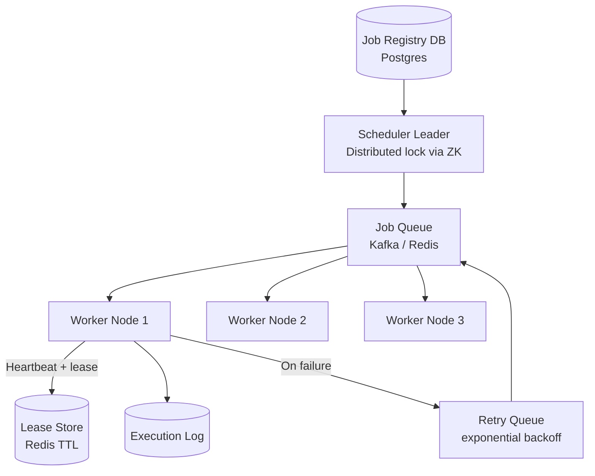
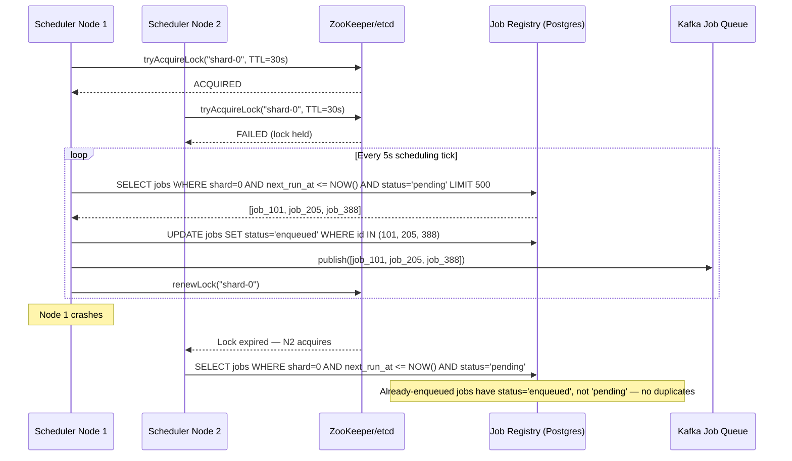
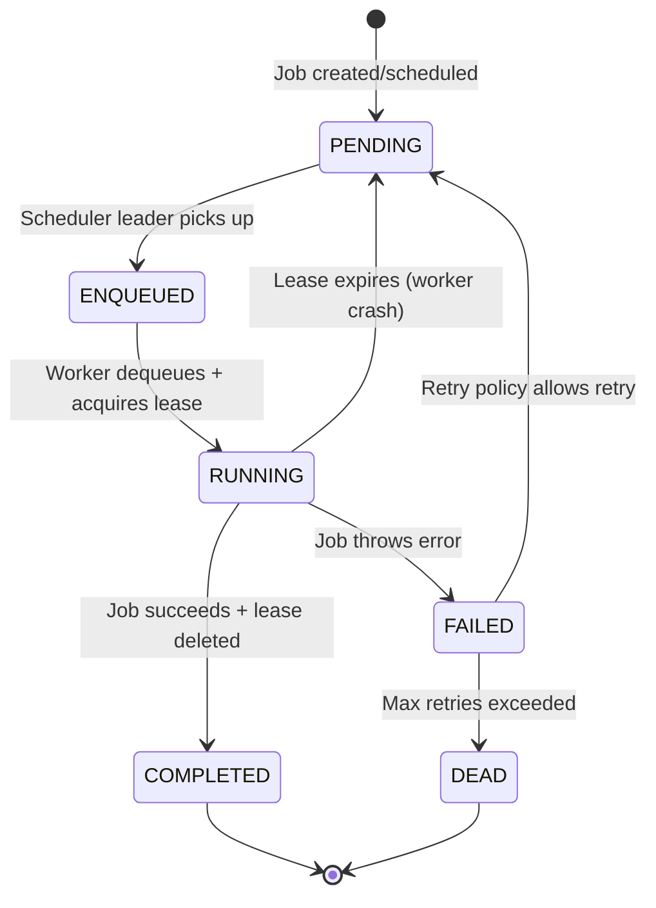
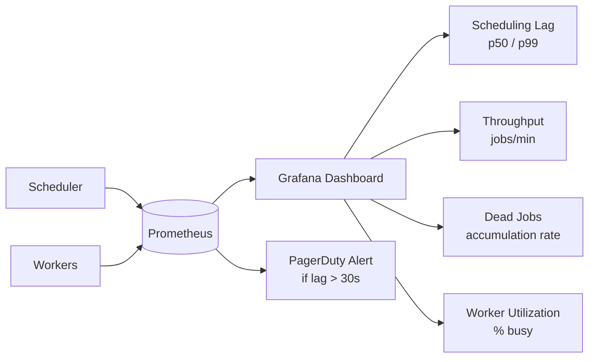

# Design a Distributed Task Scheduler

**Difficulty**: 🔴 Advanced
**Reading Time**: Coming Soon
**Interview Frequency**: High

---

> 🚧 **Full article coming soon.** This stub gives you the essentials to start thinking about this problem.

---

## The Core Problem

Executing 1 million scheduled jobs per day with exactly-once guarantees and failure recovery — when a worker crashes mid-job, the system must re-execute the job exactly once, not skip it and not run it twice. This is harder than it sounds because you can't atomically execute a job AND record that it completed in the same database transaction.

## Functional Requirements

- Schedule jobs with cron expressions or specific timestamps
- Execute each job exactly once (no duplicates, no missed runs)
- Workers can execute arbitrary tasks (HTTP calls, scripts, data pipelines)
- Retry failed jobs with configurable backoff
- Monitor job execution history and alerts for missed schedules

## Non-Functional Requirements

| Requirement | Target |
|-------------|--------|
| Scheduling accuracy | ±1 second for scheduled execution time |
| Throughput | 1M job executions/day (~11.6/sec) |
| Fault tolerance | Worker crash doesn't lose or duplicate jobs |
| Availability | 99.99% (scheduler is critical infrastructure) |

## Back-of-Envelope Estimates

- **Job poll rate**: 11.6 jobs/sec — relatively low, but requires sub-second precision
- **Worker heartbeat**: Each worker sends heartbeat every 10 seconds → 1,000 workers = 100 heartbeats/sec
- **Job metadata storage**: 1M jobs/day × 500 bytes = 500MB/day → trivial for any DB

## Key Design Decisions

1. **Leader Election for Trigger** — one master scheduler node claims leadership via distributed lock (ZooKeeper/etcd); only leader reads "due jobs" from DB and enqueues them; leader failure triggers election and new leader resumes without gap.
2. **Job Partitioning for Scale** — partition jobs by (job_id mod N) across N scheduler shards; each shard is independent with its own leader; eliminates single scheduler bottleneck; enables linear scale.
3. **Worker Heartbeat + Lease** — when worker picks up job, it acquires a time-limited lease (e.g., 30 seconds) and must renew via heartbeat; if heartbeat stops, lease expires and job is re-queued; combined with idempotency_key on the job to prevent true duplicate execution.

## High-Level Architecture



## Top Interview Questions for This Problem

| Question | Tests |
|----------|-------|
| How do you ensure a job runs exactly once even if the scheduler crashes? | Idempotency, lease-based execution |
| How would you schedule 1 billion cron jobs without a hot single-table scan? | Partitioning, time-bucketed scheduling |
| What happens if a job takes longer than its scheduled interval? | Concurrency policy, missed-run handling |

## Level 1 — Surface (2-minute read)

**What it is:** A distributed task scheduler executes jobs (HTTP calls, scripts, data pipelines) at specified times or on recurring cron schedules, across a pool of workers, with guarantees that each job runs at least once and — with idempotency — effectively exactly once.

**When you need it (with numbers):**
- More than 1,000 scheduled jobs/day — a single-machine cron daemon becomes a SPOF
- Job execution time exceeds 30 seconds — needs lease-based crash recovery
- Multiple teams share scheduling infrastructure — needs multi-tenant job registry
- Missed runs must be detected and alerted — needs execution history + monitoring

**Core concepts (5 bullets):**
- **Job Registry (DB)** — source of truth; jobs stay here until completed; scheduler queries it on each tick
- **Distributed Lock** — one leader per shard; prevents duplicate scheduling; uses ZooKeeper/etcd/Redis
- **Worker Lease** — time-bounded ownership; if worker crashes, lease expires and job is re-queued
- **Idempotency Key** — passed to downstream systems; makes re-execution safe
- **Reaper** — background process that expires stale leases and resets orphaned jobs to `pending`

**Use this when / don't use this when:**

| Use this when | Don't use this when |
|---------------|-------------------|
| Jobs need retry with backoff | You just need OS cron on one machine |
| Workers can crash mid-execution | Jobs complete in under 1 second |
| 10+ workers share a job queue | Single-service, no distribution needed |
| You need execution history + auditing | Latency matters more than durability |

---

## Related Concepts

- [Distributed locking for leader election](../05-infrastructure/distributed-locking)
- [Meeting calendar for similar scheduling conflict detection](./meeting-calendar)

---

## Component Deep Dive 1: Scheduler Leader & Distributed Locking

The scheduler leader is the most critical component in a distributed task scheduler. At any moment, exactly one node must be scanning the job registry for due jobs and enqueuing them. If two leaders run simultaneously — a split-brain scenario — every job due in that window gets enqueued twice, violating exactly-once guarantees. If no leader runs, jobs are silently missed. The distributed lock is the mechanism that prevents both failure modes.

**How it works internally:**

Leader election uses a distributed consensus store — ZooKeeper, etcd, or Redis with Redlock. Every scheduler node attempts to acquire a lock with a short TTL (typically 10–30 seconds). The node that wins becomes the leader and immediately begins its scheduling loop: query `SELECT * FROM jobs WHERE next_run_at <= NOW() AND status = 'pending' LIMIT 500`, then batch-publish these to the job queue. The leader must renew the lock every 5 seconds. If renewal fails (network partition, process crash), the lock expires, another node wins, and the new leader resumes from the same DB query — no jobs are lost because the jobs table is the source of truth.

**Why naive approaches fail at scale:**

A naive single-node scheduler is a SPOF. A naive "all nodes scan" approach causes thundering herd: at T=0, all 10 scheduler nodes simultaneously query `WHERE next_run_at <= NOW()`, each finding the same 500 due jobs, each enqueuing all 500. Even if you add a distributed lock around the query-and-enqueue block, you've now created a serial bottleneck — only one node does real work while 9 sit idle. The solution is **shard-based leadership**: partition jobs by `job_id % N` across N independent scheduler shards, each shard having its own leader election. This gives you N-way parallelism while still preventing duplicate scheduling within each shard.



**Trade-off table: Leader election backends**

| Approach | Latency | Throughput | Trade-off |
|----------|---------|------------|-----------|
| ZooKeeper ephemeral node | 5–20ms election | Handles 1000s of nodes | Strong consistency; operationally heavy; requires ZK cluster |
| etcd lease | 5–15ms election | Handles 1000s of nodes | Simpler ops than ZK; uses Raft; requires etcd cluster |
| Redis SETNX + TTL (Redlock) | 1–5ms election | Very high | Simpler to operate; weaker guarantees under clock skew; Martin Kleppmann critique applies |
| Postgres advisory lock | 1–10ms | Limited to DB conn pool | No extra infra; tied to DB availability; fails under DB maintenance |

For most production deployments at <100 scheduler nodes, etcd or Redis SETNX is sufficient. ZooKeeper is justified only when you already run it for other purposes (e.g., Kafka metadata).

---

## Component Deep Dive 2: Worker Lease & Heartbeat System

Once a job is dequeued by a worker, the system faces its hardest problem: the worker may crash between picking up the job and recording its completion. The lease mechanism solves this with a time-bounded ownership model.

**Internal mechanics:**

When a worker dequeues job `job_101`, it immediately writes a lease record: `INSERT INTO leases (job_id, worker_id, expires_at) VALUES (101, 'worker-7', NOW() + 30s)`. The worker then executes the job. While executing, it sends heartbeats every 10 seconds: `UPDATE leases SET expires_at = NOW() + 30s WHERE job_id = 101 AND worker_id = 'worker-7'`. On successful completion: `UPDATE jobs SET status='completed', completed_at=NOW() WHERE id=101` then `DELETE FROM leases WHERE job_id=101`.

A background reaper process (runs every 5 seconds) finds orphaned leases: `SELECT job_id FROM leases WHERE expires_at < NOW()`. For each expired lease, it resets the job: `UPDATE jobs SET status='pending' WHERE id=job_id`. This makes the job eligible for re-enqueue by the scheduler leader.

**Scale behavior at 10x load:**

At baseline (11.6 jobs/sec), lease writes are negligible. At 10x (116 jobs/sec) with 1,000 workers each heartbeating every 10 seconds, that's 100 heartbeat writes/sec — trivial. At 100x (1,160 jobs/sec) with 10,000 workers, heartbeats become 1,000 writes/sec, still manageable. The real bottleneck emerges at the reaper: if jobs take 5 minutes average and the lease table holds `1,160 jobs/sec × 300s = 348,000 active leases`, the reaper query becomes a full table scan without a proper index on `expires_at`.



**Critical index:** `CREATE INDEX idx_leases_expires_at ON leases(expires_at) WHERE expires_at IS NOT NULL;` — without this, the reaper does a sequential scan that kills DB performance at scale.

**Idempotency key:** To survive the rare race where a worker completes a job AND the lease expires simultaneously (slow network), every job carries an `idempotency_key`. The external system the job calls (e.g., payment service) uses this key for deduplication. This means even if the job executes twice (lease race), the effect is applied exactly once.

---

## Component Deep Dive 3: Job Queue — Kafka vs Redis vs SQS

The job queue sits between the scheduler leader and the worker pool. Its characteristics determine throughput ceiling, ordering guarantees, and operational complexity.

**Technical decisions:**

For a task scheduler with 1M jobs/day (~12/sec), the queue volume is trivial for any modern message broker. The decision criteria are therefore: (1) at-least-once vs exactly-once delivery semantics, (2) requeue/delay support for retries, (3) visibility timeout mechanics, and (4) priority support.

Redis Streams offer sub-millisecond enqueue latency and built-in consumer groups with acknowledgment semantics. A worker calls `XREADGROUP GROUP workers consumer-7 COUNT 1 BLOCK 5000 STREAMS jobs >` to claim a message, processes it, then calls `XACK jobs workers <message-id>`. If the worker crashes without ACKing, the message remains in the pending entry list (PEL) and a reaper can reclaim it with `XAUTOCLAIM`. Redis is ideal for latency-sensitive schedulers where jobs must start within 100ms of their scheduled time.

Kafka suits high-throughput pipelines where jobs arrive in bursts and ordering within a partition matters. Partition by `job_id` to ensure retry messages for the same job land on the same partition. However, Kafka does not support individual message delays (needed for exponential backoff retries) — you need a separate delay queue or a retry topic per backoff tier (retry-1m, retry-5m, retry-30m).

SQS with visibility timeout is the cloud-native choice. When a worker reads a message, it becomes invisible for `VisibilityTimeout` seconds (e.g., 60s). If not deleted within that window, it reappears. SQS FIFO queues provide exactly-once delivery within a 5-minute deduplication window using a `MessageDeduplicationId`. The trade-off: max 3,000 messages/sec per FIFO queue — sufficient for 12/sec but may require multiple queues for burst scenarios.

| Approach | Latency | Throughput | Trade-off |
|----------|---------|------------|-----------|
| Redis Streams | <1ms | 100k msg/sec | No native delay queues; memory-bound; best for low-latency |
| Kafka | 5–50ms | 1M+ msg/sec | Complex ops; no per-message delay; best for high-throughput analytics pipelines |
| AWS SQS FIFO | 10–100ms | 3k msg/sec per queue | Managed ops; built-in dedup; 5-min dedup window limits exact-once guarantees |
| Postgres SKIP LOCKED | <5ms | ~10k msg/sec | No extra infra; DB becomes bottleneck at scale; simplest for low-volume |

---

## Data Model

```sql
-- Job definitions: what to run and when
CREATE TABLE jobs (
    job_id          UUID PRIMARY KEY DEFAULT gen_random_uuid(),
    name            VARCHAR(255) NOT NULL,
    shard_key       SMALLINT NOT NULL,           -- job_id % num_shards, for leader partitioning
    job_type        VARCHAR(64) NOT NULL,         -- 'http_call' | 'script' | 'dag_trigger'
    payload         JSONB NOT NULL,              -- {"url": "...", "method": "POST", "body": {...}}
    idempotency_key VARCHAR(128) NOT NULL UNIQUE, -- caller-provided dedup key
    schedule_expr   VARCHAR(64),                 -- cron expression e.g. '0 9 * * 1-5'
    run_at          TIMESTAMPTZ,                 -- one-time: specific timestamp
    next_run_at     TIMESTAMPTZ NOT NULL,        -- computed: when to next execute
    status          VARCHAR(32) NOT NULL DEFAULT 'pending',
                                                 -- pending | enqueued | running | completed | failed | dead
    retry_count     SMALLINT NOT NULL DEFAULT 0,
    max_retries     SMALLINT NOT NULL DEFAULT 3,
    retry_backoff_s INTEGER NOT NULL DEFAULT 60, -- seconds, doubled each retry
    timeout_s       INTEGER NOT NULL DEFAULT 300,
    created_at      TIMESTAMPTZ NOT NULL DEFAULT NOW(),
    updated_at      TIMESTAMPTZ NOT NULL DEFAULT NOW(),
    created_by      VARCHAR(128) NOT NULL        -- service or user who registered the job
);

-- Indexes for scheduler leader query (hot path)
CREATE INDEX idx_jobs_shard_status_next_run
    ON jobs(shard_key, status, next_run_at)
    WHERE status = 'pending';

CREATE INDEX idx_jobs_idempotency_key ON jobs(idempotency_key);

-- Active worker leases
CREATE TABLE leases (
    job_id      UUID PRIMARY KEY REFERENCES jobs(job_id),
    worker_id   VARCHAR(128) NOT NULL,           -- 'worker-pod-7a3f'
    acquired_at TIMESTAMPTZ NOT NULL DEFAULT NOW(),
    expires_at  TIMESTAMPTZ NOT NULL,            -- acquired_at + timeout_s
    heartbeat_count INTEGER NOT NULL DEFAULT 0
);

CREATE INDEX idx_leases_expires_at ON leases(expires_at);

-- Immutable execution history (append-only)
CREATE TABLE job_executions (
    execution_id    UUID PRIMARY KEY DEFAULT gen_random_uuid(),
    job_id          UUID NOT NULL REFERENCES jobs(job_id),
    worker_id       VARCHAR(128) NOT NULL,
    started_at      TIMESTAMPTZ NOT NULL,
    finished_at     TIMESTAMPTZ,
    status          VARCHAR(32) NOT NULL,        -- running | completed | failed | timed_out
    exit_code       SMALLINT,
    error_message   TEXT,
    duration_ms     INTEGER,
    attempt_number  SMALLINT NOT NULL DEFAULT 1
);

CREATE INDEX idx_executions_job_id ON job_executions(job_id, started_at DESC);
CREATE INDEX idx_executions_worker_id ON job_executions(worker_id, started_at DESC);

-- Leader election state (used when not relying on external ZK/etcd)
CREATE TABLE scheduler_leaders (
    shard_id    SMALLINT PRIMARY KEY,
    node_id     VARCHAR(128) NOT NULL,
    acquired_at TIMESTAMPTZ NOT NULL,
    expires_at  TIMESTAMPTZ NOT NULL,
    term        BIGINT NOT NULL DEFAULT 1        -- monotonically increasing per election
);
```

---

## Scale Bottlenecks

| Traffic Level | Component That Breaks | Symptoms | Mitigation |
|---------------|----------------------|----------|------------|
| 10x baseline (~116 jobs/sec) | Single scheduler leader | Leader's DB query scans all pending rows for its shard; query time grows | Add `(shard_key, status, next_run_at)` composite index; increase shard count from 1 to 4 |
| 100x baseline (~1,160 jobs/sec) | Lease table reaper | Sequential scan of leases table with 300k+ rows; reaper takes 5–10s per cycle | Index `expires_at`; move leases to Redis with TTL keys — no reaper needed |
| 100x baseline (~1,160 jobs/sec) | Job queue (Redis FIFO) | Redis single-threaded bottleneck on XADD; memory fills if workers are slow | Shard job queue into multiple Redis streams by `job_id % 8`; add consumers per stream |
| 1000x baseline (~11,600 jobs/sec) | Scheduler leader election | ZK/etcd election overhead dominates; 100 shard leaders × 10 renewals/sec = 1,000 ZK writes/sec | Switch to Postgres advisory locks per shard (cheaper); or run etcd cluster with 5 nodes |
| 1000x baseline (~11,600 jobs/sec) | Postgres `jobs` table writes | `UPDATE jobs SET status='enqueued'` for 11,600 rows/sec; write amplification on indexes | Partition `jobs` table by `shard_key`; consider time-partitioning by `next_run_at` month |
| 1000x baseline (~11,600 jobs/sec) | Execution log table | Append-only but at 11,600 inserts/sec, index maintenance becomes expensive | Time-partition `job_executions` by month; archive to S3/Parquet after 30 days |

---

## How Uber Built Cadence (Their Distributed Task Scheduler)

Uber open-sourced **Cadence** in 2017 and later **Temporal** (a fork) in 2019. Cadence powers over 200 use-cases at Uber including driver onboarding (multi-step workflows spanning days), fraud detection pipelines (thousands of concurrent tasks per second), and marketplace matching retries.

**Specific technology choices:**

Cadence uses **Cassandra** as its primary storage backend (with optional MySQL support). Cassandra was chosen for its multi-datacenter replication and high write throughput — at Uber's scale, the execution history for a single workflow can have thousands of events, and Cadence needs to durably append each event. The task queue is implemented as an internal in-memory queue backed by persistence — workers long-poll a frontend service which dispatches tasks. This is fundamentally different from Kafka/Redis; Cadence owns the dispatch layer entirely.

**Specific numbers:** At peak, Cadence handles over **100 million workflow decisions per day** at Uber, with per-workflow event histories exceeding 50,000 events in long-running cases. Latency from task scheduling to worker pickup is under **5 milliseconds** at p99 for sticky (cached) workflows.

**Non-obvious architectural decision:** Cadence uses **event sourcing** for workflow state. Instead of storing current state, it stores a complete history of events (WorkflowExecutionStarted, ActivityScheduled, ActivityCompleted, etc.) and replays them to reconstruct state. This makes crash recovery trivial — any worker can reconstruct a workflow's state by replaying its history — but it means state size grows linearly with execution steps. Cadence mitigates this with **continueAsNew**: when history exceeds ~10,000 events, the workflow restarts itself with a clean history, passing forward only the essential state.

**Source:** Uber Engineering Blog — "Cadence: The Only Workflow Platform You'll Ever Need" (2019), and CadenceCon talks available on YouTube.

---

## Interview Angle

**What the interviewer is testing:** Whether you understand the fundamental tension between distributed coordination (preventing duplicate execution) and system availability (not missing jobs during leader failover), and whether you can reason about failure modes at each layer — not just the happy path.

**Common mistakes candidates make:**

1. **Using a message queue as the source of truth.** Many candidates say "put the job in Kafka at creation time and workers consume it." This loses the job if the consumer crashes before committing the offset, and makes re-scheduling (cron) impossible because you can't "re-insert" a message at a future time in Kafka. The database must be the source of truth; the queue is only a dispatch mechanism.

2. **Claiming distributed locks guarantee exactly-once execution.** A lock prevents duplicate scheduling, but it does not prevent a worker from executing a job, crashing before ACKing, and having the system re-execute it. Exactly-once execution requires an idempotency key passed to the downstream system. Without this, the scheduler can only guarantee at-least-once execution.

3. **Ignoring the missed-run problem.** If the scheduler is down from 9:00–9:05 and a job was due at 9:01, what happens at 9:05 when the scheduler recovers? Options are: run it immediately (catch-up), skip it (drop), or run it at the next scheduled time. Candidates who don't address this reveal they haven't thought about production failure modes. The answer depends on the job's semantics — a billing job needs catch-up; a health-check job should skip.

**The insight that separates good from great answers:** The scheduler is fundamentally a **two-phase commit problem**. Phase 1: atomically mark the job as enqueued in the DB and publish it to the queue. Phase 2: atomically mark the job as completed in the DB and ACK it from the queue. Neither phase is actually atomic across two systems. Great candidates recognize this and explain that the solution is to make each phase **idempotent** rather than atomic — if phase 1 is re-tried, the job gets enqueued twice but the queue deduplication or the worker's idempotency key prevents double execution; if phase 2 is re-tried, completing an already-completed job is a no-op.

---

## Worker Autoscaling Strategy

Worker pool size is the primary lever for throughput. Static pools waste resources at off-peak and cause queuing delays at peak. Autoscaling based on queue depth is the standard approach.

**Target metric:** `queue_depth / (avg_job_duration_s * workers_per_job)` — this is the number of workers needed to drain the queue within one tick. If queue depth is 500 jobs and each job takes 2 seconds, you need `500 / (2 * 1) = 250` workers to drain it in 1 second. In practice, target keeping the queue drain time under 10 seconds.

**Kubernetes HPA with custom metrics:**
```yaml
# Scale on queue depth exposed via Prometheus adapter
spec:
  metrics:
  - type: External
    external:
      metric:
        name: job_queue_depth
      target:
        type: AverageValue
        averageValue: "50"  # 1 worker per 50 queued jobs
  minReplicas: 2
  maxReplicas: 100
```

**Scale-down lag matters:** Set `scaleDown.stabilizationWindowSeconds: 300` (5 minutes). Workers currently executing long jobs should not be killed mid-execution. Workers should handle `SIGTERM` gracefully: stop accepting new jobs, finish the current job, then exit.

**Job-type worker pools:** For heterogeneous workloads, run separate worker pools per job type. A `heavy-compute` job (30-minute ML training) should not starve `http-call` jobs (2-second webhook). Separate queues per job type + separate autoscaling groups per pool is the production-grade pattern. Cost: more infrastructure. Benefit: predictable latency SLAs per job category.

| Job Category | Typical Duration | Worker Pool Size | Autoscale Trigger |
|-------------|-----------------|-----------------|------------------|
| http_call | 1–5s | 10–200 | queue depth > 50 |
| script/bash | 5–60s | 5–50 | queue depth > 20 |
| data_pipeline | 1–30 min | 2–20 | queue depth > 5 |
| ml_training | 10–120 min | 1–10 | queue depth > 2 |

---

## API Design for Job Management

The scheduler exposes a REST API for job registration, inspection, and manual control. Key endpoints:

| Method | Path | Description |
|--------|------|-------------|
| `POST` | `/api/v1/jobs` | Register a new job (cron or one-time) |
| `GET` | `/api/v1/jobs/{job_id}` | Get job status, next_run_at, retry_count |
| `GET` | `/api/v1/jobs/{job_id}/executions` | Execution history (paginated, newest first) |
| `DELETE` | `/api/v1/jobs/{job_id}` | Deactivate job (sets status='paused', stops scheduling) |
| `POST` | `/api/v1/jobs/{job_id}/trigger` | Manually trigger a job immediately (ignores schedule) |
| `POST` | `/api/v1/jobs/{job_id}/requeue` | Re-enqueue a DEAD job for one more attempt |
| `GET` | `/api/v1/admin/scheduler/status` | Leader election state, shard health, scheduling lag |

**Pagination for execution history:** Use cursor-based pagination on `execution_id` (UUID v7 — lexicographically ordered by time). Avoid offset-based pagination on large execution log tables — `OFFSET 10000` forces the DB to scan and discard 10,000 rows.

**Webhook notifications (push model):** Clients can register a `callback_url` on a job. On completion or failure, the scheduler POSTs to `callback_url` with `{"job_id": "...", "status": "completed", "execution_id": "..."}`. This removes the need for clients to poll `/executions`. Deliver callbacks via a separate lightweight worker pool to avoid coupling notification latency to job execution latency.

---

## Key Numbers to Remember

| Metric | Value | Context |
|--------|-------|---------|
| Scheduling accuracy target | ±1 second | Standard SLA for most task schedulers |
| Lease TTL | 30 seconds | Worker heartbeat interval × 3; balance between fast recovery and false timeouts |
| Heartbeat interval | 10 seconds | Must be less than TTL/2 to handle one missed heartbeat |
| Reaper scan frequency | 5 seconds | Determines max recovery latency after worker crash |
| Scheduler tick interval | 1–5 seconds | How often leader queries for due jobs |
| Shard count for 10k jobs/sec | 16–32 shards | Each shard handles ~300–600 jobs/sec, within single-leader capacity |
| Postgres advisory lock acquisition | <1ms | Zero network RTT; same connection; suitable for scheduler leader election |
| Cadence (Uber) throughput | 100M workflow decisions/day | ~1,157 decisions/sec average; burst much higher |
| Redis XADD latency | <1ms p99 | Single-threaded; saturates at ~100k ops/sec per instance |
| SQS FIFO deduplication window | 5 minutes | MessageDeduplicationId prevents redelivery only within this window |

---

## End-to-End Request Flow: Job Registration to Completion

Walking through the full lifecycle exposes every critical decision point.

**Step 1 — Job Registration (API write path)**

A client POSTs to `POST /api/v1/jobs`:
```json
{
  "name": "monthly-invoice-generation",
  "job_type": "http_call",
  "payload": { "url": "https://billing.internal/run-invoices", "method": "POST" },
  "schedule_expr": "0 2 1 * *",
  "idempotency_key": "invoice-2026-06",
  "max_retries": 3,
  "timeout_s": 600
}
```

The API layer:
1. Validates the cron expression (parse with a library; reject invalid patterns).
2. Computes `next_run_at` from the cron expression + current time.
3. Computes `shard_key = hash(job_id) % num_shards`.
4. Inserts into the `jobs` table with `status='pending'`.
5. Returns `201 Created` with the `job_id`.

The idempotency key prevents duplicate registrations. If the client retries the POST (network timeout), the INSERT fails on the unique constraint for `idempotency_key`, and the API returns the existing job.

**Step 2 — Scheduler tick (hot path, runs every 5 seconds per shard)**

```sql
BEGIN;
  SELECT job_id, payload, job_type, timeout_s
  FROM jobs
  WHERE shard_key = $MY_SHARD
    AND status = 'pending'
    AND next_run_at <= NOW()
  ORDER BY next_run_at ASC
  LIMIT 500
  FOR UPDATE SKIP LOCKED;

  UPDATE jobs
  SET status = 'enqueued', updated_at = NOW()
  WHERE job_id = ANY($job_ids);
COMMIT;
-- Then publish job_ids to the message queue
```

`FOR UPDATE SKIP LOCKED` is the key — it allows multiple scheduler threads to safely dequeue without row-level conflicts. Any row already locked by another thread is skipped, not waited on. This enables multiple concurrent readers even within a single shard during catch-up scenarios.

**Step 3 — Worker execution**

```
1. DEQUEUE job from queue (XREADGROUP / SQS ReceiveMessage)
2. INSERT INTO leases (job_id, worker_id, expires_at=NOW()+timeout_s)
   → If INSERT fails (duplicate key): another worker has this job; skip
3. Execute the job (HTTP call, script, etc.)
4. On success:
   a. UPDATE jobs SET status='completed', updated_at=NOW()
   b. INSERT INTO job_executions (..., status='completed')
   c. DELETE FROM leases WHERE job_id=X
   d. ACK the queue message
   e. If cron job: UPDATE jobs SET status='pending', next_run_at=<next_cron_tick>
5. On failure:
   a. INSERT INTO job_executions (..., status='failed', error_message=...)
   b. If retry_count < max_retries:
        UPDATE jobs SET status='pending', retry_count=retry_count+1,
               next_run_at=NOW()+backoff, updated_at=NOW()
   c. Else: UPDATE jobs SET status='dead'
   d. DELETE FROM leases WHERE job_id=X
   e. ACK the queue message (always ACK to prevent infinite redelivery)
```

**Step 4 — Lease reaper (runs every 5 seconds)**

```sql
SELECT job_id FROM leases WHERE expires_at < NOW();
-- For each expired lease:
UPDATE jobs SET status='pending', updated_at=NOW() WHERE job_id=$X AND status='running';
DELETE FROM leases WHERE job_id=$X;
INSERT INTO job_executions (job_id, ..., status='timed_out');
```

The reaper does NOT re-enqueue directly — it resets `status='pending'` so the scheduler's next tick picks it up. This keeps the reaper stateless and simple.

---

## Two Approaches: Polling vs Event-Driven Scheduling

The core scheduling loop can be implemented two ways. Most production systems use polling for its simplicity and predictability, but event-driven scheduling offers lower latency and less DB load at scale.

### Approach A: Polling-Based (Industry Standard)

The scheduler leader wakes up every tick (1–5 seconds), queries `jobs WHERE next_run_at <= NOW() AND status = 'pending' AND shard_key = MY_SHARD LIMIT 500`, transitions those jobs to `enqueued`, and publishes them to the queue. The DB is the single source of truth. Recovery after crash is automatic — restart the scheduler, and it resumes the same query.

**Advantages:** Simple to reason about. DB acts as buffer — if the queue is down, jobs stay `pending` until the queue recovers. Easy to implement backfill for missed runs (just query `WHERE next_run_at < NOW()` without a lower bound).

**Disadvantages:** Minimum latency equals the tick interval (1–5 seconds). At high throughput, frequent DB queries add read load. For 10,000 pending jobs, even with an index, each tick is a range scan returning 500 rows.

**Optimization — time bucketing:** Instead of querying the entire pending set, pre-bucket jobs into 1-minute time windows: `SELECT * FROM job_buckets WHERE bucket_minute = DATE_TRUNC('minute', NOW())`. This reduces scan size dramatically at the cost of a preprocessing step when jobs are registered.

### Approach B: Priority Queue / Sorted Set (Redis-Based)

Store due times in a Redis Sorted Set: `ZADD scheduled_jobs <unix_timestamp> <job_id>`. The scheduler runs `ZRANGEBYSCORE scheduled_jobs 0 <NOW_UNIX> LIMIT 500` every tick, then `ZREM` to atomically dequeue. Workers pull from the Redis set.

**Advantages:** Sub-millisecond dispatch latency. No DB scans. Natural priority queue semantics (can weight urgent jobs with lower scores).

**Disadvantages:** Redis is now the source of truth — if it fails before jobs are persisted elsewhere, jobs are lost. Requires Redis persistence (AOF with `fsync=always`) or a dual-write to Postgres. Operational complexity increases.

| Dimension | Polling (Postgres) | Priority Queue (Redis) |
|-----------|-------------------|----------------------|
| Dispatch latency | 1–5s (tick interval) | <100ms |
| Recovery after crash | Automatic (query `status=pending`) | Requires Redis persistence + replay |
| DB load | Medium (range scan per tick) | Minimal (Redis handles hot path) |
| Implementation complexity | Low | Medium |
| Best for | <100k jobs/day, simplicity matters | >1M jobs/day, latency-sensitive |

---

## Retry Strategy Deep Dive

Retry logic is where most scheduler implementations fail in subtle ways. A naive `retry_count < max_retries` check re-queues the job immediately, causing retry storms when a downstream service is degraded.

**Exponential backoff with jitter:**

```
next_retry_at = NOW() + base_delay_s * (2 ^ attempt_number) + jitter
jitter = RANDOM() * base_delay_s  # prevents synchronized retries from multiple jobs
```

For `base_delay_s = 60`: attempt 1 waits ~2 min, attempt 2 waits ~4 min, attempt 3 waits ~8 min. With max 5 retries, a job's total retry window is ~30 minutes before it's moved to `DEAD`.

**Dead-letter handling:** Jobs in `DEAD` status are not automatically re-run. A human or automated escalation process must inspect them. Store the full error trace in `job_executions.error_message`. Expose a `/api/jobs/{id}/requeue` endpoint for manual recovery.

**Job-type specific retry policies:**

- **Idempotent HTTP calls**: Retry on any 5xx or timeout; do NOT retry 4xx (client error — fix the payload first).
- **Database writes**: Retry on deadlock (SQLSTATE 40001) or connection timeout; do NOT retry constraint violations (data bug).
- **External payment APIs**: Use the idempotency key on every retry; never retry without one.

**Circuit breaker per job type:** If `http_call` jobs to `api.payments.com` have 80% failure rate over 2 minutes, stop dispatching new `http_call` jobs to that host for 60 seconds. This prevents worker saturation on a known-bad downstream. Implement with a Redis counter: `INCR failures:api.payments.com:1min` with a 60-second TTL.

---

## Monitoring & Observability

A task scheduler is critical infrastructure — its failure is silent (no error page, no alert unless instrumented). The following metrics are mandatory:

**Scheduling lag:** `AVG(enqueued_at - next_run_at)` per shard per minute. This is the most important metric. A healthy scheduler has lag < 2 seconds. Lag > 30 seconds means the leader is overloaded or down.

**Job throughput:** `jobs_completed_per_minute` vs `jobs_scheduled_per_minute`. If completions fall behind schedules for more than 5 minutes, workers are saturated.

**Lease expiry rate:** `leases_expired_per_minute` tracks worker crashes or jobs exceeding their timeout. Spikes indicate infrastructure issues.

**Dead job accumulation:** `COUNT(*) WHERE status='dead'` should be near zero. Alert if it exceeds 10/hour — something systemic is broken.

**Missed runs:** Jobs with `next_run_at < NOW() - 5min AND status='pending'` have been missed. A zero-tolerance alert: any missed run is a scheduler failure.



**Key Grafana panels to build:**
1. Scheduling lag heatmap by shard (reveals hot shards)
2. Job execution duration histogram by job_type (reveals slow job categories)
3. Retry rate by job_type over time (reveals degraded downstream services)
4. Worker pool size vs queue depth (triggers autoscaling decisions)

---

## 📚 Resources & References

| Resource | Type | What You'll Learn |
|----------|------|------------------|
| [ByteByteGo — Design a Task Scheduler](https://www.youtube.com/@ByteByteGo) | 📺 YouTube | Search "task scheduler design" — distributed job queues and exactly-once execution |
| [Airflow Architecture: DAG-Based Task Scheduling](https://airflow.apache.org/docs/apache-airflow/stable/concepts/overview.html) | 📚 Docs | Production workflow scheduler used at thousands of companies |
| [AWS SQS and Lambda for Task Processing](https://aws.amazon.com/blogs/compute/new-for-aws-lambda-sqs-fifo-as-an-event-source/) | 📚 Docs | Cloud-native approach to task queue and scheduled execution |
| [Temporal: Durable Task Execution](https://temporal.io/blog/workflow-orchestration) | 📖 Blog | Fault-tolerant task scheduling with guaranteed execution and retry |
| [Uber Cadence: Distributed Task Scheduling](https://eng.uber.com/cadence-workflow/) | 📖 Blog | How Uber built their distributed task orchestration platform |
