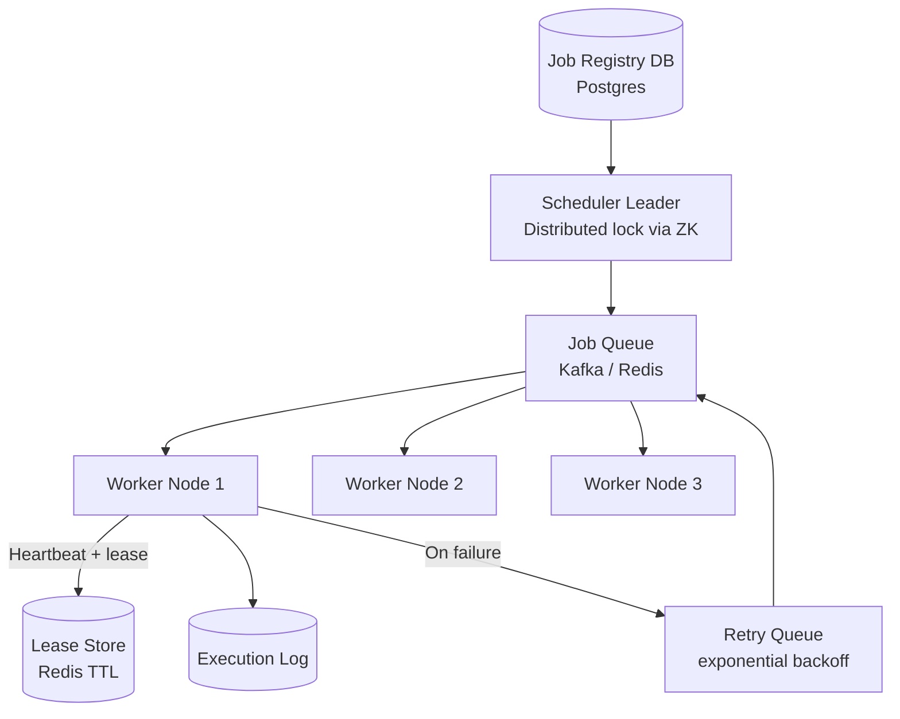

# Design a Distributed Task Scheduler

**Difficulty**: 🔴 Advanced
**Reading Time**: Coming Soon
**Interview Frequency**: High

---

> 🚧 **Full article coming soon.** This stub gives you the essentials to start thinking about this problem.

---

## The Core Problem

Executing 1 million scheduled jobs per day with exactly-once guarantees and failure recovery — when a worker crashes mid-job, the system must re-execute the job exactly once, not skip it and not run it twice. This is harder than it sounds because you can't atomically execute a job AND record that it completed in the same database transaction.

## Functional Requirements

- Schedule jobs with cron expressions or specific timestamps
- Execute each job exactly once (no duplicates, no missed runs)
- Workers can execute arbitrary tasks (HTTP calls, scripts, data pipelines)
- Retry failed jobs with configurable backoff
- Monitor job execution history and alerts for missed schedules

## Non-Functional Requirements

| Requirement | Target |
|-------------|--------|
| Scheduling accuracy | ±1 second for scheduled execution time |
| Throughput | 1M job executions/day (~11.6/sec) |
| Fault tolerance | Worker crash doesn't lose or duplicate jobs |
| Availability | 99.99% (scheduler is critical infrastructure) |

## Back-of-Envelope Estimates

- **Job poll rate**: 11.6 jobs/sec — relatively low, but requires sub-second precision
- **Worker heartbeat**: Each worker sends heartbeat every 10 seconds → 1,000 workers = 100 heartbeats/sec
- **Job metadata storage**: 1M jobs/day × 500 bytes = 500MB/day → trivial for any DB

## Key Design Decisions

1. **Leader Election for Trigger** — one master scheduler node claims leadership via distributed lock (ZooKeeper/etcd); only leader reads "due jobs" from DB and enqueues them; leader failure triggers election and new leader resumes without gap.
2. **Job Partitioning for Scale** — partition jobs by (job_id mod N) across N scheduler shards; each shard is independent with its own leader; eliminates single scheduler bottleneck; enables linear scale.
3. **Worker Heartbeat + Lease** — when worker picks up job, it acquires a time-limited lease (e.g., 30 seconds) and must renew via heartbeat; if heartbeat stops, lease expires and job is re-queued; combined with idempotency_key on the job to prevent true duplicate execution.

## High-Level Architecture

## Top Interview Questions for This Problem

| Question | Tests |
|----------|-------|
| How do you ensure a job runs exactly once even if the scheduler crashes? | Idempotency, lease-based execution |
| How would you schedule 1 billion cron jobs without a hot single-table scan? | Partitioning, time-bucketed scheduling |
| What happens if a job takes longer than its scheduled interval? | Concurrency policy, missed-run handling |

## Related Concepts

- [Distributed locking for leader election](../05-infrastructure/distributed-locking)
- [Meeting calendar for similar scheduling conflict detection](./meeting-calendar)

---

*📚 Full deep-dive with multiple approaches, trade-off tables, and pseudocode coming soon.*

## 📚 Resources & References

| Resource | Type | What You'll Learn |
|----------|------|------------------|
| [ByteByteGo — Design a Task Scheduler](https://www.youtube.com/@ByteByteGo) | 📺 YouTube | Search "task scheduler design" — distributed job queues and exactly-once execution |
| [Airflow Architecture: DAG-Based Task Scheduling](https://airflow.apache.org/docs/apache-airflow/stable/concepts/overview.html) | 📚 Docs | Production workflow scheduler used at thousands of companies |
| [AWS SQS and Lambda for Task Processing](https://aws.amazon.com/blogs/compute/new-for-aws-lambda-sqs-fifo-as-an-event-source/) | 📚 Docs | Cloud-native approach to task queue and scheduled execution |
| [Temporal: Durable Task Execution](https://temporal.io/blog/workflow-orchestration) | 📖 Blog | Fault-tolerant task scheduling with guaranteed execution and retry |
| [Uber Cadence: Distributed Task Scheduling](https://eng.uber.com/cadence-workflow/) | 📖 Blog | How Uber built their distributed task orchestration platform |
