# Design Ticketmaster — Event Ticketing at Scale

> **The hardest part of Ticketmaster isn't search or discovery — it's making sure two people never buy the same seat, even when 3 million users hammer the system simultaneously at 10:00 AM.**

---

## On This Page

| Section | What You'll Learn |
|---------|-------------------|
| [Mental Model](#mental-model) | The happy path — what buying a ticket looks like end to end |
| [Why It's Hard](#why-its-hard) | The race condition that causes double booking |
| [Requirements](#requirements) | Functional + non-functional with real numbers |
| [Scale Estimation](#scale-estimation) | Peak load math for a Taylor Swift sale |
| [Seat Reservation — 3 Approaches](#seat-reservation-approaches) | Optimistic lock vs pessimistic lock vs Redis TTL |
| [Full System Architecture](#full-system-architecture) | Every service, every data store |
| [The Seat Map Problem](#seat-map-problem) | How to store and serve 20,000 seats in real time |
| [Anti-Bot / Scalper Defense](#anti-bot-defense) | Rate limiting, CAPTCHA, virtual queues |
| [Payment Integration](#payment-integration) | Two-phase commit problem + Saga pattern |
| [Problems at Scale](#problems-at-scale) | 5 production failure modes and their fixes |
| [Database Schema](#database-schema) | Tables, indexes, Redis key patterns |
| [Interview Q&A Map](#interview-qa-map) | Exact phrases to use in an interview |
| [Key Takeaways](#key-takeaways) | 5 numbers to walk in with |

---

## Mental Model

### What Happens When You Buy a Concert Ticket?

Before diving into hard problems, internalize the **happy path**. Every complexity in this article exists to protect this sequence.

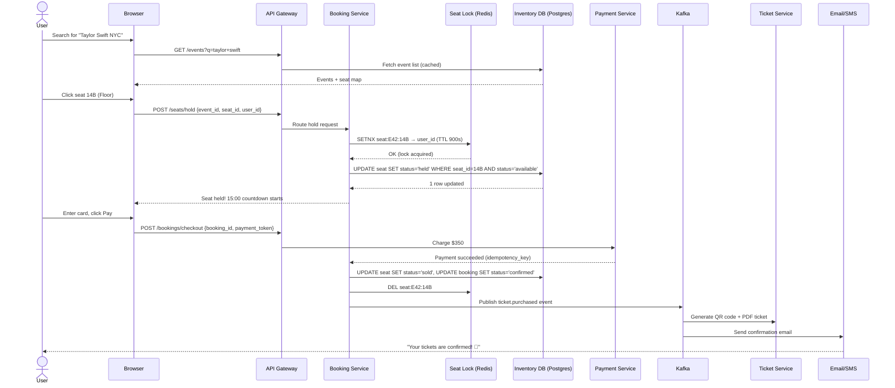

**Key insight**: The seat is reserved in Redis *before* payment. The database row is updated *after* payment succeeds. These two writes must be coordinated without a two-phase commit — that's the core engineering challenge.

---

## Why It's Hard

### The Race Condition That Ruins Everything

Imagine there is no locking. Two users see the same available seat simultaneously.

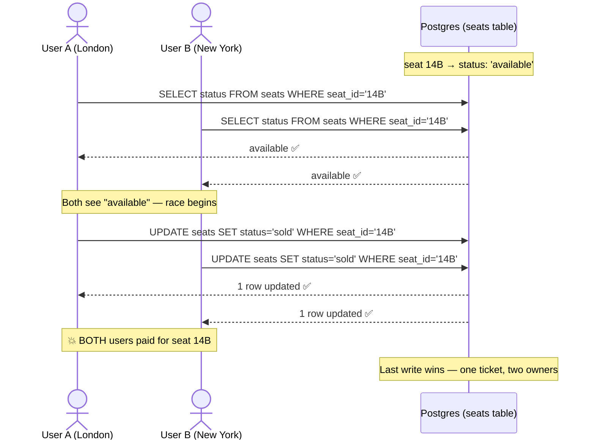

This is the **Lost Update Problem** — a classic concurrency failure where two transactions read the same value and both write back, destroying each other's work.

**Why this is catastrophic for ticketing**:
- A customer arrives at the venue with a valid ticket and finds someone already in their seat
- Refunds + customer service costs are massive (Ticketmaster reported ~$40M/year in dispute handling)
- Brand damage is irreversible — people tweet immediately
- Legal liability in some jurisdictions (consumer protection laws)

**This problem gets worse at scale**:
- 3 million users hitting at 10:00:00 AM sharp
- Network latency from global CDN introduces ~50–200ms gaps
- Load balancers spread requests across 50+ application servers
- Each server has its own connection pool to the database
- At this scale, "two users click simultaneously" happens thousands of times per second

---

## Requirements

### Functional Requirements

| Feature | Description |
|---------|-------------|
| Browse events | Search by artist, venue, date, city |
| View seat map | Real-time seat availability (available / held / sold) |
| Hold seats | Temporarily reserve seats for 15 minutes |
| Purchase tickets | Pay and confirm booking |
| Cancel booking | Release seat before event (per policy) |
| Transfer tickets | Resell/gift to another user |
| View my tickets | QR code + PDF download |

### Non-Functional Requirements (with numbers)

| Metric | Target | Why This Number |
|--------|--------|-----------------|
| Concurrent users (peak) | 3,000,000 | Taylor Swift onsale, first minute |
| Seat selection latency | < 200ms P99 | User tolerance before "is it broken?" |
| Availability | 99.99% (52 min/year downtime) | Revenue impact: ~$1M/minute during onsale |
| Consistency model (booking) | **Strong consistency** — no double booking ever | Legal + financial requirement |
| Consistency model (analytics) | Eventual consistency acceptable | Dashboards can lag 30 seconds |
| Seat hold duration | 15 minutes | Industry standard; long enough to pay, short enough to reclaim |
| Read:Write ratio | 100:1 (browsing >> buying) | Seats are read constantly, sold once |
| Ticket generation throughput | 100,000 PDFs / 30 minutes | Post-onsale burst |

---

## Scale Estimation

### Normal Traffic (Baseline)

```
Events per year:     5,000,000
Tickets sold/year:   100,000,000
Tickets sold/day:    100M / 365 = ~274,000 tickets/day
Peak TPS (normal):   274,000 / 86,400s = ~3 TPS (writes)
Read QPS (normal):   3 TPS × 100 read:write = ~300 QPS
```

### Onsale Peak Traffic (Taylor Swift Problem)

```
Event: Taylor Swift, Madison Square Garden (capacity: 20,000 seats)
Onsale time: 10:00 AM EST

Concurrent users hitting at 10:00:00 AM: 3,000,000
Duration of extreme peak: 60 seconds
Requests per second (first 60s): 3,000,000 / 60 = 50,000 RPS

Seat selection attempts: 50,000 RPS × 3 avg attempts/user = 150,000 RPS
Payment attempts (10% convert): 5,000 payments/minute
Seat holds in Redis at peak: 20,000 (the entire venue)

Database rows contested simultaneously: 20,000 seats × N servers
Redis operations per second: 150,000 SETNX + 5,000 DEL = ~155,000 ops/sec
```

**Key insight**: **Redis handles 1,000,000 ops/sec on a single node** — it can absorb the peak. The database is the bottleneck, not Redis. This is why we push the hot path to Redis.

### Storage Estimation

```
Events:    5M events × 1KB metadata = 5GB
Seats:     5M events × 20K seats × 100 bytes = 10TB (partitioned)
Bookings:  100M/year × 500 bytes = 50GB/year
QR codes:  100M/year × 2KB = 200GB/year (object storage, not DB)
Seat maps: 5M events × 2,500 bytes (bitmap) = 12.5GB (fits in Redis)
```

---

## Seat Reservation Approaches

The most important architectural decision in Ticketmaster: **how do you prevent two users from buying the same seat?**

Three approaches, ordered from naive to production-grade.

---

### Approach A: Optimistic Locking (Database CAS)

**Core idea**: Don't lock anything upfront. Read, try to update, retry if someone else won.

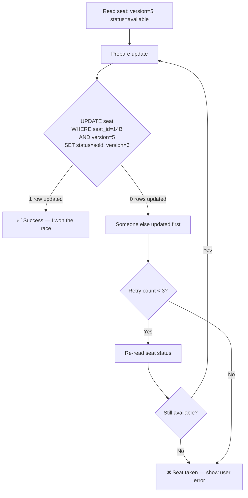

**Pseudo-code**:

```
function holdSeat(eventId, seatId, userId):
    MAX_RETRIES = 3
    retries = 0

    while retries < MAX_RETRIES:
        seat = SELECT seat_id, status, version
               FROM seats
               WHERE seat_id = seatId AND event_id = eventId

        if seat.status != 'available':
            return ERROR("Seat not available")

        rowsAffected = UPDATE seats
                       SET status = 'held',
                           held_by = userId,
                           held_until = now() + 15min,
                           version = version + 1
                       WHERE seat_id = seatId
                         AND event_id = eventId
                         AND version = seat.version  -- CAS check
                         AND status = 'available'

        if rowsAffected == 1:
            return SUCCESS("Seat held")

        retries += 1
        sleep(exponential_backoff(retries))  -- 10ms, 20ms, 40ms

    return ERROR("Could not hold seat after retries")
```

**When does this work?**
- Low contention: each seat has 1–2 concurrent buyers
- Long time windows: users browse for 30+ seconds before selecting

**When does this break?**
- High contention: Taylor Swift onsale — 1,000 users competing for 1 seat
- At 1,000 concurrent attempts on one seat: 999 retries per second
- Retry storms amplify database load → deadlock spirals → cascading failures

| Dimension | Optimistic Locking |
|-----------|-------------------|
| Throughput (low contention) | ✅ Very high (no lock overhead) |
| Throughput (high contention) | ❌ Collapse — retry storms |
| Deadlock risk | ✅ None |
| Latency | ✅ Low (single round trip on success) |
| Implementation complexity | 🟡 Medium (need version column) |
| Horizontal scale | ✅ Easy (stateless) |
| Hot event handling | ❌ Terrible — wrong tool |

---

### Approach B: Pessimistic Locking (SELECT FOR UPDATE)

**Core idea**: Lock the database row exclusively when you read it. Other transactions wait (block) until the lock is released.

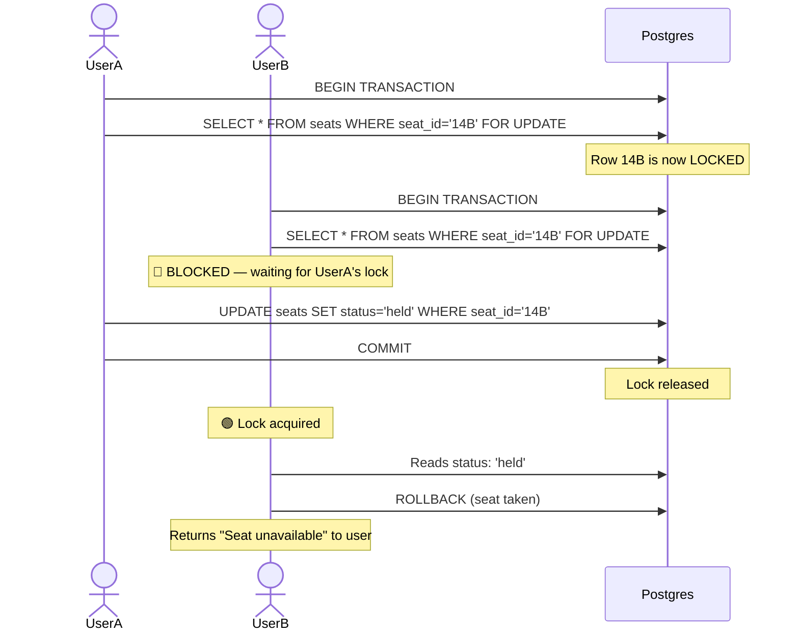

**Pseudo-code**:

```
function holdSeat(eventId, seatId, userId):
    transaction = beginTransaction()

    try:
        -- Exclusive lock — blocks all other readers/writers for this row
        seat = SELECT seat_id, status
               FROM seats
               WHERE seat_id = seatId AND event_id = eventId
               FOR UPDATE  -- Postgres row-level lock

        if seat.status != 'available':
            transaction.rollback()
            return ERROR("Seat not available")

        UPDATE seats
        SET status = 'held',
            held_by = userId,
            held_until = now() + 15min
        WHERE seat_id = seatId

        transaction.commit()
        return SUCCESS("Seat held")

    catch (DeadlockError):
        transaction.rollback()
        return ERROR("Deadlock — please retry")
    catch (LockTimeoutError):
        transaction.rollback()
        return ERROR("Server busy — please retry")
```

**When does this work?**
- Short, predictable critical sections (lock held for < 50ms)
- Moderate contention (tens of concurrent users per seat, not thousands)

**When does this break?**
- Long transactions: payment processing inside the lock (takes 500–2000ms) — all other buyers blocked
- Connection pool exhaustion: 10,000 waiting threads × 1MB stack = 10GB RAM just for waiting
- Cascading lock waits: lock on seat A while waiting for seat B → classic deadlock

| Dimension | Pessimistic Locking |
|-----------|---------------------|
| Consistency guarantee | ✅ Strong — no double booking |
| Throughput (high contention) | 🟡 OK for short locks, ❌ terrible for long |
| Deadlock risk | ❌ High if not careful |
| Latency | 🟡 Adds wait time for blocked transactions |
| Connection pool impact | ❌ Threads block, pool exhausts quickly |
| Payment inside lock | ❌ Never do this — blocks everyone |
| Horizontal scale | ❌ DB becomes single point of contention |

---

### Approach C: Distributed Seat Lock with Redis + Expiry (Recommended)

**Core idea**: Use Redis as a fast, distributed lock coordinator. The database only gets a write *after* the lock is confirmed. Redis handles expiry automatically — no orphaned holds.

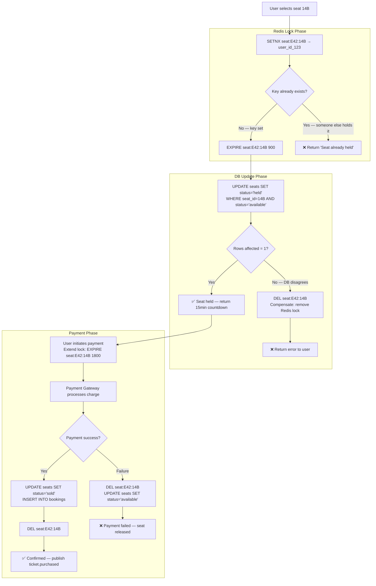

**Pseudo-code with Redis commands**:

```
function holdSeat(eventId, seatId, userId):
    redisKey = "seat:{eventId}:{seatId}"
    ttlSeconds = 900  -- 15 minutes

    -- Atomic: SET if Not eXists + EXpiry in one command (Redis 2.6.12+)
    -- SET key value NX EX ttl — atomically sets and returns OK or nil
    result = redis.SET(redisKey, userId, NX=true, EX=ttlSeconds)

    if result == nil:
        -- Key already exists — another user holds this seat
        existingHolder = redis.GET(redisKey)
        return ERROR("Seat held by another user")

    -- Redis lock acquired — now update the DB
    rowsUpdated = db.execute("""
        UPDATE seats
        SET status = 'held', held_by = :userId, held_until = now() + interval '15 minutes'
        WHERE seat_id = :seatId
          AND event_id = :eventId
          AND status = 'available'
    """, userId=userId, seatId=seatId, eventId=eventId)

    if rowsUpdated == 0:
        -- Seat was already sold/held in DB (edge case: Redis was stale)
        redis.DEL(redisKey)  -- release lock we just acquired
        return ERROR("Seat not available")

    return SUCCESS({
        seat_id: seatId,
        held_until: now() + 15min,
        booking_token: generateIdempotencyKey(userId, eventId, seatId)
    })


function completePurchase(bookingToken, paymentToken):
    -- Extend lock while payment is processing (prevent expiry mid-payment)
    seatId = lookupSeat(bookingToken)
    redisKey = "seat:{eventId}:{seatId}"

    -- Only extend if WE still hold it (Lua script — atomic)
    luaScript = """
        if redis.call('GET', KEYS[1]) == ARGV[1] then
            return redis.call('EXPIRE', KEYS[1], 1800)
        else
            return 0
        end
    """
    extended = redis.eval(luaScript, keys=[redisKey], args=[userId])
    if extended == 0:
        return ERROR("Seat hold expired — please restart checkout")

    -- Process payment with idempotency key
    paymentResult = paymentGateway.charge(
        amount = seat.price,
        token = paymentToken,
        idempotency_key = bookingToken  -- prevents double charge on retry
    )

    if paymentResult.success:
        -- Atomic DB update
        db.transaction:
            UPDATE seats SET status='sold' WHERE seat_id=seatId
            INSERT INTO bookings (booking_id, user_id, seat_ids, status, payment_id)
            VALUES (bookingToken, userId, [seatId], 'confirmed', paymentResult.chargeId)

        redis.DEL(redisKey)
        kafka.publish("ticket.purchased", { bookingToken, userId, seatId, eventId })
        return SUCCESS("Booking confirmed")

    else:
        -- Payment failed — release the seat
        redis.DEL(redisKey)
        db.execute("UPDATE seats SET status='available' WHERE seat_id = :seatId", seatId=seatId)
        return ERROR("Payment failed: " + paymentResult.error)
```

**Why Redis SETNX is atomic**:
- Redis is single-threaded for command execution
- `SET key value NX EX ttl` is a single atomic operation — no race between SET and EXPIRE
- Even if the booking service crashes at any point, the TTL guarantees the lock expires and the seat is released
- No orphaned holds — Redis cleans up automatically

| Dimension | Redis + TTL Lock |
|-----------|-----------------|
| Throughput (peak) | ✅ Excellent — Redis handles 1M ops/sec |
| Auto-expiry | ✅ TTL releases holds even if client crashes |
| Consistency | ✅ Strong — atomic SETNX |
| Deadlock risk | ✅ None — Redis is single-threaded |
| Latency | ✅ Sub-millisecond Redis ops |
| Horizontal scale | ✅ Stateless app servers, Redis handles contention |
| Implementation complexity | 🟡 Medium — need Lua scripts for extend-if-owner |
| Failure mode | ⚠️ Redis cluster failover has ~100ms gap — rare race possible |

---

### Comparison: All Three Approaches

| Dimension | Optimistic Lock | Pessimistic Lock | Redis TTL (Recommended) |
|-----------|----------------|-----------------|-------------------------|
| Primary mechanism | DB version column | DB row lock (FOR UPDATE) | Redis SETNX + TTL |
| Best for | Low contention | Medium contention, short transactions | High contention, any transaction length |
| Taylor Swift onsale | ❌ Retry storms | ❌ Connection exhaustion | ✅ Handles it |
| Auto-expiry | ❌ Manual cleanup | ❌ Lock released on disconnect | ✅ TTL handles it |
| Payment inside lock | ❌ Blocks retries | ❌ Blocks DB | ✅ Extend TTL separately |
| Distributed (multi-datacenter) | ✅ DB replication handles it | ❌ Cross-DC locks are slow | ✅ Redis Cluster |
| Deadlock risk | ✅ None | ❌ Yes | ✅ None |
| Complexity | Low | Medium | Medium-High |
| Used by | Simple CRUD apps | Traditional OLTP | Ticketmaster, Airbnb, StubHub |

**Bottom line**: For popular events, the only viable approach is Redis-based distributed locking. The database is used for persistence, not coordination.

---

## Full System Architecture

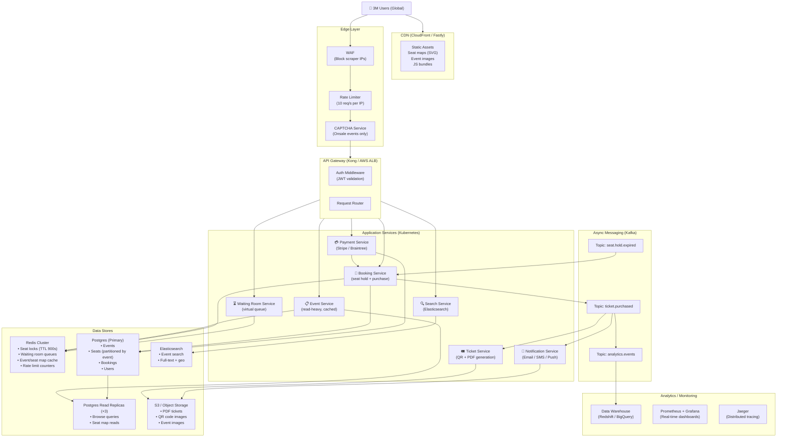

### Service Responsibilities

| Service | Responsibility | Tech Stack | Scaling Strategy |
|---------|---------------|------------|-----------------|
| Search Service | Event discovery, filters, geo search | Elasticsearch | Shard by event date |
| Event Service | Event metadata, venue info, seat maps | Postgres + Redis cache | Read replicas |
| Booking Service | Seat hold, purchase, cancel | Postgres + Redis | Horizontal (stateless) |
| Waiting Room | Virtual queue for onsale events | Redis sorted sets | Single node per event |
| Payment Service | Stripe/Braintree integration | Postgres (idempotency keys) | Horizontal |
| Ticket Service | PDF generation, QR codes | S3 + async workers | Queue-driven |
| Notification Service | Email, SMS, push | SendGrid / Twilio | Queue-driven |

---

## Seat Map Problem

### How Do You Show 20,000 Seats in Real Time?

A venue has 20,000 seats. Each seat has one of three states: `available`, `held`, `sold`. How do you:
1. Store this efficiently
2. Serve updates to millions of users simultaneously
3. Update a specific seat in under 1ms

**Three approaches for seat map storage**:

---

**Approach A: One DB Row Per Seat**

```
Table: seats
  seat_id | event_id | section | row | number | status
  ---------------------------------------------------
  14B      | E42      | Floor   | 14  | B      | available
  14C      | E42      | Floor   | 14  | C      | held
  ...      (20,000 rows per event)
```

Query to get available floor seats: `SELECT seat_id FROM seats WHERE event_id='E42' AND status='available' AND section='Floor'`

- Read: Full table scan → slow (20,000 rows, even with index)
- Write: Single row update → fast
- Real-time broadcast: SELECT polling every 2s → 50M queries/day for popular events
- Verdict: Simple, but doesn't scale for real-time display

---

**Approach B: Bitmap Per Event Section**

**Core idea**: Represent each seat as a single bit. Seat 1 = bit 0, Seat 2 = bit 1, etc. 20,000 seats = 20,000 bits = 2,500 bytes = **2.5KB per event section**.

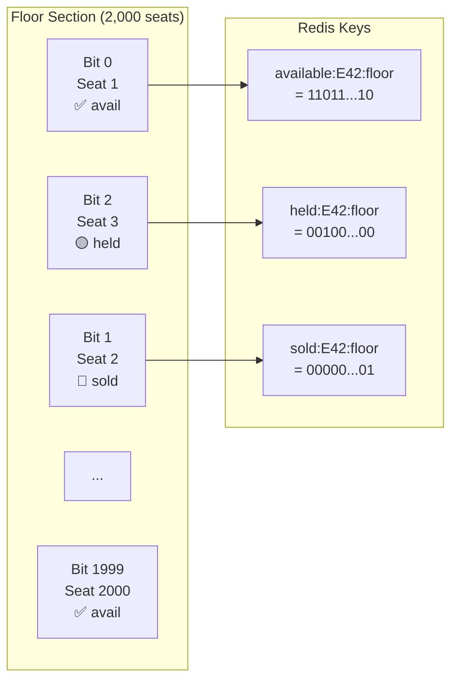

**Pseudo-code for bitmap operations**:

```
-- Check if seat N is available:
function isSeatAvailable(eventId, section, seatIndex):
    bitValue = redis.GETBIT("available:{eventId}:{section}", seatIndex)
    return bitValue == 1

-- Hold a seat (mark as held, clear from available):
function holdSeatBitmap(eventId, section, seatIndex, userId):
    -- Atomic: use Redis pipeline or Lua script
    lua = """
        local available = redis.call('GETBIT', KEYS[1], ARGV[1])
        if available == 0 then return 0 end  -- not available
        redis.call('SETBIT', KEYS[1], ARGV[1], 0)  -- clear available bit
        redis.call('SETBIT', KEYS[2], ARGV[1], 1)  -- set held bit
        return 1
    """
    result = redis.eval(lua,
        keys=["available:{eventId}:{section}", "held:{eventId}:{section}"],
        args=[seatIndex]
    )
    return result == 1  -- true if successfully held

-- Get all available seats in a section (for seat map display):
function getAvailableSeats(eventId, section):
    bitmap = redis.GET("available:{eventId}:{section}")
    return decodeBitmapToSeatNumbers(bitmap)

-- Count available seats in a section (for "X seats left" badge):
function countAvailable(eventId, section):
    return redis.BITCOUNT("available:{eventId}:{section}")
```

**Why bitmap wins for seat maps**:
- 2.5KB per section fits in L1 CPU cache — entire floor bitmap in 1 read
- BITCOUNT is O(n/8) — CPU instruction (POPCNT) — blazing fast
- GETBIT is O(1) — check any single seat instantly
- Send the entire bitmap to the frontend → browser renders the SVG seat map client-side

---

**Approach C: Section-Level Cache with Delta Updates**

Group seats into sections (Floor, Pit, Level 1, Level 2, etc.). Cache section-level availability counts. Send delta updates via WebSocket when individual seats change.

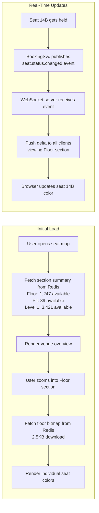

**Seat map comparison**:

| Approach | Storage | Read latency | Real-time updates | Best for |
|----------|---------|-------------|-------------------|----------|
| DB rows | 2MB per event | 50ms (query) | Polling (stale) | Simple apps |
| Redis bitmap | 2.5KB per section | < 1ms | Pub/Sub delta | High-traffic events |
| Section cache | ~100 bytes metadata | < 1ms | WebSocket delta | Recommended |

**Production recommendation**: Use Redis bitmaps as the source of truth for availability. Use WebSockets to push delta changes (seat X changed to held/sold) to all connected clients viewing that section. Full seat map is rendered client-side from the bitmap.

---

## Anti-Bot Defense

### The Scalper Problem

Scalpers use automated bots to:
- Buy 100+ tickets in the first second
- Hold seats programmatically to block legitimate buyers
- Resell at 10x markup

In 2022, Ticketmaster's Taylor Swift onsale saw an estimated 3.5 billion bot requests in the first hour.

```mermaid
flowchart TD
    subgraph "Normal User Flow"
        A1[Open browser] --> A2[Solve CAPTCHA]
        A2 --> A3[Enter waiting room]
        A3 --> A4[Receive position in queue]
        A4 --> A5[Wait fair turn]
        A5 --> A6[Get access to booking]
    end

    subgraph "Scalper Bot Flow (Blocked)"
        B1[1000 concurrent HTTP requests] --> B2[WAF: IP rate limit\n> 10 req/s → block]
        B2 --> B3[Rotate IPs\n→ Residential proxy]
        B3 --> B4[Behavioral analysis:\nNo mouse movement,\nNo time on page → flag]
        B4 --> B5[CAPTCHA challenge\n→ Bot fails]
        B5 --> B6[❌ Bot blocked\nReal user continues]
    end
```

### Defense Layers (in order)

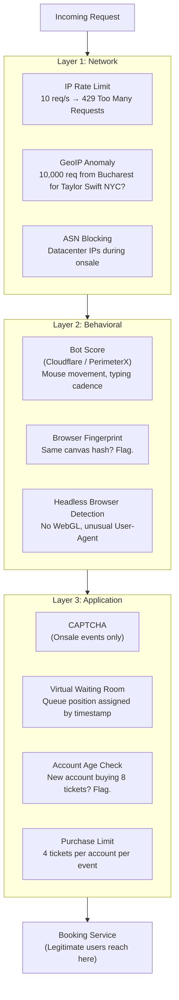

### Virtual Waiting Room

For high-demand events, a virtual queue is mandatory — it prevents server overload and ensures fairness.

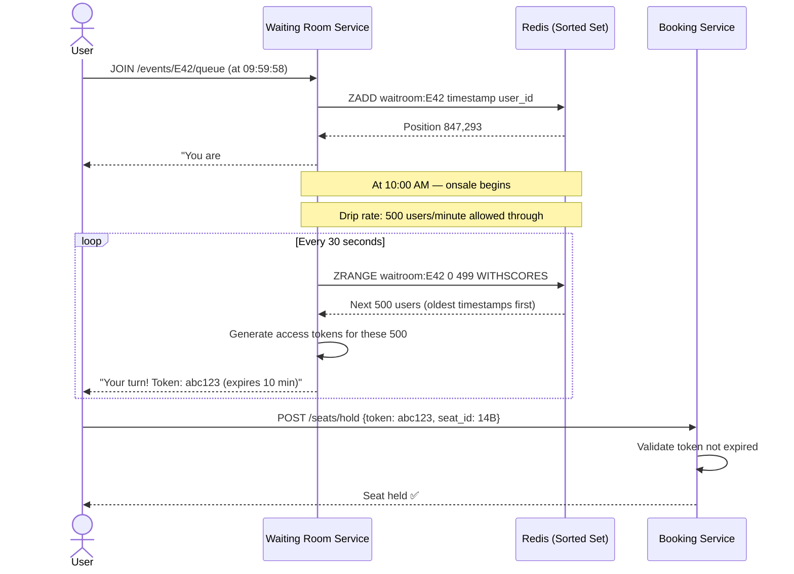

**Why Redis sorted sets for waiting rooms**:
- `ZADD`: O(log N) — add user with timestamp as score
- `ZRANGE`: O(log N + M) — get next M users by oldest timestamp
- `ZCARD`: O(1) — get queue length for "X people ahead of you"
- A single Redis node handles 1M+ queue members with < 1ms operations

---

## Payment Integration

### The Two-Phase Commit Problem

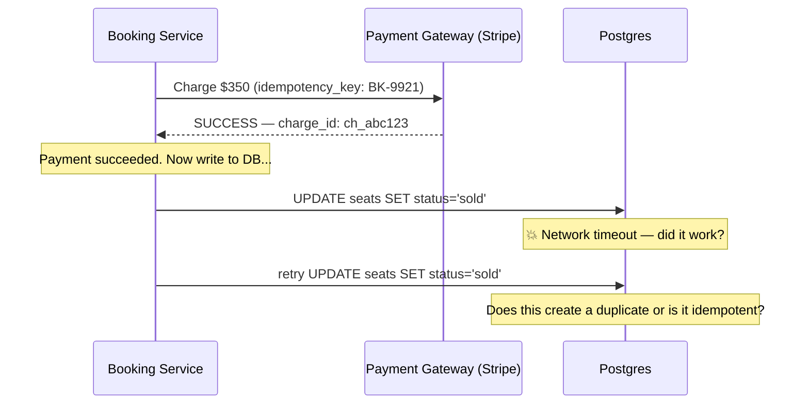

**Problem**: Payment succeeded, but DB write timed out. Did the seat get marked as sold? If Booking Service retries the DB write — is it safe? If it doesn't retry — the seat is stuck as "held" until TTL expires, and the customer paid but has no ticket.

### Solution: Idempotency Keys + Saga Pattern

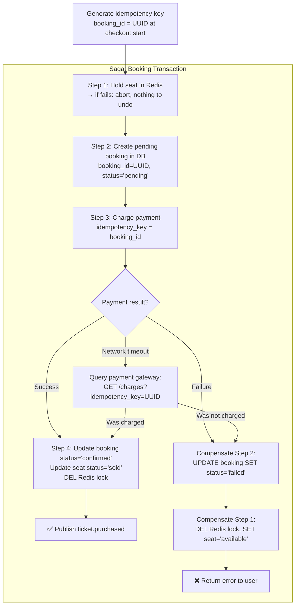

**Idempotency key rules**:

```
Idempotency key = booking_id (UUID generated when user starts checkout)

Rule 1: Same booking_id + same amount = same charge, no duplicate
Rule 2: Stripe stores idempotency keys for 24 hours
Rule 3: If payment call times out, re-call with same key — safe to retry
Rule 4: DB write uses booking_id as primary key — INSERT ON CONFLICT DO NOTHING (idempotent)
```

**Two critical insights**:
1. **Never generate the idempotency key inside the payment call** — generate it before and store it. This survives crashes.
2. **Query the payment gateway on timeout** rather than blindly retrying — avoids double charging.

---

## Problems at Scale

### Problem 1: The Taylor Swift Problem (3M Users at 10:00 AM)

**Scenario**: 3 million users have been waiting. The clock hits 10:00:00. They all click simultaneously.

```mermaid
graph TD
    A["3M users at 10:00:00 AM"] --> B

    subgraph "Without Queue — Disaster"
        B[All hit API simultaneously]
        B --> C[50,000 RPS hits app servers]
        C --> D[Connection pool exhausted in 200ms]
        D --> E[DB accepts 0 new connections]
        E --> F[Application returns 503]
        F --> G[All 3M users see error\nAnd retry immediately\n→ thundering herd]
    end

    subgraph "With Virtual Queue — Controlled"
        B2[All 3M users → Waiting Room Service]
        B2 --> C2[Each gets queue position\nby arrival timestamp]
        C2 --> D2[500 users/minute\nreleased into booking flow]
        D2 --> E2[App servers see 8 RPS\n(manageable load)]
        E2 --> F2[Users fill 20,000 seats\nin 40 minutes]
        F2 --> G2[Fair, no crashes, no bots]
    end
```

**Numbers**:
- Without queue: 50,000 RPS → ~250 RPS per app server (×200) → DB saturates
- With queue: 500 users/min = 8.3 RPS → trivially handled

---

### Problem 2: Seat Lock Expiry Race (The T=14:59 Problem)

**Scenario**: User A holds seat 14B. Their 15-minute lock expires at T=15:00. At T=14:59, User B grabs the seat. At T=15:01, User A completes payment.

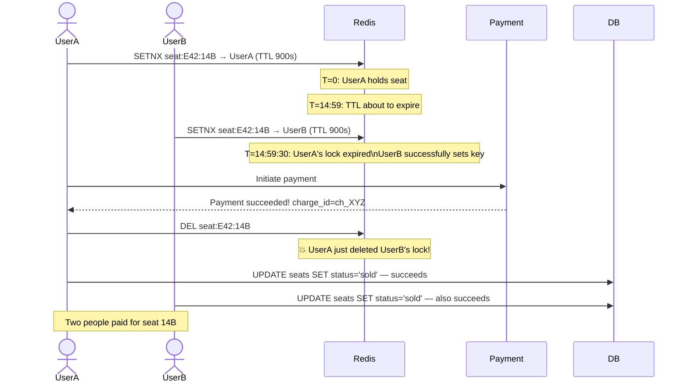

**Fix: Extend lock on payment initiation + owner-check before DELETE**:

```
-- When user clicks "Pay Now", extend the lock:
function extendLockForPayment(eventId, seatId, userId):
    lua = """
        -- Only extend if WE own the lock
        if redis.call('GET', KEYS[1]) == ARGV[1] then
            return redis.call('EXPIRE', KEYS[1], 1800)  -- extend to 30 min
        else
            return 0  -- lock expired, owned by someone else
        end
    """
    result = redis.eval(lua, keys=["seat:{eventId}:{seatId}"], args=[userId])
    if result == 0:
        return ERROR("Your seat hold expired. Please try again.")
    return OK("Lock extended for payment")

-- When releasing, only delete if still owner:
function releaseOwnedLock(eventId, seatId, userId):
    lua = """
        if redis.call('GET', KEYS[1]) == ARGV[1] then
            return redis.call('DEL', KEYS[1])
        else
            return 0
        end
    """
    redis.eval(lua, keys=["seat:{eventId}:{seatId}"], args=[userId])
```

**Why Lua scripts for this**: Redis Lua scripts are atomic — no other command can execute between the GET and DEL. Without Lua, there's still a race between "check if owner" and "delete".

---

### Problem 3: Database Write Contention (All 20K Seats, Same Table)

**Scenario**: An event goes on sale. All 20,000 seats are in one table. 50,000 concurrent updates hit the same partition.

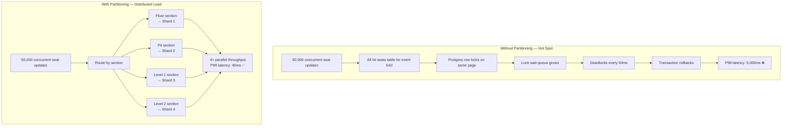

**Partitioning strategy**:

```
-- Partition seats table by (event_id, section)
-- Postgres declarative partitioning:

CREATE TABLE seats (
    seat_id   TEXT,
    event_id  TEXT,
    section   TEXT,   -- 'floor', 'pit', 'level1', 'level2'
    row       TEXT,
    number    INT,
    status    TEXT DEFAULT 'available',
    held_by   TEXT,
    held_until TIMESTAMPTZ
) PARTITION BY LIST (section);

CREATE TABLE seats_floor  PARTITION OF seats FOR VALUES IN ('floor');
CREATE TABLE seats_pit    PARTITION OF seats FOR VALUES IN ('pit');
CREATE TABLE seats_level1 PARTITION OF seats FOR VALUES IN ('level1');
CREATE TABLE seats_level2 PARTITION OF seats FOR VALUES IN ('level2');

-- Index per partition (much smaller, faster)
CREATE INDEX ON seats_floor (event_id, status);
CREATE INDEX ON seats_pit   (event_id, status);
```

**Result**: Each partition is ~1/4 the size. Updates to Floor seats don't block Level 2 updates. Write throughput scales linearly with partition count.

---

### Problem 4: QR/PDF Ticket Generation at Scale

**Scenario**: 100,000 tickets sold in 30 minutes. Synchronous PDF generation blocks booking confirmation.

```mermaid
flowchart LR
    subgraph "Synchronous (Bad) ❌"
        A1[Booking confirmed] --> B1[Generate PDF — 500ms]
        B1 --> C1[Upload to S3 — 200ms]
        C1 --> D1[Generate QR code — 100ms]
        D1 --> E1[Return to user — 800ms total]
        Note1["100K tickets × 800ms = 22 hours\n(or 137 servers working simultaneously)"]
    end

    subgraph "Async Queue (Good) ✅"
        A2[Booking confirmed] --> B2[Publish ticket.purchased to Kafka]
        B2 --> C2[Return booking_id to user immediately\n< 50ms]
        B2 --> D2[Kafka consumer pool\n(50 workers × parallel processing)]
        D2 --> E2[Generate PDF + QR\n500ms per ticket]
        E2 --> F2[Upload to S3]
        F2 --> G2[Email user with download link]
        Note2["100K tickets / 50 workers = 2,000 tickets/worker\n2,000 × 500ms / worker = 1,000 seconds = 17 min ✅"]
    end
```

**Ticket generation pseudo-code**:

```
-- Kafka consumer: TicketGenerationWorker
function onTicketPurchased(event):
    booking = db.getBooking(event.booking_id)

    for each seat in booking.seats:
        -- Generate unique token (prevents QR reuse after resale/transfer)
        qrToken = sign(
            payload = { booking_id, seat_id, event_id, holder_user_id },
            secret = TICKET_SIGNING_KEY,
            algorithm = "HS256"
        )

        -- Generate QR code image
        qrImage = qrcode.generate(qrToken, size=300)
        s3.upload("qr/{booking_id}/{seat_id}.png", qrImage)

        -- Generate PDF with seat details
        pdf = pdfGenerator.render({
            event: booking.event,
            seat: seat,
            holder: booking.user,
            qr_image: qrImage,
            barcode: booking_id
        })
        s3.upload("tickets/{booking_id}/{seat_id}.pdf", pdf)

    -- Update booking with ticket URLs
    db.updateBooking(booking.id, {
        ticket_urls: [s3URLs],
        qr_tokens: [qrTokens],
        generated_at: now()
    })

    -- Notify user
    kafka.publish("email.send", {
        to: booking.user.email,
        template: "ticket_ready",
        data: { download_links: s3URLs }
    })
```

---

### Problem 5: Resale and Transfer — Invalidating Old QR Codes

**Scenario**: User A buys a ticket and lists it on StubHub. User B buys from StubHub. Now both have a QR code for seat 14B. Who gets in?

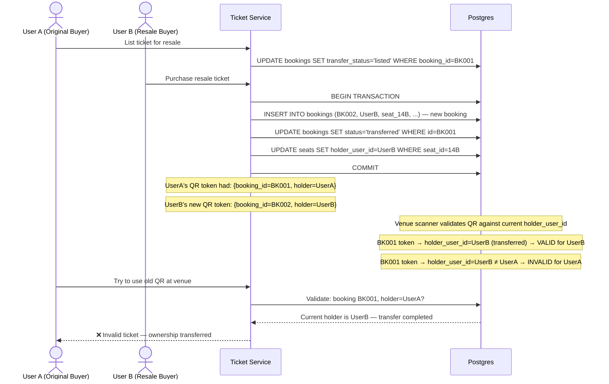

**Key insight**: The QR code doesn't contain the ticket's current ownership state — it contains a booking_id. The validator looks up the *current* holder in the database at scan time. When a ticket is transferred, the `holder_user_id` changes in the database — old QR codes automatically become invalid without regenerating them.

---

## Database Schema

### Core Tables (Pseudo-code)

```
-- Events: what's being sold
Table: events
  event_id        UUID          PRIMARY KEY
  venue_id        UUID          REFERENCES venues(venue_id)
  name            TEXT          NOT NULL
  artist          TEXT
  date            TIMESTAMPTZ   NOT NULL
  total_seats     INT           NOT NULL
  onsale_at       TIMESTAMPTZ   NOT NULL
  status          TEXT          DEFAULT 'upcoming'  -- upcoming, onsale, soldout, cancelled
  created_at      TIMESTAMPTZ   DEFAULT now()

  INDEX (date, status)
  INDEX (onsale_at)  -- for "upcoming onsales" feature

-- Venues: physical spaces
Table: venues
  venue_id        UUID          PRIMARY KEY
  name            TEXT
  city            TEXT
  state           TEXT
  country         TEXT
  capacity        INT
  seat_map_url    TEXT          -- SVG seat map in S3

-- Seats: one row per seat per event
Table: seats
  seat_id         TEXT          -- "floor-14-B" (human-readable)
  event_id        UUID          REFERENCES events
  section         TEXT          -- 'floor', 'level1', etc.
  row             TEXT
  number          INT
  status          TEXT          DEFAULT 'available'  -- available, held, sold
  price_tier      TEXT          -- 'vip', 'standard', 'obstructed'
  price_cents     INT
  held_by         UUID          REFERENCES users
  held_until      TIMESTAMPTZ
  holder_user_id  UUID          REFERENCES users     -- current owner (changes on transfer)

  PRIMARY KEY (seat_id, event_id)
  INDEX (event_id, status)          -- "available seats for event X"
  INDEX (event_id, section, status) -- "available floor seats for event X"
  PARTITION BY LIST (section)       -- as described above

-- Bookings: purchase records
Table: bookings
  booking_id      UUID          PRIMARY KEY   -- also the idempotency key
  user_id         UUID          REFERENCES users
  event_id        UUID          REFERENCES events
  seat_ids        TEXT[]        -- array of seat_ids
  status          TEXT          -- pending, confirmed, cancelled, transferred
  payment_id      TEXT          -- Stripe charge_id
  payment_intent  TEXT          -- Stripe payment_intent_id (for refunds)
  total_cents     INT
  transfer_status TEXT          -- null, listed, transferred
  ticket_urls     TEXT[]        -- S3 URLs for PDFs
  qr_tokens       TEXT[]        -- signed JWT tokens for each seat
  created_at      TIMESTAMPTZ   DEFAULT now()
  confirmed_at    TIMESTAMPTZ
  generated_at    TIMESTAMPTZ   -- when tickets were generated

  INDEX (user_id, event_id)
  INDEX (payment_id)
  INDEX (status, event_id)

-- Users: basic user profile
Table: users
  user_id         UUID          PRIMARY KEY
  email           TEXT          UNIQUE
  phone           TEXT
  name            TEXT
  created_at      TIMESTAMPTZ
  is_verified     BOOLEAN       DEFAULT false
  purchase_count  INT           DEFAULT 0  -- anti-bot signal
```

### Redis Key Patterns

```
-- Seat locks (15-min hold)
seat:{event_id}:{seat_id}               → user_id               TTL: 900s

-- Waiting room queue (sorted by join timestamp)
waitroom:{event_id}                     → sorted set
  ZADD waitroom:E42 1709123456.789 user_id_123

-- Waiting room access tokens (granted when it's your turn)
waitroom_token:{event_id}:{token}       → user_id               TTL: 600s (10 min to act)

-- Event/seat count cache
event:{event_id}:available_count        → integer               TTL: 30s
event:{event_id}:section:{section}:count → integer              TTL: 30s

-- Seat map bitmap (availability per section)
available:{event_id}:{section}          → bitmap (1 bit/seat)   TTL: none (permanent until event)
held:{event_id}:{section}              → bitmap (1 bit/seat)   TTL: none
sold:{event_id}:{section}              → bitmap (1 bit/seat)   TTL: none

-- Rate limiting (per user/IP)
ratelimit:{user_id}:{minute_bucket}     → request count         TTL: 120s
ratelimit:ip:{ip_address}:{minute_bucket} → request count       TTL: 120s

-- Idempotency keys (prevent duplicate bookings)
idem:{booking_id}                       → payment_result_json   TTL: 86400s (24h)
```

### Write Patterns and Consistency Guarantees

```
-- Seat hold: Redis first, DB second
-- If Redis succeeds but DB fails: compensate (DEL Redis key) → consistent
-- If Redis fails: return error immediately → no DB write needed

-- Payment confirmation: DB is source of truth
-- If payment succeeds but DB write fails: retry with same booking_id (idempotent INSERT)
-- If DB write succeeds but Redis DEL fails: seat shows as held in Redis but sold in DB
--   → On next SETNX attempt, Redis returns existing key (user_id), app checks DB → sold
--   → Garbage collected on TTL expiry (worst case: 15 minutes of incorrect UI state)

-- Consistency: DB is authoritative for seat ownership
--              Redis is cache/lock layer only
--              Any discrepancy: DB wins on next check
```

---

## Interview Q&A Map

Map each common interview question to the specific mechanism in this system.

| Interview Question | Answer (cite mechanism) |
|--------------------|------------------------|
| "How do you prevent double booking?" | Redis SETNX is atomic — only one client can acquire the lock. DB update uses `AND status='available'` as a secondary guard. Two-layer defense. |
| "What if the user pays but the seat is taken?" | Idempotency key = booking_id. Payment gateway deduplicates. DB INSERT uses booking_id as primary key — idempotent. Saga compensates on failure. |
| "How do you handle 3M concurrent users?" | Virtual waiting room (Redis sorted set). Drip rate of 500/min. App servers see 8 RPS instead of 50,000 RPS. |
| "What's the consistency model?" | Seat booking: **strong consistency** (Redis atomic lock + DB transaction). Seat map display: **eventual consistency** (bitmap cache, 30s refresh). Analytics: **eventual** (Kafka async). |
| "What if Redis goes down?" | Redis Cluster with 3+ replicas. During failover (100–200ms gap), fall back to DB pessimistic locks temporarily. Alert on Redis unavailability. |
| "What if the payment succeeds but booking DB is down?" | Query payment gateway with idempotency key before retrying. Use outbox pattern — write payment success to a local table first, async worker syncs to booking table. |
| "How do you scale for 10,000 events simultaneously?" | Partition by event_id. Each event is independent. Redis keys are namespaced by event_id. No cross-event contention. |
| "How do you handle ticket resale?" | QR codes contain booking_id, not ownership. Validator queries DB for current holder. Transfer atomically changes holder_user_id in DB. Old QR automatically invalid. |
| "How would you add seat upgrade mid-session?" | Atomic swap: acquire lock on new seat, release lock on old seat (Lua script). Both or neither. |
| "What's your database schema for seats?" | seats table partitioned by section, indexed on (event_id, status). Each seat row has status, held_by, held_until fields. See schema above. |

---

## Key Takeaways

- **Never use DB-level row locks for seat reservations at scale** — `SELECT FOR UPDATE` starves connections when 10,000 users compete; Redis SETNX handles 1M ops/sec on a single node and expires automatically

- **A 15-minute seat hold requires three things**: Redis key with 900s TTL (for auto-expiry), idempotent booking_id UUID (for payment deduplication), and a Lua script for owner-checked lock extension (to prevent the T=14:59 race)

- **Peak load for popular events can be 600× normal traffic** (50,000 RPS vs ~83 RPS baseline) — a virtual waiting room is not optional; it's the only mechanism that prevents thundering-herd server collapse

- **Ticket overbooking prevention requires two guards**: the Redis SETNX (fast, distributed, handles concurrent holds) AND the DB update's `WHERE status='available'` clause (slow guard, catches Redis cache staleness); neither alone is sufficient

- **Two-phase commit is too slow and fragile for payment + booking** — use the Saga pattern with idempotency keys; when a payment gateway call times out, re-query with the same key rather than retrying blindly, and always generate the idempotency key before the call, not inside it

---

## Related Concepts

| Topic | Why It's Relevant |
|-------|-------------------|
| [Race Conditions](/problems-at-scale/concurrency/race-conditions) | The fundamental problem Ticketmaster solves — Lost Update pattern |
| [Double Booking](/problems-at-scale/concurrency/double-booking) | Same problem in hotel/airline context — same Redis TTL solution |
| [Distributed Locking](/05-distributed-systems/concepts/distributed-locks) | Redis SETNX mechanics, Redlock for multi-node safety |
| [Saga Pattern](/10-architecture/patterns/saga-pattern) | Payment + booking coordination without two-phase commit |
| [Redis Data Structures](/03-redis/concepts/data-structures) | Sorted sets for queues, bitmaps for seat maps, strings for locks |
| [Database Partitioning](/01-databases/concepts/partitioning) | Why partitioning by section reduces hot-spot contention |
| [Idempotency](/07-api-design/concepts/idempotency) | Why booking_id must be generated before the payment call |
| [Virtual Queues](/06-scalability/patterns/queue-based-load-leveling) | Drip-rate pattern for onsale load management |

---

## References

- 📖 [System Design Interview – Alex Xu, Chapter 10 (Ticketmaster)](https://www.amazon.com/System-Design-Interview-Insiders-Guide/dp/1736049119) — The canonical interview prep reference for this problem
- 📖 [How Ticketmaster Handles 50,000 Requests Per Second](https://www.infoq.com/presentations/ticketmaster-architecture/) — Real architecture presentation from Ticketmaster engineers
- 📖 [Avoiding Double Bookings in Distributed Systems](https://particular.net/blog/you-cant-have-a-rollback-button) — Why you can't use a rollback button and why Sagas matter
- 📖 [Redis Documentation: SET NX EX](https://redis.io/commands/set/) — The atomic SET + NX + EX command that makes distributed locks possible
- 📺 [Distributed Locking with Redis — Martin Kleppmann](https://martin.kleppmann.com/2016/02/08/how-to-do-distributed-locking.html) — The Redlock algorithm and its trade-offs
- 📖 [PostgreSQL Table Partitioning](https://www.postgresql.org/docs/current/ddl-partitioning.html) — Official docs for LIST partitioning used for seat sections
- 📖 [Stripe Idempotency Keys](https://stripe.com/docs/api/idempotent_requests) — How payment gateways handle duplicate requests safely
