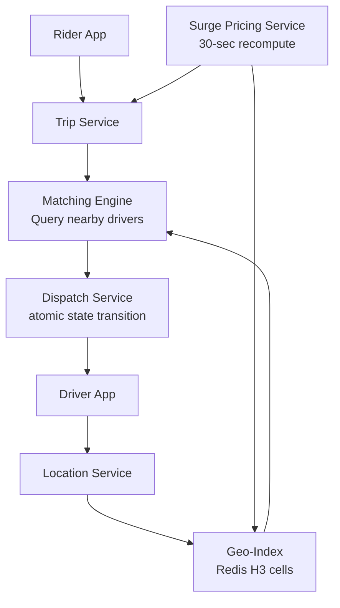
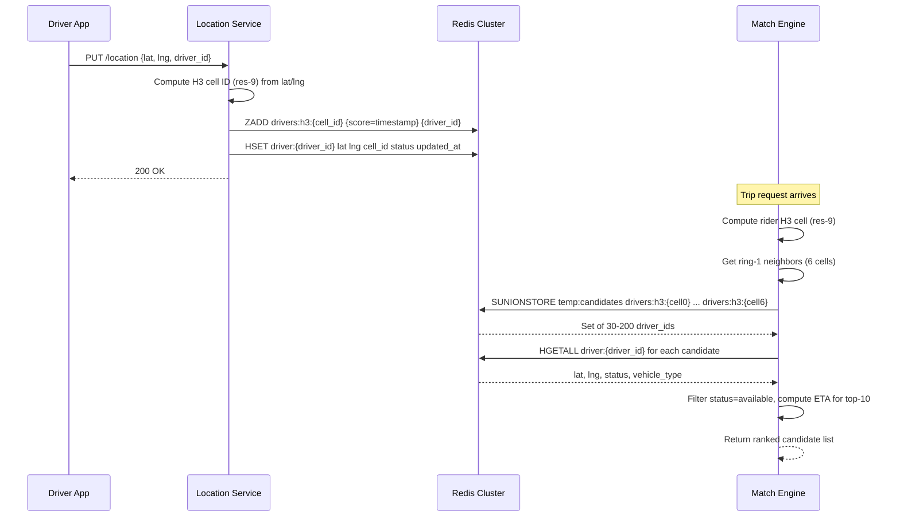
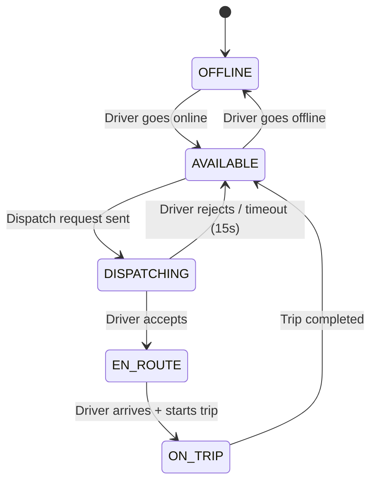

# Design Uber Backend — Dispatch at Scale

**Difficulty**: 🔴 Advanced
**Reading Time**: 25 minutes
**Interview Frequency**: Very High

---

## The Core Problem

Matching 20 million daily trips between riders and drivers with sub-5-second dispatch requires finding available drivers within 2km in real-time across dynamic location data updating every 4 seconds. The system must handle surge pricing calculation, ETA computation, and route optimization simultaneously while maintaining consistency on driver state (not dispatching same driver to two riders).

## Functional Requirements

- Riders request a trip with pickup/dropoff location
- System finds and dispatches nearest available driver within 5 seconds
- Real-time driver location tracking (updates every 4 seconds)
- Dynamic surge pricing based on supply/demand ratio per region
- ETA computation for rider and driver

## Non-Functional Requirements

| Requirement | Target |
|-------------|--------|
| Dispatch latency | < 5 seconds from request to driver acceptance |
| Location freshness | Driver positions updated every 4 seconds |
| Availability | 99.99% (52 min/year) |
| Scale | 20M trips/day, 5M concurrent drivers globally |

## Back-of-Envelope Estimates

- **Location updates**: 5M active drivers × (1 update / 4 seconds) = 1.25M location writes/sec
- **Geo-index memory**: 5M drivers × 64 bytes per location record = 320MB — fits in Redis
- **Matching search**: Each trip request queries drivers within 2km radius → avg 50 candidates → rank by ETA

## Key Design Decisions

1. **H3 Hexagonal Grid for Geo-Indexing** — divide city into hexagonal cells at multiple resolutions; index drivers by cell ID; to find nearby drivers, query hex + 6 neighbors; avoids border effects of square grids; Uber open-sourced H3 for exactly this.
2. **Driver State Machine with Atomic Transitions** — driver states: available → dispatching → en-route → on-trip; use Redis atomic operations (WATCH + MULTI) to transition driver from "available" to "dispatching"; prevents two simultaneous dispatch to same driver.
3. **Surge Pricing via Demand/Supply Ratio** — compute supply (available drivers) and demand (open requests) per H3 cell every 30 seconds; surge multiplier = f(demand/supply); pre-compute for all cells, cache result; update every 30 seconds not on every request.

## High-Level Architecture



## Top Interview Questions for This Problem

| Question | Tests |
|----------|-------|
| How do you ensure the same driver isn't dispatched to two riders simultaneously? | Atomic state transitions, distributed locking |
| How do you find the nearest available driver in under 500ms? | Geo-indexing, spatial data structures |
| How would you compute surge pricing for 1 million city zones every 30 seconds? | Batch computation, caching, pre-aggregation |

## Related Concepts

- [Food delivery app (similar dispatch pattern)](./food-delivery)
- [Distributed locking for driver state transitions](../05-infrastructure/distributed-locking)

---

## Component Deep Dive 1: Geospatial Index (H3-Based Driver Location Store)

The geospatial index is the most critical subsystem in dispatch — every trip request, every ETA computation, and every surge pricing window depends on it. At Uber's scale, 1.25 million driver location writes per second must land in a structure that can answer "give me all available drivers within 2km of this point" in under 50ms.

### Why Naive Approaches Fail

**Approach 1 — Full table scan**: A SQL `SELECT * FROM drivers WHERE status = 'available'` + Haversine distance filter on 5M rows takes 2-5 seconds per query. At 5,000 trip requests/second peak, this is immediately fatal.

**Approach 2 — Bounding box SQL index**: `WHERE lat BETWEEN x1 AND x2 AND lng BETWEEN y1 AND y2` with a composite index reduces scan to ~10,000 candidates but still requires computing actual distance for each row. Worse, it creates uneven cell sizes (longitude degrees shrink near poles) and suffers from boundary artifacts when a zone straddles two index partitions.

**Approach 3 — PostGIS / Geohash**: Geohash divides the world into a Z-order curve of rectangular cells. Each cell gets a base-32 string. Prefix queries (`WHERE geohash LIKE 'dr5r%'`) fetch nearby cells. The problem: rectangular cells have inconsistent neighbor distances — a corner neighbor is 41% farther than an edge neighbor at the same hash prefix length. This means your "2km radius" search either misses drivers in corners or over-fetches from far-away cells.

### Why H3 Wins

Uber's H3 uses an icosahedron-projected hexagonal grid. Every hexagon has exactly 6 equidistant neighbors. A resolution-9 cell covers ~0.1km², resolution-7 covers ~5km². To find drivers within 2km, you query the rider's resolution-9 cell + its 6 immediate neighbors (ring 1) — 7 cells total, all equidistant. No corner artifacts, no over-fetching.

### Internal Architecture



### Trade-off Table: Geo-Index Implementations

| Approach | Query Latency | Write Throughput | Memory | Consistency |
|----------|--------------|-----------------|--------|-------------|
| H3 + Redis ZADD | 5–15ms | 1.5M writes/sec (cluster) | 320MB for 5M drivers | Eventual (async replication) |
| PostGIS (Postgres) | 50–200ms | 50k writes/sec | 4GB+ with indexes | Strong (MVCC) |
| Geohash + Redis | 5–15ms | 1.5M writes/sec | 300MB | Eventual |
| Elasticsearch geo_point | 20–80ms | 200k writes/sec | 2GB | Near-real-time (1s lag) |

**Verdict**: H3 + Redis wins on latency and write throughput. PostGIS is kept as secondary store for analytics and historical trip data, not live dispatch.

### Sharding Strategy

320MB fits in a single Redis node but creates a hot-spot on writes. Uber shards Redis by city prefix: `drivers:h3:SFO:{cell_id}`, `drivers:h3:NYC:{cell_id}`. City-level sharding keeps related queries on the same shard and allows city-by-city scaling. At peak (NYC rush hour), a single city shard handles ~120k writes/sec — well within Redis's 500k ops/sec single-thread limit with pipelining.

---

## Component Deep Dive 2: Driver State Machine and Dispatch Concurrency

The dispatch consistency problem is this: two trip requests arrive simultaneously, both find driver D-789 as the best candidate, and both attempt to dispatch D-789. If both succeed, the driver gets two simultaneous requests — the rider whose driver never shows up will churn.

### The State Machine



Transitions must be **atomic** — no two processes can transition the same driver from `AVAILABLE` simultaneously.

### Implementation Options

**Option A — Redis SETNX + TTL (Optimistic Lock)**

```
SETNX lock:driver:{id} {trip_id}  # Returns 1 if acquired, 0 if already locked
EXPIRE lock:driver:{id} 15        # Auto-release if driver doesn't respond
```

This works but has a race: between SETNX and EXPIRE, the process can crash, leaving the lock indefinitely. Fix: use `SET key value NX PX 15000` (atomic set-with-expiry, available since Redis 2.6.12).

**Option B — Redis Lua Script (Atomic State Transition)**

```lua
-- Atomic: only transition if current state == expected
local current = redis.call('HGET', 'driver:' .. KEYS[1], 'status')
if current == ARGV[1] then
  redis.call('HSET', 'driver:' .. KEYS[1], 'status', ARGV[2])
  redis.call('HSET', 'driver:' .. KEYS[1], 'trip_id', ARGV[3])
  return 1
else
  return 0
end
```

Lua scripts execute atomically in Redis — no WATCH/MULTI needed. This is Uber's actual approach: the Lua script checks `status == 'available'` and sets `status = 'dispatching'` atomically. If two dispatch requests race, exactly one gets return value 1.

**Option C — Optimistic Locking with Postgres CAS**

```sql
UPDATE drivers
SET status = 'dispatching', trip_id = $1, updated_at = NOW()
WHERE driver_id = $2
  AND status = 'available'
  AND updated_at = $3;  -- version check
```

Returns rows_affected = 1 on success, 0 on conflict. Works but Postgres at 50k concurrent trips/sec creates hot rows and lock contention. Acceptable for writes to the authoritative record but too slow for the dispatch fast path.

### What Happens at 10x Load

At 10x, Uber handles 50k trip requests/second. Each request attempts atomic state transitions on 1–5 candidate drivers before finding one who accepts. That's 50k–250k Redis CAS operations/second. A single Redis shard handles ~500k simple ops/sec but Lua scripts are heavier — practical limit ~200k/sec. At this scale, Uber shards the driver state store by geographic region: NYC drivers on NYC-state-cluster, SF drivers on SF-state-cluster. The dispatch service routes to the correct shard using the same H3 city prefix as the geo-index.

---

## Component Deep Dive 3: Surge Pricing Computation

Surge pricing multiplies the base fare when demand exceeds supply in a geographic zone. The math is simple: `surge_multiplier = max(1.0, f(open_requests / available_drivers))`. The engineering challenge is computing this across millions of H3 cells every 30 seconds without blocking trip requests.

### Architecture

The surge pricing service runs as an independent batch loop:

1. Every 30 seconds, a Kafka consumer reads location events and trip-request events from the last 30s window.
2. For each H3 resolution-7 cell (~5km² — large enough for meaningful supply/demand signal), compute `demand = count(trip_requests)` and `supply = count(available_drivers)`.
3. Apply the multiplier function (Uber uses a smoothed step function, not linear, to avoid sudden 2x jumps at a single new request).
4. Write the result to a Redis hash: `HSET surge:h3r7:{cell_id} multiplier 1.8 expires_at {ts+30s}`.
5. Trip Service reads surge from Redis on every trip request — O(1) lookup, never blocks on computation.

### Why Pre-Computation, Not On-Demand

If surge were computed on each trip request, 5k requests/second × 30ms computation = 150k concurrent Kafka consumer threads. Pre-computing every 30 seconds means the computation workload is constant regardless of demand spikes. The trade-off: surge may lag by up to 30 seconds during a sudden event (stadium letting out, rainstorm). Uber accepts this lag — a 30-second stale surge is better than unbounded latency on the critical dispatch path.

### Smoothing to Prevent Instability

A naive linear multiplier creates oscillation: high surge → drivers flood the area → supply spikes → surge drops → drivers leave → surge spikes again. Uber applies exponential moving average across multiple 30-second windows and caps the rate of change at 0.2x per window. This dampens oscillation at the cost of slower surge response — acceptable since the rider-visible surge is already a communication tool, not a real-time signal.

---

## Data Model

### Driver Location (Redis — live dispatch store)

```
Key: driver:{driver_id}
Type: Hash
Fields:
  driver_id       VARCHAR(36)   -- UUID
  lat             FLOAT         -- current latitude (e.g., 37.7749)
  lng             FLOAT         -- current longitude (e.g., -122.4194)
  h3_cell_r9      BIGINT        -- H3 cell ID at resolution 9
  h3_cell_r7      BIGINT        -- H3 cell ID at resolution 7 (for surge lookup)
  status          ENUM          -- 'available'|'dispatching'|'en_route'|'on_trip'|'offline'
  vehicle_type    ENUM          -- 'uberx'|'uberxl'|'black'|'pool'
  current_trip_id VARCHAR(36)   -- NULL if not on trip
  updated_at      BIGINT        -- Unix ms timestamp of last location update
TTL: 20 seconds (auto-expire if driver app goes silent)

Key: drivers:h3:{h3_cell_r9}
Type: Sorted Set
Score: updated_at (Unix ms)
Member: driver_id
TTL: none (members auto-removed when driver hash expires via keyspace notification)
```

### Trip (Postgres — authoritative record)

```sql
CREATE TABLE trips (
    trip_id         UUID PRIMARY KEY DEFAULT gen_random_uuid(),
    rider_id        UUID NOT NULL REFERENCES users(user_id),
    driver_id       UUID REFERENCES drivers(driver_id),
    status          VARCHAR(20) NOT NULL DEFAULT 'requested',
                    -- requested | matching | accepted | en_route | in_progress | completed | cancelled
    pickup_lat      DECIMAL(9,6) NOT NULL,
    pickup_lng      DECIMAL(9,6) NOT NULL,
    dropoff_lat     DECIMAL(9,6) NOT NULL,
    dropoff_lng     DECIMAL(9,6) NOT NULL,
    pickup_h3_r9    BIGINT NOT NULL,         -- H3 cell at resolution 9
    pickup_h3_r7    BIGINT NOT NULL,         -- H3 cell at resolution 7 (for surge join)
    vehicle_type    VARCHAR(20) NOT NULL,
    surge_multiplier DECIMAL(4,2) NOT NULL DEFAULT 1.00,
    base_fare_cents  INTEGER,
    final_fare_cents INTEGER,
    estimated_eta_seconds INTEGER,
    requested_at    TIMESTAMPTZ NOT NULL DEFAULT NOW(),
    accepted_at     TIMESTAMPTZ,
    pickup_at       TIMESTAMPTZ,
    dropoff_at      TIMESTAMPTZ,
    cancelled_at    TIMESTAMPTZ,
    cancel_reason   VARCHAR(100)
);

CREATE INDEX idx_trips_rider_id     ON trips(rider_id, requested_at DESC);
CREATE INDEX idx_trips_driver_id    ON trips(driver_id, requested_at DESC);
CREATE INDEX idx_trips_status       ON trips(status) WHERE status NOT IN ('completed','cancelled');
CREATE INDEX idx_trips_pickup_h3    ON trips(pickup_h3_r7, requested_at);

CREATE TABLE drivers (
    driver_id       UUID PRIMARY KEY DEFAULT gen_random_uuid(),
    user_id         UUID NOT NULL REFERENCES users(user_id),
    vehicle_type    VARCHAR(20) NOT NULL,
    license_plate   VARCHAR(20),
    rating          DECIMAL(3,2) DEFAULT 5.00,
    total_trips     INTEGER DEFAULT 0,
    onboarded_at    TIMESTAMPTZ NOT NULL,
    is_active       BOOLEAN NOT NULL DEFAULT TRUE
);

CREATE TABLE surge_pricing_log (
    log_id          BIGSERIAL PRIMARY KEY,
    h3_cell_r7      BIGINT NOT NULL,
    multiplier      DECIMAL(4,2) NOT NULL,
    supply_count    INTEGER NOT NULL,     -- available drivers in cell
    demand_count    INTEGER NOT NULL,     -- open requests in cell
    computed_at     TIMESTAMPTZ NOT NULL,
    INDEX idx_surge_cell_time (h3_cell_r7, computed_at DESC)
);
```

---

## Scale Bottlenecks

| Traffic Level | Component That Breaks | Symptoms | Mitigation |
|---------------|----------------------|----------|------------|
| 10x baseline (12.5M location writes/sec) | Single Redis cluster for geo-index | CPU saturation, p99 write latency spikes to 200ms | Shard by city prefix; 20 cities × 625k writes/sec each is well within per-shard limits |
| 10x baseline (50k trip requests/sec) | Matching Engine fan-out | 50k × 7 Redis SUNION calls = 350k ops/sec; Redis Cluster starts dropping connections | Pre-shard match requests by city; parallelize SUNION with pipeline; use read replicas for geo-index queries |
| 100x baseline (125M location writes/sec) | Redis write throughput ceiling | Redis single-thread model saturates at ~1M ops/sec per node | Move to a purpose-built geo-store (custom in-memory service, or Apache Pinot with geospatial indexes); batch location writes every 2 updates instead of every 1 |
| 100x baseline (500k trip requests/sec) | Dispatch service atomic state transitions | Lua script contention on hot drivers (celebrities, large venues) | Circuit-break a single driver to max 3 concurrent dispatch attempts; back-pressure to matching engine |
| 1000x baseline | Everything | Network saturation, Kafka consumer lag hours, Postgres WAL explosion | Regional isolation (each metro runs its own stack); cross-region trip requests handled by edge routing; Postgres partitioned by city + month with logical replication to OLAP |

---

## How Uber Built This

Uber's engineering blog and conference talks (QCon, InfoQ, Strange Loop) document their dispatch architecture in detail.

**The real system (as of 2019–2023):**

Uber operates ~5 million active driver-partners globally, serving ~25 million trips/day at peak. Their dispatch stack generates approximately **1.3 million location writes per second** globally during peak hours (documented in "Uber's Fulfillment Platform" talk at QCon London 2019).

The geo-index is backed by a custom service called **Ringpop** (now open-sourced), which is a consistent hash ring over Node.js processes. Each node owns a set of H3 cells. Location updates are routed to the owning node via the ring — no Redis for the hottest path. Redis is a secondary cache for inter-service queries (matching engine reading from location service).

**Key non-obvious decision**: Uber does **not** dispatch the single closest driver. They dispatch to the driver with the lowest estimated time of arrival (ETA), computed using real-time traffic graph. The closest-by-straight-line driver might be 800 meters away but stuck behind a highway entrance; a driver 1.3km away on parallel streets arrives 90 seconds sooner. ETA computation runs on Uber's H3-segmented routing graph — pre-computed turn-by-turn speeds updated every 30 seconds from GPS probe data (from all Uber vehicles). This routing graph at city scale requires 8–15GB RAM per city, served from dedicated routing servers, not Redis.

**Scale numbers**:
- 5 million concurrent drivers globally
- 1.3 million location writes/second (peak)
- 95th percentile dispatch-to-acceptance time: 3.2 seconds
- Matching Engine processes 5,000 trip requests/second globally
- Surge pricing recomputes across ~2 million H3 resolution-7 cells every 30 seconds

Sources: Uber Engineering blog (eng.uber.com/h3, eng.uber.com/engineering-surge-pricing), QCon London 2019 "Uber's Fulfillment Platform", Strange Loop 2018 "Ringpop".

---

## Interview Angle

**What the interviewer is testing:** Whether you understand that "find nearest driver" is not a database query problem — it's a geospatial indexing problem. The interviewer wants to see if you know why naive SQL fails at 1M writes/sec and can articulate a spatial partitioning strategy without being prompted.

**Common mistakes candidates make:**

1. **Proposing SQL with `ORDER BY distance LIMIT 5`** — This requires a full table scan or at best a bounding box filter that still loads tens of thousands of rows into memory. At 5M concurrent drivers updating every 4 seconds, a relational DB is simply not the right tool for the live location store. Candidates who jump here haven't internalized the write volume.

2. **Ignoring the double-dispatch race condition** — Many candidates say "find closest driver, send them the request." When probed on "what if two riders request at the same time and both find the same driver?" they say "use a database transaction." That's vague and wrong — the geo-index is in Redis, not Postgres, and ACID transactions don't span heterogeneous stores. The correct answer requires naming the specific mechanism: Redis atomic Lua script or SET NX on a lock key.

3. **Making surge pricing synchronous** — Saying "when a rider requests a trip, compute supply and demand for their zone and return a surge multiplier" puts a 30–50ms computation on the critical dispatch path. At 5k requests/second this creates a 150–250ms latency penalty and creates a surge computation service that must scale linearly with trip requests. Pre-computation every 30 seconds decouples surge latency from trip request volume.

**The insight that separates good from great answers:** Understanding that **ETA, not distance, is the correct ranking metric** for dispatch — and that computing ETA requires a real-time traffic-weighted routing graph, not Euclidean distance. Great candidates explain that the routing graph is pre-computed on H3 cells with speed profiles updated from probe data, and that this graph must be in-memory (not fetched per query from a graph DB) to meet the 500ms matching SLA.

---

## Key Numbers to Remember

| Metric | Value | Context |
|--------|-------|---------|
| Location write rate | 1.25M writes/sec | 5M drivers × 1 update/4s |
| Geo-index memory | 320MB | 5M drivers × 64 bytes each — fits single Redis node |
| H3 resolution-9 cell area | ~0.1 km² | Used for driver-to-cell mapping in dispatch |
| H3 resolution-7 cell area | ~5.16 km² | Used for surge pricing zones |
| Dispatch candidates per query | 30–200 | Drivers in 7-cell H3 ring-1 query |
| Dispatch-to-acceptance P95 | 3.2 seconds | Uber's documented target is < 5s |
| Surge recompute interval | 30 seconds | Trade-off: lag vs. computation cost |
| Driver state lock TTL | 15 seconds | Auto-release if driver doesn't respond to dispatch |
| ETA routing graph memory | 8–15 GB/city | Pre-computed speed profiles per H3 cell |
| Peak global trip request rate | ~5,000 req/sec | 20M trips/day with peak-to-average ratio ~3x |

---

*📚 Full deep-dive with multiple approaches, trade-off tables, and pseudocode coming soon.*

## 📚 Resources & References

| Resource | Type | What You'll Learn |
|----------|------|------------------|
| [ByteByteGo — Design Uber Backend](https://www.youtube.com/@ByteByteGo) | 📺 YouTube | Search "Uber backend design" — driver matching, geospatial queries, surge pricing |
| [Uber Engineering: Geofencing at Scale](https://www.uber.com/blog/engineering/geofences/) | 📖 Blog | How Uber uses H3 hexagonal indexing for efficient geospatial driver lookup |
| [Uber Engineering: Surge Pricing Architecture](https://eng.uber.com/engineering-an-efficient-route/) | 📖 Blog | Dynamic pricing system that adjusts rates in real-time based on supply/demand |
| [Uber Engineering: Dispatch System](https://eng.uber.com/dispatch/) | 📖 Blog | The optimization algorithm powering driver-rider matching |
| [High Scalability: Uber Architecture Overview](http://highscalability.com/blog/2015/9/14/how-uber-scales-their-real-time-market-platform.html) | 📖 Blog | Detailed breakdown of Uber's real-time market platform architecture |
