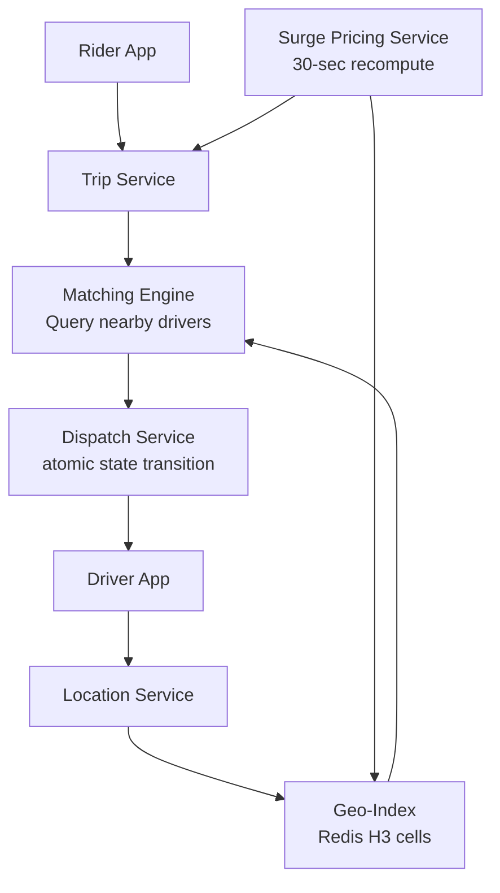

# Design Uber Backend — Dispatch at Scale

**Difficulty**: 🔴 Advanced
**Reading Time**: Coming Soon
**Interview Frequency**: Very High

---

> 🚧 **Full article coming soon.** This stub gives you the essentials to start thinking about this problem.

---

## The Core Problem

Matching 20 million daily trips between riders and drivers with sub-5-second dispatch requires finding available drivers within 2km in real-time across dynamic location data updating every 4 seconds. The system must handle surge pricing calculation, ETA computation, and route optimization simultaneously while maintaining consistency on driver state (not dispatching same driver to two riders).

## Functional Requirements

- Riders request a trip with pickup/dropoff location
- System finds and dispatches nearest available driver within 5 seconds
- Real-time driver location tracking (updates every 4 seconds)
- Dynamic surge pricing based on supply/demand ratio per region
- ETA computation for rider and driver

## Non-Functional Requirements

| Requirement | Target |
|-------------|--------|
| Dispatch latency | < 5 seconds from request to driver acceptance |
| Location freshness | Driver positions updated every 4 seconds |
| Availability | 99.99% (52 min/year) |
| Scale | 20M trips/day, 5M concurrent drivers globally |

## Back-of-Envelope Estimates

- **Location updates**: 5M active drivers × (1 update / 4 seconds) = 1.25M location writes/sec
- **Geo-index memory**: 5M drivers × 64 bytes per location record = 320MB — fits in Redis
- **Matching search**: Each trip request queries drivers within 2km radius → avg 50 candidates → rank by ETA

## Key Design Decisions

1. **H3 Hexagonal Grid for Geo-Indexing** — divide city into hexagonal cells at multiple resolutions; index drivers by cell ID; to find nearby drivers, query hex + 6 neighbors; avoids border effects of square grids; Uber open-sourced H3 for exactly this.
2. **Driver State Machine with Atomic Transitions** — driver states: available → dispatching → en-route → on-trip; use Redis atomic operations (WATCH + MULTI) to transition driver from "available" to "dispatching"; prevents two simultaneous dispatch to same driver.
3. **Surge Pricing via Demand/Supply Ratio** — compute supply (available drivers) and demand (open requests) per H3 cell every 30 seconds; surge multiplier = f(demand/supply); pre-compute for all cells, cache result; update every 30 seconds not on every request.

## High-Level Architecture

## Top Interview Questions for This Problem

| Question | Tests |
|----------|-------|
| How do you ensure the same driver isn't dispatched to two riders simultaneously? | Atomic state transitions, distributed locking |
| How do you find the nearest available driver in under 500ms? | Geo-indexing, spatial data structures |
| How would you compute surge pricing for 1 million city zones every 30 seconds? | Batch computation, caching, pre-aggregation |

## Related Concepts

- [Food delivery app (similar dispatch pattern)](./food-delivery)
- [Distributed locking for driver state transitions](../05-infrastructure/distributed-locking)

---

*📚 Full deep-dive with multiple approaches, trade-off tables, and pseudocode coming soon.*
