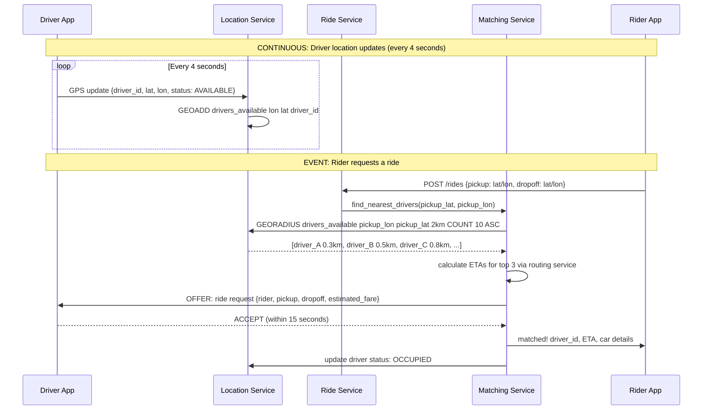
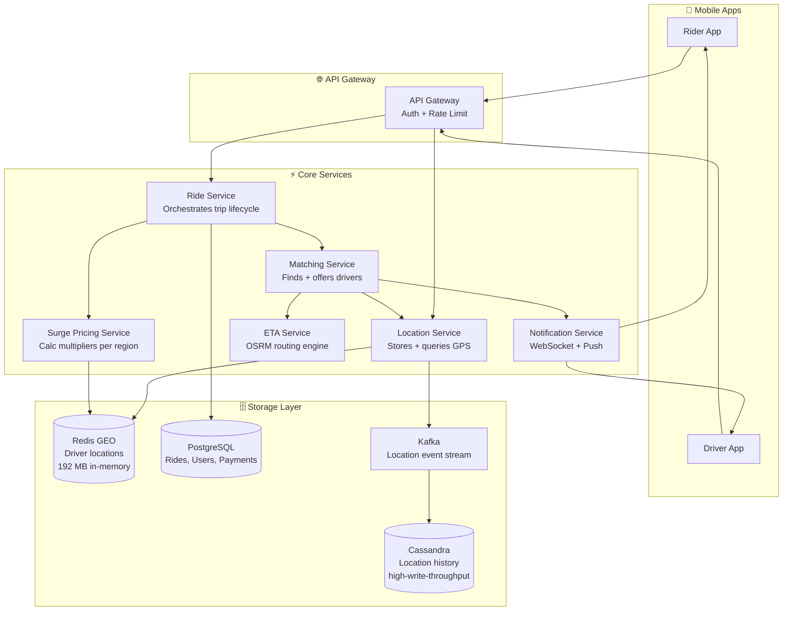
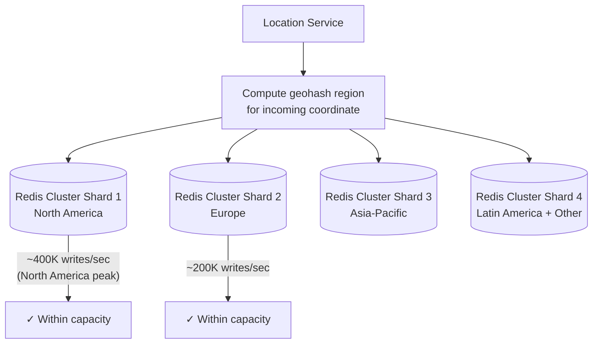
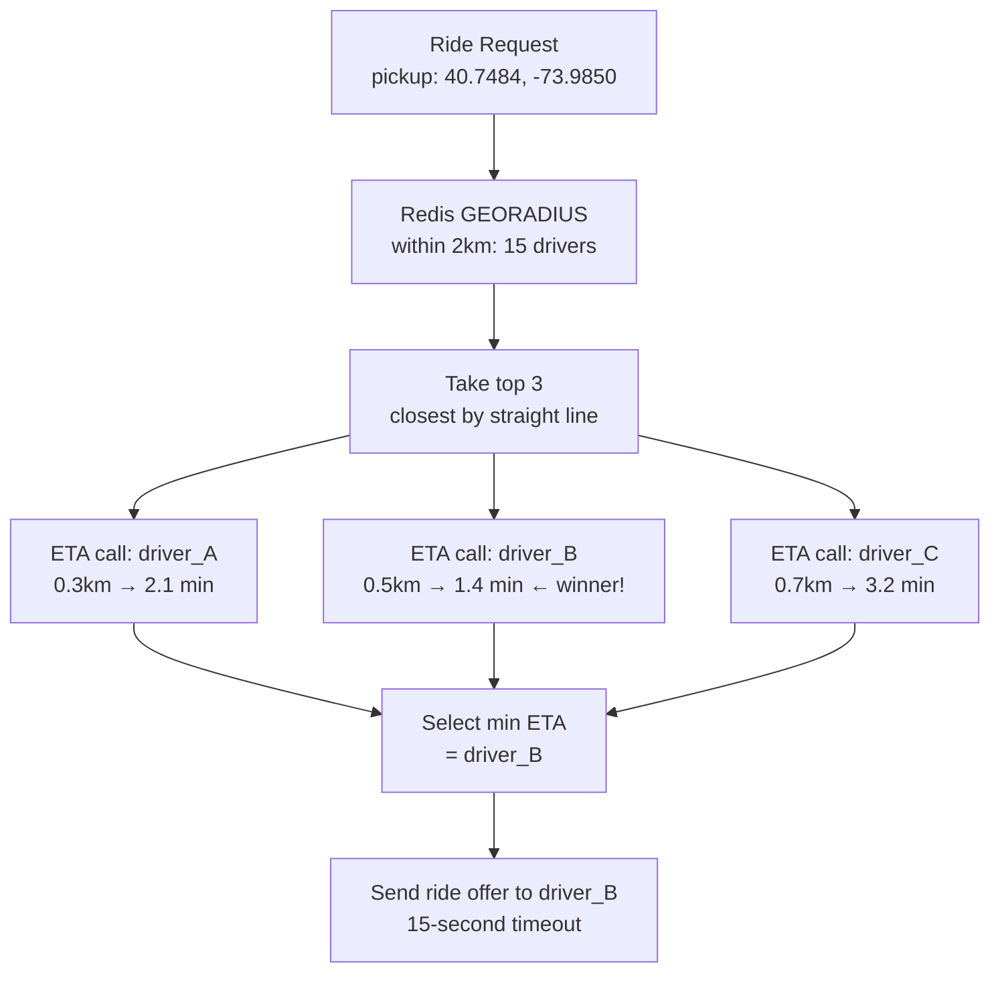
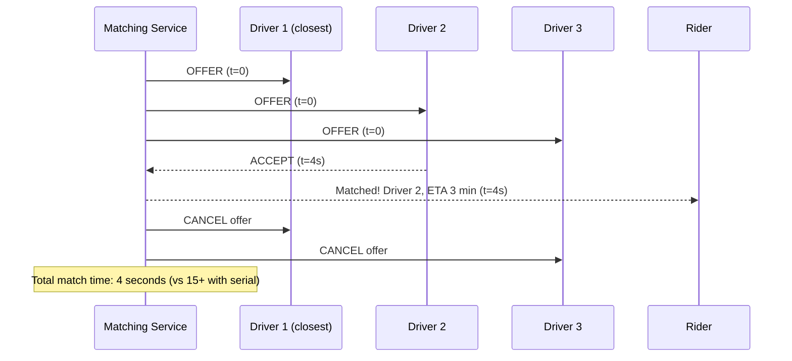

# Design Uber — Real-Time Ride Matching & Driver Location

> **Difficulty**: 🔴 Advanced — A geospatial systems problem. Requires understanding of real-time location tracking, distributed state, proximity matching, and surge pricing algorithms.

---

## Table of Contents

| # | Section | Core Concept |
|---|---------|-------------|
| 1 | [5-Minute Mental Model](#5-minute-mental-model) | Three actors, two real-time data flows |
| 2 | [Why Uber is Hard](#why-uber-is-hard) | Location scale + matching complexity |
| 3 | [Requirements & Numbers](#requirements-with-real-numbers) | Scale targets |
| 4 | [Capacity Estimation](#capacity-estimation) | The math you need |
| 5 | [High-Level Architecture](#high-level-architecture) | All components together |
| 6 | [Deep Dive: Location Service](#deep-dive-location-service-the-core) | Redis GEO, 1M writes/sec |
| 7 | [Deep Dive: Matching Algorithm](#deep-dive-matching-algorithm) | ETA-based vs distance-based |
| 8 | [Deep Dive: Surge Pricing](#deep-dive-surge-pricing) | Supply/demand per geohash region |
| 9 | [Trade-Off Table](#trade-off-table) | Key architectural decisions |
| 10 | [Problems at Scale](#problems-at-scale) | What breaks and how to fix it |
| 11 | [Follow-Up Questions](#follow-up-questions) | Interviewers love to ask |
| 12 | [Key Takeaways](#key-takeaways) | Numbers to memorize |

---

## 5-Minute Mental Model

Before diving into failure modes, understand the **three actors and two continuous data flows**:

**Three Actors:**
1. **Rider** — requests a ride from location A to location B
2. **Driver** — continuously broadcasts GPS location, accepts/declines ride offers
3. **Matching Service** — the brain that connects riders to the nearest available driver

**Two Continuous Data Flows:**
1. **Location updates** (driver → server, every 4 seconds) — the constant stream
2. **Ride offers** (server → driver, event-driven) — low frequency but time-critical



**The key insight**: The **Location Service** is the heart of the system. Everything depends on answering "which available drivers are within X km of this point?" in under 10ms. Redis's geospatial commands make this trivially fast — the entire driver location database fits in 192 MB.

---

## Why Uber is Hard

```mermaid
graph TD
    A[Driver sends GPS update] --> B{How to store location?}
    B -->|Relational DB| C[PostGIS queries work\nbut 1M writes/sec kills Postgres]
    B -->|In-memory| D[Redis GEO — handles 1M writes/sec\nbut single point of failure]

    E[Rider requests ride] --> F{How to find nearest driver?}
    F -->|Brute force| G[Compare against all 4M drivers\n= 4M calculations per request!]
    F -->|Geospatial index| H[Query within 2km radius\n= O(log n) lookup]

    I[Matching algorithm] --> J{Which driver to pick?}
    J -->|Closest by distance| K[Might pick driver blocked\nby a river or highway]
    J -->|Shortest ETA| L[Requires routing API call\nper candidate driver]

    M[Surge pricing] --> N{How granular?}
    N -->|City-level| O[Wrong: airport surge\naffects downtown price]
    N -->|Street-level| P[Too fine: every cell empty\nno statistical signal]
    N -->|Geohash region| Q[Right: 1.2km × 0.6km cells\nbalances signal vs granularity]

    style C fill:#ff6b6b,color:#fff
    style G fill:#ff6b6b,color:#fff
```

| Challenge | Why it matters | Key number |
|-----------|---------------|-----------|
| **Location update rate** | 4M drivers × 1 update/4sec = 1M writes/sec | Single fastest ops in Redis: 1M/sec |
| **Proximity query speed** | Every ride request needs nearest drivers in <10ms | GEORADIUS is O(N+log M) — fast |
| **Driver state consistency** | Driver going offline must be reflected immediately | TTL on location entries: 10 seconds |
| **ETA accuracy** | Straight-line distance misleads — rivers, highways matter | Use routing API on top-N candidates |
| **Surge pricing granularity** | Too coarse = wrong price, too fine = no data | Geohash level 6: 1.2km × 0.6km |

---

## Requirements with Real Numbers

### Functional Requirements

| Feature | Requirement |
|---------|------------|
| Ride request | Rider specifies pickup + dropoff → matched to nearest available driver |
| Driver location tracking | Driver GPS updated to server every 4 seconds |
| ETA calculation | Show rider estimated pickup time and trip duration |
| Surge pricing | Dynamic multiplier based on supply/demand per region |
| Ride tracking | Rider can track driver location during trip in real-time |
| Ride history | Complete trip records for billing, dispute resolution |

### Non-Functional Requirements (with numbers)

| Requirement | Target | Rationale |
|------------|--------|-----------|
| **Active drivers** | 4M globally | Uber's approximate fleet size at peak |
| **Daily rides** | 5M/day | ~58 req/sec average, 580 req/sec at surge peak |
| **Location update rate** | 1M writes/sec | 4M drivers × 1 update/4 sec |
| **Match latency** | < 5 seconds P95 | User expectation: response feels instant |
| **Location staleness** | < 5 seconds | Driver moves ~20m in 4 seconds at city speed |
| **Availability** | 99.99% | Surge events (NYE, concerts) are high value |
| **Surge tolerance** | Handle 10× baseline | New Year's Eve, post-concert rush |

---

## Capacity Estimation

### Location Updates

```
Active drivers (peak): 4,000,000
Update frequency: every 4 seconds
Write rate: 4,000,000 ÷ 4 = 1,000,000 writes/sec (1M writes/sec)

Each location record:
  driver_id:  8 bytes (uint64)
  longitude:  8 bytes (double)
  latitude:   8 bytes (double)
  timestamp:  8 bytes (unix epoch ms)
  status:     1 byte  (AVAILABLE/OCCUPIED/OFFLINE)
  TOTAL:      ~33 bytes → round to 48 bytes with overhead

Total memory for all 4M drivers:
  4,000,000 × 48 bytes = 192 MB

192 MB fits comfortably in a SINGLE Redis instance!
(A $200/month cloud server has 64 GB RAM — 333× what's needed)
```

This is the most important number: **the entire global driver location database fits in 192 MB**. This is why Redis is the correct choice here — not because it's "fast," but because the dataset is small enough to keep fully in memory.

### Ride Requests

```
Daily rides: 5,000,000
Average: 5M ÷ 86,400 = ~58 requests/sec
Peak (10× surge): 580 requests/sec

Per ride request, the matching service must:
1. Query Redis for nearby drivers: ~1 ms
2. Call routing API for ETA on top 3: ~50ms (parallel calls)
3. Send offers to drivers: ~5ms
4. Await acceptance: up to 15 seconds

Rides in-flight at any time (average ride 20 min):
5M rides/day × (20 min / 1,440 min/day) = ~69,000 concurrent rides
```

### Storage

```
Per ride record:
  ride_id:       16 bytes
  rider_id:      8  bytes
  driver_id:     8  bytes
  pickup_lat/lon: 16 bytes
  dropoff_lat/lon: 16 bytes
  start_time:    8  bytes
  end_time:      8  bytes
  fare:          8  bytes
  surge_multiplier: 4 bytes
  route_polyline: ~500 bytes (encoded GPS path)
  TOTAL: ~600 bytes per ride

5 years of rides:
  5M/day × 365 × 5 = 9.1 billion rides
  9.1B × 600 bytes = ~5.5 TB for trip data
  (Very manageable — Postgres with time-based partitioning)
```

---

## High-Level Architecture



---

## Deep Dive: Location Service (The Core)

### Redis GEO Commands

Redis has native geospatial support via sorted sets where the score is a **geohash** of the coordinate:

```redis
# Driver updates location
GEOADD drivers_available -73.9857 40.7484 "driver:12345"

# Find all available drivers within 2km of pickup point
GEORADIUS drivers_available -73.9850 40.7480 2 km
  WITHCOORD WITHDIST COUNT 10 ASC

# Result:
# 1) "driver:12345" 0.3km [-73.9857, 40.7484]
# 2) "driver:67890" 0.8km [-73.9820, 40.7510]
# ...

# Remove driver when they go offline or accept a ride
ZREM drivers_available "driver:12345"

# Move driver between available/occupied sets
GEOADD drivers_occupied -73.9857 40.7484 "driver:12345"
ZREM drivers_available "driver:12345"
```

**How it works internally**: Redis stores coordinates as a 52-bit geohash integer in a sorted set. `GEORADIUS` uses the geohash to find candidates, then filters by actual Haversine distance. This is O(N+log M) where N is the result count and M is the total set size — essentially constant time.

### Sharding for 1M Writes/Sec

A single Redis node handles ~1M ops/sec, but we have exactly 1M location updates/sec. We need headroom. Strategy: **shard by geographic region**.



**Edge case — queries near shard boundaries**: A pickup point near the US/Canada border might need drivers from both sides. Solution: query both adjacent shards in parallel, merge results.

### H3 — Uber's Actual Approach

Uber moved from geohash to **H3** (hexagonal hierarchical spatial index) in 2018. Why?

```
Geohash problem: squares have two types of neighbors
  - Edge neighbors: share a full side (4 neighbors)
  - Corner neighbors: share only a point (4 neighbors)
  Distance to edge center: 1.0× cell width
  Distance to corner center: 1.414× cell width (√2)

H3 hexagons have only edge neighbors (6 neighbors)
  Distance to all neighbor centers: ~1.0× cell width
  No corner discontinuity!
```

Practical impact: When a pickup is near a geohash boundary, the system must check potentially 3 different adjacent cells. With H3 hexagons, you always check at most 1 ring of 6 neighbors, regardless of where in the hexagon the point falls.

### Driver Status TTL

What happens when a driver's app crashes or loses internet? Without cleanup:
- Driver appears available but never accepts rides
- Matching sends offers that time out → degrades match latency

**Fix**: Set a TTL on each driver's location key. The driver app sends a heartbeat every 5 seconds. If no update for 10 seconds, the key expires automatically.

```redis
# Each location update refreshes the TTL
GEOADD drivers_available lon lat driver_id
EXPIRE driver:12345:lastping 10  # key expires in 10 seconds if no update
```

When TTL expires, a **keyspace notification** triggers cleanup of the driver's entry from the available set.

---

## Deep Dive: Matching Algorithm

### Naive vs Production Approach

**Naive approach — closest by straight-line distance:**

```
Find driver with minimum Haversine distance to pickup point.
Problem: A driver 300m away across a river or divided highway
         might take 8 minutes to reach you.
         A driver 800m away on the same street might take 2 minutes.
```

**Production approach — minimum ETA:**

```
1. Query Redis: find all available drivers within 2km radius
   → returns 10-20 candidates

2. Parallel ETA calls: for top 3 closest drivers,
   call routing service (OSRM or Google Maps)
   to get actual road-network ETA
   → 3 parallel calls, each ~30-50ms

3. Select driver with minimum ETA

4. Send ride offer to that driver
```



### Parallel Offers — Reducing Match Latency

**Serial matching** (send to #1, wait, then #2):
- Driver #1 offered → 15 second timeout → Driver #2 offered → 15 second timeout → ...
- If first two drivers decline: **30+ second match time** — rider abandons

**Parallel offers** (Uber's actual model):
- Simultaneously offer to top 3 drivers
- First to accept wins; others are cancelled
- Match time: max(acceptance_time, 0) — typically 5 seconds
- Trade-off: Drivers #2 and #3 may feel "cheated" when offer cancelled, but this is rare



---

## Deep Dive: Surge Pricing

### The Algorithm

Surge pricing answers: **"What's the supply/demand ratio in this area right now?"**

```
Surge multiplier = ceil(demand / supply)

Where:
  demand = count of ride requests in region in last 5 minutes
  supply = count of available drivers in region right now
  region = geohash level 6 cell (1.2km × 0.6km)

Example:
  demand = 10 (pending requests in SFO airport cell)
  supply = 2  (available drivers in same cell)
  multiplier = ceil(10/2) = 5.0×

Capped at configurable maximum (typically 5.0×-10.0×)
```

### Update Frequency

```
Recalculate per-region every 60 seconds.

At geohash level 6:
  Number of cells globally: ~20M
  Active cells (with demand or supply): ~100K at peak

  100K cells × 1 update/minute = ~1,667 surge calculations/sec
  Trivial load — this is a batch job, not real-time
```

### Region Granularity Trade-Off

| Geohash Level | Cell Size | Problem |
|--------------|-----------|---------|
| Level 4 | ~40km × 20km | Too coarse — airport and downtown get same surge |
| Level 5 | ~5km × 2.5km | Better, but still misses neighborhood-level dynamics |
| Level 6 | 1.2km × 0.6km | Sweet spot — captures airport, stadium, concert venue |
| Level 7 | 150m × 75m | Too fine — most cells empty, no statistical signal |

**Uber's actual approach**: Uses **H3 resolution 7** (1.2km hexagon diameter) for surge pricing computation.

### Preventing Driver Gaming

Without safeguards, drivers learn the surge algorithm and game it:
- All drivers in an area go offline simultaneously to trigger surge
- Then come back online to earn the surge multiplier

**Fixes**:
1. **Minimum response time**: Surge multiplier doesn't immediately update when drivers go offline — 5-minute lag prevents instant gaming
2. **Driver-side surge display smoothing**: Drivers see future surge predictions, not current — optimizes city-level distribution
3. **Earnings cap**: Very high surge multipliers are visible to riders (discourages demand) but driver earnings capped per hour — removes incentive to cluster

---

## Trade-Off Table

| Decision | Option A | Option B | Production Choice |
|----------|----------|----------|------------------|
| **Location storage** | Redis GEO (in-memory) | PostGIS (disk-backed) | Redis — 192 MB fits, 1M writes/sec |
| **Geospatial index** | Geohash (squares) | H3 hexagons | H3 — uniform neighbor distances |
| **Driver history** | Redis only | Redis + Cassandra | Both — Redis for live, Cassandra for analytics |
| **Matching strategy** | Closest distance | Minimum ETA | Min ETA — accounts for road topology |
| **Offer strategy** | Serial (one at a time) | Parallel (top 3 simultaneous) | Parallel — reduces latency from 45s to 15s |
| **Surge granularity** | City-level | Geohash level 6 / H3 res-7 | H3 res-7 — right balance of granularity |
| **ETA service** | Build custom routing | Use Google Maps API | Build custom (OSRM) at Uber's scale (cost) |

---

## Problems at Scale

### Problem 1: New Year's Eve — 10× Surge

**Scenario**: At midnight on NYE, ride requests spike 10× globally and locally (Times Square, city centers).

```
Normal: 58 requests/sec
NYE peak: 580 requests/sec × concentrated in small geographic areas

Location update rate: unchanged (4M drivers × 1 update/4 sec)
Surge calculation: more active cells, but computation is lightweight
Main bottleneck: Matching Service throughput
```

**Fix**:
- Pre-scale Matching Service fleet 2 hours before expected surge (scheduled autoscaling)
- Shed excess ride requests with queue + estimated wait time notification
- Increase matching radius from 2km to 5km during extreme surge

### Problem 2: Driver Goes Offline Mid-Ride

**Scenario**: Driver's phone dies at 60% completion of trip.

**Fix**:
- Rider app independently tracks GPS
- If server loses driver location for >30 seconds during active ride:
  1. Alert rider: "Tracking temporarily unavailable"
  2. Driver position last known: shown as static
  3. After 5 minutes of no signal: emergency protocol (call driver, contact rider)
- Billing: use routing service to estimate fare from last known position → dropoff destination

### Problem 3: Query Near Geoshard Boundary

**Scenario**: Rider at the edge of a sharded region — the nearest available drivers may be in the adjacent shard.

```
Example: North America / South America boundary
  Query in shard 1 (NA) → 0 nearby drivers
  But 5 drivers available in shard 4 (LATAM), 0.8km away → match missed!
```

**Fix**: When GEORADIUS returns < 3 results in primary shard, **automatically expand query** to adjacent shards. This adds one extra Redis call but prevents match failures at boundaries.

---

## Follow-Up Questions

**Q1: How do you handle driver going offline mid-trip?**

See Problem 2 above. The key is separating:
- **Location tracking failure** (temporary — keep trip active, alert rider)
- **Driver abandonment** (permanent — reassign rider, charge driver fee)

The distinction requires timeout logic: 30 seconds of no signal = tracking failure. 5 minutes = driver abandoned.

**Q2: How does ETA change when live traffic data is included?**

Without traffic: routing engine uses historical average speeds per road segment.
With traffic: routing engine uses real-time speed data from:
1. Uber's own fleet telemetry (millions of phones reporting current speeds)
2. HERE/TomTom/Google traffic APIs

The `ETA Service` calls OSRM or similar with traffic layer enabled. At Uber's scale, their own fleet provides better real-time traffic data than any third party — each driver's phone is a sensor.

**Q3: How would you design surge pricing to prevent driver clustering?**

The problem: When drivers see a surge zone on their map, they all drive toward it simultaneously. By the time they arrive, supply has spiked, surge drops, and they've wasted time driving.

**Solution — predictive, not reactive surge:**
1. Show drivers **predicted surge** for next 15-30 minutes based on historical patterns + event schedules
2. Don't show surge on a per-driver basis — show it as a city heat map
3. Use driver earnings target ("You're 80% of today's goal — 2 more rides nearby") rather than surge map
4. Bonus system: drivers who stay in-zone when surge starts (before it's visible) earn extra premium

---

## Key Takeaways

Numbers to memorize before the interview:

| Metric | Value | Why it matters |
|--------|-------|---------------|
| Active drivers at peak | 4M globally | Drives location storage sizing |
| Location write rate | 1M writes/sec | Main scalability challenge |
| Driver location DB size | 192 MB | Fits in a single Redis instance |
| Redis ops/sec capacity | 1M | One Redis node handles all location writes |
| Match latency target | < 5 seconds P95 | Drives parallel offer strategy |
| GEORADIUS result set | top 10 candidates | Then ETA-filter to top 3 |
| Surge granularity | Geohash level 6 / H3 res-7 (1.2km) | Balance signal vs precision |
| Parallel offer count | 3 drivers | Reduces match time from 45s to 15s |

**The architectural decision that matters most**: The entire driver location database (192 MB) fits in RAM. This means Redis with geospatial indexes is not just convenient — it's the obvious, correct choice. The challenge isn't storage, it's **write throughput** (1M/sec) and **shard boundary handling**.

---

## References

- 📖 [Uber's Real-Time Location Services](https://www.uber.com/blog/how-uber-manages-a-million-writes-per-second-using-mesos-and-cassandra/)
- 📖 [H3: Uber's Hexagonal Hierarchical Spatial Index](https://www.uber.com/blog/h3/)
- 📖 [Uber's Microservice Architecture](https://www.uber.com/blog/microservice-architecture/)
- 📖 [Redis GEORADIUS Documentation](https://redis.io/commands/georadius/)
- 📖 [System Design Interview — Alex Xu, Chapter 6 (Proximity Service)](https://www.amazon.com/System-Design-Interview-insiders-Second/dp/B08CMF2CQF)
