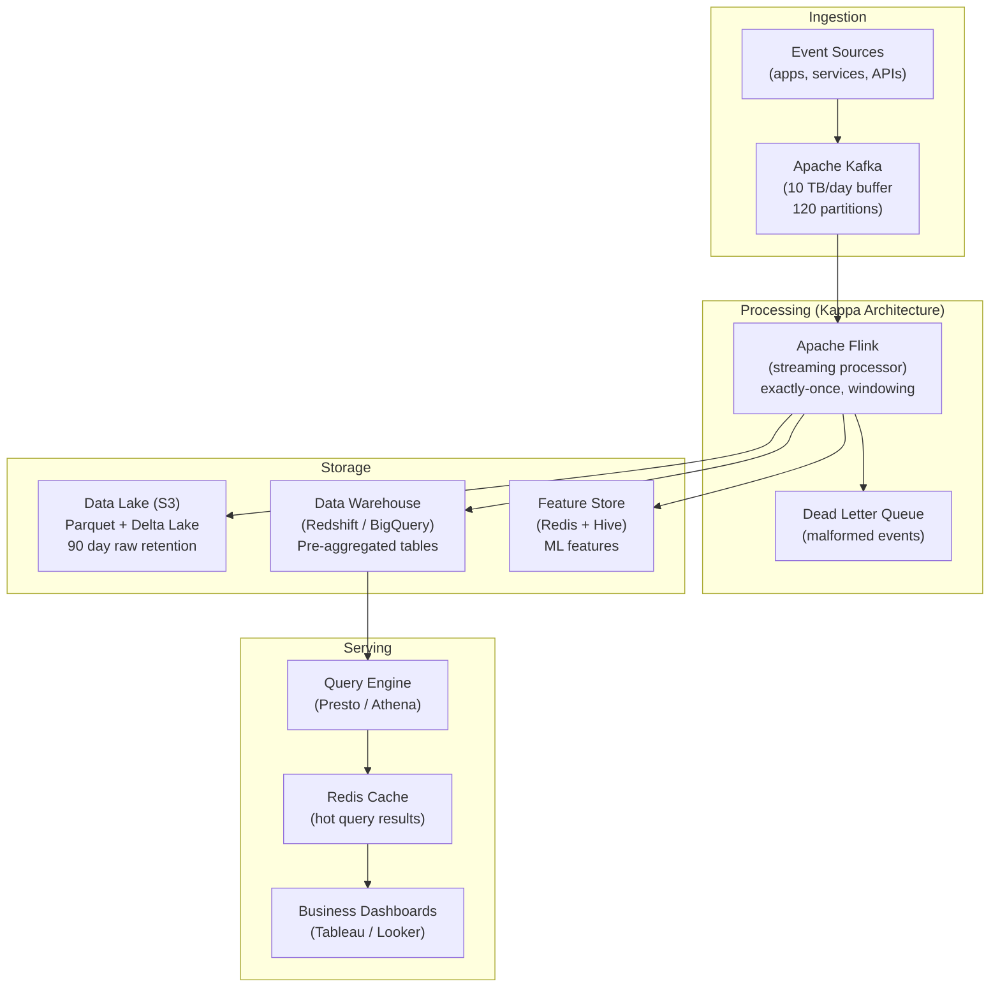
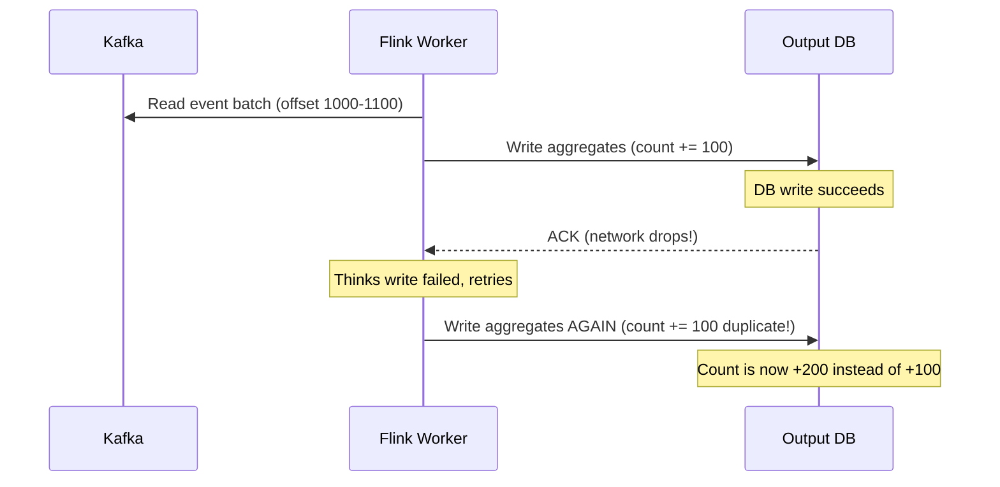

# Design a Big Data Pipeline — 10 TB/Day, < 1 Hour Freshness

**Difficulty**: 🔴 Advanced
**Reading Time**: 30 minutes
**Interview Frequency**: High — asked at data-driven companies, analytics platforms, and ML infrastructure interviews

---

## Problem Statement

You are asked to design a big data pipeline that:

- **Works at**: 100 GB/day — a nightly batch job with Apache Spark handles ETL, results ready by morning.
- **Breaks at**: 10 TB/day with < 1 hour freshness — nightly batch completes at 6 AM, but business needs real-time dashboard updates; the pipeline has complex transformations (sessionization, windowed aggregations); schema changes in upstream systems break the pipeline; single pipeline failure corrupts multi-day aggregations.

Target: **10 TB/day** ingestion, **< 1 hour data freshness**, **exactly-once semantics**, **schema evolution**, serving **10,000 dashboard queries/second**.

---

## Requirements

### Functional Requirements

| Requirement | Description |
|-------------|-------------|
| Event Ingestion | Consume events from Kafka (clickstream, transactions) |
| Transformation | Clean, enrich, sessionize, aggregate events |
| Serving Layer | Query results for dashboards and ML features |
| Schema Management | Handle upstream schema changes without pipeline breaks |
| Backfill | Reprocess historical data when business logic changes |
| Data Quality | Detect and alert on anomalies (missing fields, outliers) |

### Non-Functional Requirements

| Requirement | Target |
|-------------|--------|
| Data Freshness | < 1 hour (near-real-time) |
| Throughput | 10 TB/day = ~120 MB/s sustained ingestion |
| Query Latency | < 100 ms for pre-aggregated metrics |
| Exactly-Once | No duplicate counts in aggregations |
| Retention | Raw events: 90 days; aggregates: 7 years |
| Backfill Speed | Reprocess 1 year of data in < 4 hours |

---

## Capacity Estimates

- **10 TB/day = ~120 MB/s** = 120,000 events/sec at 1 KB/event
- **Kafka retention (24h)**: 120 MB/s × 86,400s = **10 TB buffer** in Kafka
- **Parquet compression**: 10 TB raw → ~2 TB parquet (5:1 ratio) = **730 GB/day stored**
- **Data lake size at 90 days**: 730 GB × 90 = **65 TB**
- **Serving layer**: Pre-aggregated tables, 100M rows, columnar = ~50 GB → fits in Redshift/BigQuery
- **Query throughput**: 10,000 queries/sec → caching layer needed (Redis for top 1% of queries)

---

## High-Level Architecture

---

## Level 1 — Surface: Lambda vs. Kappa Architecture

| Architecture | Batch Layer | Speed Layer | Complexity | Use When |
|-------------|-------------|-------------|-----------|----------|
| **Lambda** | Yes (Spark, daily) | Yes (Flink/Storm) | High (two codepaths) | Need exact batch + real-time |
| **Kappa** | No | Yes (Flink, stream only) | Low (one codepath) | Streaming handles all freshness needs |
| **Delta Architecture** | No | Yes (Delta Lake) | Medium | Need ACID on data lake |

**Lambda problem**: Two separate codepaths for batch and streaming. Business logic implemented twice → bugs diverge. Result merging is complex.

**Kappa solution**: Kafka retains events for N days. "Batch" is just a streaming job reading from beginning of topic. Same code for backfill and real-time.

**Recommendation**: Use Kappa for most use cases. Only choose Lambda if batch requires full-dataset operations (e.g., cross-day joins that can't be windowed).

---

## Level 2 — Deep Dive: Exactly-Once Semantics

"Exactly-once" means each event is counted exactly once in output aggregations — not zero times (lost) or twice (duplicated).

### The Problem: Network Failures Cause Duplicates

### Flink's Exactly-Once via Distributed Snapshots (Chandy-Lamport)

1. Flink periodically injects **checkpoint barriers** into Kafka streams
2. When a worker receives a barrier, it saves its state (running aggregates) to distributed storage
3. When all workers checkpoint, Kafka offsets are committed
4. On failure, restore state from last complete checkpoint, re-read Kafka from committed offset
5. **Two-phase commit** with output sink: write output only if all workers successfully checkpointed

This gives exactly-once **within Flink**. For external sinks (JDBC, Kafka output): requires idempotent writes or transactional sinks.

### Schema Evolution

Events change over time. Upstream adds new fields, renames columns, changes types. Options:

| Strategy | Breaking Changes Handled | Complexity |
|----------|------------------------|-----------|
| **Schema registry (Avro)** | Yes — forward/backward compatible | Medium |
| **Permissive JSON** | Yes (extra fields ignored) | Low (but no type safety) |
| **Versioned topics** | Yes — separate topic per version | High (fan-out complexity) |

**Best practice**: Use Confluent Schema Registry with Avro. Register schema on produce; consumer validates and can read forward-compatible schemas automatically.

---

## Key Design Decisions

### 1. Row vs. Columnar Storage

| Format | Write Speed | Read Speed (analytics) | Compression | Use Case |
|--------|-------------|----------------------|-------------|----------|
| **JSON** | Fast | Slow (full row scan) | Poor | Debugging, human-readable |
| **CSV** | Fast | Slow | Medium | Simple exports |
| **Parquet (columnar)** | Medium | Fast (column pruning) | Excellent (5–10:1) | Analytics, ML features |
| **ORC** | Medium | Fast | Excellent | Hive/Hadoop ecosystem |
| **Delta Lake (Parquet + log)** | Fast | Fast | Excellent | ACID on data lake |

**Decision**: Store raw events as Parquet with Delta Lake for ACID properties (atomic writes, time travel for backfill).

### 2. Backfill Strategy

When business logic changes (new metric definition, bug fix), reprocess all historical data:

- **Kappa backfill**: Start new Flink job reading from Kafka offset 0. Parallel with live pipeline. New output table. Swap table when complete. Cost: proportional to data volume, not time.
- **Reprocess speed**: 10 TB/day × 365 days = 3.65 PB. At 1 TB/hour Flink throughput = **3,650 hours** (too slow!). With 100-node cluster: **36.5 hours**. Pre-allocate surge capacity for backfill.

### 3. Data Quality Monitoring

| Check | Description | Alert Threshold |
|-------|-------------|-----------------|
| **Completeness** | % of expected events received | < 95% in 5-min window |
| **Timeliness** | Age of latest event processed | > 10 minutes stale |
| **Referential integrity** | user_id exists in user table | > 1% orphan events |
| **Statistical anomaly** | Event count 3σ from rolling avg | Z-score > 3 |

Monte Carlo, Great Expectations, or custom Flink operators can implement these checks in-stream.

---

## Interview Questions

| Question | What They're Testing | Key Answer Points |
|----------|---------------------|-------------------|
| How do you ensure exactly-once counting without duplicate events? | Distributed systems correctness | Flink distributed snapshots (Chandy-Lamport): barriers in Kafka stream trigger state checkpoints; output committed only after complete checkpoint; idempotent sinks for external systems |
| What's wrong with Lambda architecture and why prefer Kappa? | Architecture trade-offs | Lambda requires maintaining two separate code paths (batch + streaming), logic diverges, merging batch and speed layers is complex; Kappa: same streaming code handles both real-time and backfill (replay from Kafka offset 0) |
| How do you backfill 1 year of data in < 4 hours? | Performance estimation | 3.65 PB at 10 Gbps (100 nodes) = 3.65 TB/hour × 4 hours = 14.6 TB — still too slow; need 1 PB/hour = 1,000-node burst cluster; use spot instances for cost |

---

## 📚 Resources & References

| Resource | Type | What You'll Learn |
|----------|------|------------------|
| [LinkedIn: The Log — Jay Kreps](https://engineering.linkedin.com/distributed-systems/log-what-every-software-engineer-should-know-about-real-time-datas-unifying) | 📖 Blog | Kafka origin story, unified log abstraction, event sourcing at scale |
| [Netflix Data Pipeline Evolution](https://netflixtechblog.com/evolution-of-the-netflix-data-pipeline-da246ca36905) | 📖 Blog | Real production pipeline decisions, Lambda to Kappa migration |
| [Designing Data-Intensive Applications](https://www.oreilly.com/library/view/designing-data-intensive-applications/9781491903063/) | 📚 Book | Chapter 11: stream processing, exactly-once, watermarks |
| [TechDummies YouTube](https://www.youtube.com/@TechDummiesNarendraL) | 📺 YouTube | Big data architecture patterns, Kafka, Flink, Spark comparisons |

---

## Related Concepts

- [Distributed Messaging](./distributed-messaging) — Kafka is the central nervous system of the pipeline
- [Large-Scale Graph Processing](./large-scale-graph-processing) — graph analytics uses the same data lake
- [Distributed Tracing](./distributed-tracing) — observability for pipeline debugging
