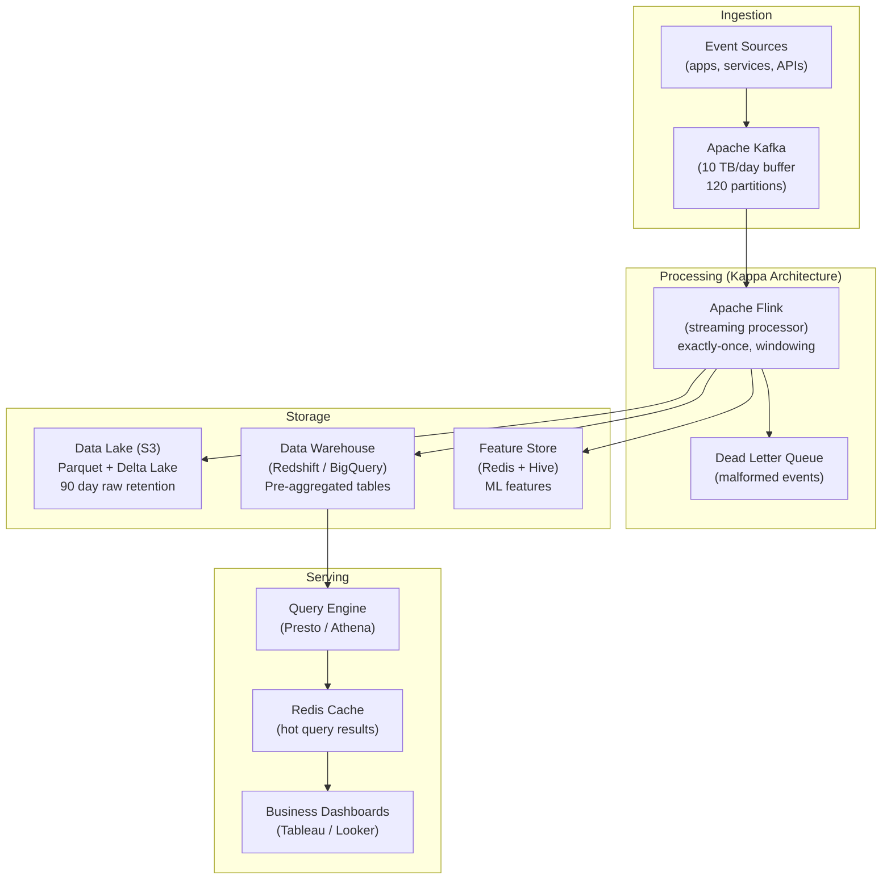
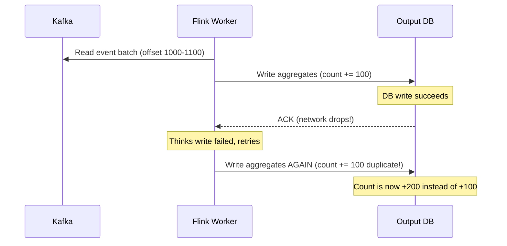
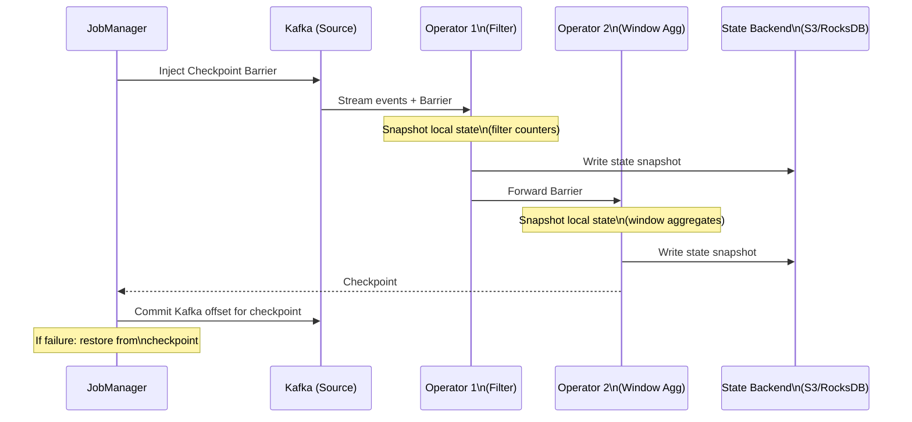

# Design a Big Data Pipeline — 10 TB/Day, < 1 Hour Freshness

**Difficulty**: 🔴 Advanced
**Reading Time**: 30 minutes
**Interview Frequency**: High — asked at data-driven companies, analytics platforms, and ML infrastructure interviews

---

## Problem Statement

You are asked to design a big data pipeline that:

- **Works at**: 100 GB/day — a nightly batch job with Apache Spark handles ETL, results ready by morning.
- **Breaks at**: 10 TB/day with < 1 hour freshness — nightly batch completes at 6 AM, but business needs real-time dashboard updates; the pipeline has complex transformations (sessionization, windowed aggregations); schema changes in upstream systems break the pipeline; single pipeline failure corrupts multi-day aggregations.

Target: **10 TB/day** ingestion, **< 1 hour data freshness**, **exactly-once semantics**, **schema evolution**, serving **10,000 dashboard queries/second**.

---

## Requirements

### Functional Requirements

| Requirement | Description |
|-------------|-------------|
| Event Ingestion | Consume events from Kafka (clickstream, transactions) |
| Transformation | Clean, enrich, sessionize, aggregate events |
| Serving Layer | Query results for dashboards and ML features |
| Schema Management | Handle upstream schema changes without pipeline breaks |
| Backfill | Reprocess historical data when business logic changes |
| Data Quality | Detect and alert on anomalies (missing fields, outliers) |

### Non-Functional Requirements

| Requirement | Target |
|-------------|--------|
| Data Freshness | < 1 hour (near-real-time) |
| Throughput | 10 TB/day = ~120 MB/s sustained ingestion |
| Query Latency | < 100 ms for pre-aggregated metrics |
| Exactly-Once | No duplicate counts in aggregations |
| Retention | Raw events: 90 days; aggregates: 7 years |
| Backfill Speed | Reprocess 1 year of data in < 4 hours |

---

## Capacity Estimates

- **10 TB/day = ~120 MB/s** = 120,000 events/sec at 1 KB/event
- **Kafka retention (24h)**: 120 MB/s × 86,400s = **10 TB buffer** in Kafka
- **Parquet compression**: 10 TB raw → ~2 TB parquet (5:1 ratio) = **730 GB/day stored**
- **Data lake size at 90 days**: 730 GB × 90 = **65 TB**
- **Serving layer**: Pre-aggregated tables, 100M rows, columnar = ~50 GB → fits in Redshift/BigQuery
- **Query throughput**: 10,000 queries/sec → caching layer needed (Redis for top 1% of queries)

---

## High-Level Architecture



---

## Level 1 — Surface: Lambda vs. Kappa Architecture

| Architecture | Batch Layer | Speed Layer | Complexity | Use When |
|-------------|-------------|-------------|-----------|----------|
| **Lambda** | Yes (Spark, daily) | Yes (Flink/Storm) | High (two codepaths) | Need exact batch + real-time |
| **Kappa** | No | Yes (Flink, stream only) | Low (one codepath) | Streaming handles all freshness needs |
| **Delta Architecture** | No | Yes (Delta Lake) | Medium | Need ACID on data lake |

**Lambda problem**: Two separate codepaths for batch and streaming. Business logic implemented twice → bugs diverge. Result merging is complex.

**Kappa solution**: Kafka retains events for N days. "Batch" is just a streaming job reading from beginning of topic. Same code for backfill and real-time.

**Recommendation**: Use Kappa for most use cases. Only choose Lambda if batch requires full-dataset operations (e.g., cross-day joins that can't be windowed).

---

## Level 2 — Deep Dive: Exactly-Once Semantics

"Exactly-once" means each event is counted exactly once in output aggregations — not zero times (lost) or twice (duplicated).

### The Problem: Network Failures Cause Duplicates



### Flink's Exactly-Once via Distributed Snapshots (Chandy-Lamport)

1. Flink periodically injects **checkpoint barriers** into Kafka streams
2. When a worker receives a barrier, it saves its state (running aggregates) to distributed storage
3. When all workers checkpoint, Kafka offsets are committed
4. On failure, restore state from last complete checkpoint, re-read Kafka from committed offset
5. **Two-phase commit** with output sink: write output only if all workers successfully checkpointed

This gives exactly-once **within Flink**. For external sinks (JDBC, Kafka output): requires idempotent writes or transactional sinks.

### Schema Evolution

Events change over time. Upstream adds new fields, renames columns, changes types. Options:

| Strategy | Breaking Changes Handled | Complexity |
|----------|------------------------|-----------|
| **Schema registry (Avro)** | Yes — forward/backward compatible | Medium |
| **Permissive JSON** | Yes (extra fields ignored) | Low (but no type safety) |
| **Versioned topics** | Yes — separate topic per version | High (fan-out complexity) |

**Best practice**: Use Confluent Schema Registry with Avro. Register schema on produce; consumer validates and can read forward-compatible schemas automatically.

---

## Key Design Decisions

### 1. Row vs. Columnar Storage

| Format | Write Speed | Read Speed (analytics) | Compression | Use Case |
|--------|-------------|----------------------|-------------|----------|
| **JSON** | Fast | Slow (full row scan) | Poor | Debugging, human-readable |
| **CSV** | Fast | Slow | Medium | Simple exports |
| **Parquet (columnar)** | Medium | Fast (column pruning) | Excellent (5–10:1) | Analytics, ML features |
| **ORC** | Medium | Fast | Excellent | Hive/Hadoop ecosystem |
| **Delta Lake (Parquet + log)** | Fast | Fast | Excellent | ACID on data lake |

**Decision**: Store raw events as Parquet with Delta Lake for ACID properties (atomic writes, time travel for backfill).

### 2. Backfill Strategy

When business logic changes (new metric definition, bug fix), reprocess all historical data:

- **Kappa backfill**: Start new Flink job reading from Kafka offset 0. Parallel with live pipeline. New output table. Swap table when complete. Cost: proportional to data volume, not time.
- **Reprocess speed**: 10 TB/day × 365 days = 3.65 PB. At 1 TB/hour Flink throughput = **3,650 hours** (too slow!). With 100-node cluster: **36.5 hours**. Pre-allocate surge capacity for backfill.

### 3. Data Quality Monitoring

| Check | Description | Alert Threshold |
|-------|-------------|-----------------|
| **Completeness** | % of expected events received | < 95% in 5-min window |
| **Timeliness** | Age of latest event processed | > 10 minutes stale |
| **Referential integrity** | user_id exists in user table | > 1% orphan events |
| **Statistical anomaly** | Event count 3σ from rolling avg | Z-score > 3 |

Monte Carlo, Great Expectations, or custom Flink operators can implement these checks in-stream.

---

## Interview Questions

| Question | What They're Testing | Key Answer Points |
|----------|---------------------|-------------------|
| How do you ensure exactly-once counting without duplicate events? | Distributed systems correctness | Flink distributed snapshots (Chandy-Lamport): barriers in Kafka stream trigger state checkpoints; output committed only after complete checkpoint; idempotent sinks for external systems |
| What's wrong with Lambda architecture and why prefer Kappa? | Architecture trade-offs | Lambda requires maintaining two separate code paths (batch + streaming), logic diverges, merging batch and speed layers is complex; Kappa: same streaming code handles both real-time and backfill (replay from Kafka offset 0) |
| How do you backfill 1 year of data in < 4 hours? | Performance estimation | 3.65 PB at 10 Gbps (100 nodes) = 3.65 TB/hour × 4 hours = 14.6 TB — still too slow; need 1 PB/hour = 1,000-node burst cluster; use spot instances for cost |

---

## Component Deep Dive 1: Apache Flink — The Stream Processing Engine

Apache Flink is the heart of the Kappa architecture. Understanding how it achieves fault tolerance, exactly-once semantics, and stateful windowed aggregations at scale is critical to designing a reliable big data pipeline.

### How Flink Works Internally

Flink is a **distributed dataflow engine** built around the concept of a continuously running job graph. A Flink job is modeled as a **DAG (Directed Acyclic Graph)** of operators: sources (Kafka consumers), transformations (map, filter, window), and sinks (S3, Redshift). Each operator runs as one or more parallel **task slots** — the unit of parallelism.

State is the key differentiator from stateless processors. A windowed aggregation like "count of page views per user per 5 minutes" requires Flink to maintain a **keyed state store** per user. At 120,000 events/sec with 1M active users, this means ~1M state entries updating concurrently. Flink uses **RocksDB** as the default state backend for large-state jobs — an embedded key-value store that spills to local SSD when heap overflows. For smaller state jobs, the heap-based backend gives lower latency (~200 μs vs ~1 ms for RocksDB reads).

### Why Naive Approaches Fail at Scale

A naive approach — reading from Kafka with a consumer group, writing results to a database — breaks under three scenarios:

1. **Worker crash after write, before offset commit**: Event is counted, but Kafka re-delivers it on restart → duplicate counts.
2. **Backpressure accumulation**: If one downstream sink (e.g., Redshift COPY) becomes slow, events pile up in memory → OOM crash → entire job restarts from last checkpoint. Without proper backpressure propagation, the source continues producing, causing unbounded buffer growth.
3. **Skewed partitions**: If user_id-keyed state assigns 10% of users to one node (hot key — e.g., a viral post), that node processes 10x the average load while others are idle. At 120k events/sec, a 10x skew means one node handles 1.2M events/sec → latency spike, eventual OOM.

### Flink Checkpoint Internals



When all operators have snapshotted their state for barrier N, the JobManager commits the Kafka offset. On failure, the job restores state from the last complete snapshot and re-reads Kafka from the corresponding offset — ensuring every event is reprocessed exactly once.

### Flink State Backend Comparison

| Backend | Latency (read) | State Size Limit | Persistence | Use When |
|---------|---------------|-----------------|-------------|----------|
| **Heap (Memory)** | ~50 μs | RAM size (~16–32 GB/node) | In-memory only, slow checkpoint | Small state, low latency priority |
| **RocksDB (Incremental)** | ~1 ms | Local SSD (~1–4 TB/node) | Incremental checkpoints to S3 | Large state (>GB per node), default choice |
| **RocksDB (Full snapshot)** | ~1 ms | Local SSD | Full snapshots to S3 | Simpler recovery, less frequent checkpoints |

**Recommendation**: RocksDB with incremental checkpoints for production pipelines with > 10 GB total state. Checkpoint interval: 60 seconds balances recovery time vs. overhead (< 5% CPU for incremental).

---

## Component Deep Dive 2: Kafka — The Distributed Commit Log

Kafka is not just a message queue — it is the **durable, replayable event log** that enables both real-time processing and backfill without a separate batch layer.

### How Kafka Achieves 120 MB/s Sustained Throughput

Kafka's throughput comes from three design decisions:

1. **Sequential disk I/O**: Kafka appends to segment files sequentially. A modern SSD delivers 500 MB/s sequential write vs. ~1 MB/s random write. By batching writes and using OS page cache, Kafka can saturate disk bandwidth. A single broker handles ~500 MB/s on NVMe SSDs.

2. **Zero-copy transfers**: When sending data to consumers, Kafka uses Linux `sendfile()` syscall to transfer directly from OS page cache to network socket — bypassing user-space copies. This cuts CPU for consumer delivery by ~60%.

3. **Partition-level parallelism**: 120 partitions × 1 MB/s per partition = 120 MB/s. Flink deploys 120 source tasks, each consuming one partition — perfect parallelism with no coordination overhead.

### What Happens at 10x Load (1.2 TB/day → 12 TB/day)

At 10x baseline (1.2 GB/s sustained):
- **Broker CPU**: Jumps from 30% to 90% — approaching saturation. Symptom: produce latency grows from 5 ms to 50 ms, causing producer backpressure and application-side event drops.
- **Replication lag**: At 3× replication, followers must copy 1.2 GB/s. Interbroker network (~10 Gbps total) is shared, so replication lag grows → consumers cannot read from lagging replicas → consumer throughput drops.
- **Mitigation**: Scale from 10 brokers to 30 brokers, redistribute partitions, upgrade to 25 Gbps network.

### Kafka Partition Strategy

```mermaid
graph LR
  subgraph "Producers"
    P1["App Server 1"]
    P2["App Server 2"]
    P3["App Server N"]
  end

  subgraph "Kafka Cluster (120 partitions)"
    B1["Broker 1\nPartitions 0-39"]
    B2["Broker 2\nPartitions 40-79"]
    B3["Broker 3\nPartitions 80-119"]
  end

  subgraph "Flink Consumer Group"
    F1["Flink Task 0-39"]
    F2["Flink Task 40-79"]
    F3["Flink Task 80-119"]
  end

  P1 -->|hash(user_id) % 120| B1
  P2 -->|hash(user_id) % 120| B2
  P3 -->|hash(user_id) % 120| B3
  B1 --> F1
  B2 --> F2
  B3 --> F3
```

Partitioning by `user_id` ensures all events for a given user land in the same partition and are processed by the same Flink task — enabling keyed state aggregation without cross-partition joins. However, this risks hot partitions if a small number of users generate disproportionate traffic (e.g., bot accounts). Mitigation: detect and route hot keys to dedicated overflow partitions.

---

## Component Deep Dive 3: Delta Lake — ACID on the Data Lake

Raw Parquet files in S3 are immutable and append-only. Delta Lake adds a **transaction log** — a `_delta_log/` directory containing JSON commit files — giving the data lake ACID properties critical for correctness at scale.

### Why Plain Parquet Fails for Production Pipelines

Without Delta Lake, Flink writes Parquet files to S3 every N minutes. Problems emerge:
- **Partial writes are visible**: If Flink writes 10 files but crashes after 7, readers see incomplete data for that time window.
- **No upserts**: Correcting a historical event (GDPR deletion, bug fix) requires rewriting entire partitions — error-prone and slow.
- **No schema enforcement**: Nothing prevents a rogue upstream service from adding a required field, causing silent NULL values in downstream aggregations.

Delta Lake solves all three. Flink uses the **Delta Lake connector** which writes Parquet data files and commits to the transaction log atomically. Readers always see a consistent snapshot. Time travel (`VERSION AS OF 100`) enables backfill comparisons and auditing.

### Delta Lake Transaction Log Structure

Each commit to `_delta_log/` contains:
- `add` entries: new Parquet files with statistics (min/max per column for predicate pushdown)
- `remove` entries: files deleted (compaction, GDPR)
- `metaData` entry: schema, partitioning columns
- `protocol` entry: reader/writer protocol versions

At 120 MB/s with 5-minute micro-batches, Delta accumulates 5 MB × 12 batches/hour = 60 MB/hour in transaction log — trivial. At 1-year retention, the log compacts automatically via VACUUM and OPTIMIZE operations, merging small files into 128 MB Parquet files for efficient analytics scans.

### Delta Lake vs. Alternatives

| Feature | Plain Parquet | Delta Lake | Apache Iceberg | Apache Hudi |
|---------|--------------|-----------|---------------|-------------|
| ACID transactions | No | Yes | Yes | Yes |
| Time travel | No | Yes (unlimited) | Yes (unlimited) | Yes (limited) |
| Schema enforcement | No | Yes | Yes | Yes |
| Upserts (MERGE) | No | Yes | Yes | Yes |
| Flink native support | Yes | Yes | Yes | Yes |
| Ecosystem maturity | High | High (Databricks) | Growing (Apple) | Medium (Uber) |

**Decision**: Delta Lake if you're on Databricks/Spark ecosystem; Iceberg if you need maximum query engine compatibility (Trino, Spark, Flink, BigQuery all support it natively as of 2024).

---

## Data Model

### Raw Events Table (Delta Lake / Parquet on S3)

```sql
-- Partition layout: s3://data-lake/events/year=2025/month=01/day=15/hour=14/
-- File format: Parquet (Snappy compression), 128 MB target file size
-- Retention: 90 days (S3 lifecycle policy)

CREATE TABLE raw_events (
  event_id        STRING       NOT NULL,  -- UUID, deduplication key
  event_type      STRING       NOT NULL,  -- 'page_view' | 'purchase' | 'click' | 'session_start'
  user_id         BIGINT,                 -- NULL for anonymous events
  session_id      STRING,                 -- UUID, populated by Flink sessionization
  device_id       STRING       NOT NULL,  -- persistent device fingerprint
  app_version     STRING       NOT NULL,  -- '2.14.1'
  platform        STRING       NOT NULL,  -- 'ios' | 'android' | 'web'
  event_ts        TIMESTAMP    NOT NULL,  -- client-side event timestamp
  ingest_ts       TIMESTAMP    NOT NULL,  -- Kafka ingestion timestamp
  properties      MAP<STRING, STRING>,    -- event-specific attributes
  geo_country     STRING,                 -- 'US' | 'IN' | ...
  geo_city        STRING,
  schema_version  INT          NOT NULL   -- Avro schema version, for forward compat
)
PARTITIONED BY (year INT, month INT, day INT, hour INT)
-- Delta Lake transaction log: s3://data-lake/events/_delta_log/
-- Z-ORDER index on (user_id, event_type) for common query patterns
```

### Pre-Aggregated Metrics Table (Redshift / BigQuery)

```sql
-- Updated by Flink every 5 minutes via micro-batch UPSERT
-- Serves dashboard queries at < 100 ms P99

CREATE TABLE hourly_metrics (
  metric_date     DATE         NOT NULL,
  metric_hour     SMALLINT     NOT NULL,   -- 0-23
  metric_name     VARCHAR(100) NOT NULL,   -- 'page_views' | 'purchases' | 'dau'
  dimension_key   VARCHAR(255) NOT NULL,   -- 'country=US' | 'platform=ios' | 'all'
  metric_value    BIGINT       NOT NULL,   -- count, sum, etc.
  unique_users    BIGINT,                  -- HyperLogLog cardinality estimate
  p50_latency_ms  FLOAT,
  p99_latency_ms  FLOAT,
  updated_at      TIMESTAMP    NOT NULL,
  pipeline_run_id VARCHAR(36)  NOT NULL    -- for lineage tracking
)
DISTKEY (metric_name)
SORTKEY (metric_date, metric_hour, dimension_key);

-- Index in BigQuery: CLUSTER BY metric_name, metric_date
```

### Kafka Schema (Avro via Confluent Schema Registry)

```json
{
  "type": "record",
  "name": "AppEvent",
  "namespace": "com.company.events",
  "doc": "Schema version 3 — added geo fields in v2, schema_version field in v3",
  "fields": [
    {"name": "event_id",       "type": "string"},
    {"name": "event_type",     "type": "string"},
    {"name": "user_id",        "type": ["null", "long"],   "default": null},
    {"name": "device_id",      "type": "string"},
    {"name": "event_ts",       "type": "long",  "logicalType": "timestamp-millis"},
    {"name": "properties",     "type": {"type": "map", "values": "string"}, "default": {}},
    {"name": "geo_country",    "type": ["null", "string"], "default": null},
    {"name": "schema_version", "type": "int",   "default": 3}
  ]
}
```

---

## Scale Bottlenecks

| Traffic Level | Component That Breaks | Symptoms | Mitigation |
|---------------|----------------------|----------|------------|
| **10x baseline** (1.2 GB/s) | Kafka broker network | Replication lag > 10s; consumer read latency spikes; dashboard freshness degrades to 10+ minutes | Add 20 brokers; increase partition count to 240; upgrade to 25 Gbps NICs |
| **10x baseline** (1.2 GB/s) | Flink TaskManager heap | OOM crashes on window state; jobs restart frequently; checkpoints fail | Switch to RocksDB state backend; increase task slots to 480; add 40 worker nodes |
| **100x baseline** (12 GB/s) | S3 PUT rate limits | HTTP 503 SlowDown errors from S3; Parquet writes fail; data loss in non-transactional pipelines | Use S3 prefix randomization; switch to multi-part uploads with exponential backoff; use S3 Express One Zone for hot data |
| **100x baseline** (12 GB/s) | Redshift COPY throughput | COPY commands queue up; metrics delayed 2+ hours; dashboards show stale data | Pre-aggregate in Flink before writing; use Redshift Streaming Ingestion (direct Kinesis); partition tables by hour instead of day |
| **1000x baseline** (120 GB/s) | Single Kafka cluster metadata | ZooKeeper (pre-KRaft) can't handle 2,400+ partitions reliably; controller elections take 30+ seconds | Migrate to KRaft mode (Kafka 3.3+); split into 3 separate Kafka clusters by event category; use Kafka MirrorMaker 2 for cross-cluster replication |
| **1000x baseline** (120 GB/s) | Data lake metadata (Delta log) | Delta transaction log reads become bottleneck (1M+ files); OPTIMIZE takes hours | Migrate to Apache Iceberg with catalog (AWS Glue, Nessie); use manifest caching; run OPTIMIZE as streaming operation |

---

## How Netflix Built This

Netflix's data pipeline — described in their 2016 blog post "Evolution of the Netflix Data Pipeline" — is one of the most well-documented examples of Kappa architecture in production.

**Scale**: Netflix ingests ~500 billion events per day (~5.8 million events/sec, ~50 TB/day) across 200+ million subscribers. Their pipeline serves recommendations, A/B test analysis, and billing validation in near-real-time.

**Technology stack**: Netflix built **Keystone** — a managed Kafka-to-S3 pipeline service. Producers write to Kafka (they run ~10,000 Kafka brokers across 3 AWS regions). Consumers are **Flink** streaming jobs managed via an internal platform called **Maestro** (workflow orchestrator for batch and streaming). Processed data lands in **S3** as Parquet, queryable via **Hive on EMR** and **Spark** for ad-hoc analysis.

**Non-obvious architectural decision**: Netflix chose to **not use Kafka's consumer group offsets** for exactly-once guarantees. Instead, each event carries a globally unique `event_id` (UUID), and sinks perform idempotent upserts keyed on `event_id`. This decouples pipeline correctness from Flink's checkpoint mechanism and allows events from multiple Kafka clusters to be merged without duplicate concerns — critical when they run parallel regional pipelines and merge at the serving layer.

**Freshness achievement**: Netflix achieves < 30 minutes data freshness for most metrics. Their SLA for A/B test analysis is 15 minutes from event occurrence to metric availability — enabling product teams to make same-day decisions on experiments.

**Cost optimization**: Netflix uses **spot instances** for Flink workers (80% cost reduction). Their Maestro platform handles spot interruptions by checkpointing every 30 seconds and resuming from checkpoint on new spot instances — typically resuming within 2 minutes of interruption.

Source: [Netflix Tech Blog — Evolution of the Netflix Data Pipeline](https://netflixtechblog.com/evolution-of-the-netflix-data-pipeline-da246ca36905)

---

## Interview Angle

**What the interviewer is testing:** Whether you understand the full spectrum from correctness guarantees (exactly-once, schema evolution) to operational concerns (backfill strategy, cost at scale) — not just which technologies to pick.

**Common mistakes candidates make:**

1. **Choosing Lambda architecture by default** — Candidates mention Spark for batch and Flink/Storm for streaming without explaining why two codepaths are needed. Lambda doubles maintenance burden (same business logic in two systems), and for most freshness requirements (> 5 minutes), Kappa with Flink windowing is sufficient. The correct framing: start with Kappa, only add batch layer if you need full-dataset operations that can't be windowed (e.g., global rank of all users by lifetime spend).

2. **Saying "Kafka guarantees exactly-once" without qualification** — Kafka exactly-once delivery (enable.idempotence=true + transactions) only covers producer-to-broker and consumer-to-broker. Once you write to an external sink (Redshift, PostgreSQL, S3), you need idempotent writes or two-phase commit at the application layer. Flink's exactly-once with transactional sinks (TwoPhaseCommitSinkFunction) is the correct answer for end-to-end exactly-once.

3. **Ignoring late-arriving events** — At 120k events/sec from mobile clients with intermittent connectivity, ~5% of events arrive late (up to 4 hours delay). Candidates who don't mention **event-time processing**, **watermarks**, and **allowed lateness** (Flink's `allowedLateness(Duration.ofHours(4))`) will produce incorrect aggregations for any time-windowed metric.

**The insight that separates good from great answers:** Understanding that "exactly-once" is a spectrum — Flink provides exactly-once within its operator graph, but end-to-end exactly-once requires the sink to either support transactions (few do at scale) or implement idempotency (preferred). The Netflix approach of using a UUID `event_id` as the idempotency key and performing upserts at the sink layer is simpler, more portable, and survives Flink upgrades without re-checkpointing.

---

## Key Numbers to Remember

| Metric | Value | Context |
|--------|-------|---------|
| Kafka sustained throughput per broker | ~500 MB/s | NVMe SSD, sequential writes, 3× replication |
| Flink checkpoint interval (production) | 60 seconds | Balances recovery time vs. overhead (< 5% CPU) |
| RocksDB state read latency | ~1 ms | vs. ~50 μs for heap backend; trade-off for large state |
| Parquet compression ratio | 5–10× | JSON/CSV → Parquet with Snappy; 10 TB raw → ~1.5 TB stored |
| Kafka offset commit after checkpoint | Per checkpoint barrier | ~120 partitions × 1 barrier/60s = low coordination overhead |
| Netflix pipeline scale | 500 billion events/day (~50 TB) | 200M subscribers, 10,000 Kafka brokers |
| Backfill 1 year at 10 TB/day | 3.65 PB total | Needs 100-node burst cluster at ~1 TB/hour Flink throughput |
| Flink late event window | Up to 4 hours | Mobile clients with intermittent connectivity; must set `allowedLateness` |
| Dashboard query cache hit rate target | > 95% | Top 1% queries served from Redis; P99 < 5 ms cached vs. 80 ms uncached |

---

## 📚 Resources & References

| Resource | Type | What You'll Learn |
|----------|------|------------------|
| [LinkedIn: The Log — Jay Kreps](https://engineering.linkedin.com/distributed-systems/log-what-every-software-engineer-should-know-about-real-time-datas-unifying) | 📖 Blog | Kafka origin story, unified log abstraction, event sourcing at scale |
| [Netflix Data Pipeline Evolution](https://netflixtechblog.com/evolution-of-the-netflix-data-pipeline-da246ca36905) | 📖 Blog | Real production pipeline decisions, Lambda to Kappa migration |
| [Designing Data-Intensive Applications](https://www.oreilly.com/library/view/designing-data-intensive-applications/9781491903063/) | 📚 Book | Chapter 11: stream processing, exactly-once, watermarks |
| [TechDummies YouTube](https://www.youtube.com/@TechDummiesNarendraL) | 📺 YouTube | Big data architecture patterns, Kafka, Flink, Spark comparisons |

---

## Related Concepts

- [Distributed Messaging](./distributed-messaging) — Kafka is the central nervous system of the pipeline
- [Large-Scale Graph Processing](./large-scale-graph-processing) — graph analytics uses the same data lake
- [Distributed Tracing](./distributed-tracing) — observability for pipeline debugging
